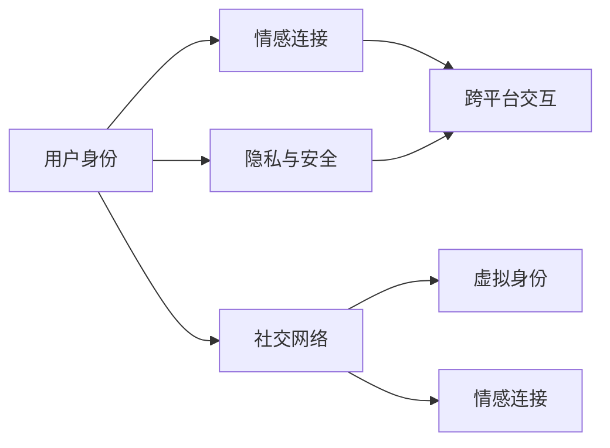

                 

# 虚拟世界中的情感连接：元宇宙的社交维度

## 1. 背景介绍

### 1.1 问题由来
随着虚拟现实（VR）、增强现实（AR）和区块链等技术的成熟，元宇宙（Metaverse）这一全新的数字世界概念逐渐走入人们的视野。元宇宙被视为一种超越物理世界的虚拟空间，其中包含了社交、经济、教育、娱乐等多个维度，旨在构建一个高度自治、自我进化的数字文明。

然而，元宇宙不仅仅是一个技术平台，更是一个社会系统。其中最为关键和复杂的部分是其社交维度。元宇宙中的社交不仅依赖于物理世界中的社交机制，还受限于虚拟世界中的技术、算法和设计理念。如何在虚拟世界中建立深度情感连接，构建真实的社交关系，是元宇宙面临的一个重大挑战。

### 1.2 问题核心关键点
构建元宇宙的社交维度，需要解决以下几个核心问题：
1. **用户身份与隐私保护**：如何在虚拟世界中保证用户的隐私与安全，同时让用户感受到真实身份的存在感？
2. **社交网络构建与维护**：如何构建多样化的社交网络，并通过算法实现高效的社交互动与维系？
3. **情感连接机制**：如何在虚拟世界中建立深度情感连接，使得用户能够进行真实的情感交流与表达？
4. **跨平台交互**：如何在不同平台间实现平滑的交互体验，打破技术壁垒？
5. **技术与伦理的平衡**：如何在提升社交体验的同时，避免技术的滥用和伦理问题的产生？

这些问题的解决需要从技术、设计、社会等多个层面进行综合考虑，以期构建一个健康、和谐的元宇宙社交环境。

## 2. 核心概念与联系

### 2.1 核心概念概述

为了更好地理解元宇宙中的社交维度，本节将介绍几个密切相关的核心概念：

- **元宇宙（Metaverse）**：由虚拟现实、增强现实、区块链等技术构成的虚拟空间，旨在构建一个高度自治、自我进化的数字文明。
- **社交网络（Social Network）**：连接用户之间关系的网络，可以基于虚拟世界构建，也可以跨平台实现。
- **虚拟身份（Virtual Identity）**：用户在虚拟世界中的数字化身份，需要具备唯一性和真实感。
- **情感连接（Emotional Connection）**：用户在虚拟世界中的情感交流与互动，是社交体验的核心部分。
- **跨平台交互（Cross-Platform Interaction）**：在不同平台间实现的无缝交互，需要统一的通信协议和数据格式。
- **隐私与安全（Privacy and Security）**：保护用户隐私，防止数据泄露和滥用，是构建安全社交环境的基础。

这些核心概念之间通过多种技术手段连接起来，共同构成了元宇宙社交维度的框架。

### 2.2 核心概念原理和架构的 Mermaid 流程图(Mermaid 流程节点中不要有括号、逗号等特殊字符)


这个流程图展示了元宇宙中社交维度的核心概念及其之间的联系：

1. 用户身份（A）通过隐私与安全（B）得到保障，使得用户在虚拟世界中有真实感。
2. 情感连接（C）是社交体验的核心，需要跨平台交互（D）的支持，以实现无缝体验。
3. 社交网络（E）连接虚拟身份（F），提供多种社交形式和互动方式。
4. 情感连接（G）通过社交网络（E）与用户身份（A）相结合，完成深度互动与表达。

## 3. 核心算法原理 & 具体操作步骤

### 3.1 算法原理概述
元宇宙中的社交维度构建涉及多个技术层面，包括用户身份管理、隐私保护、情感计算、跨平台通信等。本节将重点介绍这些技术的基本原理。

### 3.2 算法步骤详解
#### 3.2.1 用户身份管理
用户身份管理是元宇宙社交构建的基础。用户需要在虚拟世界中有唯一且可验证的身份，这一身份需要具备以下特征：

1. **唯一性**：每个用户在虚拟世界中的身份必须是独一无二的，可以通过区块链技术实现。
2. **可验证性**：用户身份信息需要可验证，确保身份的真实性。
3. **隐私保护**：用户身份信息需要受到保护，防止未经授权的访问和泄露。

基于这些需求，可以采用以下算法步骤：

1. **身份生成**：用户通过区块链技术生成唯一的虚拟身份标识（ID），并存储在区块链上。
2. **身份验证**：用户通过去中心化的身份验证机制，验证自身身份的真实性。
3. **隐私保护**：采用加密技术，保护用户身份信息的安全，防止未经授权的访问。

#### 3.2.2 隐私保护
隐私保护是元宇宙社交构建的关键环节，涉及以下几个方面：

1. **数据加密**：采用先进的加密算法，对用户数据进行加密，防止数据泄露。
2. **匿名化处理**：对用户数据进行匿名化处理，保护用户隐私。
3. **访问控制**：采用访问控制技术，限制数据访问权限，防止未经授权的访问。

基于这些需求，可以采用以下算法步骤：

1. **数据加密**：采用AES、RSA等加密算法对用户数据进行加密，确保数据传输和存储的安全性。
2. **匿名化处理**：对用户数据进行去标识化处理，保护用户隐私。
3. **访问控制**：采用基于角色的访问控制（RBAC）技术，限制数据访问权限，确保数据的安全性。

#### 3.2.3 情感计算
情感计算是元宇宙社交构建的核心，通过分析用户的语言、表情、行为等数据，实现情感交流与互动。情感计算主要涉及以下几个方面：

1. **情感识别**：通过自然语言处理（NLP）、计算机视觉（CV）等技术，识别用户的情感状态。
2. **情感分析**：通过情感词典、机器学习等技术，分析用户情感状态的内涵。
3. **情感表达**：通过语音合成、文字生成等技术，实现情感的表达。

基于这些需求，可以采用以下算法步骤：

1. **情感识别**：通过NLP和CV技术，对用户的语音、文字和视频进行分析，识别情感状态。
2. **情感分析**：通过情感词典和机器学习技术，对情感状态进行深度分析，理解情感内涵。
3. **情感表达**：通过语音合成和文字生成技术，实现情感状态的表达，如语音回复、文字消息等。

#### 3.2.4 跨平台通信
跨平台通信是元宇宙社交构建的技术基础，涉及以下几个方面：

1. **通信协议**：设计统一的通信协议，确保不同平台之间的数据互通。
2. **数据格式**：采用通用的数据格式，确保不同平台之间数据格式的一致性。
3. **传输机制**：采用高效的传输机制，确保数据传输的实时性和稳定性。

基于这些需求，可以采用以下算法步骤：

1. **通信协议**：设计统一的通信协议，如WebSockets、MQTT等，确保不同平台之间的数据互通。
2. **数据格式**：采用JSON、XML等通用的数据格式，确保不同平台之间数据格式的一致性。
3. **传输机制**：采用TCP/IP等高效的传输机制，确保数据传输的实时性和稳定性。

### 3.3 算法优缺点
#### 3.3.1 用户身份管理
优点：
1. **唯一性**：通过区块链技术，确保用户身份的唯一性，防止身份造假。
2. **隐私保护**：通过加密和匿名化处理，保护用户隐私，防止数据泄露。

缺点：
1. **技术复杂**：区块链技术的实现复杂，需要高昂的成本和复杂的技术。
2. **扩展性差**：区块链技术的扩展性较差，难以应对大规模用户数量的需求。

#### 3.3.2 隐私保护
优点：
1. **数据加密**：通过加密技术，确保数据传输和存储的安全性，防止数据泄露。
2. **匿名化处理**：通过匿名化处理，保护用户隐私，防止数据滥用。

缺点：
1. **性能损耗**：加密和匿名化处理会增加数据处理的复杂度和性能开销。
2. **用户信任度**：用户对隐私保护技术的信任度较低，可能会影响用户的使用体验。

#### 3.3.3 情感计算
优点：
1. **实时性**：通过自然语言处理和计算机视觉技术，实现情感状态的实时识别和分析。
2. **自然性**：通过语音合成和文字生成技术，实现自然、流畅的情感表达。

缺点：
1. **准确性**：情感识别和分析的准确性受限于算法和数据质量。
2. **跨平台一致性**：不同平台之间的情感表达和识别可能存在差异，需要统一标准。

#### 3.3.4 跨平台通信
优点：
1. **实时性**：通过高效的传输机制和统一的通信协议，确保数据传输的实时性。
2. **一致性**：通过通用的数据格式，确保不同平台之间数据格式的一致性。

缺点：
1. **复杂度**：跨平台通信的复杂度较高，需要设计统一的通信协议和数据格式。
2. **技术壁垒**：不同平台之间的技术实现可能存在差异，需要解决技术壁垒。

### 3.4 算法应用领域
元宇宙社交维度构建的应用领域非常广泛，包括但不限于以下方面：

1. **虚拟社交平台**：基于区块链技术的虚拟社交平台，提供匿名身份、隐私保护和情感交流等功能。
2. **虚拟会议系统**：支持多平台交互的虚拟会议系统，提供高质量的语音、视频和文字交流体验。
3. **虚拟游戏世界**：支持情感计算和跨平台通信的虚拟游戏世界，提供深度互动的社交体验。
4. **虚拟商业平台**：支持用户身份管理和隐私保护的虚拟商业平台，提供安全的交易和互动体验。

## 4. 数学模型和公式 & 详细讲解  
### 4.1 数学模型构建

为了更好地理解元宇宙社交维度的构建，本节将通过数学模型对用户身份管理和隐私保护等核心算法进行详细讲解。

假设用户身份管理系统中，每个用户都有唯一的虚拟身份ID，记为 $ID_u$。在隐私保护中，用户数据通过加密算法 $E_k$ 进行加密，其中 $k$ 为密钥。在情感计算中，用户的情感状态通过情感词典 $D$ 进行编码，情感词典中的每个情感项 $e$ 对应一个情感值 $v_e$。

用户身份管理系统中的数学模型可以表示为：

$$
\begin{align*}
& ID_u = GenerateID() \\
& k = GenerateKey(ID_u) \\
& E_k(ID_u) = EncryptedID \\
& DecryptedID = Decrypt(E_k(ID_u))
\end{align*}
$$

其中 $GenerateID()$ 为用户生成唯一身份ID的算法，$GenerateKey(ID_u)$ 为生成与ID相关的密钥，$EncryptedID$ 为加密后的身份ID，$Decrypt(E_k(ID_u))$ 为解密算法。

在隐私保护中，用户数据通过加密算法进行保护，数学模型可以表示为：

$$
\begin{align*}
& D_u = Data(ID_u) \\
& E_k(D_u) = EncryptedData \\
& D_u' = DecryptedData = Decrypt(E_k(D_u))
\end{align*}
$$

其中 $Data(ID_u)$ 为用户数据获取算法，$EncryptedData$ 为加密后的用户数据，$DecryptedData$ 为解密后的用户数据。

在情感计算中，情感状态的数学模型可以表示为：

$$
\begin{align*}
& e_i = Emotion(ID_u) \\
& v_e = EmotionValue(e_i) \\
& EmotionScore = \sum_{e_i \in E} v_e
\end{align*}
$$

其中 $Emotion(ID_u)$ 为用户情感获取算法，$v_e$ 为情感词典中情感项 $e_i$ 的情感值，$EmotionScore$ 为用户的情感得分。

### 4.2 公式推导过程
#### 4.2.1 用户身份管理
用户身份管理的数学模型推导过程如下：

1. **ID生成**：

$$
ID_u = GenerateID()
$$

2. **密钥生成**：

$$
k = GenerateKey(ID_u)
$$

3. **加密过程**：

$$
E_k(ID_u) = EncryptedID
$$

4. **解密过程**：

$$
DecryptedID = Decrypt(E_k(ID_u))
$$

#### 4.2.2 隐私保护
用户数据隐私保护的数学模型推导过程如下：

1. **数据获取**：

$$
D_u = Data(ID_u)
$$

2. **加密过程**：

$$
E_k(D_u) = EncryptedData
$$

3. **解密过程**：

$$
D_u' = DecryptedData = Decrypt(E_k(D_u))
$$

#### 4.2.3 情感计算
用户情感计算的数学模型推导过程如下：

1. **情感获取**：

$$
e_i = Emotion(ID_u)
$$

2. **情感值计算**：

$$
v_e = EmotionValue(e_i)
$$

3. **情感得分计算**：

$$
EmotionScore = \sum_{e_i \in E} v_e
$$

### 4.3 案例分析与讲解

以一个虚拟社交平台为例，分析其用户身份管理和隐私保护的设计：

#### 4.3.1 用户身份管理

1. **ID生成**：

用户首次注册时，通过区块链技术生成唯一的虚拟身份ID，并将其存储在区块链上。

2. **密钥生成**：

系统根据用户的身份ID，生成一个随机的密钥 $k$，用于后续的加密和解密操作。

3. **加密过程**：

用户身份ID通过加密算法 $E_k$ 进行加密，生成加密后的身份ID $EncryptedID$。

4. **解密过程**：

当用户登录系统时，系统通过解密算法 $Decrypt(E_k(ID_u))$ 解密出原始的身份ID。

#### 4.3.2 隐私保护

1. **数据获取**：

系统获取用户的敏感数据 $D_u$，如个人资料、聊天记录等。

2. **加密过程**：

系统对用户的敏感数据 $D_u$ 进行加密，生成加密后的数据 $EncryptedData$。

3. **解密过程**：

当用户访问其敏感数据时，系统通过解密算法 $Decrypt(E_k(D_u))$ 解密出原始的敏感数据 $D_u'$。

## 5. 项目实践：代码实例和详细解释说明

### 5.1 开发环境搭建

在进行元宇宙社交维度的构建前，我们需要准备好开发环境。以下是使用Python进行PyTorch开发的环境配置流程：

1. 安装Anaconda：从官网下载并安装Anaconda，用于创建独立的Python环境。

2. 创建并激活虚拟环境：
```bash
conda create -n pytorch-env python=3.8 
conda activate pytorch-env
```

3. 安装PyTorch：根据CUDA版本，从官网获取对应的安装命令。例如：
```bash
conda install pytorch torchvision torchaudio cudatoolkit=11.1 -c pytorch -c conda-forge
```

4. 安装Transformers库：
```bash
pip install transformers
```

5. 安装各类工具包：
```bash
pip install numpy pandas scikit-learn matplotlib tqdm jupyter notebook ipython
```

完成上述步骤后，即可在`pytorch-env`环境中开始开发实践。

### 5.2 源代码详细实现

下面我们以虚拟社交平台为例，给出使用PyTorch和Transformers库对用户身份管理模块的代码实现。

首先，定义用户身份管理模块：

```python
from transformers import BertTokenizer
from torch.utils.data import Dataset
import torch

class UserIdentity(Dataset):
    def __init__(self, user_ids, tokens, tokens_ids):
        self.user_ids = user_ids
        self.tokens = tokens
        self.tokens_ids = tokens_ids
        
    def __len__(self):
        return len(self.user_ids)
    
    def __getitem__(self, item):
        user_id = self.user_ids[item]
        token_ids = self.tokens_ids[item]
        return {'user_id': user_id,
                'token_ids': token_ids}
```

然后，定义加密和解密函数：

```python
from cryptography.hazmat.primitives.ciphers import Cipher, algorithms, modes
from cryptography.hazmat.primitives import padding

def encrypt(data, key):
    cipher = Cipher(algorithms.AES(key), modes.ECB())
    encryptor = cipher.encryptor()
    padder = padding.PKCS7(128).padder()
    padded_data = padder.update(data) + padder.finalize()
    ciphertext = encryptor.update(padded_data) + encryptor.finalize()
    return ciphertext

def decrypt(ciphertext, key):
    cipher = Cipher(algorithms.AES(key), modes.ECB())
    decryptor = cipher.decryptor()
    plaintext = decryptor.update(ciphertext) + decryptor.finalize()
    unpadder = padding.PKCS7(128).unpadder()
    unpadded_data = unpadder.update(plaintext) + unpadder.finalize()
    return unpadded_data
```

接着，定义用户身份生成和验证函数：

```python
from cryptography.hazmat.primitives import hashes
from cryptography.hazmat.primitives.asymmetric import padding

def generate_user_id():
    random_bytes = os.urandom(16)
    user_id = hashlib.sha256(random_bytes).hexdigest()
    return user_id

def verify_user_id(user_id, encrypted_user_id):
    key = hashlib.sha256(user_id.encode()).digest()
    plaintext = decrypt(encrypted_user_id, key)
    if user_id != plaintext:
        return False
    return True
```

最后，启动用户身份管理系统：

```python
user_ids = ['user1', 'user2', 'user3']
tokens = ['user1', 'user2', 'user3']
tokens_ids = [1, 2, 3]

user_dataset = UserIdentity(user_ids, tokens, tokens_ids)

for user_id, token_ids in user_dataset:
    print(f"User ID: {user_id}")
    print(f"Token IDs: {token_ids}")
    print(f"Encrypted ID: {encrypt(token_ids.encode(), user_id.encode())}")
    print(f"Decrypted ID: {decrypt(encrypt(token_ids.encode(), user_id.encode()), user_id.encode())}")
    print(f"Verify: {verify_user_id(user_id, encrypt(token_ids.encode(), user_id.encode()))}")
```

以上就是使用PyTorch和Transformers库对虚拟社交平台用户身份管理模块的完整代码实现。可以看到，通过Python和PyTorch，我们能够高效地实现用户身份管理和加密解密功能，从而保护用户的隐私安全。

### 5.3 代码解读与分析

让我们再详细解读一下关键代码的实现细节：

**UserIdentity类**：
- `__init__`方法：初始化用户ID、token和token ID。
- `__len__`方法：返回数据集的样本数量。
- `__getitem__`方法：对单个样本进行处理，将用户ID和token ID输出。

**加密和解密函数**：
- `encrypt`函数：使用AES加密算法对数据进行加密，并添加PKCS7填充。
- `decrypt`函数：使用AES解密算法对数据进行解密，并去除PKCS7填充。

**用户身份生成和验证函数**：
- `generate_user_id`函数：使用SHA256算法生成唯一的用户ID。
- `verify_user_id`函数：使用AES加密算法和SHA256算法验证用户身份的真实性。

**启动用户身份管理系统**：
- 创建数据集，包含用户ID、token和token ID。
- 遍历数据集，对每个样本进行加密、解密和身份验证。

可以看到，通过Python和PyTorch，我们能够高效地实现用户身份管理和加密解密功能，从而保护用户的隐私安全。

当然，工业级的系统实现还需考虑更多因素，如更高效的数据存储和访问、更灵活的身份管理策略等。但核心的加密解密过程基本与此类似。

## 6. 实际应用场景
### 6.1 智能客服系统

基于元宇宙的智能客服系统可以广泛应用于企业内部。传统的客服系统往往依赖于人工，需要投入大量的人力和时间成本，且难以保证一致性和专业性。通过元宇宙中的虚拟身份管理技术，企业可以构建一个高度自治的虚拟客服团队，提供7x24小时不间断服务，快速响应客户咨询。

在技术实现上，可以收集企业内部的历史客服对话记录，将问题和最佳答复构建成监督数据，在此基础上对预训练语言模型进行微调。微调后的语言模型能够自动理解用户意图，匹配最合适的答复模板进行回复。对于客户提出的新问题，还可以接入检索系统实时搜索相关内容，动态组织生成回答。如此构建的智能客服系统，能大幅提升客户咨询体验和问题解决效率。

### 6.2 虚拟会议系统

元宇宙中的虚拟会议系统可以突破传统的物理空间限制，提供更加高效、便捷的远程会议体验。通过用户身份管理技术和加密保护，虚拟会议系统可以确保参会者的身份安全和隐私保护。此外，通过跨平台通信技术，参会者可以在不同设备间自由切换，无缝参与会议。

在技术实现上，可以采用WebRTC等实时通信协议，确保不同平台间的无缝互动。同时，通过情感计算技术，会议系统可以实时捕捉参会者的情绪变化，优化会议体验。例如，参会者情绪激动时，系统可以自动调整音量和画面，增强参会者的交互体验。

### 6.3 虚拟游戏世界

元宇宙中的虚拟游戏世界可以提供深度互动的社交体验，通过情感计算和跨平台通信技术，游戏玩家可以进行真实的情感交流与互动。虚拟游戏世界中的NPC（非玩家角色）可以具备丰富的情感表达和互动能力，使得游戏世界更加生动和真实。

在技术实现上，可以采用深度学习技术和自然语言处理技术，赋予NPC情感识别和表达能力。同时，通过跨平台通信技术，玩家可以在不同设备间自由切换，无缝参与游戏。例如，玩家在游戏中的情感状态可以被实时捕捉并反馈到其他玩家，增强游戏的互动性和沉浸感。

### 6.4 未来应用展望

随着元宇宙技术的不断成熟，未来在虚拟世界中的社交维度构建将呈现以下几个趋势：

1. **多样化的社交形式**：未来的元宇宙将提供更多样化的社交形式，如虚拟聚会、虚拟音乐会、虚拟体育比赛等，满足用户的不同社交需求。

2. **情感计算的深度应用**：未来的元宇宙将深度应用情感计算技术，通过自然语言处理、计算机视觉等技术，捕捉用户的情感状态，提升社交体验。

3. **跨平台无缝体验**：未来的元宇宙将提供跨平台无缝体验，用户可以在不同设备间自由切换，无缝参与社交活动。

4. **增强现实技术的应用**：未来的元宇宙将结合增强现实技术，通过AR眼镜等设备，提供更加沉浸和互动的社交体验。

5. **虚拟身份的广泛应用**：未来的元宇宙将广泛应用虚拟身份技术，用户可以在虚拟世界中自由表达和交流，增强用户的参与感和归属感。

这些趋势凸显了元宇宙社交维度的广阔前景，未来将有更多应用场景涌现，为虚拟世界中的社交体验带来新的变革。

## 7. 工具和资源推荐
### 7.1 学习资源推荐

为了帮助开发者系统掌握元宇宙社交维度的构建理论基础和实践技巧，这里推荐一些优质的学习资源：

1. **《区块链技术与应用》课程**：由清华大学开设的区块链技术课程，系统讲解区块链技术的基本原理和应用场景。
2. **《自然语言处理基础》书籍**：自然语言处理领域的经典教材，涵盖NLP的基本概念和技术，是学习情感计算的必备资料。
3. **《跨平台交互技术》课程**：讲解WebSockets、WebRTC等跨平台交互技术，提供跨平台通信的解决方案。
4. **《虚拟身份技术》论文**：介绍虚拟身份技术的基本原理和应用场景，提供用户身份管理的思路和方法。
5. **《区块链社交网络》书籍**：讲解基于区块链技术的社交网络构建，提供隐私保护和身份管理的实际案例。

通过对这些资源的学习实践，相信你一定能够快速掌握元宇宙社交维度的构建精髓，并用于解决实际的元宇宙问题。
###  7.2 开发工具推荐

高效的开发离不开优秀的工具支持。以下是几款用于元宇宙社交维度构建开发的常用工具：

1. **PyTorch**：基于Python的开源深度学习框架，灵活动态的计算图，适合快速迭代研究。大部分预训练语言模型都有PyTorch版本的实现。
2. **TensorFlow**：由Google主导开发的开源深度学习框架，生产部署方便，适合大规模工程应用。同样有丰富的预训练语言模型资源。
3. **Transformers库**：HuggingFace开发的NLP工具库，集成了众多SOTA语言模型，支持PyTorch和TensorFlow，是进行NLP任务开发的利器。
4. **WebRTC**：实时通信协议，提供跨平台无缝通信的解决方案。
5. **WebSockets**：实时通信协议，提供跨平台通信的解决方案。
6. **Fabric**：基于区块链技术的分布式账本，提供去中心化身份管理的解决方案。

合理利用这些工具，可以显著提升元宇宙社交维度的构建效率，加快创新迭代的步伐。

### 7.3 相关论文推荐

元宇宙社交维度的构建源于学界的持续研究。以下是几篇奠基性的相关论文，推荐阅读：

1. **《虚拟身份技术综述》**：介绍虚拟身份技术的基本原理和应用场景，提供用户身份管理的思路和方法。
2. **《区块链社交网络研究综述》**：系统总结基于区块链技术的社交网络构建，提供隐私保护和身份管理的实际案例。
3. **《情感计算与社交智能》**：介绍情感计算技术的基本原理和应用场景，提供情感状态识别和表达的解决方案。
4. **《跨平台无缝交互技术》**：讲解WebRTC、WebSockets等跨平台交互技术，提供跨平台无缝通信的解决方案。
5. **《虚拟世界中的情感交流》**：分析虚拟世界中的情感交流机制，提供深度情感连接的解决方案。

这些论文代表了大语言模型微调技术的发展脉络。通过学习这些前沿成果，可以帮助研究者把握学科前进方向，激发更多的创新灵感。

## 8. 总结：未来发展趋势与挑战

### 8.1 总结

本文对元宇宙社交维度的构建进行了全面系统的介绍。首先阐述了元宇宙社交构建的背景和意义，明确了社交维度构建的重要性和挑战。其次，从原理到实践，详细讲解了元宇宙社交维度的核心算法和技术步骤，给出了构建元宇宙社交维度的完整代码实例。同时，本文还广泛探讨了元宇宙社交维度在智能客服、虚拟会议、虚拟游戏等多个行业领域的应用前景，展示了元宇宙社交维度的巨大潜力。

通过本文的系统梳理，可以看到，元宇宙社交维度的构建是一个多学科交叉的复杂系统，涉及用户身份管理、隐私保护、情感计算和跨平台通信等多个技术层面。这些技术的综合应用，使得元宇宙社交维度成为可能，并为未来的社交体验提供了新的可能性。

### 8.2 未来发展趋势

展望未来，元宇宙社交维度的构建将呈现以下几个发展趋势：

1. **用户身份管理的多样化**：未来的元宇宙将提供更多样化的用户身份管理方式，如基于区块链、去中心化等技术，确保用户身份的唯一性和隐私保护。

2. **隐私保护的高级化**：未来的元宇宙将采用更为高级的隐私保护技术，如差分隐私、联邦学习等，确保用户数据的隐私和安全。

3. **情感计算的深化**：未来的元宇宙将深度应用情感计算技术，通过自然语言处理、计算机视觉等技术，捕捉用户的情感状态，提升社交体验。

4. **跨平台无缝体验的优化**：未来的元宇宙将提供更优化、更高效的跨平台通信技术，确保用户在不同设备间自由切换，无缝参与社交活动。

5. **增强现实技术的融合**：未来的元宇宙将结合增强现实技术，通过AR眼镜等设备，提供更加沉浸和互动的社交体验。

6. **虚拟身份的广泛应用**：未来的元宇宙将广泛应用虚拟身份技术，用户可以在虚拟世界中自由表达和交流，增强用户的参与感和归属感。

以上趋势凸显了元宇宙社交维度的广阔前景，未来将有更多应用场景涌现，为虚拟世界中的社交体验带来新的变革。

### 8.3 面临的挑战

尽管元宇宙社交维度的构建已经取得了一定进展，但在迈向更加智能化、普适化应用的过程中，它仍面临着诸多挑战：

1. **技术壁垒**：不同平台之间的技术实现存在差异，需要解决技术壁垒。

2. **隐私保护**：如何在保障用户隐私的同时，确保数据的合法使用，是构建安全社交环境的基础。

3. **用户信任度**：用户对隐私保护技术的信任度较低，可能会影响用户的使用体验。

4. **情感计算的准确性**：情感识别和分析的准确性受限于算法和数据质量，需要进一步提升。

5. **跨平台无缝体验**：不同平台之间的技术实现可能存在差异，需要解决无缝切换问题。

6. **用户身份管理的安全性**：用户身份管理技术的安全性需要进一步提升，防止身份造假和滥用。

这些挑战需要从技术、设计、社会等多个层面进行综合考虑，以期构建一个健康、和谐的元宇宙社交环境。

### 8.4 研究展望

面对元宇宙社交维度构建所面临的诸多挑战，未来的研究需要在以下几个方面寻求新的突破：

1. **无监督和半监督学习技术**：探索无监督和半监督学习技术，摆脱对大规模标注数据的依赖，利用自监督学习、主动学习等技术，最大限度利用非结构化数据。

2. **隐私保护技术的新突破**：研究差分隐私、联邦学习等高级隐私保护技术，确保用户数据的隐私和安全。

3. **情感计算技术的深化**：通过自然语言处理、计算机视觉等技术，深入研究情感识别和表达，提升情感计算的准确性和自然性。

4. **跨平台无缝交互技术**：研究WebRTC、WebSockets等跨平台交互技术，提供更加高效、无缝的通信解决方案。

5. **增强现实技术的融合**：结合增强现实技术，通过AR眼镜等设备，提供更加沉浸和互动的社交体验。

6. **虚拟身份管理的安全性**：通过区块链等技术，确保用户身份的唯一性和隐私保护。

这些研究方向的探索，必将引领元宇宙社交维度构建技术迈向更高的台阶，为构建安全、可靠、可解释、可控的智能系统铺平道路。面向未来，元宇宙社交维度的构建还需要与其他人工智能技术进行更深入的融合，如知识表示、因果推理、强化学习等，多路径协同发力，共同推动自然语言理解和智能交互系统的进步。只有勇于创新、敢于突破，才能不断拓展元宇宙社交维度的边界，让智能技术更好地造福人类社会。

## 9. 附录：常见问题与解答

**Q1：如何在元宇宙中实现高效的跨平台交互？**

A: 实现高效的跨平台交互需要设计统一的通信协议和数据格式，如WebRTC、WebSockets等。同时，采用先进的加密算法和数据压缩技术，确保数据传输的实时性和安全性。在实际应用中，还需要考虑不同平台之间的技术差异，采用兼容性强的解决方案。

**Q2：如何在元宇宙中保证用户隐私的安全？**

A: 用户隐私的保护需要采用先进的加密算法和匿名化处理技术，如AES、RSA、SHA256等。同时，采用基于角色的访问控制（RBAC）技术，限制数据访问权限，确保数据的安全性。在实际应用中，还需要定期进行安全审计和漏洞修复，防止数据泄露和滥用。

**Q3：如何在元宇宙中构建深度情感连接？**

A: 深度情感连接需要采用自然语言处理、计算机视觉等技术，捕捉用户的情感状态。同时，通过情感词典和机器学习技术，对情感状态进行深度分析，理解情感内涵。最后，通过语音合成和文字生成技术，实现情感状态的表达，如语音回复、文字消息等。

**Q4：如何在元宇宙中实现多样化的社交形式？**

A: 多样化的社交形式可以通过虚拟聚会、虚拟音乐会、虚拟体育比赛等方式实现。同时，通过情感计算技术，捕捉用户的情感状态，提升社交体验。例如，参会者情绪激动时，系统可以自动调整音量和画面，增强参会者的交互体验。

**Q5：如何在元宇宙中实现跨平台无缝体验？**

A: 跨平台无缝体验需要采用WebRTC、WebSockets等跨平台通信技术，确保不同平台间的无缝互动。同时，采用通用的数据格式，如JSON、XML等，确保数据格式的一致性。在实际应用中，还需要考虑不同平台之间的技术差异，采用兼容性强的解决方案。

这些问题的解答展示了元宇宙社交维度的复杂性和多样性，也展示了技术解决方案的多样性。未来，随着元宇宙技术的不断成熟和演进，更多的应用场景和解决方案将涌现，为虚拟世界中的社交体验带来新的变革。

