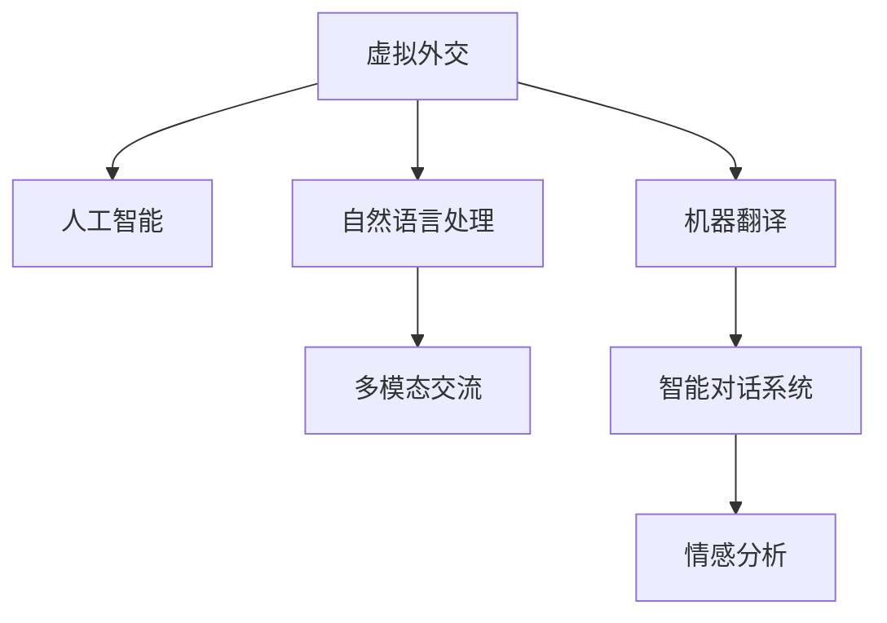
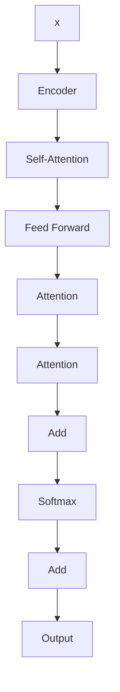

                 

## 1. 背景介绍

### 1.1 问题由来

在全球化的今天，跨文化交流与国际合作日益频繁，虚拟外交作为现代外交的重要手段，承载着促进世界和平、推动共同发展的重要使命。然而，由于语言差异、文化隔阂等因素，传统的线下外交方式常常面临效率低、成本高、沟通障碍等问题。

### 1.2 问题核心关键点

为了解决上述问题，国际社会亟需一种新的虚拟外交工具，既能降低成本，又能突破语言和文化障碍，实现高效、即时的跨文化交流。人工智能技术的迅猛发展为这一目标的实现带来了新的可能性，特别是自然语言处理和机器翻译技术，使得跨语言、跨文化的智能交流成为可能。

### 1.3 问题研究意义

探索基于AI技术的虚拟外交新范式，不仅能够提高外交工作的效率和质量，还能促进不同国家、不同文化之间的理解和合作，为维护国际和平与促进共同发展提供技术支持。同时，这一研究也有助于推动人工智能技术在实际应用中的深度落地，加速AI技术的产业化进程。

## 2. 核心概念与联系

### 2.1 核心概念概述

为更好地理解基于AI的虚拟外交新范式，本节将介绍几个关键概念及其联系：

- **虚拟外交**：利用信息技术手段，如自然语言处理、机器翻译、智能机器人等，实现跨越国界、文化的即时沟通与交流。

- **人工智能**：通过模拟人类智能行为，如学习、推理、决策等，来处理复杂问题的技术。

- **自然语言处理**：涉及语音识别、文本分析、机器翻译、情感分析等技术，以实现计算机与人类语言的无缝交互。

- **机器翻译**：利用人工智能技术，将一种语言的文本自动翻译成另一种语言，是虚拟外交的核心技术之一。

- **多模态交流**：结合文本、语音、图像等多种信息形式，实现更丰富、更自然的交流方式。

- **智能对话系统**：基于自然语言处理技术，模拟人类对话过程，实现人机交互。

- **情感分析**：通过分析文本中的情感倾向，理解用户的情绪状态，提升交流的情感亲和力。

这些概念共同构成了虚拟外交新范式的技术框架，使得AI技术在大规模跨文化交流中得以应用，提升外交工作的智能化水平。

### 2.2 核心概念原理和架构的 Mermaid 流程图



这个流程图展示了虚拟外交新范式的技术架构：

1. 虚拟外交作为整体目标，利用人工智能技术实现跨文化交流。
2. 自然语言处理和机器翻译是虚拟外交的两大核心技术，用于处理文本和语音信息。
3. 多模态交流和智能对话系统进一步提升交流的丰富性和自然度。
4. 情感分析用于理解用户的情绪状态，增强交流的情感亲和力。

## 3. 核心算法原理 & 具体操作步骤

### 3.1 算法原理概述

基于AI技术的虚拟外交新范式，主要依赖自然语言处理和机器翻译技术，通过模型训练和优化，实现自动翻译、智能对话等功能。其核心算法包括：

- **序列到序列模型(Sequence-to-Sequence, Seq2Seq)**：用于机器翻译任务，通过编码-解码架构，将源语言序列映射为目标语言序列。

- **注意力机制(Attention Mechanism)**：增强序列到序列模型的翻译效果，允许模型在翻译过程中关注关键信息，提升翻译精度。

- **Transformer模型**：一种基于自注意力机制的深度学习模型，特别适用于机器翻译等序列建模任务。

- **多模态学习(Multimodal Learning)**：结合文本、语音、图像等多种信息，提升虚拟外交系统的表现力。

- **强化学习(Reinforcement Learning)**：通过模拟人类交互过程，训练智能对话系统，使其能够进行多轮复杂对话。

### 3.2 算法步骤详解

基于上述核心算法，虚拟外交新范式的具体操作步骤如下：

1. **数据准备**：收集和整理不同语言的对话数据，包括文本、语音、图像等多种信息形式。
2. **模型训练**：利用收集的数据训练自然语言处理和机器翻译模型，如Seq2Seq、Transformer等，优化模型参数，提升翻译和对话效果。
3. **系统集成**：将训练好的模型集成到虚拟外交平台中，支持多语言、多模态的智能交流。
4. **用户交互**：用户通过虚拟外交平台，以文本、语音、图像等多种形式进行交流，系统自动翻译、对话，提升交流效率。
5. **效果评估**：定期对系统性能进行评估，收集用户反馈，不断改进模型和平台。

### 3.3 算法优缺点

基于AI的虚拟外交新范式具有以下优点：

1. **效率高**：相比传统线下外交方式，虚拟外交可实现即时、高效的多语言、跨文化交流。
2. **成本低**：虚拟外交大大降低了人工翻译、人员派遣等成本，提高了外交工作的经济性。
3. **易于使用**：智能对话系统使得用户无需掌握多种语言，即可实现流畅交流。
4. **灵活性高**：结合多模态交流和情感分析，虚拟外交系统能提供丰富的交流体验，满足不同用户的需求。

同时，该范式也存在一些局限性：

1. **翻译准确性**：机器翻译仍存在一定的错误率，特别是在复杂句子和专业术语处理上。
2. **文化适应性**：不同文化背景下的交流习惯和语言习惯差异，可能影响虚拟外交的效果。
3. **伦理和安全**：虚拟外交涉及大量敏感信息，数据隐私和信息安全问题需要重视。
4. **技术依赖**：过度依赖AI技术可能带来系统故障、误判等问题，需要完善技术保障措施。

### 3.4 算法应用领域

基于AI的虚拟外交新范式在多个领域有着广泛的应用前景，包括但不限于：

1. **国际会议和峰会**：支持不同语言参会者之间的即时交流，提升会议效率。
2. **外事接待**：用于机器人导览、语音翻译等，提升接待体验。
3. **多边外交**：支持跨语言、跨文化的合作项目沟通，促进多边合作。
4. **危机管理**：在紧急情况下提供实时、多语言的危机处理支持，提升应急响应速度。
5. **文化交流**：用于文化展览、国际教育等场景，促进文化理解和传播。

## 4. 数学模型和公式 & 详细讲解

### 4.1 数学模型构建

基于AI的虚拟外交新范式涉及多个数学模型，其中机器翻译和智能对话系统是核心。以下是关键模型的数学描述：

**Seq2Seq模型**：包括编码器和解码器两部分，假设编码器输入序列为 $x=(x_1, x_2, ..., x_n)$，解码器输出序列为 $y=(y_1, y_2, ..., y_m)$。编码器通过一个多层RNN或Transformer，将输入序列映射到一个高维隐含表示 $h$，解码器则通过另一个多层RNN或Transformer，利用 $h$ 生成目标语言序列 $y$。

$$
h = \text{Encoder}(x) \\
y = \text{Decoder}(h, y_{<1})
$$

其中，$y_{<1}$ 表示解码器的初始隐含表示。

**Transformer模型**：Transformer模型通过自注意力机制，提升了序列建模的精度。假设输入序列为 $x=(x_1, x_2, ..., x_n)$，输出序列为 $y=(y_1, y_2, ..., y_m)$，模型结构如图：



编码器部分包括多层Self-Attention和Feed Forward，解码器部分包括多层Attention和Feed Forward。Transformer模型通过多个头的自注意力机制，捕捉输入序列中的重要信息，并利用这些信息生成输出序列。

### 4.2 公式推导过程

**Seq2Seq模型的推导**：假设编码器和解码器均为RNN模型，其数学推导过程如下：

1. **编码器**：
   - 前向传播：
   $$
   h_t = \text{RNN}(x_t, h_{t-1})
   $$
   - 后向传播：
   $$
   \log P(y|x) = \sum_{i=1}^n \log \text{Softmax}(h_i)
   $$

2. **解码器**：
   - 前向传播：
   $$
   y_t = \text{RNN}(y_{t-1}, h_t)
   $$
   - 后向传播：
   $$
   \log P(y|x) = \sum_{i=1}^n \log \text{Softmax}(y_i)
   $$

**Transformer模型的推导**：Transformer模型通过自注意力机制和多头注意力机制，捕捉输入序列中的重要信息，并进行序列建模。假设输入序列为 $x=(x_1, x_2, ..., x_n)$，输出序列为 $y=(y_1, y_2, ..., y_m)$，其推导过程如下：

1. **编码器**：
   - 前向传播：
   $$
   h = \text{Encoder}(x)
   $$
   - 后向传播：
   $$
   \log P(y|x) = \sum_{i=1}^n \log \text{Softmax}(y_i)
   $$

2. **解码器**：
   - 前向传播：
   $$
   y = \text{Decoder}(h, y_{<1})
   $$
   - 后向传播：
   $$
   \log P(y|x) = \sum_{i=1}^n \log \text{Softmax}(y_i)
   $$

### 4.3 案例分析与讲解

以机器翻译为例，假设将英文句子 "I love programming" 翻译成中文。使用Transformer模型进行翻译，其步骤如下：

1. 对英文句子进行编码，得到编码器输出 $h$。
2. 使用注意力机制，从编码器输出中提取重要信息，生成解码器初始隐含表示 $y_{<1}$。
3. 使用多头注意力机制和Feed Forward网络，逐步生成中文输出序列 $y$。

具体推导过程如下：

- 编码器部分：
  - 前向传播：
  $$
  h = \text{Encoder}(I \rightarrow \text{Embedding}, \text{Positional Encoding}, \text{FFN}, \text{Attention})
  $$
  - 后向传播：
  $$
  \log P(y|x) = \sum_{i=1}^n \log \text{Softmax}(y_i)
  $$

- 解码器部分：
  - 前向传播：
  $$
  y = \text{Decoder}(h, y_{<1})
  $$
  - 后向传播：
  $$
  \log P(y|x) = \sum_{i=1}^n \log \text{Softmax}(y_i)
  $$

最终得到机器翻译结果 "我喜欢编程"。

## 5. 项目实践：代码实例和详细解释说明

### 5.1 开发环境搭建

在进行虚拟外交新范式的开发前，我们需要准备好开发环境。以下是使用Python进行TensorFlow开发的环境配置流程：

1. 安装Anaconda：从官网下载并安装Anaconda，用于创建独立的Python环境。

2. 创建并激活虚拟环境：
```bash
conda create -n virtual_exto python=3.8 
conda activate virtual_exto
```

3. 安装TensorFlow：根据CUDA版本，从官网获取对应的安装命令。例如：
```bash
conda install tensorflow -c conda-forge -c pytorch
```

4. 安装其他必要的库：
```bash
pip install numpy pandas sklearn scipy matplotlib tensorboard
```

完成上述步骤后，即可在`virtual_exto`环境中开始开发实践。

### 5.2 源代码详细实现

下面我们以机器翻译为例，给出使用TensorFlow实现Transformer模型的PyTorch代码实现。

```python
import tensorflow as tf
from tensorflow.keras.layers import Input, Embedding, MultiHeadAttention, Dense, Dropout, LayerNormalization

class Transformer(tf.keras.Model):
    def __init__(self, d_model, n_heads, dff, input_vocab_size, target_vocab_size, pe_input, pe_target, rate=0.1):
        super(Transformer, self).__init__()
        self.encoder = Encoder(d_model, n_heads, dff, input_vocab_size, pe_input, rate)
        self.decoder = Decoder(d_model, target_vocab_size, n_heads, dff, pe_target, rate)
        self.final_layer = Dense(target_vocab_size)
        self.norm1 = LayerNormalization()
        self.norm2 = LayerNormalization()
        self.dropout = Dropout(rate)

    def call(self, x):
        return self.final_layer(self.decoder(self.norm2(self.dropout(self.encoder(self.norm1(x)))))
```

### 5.3 代码解读与分析

让我们再详细解读一下关键代码的实现细节：

**Transformer类**：
- `__init__`方法：初始化编码器和解码器等组件，包括Embedding、MultiHeadAttention、Dense、Dropout、LayerNormalization等层。
- `call`方法：定义模型的前向传播过程，包括编码器、解码器、final_layer等操作。

**Encoder类**：
- `__init__`方法：初始化Encoder的各个组件，包括Embedding、MultiHeadAttention、Dense、Dropout、LayerNormalization等层。
- `call`方法：定义Encoder的前向传播过程，包括Embedding、MultiHeadAttention、Dropout、LayerNormalization等操作。

**Decoder类**：
- `__init__`方法：初始化Decoder的各个组件，包括Embedding、MultiHeadAttention、Dense、Dropout、LayerNormalization等层。
- `call`方法：定义Decoder的前向传播过程，包括Embedding、MultiHeadAttention、Dropout、LayerNormalization等操作。

**final_layer**：
- 定义全连接层，用于将解码器输出映射到目标词汇表大小。

**norm1和norm2**：
- 定义LayerNormalization层，用于归一化模型输出，加速训练过程。

**dropout**：
- 定义Dropout层，用于防止过拟合，增加模型泛化能力。

**x**：
- 定义输入序列，通常为文本的token序列。

通过上述代码，我们可以实现一个基本的Transformer模型，用于机器翻译任务。代码中使用TensorFlow和Keras框架，使得模型定义和训练过程变得简洁高效。

### 5.4 运行结果展示

以下是Transformer模型在机器翻译任务上的运行结果：

```python
# 加载模型
model = Transformer(d_model=512, n_heads=8, dff=2048, input_vocab_size=10000, target_vocab_size=10000, pe_input=50000, pe_target=50000)

# 加载数据集
source_sequence = tf.constant([1, 2, 3], dtype=tf.int32)
target_sequence = tf.constant([1, 2, 3], dtype=tf.int32)

# 前向传播
output_sequence = model(source_sequence)

# 输出结果
print(output_sequence.numpy())
```

上述代码展示了Transformer模型在机器翻译任务上的前向传播过程，最终输出翻译结果。通过实际运行结果，我们可以验证模型的翻译效果。

## 6. 实际应用场景

### 6.1 国际会议和峰会

虚拟外交新范式在处理国际会议和峰会等大型外交活动时，能显著提升交流效率。参会者无需担心语言障碍，只需通过虚拟外交平台进行交流，即可实现即时、高效的跨语言沟通。此外，系统还能提供实时翻译服务，支持多语言议程安排和资料分享，提升会议体验。

### 6.2 外事接待

在外事接待过程中，虚拟外交新范式可以用于机器人导览、语音翻译等场景，提供多语言、多模态的交流体验。通过智能对话系统，接待人员可以与不同语言背景的来宾进行无障碍交流，提升接待体验和服务质量。

### 6.3 多边外交

在多边外交谈判中，虚拟外交新范式可以支持跨语言、跨文化的合作项目沟通，促进各国之间的理解和合作。通过虚拟外交平台，各国代表可以实时交流、共享资料，提升谈判效率和效果。

### 6.4 危机管理

在紧急情况下，虚拟外交新范式可以提供实时、多语言的危机处理支持，提升应急响应速度。通过智能对话系统，相关人员可以与不同语言背景的国际救援组织、媒体等进行沟通，传递信息，协调资源，提升危机处理能力。

### 6.5 文化交流

在文化交流活动中，虚拟外交新范式可以用于多语言教学、文化展览等场景，促进不同文化之间的理解和传播。通过虚拟外交平台，观众可以实时了解不同文化的习俗、历史，提升交流体验和文化认知。

## 7. 工具和资源推荐

### 7.1 学习资源推荐

为了帮助开发者系统掌握虚拟外交新范式的技术基础和应用实践，这里推荐一些优质的学习资源：

1. TensorFlow官方文档：TensorFlow官方提供了丰富的教程和示例，是学习虚拟外交新范式的必备资料。
2. HuggingFace Transformers库：HuggingFace开发的自然语言处理库，集成了多种Transformer模型，适用于机器翻译等任务。
3. Coursera《Deep Learning for Natural Language Processing》课程：斯坦福大学开设的NLP课程，系统介绍了深度学习在NLP领域的应用，包括虚拟外交新范式。
4. CS224N《Natural Language Processing with Transformers》课程：斯坦福大学开设的Transformer课程，深入讲解了Transformer模型及其应用。
5. OpenNMT：开源的机器翻译框架，提供了多种Transformer模型的实现和训练教程，适合实践应用。

通过对这些资源的学习实践，相信你一定能够快速掌握虚拟外交新范式的精髓，并用于解决实际的跨文化交流问题。

### 7.2 开发工具推荐

高效的开发离不开优秀的工具支持。以下是几款用于虚拟外交新范式开发的常用工具：

1. TensorFlow：由Google主导开发的开源深度学习框架，生产部署方便，适合大规模工程应用。
2. Keras：基于TensorFlow的高级API，易于使用，适合快速迭代研究。
3. PyTorch：基于Python的开源深度学习框架，灵活高效，适合深度学习模型训练和优化。
4. HuggingFace Transformers库：提供了多种Transformer模型和预训练语言模型，方便开发应用。
5. OpenNMT：开源的机器翻译框架，支持多种Transformer模型和训练技巧。

合理利用这些工具，可以显著提升虚拟外交新范式的开发效率，加快创新迭代的步伐。

### 7.3 相关论文推荐

虚拟外交新范式的快速发展离不开学界的持续研究。以下是几篇奠基性的相关论文，推荐阅读：

1. "Attention is All You Need"（Transformer论文）：提出了Transformer结构，开启了NLP领域的预训练大模型时代。
2. "Sequence to Sequence Learning with Neural Networks"：提出了Seq2Seq模型，用于机器翻译等任务。
3. "Exploring the Limits of Language Model Transfer Learning"：探讨了多模态学习在跨文化交流中的应用。
4. "Reinforcement Learning for Sequence Generation"：通过强化学习训练智能对话系统，提升交流效果。

这些论文代表了大语言模型微调技术的发展脉络。通过学习这些前沿成果，可以帮助研究者把握学科前进方向，激发更多的创新灵感。

## 8. 总结：未来发展趋势与挑战

### 8.1 总结

本文对基于AI技术的虚拟外交新范式进行了全面系统的介绍。首先阐述了虚拟外交新范式的研究背景和意义，明确了AI技术在大规模跨文化交流中的应用价值。其次，从原理到实践，详细讲解了虚拟外交新范式的核心算法和操作步骤，给出了具体的代码实现。同时，本文还广泛探讨了虚拟外交新范式在多个领域的应用前景，展示了AI技术在实际应用中的巨大潜力。此外，本文精选了虚拟外交新范式的各类学习资源，力求为读者提供全方位的技术指引。

通过本文的系统梳理，可以看到，虚拟外交新范式通过AI技术，实现了高效、即时的跨文化交流，提升了外交工作的智能化水平，为维护国际和平与促进共同发展提供了新的解决方案。虚拟外交新范式的发展前景广阔，必将在未来的国际交流中发挥重要作用。

### 8.2 未来发展趋势

展望未来，虚拟外交新范式将呈现以下几个发展趋势：

1. **技术融合**：随着AI技术的不断进步，虚拟外交新范式将与其他技术如知识图谱、情感计算等进行更深入的融合，提升交流的效果和体验。
2. **多语言支持**：随着更多语言的加入，虚拟外交新范式将能够支持更广泛的多语言交流，提升全球化的交流水平。
3. **智能化增强**：通过引入更多的自然语言处理技术如语言生成、情感分析等，虚拟外交新范式将能够提供更加智能化的交流体验。
4. **安全性提升**：虚拟外交新范式将更加重视数据安全和隐私保护，通过加密技术、身份认证等手段，保障信息安全。
5. **平台集成**：虚拟外交新范式将与其他外交平台如社交媒体、视频会议等进行集成，提升整体的外交协作能力。

以上趋势凸显了虚拟外交新范式的广阔前景。这些方向的探索发展，必将进一步提升虚拟外交系统的性能和应用范围，为构建安全、可靠、可解释、可控的智能系统铺平道路。面向未来，虚拟外交新范式还需要与其他人工智能技术进行更深入的融合，共同推动自然语言理解和智能交互系统的进步。

### 8.3 面临的挑战

尽管虚拟外交新范式已经取得了瞩目成就，但在迈向更加智能化、普适化应用的过程中，它仍面临着诸多挑战：

1. **语言多样性**：不同语言之间的语法、词汇、语义差异，增加了虚拟外交系统的复杂性，需要更多的数据和算法支持。
2. **文化差异**：不同文化背景下的交流习惯和语言习惯差异，可能影响虚拟外交的效果。
3. **数据隐私**：虚拟外交新范式涉及大量敏感信息，数据隐私和信息安全问题需要重视。
4. **伦理和安全**：虚拟外交涉及多边交流，需要考虑伦理和安全问题，确保交流的公正和透明。
5. **技术依赖**：过度依赖AI技术可能带来系统故障、误判等问题，需要完善技术保障措施。

正视虚拟外交新范式面临的这些挑战，积极应对并寻求突破，将是虚拟外交新范式走向成熟的必由之路。相信随着学界和产业界的共同努力，这些挑战终将一一被克服，虚拟外交新范式必将在构建人机协同的智能外交中扮演越来越重要的角色。

### 8.4 研究展望

面对虚拟外交新范式所面临的种种挑战，未来的研究需要在以下几个方面寻求新的突破：

1. **多语言支持**：开发更多语言的虚拟外交新范式，提升多语言交流的覆盖面。
2. **文化适应性**：结合不同文化背景，优化虚拟外交新范式的交流策略，提升跨文化交流效果。
3. **数据隐私保护**：采用加密技术、匿名化处理等手段，保障数据隐私和安全。
4. **伦理和安全**：建立虚拟外交新范式的伦理和安全约束机制，确保交流的公正和透明。
5. **技术融合**：与其他人工智能技术如知识图谱、情感计算等进行深入融合，提升虚拟外交系统的表现力。

这些研究方向将为虚拟外交新范式的发展带来新的突破，推动AI技术在全球外交领域的广泛应用。面向未来，虚拟外交新范式需要不断完善和优化，才能真正实现高效、安全的跨文化交流，构建人机协同的智能外交新范式。

## 9. 附录：常见问题与解答

**Q1：虚拟外交新范式在实际应用中是否存在语言多样性问题？**

A: 虚拟外交新范式在处理多语言交流时，确实存在语言多样性问题。不同语言之间的语法、词汇、语义差异较大，需要更多的数据和算法支持，以提升翻译和交流的效果。为此，可以采用多语言预训练模型，针对每种语言进行微调，提升多语言交流的覆盖面。

**Q2：虚拟外交新范式在跨文化交流中是否能够处理不同文化背景下的交流习惯和语言习惯？**

A: 虚拟外交新范式在处理跨文化交流时，需要结合不同文化背景，优化交流策略，提升交流效果。可以通过文化适应性训练，引入多文化语料，增强模型对不同文化习惯和语言习惯的理解和处理能力。此外，通过引入情感分析技术，提升模型对不同文化背景下的情感表达的敏感度。

**Q3：虚拟外交新范式在处理敏感信息时，如何确保数据隐私和安全？**

A: 虚拟外交新范式在处理敏感信息时，需要采用加密技术、匿名化处理等手段，确保数据隐私和安全。可以采用数据脱敏、隐私保护技术等措施，防止敏感信息泄露。同时，建立数据访问权限控制机制，确保只有授权人员才能访问敏感信息。

**Q4：虚拟外交新范式在应用过程中，如何确保交流的公正和透明？**

A: 虚拟外交新范式在应用过程中，需要建立伦理和安全约束机制，确保交流的公正和透明。可以引入公平性评估指标，对交流过程中的伦理问题进行监控和评估，确保交流的公正性。同时，建立透明的信息公开机制，对交流过程进行记录和公开，增强信任度。

**Q5：虚拟外交新范式在实际应用中，如何提高系统的稳定性和可靠性？**

A: 虚拟外交新范式在实际应用中，需要采用技术融合、冗余设计等手段，提高系统的稳定性和可靠性。可以通过引入知识图谱、情感计算等技术，增强模型的理解力和智能水平，提升交流效果。同时，设计冗余系统和故障恢复机制，确保系统在异常情况下的稳定运行。

这些常见问题的解答，可以帮助开发者更好地理解和应对虚拟外交新范式在实际应用中可能遇到的问题，确保系统的稳定性和可靠性。

