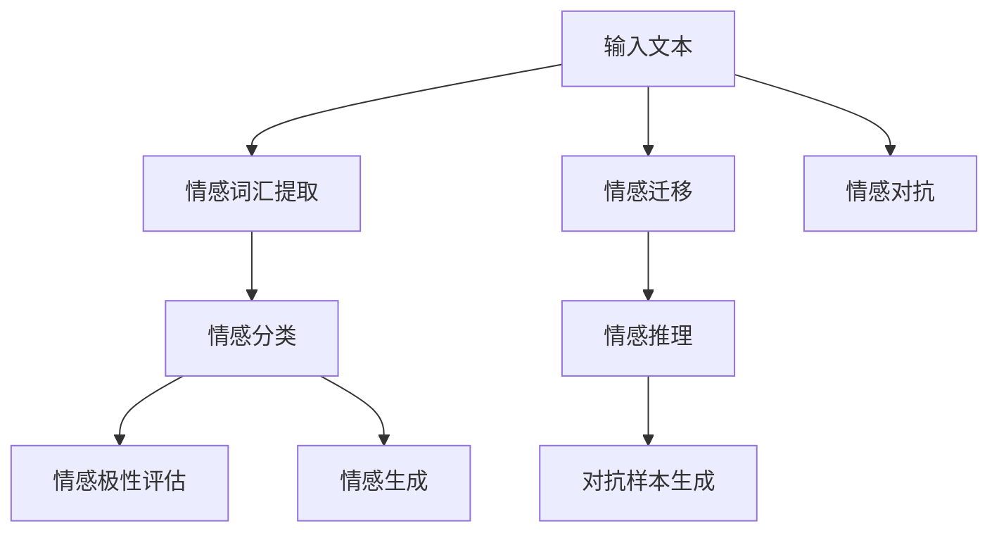

                 

# 虚拟情感地图：AI描绘的人类情感景观

## 1. 背景介绍

情感是人的内心世界的重要组成部分，是人类社会活动的核心驱动之一。情感识别和情感管理技术的应用，在医疗、社交、零售、金融、人机交互等多个领域具有深远影响。近年来，随着人工智能技术的快速发展，利用机器学习模型进行情感分析，已经成为自然语言处理(NLP)领域的研究热点之一。

### 1.1 问题由来

情感分析旨在识别和理解文本数据中隐含的情感倾向，并对其进行分类和情感极性评估。传统基于规则和词典的方法往往依赖于人工标注的数据集，难以捕捉复杂的情感变化和语境细微差异。机器学习模型，特别是深度学习模型，由于其强大的数据学习能力和泛化能力，逐渐成为情感分析的主流方法。

大语言模型，如BERT、GPT等，由于其在大规模无标签文本数据上的预训练能力，具备了对自然语言的高度理解和生成能力，因此在情感分析任务上也表现出色。通过在标注数据集上进行微调，大语言模型能够在新的情感分类任务上取得优于传统方法的性能。

### 1.2 问题核心关键点
大语言模型的情感分析任务，关键点在于以下几个方面：
- 如何高效利用大模型预训练的通用知识，同时针对特定领域的情感分类任务进行微调。
- 如何通过微调优化模型参数，使其在不同情感分类任务中表现出较高的准确性和鲁棒性。
- 如何处理多模态情感数据，如文本、语音、图像等，提升情感分析的全面性和准确性。
- 如何在不依赖标注数据的情况下，利用大模型本身的能力进行零样本或少样本情感推理。

### 1.3 问题研究意义
情感分析技术的提升，对于促进人机交互、增强用户体验、提升客户满意度具有重要意义。通过情感分析，系统可以理解用户情感，提供个性化的服务，如推荐系统中的情感推荐，对话系统中的情感引导等。此外，情感分析还可以用于舆情监测、品牌管理、健康监测等领域，帮助企业和社会更好地理解和管理情感数据。

## 2. 核心概念与联系

### 2.1 核心概念概述

在情感分析任务中，大语言模型通过以下核心概念和算法实现其情感分类能力：

- **情感分类**：将文本分类为积极、消极或中性情感。
- **情感极性**：文本情感的强弱程度，通常分为强、中等、弱。
- **情感识别**：识别文本中的情感词和短语，如“开心”、“愤怒”、“沮丧”等。
- **情感生成**：生成带有特定情感的文本，如正面新闻报道、负面评论等。
- **情感迁移**：将模型从一个情感分类任务迁移到另一个相似的任务。
- **情感推理**：基于已有情感知识，推理新情境下的情感。
- **情感对抗**：生成对抗样本，测试模型的鲁棒性。

这些概念通过机器学习模型中的损失函数、激活函数、优化器等进行实现和调整，从而构建出一个高效、灵活的情感分析系统。

### 2.2 核心概念原理和架构的 Mermaid 流程图



该流程图展示了情感分析任务的核心流程。文本输入经过情感词汇提取，进入情感分类器，得到初步的情感极性评估。然后，通过情感生成、情感迁移和情感推理，扩展情感分类器的应用范围。同时，情感对抗可以检测和提升情感分类的鲁棒性。

## 3. 核心算法原理 & 具体操作步骤

### 3.1 算法原理概述

情感分析的基本算法原理包括以下几个步骤：

1. **情感词汇提取**：从输入文本中提取情感词汇和短语，如“开心”、“愤怒”、“沮丧”等。
2. **情感分类**：根据情感词汇和语境信息，将文本分类为积极、消极或中性情感。
3. **情感极性评估**：对文本情感进行强度评估，如强、中等、弱。
4. **情感迁移**：将情感分类模型从一个任务迁移到另一个相似的任务。
5. **情感推理**：基于已有情感知识，推理新情境下的情感。
6. **情感对抗**：生成对抗样本，检测和提升情感分类器的鲁棒性。

以上步骤通常通过大语言模型和机器学习算法相结合的方式实现，如BERT、GPT等。

### 3.2 算法步骤详解

以下是情感分析任务中，基于大语言模型微调的具体操作步骤：

**Step 1: 准备预训练模型和数据集**

- 选择预训练语言模型，如BERT、GPT等。
- 准备标注数据集，如IMDb影评数据集、Twitter情感数据集等。
- 将数据集划分为训练集、验证集和测试集。

**Step 2: 添加任务适配层**

- 在预训练模型的顶层添加情感分类器，如线性分类器。
- 定义损失函数，如交叉熵损失。

**Step 3: 设置微调超参数**

- 选择合适的优化算法和参数，如AdamW、SGD等，设置学习率、批大小等。
- 设置正则化技术，如L2正则、Dropout等。
- 确定冻结预训练参数的策略，如只微调顶层。

**Step 4: 执行梯度训练**

- 将训练集数据分批次输入模型，计算损失函数。
- 反向传播计算参数梯度，根据优化算法更新模型参数。
- 周期性在验证集上评估模型性能。

**Step 5: 测试和部署**

- 在测试集上评估微调后模型的性能。
- 使用微调后的模型进行情感分类。
- 集成到实际的应用系统中。

### 3.3 算法优缺点

基于大语言模型的情感分析具有以下优点：

1. **高效性**：通过微调，模型可以快速适应新的情感分类任务。
2. **泛化能力**：大模型预训练的知识可以帮助模型更好地泛化到新的情感数据集。
3. **灵活性**：模型可以根据需要进行灵活的微调和调整。

同时，也存在一些缺点：

1. **数据依赖**：微调依赖于标注数据，标注成本较高。
2. **过拟合风险**：模型可能过拟合训练集，导致泛化性能下降。
3. **鲁棒性不足**：模型对新数据和对抗样本的鲁棒性可能不足。

### 3.4 算法应用领域

情感分析技术在多个领域都有广泛应用，如：

- **社交媒体情感分析**：分析Twitter、Facebook等社交媒体上的用户情感。
- **产品评价情感分析**：分析电商平台的商品评价。
- **客户服务情感分析**：分析客服对话中的情感倾向，改进客户服务质量。
- **品牌监测情感分析**：监测品牌在社交媒体上的情感变化。
- **舆情监测情感分析**：分析新闻媒体、论坛等渠道的情感倾向。

这些应用场景展示了情感分析技术的强大潜力和广泛应用。

## 4. 数学模型和公式 & 详细讲解 & 举例说明

### 4.1 数学模型构建

假设输入文本为 $x$，情感分类模型为 $M_{\theta}$，其中 $\theta$ 为模型参数。情感分类器通常为线性分类器，输出为 $y \in \{0,1\}$，表示文本是否为积极情感。

定义损失函数为交叉熵损失：

$$
\ell(M_{\theta}(x),y) = -[y\log M_{\theta}(x) + (1-y)\log(1-M_{\theta}(x))]
$$

目标是最小化经验风险：

$$
\mathcal{L}(\theta) = \frac{1}{N}\sum_{i=1}^N \ell(M_{\theta}(x_i),y_i)
$$

其中 $N$ 为训练集大小。

### 4.2 公式推导过程

交叉熵损失函数的梯度计算如下：

$$
\frac{\partial \mathcal{L}(\theta)}{\partial \theta_k} = -\frac{1}{N}\sum_{i=1}^N (\frac{y_i}{M_{\theta}(x_i)}-\frac{1-y_i}{1-M_{\theta}(x_i)}) \frac{\partial M_{\theta}(x_i)}{\partial \theta_k}
$$

其中 $\frac{\partial M_{\theta}(x_i)}{\partial \theta_k}$ 为预训练模型的梯度，可以通过反向传播算法计算。

### 4.3 案例分析与讲解

以IMDb影评情感分类为例，分析情感分析模型的构建和训练过程。

1. **数据准备**：收集IMDb上的影评数据，划分为训练集、验证集和测试集。
2. **模型构建**：使用BERT作为预训练模型，在顶部添加线性分类器，定义交叉熵损失函数。
3. **微调**：使用AdamW优化器，设置学习率为1e-5，进行20个epoch的微调。
4. **测试和评估**：在测试集上评估模型性能，使用准确率、精确率、召回率等指标评估模型效果。

## 5. 项目实践：代码实例和详细解释说明

### 5.1 开发环境搭建

1. **安装Python**：从官网下载并安装Python，推荐使用Anaconda环境管理工具。
2. **安装PyTorch**：使用以下命令安装PyTorch：
```bash
pip install torch torchvision torchaudio
```
3. **安装HuggingFace Transformers库**：使用以下命令安装Transformers库：
```bash
pip install transformers
```

### 5.2 源代码详细实现

以IMDb影评情感分类为例，给出代码实现：

```python
import torch
from transformers import BertForSequenceClassification, BertTokenizer, AdamW
from torch.utils.data import Dataset, DataLoader
from sklearn.metrics import accuracy_score, precision_score, recall_score

class IMDbDataset(Dataset):
    def __init__(self, texts, labels):
        self.texts = texts
        self.labels = labels
        self.tokenizer = BertTokenizer.from_pretrained('bert-base-uncased')

    def __len__(self):
        return len(self.texts)

    def __getitem__(self, idx):
        text = self.texts[idx]
        label = self.labels[idx]
        encoding = self.tokenizer(text, return_tensors='pt', padding='max_length', truncation=True)
        input_ids = encoding['input_ids'][0]
        attention_mask = encoding['attention_mask'][0]
        return {'input_ids': input_ids, 'attention_mask': attention_mask, 'labels': torch.tensor(label, dtype=torch.long)}

# 准备数据集
train_dataset = IMDbDataset(train_texts, train_labels)
test_dataset = IMDbDataset(test_texts, test_labels)

# 模型构建
model = BertForSequenceClassification.from_pretrained('bert-base-uncased', num_labels=2)

# 微调
optimizer = AdamW(model.parameters(), lr=1e-5)
total_steps = len(train_dataset) * num_epochs
for step in range(total_steps):
    inputs = train_dataset[step]
    labels = inputs['labels']
    model.zero_grad()
    outputs = model(**inputs)
    loss = outputs.loss
    loss.backward()
    optimizer.step()

# 测试和评估
model.eval()
test_preds = []
with torch.no_grad():
    for batch in DataLoader(test_dataset, batch_size=16):
        inputs = batch
        outputs = model(**inputs)
        logits = outputs.logits
        preds = torch.argmax(logits, dim=1)
        test_preds.extend(preds.tolist())

accuracy = accuracy_score(test_labels, test_preds)
precision = precision_score(test_labels, test_preds, average='weighted')
recall = recall_score(test_labels, test_preds, average='weighted')

print(f"Accuracy: {accuracy:.2f} | Precision: {precision:.2f} | Recall: {recall:.2f}")
```

### 5.3 代码解读与分析

1. **数据集准备**：定义IMDbDataset类，继承自PyTorch的Dataset，实现`__getitem__`方法，将输入文本和标签转换为模型所需的格式。
2. **模型构建**：使用BertForSequenceClassification类，定义情感分类器，设置输出维度为2（积极和消极）。
3. **微调**：使用AdamW优化器，设置学习率为1e-5，进行20个epoch的微调。在每个epoch中，使用训练集数据进行前向传播和反向传播。
4. **测试和评估**：在测试集上评估模型性能，使用accuracy_score、precision_score和recall_score等指标进行评估。

## 6. 实际应用场景

### 6.1 社交媒体情感分析

社交媒体上的用户情感分析，可以帮助企业更好地理解用户反馈，改进产品和服务。例如，Twitter上的用户对某产品的评价，可以通过情感分析识别出积极和消极的情感，帮助企业调整营销策略。

### 6.2 客户服务情感分析

客户服务对话中的情感分析，可以帮助客服系统更好地理解用户情绪，提供更优质的服务。例如，根据用户对话中的情感倾向，自动分配服务人员，提供针对性的解决方案。

### 6.3 品牌监测情感分析

品牌在社交媒体上的情感变化，可以帮助企业及时调整品牌策略，提升品牌形象。例如，通过情感分析识别出品牌在某一时间段内的情感变化，及时调整宣传策略，提升品牌影响力。

### 6.4 舆情监测情感分析

舆情监测中的情感分析，可以帮助政府和企业更好地理解公众情绪，制定政策措施。例如，通过情感分析识别出某一事件的情感变化趋势，及时采取应对措施，避免舆情危机。

### 6.5 未来应用展望

未来，情感分析技术将在更多领域得到应用，如医疗情感分析、教育情感分析、金融情感分析等。情感分析将与机器学习、人工智能等技术进一步融合，提升情感识别的准确性和鲁棒性，为人类社会的情感管理提供更加智能化的支持。

## 7. 工具和资源推荐

### 7.1 学习资源推荐

1. **《深度学习与自然语言处理》**：斯坦福大学CS224N课程，介绍自然语言处理的基本概念和经典模型。
2. **《自然语言处理实战》**：详细介绍情感分析任务的实现方法，包括数据预处理、模型构建、训练和评估等。
3. **HuggingFace官方文档**：提供丰富的预训练模型和微调样例，帮助开发者快速上手。
4. **Kaggle**：提供大量情感分析数据集和竞赛，帮助开发者练习和提升情感分析能力。

### 7.2 开发工具推荐

1. **PyTorch**：灵活动态的深度学习框架，适合快速迭代研究。
2. **TensorFlow**：强大的深度学习框架，适合大规模工程应用。
3. **HuggingFace Transformers库**：集成了众多SOTA语言模型，支持微调。
4. **Weights & Biases**：模型训练的实验跟踪工具，记录和可视化模型训练过程。
5. **TensorBoard**：TensorFlow配套的可视化工具，监测模型训练状态。

### 7.3 相关论文推荐

1. **Attention is All You Need**：Transformer原论文，介绍Transformer模型和其预训练能力。
2. **BERT: Pre-training of Deep Bidirectional Transformers for Language Understanding**：BERT模型，介绍其预训练方法和情感分类性能。
3. **Towards a Unified Theory of Neural Sequence Models**：介绍Transformer模型在情感分类任务上的效果和性能。
4. **Sequoia: Neural Tensor Networks for Sequential Data**：介绍神经张量网络在情感分类任务上的应用和效果。

## 8. 总结：未来发展趋势与挑战

### 8.1 研究成果总结

情感分析技术在自然语言处理领域具有重要应用，利用大语言模型的微调方法，能够高效实现情感分类和情感推理。情感分析技术已经在社交媒体、客户服务、品牌监测、舆情监测等多个领域得到了广泛应用。

### 8.2 未来发展趋势

未来，情感分析技术将呈现以下几个发展趋势：

1. **多模态情感分析**：结合文本、语音、图像等多模态数据，提升情感分析的全面性和准确性。
2. **零样本和少样本情感推理**：利用大语言模型的预训练知识，实现少样本或零样本情感推理。
3. **情感迁移和情感生成**：将情感分类模型从一个任务迁移到另一个相似的任务，生成带有特定情感的文本。
4. **情感对抗样本**：生成对抗样本，检测和提升情感分类器的鲁棒性。
5. **因果分析和对比学习**：引入因果分析和对比学习，增强情感分析模型的泛化能力和鲁棒性。

### 8.3 面临的挑战

尽管情感分析技术取得了显著进展，但仍面临以下挑战：

1. **数据依赖**：微调依赖于标注数据，标注成本较高。
2. **过拟合风险**：模型可能过拟合训练集，导致泛化性能下降。
3. **鲁棒性不足**：模型对新数据和对抗样本的鲁棒性可能不足。
4. **可解释性不足**：情感分析模型通常缺乏可解释性，难以对其推理逻辑进行分析和调试。
5. **安全性问题**：情感分析模型可能学习到有害信息，输出有害内容。

### 8.4 研究展望

未来的研究需要在以下几个方面寻求新的突破：

1. **探索无监督和半监督情感分析方法**：摆脱对大规模标注数据的依赖，利用自监督学习、主动学习等方法，最大限度利用非结构化数据，实现更加灵活高效的情感分析。
2. **研究参数高效和计算高效的情感分析方法**：开发更加参数高效和计算高效的情感分析方法，在固定大部分预训练参数的情况下，只更新极少量的任务相关参数，提高情感分析的效率和精度。
3. **引入更多先验知识**：将符号化的先验知识，如知识图谱、逻辑规则等，与神经网络模型进行融合，引导情感分析过程学习更准确、合理的情感表征。
4. **融合因果分析和博弈论工具**：将因果分析方法引入情感分析模型，识别出模型决策的关键特征，增强输出解释的因果性和逻辑性。
5. **纳入伦理道德约束**：在情感分析模型中引入伦理导向的评估指标，过滤和惩罚有偏见、有害的输出倾向，确保输出的安全性。

总之，未来情感分析技术需要在数据、算法、工程、伦理等多个维度协同发力，才能不断拓展情感分析的边界，让情感分析更好地服务于人类社会的情感管理。

## 9. 附录：常见问题与解答

**Q1：情感分析任务中，如何高效利用大语言模型的预训练知识？**

A: 可以使用预训练模型作为特征提取器，在顶层添加情感分类器，利用预训练模型的语言表示能力，提取文本特征进行情感分类。同时，可以利用微调的方法，对预训练模型进行进一步优化，使其适应特定的情感分类任务。

**Q2：情感分析任务中，如何处理多模态情感数据？**

A: 可以使用多模态数据融合的方法，如特征拼接、注意力机制等，将文本、语音、图像等不同模态的数据进行融合，提升情感分析的全面性和准确性。

**Q3：情感分析任务中，如何处理长文本情感分类问题？**

A: 可以使用基于分段或分块的情感分类方法，将长文本分成若干短块或段落，分别进行情感分类，再将结果进行汇总。

**Q4：情感分析任务中，如何提高模型的鲁棒性？**

A: 可以引入对抗训练、正则化等方法，生成对抗样本检测模型的鲁棒性，使用L2正则、Dropout等技术，避免模型过拟合，提高模型泛化能力。

**Q5：情感分析任务中，如何处理情感对抗样本？**

A: 可以生成对抗样本，检测模型的鲁棒性，引入对抗训练等方法，提升模型对对抗样本的抵御能力。

总之，情感分析技术需要不断探索和优化，才能在实际应用中发挥更大的价值。未来的研究将继续推动情感分析技术的进步，为人类社会的情感管理提供更加智能化的支持。

