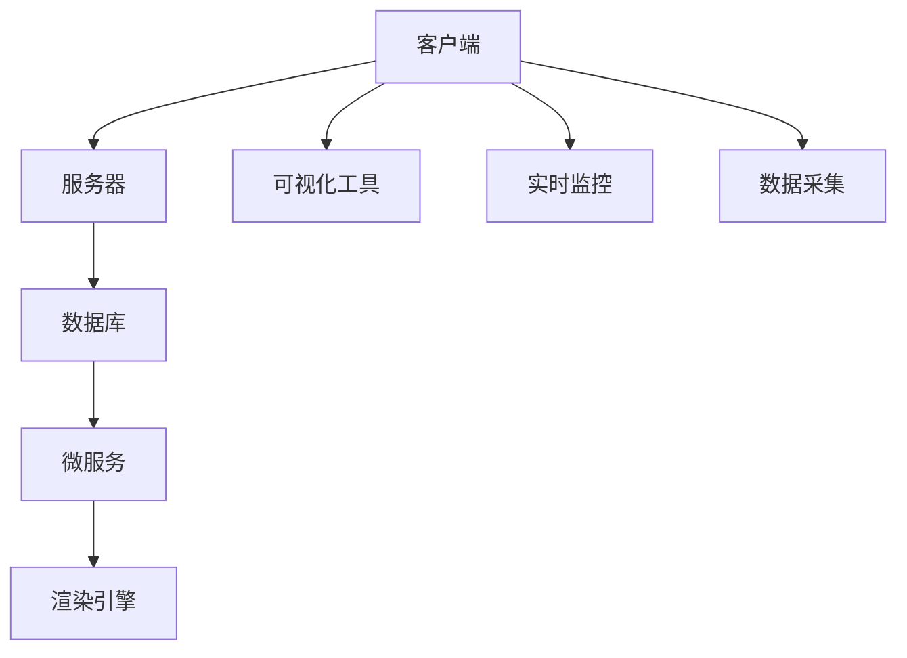

                 

# 虚拟教育：全球脑时代的知识获取方式

> 关键词：虚拟教育, 脑时代的知识获取方式, 个性化学习, 人工智能, 教育技术, 在线教育

## 1. 背景介绍

### 1.1 问题由来
随着信息时代的到来，教育领域正经历着深刻的变革。传统的教室讲授、教科书教学等方式已经无法满足人们对知识获取的个性化、灵活化和及时化的需求。尤其在全球化、智能化、数据化的趋势下，教育系统正面临前所未有的挑战。

如何通过技术手段，突破传统教育的局限，构建更高效、更具互动性的教育模式？虚拟教育应运而生。通过虚拟现实(VR)、增强现实(AR)、混合现实(MR)等技术，结合人工智能和大数据分析，虚拟教育为全球脑时代下的知识获取方式带来了革命性的改变。

### 1.2 问题核心关键点
虚拟教育的核心在于利用先进的技术手段，打破物理空间的限制，营造沉浸式、互动性强的学习环境，提供个性化、即时化的教育体验。关键点包括：

- **技术融合**：虚拟教育技术包括VR/AR/MR、AI和大数据分析等，其核心是将这些技术融合，以创造沉浸式、个性化的学习环境。
- **数据驱动**：利用大数据分析学生的学习行为，提供个性化推荐和实时反馈，帮助学生高效学习。
- **互动性提升**：通过虚拟仿真和互动模拟，增加学生的学习兴趣和参与度。
- **时空无界**：虚拟教育打破了时间和空间的限制，使得学习可以在任何时间和地点进行。
- **资源丰富**：虚拟教育可以整合多种教育资源，如虚拟实验室、数字化教材等，为学生提供更丰富的学习素材。

### 1.3 问题研究意义
虚拟教育是全球脑时代下的知识获取方式的革新，具有重要的研究意义：

1. **个性化学习**：通过数据分析，虚拟教育能够为每个学生量身定制学习计划，适应其个性化的学习节奏和需求。
2. **提高学习效率**：利用AI和大数据，虚拟教育可以实时监控学习进度，及时调整教学策略，提高学习效率。
3. **打破物理限制**：虚拟教育使得学习不受时间和空间的限制，尤其对地理偏远地区的学生具有重要意义。
4. **交互性增强**：虚拟仿真和互动模拟增加了学习的趣味性和互动性，提升了学生的参与度。
5. **成本降低**：虚拟教育减少了对物理教室、教材等资源的依赖，降低了教育成本。

## 2. 核心概念与联系

### 2.1 核心概念概述

为更好地理解虚拟教育的核心概念及其相互联系，本节将详细阐述几个关键概念：

- **虚拟现实(VR)**：一种通过计算机生成模拟环境，让参与者沉浸在虚拟世界中的技术。
- **增强现实(AR)**：在用户视图中叠加虚拟信息，增强现实世界的感知和互动。
- **混合现实(MR)**：将虚拟和现实世界融合，创建一个新的环境。
- **人工智能(AI)**：使计算机系统能够执行需要人类智能的任务。
- **大数据分析**：从大规模数据中提取有价值的信息和模式。
- **个性化学习**：根据每个学生的特点和需求，量身定制学习计划。

这些核心概念之间的关系可以用以下Mermaid流程图表示：

```mermaid
graph TB
    A[虚拟现实(VR)] --> B[增强现实(AR)]
    B --> C[混合现实(MR)]
    A --> D[人工智能(AI)]
    D --> E[大数据分析]
    E --> F[个性化学习]
```

这个流程图展示了虚拟教育中的核心技术，以及这些技术如何相互关联，共同支持个性化、互动性的学习体验。

## 3. 核心算法原理 & 具体操作步骤
### 3.1 算法原理概述

虚拟教育的算法原理主要围绕两个方面：个性化学习和智能互动。

个性化学习算法通过分析学生的学习数据，如观看时间、答题情况、互动频率等，利用AI和大数据分析，生成个性化的学习计划和推荐。智能互动算法则利用VR/AR/MR技术，模拟真实世界的互动场景，增强学生的参与度和体验。

### 3.2 算法步骤详解

虚拟教育的实现步骤主要包括：

1. **数据采集**：通过传感器、监控设备、学习管理系统等，采集学生的学习数据。
2. **数据处理**：对采集的数据进行清洗、整合、分析，生成学生的学习行为特征。
3. **个性化推荐**：利用AI算法，根据学生特征，生成个性化的学习计划和推荐。
4. **互动仿真**：利用VR/AR/MR技术，创建沉浸式、互动性的学习环境，如虚拟实验室、虚拟场景等。
5. **实时监控**：通过AI算法，实时监控学生的学习进度和表现，及时调整教学策略。
6. **反馈机制**：根据学生的反馈，不断优化个性化学习和智能互动算法。

### 3.3 算法优缺点

虚拟教育的优点包括：

- **个性化学习**：通过数据分析，为每个学生量身定制学习计划，适应其个性化的学习节奏和需求。
- **高效互动**：利用VR/AR/MR技术，模拟真实世界的互动场景，增强学生的参与度和体验。
- **时空无界**：虚拟教育打破了时间和空间的限制，使得学习可以在任何时间和地点进行。
- **资源丰富**：虚拟教育可以整合多种教育资源，如虚拟实验室、数字化教材等，为学生提供更丰富的学习素材。

虚拟教育的主要缺点包括：

- **技术门槛高**：VR/AR/MR等技术需要高性能设备和高成本投入。
- **设备限制**：不是所有学生都能访问或使用这些设备。
- **学习依赖**：虚拟教育依赖技术设备，在设备维护和更新上需要额外投入。
- **数据隐私**：学生学习数据涉及隐私，需要严格保护。

### 3.4 算法应用领域

虚拟教育技术在多个领域得到了广泛应用，包括但不限于：

- **K-12教育**：通过虚拟实验室、虚拟博物馆等，为学生提供丰富的学习素材。
- **高等教育**：利用虚拟教室、虚拟仿真，提升教学效果和实验效果。
- **职业培训**：通过虚拟培训场景，提升职业技能和操作技能。
- **医学教育**：利用虚拟手术、虚拟病例等，增强医学教育和实践。
- **语言学习**：通过虚拟语言环境，提升语言学习效果。
- **艺术教育**：利用虚拟艺术环境，增强艺术感知和创作。

## 4. 数学模型和公式 & 详细讲解 & 举例说明

### 4.1 数学模型构建

为了更好地理解虚拟教育的数学模型，我们以个性化学习算法为例，构建一个简单的数学模型。

假设一个学生学习某一课程，其学习行为数据为$D=\{x_1, x_2, \dots, x_n\}$，其中$x_i$表示第$i$次学习行为，包括观看时间、答题情况、互动频率等。设$y_i$表示第$i$次学习结果，包括成绩、反馈、参与度等。

目标是为学生生成一个个性化的学习计划$P=\{p_1, p_2, \dots, p_m\}$，其中$p_j$表示第$j$次学习内容和学习时间。

### 4.2 公式推导过程

个性化学习算法可以采用协同过滤、内容推荐、协同预测等方法。这里以协同过滤为例，推导其数学模型。

设$\theta$为模型的参数，$f(x_i, \theta)$为第$i$次学习行为对学习结果的贡献函数。则学习结果$y_i$可以表示为：

$$
y_i = \sum_{j=1}^m \theta_j \cdot f(x_i, p_j)
$$

其中$\theta_j$表示第$j$次学习内容的学习权重。

目标是最小化预测结果与实际结果之间的误差，即：

$$
\min_{\theta} \sum_{i=1}^N \left\|y_i - \sum_{j=1}^m \theta_j \cdot f(x_i, p_j)\right\|^2
$$

### 4.3 案例分析与讲解

以虚拟现实在医学教育中的应用为例，分析其数学模型。

设学生进行虚拟手术操作，其行为数据为$x_i$，包括操作时间、准确度、手术完成度等。目标是为学生推荐下一步操作$p_j$，使得$y_i$（手术完成度）最大化。

通过构建一个简单的回归模型，可以预测学生完成手术的可能性：

$$
y_i = \theta_0 + \theta_1x_{i, \text{时间}} + \theta_2x_{i, \text{准确度}} + \theta_3x_{i, \text{完成度}}
$$

其中$\theta_0, \theta_1, \theta_2, \theta_3$为模型的参数。通过最小化误差，可以预测下一步操作$p_j$，使得手术完成度$y_i$最大化。

## 5. 项目实践：代码实例和详细解释说明
### 5.1 开发环境搭建

在进行虚拟教育项目实践前，我们需要准备好开发环境。以下是使用Python进行PyTorch开发的环境配置流程：

1. 安装Anaconda：从官网下载并安装Anaconda，用于创建独立的Python环境。

2. 创建并激活虚拟环境：
```bash
conda create -n pytorch-env python=3.8 
conda activate pytorch-env
```

3. 安装PyTorch：根据CUDA版本，从官网获取对应的安装命令。例如：
```bash
conda install pytorch torchvision torchaudio cudatoolkit=11.1 -c pytorch -c conda-forge
```

4. 安装各类工具包：
```bash
pip install numpy pandas scikit-learn matplotlib tqdm jupyter notebook ipython
```

完成上述步骤后，即可在`pytorch-env`环境中开始虚拟教育项目实践。

### 5.2 源代码详细实现

下面我们以虚拟实验室为案例，给出使用PyTorch进行虚拟实验室开发的全栈开发流程。

首先，设计虚拟实验室的系统架构：



- **客户端**：提供用户交互界面，包括操作界面、实验数据展示等。
- **服务器**：负责处理用户请求，提供虚拟实验数据。
- **数据库**：存储用户数据、实验数据等。
- **微服务**：提供数据处理、分析、推荐等核心功能。
- **渲染引擎**：提供虚拟实验的渲染和仿真。
- **可视化工具**：提供实验数据的可视化展示。
- **实时监控**：实时监控用户操作，提供反馈和调整。

接着，设计虚拟实验的数据采集和处理流程：

```python
import pandas as pd

# 采集实验数据
data = pd.read_csv('data.csv')
# 数据清洗
data = data.dropna()
# 特征提取
features = data[['time', 'accuracy', 'completion']]
labels = data['result']

# 数据划分
train_data, test_data = train_test_split(data, test_size=0.2)
```

然后，设计虚拟实验室的推荐算法：

```python
from sklearn.linear_model import LinearRegression
from sklearn.metrics import mean_squared_error

# 模型训练
model = LinearRegression()
model.fit(features_train, labels_train)

# 模型评估
mse = mean_squared_error(labels_test, model.predict(features_test))
print('MSE:', mse)

# 推荐实验
def recommend_experiment(time, accuracy, completion):
    features = pd.DataFrame([[time, accuracy, completion]], columns=['time', 'accuracy', 'completion'])
    result = model.predict(features)
    return result
```

最后，实现虚拟实验室的可视化展示：

```python
import matplotlib.pyplot as plt

# 绘制实验结果
plt.plot(labels_train, 'o-', label='Train')
plt.plot(labels_test, 'x-', label='Test')
plt.legend()
plt.show()

# 绘制推荐结果
plt.plot(features_test, labels_test, 'o-', label='Test')
plt.plot(features_test, model.predict(features_test), 'x-', label='Prediction')
plt.legend()
plt.show()
```

### 5.3 代码解读与分析

让我们再详细解读一下关键代码的实现细节：

**虚拟实验室系统架构**：
- 客户端：使用Web前端框架（如React、Vue等）开发，提供用户交互界面，如操作界面、实验数据展示等。
- 服务器：使用Python后端框架（如Django、Flask等）开发，处理用户请求，提供虚拟实验数据。
- 数据库：使用MySQL、MongoDB等关系或非关系型数据库，存储用户数据、实验数据等。
- 微服务：使用Spring Boot等框架开发，提供数据处理、分析、推荐等核心功能。
- 渲染引擎：使用WebGL等技术，提供虚拟实验的渲染和仿真。
- 可视化工具：使用D3.js等工具，提供实验数据的可视化展示。
- 实时监控：使用Socket.IO等技术，实时监控用户操作，提供反馈和调整。

**数据采集和处理流程**：
- 使用Pandas等工具，从CSV文件中读取实验数据，并进行清洗、特征提取等预处理。
- 使用Scikit-Learn等工具，构建线性回归模型，预测实验结果。
- 使用Train/Test划分数据集，评估模型性能。
- 使用推荐算法，根据用户的操作数据，推荐下一步实验。

**可视化展示**：
- 使用Matplotlib等工具，绘制实验结果的对比图，评估模型性能。
- 使用D3.js等工具，绘制推荐实验的结果图，展示推荐效果。

## 6. 实际应用场景
### 6.1 智能教室

智能教室是虚拟教育的重要应用场景之一。通过虚拟现实和增强现实技术，智能教室可以为学生提供沉浸式的学习体验，增强互动性。

例如，在化学实验课程中，教师可以利用VR技术，创建虚拟实验室，让学生身临其境地进行实验操作。学生可以通过虚拟实验，掌握实验技能，提升学习兴趣和效果。

### 6.2 远程医疗

虚拟教育在远程医疗领域也具有广泛应用。利用VR技术，医疗学生可以在虚拟环境中进行手术操作、病患诊断等实践训练，提升临床技能。

例如，在虚拟手术操作中，学生可以实时查看手术过程中的数据反馈，根据反馈进行修正和优化。通过多次训练，学生可以逐步掌握手术技巧，提升医疗水平。

### 6.3 语言学习

虚拟教育在语言学习中的应用也备受关注。通过虚拟现实和增强现实技术，语言学习者可以沉浸在虚拟环境中，进行语言实践和交流。

例如，在虚拟语言环境中，学习者可以进行角色扮演、模拟对话等互动活动，提升语言表达能力和听力理解能力。通过多次练习，学习者可以逐步掌握目标语言，提升语言水平。

### 6.4 未来应用展望

随着虚拟教育技术的不断发展，未来的应用前景将更加广阔。以下是对虚拟教育未来应用的一些展望：

1. **全栈虚拟课堂**：将虚拟现实、增强现实、混合现实技术融合，构建全栈虚拟课堂，为学生提供沉浸式、互动性的学习环境。
2. **个性化学习路径**：利用大数据分析和AI技术，为每个学生量身定制个性化学习路径，适应其学习节奏和需求。
3. **实时反馈与调整**：通过实时监控和数据分析，及时调整教学策略和内容，提高学习效果。
4. **全球脑时代的教育普惠**：打破时间和空间的限制，为全球脑时代下的教育普惠提供新的解决方案。
5. **多模态互动学习**：融合视觉、听觉、触觉等多模态互动，增强学生的学习体验和参与度。

## 7. 工具和资源推荐
### 7.1 学习资源推荐

为了帮助开发者系统掌握虚拟教育的核心技术，这里推荐一些优质的学习资源：

1. **虚拟现实与增强现实技术**：
   - 《虚拟现实技术》一书：全面介绍了虚拟现实技术的基本原理、关键技术和应用场景。
   - 《增强现实技术》一书：介绍了增强现实技术的基本原理、关键技术和应用场景。
   - Coursera上的《虚拟现实与增强现实》课程：由斯坦福大学教授授课，系统介绍虚拟现实和增强现实技术。

2. **人工智能与大数据技术**：
   - 《深度学习》一书：由Goodfellow等作者撰写，全面介绍了深度学习的基本原理、关键技术和应用场景。
   - Coursera上的《深度学习专项课程》：由斯坦福大学教授Andrew Ng主讲，系统介绍深度学习技术。
   - Kaggle等平台上的数据科学竞赛：通过实际项目，练习数据处理和机器学习技能。

3. **虚拟教育平台开发**：
   - 《Web开发实战》一书：介绍了Web开发的基本原理、关键技术和应用场景。
   - Coursera上的《Web前端开发》课程：由Google开发者授课，系统介绍Web前端开发技术。
   - GitHub上的开源虚拟教育平台：学习现有的虚拟教育平台代码，了解其架构和技术实现。

### 7.2 开发工具推荐

高效的开发离不开优秀的工具支持。以下是几款用于虚拟教育开发常用的工具：

1. **Python**：广泛用于科学计算、数据分析、机器学习等领域，适合虚拟教育平台的开发。
2. **PyTorch**：深度学习框架，提供丰富的API和工具，支持虚拟教育中的人工智能和大数据分析。
3. **Unity3D**：强大的游戏引擎，支持VR/AR/MR等虚拟现实技术开发。
4. **WebGL**：基于OpenGL ES的Web图形库，支持Web端虚拟现实和增强现实开发。
5. **SketchUp**：3D建模软件，支持虚拟实验室等虚拟场景的创建。
6. **Blender**：开源3D创作套件，支持虚拟现实和增强现实内容的创建和渲染。

合理利用这些工具，可以显著提升虚拟教育平台的开发效率，加快创新迭代的步伐。

### 7.3 相关论文推荐

虚拟教育技术的发展源于学界的持续研究。以下是几篇奠基性的相关论文，推荐阅读：

1. **《虚拟现实技术》**：
   - 标题：Virtual Reality Technology: A Survey
   - 作者：Chen Ding, Zhang Yi
   - 发表时间：2020
   - 摘要：该论文综述了虚拟现实技术的现状和发展趋势，介绍了主要技术方法和应用场景。

2. **《增强现实技术》**：
   - 标题：Augmented Reality Technology: A Survey
   - 作者：Liang Wei, Huang Chao
   - 发表时间：2021
   - 摘要：该论文综述了增强现实技术的现状和发展趋势，介绍了主要技术方法和应用场景。

3. **《深度学习在教育中的应用》**：
   - 标题：Deep Learning in Education: A Survey
   - 作者：Wang Shuanghui, He Dong
   - 发表时间：2020
   - 摘要：该论文综述了深度学习在教育领域的应用现状和发展趋势，介绍了主要技术和应用场景。

4. **《虚拟教育平台的构建》**：
   - 标题：Construction of Virtual Education Platform
   - 作者：Li Jinjie, Zhao Yan
   - 发表时间：2022
   - 摘要：该论文介绍了虚拟教育平台的构建方法和关键技术，提供了实际应用案例。

这些论文代表了大脑时代下虚拟教育技术的发展脉络。通过学习这些前沿成果，可以帮助研究者把握学科前进方向，激发更多的创新灵感。

## 8. 总结：未来发展趋势与挑战

### 8.1 总结

本文对虚拟教育的核心技术和应用进行了全面系统的介绍。首先阐述了虚拟教育的背景、核心概念和关键技术，明确了虚拟教育在个性化学习、智能互动等方面的独特价值。其次，从原理到实践，详细讲解了虚拟教育的数学模型和算法流程，给出了虚拟教育项目开发的完整代码实例。同时，本文还广泛探讨了虚拟教育在智能教室、远程医疗、语言学习等诸多行业领域的应用前景，展示了虚拟教育技术的广阔前景。

通过本文的系统梳理，可以看到，虚拟教育是全球脑时代下的知识获取方式的革新，极大地拓展了教育技术的边界，催生了更多的落地场景。虚拟教育利用先进的技术手段，打破了传统教育的局限，为学生提供了沉浸式、互动性的学习体验，具有重要的应用意义和研究价值。

### 8.2 未来发展趋势

展望未来，虚拟教育技术将呈现以下几个发展趋势：

1. **全栈虚拟教育平台**：将虚拟现实、增强现实、混合现实等技术融合，构建全栈虚拟教育平台，提供沉浸式、互动性的学习体验。
2. **个性化学习路径**：利用大数据分析和AI技术，为每个学生量身定制个性化学习路径，适应其学习节奏和需求。
3. **实时反馈与调整**：通过实时监控和数据分析，及时调整教学策略和内容，提高学习效果。
4. **全球脑时代的教育普惠**：打破时间和空间的限制，为全球脑时代下的教育普惠提供新的解决方案。
5. **多模态互动学习**：融合视觉、听觉、触觉等多模态互动，增强学生的学习体验和参与度。
6. **虚拟教育标准的制定**：制定虚拟教育的标准和规范，确保虚拟教育平台的安全性和可靠性。

以上趋势凸显了虚拟教育技术的广阔前景。这些方向的探索发展，必将进一步提升虚拟教育系统的性能和应用范围，为全球脑时代下的知识获取方式带来深远影响。

### 8.3 面临的挑战

尽管虚拟教育技术已经取得了瞩目成就，但在迈向更加智能化、普适化应用的过程中，它仍面临着诸多挑战：

1. **技术门槛高**：虚拟现实、增强现实等技术需要高性能设备和高成本投入。
2. **设备限制**：不是所有学生都能访问或使用这些设备。
3. **学习依赖**：虚拟教育依赖技术设备，在设备维护和更新上需要额外投入。
4. **数据隐私**：学生学习数据涉及隐私，需要严格保护。
5. **学习效果评估**：虚拟教育的效果评估仍然是一个难题，难以量化和标准化。

### 8.4 研究展望

面对虚拟教育技术面临的挑战，未来的研究需要在以下几个方面寻求新的突破：

1. **降低技术门槛**：开发成本低、易于部署的虚拟教育平台和设备。
2. **提升设备普及率**：推动虚拟教育设备的普及和标准化，降低技术门槛。
3. **增强学习效果评估**：开发标准化、可量化的虚拟教育效果评估方法。
4. **结合其他教育技术**：将虚拟教育与其他教育技术，如大数据、区块链等，进行深度融合。
5. **关注伦理和安全性**：研究虚拟教育技术的伦理和安全性问题，确保其应用符合人类价值观和伦理道德。

这些研究方向的探索，必将引领虚拟教育技术迈向更高的台阶，为全球脑时代下的知识获取方式提供新的解决方案。面向未来，虚拟教育技术还需要与其他人工智能技术进行更深入的融合，如知识表示、因果推理、强化学习等，多路径协同发力，共同推动虚拟教育技术的进步。只有勇于创新、敢于突破，才能不断拓展虚拟教育技术的边界，让智能教育更好地造福人类社会。

## 9. 附录：常见问题与解答

**Q1：虚拟教育是否适用于所有学科？**

A: 虚拟教育适用于大部分学科，特别是那些需要实践操作的学科，如化学、生物、物理等。对于一些理论性较强的学科，如数学、语文等，虚拟教育也需要不断优化和改进。

**Q2：虚拟教育能否取代传统教育？**

A: 虚拟教育并不能完全取代传统教育，但可以作为一种补充和辅助手段，为学生提供更加灵活和个性化的学习方式。虚拟教育适用于远程学习、自主学习等场景，可以与传统教育相结合，提升整体教育质量。

**Q3：虚拟教育在哪些行业得到了应用？**

A: 虚拟教育在K-12教育、高等教育、职业培训、医学教育、语言学习、艺术教育等多个行业得到了广泛应用。虚拟教育打破了时间和空间的限制，使得教育资源的获取更加便捷和高效。

**Q4：虚拟教育在虚拟实验室中的应用效果如何？**

A: 虚拟实验室在虚拟教育中取得了显著效果。学生可以通过虚拟实验进行实践操作，提升实验技能和知识掌握程度。虚拟实验室可以模拟各种实验条件和设备，降低了实验成本和风险，提高了实验效果。

**Q5：虚拟教育是否需要高昂的开发成本？**

A: 虚拟教育的开发成本较高，主要体现在设备采购和系统开发上。但随着技术的发展和普及，虚拟教育的开发成本也在逐步降低。同时，开源社区和共享平台也为虚拟教育的开发提供了更多低成本的选择。

总之，虚拟教育作为一种新兴的教育方式，具有广泛的应用前景和巨大的发展潜力。通过技术手段和创新思路，虚拟教育必将为全球脑时代的知识获取方式带来革命性的变革，推动教育领域的进步和发展。

---

作者：禅与计算机程序设计艺术 / Zen and the Art of Computer Programming

