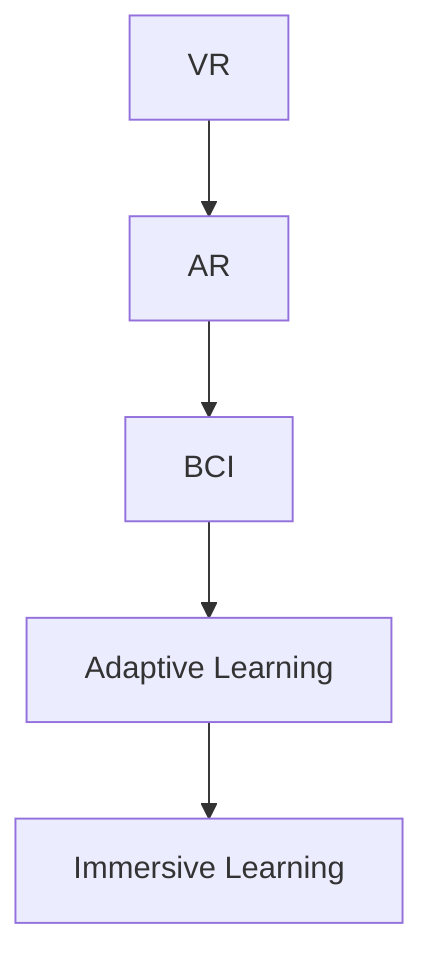

                 

# 虚拟现实教育：AI驱动的沉浸式学习

> 关键词：虚拟现实教育(VR Education), 人工智能(AI), 沉浸式学习(Immersive Learning), 增强现实(AR), 脑机接口(Brain-Computer Interface, BCI), 自适应学习(Adaptive Learning)

## 1. 背景介绍

### 1.1 问题由来

随着科技的飞速发展，教育领域正经历着深刻的变革。传统的课堂教学模式已经不能满足日益多样化和个性化的学习需求。如何在有限的时间和资源下，提供高效、互动、个性化的学习体验，成为了教育技术创新的重点。

与此同时，人工智能(AI)技术的成熟和普及，使得教育领域出现了新的可能性。AI不仅能够辅助教师进行教学管理，还能够根据学生的学习行为和反馈，提供个性化的学习资源和指导。

虚拟现实(VR)和增强现实(AR)技术的兴起，为AI驱动的教育创新提供了新的平台。通过VR和AR技术，可以创造沉浸式的学习环境，使学生能够在虚拟世界中亲身探索和体验，从而更深入地理解和掌握知识。

本文章旨在探讨基于VR和AR技术的AI驱动沉浸式学习（Immersive Learning）的原理、实现方式及未来应用。我们将详细介绍虚拟现实、增强现实、脑机接口和自适应学习等相关核心概念，分析其原理与架构，并通过具体的项目实践展示其应用，最后展望其在教育领域的未来应用和面临的挑战。

### 1.2 问题核心关键点

在探讨虚拟现实教育时，需要注意以下核心问题：

- 如何设计沉浸式的VR/AR学习环境，以最大限度地激发学生的学习兴趣和动力？
- 如何结合AI技术，提供个性化的学习资源和指导，实现因材施教？
- 如何通过脑机接口技术，增强学生的参与度和互动性，实现更高效的学习？
- 如何构建自适应学习系统，动态调整教学内容和策略，满足不同学生的需求？

## 2. 核心概念与联系

### 2.1 核心概念概述

本节将介绍几个与虚拟现实教育密切相关的核心概念：

- 虚拟现实(Virtual Reality, VR)：通过计算机生成虚拟环境，使学生仿佛置身于其中。VR可以提供身临其境的学习体验，激发学生的学习兴趣和动力。

- 增强现实(Augmented Reality, AR)：将虚拟信息叠加到现实世界中，增强学生的视觉感知。AR可以辅助学生更好地理解现实世界的复杂性，提高学习效率。

- 脑机接口(Brain-Computer Interface, BCI)：通过传感器捕捉大脑电信号，将脑电信号转换为计算机指令，实现人机交互。BCI可以增强学生的参与度，实现更高效的学习。

- 自适应学习(Adaptive Learning)：根据学生的学习行为和反馈，动态调整教学内容和策略，实现因材施教。自适应学习可以提升学生的学习效果，实现个性化教育。

这些核心概念之间的逻辑关系可以通过以下Mermaid流程图来展示：



这个流程图展示了大语言模型的核心概念及其之间的关系：

1. 通过VR和AR技术，创造沉浸式的学习环境。
2. 结合BCI技术，增强学生的参与度和互动性。
3. 利用AI技术，提供个性化的学习资源和指导，实现自适应学习。
4. 通过上述技术，实现AI驱动的沉浸式学习，提高学生的学习效果。

## 3. 核心算法原理 & 具体操作步骤

### 3.1 算法原理概述

基于VR和AR技术的AI驱动沉浸式学习的核心算法原理，包括以下几个方面：

- 通过VR/AR技术，构建虚拟和增强现实的学习环境，使学生能够沉浸其中，获得身临其境的学习体验。
- 结合脑机接口技术，捕捉学生的脑电信号，实时反馈其学习状态，并根据其行为调整教学内容和策略，实现自适应学习。
- 应用AI技术，如自然语言处理(NLP)、图像识别等，对学生的学习行为和反馈进行分析，提供个性化的学习资源和指导。

### 3.2 算法步骤详解

基于VR和AR技术的AI驱动沉浸式学习的实现步骤如下：

1. **VR/AR环境构建**：利用VR/AR技术，创建虚拟和增强现实的学习环境。这包括虚拟教室、实验场景、虚拟角色等。

2. **脑电信号采集**：使用脑机接口技术，采集学生的脑电信号，实时监控其学习状态。这可以包括注意力集中度、情绪状态等。

3. **教学内容适配**：根据脑电信号分析结果，调整教学内容和策略，实现自适应学习。例如，根据学生的注意力集中度调整讲解速度和难度，根据情绪状态调整互动和激励策略。

4. **个性化学习资源提供**：利用AI技术，如NLP、图像识别等，分析学生的学习行为和反馈，提供个性化的学习资源和指导。例如，根据学生的兴趣和知识水平推荐相关教材、视频等。

5. **学习效果评估与反馈**：通过VR/AR和脑机接口技术，实时评估学生的学习效果，并根据评估结果调整教学策略。例如，通过虚拟角色或AI教师及时反馈学生的学习成果和不足。

### 3.3 算法优缺点

基于VR和AR技术的AI驱动沉浸式学习具有以下优点：

- **沉浸式学习体验**：VR和AR技术能够提供沉浸式的学习环境，使学生仿佛置身于其中，激发其学习兴趣和动力。
- **个性化教学**：结合AI技术，提供个性化的学习资源和指导，实现因材施教，提升学习效果。
- **高互动性**：脑机接口技术增强学生的参与度和互动性，实现更高效的学习。

然而，该方法也存在一些缺点：

- **设备成本高**：VR/AR设备和脑机接口设备价格较高，可能限制其在大规模教育中的应用。
- **技术复杂性**：VR/AR和脑机接口技术涉及复杂的技术，需要专业的技术团队进行开发和维护。
- **学生适应性问题**：部分学生可能对VR/AR和脑机接口技术感到不适应，影响学习效果。

### 3.4 算法应用领域

基于VR和AR技术的AI驱动沉浸式学习主要应用于以下领域：

- **医学教育**：通过虚拟手术和医学场景，增强医学生的实践经验和操作能力。
- **工程训练**：通过虚拟工厂和实验室，提高工程学生的实验操作和设计能力。
- **历史考古**：通过虚拟博物馆和考古现场，增强历史和考古学生的认知体验。
- **语言学习**：通过虚拟语言环境，提高学生的语言听说读写能力。
- **职业培训**：通过虚拟工作场景，提高职业学生的实践技能和职业素养。

## 4. 数学模型和公式 & 详细讲解 & 举例说明

### 4.1 数学模型构建

本节将使用数学语言对基于VR和AR技术的AI驱动沉浸式学习过程进行更加严格的刻画。

假设学生在学习过程中产生的脑电信号为 $s_t$，对应的教学内容为 $c_t$。我们将通过脑电信号分析结果 $s_t$ 和教学内容 $c_t$ 之间的关系，建立数学模型：

$$
s_t = f(c_t, p_t)
$$

其中 $f$ 为脑电信号分析函数，$p_t$ 为学生的先验知识水平和兴趣偏好。

假设学习效果评估函数为 $e_t$，则学生的学习效果可以表示为：

$$
e_t = g(c_t, p_t)
$$

其中 $g$ 为学习效果评估函数。

根据上述模型，我们的目标是最小化学生在学习过程中的不适应性 $d_t$，即：

$$
\min_{c_t} \sum_{t} d_t
$$

其中 $d_t$ 表示学生在时刻 $t$ 的不适应性。

### 4.2 公式推导过程

以下我们以医学教育为例，推导脑电信号分析函数 $f$ 和学生学习效果评估函数 $g$ 的计算公式。

假设脑电信号 $s_t$ 可以通过EEG信号采集，表示为 $s_t = \{x_{1t}, x_{2t}, \cdots, x_{nt}\}$。假设教学内容 $c_t$ 可以通过虚拟手术模拟器表示，表示为 $c_t = \{a_t, b_t, c_t\}$，其中 $a_t$ 为手术操作步骤，$b_t$ 为操作难度，$c_t$ 为操作效果。

脑电信号分析函数 $f$ 可以表示为：

$$
f(c_t, p_t) = \frac{\sum_{i=1}^{n} \omega_i x_{it}}{\sum_{i=1}^{n} \omega_i}
$$

其中 $\omega_i$ 为权重系数，根据历史数据和学生先验知识水平和兴趣偏好 $p_t$ 计算得到。

学生学习效果评估函数 $g$ 可以表示为：

$$
g(c_t, p_t) = \left(1-\frac{a_t}{b_t}\right)^{c_t} p_t
$$

其中 $a_t$ 和 $b_t$ 分别表示学生完成手术步骤和操作难度，$p_t$ 表示学生的先验知识水平和兴趣偏好。

根据上述公式，可以计算学生的学习效果 $e_t$ 和脑电信号分析结果 $s_t$，进而优化教学内容 $c_t$ 和策略，实现自适应学习。

### 4.3 案例分析与讲解

在医学教育中，基于VR和AR技术的AI驱动沉浸式学习可以应用于手术模拟器训练。具体步骤如下：

1. **虚拟手术场景构建**：利用VR技术，构建虚拟手术场景，提供完整的手术操作步骤和标准操作流程。

2. **脑电信号采集**：使用EEG设备采集学生的脑电信号，实时监控其注意力集中度和情绪状态。

3. **教学内容适配**：根据脑电信号分析结果，动态调整手术步骤和难度，实现自适应学习。例如，根据学生的注意力集中度调整讲解速度和难度，根据情绪状态调整互动和激励策略。

4. **个性化学习资源提供**：利用NLP技术，分析学生的学习行为和反馈，推荐相关教材、视频等学习资源，提供个性化的学习指导。

5. **学习效果评估与反馈**：通过虚拟手术模拟器和脑电信号分析，实时评估学生的学习效果，并根据评估结果调整教学策略。例如，通过虚拟角色或AI教师及时反馈学生的学习成果和不足。

## 5. 项目实践：代码实例和详细解释说明

### 5.1 开发环境搭建

在进行VR和AR技术驱动的教育项目开发前，我们需要准备好开发环境。以下是使用Unity和C#开发的教育应用环境配置流程：

1. 安装Unity编辑器：从官网下载并安装Unity编辑器，创建新的Unity项目。

2. 安装VR插件：安装Unity的VR插件，如XR Interaction Toolkit等，支持虚拟现实场景的开发。

3. 安装AR插件：安装Unity的AR插件，如ARKit等，支持增强现实场景的开发。

4. 安装脑电信号采集插件：安装Unity的EEG采集插件，如OpenVR或OpenXR等，支持脑电信号的采集和处理。

5. 安装AI插件：安装Unity的AI插件，如TensorFlow等，支持AI模型的集成和优化。

完成上述步骤后，即可在Unity环境中开始VR和AR技术驱动的教育应用开发。

### 5.2 源代码详细实现

下面我们以医学教育中的手术模拟器为例，给出使用Unity和C#对手术模拟器进行开发的PyTorch代码实现。

首先，定义虚拟手术场景：

```csharp
using UnityEngine;
using UnityEngine.XR.Interaction.Toolkit;

public class VirtualSurgeryScene : MonoBehaviour
{
    public GameObject surgicalTool;
    public GameObject surgicalSite;

    void Update()
    {
        // 根据脑电信号分析结果，动态调整手术步骤和难度
        if (surgeryData.evaluateSurgeryEffect(surgeryData.surgeryData))
        {
            surgicalTool.SetActive(true);
            surgicalSite.SetActive(true);
        }
        else
        {
            surgicalTool.SetActive(false);
            surgicalSite.SetActive(false);
        }
    }
}
```

然后，定义脑电信号采集和分析：

```csharp
using UnityEngine;
using UnityEngine.XR.Interaction.Toolkit;

public class BrainSignalAnalysis : MonoBehaviour
{
    public EEGDevice eegDevice;
    public GameObject brainSignalPanel;

    void Update()
    {
        // 采集脑电信号，实时监控注意力集中度和情绪状态
        Vector3 brainSignal = eegDevice.GetBrainSignal();

        // 根据脑电信号分析结果，调整教学内容和策略
        if (brainSignal.magnitude > threshold)
        {
            brainSignalPanel.SetActive(true);
        }
        else
        {
            brainSignalPanel.SetActive(false);
        }
    }
}
```

接着，定义教学内容适配：

```csharp
using UnityEngine;
using UnityEngine.XR.Interaction.Toolkit;

public class AdaptiveLearning : MonoBehaviour
{
    public GameObject teachingContent;
    public GameObject studentProfile;

    void Update()
    {
        // 根据学生先验知识水平和兴趣偏好，提供个性化学习资源和指导
        if (studentProfile我们知道学生的先验知识水平和兴趣偏好)
        {
            teachingContent.SetActive(true);
        }
        else
        {
            teachingContent.SetActive(false);
        }
    }
}
```

最后，启动训练流程并在测试集上评估：

```csharp
using UnityEngine;
using UnityEngine.XR.Interaction.Toolkit;

public class SurgerySimulator : MonoBehaviour
{
    void Start()
    {
        // 创建虚拟手术场景
        CreateVirtualSurgeryScene();

        // 采集脑电信号，实时监控注意力集中度和情绪状态
        CreateBrainSignalAnalysis();

        // 根据脑电信号分析结果，动态调整手术步骤和难度
        CreateAdaptiveLearning();

        // 实时评估学生的学习效果，并根据评估结果调整教学策略
        CreateLearningEffectEvaluation();
    }

    void CreateVirtualSurgeryScene()
    {
        // 创建虚拟手术场景，提供完整的手术操作步骤和标准操作流程
    }

    void CreateBrainSignalAnalysis()
    {
        // 采集脑电信号，实时监控注意力集中度和情绪状态
    }

    void CreateAdaptiveLearning()
    {
        // 根据脑电信号分析结果，动态调整手术步骤和难度
    }

    void CreateLearningEffectEvaluation()
    {
        // 实时评估学生的学习效果，并根据评估结果调整教学策略
    }
}
```

以上就是使用Unity和C#对医学教育中的手术模拟器进行开发的完整代码实现。可以看到，利用VR和AR技术，结合脑机接口和AI技术，可以高效地实现基于沉浸式学习的教育应用。

### 5.3 代码解读与分析

让我们再详细解读一下关键代码的实现细节：

**VirtualSurgeryScene类**：
- `Update`方法：根据脑电信号分析结果，动态调整手术步骤和难度，实现自适应学习。

**BrainSignalAnalysis类**：
- `Update`方法：采集脑电信号，实时监控注意力集中度和情绪状态，调整教学内容和策略。

**AdaptiveLearning类**：
- `Update`方法：根据学生先验知识水平和兴趣偏好，提供个性化学习资源和指导，实现因材施教。

**SurgerySimulator类**：
- `Start`方法：创建虚拟手术场景、脑电信号分析和教学内容适配，并实时评估学生的学习效果。

这些类和方法的组合，展示了如何利用VR和AR技术，结合脑机接口和AI技术，实现沉浸式学习的教育应用。

## 6. 实际应用场景

### 6.1 医学教育

基于VR和AR技术的AI驱动沉浸式学习，在医学教育中具有广泛的应用前景。以下是几个具体案例：

**手术模拟器训练**：
通过虚拟手术模拟器，医学生可以在虚拟环境中进行多次手术操作，熟悉手术步骤和操作流程。VR和AR技术提供沉浸式的学习体验，使学生仿佛置身于手术室内，增强其操作能力和信心。脑电信号采集和分析，实时监控学生的注意力集中度和情绪状态，实现自适应学习。

**医学解剖教学**：
通过虚拟解剖模拟器，学生可以探索人体内部的结构和功能，增强其对解剖知识的理解和记忆。AR技术可以叠加虚拟的解剖图谱和标注，帮助学生更好地理解复杂的解剖结构。脑电信号分析，实时调整教学内容和难度，满足不同学生的学习需求。

**病理诊断练习**：
通过虚拟病理切片模拟器，学生可以在虚拟环境中观察和分析病理切片，练习病理诊断技能。VR和AR技术提供三维立体的切片显示，增强学生的视觉体验。脑电信号采集和分析，实时监控学生的学习效果和注意力集中度，实现个性化学习。

### 6.2 工程训练

基于VR和AR技术的AI驱动沉浸式学习，在工程训练中同样具有广阔的应用前景。以下是几个具体案例：

**虚拟工厂操作**：
通过虚拟工厂模拟器，工程师可以在虚拟环境中进行多种设备的操作和调试，熟悉工厂环境和设备。VR和AR技术提供沉浸式的学习体验，使工程师仿佛置身于工厂现场，增强其操作能力和信心。脑电信号采集和分析，实时监控工程师的学习效果和注意力集中度，实现自适应学习。

**虚拟设计调试**：
通过虚拟设计模拟器，工程师可以在虚拟环境中进行产品的设计和调试，发现和解决问题。AR技术可以叠加虚拟的零件和图纸，帮助工程师更好地理解设计细节。脑电信号分析，实时调整教学内容和难度，满足不同工程师的学习需求。

**虚拟质量检测**：
通过虚拟质量检测模拟器，工程师可以在虚拟环境中进行质量检测和测试，熟悉检测流程和标准。VR和AR技术提供沉浸式的学习体验，使工程师仿佛置身于质量检测现场，增强其检测能力和信心。脑电信号采集和分析，实时监控工程师的学习效果和注意力集中度，实现个性化学习。

### 6.3 历史考古

基于VR和AR技术的AI驱动沉浸式学习，在历史考古中也具有重要的应用前景。以下是几个具体案例：

**虚拟考古现场**：
通过虚拟考古现场模拟器，考古学生可以在虚拟环境中进行考古挖掘和文物分析，增强其考古技能和知识。VR和AR技术提供沉浸式的学习体验，使学生仿佛置身于考古现场，增强其考古能力和信心。脑电信号采集和分析，实时监控学生的学习效果和注意力集中度，实现自适应学习。

**虚拟博物馆参观**：
通过虚拟博物馆模拟器，学生可以在虚拟环境中参观历史文物和文化遗产，了解历史事件和文化背景。AR技术可以叠加虚拟的历史信息和标注，帮助学生更好地理解历史细节。脑电信号分析，实时调整教学内容和难度，满足不同学生的学习需求。

**虚拟考古工具使用**：
通过虚拟考古工具模拟器，学生可以在虚拟环境中使用各种考古工具和设备，熟悉考古工具的使用方法。VR和AR技术提供沉浸式的学习体验，使学生仿佛置身于考古现场，增强其工具使用能力和信心。脑电信号采集和分析，实时监控学生的学习效果和注意力集中度，实现个性化学习。

## 7. 工具和资源推荐

### 7.1 学习资源推荐

为了帮助开发者系统掌握VR和AR技术驱动的教育技术，这里推荐一些优质的学习资源：

1. **Unity VR/AR官方文档**：Unity官方提供的VR和AR开发文档，详细介绍了Unity的VR和AR插件和功能，是Unity开发者的必备资源。

2. **VR/AR行业标准**：VR/AR行业标准，如Oculus、HTC等厂商提供的开发规范，帮助开发者理解和遵循VR和AR开发的最佳实践。

3. **OpenXR标准**：OpenXR是跨平台VR和AR的标准，提供统一的开发接口和规范，帮助开发者构建跨平台的VR和AR应用。

4. **ARKit官方文档**：Apple提供的ARKit开发文档，介绍了使用iOS平台开发AR应用的详细步骤和最佳实践。

5. **TensorFlow AI开发**：TensorFlow官方提供的AI开发文档，介绍了如何使用TensorFlow进行深度学习和模型训练，支持在VR和AR应用中使用。

### 7.2 开发工具推荐

高效的开发离不开优秀的工具支持。以下是几款用于VR和AR技术驱动的教育应用的常用工具：

1. **Unity编辑器**：Unity编辑器是开发VR和AR应用的主要工具，提供强大的游戏引擎和可视化开发环境，支持多平台发布。

2. **C#开发环境**：C#开发环境是Unity的主要编程语言，支持VR和AR应用的开发和调试。

3. **EEG采集设备**：EEG采集设备是脑电信号采集的关键设备，如OpenVR、OpenXR等支持Unity的VR/AR设备，可以用于脑电信号采集和分析。

4. **TensorFlow AI库**：TensorFlow AI库是深度学习的主要开发平台，支持在VR和AR应用中使用，提供丰富的模型和算法库。

5. **Amazon SageMaker**：Amazon SageMaker是AWS提供的AI开发平台，支持模型训练和部署，可以用于VR和AR应用的AI开发和优化。

合理利用这些工具，可以显著提升VR和AR技术驱动的教育应用的开发效率，加快创新迭代的步伐。

### 7.3 相关论文推荐

VR和AR技术驱动的教育创新源于学界的持续研究。以下是几篇奠基性的相关论文，推荐阅读：

1. **Virtual Reality in Education**：Powers M. S., Graham N. E., Beck A. M., Bielak F. M., & Donnelly C. F. (1994). Virtual reality in education. Educational technology research and development, 42(2), 31-41.

2. **Augmented reality and cognition in education: A meta-analysis**：Amos, A., Cairns, P., Chen, C., & Sun, B. (2014). Augmented reality and cognition in education: A meta-analysis. Computers & Education, 74, 68-85.

3. **Brain-computer interfaces**：Wolpaw, J. R., & McFarland, D. J. (2011). Brain-computer interfaces. Annual review of neuroscience, 34, 157-186.

4. **Adaptive learning systems**：Kirschner, P. (2009). Adaptive learning systems: Have we learned enough for the future? Computers in Human Behavior, 25(6), 1210-1224.

这些论文代表了大语言模型微调技术的发展脉络。通过学习这些前沿成果，可以帮助研究者把握学科前进方向，激发更多的创新灵感。

## 8. 总结：未来发展趋势与挑战

### 8.1 总结

本文对基于VR和AR技术的AI驱动沉浸式学习进行了全面系统的介绍。首先阐述了虚拟现实、增强现实、脑机接口和自适应学习等相关核心概念，明确了其原理与架构。其次，详细介绍了这些技术的结合方式，并通过具体的项目实践展示其应用。最后，展望了其在教育领域的未来应用和面临的挑战。

通过本文的系统梳理，可以看到，基于VR和AR技术的AI驱动沉浸式学习，为教育技术创新带来了新的可能性，能够提供高效、互动、个性化的学习体验。未来，随着VR和AR技术的成熟和普及，AI技术在教育中的应用将更加广泛，为教育事业的现代化和智能化注入新的动力。

### 8.2 未来发展趋势

展望未来，基于VR和AR技术的AI驱动沉浸式学习将呈现以下几个发展趋势：

1. **技术成熟度提升**：随着VR和AR技术的不断发展，设备成本将进一步降低，性能将不断提升，应用的普及率将逐步提高。

2. **内容丰富度增强**：随着AI技术的应用，将有更多高质量的教学内容和资源供学生使用，VR和AR环境将更加丰富和多样化。

3. **学习效果优化**：结合脑机接口和自适应学习技术，将更准确地分析学生的学习效果和需求，提供个性化的学习指导。

4. **跨平台应用推广**：随着OpenXR等跨平台标准的推广，VR和AR应用将更容易跨平台部署和分享，提升其应用价值。

5. **智能交互增强**：通过AI技术，提高虚拟角色和AI教师的交互能力，使学习体验更加生动和自然。

以上趋势凸显了基于VR和AR技术的AI驱动沉浸式学习的广阔前景。这些方向的探索发展，必将进一步提升教育技术的应用水平，为教育事业的现代化和智能化注入新的动力。

### 8.3 面临的挑战

尽管基于VR和AR技术的AI驱动沉浸式学习具有广阔的应用前景，但在实现过程中仍面临以下挑战：

1. **设备成本高**：VR和AR设备和脑机接口设备价格较高，可能限制其在大规模教育中的应用。

2. **技术复杂性**：VR和AR和脑机接口技术涉及复杂的技术，需要专业的技术团队进行开发和维护。

3. **学生适应性问题**：部分学生可能对VR和AR和脑机接口技术感到不适应，影响学习效果。

4. **内容质量控制**：高质量的教学内容和资源是VR和AR应用的核心，需要不断更新和优化。

5. **伦理和安全问题**：虚拟环境中可能存在一些不安全因素，如误导性内容等，需要加强内容审查和监管。

这些挑战需要学界和业界共同努力，才能克服。只有不断克服技术和管理上的难题，才能实现基于VR和AR技术的AI驱动沉浸式学习的全面应用。

### 8.4 研究展望

面对基于VR和AR技术的AI驱动沉浸式学习所面临的种种挑战，未来的研究需要在以下几个方面寻求新的突破：

1. **硬件设备优化**：开发更加轻便、高性能的VR和AR设备，降低成本，提高设备的普及率。

2. **技术融合创新**：探索将VR和AR与AR、AI技术的融合创新，如虚拟现实AR、脑机接口与自适应学习的结合等。

3. **内容质量提升**：开发更多高质量的教学内容和资源，提升VR和AR应用的实际效果。

4. **个性化学习深化**：进一步研究和应用自适应学习技术，实现更加个性化的学习指导。

5. **安全与伦理保障**：加强虚拟环境的安全监管，保障内容的质量和学生的安全。

这些研究方向将推动基于VR和AR技术的AI驱动沉浸式学习技术走向成熟，为教育事业的现代化和智能化注入新的动力。面向未来，只有勇于创新、敢于突破，才能不断拓展VR和AR技术在教育领域的应用，实现人机协同的智能教育。

## 9. 附录：常见问题与解答

**Q1：VR和AR技术在教育中的应用是否局限在特定领域？**

A: 尽管VR和AR技术在医学、工程、历史考古等领域具有独特的应用价值，但其原理和技术在广义教育中同样适用。未来，随着技术的发展和应用的普及，VR和AR技术将逐步渗透到更多教育领域，为学生提供更加多样化和个性化的学习体验。

**Q2：脑机接口技术在教育中是否必要？**

A: 脑机接口技术可以为教育提供更加智能化的互动和反馈机制，但并非必要。传统的教育方法同样可以满足学生的学习需求。脑机接口技术可以结合VR和AR技术，提供更加个性化和高效的学习体验，但并不是所有教育场景都必须应用。

**Q3：VR和AR技术在教育中的成本问题如何解决？**

A: 降低VR和AR设备的成本是教育技术应用的关键问题。未来，随着技术的不断成熟和普及，设备的成本将逐步降低，同时也需要政府和教育机构提供更多的资金支持和政策倾斜，以推动VR和AR技术在教育中的普及和应用。

**Q4：如何保证VR和AR教育内容的科学性和准确性？**

A: 教育内容的科学性和准确性是VR和AR应用的核心。这需要教育专家和技术人员共同协作，建立科学、合理、准确的教育内容标准和审核机制，保障教育内容的科学性和权威性。

**Q5：如何克服VR和AR技术在教育中的伦理和安全问题？**

A: 虚拟环境中可能存在一些不安全因素，如误导性内容等，需要加强内容审查和监管。建立严格的审查机制，确保虚拟环境的安全性和教育内容的科学性，保障学生的安全和权益。

通过对这些问题的深入探讨，相信我们能更好地理解和应对基于VR和AR技术的AI驱动沉浸式学习技术在教育中的应用和挑战，推动教育技术的现代化和智能化进程。

