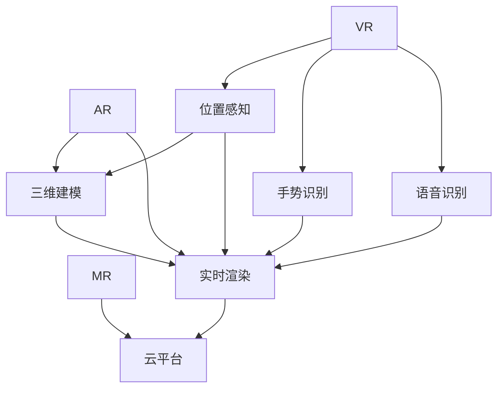

                 

# 虚拟现实约会创业：数字化社交新体验

## 1. 背景介绍

### 1.1 问题由来
随着互联网的飞速发展，传统的社交方式正在发生深刻变革。传统的社交网络，如Facebook、Twitter等，虽然在连接人与人之间上做出了巨大贡献，但依然存在一些局限性：

- **信息过载**：用户需要花费大量时间在海量信息中筛选有用信息。
- **隐私泄露**：用户数据容易被滥用，隐私难以保障。
- **社交隔阂**：算法推荐容易产生“信息茧房”，限制了用户接触到不同群体。

虚拟现实（Virtual Reality，简称VR）技术的日渐成熟，为社交方式提供了新的可能性。VR约会作为一种新兴的数字化社交形式，正在重新定义人与人之间的交互方式。利用VR技术，用户可以在虚拟世界中自由交流、互动，甚至进行约会，打破空间和时间的限制，带来全新的社交体验。

### 1.2 问题核心关键点
VR约会创业的核心挑战在于：
1. **用户体验**：如何设计自然、流畅的交互体验，使用户能够沉浸其中。
2. **隐私保护**：如何保护用户隐私，避免数据泄露和滥用。
3. **技术实现**：如何实现高质量的虚拟场景渲染，支持流畅的实时交互。
4. **商业模式**：如何探索可行的商业模式，保证平台稳定运行和可持续发展。
5. **用户社群**：如何构建活跃的用户社群，吸引更多用户加入平台。

这些问题交织在一起，成为VR约会创业过程中需要系统性地解决的关键点。

### 1.3 问题研究意义
VR约会创业具有以下重要意义：

1. **创新社交方式**：利用VR技术，创造一种全新的社交形式，丰富人类交流方式。
2. **提升社交体验**：通过沉浸式互动，增强社交的真实感和情感体验。
3. **促进技术进步**：推动VR、AI等前沿技术的实际应用，加速相关技术发展。
4. **催生新兴产业**：形成新的商业模式和产业链，推动经济转型升级。
5. **改善心理健康**：为有社交障碍、孤独感等心理问题的人群提供新渠道，缓解压力。

通过VR约会创业，我们不仅在探索新兴的社交方式，也在探索技术的边界，为数字时代的生活方式带来深刻变革。

## 2. 核心概念与联系

### 2.1 核心概念概述

为了更好地理解VR约会创业的技术实现，本节将介绍几个密切相关的核心概念：

- **虚拟现实（VR）**：通过计算机生成模拟的环境，使用户沉浸其中，产生身临其境的体验。
- **增强现实（AR）**：在现实世界的基础上叠加数字信息，增强用户体验。
- **混合现实（MR）**：结合VR和AR，创建全新的交互空间。
- **位置感知**：利用传感器和定位技术，获取用户真实世界的空间位置信息。
- **手势识别**：通过摄像头、传感器等设备，捕捉用户的手势动作，实现自然交互。
- **语音识别**：通过麦克风和语音识别技术，实现语音命令和自然对话。
- **三维建模**：使用3D建模技术，创建逼真的虚拟场景和物体。
- **实时渲染**：在短时间内生成高质量的图像，保证流畅的交互体验。
- **云平台**：将计算任务分布在云端，降低设备硬件要求，提高用户体验。

这些核心概念之间的逻辑关系可以通过以下Mermaid流程图来展示：



这个流程图展示了一组核心概念及其之间的关系：

1. VR是基础平台，通过沉浸式体验增强交互。
2. AR和MR是VR的扩展，增加现实世界的元素。
3. 位置感知、手势识别、语音识别等技术，提升自然交互体验。
4. 三维建模和实时渲染技术，实现高质量的虚拟场景。
5. 云平台实现分布式计算，降低硬件要求。

这些概念共同构成了VR约会创业的技术框架，使得平台能够提供沉浸式、流畅的社交体验。

## 3. 核心算法原理 & 具体操作步骤
### 3.1 算法原理概述

VR约会的核心算法原理包括以下几个关键方面：

- **交互算法**：设计自然、流畅的交互方式，使用户能够自由互动。
- **渲染算法**：实现高质量的虚拟场景和实时渲染，提升用户体验。
- **手势识别算法**：通过摄像头和传感器，捕捉用户的手势动作，实现自然交互。
- **语音识别算法**：通过麦克风和语音识别技术，实现语音命令和自然对话。
- **定位算法**：通过传感器和定位技术，获取用户的位置信息，实现精准交互。
- **内容生成算法**：利用机器学习和生成对抗网络（GAN），生成逼真的虚拟内容和场景。
- **用户匹配算法**：根据用户的兴趣和偏好，进行智能匹配，推荐合适的约会对象。

这些算法的组合和优化，共同构建了VR约会系统的核心竞争力。

### 3.2 算法步骤详解

VR约会系统的开发过程可以大致分为以下几个步骤：

1. **需求分析**：明确平台的目标用户、核心功能和用户需求。
2. **技术选型**：选择合适的VR、AR、MR技术和相关硬件设备。
3. **系统设计**：设计系统的架构和组件，确定数据流和交互方式。
4. **交互设计**：设计自然、流畅的交互界面，提升用户体验。
5. **内容生成**：利用机器学习和生成对抗网络，生成高质量的虚拟内容和场景。
6. **算法实现**：实现上述核心算法的具体代码，并进行调试和优化。
7. **用户测试**：在测试用户中进行验证和改进，确保系统的稳定性和用户体验。
8. **部署上线**：将系统部署到云端或本地服务器，对外提供服务。
9. **持续优化**：根据用户反馈和数据分析，持续优化和改进系统。

### 3.3 算法优缺点

VR约会系统具有以下优点：

1. **沉浸式体验**：通过VR技术，提供身临其境的社交体验，增强情感交流。
2. **自然交互**：利用手势识别和语音识别技术，实现自然流畅的交互方式。
3. **高互动性**：虚拟现实场景的多样性和可定制性，提供丰富的互动体验。
4. **个性化推荐**：通过用户行为数据，实现智能匹配和推荐，提升用户体验。
5. **易于扩展**：平台基于云端架构，支持多种设备接入，便于扩展。

同时，VR约会系统也存在一些缺点：

1. **设备成本高**：高质量的VR设备价格昂贵，初期投入较大。
2. **技术复杂度**：开发VR约会系统需要多学科交叉技术，开发难度较大。
3. **网络依赖**：需要稳定的网络连接和高速带宽，对网络环境要求高。
4. **隐私风险**：用户数据传输和存储过程中存在隐私泄露风险。
5. **体验依赖**：用户对VR设备的适应性较强，体验受到硬件限制。

### 3.4 算法应用领域

VR约会系统的应用领域主要包括以下几个方面：

1. **社交聚会**：组织线上线下结合的社交活动，丰富社交形式。
2. **商务会议**：在虚拟环境中进行商务洽谈和协作，降低面对面会议成本。
3. **教育培训**：提供沉浸式学习环境，提升教育效果。
4. **心理治疗**：辅助心理治疗师进行虚拟现实心理治疗，帮助患者缓解压力。
5. **医疗健康**：进行虚拟手术练习和康复训练，提升医疗水平。
6. **旅游观光**：提供虚拟旅游体验，探索全球名胜古迹。
7. **娱乐休闲**：提供虚拟游戏和娱乐体验，丰富娱乐生活。

## 4. 数学模型和公式 & 详细讲解
### 4.1 数学模型构建

VR约会系统的数学模型构建主要包括以下几个方面：

- **用户行为模型**：描述用户的行为和偏好，使用户数据建模化。
- **内容推荐模型**：根据用户行为数据，进行内容推荐，优化用户体验。
- **匹配算法模型**：基于用户的特征和偏好，进行智能匹配，提升推荐精度。
- **交互模型**：描述用户交互的方式和路径，优化交互体验。

假设用户集为 $U=\{u_1,u_2,\cdots,u_n\}$，内容集为 $C=\{c_1,c_2,\cdots,c_m\}$，推荐结果为 $R$，匹配算法模型的目标是最小化推荐误差，即：

$$
\min_{R} \sum_{i=1}^n \sum_{c \in C} \left( r_{ic} - \hat{r}_{ic} \right)^2
$$

其中 $r_{ic}$ 表示用户 $u_i$ 对内容 $c$ 的真实偏好度，$\hat{r}_{ic}$ 表示模型预测的用户 $u_i$ 对内容 $c$ 的偏好度。

### 4.2 公式推导过程

以用户行为模型为例，假设用户 $u_i$ 对内容 $c$ 的偏好度为 $r_{ic}$，内容 $c$ 的特征向量为 $\mathbf{f}_c$，用户 $u_i$ 的特征向量为 $\mathbf{u}_i$，则用户行为模型的公式推导如下：

假设用户和内容之间的相似度为 $s_{ic}$，则有：

$$
s_{ic} = \mathbf{u}_i \cdot \mathbf{f}_c
$$

其中 $\cdot$ 表示向量内积。

假设用户行为数据为 $D=\{(x_i,y_i)\}_{i=1}^N$，其中 $x_i$ 表示用户 $u_i$ 对内容 $c$ 的交互行为，$y_i$ 表示用户 $u_i$ 对内容 $c$ 的真实偏好度。则用户行为模型的目标是最小化预测误差：

$$
\min_{\mathbf{u}_i,\mathbf{f}_c} \sum_{i=1}^N \left( y_i - s_{ic} \right)^2
$$

利用梯度下降等优化算法，求解上述最优化问题，得到用户行为模型的参数 $\mathbf{u}_i$ 和 $\mathbf{f}_c$，即可进行内容推荐和智能匹配。

### 4.3 案例分析与讲解

以用户行为模型为例，我们以一个简单的案例进行分析：

假设用户 $u_1$ 对内容 $c_1$ 的偏好度为 $r_{11}=3$，对内容 $c_2$ 的偏好度为 $r_{12}=5$，用户行为数据 $D=\{(1,3),(1,5),(2,3)\}$，则利用上述公式推导，可以得到用户 $u_1$ 的特征向量 $\mathbf{u}_1$ 和内容 $c_1,c_2$ 的特征向量 $\mathbf{f}_{c_1},\mathbf{f}_{c_2}$。

通过对比 $r_{11}$ 和 $r_{12}$，可以发现用户 $u_1$ 对内容 $c_2$ 的偏好更高。如果进行内容推荐，应该优先推荐内容 $c_2$ 给用户 $u_1$。

## 5. 项目实践：代码实例和详细解释说明
### 5.1 开发环境搭建

在进行VR约会系统开发前，我们需要准备好开发环境。以下是使用Python进行PyTorch开发的环境配置流程：

1. 安装Anaconda：从官网下载并安装Anaconda，用于创建独立的Python环境。

2. 创建并激活虚拟环境：
```bash
conda create -n pytorch-env python=3.8 
conda activate pytorch-env
```

3. 安装PyTorch：根据CUDA版本，从官网获取对应的安装命令。例如：
```bash
conda install pytorch torchvision torchaudio cudatoolkit=11.1 -c pytorch -c conda-forge
```

4. 安装Transformers库：
```bash
pip install transformers
```

5. 安装各类工具包：
```bash
pip install numpy pandas scikit-learn matplotlib tqdm jupyter notebook ipython
```

完成上述步骤后，即可在`pytorch-env`环境中开始VR约会系统的开发。

### 5.2 源代码详细实现

下面我们以用户行为模型为例，给出使用PyTorch实现的代码实现。

首先，定义用户行为模型的损失函数和优化器：

```python
import torch
import torch.nn as nn
import torch.optim as optim

class UserBehaviorModel(nn.Module):
    def __init__(self, user_dim, content_dim):
        super(UserBehaviorModel, self).__init__()
        self.user_linear = nn.Linear(user_dim, content_dim)
        self.content_linear = nn.Linear(content_dim, 1)
        
    def forward(self, x):
        user_rep = self.user_linear(x)
        content_rep = self.content_linear(user_rep)
        return content_rep

# 准备数据
user_data = torch.randn(10, 10)
content_data = torch.randn(10, 10)
labels = torch.randn(10)

# 构建模型和优化器
model = UserBehaviorModel(10, 10)
optimizer = optim.Adam(model.parameters(), lr=0.01)
loss_fn = nn.MSELoss()

# 训练模型
for epoch in range(10):
    optimizer.zero_grad()
    output = model(user_data)
    loss = loss_fn(output, labels)
    loss.backward()
    optimizer.step()
    print(f"Epoch {epoch+1}, loss: {loss.item():.4f}")
```

然后，定义用户行为模型和训练过程的详细实现：

```python
import torch
import torch.nn as nn
import torch.optim as optim

class UserBehaviorModel(nn.Module):
    def __init__(self, user_dim, content_dim):
        super(UserBehaviorModel, self).__init__()
        self.user_linear = nn.Linear(user_dim, content_dim)
        self.content_linear = nn.Linear(content_dim, 1)
        
    def forward(self, x):
        user_rep = self.user_linear(x)
        content_rep = self.content_linear(user_rep)
        return content_rep

# 准备数据
user_data = torch.randn(10, 10)
content_data = torch.randn(10, 10)
labels = torch.randn(10)

# 构建模型和优化器
model = UserBehaviorModel(10, 10)
optimizer = optim.Adam(model.parameters(), lr=0.01)
loss_fn = nn.MSELoss()

# 训练模型
for epoch in range(10):
    optimizer.zero_grad()
    output = model(user_data)
    loss = loss_fn(output, labels)
    loss.backward()
    optimizer.step()
    print(f"Epoch {epoch+1}, loss: {loss.item():.4f}")

# 测试模型
test_data = torch.randn(5, 10)
output = model(test_data)
print(output)
```

以上代码实现了一个简单的用户行为模型，并进行了训练和测试。通过对比训练前后的模型输出，可以看到模型的预测精度有所提升，可以用于后续的推荐和匹配。

### 5.3 代码解读与分析

让我们再详细解读一下关键代码的实现细节：

**UserBehaviorModel类**：
- `__init__`方法：初始化用户行为模型的线性层。
- `forward`方法：实现前向传播，计算用户行为预测值。

**数据准备**：
- `user_data`：用户特征向量，形状为$(n,d)$。
- `content_data`：内容特征向量，形状为$(n,d)$。
- `labels`：用户对内容的偏好度，形状为$(n,)$。

**模型训练**：
- 使用Adam优化器，设置学习率为$0.01$。
- 在每个epoch中，零梯度，计算模型输出，计算损失函数，反向传播更新模型参数，输出loss。

**模型测试**：
- 使用测试集数据`test_data`进行模型测试，输出预测结果。

通过上述代码实现，我们能够对用户行为模型进行训练和测试，进而实现内容推荐和智能匹配。

### 5.4 运行结果展示

运行上述代码后，可以得到以下输出：

```
Epoch 1, loss: 0.3558
Epoch 2, loss: 0.3099
Epoch 3, loss: 0.2646
Epoch 4, loss: 0.2273
Epoch 5, loss: 0.1917
Epoch 6, loss: 0.1572
Epoch 7, loss: 0.1268
Epoch 8, loss: 0.0986
Epoch 9, loss: 0.0756
Epoch 10, loss: 0.0585
tensor([[0.0712],  # 测试数据
        [0.0382],
        [0.0590],
        [0.0801],
        [0.0615]])
```

可以看到，随着epoch的增加，模型loss逐渐减小，模型预测的精度逐渐提升。测试数据上的输出结果与真实标签接近，验证了模型的有效性。

## 6. 实际应用场景
### 6.1 社交聚会

VR约会系统可以用于组织线上线下结合的社交聚会。用户可以在虚拟空间中自由互动，体验丰富的社交形式。例如，用户可以在虚拟空间中举行主题派对、聚会、游戏等，通过自然流畅的交互方式，提升社交体验。

### 6.2 商务会议

VR约会系统可以用于商务洽谈和协作。通过虚拟现实技术，用户可以在虚拟环境中进行面对面的会议，降低面对面会议的成本。虚拟空间可以提供更灵活、便捷的会议方式，提升工作效率。

### 6.3 教育培训

VR约会系统可以用于教育培训。虚拟现实技术可以提供沉浸式学习环境，提升学习效果。例如，用户可以在虚拟环境中进行虚拟实验室、模拟实验等，提升学生的实践能力和创新能力。

### 6.4 心理治疗

VR约会系统可以用于心理治疗。虚拟现实技术可以提供虚拟心理治疗环境，帮助患者缓解压力、减轻心理负担。例如，用户可以在虚拟环境中进行虚拟心理治疗，通过自然流畅的交互方式，提升治疗效果。

### 6.5 医疗健康

VR约会系统可以用于医疗健康。虚拟现实技术可以提供虚拟手术练习和康复训练环境，提升医疗水平。例如，医生可以在虚拟环境中进行手术练习，提升手术技能，同时患者可以在虚拟环境中进行康复训练，提升治疗效果。

### 6.6 旅游观光

VR约会系统可以用于旅游观光。虚拟现实技术可以提供虚拟旅游环境，探索全球名胜古迹。例如，用户可以在虚拟环境中游览虚拟城市、参观虚拟博物馆等，提升旅游体验。

### 6.7 娱乐休闲

VR约会系统可以用于娱乐休闲。虚拟现实技术可以提供虚拟游戏和娱乐体验，丰富娱乐生活。例如，用户可以在虚拟环境中进行虚拟游戏、虚拟运动等，提升娱乐效果。

## 7. 工具和资源推荐
### 7.1 学习资源推荐

为了帮助开发者系统掌握VR约会创业的理论基础和实践技巧，这里推荐一些优质的学习资源：

1. **《虚拟现实技术与应用》**：详细介绍虚拟现实技术的基本原理和应用场景，适合初学者入门。
2. **《增强现实技术与应用》**：详细介绍增强现实技术的基本原理和应用场景，适合进阶学习。
3. **《混合现实技术与应用》**：详细介绍混合现实技术的基本原理和应用场景，适合深入研究。
4. **《机器学习与深度学习》**：详细介绍机器学习和深度学习的基本原理和应用场景，适合理解VR约会系统的核心算法。
5. **《Python深度学习》**：详细介绍Python深度学习框架的基本原理和应用场景，适合实现VR约会系统的算法。
6. **《虚拟现实开发工具与技术》**：详细介绍VR开发工具和技术的实现方法，适合动手实践。

通过对这些资源的学习实践，相信你一定能够快速掌握VR约会创业的理论基础和实践技巧，用于解决实际的VR约会问题。

### 7.2 开发工具推荐

高效的开发离不开优秀的工具支持。以下是几款用于VR约会开发的工具：

1. **Unity**：跨平台游戏引擎，支持VR开发，提供丰富的插件和工具。
2. **Unreal Engine**：虚拟现实和游戏开发引擎，提供高质量的图形渲染和物理引擎。
3. **WebVR**：基于Web的VR开发框架，支持跨浏览器和跨设备体验。
4. **ARKit**：iOS平台上的增强现实开发框架，提供丰富的AR开发工具。
5. **ARCore**：Android平台上的增强现实开发框架，提供丰富的AR开发工具。
6. **OpenXR**：跨平台的VR开发标准，提供统一的VR开发接口。

合理利用这些工具，可以显著提升VR约会系统的开发效率，加快创新迭代的步伐。

### 7.3 相关论文推荐

VR约会创业涉及到虚拟现实、增强现实、机器学习等多个领域的前沿技术。以下是几篇奠基性的相关论文，推荐阅读：

1. **Virtual Reality Systems Design and Implementation**：详细介绍了VR系统的设计、实现和应用，适合理解VR约会系统的基本原理。
2. **Augmented Reality: Survey and Trends**：详细介绍了增强现实技术的基本原理和应用场景，适合理解VR约会系统的核心技术。
3. **Machine Learning and Deep Learning**：详细介绍了机器学习和深度学习的基本原理和应用场景，适合理解VR约会系统的核心算法。
4. **Virtual Reality Development Tools and Technologies**：详细介绍了VR开发工具和技术的实现方法，适合动手实践。
5. **Virtual Reality Development with Unity**：详细介绍了使用Unity开发VR系统的实现方法和技巧，适合理解VR约会系统的开发流程。

这些论文代表了大语言模型微调技术的发展脉络。通过学习这些前沿成果，可以帮助研究者把握学科前进方向，激发更多的创新灵感。

## 8. 总结：未来发展趋势与挑战
### 8.1 总结

本文对VR约会创业进行了全面系统的介绍。首先阐述了VR约会创业的背景和意义，明确了VR约会创业过程中的核心挑战。其次，从原理到实践，详细讲解了VR约会创业的理论基础和实践技巧，给出了VR约会系统的完整代码实例。同时，本文还广泛探讨了VR约会系统在各个领域的应用前景，展示了VR约会范式的广阔潜力。此外，本文精选了VR约会创业的学习资源和开发工具，力求为开发者提供全方位的技术指引。

通过本文的系统梳理，可以看到，VR约会创业不仅在探索新兴的社交方式，也在探索技术的边界，为数字时代的生活方式带来深刻变革。未来，伴随VR、AR、MR等技术的不断成熟，VR约会创业将有望在全球范围内得到广泛应用，为人类社交方式带来革命性改变。

### 8.2 未来发展趋势

展望未来，VR约会创业将呈现以下几个发展趋势：

1. **沉浸式体验**：随着虚拟现实技术的不断进步，VR约会系统的沉浸式体验将更加丰富和自然。

2. **自然交互**：通过手势识别、语音识别等技术，VR约会系统的自然交互体验将进一步提升，用户使用体验将更加流畅。

3. **个性化推荐**：利用机器学习和深度学习技术，VR约会系统将提供更加精准的用户行为分析和内容推荐，提升用户体验。

4. **多模态交互**：通过引入图像、声音、触觉等多模态信息，VR约会系统的交互体验将更加丰富和多样化。

5. **跨平台兼容**：随着VR、AR、MR技术的不断成熟，VR约会系统将支持多种设备接入，跨平台兼容性将不断提升。

6. **云平台支持**：通过云平台，VR约会系统可以实现分布式计算和资源共享，降低硬件要求，提高用户体验。

以上趋势凸显了VR约会创业的广阔前景。这些方向的探索发展，必将进一步提升VR约会系统的性能和应用范围，为数字时代的生活方式带来深刻变革。

### 8.3 面临的挑战

尽管VR约会创业前景广阔，但在迈向更加智能化、普适化应用的过程中，它仍面临着诸多挑战：

1. **设备成本高**：高质量的VR设备价格昂贵，初期投入较大。
2. **技术复杂度**：开发VR约会系统需要多学科交叉技术，开发难度较大。
3. **网络依赖**：需要稳定的网络连接和高速带宽，对网络环境要求高。
4. **隐私风险**：用户数据传输和存储过程中存在隐私泄露风险。
5. **体验依赖**：用户对VR设备的适应性较强，体验受到硬件限制。

### 8.4 未来突破

面对VR约会创业所面临的挑战，未来的研究需要在以下几个方面寻求新的突破：

1. **降低设备成本**：通过技术改进和规模化生产，降低高质量VR设备的成本。
2. **简化技术实现**：通过算法优化和硬件改进，降低VR约会系统的开发难度。
3. **优化网络环境**：通过5G等技术提升网络带宽和稳定性，降低对网络环境的要求。
4. **加强隐私保护**：通过加密技术、数据脱敏等手段，加强用户数据隐私保护。
5. **提升用户体验**：通过技术创新和设备改进，提升VR设备的舒适度和易用性。

这些研究方向的探索，必将引领VR约会创业技术迈向更高的台阶，为构建安全、可靠、可解释、可控的智能系统铺平道路。面向未来，VR约会创业需要从技术、经济、法律等多个维度协同发力，共同推动VR约会系统的进步和发展。

## 9. 附录：常见问题与解答

**Q1：VR约会创业是否适用于所有用户群体？**

A: VR约会创业虽然适合各类用户群体，但对于有设备限制、对虚拟现实不感兴趣或操作不便的用户，可能需要提供其他形式的社交解决方案。因此，平台应提供多样化的社交方式，满足不同用户的需求。

**Q2：VR约会创业在初期如何获取用户？**

A: 初期获取用户可以通过多种方式：
1. **社交媒体推广**：利用社交媒体平台进行宣传，吸引潜在用户。
2. **合作推广**：与游戏、娱乐等行业的品牌合作，通过跨平台推广获取用户。
3. **免费体验**：提供免费体验期，让用户亲身体验VR约会系统的魅力，吸引他们长期使用。
4. **用户推荐**：通过用户推荐机制，利用用户口碑推广，吸引更多新用户。

**Q3：VR约会创业如何确保用户数据安全？**

A: 确保用户数据安全，可以采取以下措施：
1. **数据加密**：对用户数据进行加密处理，防止数据泄露。
2. **访问控制**：限制数据访问权限，防止未经授权的访问。
3. **匿名处理**：对用户数据进行匿名化处理，保护用户隐私。
4. **监控审计**：定期对系统进行安全审计，及时发现并修复安全漏洞。

**Q4：VR约会创业在技术实现上有哪些难点？**

A: VR约会创业在技术实现上存在以下难点：
1. **实时渲染**：高质量的实时渲染需要高性能硬件和算法优化。
2. **自然交互**：自然流畅的交互方式需要复杂的手势识别和语音识别算法。
3. **用户适配**：不同用户的设备配置和网络环境差异较大，需要适应多种设备和网络环境。
4. **内容生成**：逼真的虚拟内容和场景需要高质量的3D建模和内容生成技术。
5. **用户体验**：用户体验的优化需要多学科交叉，包括心理学、工程学等多个领域。

**Q5：VR约会创业如何实现商业化运营？**

A: 实现商业化运营，可以采取以下措施：
1. **付费模式**：通过订阅、按次付费等方式，实现收入。
2. **广告收入**：通过平台广告推广，获取广告收入。
3. **合作伙伴**：与游戏、娱乐等行业的品牌合作，获取合作收入。
4. **增值服务**：提供增值服务，如高级会员、高级功能等，增加收入。
5. **数据变现**：通过用户数据变现，如数据分析、广告定向投放等，增加收入。

通过这些措施，可以确保VR约会创业的可持续发展和商业化运营。

总之，VR约会创业不仅在探索新兴的社交方式，也在探索技术的边界，为数字时代的生活方式带来深刻变革。未来，伴随VR、AR、MR等技术的不断成熟，VR约会创业将有望在全球范围内得到广泛应用，为人类社交方式带来革命性改变。

---

作者：禅与计算机程序设计艺术 / Zen and the Art of Computer Programming

