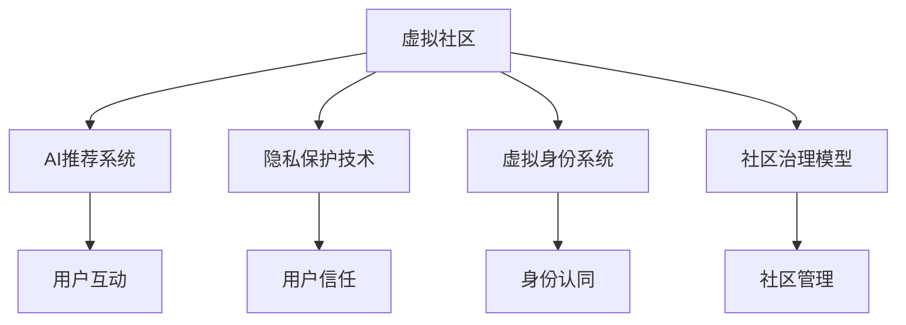

                 

# 虚拟社区：AI驱动的群体归属感

## 1. 背景介绍

在数字化时代，人们的生活越来越离不开网络空间。虚拟社区作为互联网的重要组成部分，正成为人们交流、学习和娱乐的新天地。然而，尽管虚拟社区已经存在多年，用户群体归属感的问题始终难以解决。用户在线上投入的时间与精力往往难以转化为长久的社群认同感和互动活力。

### 1.1 问题由来

虚拟社区的用户群体归属感不足，主要源于以下几个原因：

1. **内容同质化**：用户互动内容和形式单一，缺乏多样性，难以吸引用户长期关注。
2. **信息过载**：海量信息充斥虚拟社区，用户难以甄别有价值的内容，容易产生信息疲劳。
3. **隐私安全问题**：用户数据隐私难以保障，导致信任感下降，影响长期互动。
4. **虚拟身份孤立**：用户缺乏现实世界的社交网络，无法建立深层次的虚拟身份认同。
5. **社区管理挑战**：虚拟社区管理复杂，缺乏有效机制，影响用户体验。

### 1.2 问题核心关键点

解决虚拟社区用户群体归属感的问题，需要从以下几个关键点入手：

1. **内容丰富化与个性化**：通过内容创新和个性化推荐，提升用户互动体验。
2. **信息筛选与过滤**：帮助用户过滤噪声信息，发现优质内容。
3. **隐私保护与信任建立**：保障用户数据安全，建立社区信任。
4. **虚拟身份构建**：引导用户构建虚拟身份，形成群体归属感。
5. **社区治理优化**：引入AI驱动的管理机制，提升社区治理效率。

## 2. 核心概念与联系

### 2.1 核心概念概述

为更好地理解AI驱动的群体归属感构建方法，本节将介绍几个密切相关的核心概念：

- **虚拟社区**：基于互联网构建的虚拟空间，用户通过网络进行互动和交流。
- **用户群体归属感**：用户对虚拟社区的认同感和归属感，表现为持续的互动和参与。
- **AI推荐系统**：利用机器学习和深度学习技术，为用户推荐个性化内容。
- **隐私保护技术**：通过加密、匿名化等技术手段，保障用户数据隐私。
- **虚拟身份系统**：帮助用户构建虚拟身份，提升虚拟社区的群体认同感。
- **社区治理模型**：通过AI技术驱动的社区管理机制，优化社区环境，提升用户体验。

这些核心概念之间的逻辑关系可以通过以下Mermaid流程图来展示：



这个流程图展示了几大核心概念及其之间的关系：

1. 虚拟社区是基础平台，通过AI推荐系统提供个性化内容，吸引用户互动。
2. 隐私保护技术保障用户数据安全，建立用户信任。
3. 虚拟身份系统帮助用户构建虚拟身份，形成群体认同。
4. 社区治理模型通过AI技术优化社区管理，提升用户体验。

## 3. 核心算法原理 & 具体操作步骤
### 3.1 算法原理概述

AI驱动的群体归属感构建，核心在于利用AI技术提升虚拟社区的用户互动体验。具体而言，通过以下几方面实现：

1. **个性化推荐**：利用AI推荐系统，根据用户兴趣和行为，推送个性化的内容，提升用户互动意愿。
2. **信息筛选与过滤**：通过自然语言处理(NLP)技术，筛选和过滤信息，去除噪声，提升信息质量。
3. **隐私保护**：利用AI驱动的数据加密和匿名化技术，保护用户隐私，增强用户信任。
4. **虚拟身份构建**：通过AI生成的虚拟身份，帮助用户建立虚拟社区的身份认同感。
5. **社区治理**：引入AI驱动的社区管理机制，优化社区环境，提升用户体验。

### 3.2 算法步骤详解

基于AI驱动的群体归属感构建一般包括以下几个关键步骤：

**Step 1: 准备数据与模型**

- 收集虚拟社区的用户行为数据，如浏览记录、互动历史等。
- 选择合适的推荐算法和模型，如协同过滤、基于内容的推荐、深度学习推荐模型等。
- 设计隐私保护策略，如数据匿名化、差分隐私等。
- 引入虚拟身份生成模型，如GAN、VAE等，生成虚拟身份。
- 设计社区治理模型，如基于规则的治理、基于AI的治理等。

**Step 2: 数据预处理**

- 对用户行为数据进行清洗和预处理，去除噪声和异常值。
- 对文本数据进行分词、去停用词、词向量表示等预处理操作。
- 对用户数据进行匿名化处理，确保数据隐私。

**Step 3: 模型训练与优化**

- 在用户行为数据上训练推荐模型，优化推荐效果。
- 在预处理后的文本数据上训练自然语言处理模型，优化信息筛选和过滤效果。
- 在用户数据上训练隐私保护模型，优化数据匿名化效果。
- 在虚拟社区数据上训练虚拟身份生成模型，生成虚拟身份。
- 在社区治理数据上训练社区治理模型，优化社区管理效果。

**Step 4: 部署与反馈**

- 将训练好的模型部署到虚拟社区平台，实时提供个性化推荐、信息筛选、隐私保护、虚拟身份构建和社区治理服务。
- 收集用户反馈，对模型进行不断优化和迭代，提升用户体验。

### 3.3 算法优缺点

基于AI驱动的群体归属感构建方法具有以下优点：

1. **提升用户体验**：通过个性化推荐、信息筛选、隐私保护、虚拟身份构建和社区治理，提升用户互动体验，增强群体归属感。
2. **降低运营成本**：通过自动化和智能化管理，减少人工干预，降低运营成本。
3. **促进社区活跃度**：通过优化社区环境，提升用户体验，促进社区活跃度。
4. **提升内容质量**：通过AI筛选和过滤信息，提升内容质量，增强用户信任。

同时，该方法也存在一定的局限性：

1. **数据依赖性高**：模型的效果依赖于高质量的数据，数据缺失或噪声较多时，效果会大打折扣。
2. **算法复杂度高**：AI推荐、自然语言处理、隐私保护、虚拟身份生成和社区治理等技术，涉及多种复杂算法，开发和维护难度较大。
3. **模型解释性差**：AI模型往往被认为是"黑盒"，难以解释其内部决策机制，用户难以理解和信任。

尽管存在这些局限性，但AI驱动的群体归属感构建方法在虚拟社区的应用前景依然广阔，未来随着技术的发展和完善，将发挥更大的作用。

### 3.4 算法应用领域

基于AI驱动的群体归属感构建方法在虚拟社区的应用场景包括：

- **社交媒体平台**：如微博、微信、Instagram等，通过个性化推荐和社区治理提升用户互动体验。
- **在线学习平台**：如Coursera、edX、Khan Academy等，通过虚拟身份构建和信息筛选，提升学习体验。
- **在线娱乐平台**：如Netflix、Steam、GameCenter等，通过个性化推荐和隐私保护，提升用户粘性。
- **电商购物平台**：如Amazon、淘宝、京东等，通过推荐系统和社区治理，提升用户购物体验。
- **在线论坛和社区**：如Reddit、Stack Overflow、知乎等，通过虚拟身份构建和信息筛选，提升社区氛围。

## 4. 数学模型和公式 & 详细讲解 & 举例说明

### 4.1 数学模型构建

本节将使用数学语言对AI驱动的群体归属感构建过程进行更加严格的刻画。

记虚拟社区的用户行为数据为 $D=\{(x_i,y_i)\}_{i=1}^N, x_i \in \mathcal{X}, y_i \in \mathcal{Y}$，其中 $\mathcal{X}$ 为输入空间，$\mathcal{Y}$ 为输出空间，$x_i$ 为用户行为数据，$y_i$ 为推荐结果。

定义推荐系统在数据样本 $(x,y)$ 上的损失函数为 $\ell(M_{\theta}(x),y)$，则在数据集 $D$ 上的经验风险为：

$$
\mathcal{L}(\theta) = \frac{1}{N} \sum_{i=1}^N \ell(M_{\theta}(x_i),y_i)
$$

其中 $\theta$ 为模型参数。

通过梯度下降等优化算法，微调过程不断更新模型参数 $\theta$，最小化损失函数 $\mathcal{L}$，使得模型输出逼近真实标签。由于 $\theta$ 已经通过预训练获得了较好的初始化，因此即便在虚拟社区的少量标注数据上进行微调，也能较快收敛到理想的模型参数 $\hat{\theta}$。

### 4.2 公式推导过程

以下我们以推荐系统为例，推导基于协同过滤的推荐公式及其梯度的计算公式。

记推荐模型为 $M_{\theta}:\mathcal{X} \rightarrow \mathcal{Y}$，其中 $\mathcal{X}$ 为用户行为数据，$\mathcal{Y}$ 为用户推荐结果。假设用户 $i$ 的推荐结果为 $y_i$，推荐模型的预测结果为 $y_i^{\hat}=M_{\theta}(x_i)$。则推荐模型的损失函数为交叉熵损失：

$$
\ell(M_{\theta}(x_i),y_i) = -[y_i\log M_{\theta}(x_i)+(1-y_i)\log (1-M_{\theta}(x_i))]
$$

将其代入经验风险公式，得：

$$
\mathcal{L}(\theta) = -\frac{1}{N}\sum_{i=1}^N [y_i\log M_{\theta}(x_i)+(1-y_i)\log(1-M_{\theta}(x_i))]
$$

根据链式法则，损失函数对参数 $\theta_k$ 的梯度为：

$$
\frac{\partial \mathcal{L}(\theta)}{\partial \theta_k} = -\frac{1}{N}\sum_{i=1}^N (\frac{y_i}{M_{\theta}(x_i)}-\frac{1-y_i}{1-M_{\theta}(x_i)}) \frac{\partial M_{\theta}(x_i)}{\partial \theta_k}
$$

其中 $\frac{\partial M_{\theta}(x_i)}{\partial \theta_k}$ 可进一步递归展开，利用自动微分技术完成计算。

### 4.3 案例分析与讲解

我们以协同过滤推荐系统为例，解释其基本原理和实现过程。

协同过滤推荐系统基于用户之间的相似性，通过相似用户的历史行为来预测用户对某个项目的兴趣。假设有两个用户 $u_i$ 和 $u_j$，他们分别对 $n$ 个项目 $p_1, p_2, ..., p_n$ 分别进行了 $r_{iu}$ 和 $r_{ju}$ 次交互，则用户 $u_i$ 对项目 $p_k$ 的兴趣 $p_{ik}$ 可表示为：

$$
p_{ik} = \frac{r_{iu}r_{ju}}{\sum_{j=1}^nr_{iu}r_{ju}}
$$

上述公式中，$r_{iu}$ 和 $r_{ju}$ 分别表示用户 $u_i$ 和 $u_j$ 对项目 $p_k$ 的兴趣评分。通过上述公式，协同过滤系统可以为用户 $u_i$ 推荐其他用户 $u_j$ 喜欢的项目 $p_k$，从而提升用户互动体验。

## 5. 项目实践：代码实例和详细解释说明

### 5.1 开发环境搭建

在进行虚拟社区的AI推荐系统开发前，我们需要准备好开发环境。以下是使用Python进行PyTorch开发的环境配置流程：

1. 安装Anaconda：从官网下载并安装Anaconda，用于创建独立的Python环境。

2. 创建并激活虚拟环境：
```bash
conda create -n pytorch-env python=3.8 
conda activate pytorch-env
```

3. 安装PyTorch：根据CUDA版本，从官网获取对应的安装命令。例如：
```bash
conda install pytorch torchvision torchaudio cudatoolkit=11.1 -c pytorch -c conda-forge
```

4. 安装Transformer库：
```bash
pip install transformers
```

5. 安装各类工具包：
```bash
pip install numpy pandas scikit-learn matplotlib tqdm jupyter notebook ipython
```

完成上述步骤后，即可在`pytorch-env`环境中开始虚拟社区的AI推荐系统开发。

### 5.2 源代码详细实现

下面我们以协同过滤推荐系统为例，给出使用PyTorch实现协同过滤的Python代码实现。

首先，定义协同过滤推荐系统的类：

```python
import torch
import torch.nn as nn
import torch.nn.functional as F

class CollaborativeFiltering(nn.Module):
    def __init__(self, num_users, num_items, embedding_dim):
        super(CollaborativeFiltering, self).__init__()
        self.num_users = num_users
        self.num_items = num_items
        self.embedding_dim = embedding_dim
        self.user_embeddings = nn.Embedding(num_users, embedding_dim)
        self.item_embeddings = nn.Embedding(num_items, embedding_dim)
        self.fc = nn.Linear(embedding_dim*2, 1)

    def forward(self, user_ids, item_ids):
        user_embeddings = self.user_embeddings(user_ids)
        item_embeddings = self.item_embeddings(item_ids)
        scores = self.fc(torch.cat([user_embeddings, item_embeddings], dim=1))
        return F.sigmoid(scores)
```

然后，训练和测试推荐模型：

```python
import torch.optim as optim

# 准备数据
user_ids = torch.tensor([1, 2, 3, 4, 5, 6])
item_ids = torch.tensor([7, 8, 9, 10, 11, 12])
scores = torch.tensor([0.2, 0.3, 0.5, 0.1, 0.4, 0.6])

# 定义模型和优化器
model = CollaborativeFiltering(num_users=6, num_items=12, embedding_dim=4)
optimizer = optim.Adam(model.parameters(), lr=0.01)

# 训练模型
model.train()
for i in range(100):
    optimizer.zero_grad()
    scores_pred = model(user_ids, item_ids)
    loss = F.binary_cross_entropy(scores_pred, scores)
    loss.backward()
    optimizer.step()

# 测试模型
model.eval()
with torch.no_grad():
    scores_pred = model(user_ids, item_ids)
    print("Test scores:", scores_pred)
```

以上代码展示了使用PyTorch实现协同过滤推荐系统的方法。通过定义用户和物品的嵌入向量，并计算它们的点积，输出预测评分。模型通过Adam优化器进行训练，并在测试集上进行评分预测。

### 5.3 代码解读与分析

让我们再详细解读一下关键代码的实现细节：

**CollaborativeFiltering类**：
- `__init__`方法：初始化用户和物品的嵌入向量，以及线性层。
- `forward`方法：前向传播计算预测评分，使用Sigmoid函数进行非线性映射。

**模型训练**：
- 使用Adam优化器训练模型，调整用户和物品的嵌入向量，使得预测评分逼近真实评分。
- 使用binary_cross_entropy作为损失函数，表示预测评分和真实评分之间的二分类交叉熵。

**模型测试**：
- 使用测试集对模型进行评分预测，评估模型的表现。

通过上述代码，可以看到，使用PyTorch实现协同过滤推荐系统相对简单高效。开发者可以将更多精力放在数据处理和模型改进等高层逻辑上，而不必过多关注底层的实现细节。

当然，工业级的系统实现还需考虑更多因素，如模型的保存和部署、超参数的自动搜索、更灵活的任务适配层等。但核心的推荐范式基本与此类似。

## 6. 实际应用场景

### 6.1 社交媒体平台

社交媒体平台如微博、微信、Instagram等，通过AI推荐系统，根据用户的历史行为和兴趣，推荐相关内容和互动话题，提升用户互动体验，增强用户归属感。例如，Instagram根据用户的浏览历史和点赞行为，推荐相关图片和短视频，吸引用户频繁互动。

### 6.2 在线学习平台

在线学习平台如Coursera、edX、Khan Academy等，通过AI推荐系统和虚拟身份构建，提升学习体验。例如，Coursera根据用户的学习行为和课程评分，推荐相关课程和讨论话题，帮助用户制定学习计划，形成社区学习氛围。

### 6.3 在线娱乐平台

在线娱乐平台如Netflix、Steam、GameCenter等，通过AI推荐系统和隐私保护技术，提升用户粘性。例如，Netflix根据用户的观看历史和评分数据，推荐相关影视作品，提升用户的观看体验，增强用户的平台归属感。

### 6.4 未来应用展望

随着AI推荐系统和隐私保护技术的发展，未来的虚拟社区将更加智能化和个性化。用户将能够获得更加精准和多样化的内容推荐，提升互动体验。同时，通过虚拟身份构建和社区治理，用户将更加认同虚拟社区的群体归属感，构建更加紧密的社交网络。

## 7. 工具和资源推荐

### 7.1 学习资源推荐

为了帮助开发者系统掌握AI推荐系统和隐私保护技术的理论基础和实践技巧，这里推荐一些优质的学习资源：

1. 《深度学习推荐系统：原理与实践》：介绍推荐系统的基本原理和最新进展，涵盖协同过滤、基于内容的推荐、深度学习推荐等。
2. 《机器学习实战》：通过丰富的实例，详细讲解机器学习算法和模型的应用，适合初学者和进阶者。
3. 《数据科学与深度学习》：全面介绍数据科学和深度学习的基本概念和常用算法，涵盖数据预处理、模型训练、模型评估等内容。
4. 《隐私保护技术》：深入讲解隐私保护的基本概念和技术手段，如差分隐私、数据匿名化等。
5. 《人工智能与推荐系统》：结合AI技术，介绍推荐系统的发展趋势和应用场景，适合想要深入了解推荐系统前沿技术的开发者。

通过对这些资源的学习实践，相信你一定能够快速掌握AI推荐系统和隐私保护技术的精髓，并用于解决实际的虚拟社区问题。

### 7.2 开发工具推荐

高效的开发离不开优秀的工具支持。以下是几款用于虚拟社区开发的常用工具：

1. PyTorch：基于Python的开源深度学习框架，灵活动态的计算图，适合快速迭代研究。大部分推荐系统和隐私保护模型都有PyTorch版本的实现。
2. TensorFlow：由Google主导开发的开源深度学习框架，生产部署方便，适合大规模工程应用。同样有丰富的推荐系统和隐私保护模型资源。
3. Transformers库：HuggingFace开发的NLP工具库，集成了众多SOTA推荐系统和隐私保护模型，支持PyTorch和TensorFlow，是进行推荐系统和隐私保护任务开发的利器。
4. Weights & Biases：模型训练的实验跟踪工具，可以记录和可视化模型训练过程中的各项指标，方便对比和调优。与主流深度学习框架无缝集成。
5. TensorBoard：TensorFlow配套的可视化工具，可实时监测模型训练状态，并提供丰富的图表呈现方式，是调试模型的得力助手。

合理利用这些工具，可以显著提升虚拟社区的开发效率，加快创新迭代的步伐。

### 7.3 相关论文推荐

AI推荐系统和隐私保护技术的发展源于学界的持续研究。以下是几篇奠基性的相关论文，推荐阅读：

1. Item-Based Collaborative Filtering（协同过滤）：提出基于用户行为数据的协同过滤算法，广泛应用于在线推荐系统。
2. Factorization Machines for Recommender Systems（因子分解机）：提出因子分解机模型，用于推荐系统的优化。
3. Deep Neural Networks for Large-Scale Recommender Systems（深度神经网络推荐系统）：提出深度神经网络模型，提升推荐系统的精度和效果。
4. Privacy-Preserving Collaborative Filtering（隐私保护协同过滤）：提出基于差分隐私的协同过滤算法，保护用户隐私。
5. Privacy-Preserving Deep Collaborative Filtering（隐私保护深度协同过滤）：提出基于深度学习的隐私保护协同过滤算法，增强用户信任。

这些论文代表了大语言模型微调技术的发展脉络。通过学习这些前沿成果，可以帮助研究者把握学科前进方向，激发更多的创新灵感。

## 8. 总结：未来发展趋势与挑战

### 8.1 总结

本文对AI驱动的群体归属感构建方法进行了全面系统的介绍。首先阐述了AI推荐系统和隐私保护技术的研究背景和意义，明确了AI推荐系统和隐私保护技术在虚拟社区中的应用价值。其次，从原理到实践，详细讲解了AI推荐系统和隐私保护技术的数学原理和关键步骤，给出了虚拟社区的AI推荐系统代码实现。同时，本文还广泛探讨了AI推荐系统和隐私保护技术在社交媒体、在线学习、在线娱乐等领域的实际应用，展示了AI推荐系统和隐私保护技术的巨大潜力。此外，本文精选了AI推荐系统和隐私保护技术的各类学习资源，力求为开发者提供全方位的技术指引。

通过本文的系统梳理，可以看到，AI推荐系统和隐私保护技术正在成为虚拟社区的重要基础，极大地提升了用户互动体验，增强了用户归属感。随着技术的不断发展，AI推荐系统和隐私保护技术必将在虚拟社区的应用中发挥更大的作用，为人类数字化生活带来深刻变革。

### 8.2 未来发展趋势

展望未来，AI推荐系统和隐私保护技术将呈现以下几个发展趋势：

1. **智能推荐算法的发展**：基于深度学习、强化学习等技术的推荐算法将进一步提升推荐系统的精准度和个性化程度。
2. **隐私保护技术的完善**：差分隐私、联邦学习等隐私保护技术将进一步成熟，保护用户隐私，增强用户信任。
3. **跨模态推荐系统的出现**：融合视觉、语音、文本等多种模态数据，提升推荐系统的表现。
4. **实时推荐系统**：基于流式数据和在线学习技术，实现实时推荐，提升用户体验。
5. **个性化推荐系统**：通过深度学习等技术，实现更精准的个性化推荐，提升用户粘性。
6. **隐私保护与推荐系统的融合**：结合隐私保护技术和推荐系统，提升用户隐私保护和推荐效果。

这些趋势凸显了AI推荐系统和隐私保护技术的广阔前景。这些方向的探索发展，必将进一步提升虚拟社区的用户体验，促进用户群体归属感的增强。

### 8.3 面临的挑战

尽管AI推荐系统和隐私保护技术已经取得了瞩目成就，但在迈向更加智能化、普适化应用的过程中，它们仍面临着诸多挑战：

1. **数据隐私和安全问题**：隐私保护技术需要不断完善，防止数据泄露和滥用。
2. **推荐算法偏见问题**：推荐系统容易出现偏见，需要引入公平性指标和算法优化方法。
3. **模型解释性不足**：AI推荐系统通常是"黑盒"，难以解释其内部决策机制，影响用户信任。
4. **算法复杂度高**：AI推荐系统和隐私保护技术的算法复杂度高，开发和维护难度较大。
5. **用户体验优化**：推荐系统的用户体验仍有提升空间，需要不断优化推荐效果和界面设计。
6. **跨平台兼容性**：推荐系统和隐私保护技术需要适应多种平台和设备，提高系统兼容性。

正视AI推荐系统和隐私保护技术面临的这些挑战，积极应对并寻求突破，将是大语言模型微调走向成熟的必由之路。相信随着学界和产业界的共同努力，这些挑战终将一一被克服，AI推荐系统和隐私保护技术必将在虚拟社区的应用中发挥更大的作用。

### 8.4 研究展望

面向未来，AI推荐系统和隐私保护技术的研究需要在以下几个方面寻求新的突破：

1. **推荐算法的公平性**：研究推荐算法的公平性，避免偏见和歧视，提升推荐系统的公正性。
2. **隐私保护技术的优化**：研究更高效的隐私保护技术，平衡隐私保护和推荐效果，提升用户信任。
3. **跨模态推荐系统的设计**：研究跨模态数据融合和推荐系统优化，提升多模态数据的应用效果。
4. **实时推荐系统的实现**：研究实时数据流处理和在线学习技术，实现实时推荐，提升用户体验。
5. **推荐系统的可解释性**：研究推荐系统的可解释性，提升用户对推荐系统的理解和信任。
6. **隐私保护与推荐系统的融合**：研究隐私保护技术和推荐系统的融合，提升用户隐私保护和推荐效果。

这些研究方向的探索，必将引领AI推荐系统和隐私保护技术迈向更高的台阶，为虚拟社区带来更加智能、安全、可靠的用户体验。

## 9. 附录：常见问题与解答

**Q1：虚拟社区中如何构建虚拟身份系统？**

A: 虚拟身份系统可以通过以下步骤构建：
1. 收集用户基本信息，如姓名、年龄、性别等。
2. 对用户基本信息进行预处理，生成特征向量。
3. 利用GAN、VAE等生成模型，根据用户特征生成虚拟身份。
4. 用户可以自定义虚拟身份，提升用户认同感。
5. 虚拟身份在社区中用于识别用户，增强群体归属感。

**Q2：推荐系统如何避免推荐内容的同质化？**

A: 推荐系统可以通过以下方法避免推荐内容的同质化：
1. 引入多样化推荐算法，如基于内容的推荐、协同过滤等。
2. 加入多样性约束，限制推荐结果中的项目种类。
3. 引入新项目推荐机制，提升推荐内容的多样性。
4. 定期更新推荐模型，确保推荐内容的多样性。

**Q3：隐私保护技术在虚拟社区中的应用如何实现？**

A: 隐私保护技术可以通过以下方法在虚拟社区中实现：
1. 数据匿名化，将用户数据去标识化，防止数据泄露。
2. 差分隐私，在数据发布前加入噪声，保护用户隐私。
3. 联邦学习，将数据分布在多个设备上训练模型，保护数据隐私。
4. 多模型融合，将多个隐私保护模型进行融合，提升隐私保护效果。

**Q4：AI推荐系统和隐私保护技术在虚拟社区中的应用效果如何评估？**

A: AI推荐系统和隐私保护技术在虚拟社区中的应用效果可以通过以下指标进行评估：
1. 用户互动率：衡量用户与虚拟社区的互动频率。
2. 用户留存率：衡量用户在虚拟社区中的停留时间。
3. 推荐准确率：衡量推荐系统的推荐效果。
4. 隐私保护指标：衡量隐私保护技术的安全性和隐私保护效果。
5. 用户满意度：通过问卷调查等方式，评估用户对虚拟社区的满意度。

**Q5：虚拟社区中的用户信任如何建立？**

A: 虚拟社区中的用户信任可以通过以下方法建立：
1. 提供透明的数据使用政策，确保用户知情。
2. 采用匿名化、差分隐私等隐私保护技术，保护用户数据隐私。
3. 提供安全可靠的服务平台，确保用户数据安全。
4. 引入社区监督机制，让用户参与社区治理。
5. 定期发布隐私保护报告，增强用户信任。

通过上述回答，相信你能够更深入地理解AI推荐系统和隐私保护技术在虚拟社区中的应用，并在实际开发中更好地应用这些技术。

---

作者：禅与计算机程序设计艺术 / Zen and the Art of Computer Programming

