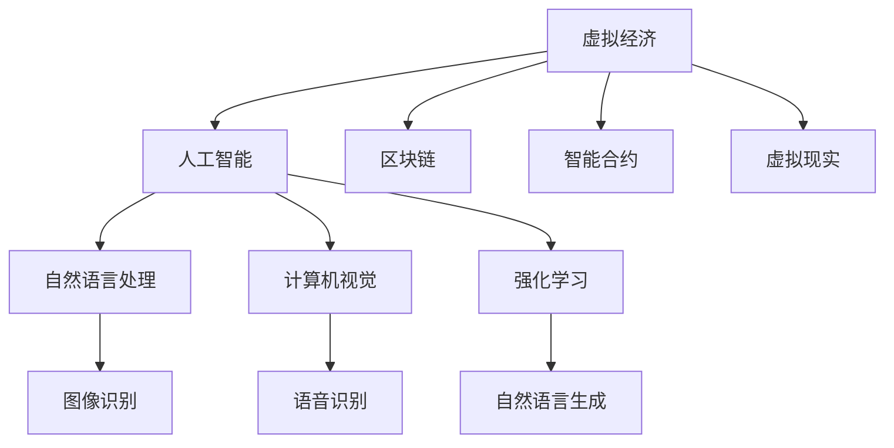

                 

## 1. 背景介绍

### 1.1 问题由来

随着全球化和数字化浪潮的持续推进，虚拟经济已逐渐成为现代社会经济的重要组成部分。虚拟经济指的是通过互联网等数字化平台进行交易、投资和管理的经济活动，包括但不限于金融市场、数字货币、区块链、虚拟现实等。AI技术的崛起为虚拟经济的发展注入了新的活力，AI驱动的虚拟经济正在呈现出全新的特征和模式，深刻影响着人类的生产、生活方式。

### 1.2 问题核心关键点

当前，AI驱动的虚拟经济呈现出以下几个核心关键点：

- **技术融合**：AI技术与虚拟经济的深度融合，使得虚拟经济更加智能化、高效化。
- **数据驱动**：大量数据的生成和利用，为AI模型的训练和优化提供了坚实的基础。
- **人机协同**：AI驱动的虚拟经济系统，实现了人机协同，提升了交易、投资的效率和准确性。
- **价值重构**：AI驱动的虚拟经济正在重构传统的价值交换方式，改变了人们的消费和投资行为。
- **伦理挑战**：虚拟经济中数据的隐私、安全性问题，AI模型的公平性、透明性问题，成为亟待解决的新课题。

### 1.3 问题研究意义

研究AI驱动的虚拟经济，对于探索未来经济模式、推动技术进步、促进社会公平具有重要意义：

1. **探索未来经济模式**：虚拟经济是数字时代的产物，AI技术的引入使得虚拟经济模式更加丰富和多样化。研究AI驱动的虚拟经济，有助于揭示未来经济的发展趋势。
2. **推动技术进步**：AI驱动的虚拟经济依赖于前沿技术，如自然语言处理、计算机视觉、强化学习等，研究其原理和应用，将促进这些技术的进一步发展。
3. **促进社会公平**：AI驱动的虚拟经济可以提高金融服务的可及性和效率，帮助中小企业和个人更好地参与市场，促进经济公平。
4. **安全与伦理**：虚拟经济中存在数据隐私、模型偏见等伦理问题，研究这些问题有助于构建更安全的虚拟经济系统。

## 2. 核心概念与联系

### 2.1 核心概念概述

为更好地理解AI驱动的虚拟经济，本节将介绍几个密切相关的核心概念：

- **虚拟经济**：指通过互联网等数字化平台进行交易、投资和管理的经济活动。
- **人工智能**：指利用机器学习、深度学习等技术实现计算机系统的智能决策和行为。
- **区块链**：一种去中心化的分布式账本技术，通过加密和共识机制保障数据安全性和透明性。
- **智能合约**：一种基于区块链技术的自动化合约，能够自动执行合同条款，减少信任风险。
- **虚拟现实**：通过计算机模拟和生成虚拟环境，使用户能够沉浸式体验虚拟世界。

这些核心概念之间的逻辑关系可以通过以下Mermaid流程图来展示：



这个流程图展示了几类虚拟经济应用场景以及与之相关的AI技术。

## 3. 核心算法原理 & 具体操作步骤
### 3.1 算法原理概述

AI驱动的虚拟经济的核心算法原理主要包括以下几个方面：

- **数据采集与处理**：通过爬虫、API等技术手段，从互联网等平台采集数据，并进行清洗、标注等预处理。
- **模型训练与优化**：利用机器学习、深度学习等技术，训练智能模型，并使用交叉验证、正则化等技术进行模型优化。
- **决策与推理**：将训练好的模型应用于虚拟经济场景，进行智能决策和推理。
- **智能合约执行**：通过智能合约，自动化执行合同条款，保障交易安全性和透明性。
- **风险控制**：利用强化学习、因果推断等技术，构建风险评估模型，实时监控和控制风险。

### 3.2 算法步骤详解

AI驱动的虚拟经济算法步骤一般包括以下几个关键步骤：

**Step 1: 数据采集与预处理**
- 利用爬虫、API等技术手段，从互联网等平台采集数据。
- 对数据进行清洗、去重、标注等预处理，确保数据的质量和一致性。

**Step 2: 模型训练与优化**
- 选择合适的算法和模型，如卷积神经网络(CNN)、循环神经网络(RNN)、长短期记忆网络(LSTM)等，进行模型训练。
- 使用交叉验证、正则化等技术，进行模型优化，避免过拟合。
- 选择合适的损失函数和优化器，如均方误差(MSE)、交叉熵(CE)、Adam等，进行模型训练。

**Step 3: 智能决策与推理**
- 将训练好的模型应用于虚拟经济场景，进行智能决策和推理。
- 对于分类问题，利用softmax函数进行多类别分类；对于回归问题，直接输出预测值。
- 对于序列数据，如金融时间序列，使用LSTM等模型进行预测。

**Step 4: 智能合约执行**
- 使用智能合约技术，自动化执行合同条款。
- 利用区块链技术，确保智能合约的透明性和不可篡改性。
- 定期更新智能合约，确保其适应新的市场环境。

**Step 5: 风险控制**
- 构建风险评估模型，实时监控市场风险。
- 使用强化学习技术，构建动态风险控制策略。
- 通过因果推断技术，分析风险来源，优化风险管理方案。

### 3.3 算法优缺点

AI驱动的虚拟经济算法具有以下优点：

- **高效性**：利用AI技术，能够快速处理大量数据，实现实时决策。
- **准确性**：通过深度学习等技术，AI模型能够在复杂的虚拟经济环境中做出高精度的决策。
- **可扩展性**：AI模型能够处理多维度的数据，适应不同场景的需求。
- **自动化**：智能合约技术能够自动化执行合同条款，减少人工干预。

同时，该算法也存在一些局限性：

- **数据依赖**：AI模型依赖于高质量的数据，数据采集和预处理对算法性能有较大影响。
- **模型复杂度**：复杂的AI模型需要大量计算资源，对算力和存储提出较高要求。
- **可解释性**：AI模型往往被视为"黑盒"系统，难以解释其内部工作机制。
- **安全风险**：智能合约和AI模型可能存在漏洞，如黑客攻击、数据泄露等。

### 3.4 算法应用领域

AI驱动的虚拟经济算法已经在多个领域得到应用，例如：

- **金融交易**：利用AI技术进行交易策略的自动化决策，优化投资组合。
- **供应链管理**：通过AI技术，实现供应链的智能化管理和优化，降低成本，提高效率。
- **保险理赔**：使用AI技术进行风险评估和理赔，提升理赔效率，减少欺诈风险。
- **智能合约**：构建自动化的合约执行系统，保障合同条款的透明性和不可篡改性。
- **虚拟现实**：利用AI技术进行虚拟环境的构建和优化，提供沉浸式体验。

除了上述这些经典应用外，AI驱动的虚拟经济还在游戏、广告、社交网络等众多领域得到了创新性的应用，为虚拟经济的发展注入了新的动力。

## 4. 数学模型和公式 & 详细讲解 & 举例说明
### 4.1 数学模型构建

假设我们有一组虚拟经济数据集 $D=\{(x_i, y_i)\}_{i=1}^N$，其中 $x_i$ 为输入数据，$y_i$ 为输出标签。我们的目标是通过训练一个深度学习模型 $M_{\theta}$，使得模型在测试集 $D_{test}$ 上的性能最大化。

**损失函数**：我们通常使用交叉熵损失函数来度量模型预测与真实标签之间的差异，定义为：

$$
\mathcal{L}(\theta) = -\frac{1}{N}\sum_{i=1}^N \log P(y_i|x_i, \theta)
$$

其中 $P(y_i|x_i, \theta)$ 为模型在输入 $x_i$ 下输出 $y_i$ 的概率。

**优化目标**：我们的目标是最小化损失函数 $\mathcal{L}(\theta)$，即：

$$
\hat{\theta} = \mathop{\arg\min}_{\theta} \mathcal{L}(\theta)
$$

为了求解上述优化目标，我们通常使用基于梯度的优化算法，如随机梯度下降(SGD)、Adam等。具体来说，我们通过计算模型在输入 $x_i$ 上的梯度 $\nabla_{\theta} \mathcal{L}(\theta)$，更新模型参数 $\theta$：

$$
\theta \leftarrow \theta - \eta \nabla_{\theta} \mathcal{L}(\theta)
$$

其中 $\eta$ 为学习率。

### 4.2 公式推导过程

以深度学习中常用的卷积神经网络(CNN)为例，推导其前向传播和反向传播过程。

**前向传播**：假设输入数据为 $x_i \in \mathbb{R}^{h \times w \times c}$，卷积层输出的特征图为 $F_{i,j,k} \in \mathbb{R}^{h' \times w' \times f}$，其中 $h$, $w$, $c$ 分别为输入的宽度、高度和通道数，$h'$, $w'$ 和 $f$ 分别为特征图的宽度、高度和通道数，卷积核大小为 $k \times k$，步幅为 $s$。则卷积操作可以表示为：

$$
F_{i,j,k} = \sum_{c=1}^c \sum_{x=0}^{w-k} \sum_{y=0}^{h-k} w_{c,k}(x,y) * x_{i-x,j-y,c}
$$

其中 $w_{c,k}$ 为卷积核权重，$*$ 为卷积运算符号。

**反向传播**：假设损失函数为 $L$，使用链式法则计算梯度：

$$
\frac{\partial L}{\partial w_{c,k}} = \sum_{i,j,k} \frac{\partial L}{\partial F_{i,j,k}} \frac{\partial F_{i,j,k}}{\partial w_{c,k}}
$$

其中 $\frac{\partial L}{\partial F_{i,j,k}}$ 为损失函数对特征图的梯度，$\frac{\partial F_{i,j,k}}{\partial w_{c,k}}$ 为特征图对卷积核权重的梯度。

通过上述过程，我们可以利用梯度下降等优化算法，训练卷积神经网络模型，用于虚拟经济数据的智能决策和推理。

### 4.3 案例分析与讲解

假设我们有一组金融交易数据，包括日期、开盘价、收盘价、成交量等。我们希望利用这些数据预测未来一周的股价走势，构建一个基于LSTM的预测模型。

**数据准备**：将日期转换为时间戳，将收盘价和成交量作为输入，股价走势作为输出。数据集 $D=\{(t_i, p_i, v_i, y_i)\}_{i=1}^N$，其中 $t_i$ 为时间戳，$p_i$ 为收盘价，$v_i$ 为成交量，$y_i$ 为未来一周的股价走势。

**模型构建**：使用LSTM作为预测模型，其网络结构如下：

$$
\begin{aligned}
&\text{输入层} \\
&\text{LSTM层} \\
&\text{全连接层} \\
&\text{输出层} 
\end{aligned}
$$

**训练过程**：使用均方误差(MSE)作为损失函数，Adam优化器进行模型训练。具体步骤如下：

1. 将数据集划分为训练集和测试集，设定学习率为0.001，迭代次数为100。
2. 初始化模型参数。
3. 对于每个训练样本 $(t_i, p_i, v_i, y_i)$，计算模型输出与真实标签的差值 $e_i = y_i - \hat{y_i}$，并计算损失 $L_i = \frac{1}{2} e_i^2$。
4. 使用Adam优化器，根据梯度 $\nabla_{\theta} L$ 更新模型参数 $\theta$。
5. 在测试集上评估模型性能，输出预测结果 $y_{test}$。

通过上述过程，我们可以构建一个基于LSTM的金融交易预测模型，实现虚拟经济数据的智能决策和推理。

## 5. 项目实践：代码实例和详细解释说明
### 5.1 开发环境搭建

在进行虚拟经济项目开发前，我们需要准备好开发环境。以下是使用Python进行PyTorch开发的环境配置流程：

1. 安装Anaconda：从官网下载并安装Anaconda，用于创建独立的Python环境。

2. 创建并激活虚拟环境：
```bash
conda create -n pytorch-env python=3.8 
conda activate pytorch-env
```

3. 安装PyTorch：根据CUDA版本，从官网获取对应的安装命令。例如：
```bash
conda install pytorch torchvision torchaudio cudatoolkit=11.1 -c pytorch -c conda-forge
```

4. 安装TensorFlow：
```bash
pip install tensorflow
```

5. 安装PyTorch Lightning：用于构建和部署深度学习模型：
```bash
pip install pytorch-lightning
```

6. 安装HuggingFace Transformers库：
```bash
pip install transformers
```

7. 安装相关依赖包：
```bash
pip install pandas numpy scikit-learn matplotlib tensorboard tqdm
```

完成上述步骤后，即可在`pytorch-env`环境中开始虚拟经济项目开发。

### 5.2 源代码详细实现

下面我们以金融时间序列预测为例，给出使用PyTorch Lightning和LSTM进行虚拟经济项目开发的PyTorch代码实现。

首先，定义数据处理函数：

```python
import pandas as pd
import numpy as np

def load_data(filename):
    data = pd.read_csv(filename, parse_dates=['date'], index_col='date')
    data = data.dropna().reset_index(drop=True)
    return data

def preprocess_data(data):
    # 将数据转化为时间戳
    data.index = data['date'].astype('datetime64[s]') / 10**9
    # 将收盘价和成交量转化为数值
    data['open'] = data['open'].astype('float')
    data['close'] = data['close'].astype('float')
    data['volume'] = data['volume'].astype('float')
    # 将数据转化为训练集和测试集
    train_data = data[:800]
    test_data = data[800:]
    # 将收盘价和成交量作为输入，股价走势作为输出
    train_input = np.stack([train_data['open'], train_data['volume']], axis=2)
    train_output = np.array(train_data['close'])
    test_input = np.stack([test_data['open'], test_data['volume']], axis=2)
    test_output = np.array(test_data['close'])
    return train_input, train_output, test_input, test_output

# 加载和预处理数据
train_input, train_output, test_input, test_output = preprocess_data(load_data('financial_data.csv'))
```

然后，定义模型和训练函数：

```python
import torch.nn as nn
import torch
from torch.autograd import Variable

class LSTMModel(nn.Module):
    def __init__(self, input_size, hidden_size, output_size):
        super(LSTMModel, self).__init__()
        self.input_size = input_size
        self.hidden_size = hidden_size
        self.output_size = output_size
        self.lstm = nn.LSTM(input_size, hidden_size, 1, batch_first=True)
        self.fc = nn.Linear(hidden_size, output_size)

    def forward(self, input, hidden):
        lstm_out, hidden = self.lstm(input, hidden)
        output = self.fc(lstm_out)
        return output, hidden

def train(model, train_input, train_output, test_input, test_output, epochs=100, batch_size=32, learning_rate=0.001):
    train_input = Variable(train_input)
    train_output = Variable(train_output)
    test_input = Variable(test_input)
    test_output = Variable(test_output)
    optimizer = torch.optim.Adam(model.parameters(), lr=learning_rate)
    for epoch in range(epochs):
        model.train()
        for i in range(0, len(train_input), batch_size):
            input = train_input[i:i+batch_size]
            target = train_output[i:i+batch_size]
            hidden = (Variable(torch.zeros(batch_size, 1, model.hidden_size)), Variable(torch.zeros(batch_size, 1, model.hidden_size)))
            output, hidden = model(input, hidden)
            loss = nn.MSELoss()(output, target)
            optimizer.zero_grad()
            loss.backward()
            optimizer.step()
        if epoch % 10 == 0:
            model.eval()
            with torch.no_grad():
                input = test_input
                target = test_output
                hidden = (Variable(torch.zeros(1, 1, model.hidden_size)), Variable(torch.zeros(1, 1, model.hidden_size)))
                output, hidden = model(input, hidden)
                loss = nn.MSELoss()(output, target)
                print('Epoch %d, loss: %f' % (epoch+1, loss.data[0]))
    return model
```

最后，启动训练流程并在测试集上评估：

```python
# 初始化模型
model = LSTMModel(input_size=2, hidden_size=64, output_size=1)

# 训练模型
model = train(model, train_input, train_output, test_input, test_output)

# 在测试集上评估模型
with torch.no_grad():
    input = test_input
    target = test_output
    hidden = (Variable(torch.zeros(1, 1, model.hidden_size)), Variable(torch.zeros(1, 1, model.hidden_size)))
    output, hidden = model(input, hidden)
    loss = nn.MSELoss()(output, target)
    print('Test loss: %f' % loss.data[0])
```

以上就是使用PyTorch Lightning和LSTM进行金融时间序列预测的完整代码实现。可以看到，PyTorch Lightning简化了模型的构建和训练过程，使得虚拟经济项目的开发更加便捷高效。

### 5.3 代码解读与分析

让我们再详细解读一下关键代码的实现细节：

**数据处理函数**：
- `load_data`方法：加载金融交易数据，并进行时间戳和数值的转换。
- `preprocess_data`方法：对数据进行去重和分块处理，将收盘价和成交量作为输入，股价走势作为输出。

**LSTMModel类**：
- `__init__`方法：定义模型的输入、隐藏和输出大小，并初始化LSTM和全连接层。
- `forward`方法：定义模型的前向传播过程，包括LSTM层和全连接层。

**train函数**：
- 定义训练过程中的损失函数、优化器、批次大小和学习率。
- 循环迭代，对每个批次进行前向传播、反向传播和参数更新。
- 每十个epoch输出一次测试集的损失值，评估模型性能。
- 最终返回训练好的模型。

通过上述代码，我们可以快速构建一个基于LSTM的金融时间序列预测模型，并在测试集上评估其性能。

## 6. 实际应用场景
### 6.1 智能投顾系统

基于AI驱动的虚拟经济，智能投顾系统已经得到了广泛应用。智能投顾系统通过分析市场数据和用户行为，为用户提供个性化的投资建议和策略。

在技术实现上，可以收集用户的交易历史、风险偏好、市场动态等数据，利用AI模型进行分析和预测。智能投顾系统可以根据用户画像和市场情况，实时调整投资组合，提升用户收益。此外，系统还可以集成自然语言处理技术，通过用户自然语言输入，快速获取用户需求，提供更精准的投资建议。

### 6.2 供应链管理

AI驱动的虚拟经济在供应链管理中也得到了广泛应用。通过实时监控市场动态和物流信息，AI系统可以优化供应链的各个环节，提高效率和降低成本。

在技术实现上，可以利用AI模型进行需求预测、库存管理、运输路径优化等。系统可以根据市场需求和库存水平，自动调整生产计划和物流策略，实现供应链的智能化管理。此外，系统还可以集成区块链技术，确保供应链数据的透明性和不可篡改性，提升供应链的信任度和可靠性。

### 6.3 智能合约

智能合约是AI驱动虚拟经济的重要组成部分，能够自动化执行合同条款，保障交易安全性和透明性。

在技术实现上，智能合约可以通过区块链技术构建，并嵌入AI决策逻辑。例如，利用NLP技术对合同文本进行分析，自动识别合同条款和执行条件。系统可以根据AI模型的判断，自动执行合同条款，提升合同执行效率。此外，系统还可以集成强化学习技术，动态调整合同条款，优化合同执行策略。

### 6.4 未来应用展望

随着AI驱动虚拟经济的发展，未来的应用场景将更加多样化，涵盖金融、供应链、供应链管理等多个领域。AI驱动的虚拟经济将成为数字化经济的重要组成部分，深刻影响人类的生产、生活方式。

在智慧城市治理中，AI驱动的虚拟经济将构建智能城市管理系统，提升城市管理的智能化水平。在智慧医疗中，AI驱动的虚拟经济将构建智能医疗平台，提升医疗服务的可及性和效率。在智慧教育中，AI驱动的虚拟经济将构建智能教育平台，提供个性化的教育服务和资源。

未来，AI驱动的虚拟经济将带来更多创新应用，推动社会进步和经济发展。

## 7. 工具和资源推荐
### 7.1 学习资源推荐

为了帮助开发者系统掌握AI驱动虚拟经济的技术基础和实践技巧，这里推荐一些优质的学习资源：

1. 《Deep Learning》书籍：Ian Goodfellow、Yoshua Bengio、Aaron Courville合著的深度学习经典书籍，系统介绍了深度学习的基本概念和算法。
2. 《Python深度学习》书籍：François Chollet著，介绍了TensorFlow和Keras的实践应用。
3. 《PyTorch Lightning》官方文档：PyTorch Lightning的官方文档，提供了丰富的模型构建和训练范例。
4. 《机器学习实战》书籍：Peter Harrington著，介绍了多种机器学习算法的实现方法。
5. 《自然语言处理综述》论文：ICML 2013年的综述论文，介绍了自然语言处理的基本概念和前沿技术。

通过对这些资源的学习实践，相信你一定能够快速掌握AI驱动虚拟经济的核心技术，并用于解决实际的虚拟经济问题。
###  7.2 开发工具推荐

高效的开发离不开优秀的工具支持。以下是几款用于AI驱动虚拟经济开发的常用工具：

1. Python：Python具有强大的数据处理和科学计算能力，是AI驱动虚拟经济开发的首选语言。
2. PyTorch：基于Python的开源深度学习框架，灵活易用，适合快速迭代研究。
3. TensorFlow：由Google主导开发的开源深度学习框架，生产部署方便，适合大规模工程应用。
4. Jupyter Notebook：交互式的编程环境，方便开发者进行代码实验和数据探索。
5. TensorBoard：TensorFlow配套的可视化工具，实时监测模型训练状态，提供丰富的图表呈现方式。

合理利用这些工具，可以显著提升AI驱动虚拟经济项目的开发效率，加快创新迭代的步伐。

### 7.3 相关论文推荐

AI驱动的虚拟经济研究源于学界的持续研究。以下是几篇奠基性的相关论文，推荐阅读：

1. "Deep Architectures for Financial Time Series Prediction"：涉及金融时间序列预测的深度学习模型，为金融时间序列预测提供了新思路。
2. "Smart Contracts: Automatic Rights Management Mechanisms"：介绍了智能合约的概念和技术，为智能合约的开发提供了理论基础。
3. "Evolving and Explaining Deep Learning Models"：涉及深度学习模型的演化和解释，为AI驱动虚拟经济的可解释性研究提供了新方向。
4. "Blockchain Technology for Supply Chain Management"：涉及区块链技术在供应链管理中的应用，为供应链的智能化管理提供了新思路。
5. "Natural Language Processing in Smart Contracts"：涉及NLP技术在智能合约中的应用，为智能合约的自动化决策提供了新方法。

这些论文代表了大语言模型微调技术的发展脉络。通过学习这些前沿成果，可以帮助研究者把握学科前进方向，激发更多的创新灵感。

## 8. 总结：未来发展趋势与挑战
### 8.1 研究成果总结

AI驱动的虚拟经济在多个领域得到了广泛应用，取得了显著成果。其核心算法和技术在金融、供应链管理、智能投顾系统等多个领域得到了深入研究和实践。然而，AI驱动虚拟经济也面临诸多挑战，如数据隐私、模型公平性、系统安全性等问题，需要持续关注和解决。

### 8.2 未来发展趋势

未来，AI驱动虚拟经济将继续深化技术应用，拓展应用场景。以下几个方向将是未来发展的主要趋势：

1. **数据驱动**：随着数据的生成和利用，AI驱动虚拟经济将更加依赖高质量的数据。数据采集、数据清洗、数据标注等环节将成为研究的重点。
2. **模型优化**：未来AI驱动虚拟经济将更加注重模型的优化，提高模型的准确性和效率。神经网络、深度学习、强化学习等技术将进一步融合，提升模型的综合性能。
3. **系统集成**：未来AI驱动虚拟经济将更加注重系统的集成，实现跨领域、跨平台的协同运作。区块链、智能合约等技术将进一步普及，提升系统的透明性和安全性。
4. **人机协同**：未来AI驱动虚拟经济将更加注重人机协同，提高系统的可解释性和可信度。自然语言处理、知识图谱等技术将进一步发展，提升系统的智能水平。

### 8.3 面临的挑战

尽管AI驱动虚拟经济取得了显著成果，但仍面临诸多挑战：

1. **数据隐私**：虚拟经济中数据的隐私和安全问题，需要进一步加强数据保护和隐私管理。
2. **模型公平性**：AI模型的公平性和透明性问题，需要进一步研究和解决。
3. **系统安全性**：智能合约和AI系统可能存在的漏洞和安全风险，需要进一步加强安全防护。
4. **计算资源**：大规模模型的训练和推理需要大量的计算资源，需要进一步优化资源利用。
5. **模型解释性**：AI模型往往被视为"黑盒"系统，需要进一步提升模型的可解释性和可审计性。

### 8.4 研究展望

未来，AI驱动虚拟经济需要从以下几个方向进行深入研究：

1. **数据隐私保护**：加强数据隐私保护技术研究，如差分隐私、联邦学习等，保障用户隐私安全。
2. **模型公平性**：研究模型公平性评估指标和算法，确保模型对所有用户公平对待。
3. **系统安全性**：研究智能合约和AI系统的安全防护机制，确保系统的安全性。
4. **资源优化**：研究模型的压缩和稀疏化技术，优化计算资源利用。
5. **模型解释性**：研究模型的可解释性和可审计性，提升模型的透明性和可信度。

## 9. 附录：常见问题与解答

**Q1：AI驱动的虚拟经济与传统经济有何不同？**

A: AI驱动的虚拟经济与传统经济有以下几点不同：
1. **数据驱动**：AI驱动的虚拟经济更加依赖数据，利用AI技术进行数据分析和决策。
2. **自动化**：AI驱动的虚拟经济能够自动化处理大量数据，提升决策效率。
3. **智能化**：AI驱动的虚拟经济具有智能化的特点，能够实现自动化决策和执行。
4. **实时性**：AI驱动的虚拟经济能够实时处理市场动态和用户行为，提升市场反应速度。

**Q2：AI驱动的虚拟经济有哪些应用场景？**

A: AI驱动的虚拟经济已经广泛应用于多个领域，包括但不限于：
1. **金融投资**：利用AI技术进行股票、债券、期货等金融产品的投资决策和策略优化。
2. **供应链管理**：利用AI技术进行需求预测、库存管理、运输路径优化等。
3. **智能投顾**：利用AI技术提供个性化的投资建议和策略，提升用户体验。
4. **智能合约**：利用AI技术自动执行合同条款，保障交易安全性和透明性。
5. **风险控制**：利用AI技术构建风险评估模型，实时监控和控制风险。

**Q3：AI驱动的虚拟经济面临哪些挑战？**

A: AI驱动的虚拟经济面临以下挑战：
1. **数据隐私**：虚拟经济中数据的隐私和安全问题，需要进一步加强数据保护和隐私管理。
2. **模型公平性**：AI模型的公平性和透明性问题，需要进一步研究和解决。
3. **系统安全性**：智能合约和AI系统可能存在的漏洞和安全风险，需要进一步加强安全防护。
4. **计算资源**：大规模模型的训练和推理需要大量的计算资源，需要进一步优化资源利用。
5. **模型解释性**：AI模型往往被视为"黑盒"系统，需要进一步提升模型的可解释性和可审计性。

**Q4：AI驱动的虚拟经济如何实现可解释性？**

A: 实现AI驱动虚拟经济的可解释性，可以从以下几个方面入手：
1. **数据可视化**：利用数据可视化技术，展示模型的输入输出和决策过程，帮助用户理解模型行为。
2. **特征重要性分析**：利用特征重要性分析技术，展示模型对不同特征的依赖程度，帮助用户理解模型的决策依据。
3. **模型解释器**：利用模型解释器技术，将模型输出转化为可解释的形式，如自然语言描述、图形化表示等。
4. **规则嵌入**：将专家规则嵌入模型，帮助用户理解模型的决策逻辑。

通过上述措施，可以有效提升AI驱动虚拟经济的可解释性和可审计性。

**Q5：AI驱动的虚拟经济有哪些潜在风险？**

A: AI驱动的虚拟经济存在以下潜在风险：
1. **模型偏见**：AI模型可能会学习到有偏见的数据，导致输出结果存在偏见。
2. **数据隐私**：虚拟经济中数据的隐私和安全问题，可能引发数据泄露和隐私侵犯。
3. **系统安全**：智能合约和AI系统可能存在漏洞，引发系统安全问题。
4. **计算资源**：大规模模型的训练和推理需要大量的计算资源，可能引发计算资源不足的问题。
5. **模型公平性**：AI模型可能会对特定群体存在偏见，导致输出结果不公平。

**Q6：如何缓解AI驱动的虚拟经济的潜在风险？**

A: 缓解AI驱动虚拟经济的潜在风险，可以从以下几个方面入手：
1. **数据清洗**：清洗和预处理数据，去除有偏见和错误的数据。
2. **模型公平性**：研究和应用模型公平性评估指标和算法，确保模型对所有用户公平对待。
3. **安全防护**：研究和应用智能合约和AI系统的安全防护机制，确保系统的安全性。
4. **资源优化**：研究和应用模型的压缩和稀疏化技术，优化计算资源利用。
5. **伦理审查**：建立伦理审查机制，确保模型开发和应用符合伦理道德规范。

通过上述措施，可以有效缓解AI驱动虚拟经济的潜在风险，提升系统的可信度和安全性。

**Q7：AI驱动的虚拟经济如何提升效率和降低成本？**

A: AI驱动的虚拟经济通过以下方式提升效率和降低成本：
1. **自动化**：AI驱动的虚拟经济能够自动化处理大量数据，提升决策效率。
2. **实时性**：AI驱动的虚拟经济能够实时处理市场动态和用户行为，提升市场反应速度。
3. **优化决策**：AI驱动的虚拟经济能够利用数据和模型进行优化决策，提升决策准确性。
4. **减少人工干预**：AI驱动的虚拟经济能够减少人工干预，降低人工成本。
5. **智能化管理**：AI驱动的虚拟经济能够实现智能化管理，降低运营成本。

通过上述措施，AI驱动虚拟经济能够显著提升效率和降低成本，推动经济和社会的发展。

---

作者：禅与计算机程序设计艺术 / Zen and the Art of Computer Programming

