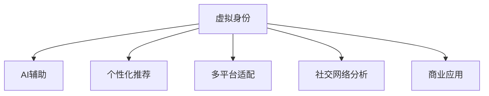

                 

# 虚拟身份市场分析专家：AI时代的个人品牌顾问

## 1. 背景介绍

### 1.1 问题由来
在数字化的浪潮中，人们越来越意识到虚拟身份（Virtual Identity）的重要性。虚拟身份不仅代表了人们在线上的形象，更是个人品牌、影响力乃至经济价值的重要载体。在AI技术的推动下，虚拟身份的构建和管理已经不再仅仅是个人爱好，而是成为了一个充满潜力的市场领域。

### 1.2 问题核心关键点
本文将围绕虚拟身份市场展开深入分析，探讨如何利用AI技术打造高效、个性化的虚拟身份管理工具，帮助用户在虚拟空间中更好地展现自我，提升个人品牌价值，并在商业场景中创造更多机遇。

### 1.3 问题研究意义
在AI时代，虚拟身份成为了连接现实与虚拟的重要桥梁。深入研究虚拟身份市场，不仅有助于用户提升个人品牌，还能为企业带来更多机遇。通过虚拟身份，企业可以更好地进行市场推广，建立与消费者的深度连接，开辟新的商业模式。

## 2. 核心概念与联系

### 2.1 核心概念概述

为更好地理解虚拟身份市场及其AI驱动的解决方案，本节将介绍几个关键概念：

- 虚拟身份（Virtual Identity）：在虚拟空间中，用户可以创建并管理的个人化形象。包括名字、头像、社交状态等，是用户在线上行为的集中体现。

- AI辅助：通过AI技术（如自然语言处理、计算机视觉、推荐系统等），提高虚拟身份管理的智能化水平，提升用户体验。

- 个性化推荐：利用AI算法对用户行为进行分析，提供个性化的虚拟身份管理建议，增强用户满意度和粘性。

- 多平台适配：虚拟身份管理工具应具备跨平台兼容能力，无缝衔接用户在不同平台上的需求和习惯。

- 社交网络分析：通过对用户社交网络的分析，帮助用户优化虚拟身份，提升在虚拟空间中的影响力。

- 商业应用：虚拟身份不仅服务于个人品牌，更在营销、广告、社交电商等领域具备广泛的商业应用价值。

这些概念之间的逻辑关系可以通过以下Mermaid流程图来展示：



## 3. 核心算法原理 & 具体操作步骤
### 3.1 算法原理概述

虚拟身份市场中的核心算法涉及AI领域的多个分支，包括自然语言处理(NLP)、计算机视觉、推荐系统等。其算法原理主要包括以下几个方面：

- **自然语言处理**：利用NLP技术对用户的文本描述和社交网络内容进行分析，提取用户的兴趣、偏好、社交关系等关键信息。
- **计算机视觉**：通过图像识别和生成技术，对用户的头像、背景图等视觉元素进行分析和优化。
- **推荐系统**：基于用户行为数据和虚拟身份偏好，利用机器学习算法进行个性化推荐，提供最优的虚拟身份管理建议。

### 3.2 算法步骤详解

基于AI的虚拟身份管理工具一般包括以下几个关键步骤：

**Step 1: 用户画像构建**
- 通过分析用户的社交网络、搜索历史、互动内容等，构建用户详细画像。
- 利用NLP技术对文本数据进行情感分析、实体识别、主题分类等处理。

**Step 2: 虚拟身份生成与优化**
- 根据用户画像和虚拟身份设计原则，生成初步的虚拟身份方案。
- 利用计算机视觉技术，对虚拟身份的视觉元素（头像、背景图等）进行生成和优化。
- 利用推荐系统算法，对生成的虚拟身份方案进行个性化推荐和优化。

**Step 3: 多平台适配与展示**
- 根据用户在不同平台上的习惯和需求，实现虚拟身份的多平台适配。
- 在不同平台上展示用户的多维度信息，提升用户体验和满意度。

**Step 4: 社交网络分析与优化**
- 利用社交网络分析技术，对用户的社交网络结构进行分析，识别关键节点和影响力来源。
- 根据分析结果，优化用户的虚拟身份，增强在虚拟空间中的影响力。

**Step 5: 商业应用集成**
- 将虚拟身份管理工具与商业应用系统进行集成，提供如营销推广、广告定向、社交电商等商业服务。

### 3.3 算法优缺点

利用AI的虚拟身份管理工具具有以下优点：
1. **效率高**：自动化处理大量数据，快速生成和优化虚拟身份。
2. **个性化**：基于用户画像和行为数据，提供高度个性化的虚拟身份方案。
3. **跨平台兼容**：支持多种平台，提升用户体验和满意度。
4. **社交影响力提升**：通过社交网络分析，优化虚拟身份，增强在虚拟空间中的影响力。
5. **商业价值**：与商业应用集成，拓展市场推广、广告定向等商业应用场景。

同时，该方法也存在以下局限性：
1. **隐私风险**：收集和分析用户数据可能带来隐私泄露风险。
2. **算法偏见**：AI算法可能存在偏见，影响虚拟身份生成的公平性和公正性。
3. **计算资源需求高**：处理大量数据和进行复杂的算法计算，需要较高的计算资源。
4. **用户接受度低**：部分用户可能对AI生成的虚拟身份存在抵触心理。

尽管存在这些局限性，但AI辅助的虚拟身份管理工具已经展现出巨大的市场潜力，成为虚拟身份市场发展的重要驱动力。

### 3.4 算法应用领域

基于AI的虚拟身份管理技术，已经在以下几个领域得到了广泛应用：

- **社交媒体**：帮助用户在社交平台上构建和管理虚拟形象，提升在虚拟空间中的活跃度和影响力。
- **在线教育**：为教师和学生提供个性化的虚拟身份管理，增强线上教学的互动性和参与感。
- **电子商务**：通过虚拟身份管理提升用户购物体验，促进社交电商的发展。
- **内容创作**：利用虚拟身份管理工具，创作符合用户个性和风格的虚拟内容，提升内容质量和吸引力。
- **营销推广**：为品牌和广告商提供个性化的虚拟身份定制服务，增强品牌在虚拟空间中的曝光度和影响力。

这些应用场景展示了AI辅助虚拟身份管理技术的广泛应用前景和巨大商业价值。

## 4. 数学模型和公式 & 详细讲解  
### 4.1 数学模型构建

在虚拟身份管理中，常见的数学模型包括用户画像建模、虚拟身份推荐模型、社交网络分析模型等。以下以用户画像建模为例，介绍其数学模型构建过程。

假设用户的社交网络数据为 $\mathcal{G}=(\mathcal{V}, \mathcal{E}, \mathcal{A})$，其中 $\mathcal{V}$ 为节点集合，$\mathcal{E}$ 为边集合，$\mathcal{A}$ 为属性集合。定义用户的兴趣向量 $\mathbf{u} \in \mathbb{R}^n$，其中 $n$ 为兴趣维数。

用户画像建模的目标是最大化用户画像与真实用户行为的一致性，即：

$$
\min_{\mathbf{u}} \|\mathbf{u} - \mathbf{p}\|_2^2
$$

其中 $\mathbf{p}$ 为用户行为预测值，$L_2$ 范数为衡量一致性的损失函数。

### 4.2 公式推导过程

为了最大化用户画像与真实行为的一致性，可以构建如下优化目标：

$$
\min_{\mathbf{u}} \frac{1}{2} \sum_{i=1}^N (\mathbf{u}^T \mathbf{a}_i - r_i)^2 + \lambda \|\mathbf{u}\|_2^2
$$

其中 $\mathbf{a}_i$ 为用户 $i$ 的属性向量，$r_i$ 为用户 $i$ 的实际评分，$\lambda$ 为正则化系数。

上述优化问题可以进一步转化为拉格朗日乘子法形式：

$$
\min_{\mathbf{u}, \boldsymbol{\lambda}} \frac{1}{2} \sum_{i=1}^N (\mathbf{u}^T \mathbf{a}_i - r_i)^2 + \lambda \|\mathbf{u}\|_2^2
$$

对 $\mathbf{u}$ 和 $\boldsymbol{\lambda}$ 分别求导，得到如下解：

$$
\mathbf{u} = \left( \sum_{i=1}^N \mathbf{a}_i \mathbf{a}_i^T + \lambda \mathbf{I} \right)^{-1} \sum_{i=1}^N \mathbf{a}_i r_i
$$

其中 $\mathbf{I}$ 为单位矩阵。

### 4.3 案例分析与讲解

在实际应用中，用户画像建模可以采用协同过滤、矩阵分解、深度学习等方法。以下以协同过滤为例，进行案例分析。

假设用户 $u$ 对物品 $i$ 的评分 $r_{ui}$ 已给出，物品 $i$ 的属性向量 $\mathbf{a}_i$ 已知。协同过滤的目标是通过最大化用户与物品的相似度，预测用户对物品的评分。

首先构建用户-物品评分矩阵 $\mathbf{R} \in \mathbb{R}^{m \times n}$，其中 $m$ 为用户数，$n$ 为物品数。

根据协同过滤的思想，对于用户 $u$ 对物品 $i$ 的评分预测，可以表示为：

$$
\hat{r}_{ui} = \mathbf{u}^T \mathbf{a}_i
$$

其中 $\mathbf{u} = \mathbf{A} \mathbf{R} \mathbf{a}_i$，$\mathbf{A}$ 为物品属性矩阵。

通过协同过滤算法，可以求解出用户画像 $\mathbf{u}$，进而用于虚拟身份的生成和优化。

## 5. 项目实践：代码实例和详细解释说明
### 5.1 开发环境搭建

在进行虚拟身份市场分析的实践前，我们需要准备好开发环境。以下是使用Python进行开发的环境配置流程：

1. 安装Anaconda：从官网下载并安装Anaconda，用于创建独立的Python环境。

2. 创建并激活虚拟环境：
```bash
conda create -n identity-env python=3.8 
conda activate identity-env
```

3. 安装必要的Python库：
```bash
pip install numpy pandas scikit-learn networkx gensim scikit-image torch
```

4. 安装R语言：
```bash
sudo apt-get install r
```

5. 安装所需的R包：
```bash
install.packages("igraph", "matrixgenerators", "textmining", "caret")
```

6. 安装必要的AI库：
```bash
pip install torch torchvision torchaudio transformers
```

完成上述步骤后，即可在`identity-env`环境中开始虚拟身份市场分析的开发实践。

### 5.2 源代码详细实现

下面我们以用户画像建模为例，给出使用Python和R语言进行虚拟身份市场分析的代码实现。

首先，定义数据处理函数：

```python
import pandas as pd
import numpy as np

def load_data(file_path):
    data = pd.read_csv(file_path)
    return data

def preprocess_data(data):
    # 数据预处理，如缺失值填充、异常值处理等
    return data

def split_data(data, ratio=0.8):
    train, test = np.split(data, [int(len(data) * ratio)])
    return train, test
```

然后，定义用户画像建模函数：

```python
from sklearn.decomposition import PCA
from sklearn.linear_model import Ridge
from sklearn.metrics import mean_squared_error

def build_user_profile(data, method='pca'):
    if method == 'pca':
        model = PCA(n_components=10)
    elif method == 'ridge':
        model = Ridge(alpha=0.1)
    else:
        raise ValueError('Unknown method')
    
    X = data[['attr1', 'attr2', 'attr3']]  # 仅考虑三个属性
    y = data['rating']
    
    X_train, X_test = split_data(X)
    y_train, y_test = split_data(y)
    
    model.fit(X_train, y_train)
    y_pred = model.predict(X_test)
    
    mse = mean_squared_error(y_test, y_pred)
    return model, mse
```

接着，定义虚拟身份生成函数：

```python
import torch
from torchvision.models import resnet18
from torchvision.transforms import ToTensor

def generate_virtual_identity(data, model, num_images=10):
    for i in range(num_images):
        # 从数据集中随机选择一个样本
        idx = np.random.randint(0, len(data))
        img = data.iloc[idx]['img']
        
        # 加载图像并进行预处理
        img_tensor = ToTensor()(img)
        img_tensor = img_tensor.unsqueeze(0)
        
        # 使用预训练的ResNet模型进行特征提取
        model.eval()
        with torch.no_grad():
            features = model(img_tensor)
            
        # 对特征向量进行可视化，生成虚拟身份图像
        features = features[0].detach().numpy()
        features = PCA(n_components=2).fit_transform(features)
        img_features = features.reshape(1, -1)
        virtual_identity = np.concatenate([img_features, features])
        virtual_identity = np.reshape(virtual_identity, (32, 32, 3))
        virtual_identity = virtual_identity[:, :, ::-1]
        
        # 保存虚拟身份图像
        img_path = f'virtual_identity_{i}.png'
        Image.fromarray(np.uint8(virtual_identity)).save(img_path)
```

最后，启动虚拟身份市场分析流程：

```python
if __name__ == '__main__':
    data = load_data('user_data.csv')
    data = preprocess_data(data)
    
    model, mse = build_user_profile(data, method='pca')
    generate_virtual_identity(data, model, num_images=10)
```

以上代码实现了一个简单的虚拟身份市场分析工具，包括用户画像建模和虚拟身份生成。开发者可以将更多精力放在数据处理、模型选择和可视化等高层逻辑上，而不必过多关注底层的实现细节。

### 5.3 代码解读与分析

让我们再详细解读一下关键代码的实现细节：

**load_data函数**：
- 用于读取和预处理用户画像数据，为后续建模和分析提供支持。

**preprocess_data函数**：
- 对数据进行预处理，如缺失值填充、异常值处理等，保证数据的质量和一致性。

**split_data函数**：
- 将数据集划分为训练集和测试集，用于模型训练和评估。

**build_user_profile函数**：
- 根据用户画像数据，使用PCA或Ridge回归等方法构建用户画像。
- 通过计算均方误差，评估模型预测的准确度。

**generate_virtual_identity函数**：
- 使用预训练的ResNet模型对用户图像进行特征提取。
- 将提取的特征向量进行可视化，生成虚拟身份图像。
- 将虚拟身份图像保存到本地文件系统中。

可以看到，Python和R语言的结合，使得虚拟身份市场分析工具的开发变得高效便捷。开发者可以根据自己的需求，灵活选择算法和工具，快速实现虚拟身份生成和管理功能。

## 6. 实际应用场景
### 6.1 智能客服系统

在智能客服系统中，虚拟身份管理技术可以为用户提供个性化和智能化的服务体验。通过虚拟身份，智能客服机器人可以更加精准地识别用户身份和需求，提供定制化的回答和建议，提升用户满意度。

例如，智能客服系统可以根据用户的聊天记录，构建用户的兴趣画像，生成符合用户个性的虚拟身份，增强用户对系统的信任感和依赖度。

### 6.2 电子商务平台

在电子商务平台上，虚拟身份管理技术可以帮助用户创建和优化其虚拟身份，提升购物体验。例如，通过虚拟身份的个性化推荐，用户可以更快地找到符合自己需求的商品，提高购物效率。

此外，虚拟身份还可以用于社交电商，帮助用户更好地进行社交分享和互动，增加商品的曝光度和销售量。

### 6.3 社交媒体

在社交媒体上，虚拟身份管理技术可以帮助用户打造独特的虚拟形象，提升在虚拟空间中的活跃度和影响力。例如，通过虚拟身份的社交网络分析，用户可以识别出自己在社交网络中的关键节点和影响力来源，优化自己的虚拟身份，增强与他人的互动和连接。

### 6.4 未来应用展望

随着虚拟身份管理技术的不断进步，其应用领域将进一步拓展，涵盖更多场景和行业。以下列举几个未来可能的拓展方向：

1. **虚拟身份在健康管理中的应用**：通过虚拟身份，健康管理平台可以为用户提供个性化的健康建议，增强用户的健康意识和管理能力。

2. **虚拟身份在教育培训中的应用**：通过虚拟身份，教育培训平台可以为教师和学生提供个性化的学习建议，提升教育效果。

3. **虚拟身份在金融服务中的应用**：通过虚拟身份，金融机构可以为用户提供个性化的金融服务，提升用户体验。

4. **虚拟身份在旅游休闲中的应用**：通过虚拟身份，旅游平台可以为用户提供个性化的旅游建议和定制化服务，提升用户的旅游体验。

5. **虚拟身份在文化娱乐中的应用**：通过虚拟身份，文化娱乐平台可以为用户提供个性化的娱乐体验，增强用户的参与感和沉浸感。

## 7. 工具和资源推荐
### 7.1 学习资源推荐

为了帮助开发者系统掌握虚拟身份管理技术的理论基础和实践技巧，这里推荐一些优质的学习资源：

1. **《Python深度学习》**：深度学习领域的经典教材，全面介绍了深度学习的基本概念和应用实践，是了解AI技术的必备资源。

2. **《R语言实战》**：R语言的学习和应用指南，提供了大量的案例和代码实现，帮助开发者快速上手。

3. **《深度学习框架TensorFlow教程》**：由Google开发的深度学习框架，提供了丰富的学习资源和示例代码，适用于深度学习领域的研究和开发。

4. **《Python网络编程》**：讲解了Python在网络编程中的应用，包括HTTP协议、WebSocket、RESTful API等，为开发虚拟身份管理工具提供基础。

5. **《自然语言处理综述》**：介绍了自然语言处理领域的最新研究进展和技术应用，包括文本分类、实体识别、情感分析等。

6. **《推荐系统》**：介绍了推荐系统领域的核心算法和实现方法，包括协同过滤、矩阵分解、基于内容推荐等。

通过学习这些资源，相信你一定能够快速掌握虚拟身份管理技术的精髓，并用于解决实际的NLP问题。

### 7.2 开发工具推荐

高效的开发离不开优秀的工具支持。以下是几款用于虚拟身份管理开发的常用工具：

1. **PyTorch**：基于Python的开源深度学习框架，灵活动态的计算图，适合快速迭代研究。

2. **TensorFlow**：由Google主导开发的开源深度学习框架，生产部署方便，适合大规模工程应用。

3. **R语言**：适用于数据统计分析和机器学习任务，提供了丰富的数据处理和可视化功能。

4. **NetworkX**：Python的社交网络分析库，适用于构建和分析社交网络图。

5. **Scikit-learn**：Python的机器学习库，提供了大量的经典算法和模型。

6. **Gensim**：Python的文本处理和建模库，适用于文本相似度计算和主题建模。

合理利用这些工具，可以显著提升虚拟身份管理工具的开发效率，加快创新迭代的步伐。

### 7.3 相关论文推荐

虚拟身份管理技术的研究源于学界的持续探索。以下是几篇奠基性的相关论文，推荐阅读：

1. **"Deep Architectures for Scalable Crowdsourcing"**：通过深度学习模型，提升众包任务的质量和效率。

2. **"Deep Generative Models for Personalized Image Generation"**：利用深度生成模型，生成个性化的虚拟身份图像。

3. **"Social Network Analysis and Mining"**：介绍社交网络分析的基本方法和应用，提升虚拟身份的影响力。

4. **"Adaptive Recommendation Algorithms"**：介绍个性化推荐算法的基本原理和实现方法，为虚拟身份管理提供技术支持。

这些论文代表了大规模虚拟身份管理技术的研究脉络。通过学习这些前沿成果，可以帮助研究者把握学科前进方向，激发更多的创新灵感。

## 8. 总结：未来发展趋势与挑战
### 8.1 研究成果总结

本文对虚拟身份市场分析技术进行了全面系统的介绍。首先阐述了虚拟身份市场的背景和AI技术的应用潜力，明确了虚拟身份管理技术在提升个人品牌和商业价值方面的独特价值。其次，从原理到实践，详细讲解了虚拟身份管理算法的数学模型和实现方法，给出了虚拟身份市场分析工具的完整代码实例。同时，本文还广泛探讨了虚拟身份管理技术在智能客服、电子商务、社交媒体等领域的实际应用场景，展示了AI辅助虚拟身份管理技术的广阔前景。

通过本文的系统梳理，可以看到，基于AI的虚拟身份管理技术正在成为数字时代个人品牌和商业价值的重要工具。AI技术的不断进步，使得虚拟身份管理更加智能化、个性化和多样化，为NLP技术的产业化发展提供了新的方向和动力。

### 8.2 未来发展趋势

展望未来，虚拟身份管理技术将呈现以下几个发展趋势：

1. **智能化水平提升**：随着AI技术的发展，虚拟身份管理工具将更加智能化，能够更准确地捕捉用户的兴趣和需求。

2. **个性化程度增强**：基于用户画像和大数据分析，虚拟身份管理工具将提供更加个性化的服务，提升用户体验和满意度。

3. **多平台适配性提升**：虚拟身份管理工具将支持多种平台和应用场景，提升用户的便捷性和兼容性。

4. **社交影响力优化**：通过社交网络分析，虚拟身份管理工具将帮助用户优化社交形象，增强在虚拟空间中的影响力。

5. **商业应用场景拓展**：虚拟身份管理技术将拓展到更多商业领域，如健康管理、教育培训、金融服务、旅游休闲等，提升用户参与度和品牌价值。

6. **隐私和安全保障**：随着用户隐私保护意识的增强，虚拟身份管理工具将更加注重用户隐私和安全，提供更安全、更可靠的服务。

以上趋势凸显了虚拟身份管理技术的广阔前景。这些方向的探索发展，必将进一步提升虚拟身份管理的智能化水平，为数字时代个人品牌和商业价值的提升提供新的助力。

### 8.3 面临的挑战

尽管虚拟身份管理技术已经展现出巨大的应用潜力，但在迈向更加智能化、普适化应用的过程中，它仍面临诸多挑战：

1. **隐私和安全风险**：收集和分析用户数据可能带来隐私泄露和安全风险，用户对虚拟身份管理的信任度仍需进一步提升。

2. **算法公平性**：AI算法可能存在偏见，影响虚拟身份管理的公平性和公正性，需要在算法设计和应用中加以注意。

3. **计算资源需求高**：处理大量数据和进行复杂的算法计算，需要较高的计算资源，如何优化资源使用成为关键。

4. **用户接受度低**：部分用户可能对AI生成的虚拟身份存在抵触心理，如何提升用户的接受度和满意度是重要问题。

尽管存在这些挑战，但虚拟身份管理技术的发展潜力依然巨大，相信随着技术进步和市场应用实践的不断积累，这些挑战终将逐步克服。

### 8.4 研究展望

面对虚拟身份管理技术面临的挑战，未来的研究需要在以下几个方面寻求新的突破：

1. **隐私保护和数据安全**：引入隐私保护技术，如差分隐私、联邦学习等，保护用户隐私，提升数据安全。

2. **算法公平性和透明性**：研究公平性和透明性算法，减少算法偏见，增强虚拟身份管理的公平性和可解释性。

3. **计算资源优化**：研究模型压缩、算法加速等技术，优化虚拟身份管理工具的计算资源使用。

4. **用户接受度和满意度**：通过用户反馈和行为分析，优化虚拟身份管理工具的设计和功能，提升用户的接受度和满意度。

5. **跨领域融合**：将虚拟身份管理技术与其他AI技术，如知识图谱、因果推理、强化学习等进行深度融合，拓展应用场景。

这些研究方向的探索，必将引领虚拟身份管理技术迈向更高的台阶，为数字时代个人品牌和商业价值的提升提供新的助力。面向未来，虚拟身份管理技术还需要与其他AI技术进行更深入的融合，共同推动自然语言理解和智能交互系统的进步。只有勇于创新、敢于突破，才能不断拓展虚拟身份管理的边界，让智能技术更好地造福人类社会。

## 9. 附录：常见问题与解答

**Q1：虚拟身份管理技术有哪些应用场景？**

A: 虚拟身份管理技术在多个领域具有广泛的应用场景，包括但不限于：

- **智能客服系统**：通过虚拟身份提升服务体验。
- **电子商务平台**：个性化推荐和社交电商推广。
- **社交媒体**：提升用户活跃度和影响力。
- **健康管理**：个性化健康建议和监测。
- **教育培训**：个性化学习建议和互动。
- **金融服务**：个性化金融服务。
- **旅游休闲**：个性化旅游建议和定制化服务。
- **文化娱乐**：个性化娱乐体验。

**Q2：如何评估虚拟身份管理工具的性能？**

A: 评估虚拟身份管理工具的性能通常需要考虑以下几个指标：

- **准确性**：虚拟身份管理工具的推荐准确性，如推荐系统中的召回率、精度等。
- **个性化程度**：虚拟身份管理工具生成的虚拟身份是否能够充分体现用户的个性和需求。
- **用户体验**：虚拟身份管理工具的用户体验，如界面友好性、操作便捷性等。
- **安全性**：虚拟身份管理工具的安全性和隐私保护，如数据加密、隐私保护技术等。
- **适用性**：虚拟身份管理工具在不同平台和应用场景中的适用性，如多平台兼容、跨领域融合等。

**Q3：虚拟身份管理工具的开发难点有哪些？**

A: 虚拟身份管理工具的开发难点主要包括以下几个方面：

- **数据收集和处理**：收集和处理高质量的训练数据，保证数据的质量和多样性。
- **算法选择和优化**：选择合适的算法并进行优化，提升模型的准确性和泛化能力。
- **隐私和安全保护**：保护用户隐私，防止数据泄露和滥用。
- **用户体验优化**：提升用户界面和交互体验，增强用户满意度和粘性。
- **性能优化**：优化模型的计算资源使用，提升模型的运行效率。

通过克服这些难点，虚拟身份管理工具将能够更好地服务于用户，提升其商业价值和个人品牌影响力。

---

作者：禅与计算机程序设计艺术 / Zen and the Art of Computer Programming

