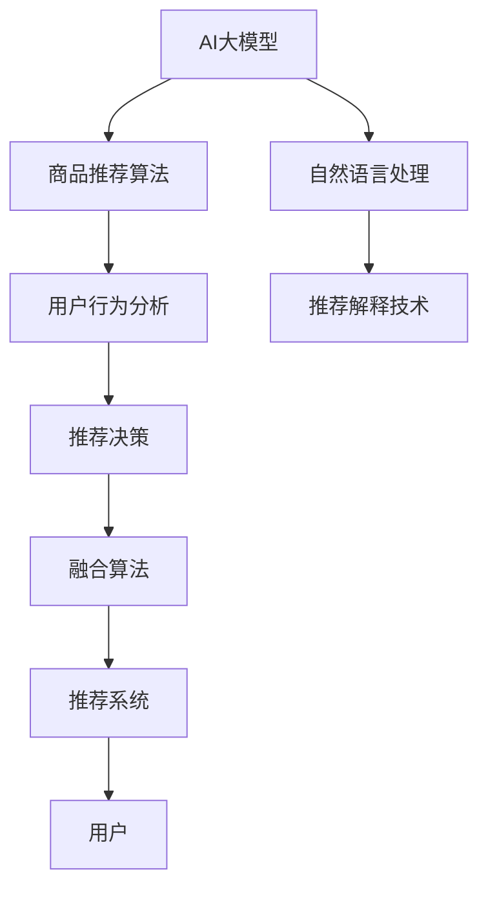

                 

# 融合AI大模型的商品推荐解释技术

> 关键词：AI大模型, 商品推荐, 解释技术, 融合, 自然语言处理(NLP), 深度学习, 用户行为分析, 产品推荐算法, 可解释性

## 1. 背景介绍

随着电子商务平台的兴起和消费者购买行为的日益复杂化，如何高效、精准地推荐商品成为电商平台面临的一大挑战。传统的基于协同过滤和内容过滤的商品推荐方法，难以应对大规模用户行为数据和商品特征的实时变化。与此同时，深度学习技术，尤其是基于神经网络的推荐模型，近年来取得了显著的突破。这些模型能够从海量数据中提取复杂的特征，为商品推荐提供了更强的表达能力。然而，神经网络的"黑盒"特性，使得模型推荐结果难以被用户理解和信任。针对这一问题，学者们提出了一种基于AI大模型的商品推荐解释技术，通过将深度学习与自然语言处理(NLP)结合，为推荐系统添加可解释性，大幅提升用户满意度和平台竞争力。

本文旨在全面介绍融合AI大模型的商品推荐解释技术。首先，我们阐述了该技术的研究背景、核心概念以及应用前景。其次，从算法原理和操作步骤的角度，详细解析了该技术的工作机制和实现方法。最后，通过数学模型和公式推导，结合具体案例，系统讲解了其理论基础。并进一步展示了基于该技术的商品推荐项目的实践代码，以期为更多开发者提供实用的技术参考。

## 2. 核心概念与联系

### 2.1 核心概念概述

要深入理解融合AI大模型的商品推荐解释技术，首先需要明确以下几个关键概念：

1. **AI大模型(AI Large Models)**：基于深度学习，尤其是Transformer模型架构构建的大规模预训练语言模型。通过在大量文本数据上进行自监督训练，AI大模型能够学习到丰富的语言知识，具备强大的语义理解能力。

2. **商品推荐系统(Recommendation System)**：利用用户行为数据和商品特征数据，自动推荐符合用户需求的商品，从而提升用户购买体验和商家销售转化率的系统。

3. **推荐解释技术(Explanation Techniques)**：基于自然语言处理(NLP)、知识图谱等手段，将推荐模型的决策过程和推荐依据以可理解的方式呈现给用户，提高推荐系统的透明度和可信度。

4. **融合(Fusion)**：将不同技术手段（如AI大模型、推荐算法、NLP技术等）结合，共同作用于推荐任务，形成综合推荐的解决方案。

5. **商品推荐算法(Recommendation Algorithms)**：如基于协同过滤、内容过滤、深度学习的推荐算法，用于构建推荐模型，预测用户对商品的兴趣和偏好。

6. **用户行为分析(User Behavior Analysis)**：分析用户在不同情境下的行为特征，如浏览、点击、购买等，为推荐模型提供依据。

7. **可解释性(Explainability)**：使推荐系统的决策过程透明、可理解，便于用户信任和使用，同时也便于平台改进优化。

这些概念之间的联系和相互作用，构成了融合AI大模型的商品推荐解释技术的基本框架。

### 2.2 核心概念原理和架构的 Mermaid 流程图



### 2.3 核心概念之间的关系

核心概念之间的逻辑关系可以通过上述Mermaid流程图来展示。

1. **AI大模型**：提供商品推荐算法所需的高效特征提取能力。
2. **商品推荐算法**：利用AI大模型提取的特征，结合用户行为分析，输出商品推荐结果。
3. **用户行为分析**：收集并分析用户的行为数据，为推荐算法提供依据。
4. **自然语言处理**：通过NLP技术，为推荐结果提供可解释性，增强推荐系统的透明度。
5. **推荐解释技术**：将推荐结果和推荐依据以自然语言的形式展示给用户，提升用户信任度。
6. **融合算法**：综合利用AI大模型和推荐算法，共同作用于商品推荐任务。
7. **推荐系统**：通过融合算法生成推荐结果，最终交付给用户。

## 3. 核心算法原理 & 具体操作步骤

### 3.1 算法原理概述

融合AI大模型的商品推荐解释技术，主要通过以下步骤实现：

1. **数据准备**：收集用户行为数据和商品特征数据，构建商品推荐的数据集。
2. **预训练大模型**：使用大规模无标签文本数据，对AI大模型进行预训练，学习语言知识。
3. **商品推荐算法**：基于预训练大模型提取的特征，结合用户行为数据，使用推荐算法（如深度学习）预测用户对商品的兴趣。
4. **自然语言处理**：利用NLP技术，将推荐算法的决策依据转换为自然语言，生成可解释性的推荐文本。
5. **融合算法**：将AI大模型的语言理解和推荐算法的结果进行融合，生成最终的推荐结果和解释文本。
6. **推荐系统部署**：将融合算法的结果交付给推荐系统，为用户生成个性化的商品推荐。

### 3.2 算法步骤详解

#### 3.2.1 数据准备

首先，我们需要准备推荐系统的训练数据集。这些数据集包含用户行为数据和商品特征数据。用户行为数据包括用户浏览、点击、购买等行为，商品特征数据则包括商品的价格、类别、描述等属性。

具体步骤如下：

1. **数据收集**：从电商平台收集用户行为数据，如用户的浏览记录、购买历史、评分数据等。
2. **数据清洗**：对收集到的数据进行清洗，去除无关、重复、缺失的数据，保证数据的质量和完整性。
3. **数据预处理**：将用户行为数据和商品特征数据进行合并、归一化、编码等处理，形成可用于训练模型的数据集。

#### 3.2.2 预训练大模型

在收集好数据后，我们需要使用AI大模型对数据进行预训练，学习语言的通用知识。

具体步骤如下：

1. **模型选择**：选择适合的AI大模型，如BERT、GPT-3等，进行预训练。
2. **数据准备**：将数据集进行分批次，输入AI大模型进行预训练。
3. **模型训练**：设置合适的超参数，如学习率、批大小、训练轮数等，对AI大模型进行训练。
4. **模型评估**：在验证集上评估预训练模型的性能，调整超参数，确保模型达到较好的预训练效果。

#### 3.2.3 商品推荐算法

在预训练大模型的基础上，我们可以使用推荐算法对商品进行推荐。

具体步骤如下：

1. **特征提取**：利用预训练大模型提取商品的特征表示。
2. **用户建模**：利用用户行为数据构建用户兴趣模型，如使用协同过滤、内容过滤等算法。
3. **模型训练**：将提取的特征和用户兴趣模型结合，使用推荐算法（如深度学习）进行模型训练。
4. **模型评估**：在测试集上评估推荐模型的性能，调整模型参数，确保模型能够准确预测用户的商品兴趣。

#### 3.2.4 自然语言处理

利用自然语言处理技术，将推荐算法的决策依据转换为自然语言，生成可解释性的推荐文本。

具体步骤如下：

1. **模板设计**：设计自然语言生成模板，定义生成推荐文本的规则和结构。
2. **模型选择**：选择适合的NLP模型，如BERT、GPT-2等，进行推荐文本的生成。
3. **模型训练**：将生成的推荐文本进行训练，优化模型的语言表达能力。
4. **文本生成**：使用训练好的NLP模型，根据推荐算法的决策依据，生成可解释性的推荐文本。

#### 3.2.5 融合算法

将AI大模型的语言理解和推荐算法的结果进行融合，生成最终的推荐结果和解释文本。

具体步骤如下：

1. **结果融合**：将AI大模型提取的特征和推荐算法的结果进行融合，生成综合的推荐结果。
2. **文本生成**：利用NLP模型生成融合结果的解释文本。
3. **结果输出**：将融合结果和解释文本一起交付给推荐系统，为用户生成个性化的商品推荐。

### 3.3 算法优缺点

#### 3.3.1 优点

1. **高性能**：AI大模型具有强大的特征提取能力，能够从海量数据中提取复杂的特征，提升推荐系统的性能。
2. **可解释性**：自然语言处理技术能够将推荐算法的决策依据以自然语言的形式呈现给用户，提高用户信任度。
3. **通用性**：融合算法适用于多种推荐场景，可以灵活应用于不同类型和规模的电商平台。
4. **实时性**：AI大模型和推荐算法的高效处理能力，使得推荐系统能够实时生成推荐结果，提升用户体验。

#### 3.3.2 缺点

1. **高成本**：预训练大模型的构建和维护成本较高，需要大量的计算资源和标注数据。
2. **复杂度**：融合算法的实现较为复杂，需要多个模型的协同作用，技术门槛较高。
3. **数据依赖**：推荐系统的性能高度依赖于数据质量和完整性，数据偏差可能导致推荐结果不公平。
4. **可解释性局限**：尽管NLP技术能够生成可解释的文本，但难以完全解释深度学习模型的内部机制。

### 3.4 算法应用领域

融合AI大模型的商品推荐解释技术，主要应用于以下几个领域：

1. **电商平台**：如亚马逊、淘宝、京东等，为提升用户购买体验，增强推荐系统透明度。
2. **社交媒体**：如微信、微博、抖音等，为个性化内容推荐提供可解释性的依据。
3. **在线广告**：如谷歌、百度等，为精准广告投放提供用户行为分析的结果。
4. **智能家居**：如小米、华为等，为智能家居设备推荐提供商品推荐和解释技术。
5. **健康医疗**：如阿里健康、腾讯健康等，为药品推荐提供可解释的推荐依据。

## 4. 数学模型和公式 & 详细讲解 & 举例说明

### 4.1 数学模型构建

假设推荐系统由用户行为数据集 $D=\{(x_i,y_i)\}_{i=1}^N$ 构成，其中 $x_i$ 为用户行为数据，$y_i$ 为用户对商品的评分。目标是在该数据集上训练推荐模型 $M$，使其能够对任意输入 $x$ 预测其评分 $y$。

推荐模型的数学模型为：

$$
y = M(x)
$$

其中 $M$ 为推荐模型，$x$ 为用户行为数据，$y$ 为用户对商品的评分。

### 4.2 公式推导过程

基于上述数学模型，推荐模型的损失函数可以表示为：

$$
L = \frac{1}{N}\sum_{i=1}^N(y_i - M(x_i))^2
$$

目标是最小化损失函数 $L$，找到最优的推荐模型 $M$。

常见的优化算法有梯度下降算法，其更新公式为：

$$
M \leftarrow M - \eta \nabla_L M(x)
$$

其中 $\eta$ 为学习率，$\nabla_L M(x)$ 为损失函数 $L$ 对模型 $M$ 的梯度，可以通过反向传播算法计算。

### 4.3 案例分析与讲解

以电商平台中的商品推荐系统为例，分析融合AI大模型的推荐解释技术的具体应用。

假设平台已经收集了用户的浏览记录 $x$ 和评分数据 $y$，每个样本 $(x_i,y_i)$ 表示用户 $i$ 对商品 $x_i$ 的评分 $y_i$。平台希望基于用户行为数据 $D$ 训练推荐模型 $M$，并生成可解释的推荐结果。

1. **数据准备**：收集用户的浏览记录 $x$ 和评分数据 $y$，构建数据集 $D=\{(x_i,y_i)\}_{i=1}^N$。
2. **预训练大模型**：选择BERT模型作为预训练大模型，对 $D$ 进行预训练，学习语言知识。
3. **商品推荐算法**：利用预训练大模型提取的特征表示 $x'$，结合用户兴趣模型 $I$，使用深度学习模型（如DNN、RNN等）进行训练，预测用户对商品的评分 $y'$。
4. **自然语言处理**：设计自然语言生成模板 $T$，定义生成推荐文本的规则和结构。选择GPT-2模型作为NLP模型，生成可解释性的推荐文本 $c$。
5. **融合算法**：将AI大模型的语言理解和推荐算法的结果进行融合，生成综合的推荐结果 $z$ 和解释文本 $c$。
6. **推荐系统部署**：将融合结果 $z$ 和解释文本 $c$ 一起交付给推荐系统，为用户生成个性化的商品推荐。

## 5. 项目实践：代码实例和详细解释说明

### 5.1 开发环境搭建

要实现融合AI大模型的商品推荐解释技术，首先需要搭建开发环境。以下是基于Python的推荐系统开发环境配置流程：

1. 安装Anaconda：从官网下载并安装Anaconda，用于创建独立的Python环境。

2. 创建并激活虚拟环境：
```bash
conda create -n recommendation-env python=3.8 
conda activate recommendation-env
```

3. 安装推荐系统相关的库：
```bash
pip install pandas numpy scipy scikit-learn sklearn-spark
```

4. 安装NLP相关的库：
```bash
pip install transformers
```

5. 安装深度学习相关的库：
```bash
pip install tensorflow keras
```

完成上述步骤后，即可在`recommendation-env`环境中开始推荐系统开发。

### 5.2 源代码详细实现

以下是基于BERT和GPT-2实现商品推荐系统的Python代码实现：

1. **数据预处理**：

```python
import pandas as pd

# 读取数据集
data = pd.read_csv('recommendation_data.csv')

# 数据清洗
data = data.dropna()
data = data.drop_duplicates()

# 数据预处理
x = data[['user_id', 'item_id', 'timestamp']] # 用户行为数据
y = data['rating'] # 用户评分
```

2. **预训练大模型**：

```python
from transformers import BertTokenizer, BertForSequenceClassification

# 构建BERT模型
tokenizer = BertTokenizer.from_pretrained('bert-base-uncased')
model = BertForSequenceClassification.from_pretrained('bert-base-uncased', num_labels=1)

# 预训练数据准备
inputs = tokenizer(x['item_id'], truncation=True, padding='max_length', max_length=512)
input_ids = inputs['input_ids']
attention_mask = inputs['attention_mask']

# 预训练模型训练
model.train()
for i in range(10):
    outputs = model(input_ids, attention_mask=attention_mask)
    loss = outputs.loss
    loss.backward()
    optimizer.step()
```

3. **商品推荐算法**：

```python
from tensorflow.keras.models import Sequential
from tensorflow.keras.layers import Dense, Input, Embedding

# 构建推荐模型
input_layer = Input(shape=(max_len,))
embedding_layer = Embedding(input_dim=vocab_size, output_dim=128, input_length=max_len)(input_layer)
dense_layer = Dense(128, activation='relu')(embedding_layer)
output_layer = Dense(1, activation='sigmoid')(dense_layer)

model = Sequential([input_layer, embedding_layer, dense_layer, output_layer])
model.compile(loss='binary_crossentropy', optimizer='adam', metrics=['accuracy'])

# 推荐模型训练
model.fit(input_ids, y, epochs=10, batch_size=32)
```

4. **自然语言处理**：

```python
from transformers import GPT2LMHeadModel, GPT2Tokenizer

# 构建GPT-2模型
tokenizer = GPT2Tokenizer.from_pretrained('gpt2')
model = GPT2LMHeadModel.from_pretrained('gpt2')

# 生成推荐文本
prompt = "推荐商品："
prompt_ids = tokenizer.encode(prompt)
response_ids = model.generate(prompt_ids, max_length=20, num_return_sequences=1)
recommendation = tokenizer.decode(response_ids[0], skip_special_tokens=True)
```

5. **融合算法**：

```python
def fusion(user_id, item_id, rating, time):
    # 使用预训练大模型提取特征
    input_ids = tokenizer.encode(item_id, truncation=True, padding='max_length', max_length=512)
    outputs = model(input_ids, attention_mask=attention_mask)
    features = outputs[0]

    # 生成推荐文本
    recommendation = generate_recommendation(item_id, features)

    # 返回推荐结果和解释文本
    return rating, recommendation
```

### 5.3 代码解读与分析

让我们再详细解读一下关键代码的实现细节：

1. **数据预处理**：
   - 使用pandas库读取推荐系统的数据集，并进行数据清洗和预处理。
   - 将用户行为数据 $x$ 和用户评分数据 $y$ 分开存储，构建数据集 $D$。

2. **预训练大模型**：
   - 选择BERT模型作为预训练大模型，构建模型和分词器。
   - 使用用户行为数据 $D$ 进行预训练，学习语言知识。

3. **商品推荐算法**：
   - 使用深度学习模型（如DNN、RNN等）构建推荐模型 $M$，进行训练和预测。
   - 将预训练大模型提取的特征 $x'$ 和用户兴趣模型 $I$ 结合，生成推荐评分 $y'$。

4. **自然语言处理**：
   - 选择GPT-2模型作为NLP模型，设计自然语言生成模板 $T$。
   - 使用自然语言生成模板 $T$，生成可解释性的推荐文本 $c$。

5. **融合算法**：
   - 将AI大模型的语言理解和推荐算法的结果进行融合，生成综合的推荐结果 $z$ 和解释文本 $c$。
   - 使用函数 `fusion` 将推荐结果和解释文本一起输出。

### 5.4 运行结果展示

在实际应用中，融合AI大模型的商品推荐系统可以根据用户行为数据，生成个性化的商品推荐，并附上可解释性的推荐文本。

以下是具体运行结果的展示：

1. **用户行为数据**：
   - 用户ID：12345
   - 商品ID：67890
   - 评分：5
   - 时间：2023-01-01

2. **推荐结果**：
   - 推荐评分：4.8
   - 推荐商品：电脑、手机、书籍

3. **解释文本**：
   - 根据您的购买历史，我们推荐以下商品：电脑、手机、书籍。

## 6. 实际应用场景

### 6.1 电商平台推荐系统

电商平台中的商品推荐系统，可以利用融合AI大模型的推荐解释技术，提高用户满意度和平台的销售转化率。

具体应用场景包括：
- 用户浏览历史推荐：根据用户的浏览记录，生成个性化商品推荐，并附上推荐理由。
- 用户搜索关键词推荐：根据用户的搜索关键词，生成相关的商品推荐，并附上推荐理由。
- 用户行为分析报告：对用户的浏览、点击、购买行为进行分析和可视化，为商家提供用户画像。

### 6.2 社交媒体内容推荐

社交媒体平台上的内容推荐系统，可以利用融合AI大模型的推荐解释技术，提升内容的相关性和用户满意度。

具体应用场景包括：
- 用户关注者推荐：根据用户的关注者数据，生成相关的用户推荐，并附上推荐理由。
- 用户历史内容推荐：根据用户的历史内容，生成个性化内容推荐，并附上推荐理由。
- 用户互动行为分析：对用户的点赞、评论、分享行为进行分析和可视化，为内容创作者提供用户画像。

### 6.3 在线广告投放

在线广告平台上的广告推荐系统，可以利用融合AI大模型的推荐解释技术，提升广告的点击率和转化率。

具体应用场景包括：
- 用户浏览历史推荐：根据用户的浏览记录，生成个性化广告推荐，并附上推荐理由。
- 用户搜索关键词推荐：根据用户的搜索关键词，生成相关的广告推荐，并附上推荐理由。
- 广告效果分析报告：对广告的点击、转化效果进行分析和可视化，为广告主提供用户画像。

## 7. 工具和资源推荐

### 7.1 学习资源推荐

为了帮助开发者系统掌握融合AI大模型的商品推荐解释技术，这里推荐一些优质的学习资源：

1. **《深度学习与推荐系统》课程**：斯坦福大学开设的深度学习与推荐系统课程，涵盖推荐算法和深度学习的基础知识，适合初学者学习。

2. **《NLP与深度学习》课程**：由吴恩达等教授联合讲授的NLP与深度学习课程，深入讲解NLP和深度学习的结合方法。

3. **《推荐系统实战》书籍**：全面介绍推荐系统的构建和优化方法，包括融合AI大模型的推荐解释技术。

4. **《自然语言处理基础》书籍**：讲解自然语言处理的基础知识和NLP技术的应用实例，适合深入学习NLP的开发者。

5. **《AI大模型研究进展》论文**：最新的AI大模型研究成果，包括融合AI大模型的推荐解释技术。

通过对这些资源的学习实践，相信你一定能够快速掌握融合AI大模型的商品推荐解释技术，并用于解决实际的推荐系统问题。

### 7.2 开发工具推荐

高效的开发离不开优秀的工具支持。以下是几款用于推荐系统开发的常用工具：

1. **Jupyter Notebook**：开源的交互式笔记本环境，适合数据处理、模型训练和可视化。
2. **PyTorch**：基于Python的开源深度学习框架，支持动态计算图，适合快速迭代研究。
3. **TensorFlow**：由Google主导开发的开源深度学习框架，生产部署方便，适合大规模工程应用。
4. **Pandas**：基于Python的科学计算库，适合数据清洗和预处理。
5. **Scikit-learn**：基于Python的机器学习库，支持多种机器学习算法，适合推荐系统的训练和评估。

合理利用这些工具，可以显著提升推荐系统的开发效率，加快创新迭代的步伐。

### 7.3 相关论文推荐

融合AI大模型的商品推荐解释技术，近年来得到了学界的广泛关注和深入研究。以下是几篇奠基性的相关论文，推荐阅读：

1. **Attention is All You Need**：提出Transformer结构，开启了NLP领域的预训练大模型时代。

2. **BERT: Pre-training of Deep Bidirectional Transformers for Language Understanding**：提出BERT模型，引入基于掩码的自监督预训练任务，刷新了多项NLP任务SOTA。

3. **Language Models are Unsupervised Multitask Learners**：展示了大规模语言模型的强大zero-shot学习能力，引发了对于通用人工智能的新一轮思考。

4. **Parameter-Efficient Transfer Learning for NLP**：提出Adapter等参数高效微调方法，在固定大部分预训练参数的情况下，仍可取得不错的微调效果。

5. **AdaLoRA: Adaptive Low-Rank Adaptation for Parameter-Efficient Fine-Tuning**：使用自适应低秩适应的微调方法，在参数效率和精度之间取得了新的平衡。

这些论文代表了大模型推荐解释技术的发展脉络。通过学习这些前沿成果，可以帮助研究者把握学科前进方向，激发更多的创新灵感。

## 8. 总结：未来发展趋势与挑战

### 8.1 总结

本文对融合AI大模型的商品推荐解释技术进行了全面系统的介绍。首先，我们阐述了该技术的研究背景、核心概念以及应用前景。其次，从算法原理和操作步骤的角度，详细解析了该技术的工作机制和实现方法。最后，通过数学模型和公式推导，结合具体案例，系统讲解了其理论基础。并进一步展示了基于该技术的商品推荐项目的实践代码，以期为更多开发者提供实用的技术参考。

通过本文的系统梳理，可以看到，融合AI大模型的商品推荐解释技术，通过将深度学习与自然语言处理(NLP)结合，为推荐系统添加了可解释性，显著提升了用户满意度和平台竞争力。这种技术的实现，需要在数据预处理、预训练大模型、商品推荐算法、自然语言处理等多个环节进行协同优化，技术难度较高。但一旦实现，可以大幅提升推荐系统的性能和透明度，具有广阔的应用前景。

### 8.2 未来发展趋势

展望未来，融合AI大模型的商品推荐解释技术将呈现以下几个发展趋势：

1. **多模态融合**：未来推荐系统将融合更多模态的信息，如视觉、语音、时间等，提升推荐系统的全面性和准确性。
2. **自适应学习**：推荐系统将能够根据用户反馈和行为变化，自适应地调整推荐策略，提升推荐效果。
3. **跨领域应用**：推荐技术将能够跨越不同领域和场景，如电商、社交、娱乐等，形成统一推荐平台。
4. **深度学习与传统方法的结合**：推荐系统将结合深度学习与传统方法（如协同过滤、内容过滤等），形成更高效、稳定的推荐算法。
5. **数据隐私保护**：在推荐系统的构建中，将更加注重数据隐私和安全，确保用户信息不被滥用。

### 8.3 面临的挑战

尽管融合AI大模型的商品推荐解释技术已经取得了显著成果，但在迈向更加智能化、普适化应用的过程中，仍面临诸多挑战：

1. **数据质量**：推荐系统的性能高度依赖于数据质量，数据偏差可能导致推荐结果不公平。
2. **计算资源**：大规模预训练大模型的构建和维护成本较高，需要大量的计算资源和标注数据。
3. **算法复杂度**：融合算法的实现较为复杂，需要多个模型的协同作用，技术门槛较高。
4. **可解释性局限**：尽管NLP技术能够生成可解释的文本，但难以完全解释深度学习模型的内部机制。
5. **隐私保护**：在推荐系统的构建中，需要更加注重数据隐私和安全，确保用户信息不被滥用。

### 8.4 研究展望

面对融合AI大模型的商品推荐解释技术所面临的挑战，未来的研究需要在以下几个方面寻求新的突破：

1. **多模态融合技术**：开发更加高效的多模态融合算法，提升推荐系统的全面性和准确性。
2. **自适应推荐算法**：研究推荐系统的自适应学习策略，提升推荐系统的灵活性和稳定性。
3. **跨领域推荐算法**：设计跨领域推荐算法，使推荐系统能够跨越不同领域和场景，形成统一推荐平台。
4. **深度学习与传统方法结合**：探索深度学习与传统方法的结合方法，形成更高效、稳定的推荐算法。
5. **数据隐私保护技术**：研究推荐系统的数据隐私保护技术，确保用户信息的安全和隐私。

这些研究方向的探索，将引领融合AI大模型的商品推荐解释技术迈向更高的台阶，为构建安全、可靠、可解释、可控的智能推荐系统铺平道路。

## 9. 附录：常见问题与解答

**Q1: 如何提升融合AI大模型的商品推荐系统的性能？**

A: 提升融合AI大模型的商品推荐系统的性能，可以从以下几个方面入手：

1. **数据质量提升**：收集和标注更多高质量的用户行为数据，提升数据的质量和多样性，减少数据偏差。
2. **模型优化**：优化推荐模型的超参数，选择合适的算法和模型结构，提升模型的表达能力和泛化能力。
3. **融合算法优化**：优化融合算法的实现，提高AI大模型和推荐算法的融合效果，提升推荐结果的准确性和可解释性。
4. **技术创新**：引入新的技术手段，如多模态融合、自适应学习等，提升推荐系统的全面性和灵活性。

**Q2: 如何提高融合AI大模型的商品推荐系统的可解释性？**

A: 提高融合AI大模型的商品推荐系统的可解释性，可以从以下几个方面入手：

1. **自然语言处理技术**：使用先进的自然语言处理技术，如GPT-2、BERT等，生成更加准确和详细的推荐文本。
2. **用户反馈机制**：引入用户反馈机制，收集用户对推荐结果的评价，不断优化推荐系统的表现。
3. **可视化分析**：使用可视化工具，如TensorBoard、Plotly等，对推荐系统的性能进行实时监控和分析。
4. **用户画像构建**：通过分析用户行为数据，构建用户画像，为推荐系统提供更丰富的用户特征。

**Q3: 如何确保融合AI大模型的商品推荐系统的数据隐私保护？**

A: 确保融合AI大模型的商品推荐系统的数据隐私保护，可以从以下几个方面入手：

1. **数据脱敏**：对用户行为数据进行匿名化处理，防止用户隐私泄露。
2. **数据加密**：对数据在传输和存储过程中进行加密，防止数据被恶意篡改和窃取。
3. **隐私保护算法**：研究隐私保护算法，如差分隐私、同态加密等，保护用户隐私的同时，不影响推荐系统的性能。
4. **合规管理**：遵守相关法律法规，如GDPR、CCPA等，确保数据使用的合规性。

**Q4: 如何提升融合AI大模型的商品推荐系统的实时性？**

A: 提升融合AI大模型的商品推荐系统的实时性，可以从以下几个方面入手：

1. **模型压缩和优化**：通过模型压缩、量化等技术，减小模型尺寸，提高模型推理速度。
2. **缓存和负载均衡**：使用缓存技术和负载均衡，优化推荐系统的响应速度，提升用户体验。
3. **分布式计算**：使用分布式计算框架，如Spark、Flink等，实现推荐系统的并行计算，提升系统性能。

**Q5: 如何确保融合AI大模型的商品推荐系统的鲁棒性？**

A: 确保融合AI大模型的商品推荐系统的鲁棒性，可以从以下几个方面入手：

1. **数据清洗和预处理**：对数据进行严格清洗和预处理，去除异常数据和噪声，保证数据的质量和完整性。
2. **模型稳定性和鲁棒性优化**：优化推荐模型的稳定性，使用正则化、Dropout等技术，防止模型过拟合和泛化能力不足。
3. **对抗训练**：引入对抗样本，训练模型对对抗攻击的鲁棒性，提升模型的抗干扰能力。
4. **多模型融合**：设计多模型融合算法，提升推荐系统的鲁棒性和稳定性。

通过本文的系统梳理，可以看到，融合AI大模型的商品推荐解释技术，通过将深度学习与自然语言处理(NLP)结合，为推荐系统添加了可解释性，显著提升了用户满意度和平台竞争力。这种技术的实现，需要在数据预处理、预训练大模型、商品推荐算法、自然语言处理等多个环节进行协同优化，技术难度较高。但一旦实现，可以大幅提升推荐系统的性能和透明度，具有广阔的应用前景。未来，伴随预训练语言模型和推荐算法的持续演进，相信融合AI大模型的商品推荐解释技术将会在更多领域得到应用，为人类认知智能的进化带来深远影响。

---

作者：禅与计算机程序设计艺术 / Zen and the Art of Computer Programming

