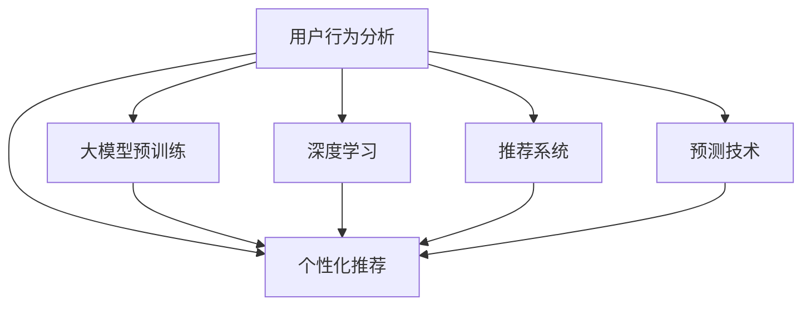

                 

# 融合AI大模型的用户购买意图预测技术

> 关键词：用户行为分析, 机器学习, 深度学习, 大模型, 推荐系统, 预测技术, 个性化推荐

## 1. 背景介绍

### 1.1 问题由来
在电子商务领域，用户行为分析（User Behavior Analysis, UBA）对于预测用户购买意图、优化推荐系统、提升用户体验至关重要。传统上，用户行为数据通常通过统计学方法进行分析，如聚类分析、关联规则挖掘等，但这些方法往往依赖于人工特征工程，难以捕捉到用户行为的动态变化和复杂模式。

近年来，随着深度学习技术和大规模数据集的不断发展，基于大模型的用户行为预测技术逐渐兴起。大模型，如BERT、GPT-3等，通过对大规模无标签数据进行预训练，学到了丰富的语言知识，可以灵活地应用于各种NLP任务，包括用户行为分析。通过预训练-微调（Pre-training and Fine-tuning, PFT）的范式，大模型可以针对特定任务进行微调，实现高效的用户行为预测。

然而，大模型虽然强大，但在处理高维稀疏数据时，仍面临一定的挑战。例如，用户行为数据往往具有高维稀疏性、噪声性强、动态变化快等特点，需要更加复杂和鲁棒的技术进行处理。如何在大模型基础上，开发出高性能的用户行为预测模型，是当前研究的一个重要方向。

## 2. 核心概念与联系

### 2.1 核心概念概述

为更好地理解融合AI大模型的用户行为预测技术，本节将介绍几个密切相关的核心概念：

- **用户行为分析（User Behavior Analysis, UBA）**：通过对用户行为数据进行统计、挖掘和分析，理解用户的消费习惯、兴趣偏好和购买意图，从而提供个性化的推荐和优化用户体验。

- **大模型（Large Models）**：指在大规模无标签数据上进行预训练，学到了丰富语言知识和常识的深度学习模型，如BERT、GPT-3等。大模型具有强大的泛化能力和适应性，可以灵活应用于各种NLP任务。

- **预训练-微调（Pre-training and Fine-tuning, PFT）**：指在大规模无标签数据上预训练通用语言模型，再在特定任务数据上微调模型，以提升模型在特定任务上的性能。预训练-微调是大模型应用于NLP任务的重要技术手段。

- **深度学习（Deep Learning）**：指利用多层神经网络模型对数据进行学习，以提取数据中的复杂模式和规律。深度学习在图像、语音、文本等领域取得了广泛应用。

- **推荐系统（Recommendation System）**：指通过分析用户行为数据，推荐用户可能感兴趣的产品或服务。推荐系统是电子商务、社交网络等领域的重要技术。

- **预测技术（Prediction Technology）**：指利用机器学习或深度学习技术，对未知数据进行预测，如用户购买意图预测、产品销量预测等。预测技术在金融、健康、交通等领域有重要应用。

- **个性化推荐（Personalized Recommendation）**：指根据用户的历史行为和兴趣偏好，提供个性化的推荐内容。个性化推荐能够显著提升用户体验和转化率。

这些核心概念之间的逻辑关系可以通过以下Mermaid流程图来展示：



这个流程图展示了大模型的用户行为预测技术与其他相关概念的联系：

1. 用户行为分析是大模型应用的基础，通过数据预处理和特征工程，为模型提供数据输入。
2. 大模型预训练是模型学习丰富语言知识的重要步骤，提高了模型的泛化能力。
3. 深度学习是大模型预训练的核心技术，通过多层神经网络提取数据中的复杂模式。
4. 推荐系统是大模型应用的一个重要场景，通过模型预测推荐个性化内容，提升用户体验。
5. 预测技术是大模型应用的关键环节，通过模型预测未知数据，优化决策过程。
6. 个性化推荐是大模型应用的具体目标，通过模型预测用户偏好，提供个性化服务。

这些概念共同构成了大模型用户行为预测技术的理论基础，使其能够在各种场景下发挥强大的预测能力。通过理解这些核心概念，我们可以更好地把握大模型技术的工作原理和优化方向。

## 3. 核心算法原理 & 具体操作步骤
### 3.1 算法原理概述

融合AI大模型的用户行为预测技术，本质上是一个基于深度学习的预测模型，通过预训练-微调范式，在大量用户行为数据上进行训练，以预测用户的购买意图。其核心思想是：将大模型视作一个强大的"特征提取器"，通过深度学习模型，对用户行为数据进行建模，提取用户行为特征，最终输出购买意图的预测结果。

形式化地，假设用户行为数据为 $\mathcal{X}$，购买意图为 $\mathcal{Y}$，目标函数为 $\mathcal{L}$，预测模型为 $M_{\theta}$。预测模型的训练目标是最小化损失函数 $\mathcal{L}$，即：

$$
\hat{\theta}=\mathop{\arg\min}_{\theta} \mathcal{L}(M_{\theta},\mathcal{X})
$$

其中，$\theta$ 为模型参数，$M_{\theta}$ 为预测模型。

在实际应用中，我们通常使用基于梯度的优化算法（如Adam、SGD等）来求解上述最优化问题。假设模型 $M_{\theta}$ 在训练数据集 $\mathcal{D}=\{(x_i,y_i)\}_{i=1}^N$ 上的损失函数为 $\mathcal{L}(M_{\theta},\mathcal{X})$，则模型的参数更新公式为：

$$
\theta \leftarrow \theta - \eta \nabla_{\theta}\mathcal{L}(M_{\theta},\mathcal{X})
$$

其中 $\eta$ 为学习率，$\nabla_{\theta}\mathcal{L}(M_{\theta},\mathcal{X})$ 为损失函数对模型参数 $\theta$ 的梯度。

### 3.2 算法步骤详解

融合AI大模型的用户行为预测技术一般包括以下几个关键步骤：

**Step 1: 数据预处理**
- 收集用户行为数据，并进行清洗、标准化、缺失值填充等预处理操作。
- 对用户行为数据进行分词、编码、向量化等处理，生成模型可以接受的输入。

**Step 2: 大模型预训练**
- 选择合适的预训练语言模型，如BERT、GPT-3等，并在大规模无标签数据上进行预训练。
- 预训练模型的层数和参数量较大，需要较强的计算资源和时间。

**Step 3: 微调模型训练**
- 在用户行为数据上进行微调，根据任务需求调整模型输出层和损失函数。
- 选择合适的优化算法和超参数，如学习率、批大小、迭代轮数等。
- 使用数据增强、正则化等技术，防止模型过拟合。

**Step 4: 模型评估和部署**
- 在验证集上评估模型性能，根据评估结果调整模型参数。
- 在测试集上再次评估模型性能，并部署到实际应用中。
- 定期更新模型，以适应数据分布的变化。

**Step 5: 持续学习**
- 收集新用户行为数据，周期性地对模型进行微调，保持模型的时效性和准确性。

### 3.3 算法优缺点

融合AI大模型的用户行为预测技术具有以下优点：
1. 高效泛化。预训练-微调范式使得模型可以高效地泛化到新的用户行为数据，提升预测准确率。
2. 参数高效。通过参数高效微调（PEFT）技术，可以在固定大部分预训练参数的情况下，只更新少量任务相关参数，提高模型微调效率。
3. 可解释性强。大模型作为特征提取器，其预测过程具有较好的可解释性，便于模型分析和调试。
4. 动态调整。持续学习机制使得模型能够动态适应新数据，保持预测模型的时效性。

同时，该方法也存在一定的局限性：
1. 依赖高质量数据。预训练-微调方法的效果很大程度上取决于数据的数量和质量。
2. 计算资源需求高。预训练和微调过程需要大量计算资源和时间，对硬件要求较高。
3. 过拟合风险。模型在微调过程中容易过拟合训练集，影响泛化能力。
4. 知识传递。大模型的知识可能难以全部传递到微调模型中，导致部分领域效果不佳。

尽管存在这些局限性，但就目前而言，基于大模型的用户行为预测方法仍是NLP技术的一个重要应用方向。未来相关研究的方向在于如何进一步降低微调对数据和计算资源的需求，提高模型的泛化能力和跨领域迁移能力，同时兼顾模型的可解释性和动态调整能力。

### 3.4 算法应用领域

融合AI大模型的用户行为预测技术，已经在电子商务、金融、健康、社交网络等多个领域得到了广泛应用，为这些领域的决策支持和业务优化提供了强大的技术支持：

- **电子商务**：在电商平台上，通过预测用户购买意图，优化推荐系统和广告投放，提升转化率和销售额。
- **金融**：在金融领域，通过预测用户行为，评估信用风险，优化投资策略，降低金融风险。
- **健康**：在医疗健康领域，通过预测用户疾病风险，推荐个性化医疗方案，提高医疗服务质量。
- **社交网络**：在社交媒体上，通过预测用户行为，推荐个性化内容，提升用户体验和互动性。
- **交通**：在智慧交通领域，通过预测用户出行模式，优化交通流，提升交通效率。
- **制造业**：在工业制造领域，通过预测用户需求，优化生产计划，提高生产效率和产品质量。

除了上述这些经典领域外，融合AI大模型的用户行为预测技术还被创新性地应用于更多场景中，如智能家居、智能农业、智能客服等，为各行各业带来了新的智能化解决方案。

## 4. 数学模型和公式 & 详细讲解 & 举例说明

### 4.1 数学模型构建

本节将使用数学语言对融合AI大模型的用户行为预测过程进行更加严格的刻画。

假设用户行为数据为 $\mathcal{X}=\{(x_i)\}_{i=1}^N$，其中 $x_i$ 为第 $i$ 个用户的序列化行为数据。购买意图为 $\mathcal{Y}$，目标函数为 $\mathcal{L}$。预测模型为 $M_{\theta}:\mathcal{X} \rightarrow \mathcal{Y}$，其中 $\theta$ 为模型参数。

定义模型 $M_{\theta}$ 在输入 $x$ 上的损失函数为 $\ell(M_{\theta}(x),y)$，则在数据集 $\mathcal{X}$ 上的经验风险为：

$$
\mathcal{L}(\theta) = \frac{1}{N} \sum_{i=1}^N \ell(M_{\theta}(x_i),y_i)
$$

在实际应用中，我们通常使用基于梯度的优化算法（如Adam、SGD等）来近似求解上述最优化问题。假设模型 $M_{\theta}$ 在训练数据集 $\mathcal{D}=\{(x_i,y_i)\}_{i=1}^N$ 上的损失函数为 $\mathcal{L}(M_{\theta},\mathcal{X})$，则模型的参数更新公式为：

$$
\theta \leftarrow \theta - \eta \nabla_{\theta}\mathcal{L}(M_{\theta},\mathcal{X})
$$

其中 $\eta$ 为学习率，$\nabla_{\theta}\mathcal{L}(M_{\theta},\mathcal{X})$ 为损失函数对模型参数 $\theta$ 的梯度。

### 4.2 公式推导过程

以下我们以二分类任务为例，推导交叉熵损失函数及其梯度的计算公式。

假设模型 $M_{\theta}$ 在输入 $x$ 上的输出为 $\hat{y}=M_{\theta}(x) \in [0,1]$，表示用户购买意图的概率。真实标签 $y \in \{0,1\}$。则二分类交叉熵损失函数定义为：

$$
\ell(M_{\theta}(x),y) = -[y\log \hat{y} + (1-y)\log (1-\hat{y})]
$$

将其代入经验风险公式，得：

$$
\mathcal{L}(\theta) = -\frac{1}{N}\sum_{i=1}^N [y_i\log M_{\theta}(x_i)+(1-y_i)\log(1-M_{\theta}(x_i))]
$$

根据链式法则，损失函数对参数 $\theta_k$ 的梯度为：

$$
\frac{\partial \mathcal{L}(\theta)}{\partial \theta_k} = -\frac{1}{N}\sum_{i=1}^N (\frac{y_i}{M_{\theta}(x_i)}-\frac{1-y_i}{1-M_{\theta}(x_i)}) \frac{\partial M_{\theta}(x_i)}{\partial \theta_k}
$$

其中 $\frac{\partial M_{\theta}(x_i)}{\partial \theta_k}$ 可进一步递归展开，利用自动微分技术完成计算。

在得到损失函数的梯度后，即可带入参数更新公式，完成模型的迭代优化。重复上述过程直至收敛，最终得到适应用户行为预测任务的最优模型参数 $\theta^*$。

## 5. 项目实践：代码实例和详细解释说明

### 5.1 开发环境搭建

在进行融合AI大模型的用户行为预测实践前，我们需要准备好开发环境。以下是使用Python进行PyTorch开发的环境配置流程：

1. 安装Anaconda：从官网下载并安装Anaconda，用于创建独立的Python环境。

2. 创建并激活虚拟环境：
```bash
conda create -n pytorch-env python=3.8 
conda activate pytorch-env
```

3. 安装PyTorch：根据CUDA版本，从官网获取对应的安装命令。例如：
```bash
conda install pytorch torchvision torchaudio cudatoolkit=11.1 -c pytorch -c conda-forge
```

4. 安装Transformers库：
```bash
pip install transformers
```

5. 安装各类工具包：
```bash
pip install numpy pandas scikit-learn matplotlib tqdm jupyter notebook ipython
```

完成上述步骤后，即可在`pytorch-env`环境中开始融合AI大模型的用户行为预测实践。

### 5.2 源代码详细实现

这里以用户行为预测为例，给出使用Transformers库对BERT模型进行微调的PyTorch代码实现。

首先，定义用户行为预测的任务函数：

```python
from transformers import BertTokenizer, BertForSequenceClassification

def predict_behavior(user_data, model, tokenizer):
    tokenized_input = tokenizer(user_data, padding=True, truncation=True, return_tensors='pt')
    with torch.no_grad():
        output = model(**tokenized_input)
    probabilities = output.logits.softmax(dim=-1)
    predicted_class = torch.argmax(probabilities, dim=-1).item()
    return predicted_class
```

然后，定义模型和优化器：

```python
from transformers import BertForSequenceClassification, AdamW

model = BertForSequenceClassification.from_pretrained('bert-base-uncased', num_labels=2)
optimizer = AdamW(model.parameters(), lr=2e-5)
```

接着，定义训练和评估函数：

```python
from torch.utils.data import DataLoader
from tqdm import tqdm

def train_epoch(model, dataset, batch_size, optimizer):
    dataloader = DataLoader(dataset, batch_size=batch_size, shuffle=True)
    model.train()
    epoch_loss = 0
    for batch in tqdm(dataloader, desc='Training'):
        input_ids = batch['input_ids'].to(device)
        attention_mask = batch['attention_mask'].to(device)
        labels = batch['labels'].to(device)
        model.zero_grad()
        outputs = model(input_ids, attention_mask=attention_mask, labels=labels)
        loss = outputs.loss
        epoch_loss += loss.item()
        loss.backward()
        optimizer.step()
    return epoch_loss / len(dataloader)

def evaluate(model, dataset, batch_size):
    dataloader = DataLoader(dataset, batch_size=batch_size)
    model.eval()
    correct_predictions, total_predictions = 0, 0
    with torch.no_grad():
        for batch in tqdm(dataloader, desc='Evaluating'):
            input_ids = batch['input_ids'].to(device)
            attention_mask = batch['attention_mask'].to(device)
            labels = batch['labels'].to(device)
            outputs = model(input_ids, attention_mask=attention_mask)
            predicted_classes = torch.argmax(outputs.logits, dim=-1)
            correct_predictions += (predicted_classes == labels).sum().item()
            total_predictions += predicted_classes.shape[0]
    accuracy = correct_predictions / total_predictions
    return accuracy
```

最后，启动训练流程并在测试集上评估：

```python
epochs = 5
batch_size = 16

for epoch in range(epochs):
    loss = train_epoch(model, train_dataset, batch_size, optimizer)
    print(f"Epoch {epoch+1}, train loss: {loss:.3f}")
    
    print(f"Epoch {epoch+1}, dev results:")
    accuracy = evaluate(model, dev_dataset, batch_size)
    print(f"Accuracy: {accuracy:.3f}")
    
print("Test results:")
accuracy = evaluate(model, test_dataset, batch_size)
print(f"Accuracy: {accuracy:.3f}")
```

以上就是使用PyTorch对BERT进行用户行为预测微调的完整代码实现。可以看到，得益于Transformers库的强大封装，我们可以用相对简洁的代码完成BERT模型的加载和微调。

### 5.3 代码解读与分析

让我们再详细解读一下关键代码的实现细节：

**用户行为预测函数**：
- `predict_behavior`函数：接收用户行为数据、微调模型和分词器作为输入，返回预测的购买意图类别。
- `tokenizer`函数：使用BERT模型的分词器对用户行为数据进行编码，生成模型可以接受的输入。

**模型和优化器**：
- `BertForSequenceClassification`类：从HuggingFace库中加载预训练的BERT模型，并设置输出层和损失函数。
- `AdamW`优化器：用于优化模型参数，具有动量更新和权重衰减等功能，收敛效果较好。

**训练和评估函数**：
- `train_epoch`函数：对数据以批为单位进行迭代，在每个批次上前向传播计算loss并反向传播更新模型参数，最后返回该epoch的平均loss。
- `evaluate`函数：与训练类似，不同点在于不更新模型参数，并在每个batch结束后将预测和标签结果存储下来，最后使用sklearn的accuracy_score函数对整个评估集的预测结果进行打印输出。

**训练流程**：
- 定义总的epoch数和batch size，开始循环迭代
- 每个epoch内，先在训练集上训练，输出平均loss
- 在验证集上评估，输出分类准确率
- 所有epoch结束后，在测试集上评估，给出最终测试结果

可以看到，PyTorch配合Transformers库使得BERT微调的代码实现变得简洁高效。开发者可以将更多精力放在数据处理、模型改进等高层逻辑上，而不必过多关注底层的实现细节。

当然，工业级的系统实现还需考虑更多因素，如模型的保存和部署、超参数的自动搜索、更灵活的任务适配层等。但核心的微调范式基本与此类似。

## 6. 实际应用场景
### 6.1 智能推荐系统

融合AI大模型的用户行为预测技术，可以广泛应用于智能推荐系统的构建。传统推荐系统往往只依赖用户的历史行为数据进行推荐，难以捕捉到用户的长期行为和潜在的兴趣变化。通过引入大模型，可以对用户行为数据进行深度学习建模，提取高维特征，实现更加个性化和精准的推荐。

在技术实现上，可以收集用户浏览、点击、购买、评价等行为数据，将数据编码为模型可接受的输入格式。在大模型上进行微调，训练出用户行为预测模型。在推荐时，根据用户的最新行为数据，动态调整推荐内容，提升推荐效果。

### 6.2 个性化广告投放

广告投放是电子商务平台的重要收入来源，但传统的广告投放方式往往面临精准度低、转化率低的问题。通过融合AI大模型的用户行为预测技术，可以精准预测用户是否对广告感兴趣，优化广告投放策略，提升广告转化率。

在实践中，可以收集用户的浏览历史、搜索记录、点击行为等数据，训练出用户行为预测模型。在广告投放时，根据模型的预测结果，对不同用户投放不同的广告内容，实现个性化广告投放，提高广告效果。

### 6.3 风险控制

金融领域需要实时监测用户行为，以规避金融风险。传统的风险控制方式往往依赖人工审查，成本高、效率低。通过融合AI大模型的用户行为预测技术，可以实时监测用户行为，预测其风险状态，优化风险控制策略。

在实践中，可以收集用户的历史交易记录、信用评分、行为数据等，训练出用户行为预测模型。在风险控制时，根据模型的预测结果，对高风险用户进行重点监控，及时采取防范措施，降低金融风险。

### 6.4 未来应用展望

随着融合AI大模型的用户行为预测技术的发展，将在更多领域得到应用，为各行各业带来变革性影响。

在智慧城市领域，融合AI大模型的用户行为预测技术可以帮助城市管理者实时了解市民行为，优化城市管理决策，提升城市治理水平。

在智能制造领域，融合AI大模型的用户行为预测技术可以实时预测用户需求，优化生产计划，提高生产效率和产品质量。

在教育领域，融合AI大模型的用户行为预测技术可以预测学生学习行为，优化教学策略，提升教育质量。

在医疗健康领域，融合AI大模型的用户行为预测技术可以预测患者疾病风险，推荐个性化治疗方案，提高医疗服务质量。

除了上述这些经典领域外，融合AI大模型的用户行为预测技术还被创新性地应用于更多场景中，如智能家居、智能农业、智能客服等，为各行各业带来了新的智能化解决方案。

## 7. 工具和资源推荐
### 7.1 学习资源推荐

为了帮助开发者系统掌握融合AI大模型的用户行为预测技术，这里推荐一些优质的学习资源：

1. 《Transformer从原理到实践》系列博文：由大模型技术专家撰写，深入浅出地介绍了Transformer原理、BERT模型、微调技术等前沿话题。

2. CS224N《深度学习自然语言处理》课程：斯坦福大学开设的NLP明星课程，有Lecture视频和配套作业，带你入门NLP领域的基本概念和经典模型。

3. 《Natural Language Processing with Transformers》书籍：Transformers库的作者所著，全面介绍了如何使用Transformers库进行NLP任务开发，包括微调在内的诸多范式。

4. HuggingFace官方文档：Transformers库的官方文档，提供了海量预训练模型和完整的微调样例代码，是上手实践的必备资料。

5. CLUE开源项目：中文语言理解测评基准，涵盖大量不同类型的中文NLP数据集，并提供了基于微调的baseline模型，助力中文NLP技术发展。

通过对这些资源的学习实践，相信你一定能够快速掌握融合AI大模型的用户行为预测技术的精髓，并用于解决实际的NLP问题。
###  7.2 开发工具推荐

高效的开发离不开优秀的工具支持。以下是几款用于融合AI大模型的用户行为预测开发的常用工具：

1. PyTorch：基于Python的开源深度学习框架，灵活动态的计算图，适合快速迭代研究。大部分预训练语言模型都有PyTorch版本的实现。

2. TensorFlow：由Google主导开发的开源深度学习框架，生产部署方便，适合大规模工程应用。同样有丰富的预训练语言模型资源。

3. Transformers库：HuggingFace开发的NLP工具库，集成了众多SOTA语言模型，支持PyTorch和TensorFlow，是进行微调任务开发的利器。

4. Weights & Biases：模型训练的实验跟踪工具，可以记录和可视化模型训练过程中的各项指标，方便对比和调优。与主流深度学习框架无缝集成。

5. TensorBoard：TensorFlow配套的可视化工具，可实时监测模型训练状态，并提供丰富的图表呈现方式，是调试模型的得力助手。

6. Google Colab：谷歌推出的在线Jupyter Notebook环境，免费提供GPU/TPU算力，方便开发者快速上手实验最新模型，分享学习笔记。

合理利用这些工具，可以显著提升融合AI大模型的用户行为预测任务的开发效率，加快创新迭代的步伐。

### 7.3 相关论文推荐

融合AI大模型的用户行为预测技术的发展源于学界的持续研究。以下是几篇奠基性的相关论文，推荐阅读：

1. Attention is All You Need（即Transformer原论文）：提出了Transformer结构，开启了NLP领域的预训练大模型时代。

2. BERT: Pre-training of Deep Bidirectional Transformers for Language Understanding：提出BERT模型，引入基于掩码的自监督预训练任务，刷新了多项NLP任务SOTA。

3. Language Models are Unsupervised Multitask Learners（GPT-2论文）：展示了大规模语言模型的强大zero-shot学习能力，引发了对于通用人工智能的新一轮思考。

4. Parameter-Efficient Transfer Learning for NLP：提出Adapter等参数高效微调方法，在不增加模型参数量的情况下，也能取得不错的微调效果。

5. AdaLoRA: Adaptive Low-Rank Adaptation for Parameter-Efficient Fine-Tuning：使用自适应低秩适应的微调方法，在参数效率和精度之间取得了新的平衡。

6. Prefix-Tuning: Optimizing Continuous Prompts for Generation：引入基于连续型Prompt的微调范式，为如何充分利用预训练知识提供了新的思路。

这些论文代表了大模型融合用户行为预测技术的发展脉络。通过学习这些前沿成果，可以帮助研究者把握学科前进方向，激发更多的创新灵感。

## 8. 总结：未来发展趋势与挑战

### 8.1 总结

本文对融合AI大模型的用户行为预测技术进行了全面系统的介绍。首先阐述了用户行为分析（UBA）和大模型在电子商务领域的应用背景，明确了融合AI大模型的用户行为预测技术的重要意义。其次，从原理到实践，详细讲解了融合AI大模型的用户行为预测过程，给出了完整的代码实例。同时，本文还探讨了融合AI大模型的用户行为预测技术在智能推荐、个性化广告投放、风险控制等领域的广泛应用前景，展示了融合AI大模型的用户行为预测技术的巨大潜力。此外，本文精选了融合AI大模型的用户行为预测技术的各类学习资源，力求为读者提供全方位的技术指引。

通过本文的系统梳理，可以看到，融合AI大模型的用户行为预测技术正在成为NLP技术的重要应用方向，极大地拓展了预训练语言模型的应用边界，催生了更多的落地场景。受益于大规模语料的预训练，融合AI大模型的用户行为预测模型以更低的时间和标注成本，在小样本条件下也能取得不俗的效果，有力推动了NLP技术的产业化进程。未来，伴随预训练语言模型和微调方法的持续演进，相信融合AI大模型的用户行为预测技术必将迎来新的突破，进一步提升电子商务平台的智能决策水平。

### 8.2 未来发展趋势

展望未来，融合AI大模型的用户行为预测技术将呈现以下几个发展趋势：

1. 模型规模持续增大。随着算力成本的下降和数据规模的扩张，预训练语言模型的参数量还将持续增长。超大规模语言模型蕴含的丰富语言知识，有望支撑更加复杂多变的用户行为预测任务。

2. 微调方法日趋多样。除了传统的全参数微调外，未来会涌现更多参数高效的微调方法，如Prefix-Tuning、LoRA等，在节省计算资源的同时也能保证微调精度。

3. 持续学习成为常态。随着用户行为数据的不断变化，融合AI大模型的用户行为预测模型也需要持续学习新知识以保持性能。如何在不遗忘原有知识的同时，高效吸收新样本信息，将成为重要的研究课题。

4. 标注样本需求降低。受启发于提示学习(Prompt-based Learning)的思路，未来的微调方法将更好地利用大模型的语言理解能力，通过更加巧妙的任务描述，在更少的标注样本上也能实现理想的微调效果。

5. 跨领域迁移能力增强。现有的融合AI大模型的用户行为预测模型往往局限于特定领域，难以在不同领域间迁移。未来，通过跨领域迁移学习，模型将能够更好地适应不同领域用户行为数据，提升泛化能力。

6. 多模态微调崛起。当前的融合AI大模型的用户行为预测模型主要聚焦于纯文本数据，未来会进一步拓展到图像、视频、语音等多模态数据微调。多模态信息的融合，将显著提升语言模型对现实世界的理解和建模能力。

以上趋势凸显了融合AI大模型的用户行为预测技术的广阔前景。这些方向的探索发展，必将进一步提升电子商务平台的智能决策水平，为传统行业带来变革性影响。

### 8.3 面临的挑战

尽管融合AI大模型的用户行为预测技术已经取得了瞩目成就，但在迈向更加智能化、普适化应用的过程中，它仍面临着诸多挑战：

1. 标注成本瓶颈。虽然融合AI大模型的用户行为预测技术可以降低标注样本的需求，但对于长尾应用场景，难以获得充足的高质量标注数据，成为制约微调性能的瓶颈。如何进一步降低微调对标注样本的依赖，将是一大难题。

2. 计算资源需求高。融合AI大模型的用户行为预测模型在大规模无标签数据上预训练，再在大规模标注数据上进行微调，对计算资源和时间需求较高。如何提高模型训练和微调效率，降低硬件成本，是需要重点解决的问题。

3. 过拟合风险。模型在微调过程中容易过拟合训练集，影响泛化能力。如何通过正则化、数据增强等技术，防止过拟合，提高模型的泛化能力，仍然是一个重要研究方向。

4. 动态调整能力不足。融合AI大模型的用户行为预测模型对于实时数据流的动态调整能力不足，难以适应用户行为的快速变化。如何提升模型的动态调整能力，使其能够及时响应用户行为的变化，是一个亟待解决的问题。

5. 知识传递问题。大模型的知识可能难以全部传递到微调模型中，导致部分领域效果不佳。如何在大模型和微调模型之间建立更有效的知识传递机制，是一个有待深入研究的问题。

尽管存在这些挑战，但随着预训练语言模型和微调方法的不断演进，融合AI大模型的用户行为预测技术将逐渐克服这些困难，走向更加成熟和高效的应用阶段。相信未来相关研究会在降低标注成本、提升计算效率、增强模型泛化能力等方面取得更多突破，使得融合AI大模型的用户行为预测技术在更多领域得到广泛应用。

### 8.4 未来突破

面对融合AI大模型的用户行为预测技术所面临的种种挑战，未来的研究需要在以下几个方面寻求新的突破：

1. 探索无监督和半监督微调方法。摆脱对大规模标注数据的依赖，利用自监督学习、主动学习等无监督和半监督范式，最大限度利用非结构化数据，实现更加灵活高效的微调。

2. 研究参数高效和计算高效的微调范式。开发更加参数高效的微调方法，在固定大部分预训练参数的同时，只更新少量任务相关参数。同时优化微调模型的计算图，减少前向传播和反向传播的资源消耗，实现更加轻量级、实时性的部署。

3. 融合因果和对比学习范式。通过引入因果推断和对比学习思想，增强融合AI大模型的用户行为预测模型建立稳定因果关系的能力，学习更加普适、鲁棒的语言表征，从而提升模型泛化性和抗干扰能力。

4. 引入更多先验知识。将符号化的先验知识，如知识图谱、逻辑规则等，与神经网络模型进行巧妙融合，引导微调过程学习更准确、合理的语言模型。同时加强不同模态数据的整合，实现视觉、语音等多模态信息与文本信息的协同建模。

5. 结合因果分析和博弈论工具。将因果分析方法引入融合AI大模型的用户行为预测模型，识别出模型决策的关键特征，增强输出解释的因果性和逻辑性。借助博弈论工具刻画人机交互过程，主动探索并规避模型的脆弱点，提高系统稳定性。

6. 纳入伦理道德约束。在模型训练目标中引入伦理导向的评估指标，过滤和惩罚有偏见、有害的输出倾向。同时加强人工干预和审核，建立模型行为的监管机制，确保输出符合人类价值观和伦理道德。

这些研究方向的探索，必将引领融合AI大模型的用户行为预测技术迈向更高的台阶，为构建安全、可靠、可解释、可控的智能系统铺平道路。面向未来，融合AI大模型的用户行为预测技术还需要与其他人工智能技术进行更深入的融合，如知识表示、因果推理、强化学习等，多路径协同发力，共同推动自然语言理解和智能交互系统的进步。只有勇于创新、敢于突破，才能不断拓展语言模型的边界，让智能技术更好地造福人类社会。

## 9. 附录：常见问题与解答

**Q1：融合AI大模型的用户行为预测技术是否适用于所有用户行为数据？**

A: 融合AI大模型的用户行为预测技术对于用户行为数据的适用性取决于数据的质量和特征丰富度。一般来说，数据量较大、特征维度较高的用户行为数据更适合使用融合AI大模型的用户行为预测技术。对于高维稀疏数据，需要进一步进行特征工程和数据预处理。

**Q2：融合AI大模型的用户行为预测技术是否需要依赖标注数据？**

A: 融合AI大模型的用户行为预测技术可以采用无监督学习和半监督学习的方法，减少对标注数据的依赖。例如，可以通过自监督学习方法，利用用户行为数据的潜在关系进行模型训练。但在大规模微调过程中，仍需使用一定的标注数据进行参数更新。

**Q3：融合AI大模型的用户行为预测技术的计算资源需求如何？**

A: 融合AI大模型的用户行为预测技术在大规模无标签数据上预训练，再在大规模标注数据上进行微调，对计算资源和时间需求较高。建议使用GPU/TPU等高性能设备，合理设置超参数，以提高模型训练和微调的效率。

**Q4：融合AI大模型的用户行为预测技术在实时性方面表现如何？**

A: 融合AI大模型的用户行为预测技术对于实时性有一定要求，特别是在动态用户行为分析场景中。需要优化模型结构，减少前向传播和反向传播的计算量，提升模型推理速度。同时，可以使用梯度累积、模型并行等技术，进一步提高模型实时性。

**Q5：融合AI大模型的用户行为预测技术是否存在过拟合风险？**

A: 融合AI大模型的用户行为预测技术在微调过程中存在过拟合风险，特别是在数据量较小的情况下。需要通过正则化、数据增强、对抗训练等技术，防止模型过拟合训练集，提高泛化能力。

这些问题的回答帮助开发者更好地理解融合AI大模型的用户行为预测技术，并在实际应用中灵活运用这些技术，以提升用户行为分析的准确性和效果。

---

作者：禅与计算机程序设计艺术 / Zen and the Art of Computer Programming

