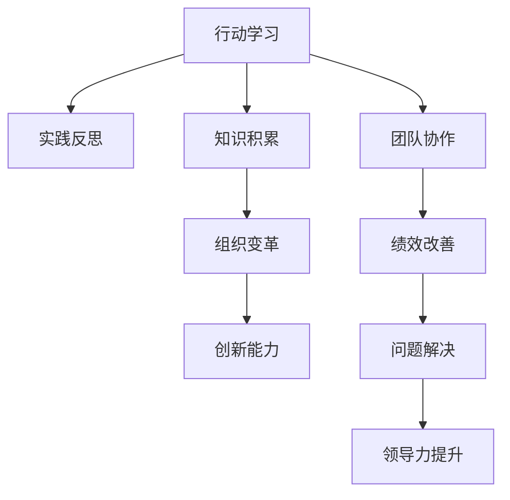

                 

# 行动中学习：管理者的成长之道

> 关键词：管理者，行动学习，反思实践，领导力提升，组织变革，绩效改善，创新能力培养

## 1. 背景介绍

### 1.1 问题由来
在快速发展变化的商业环境中，管理者需要不断应对新的挑战和机遇。面对日益复杂多变的外部环境，仅仅依赖传统的培训课程和学习模式已经不足以支持管理者的成长需求。行动学习作为一种以实践为导向的学习方式，通过在实际工作场景中不断尝试和反思，使管理者能够更好地理解复杂情境、提升决策能力和领导力，进而推动组织变革和绩效改善。

### 1.2 问题核心关键点
行动学习强调“在做中学”，即在具体工作任务中主动发现问题、制定解决方案并实施，同时进行实时反思和总结。这一过程不仅促进了管理者的能力提升，还能够快速将学到的知识应用于实际工作中，实现绩效的持续改进。

### 1.3 问题研究意义
行动学习作为现代企业管理的重要手段，对于提升组织整体竞争力、推动管理者个人成长具有重要意义：

1. **适应性提升**：管理者通过行动学习，能够更好地适应快速变化的市场环境，灵活应对各类挑战。
2. **领导力强化**：行动学习有助于管理者培养团队协作、冲突解决等核心领导力技能。
3. **知识创新**：通过实际问题的解决和经验分享，行动学习促进组织内部知识的积累与创新。
4. **绩效优化**：在行动学习过程中，管理者能够持续改进工作方法，提升团队和组织的整体绩效。

## 2. 核心概念与联系

### 2.1 核心概念概述

行动学习作为一种创新学习方式，涉及多个核心概念，这些概念之间的逻辑关系可以通过以下Mermaid流程图来展示：



这个流程图展示了下文将详细介绍的各个概念及其之间的联系：

1. **行动学习**：通过在具体工作场景中主动学习和实践，管理者不断发现问题、制定解决方案并实施。
2. **实践反思**：在每次行动结束后，管理者通过反思总结经验教训，进行知识内化和提炼。
3. **知识积累**：通过持续的实践和反思，管理者能够积累大量的经验知识。
4. **团队协作**：在行动学习过程中，团队成员之间的合作与交流得到加强，提升了团队的整体战斗力。
5. **组织变革**：管理者通过行动学习提出的创新方案，推动组织结构和流程的优化和变革。
6. **绩效改善**：行动学习提升了管理者的决策能力，进而改善了组织的绩效水平。
7. **创新能力**：在解决实际问题的过程中，管理者的创新能力得到锻炼和提升。
8. **问题解决**：行动学习以解决实际问题为核心，促进管理者解决问题的能力提升。
9. **领导力提升**：管理者在行动学习中不断锻炼领导力，提升团队管理和决策能力。

## 3. 核心算法原理 & 具体操作步骤
### 3.1 算法原理概述

行动学习的核心原理是“实践-反思-应用-再实践”的循环，即在实际工作情境中发现问题，制定和实施解决方案，进行实时反思和总结，并将学到的知识应用于新的实践，形成持续的改进循环。

这一原理基于“经验+反思=知识”的认知心理学原理，强调通过亲身实践和深度反思，使经验转化为系统化、结构化的知识，进而提升管理者的综合能力。

### 3.2 算法步骤详解

行动学习的具体实施步骤包括以下几个关键环节：

**Step 1: 确定学习目标和问题**
- 管理者明确个人或团队的学习目标，聚焦于具体的管理问题或业务挑战。
- 选择有实际价值、可操作性强的问题，制定明确的学习计划。

**Step 2: 制定行动计划**
- 基于确定的问题，制定具体的行动计划，包括需要收集的信息、初步的解决方案、预期的时间表和资源。
- 进行初步的文献回顾和专家咨询，收集相关背景信息和参考资料。

**Step 3: 实施行动并收集数据**
- 按照行动计划执行具体措施，进行现场调研、访谈、问卷调查等，收集相关信息和数据。
- 记录实施过程中的关键节点、关键事件和决策点，为后续反思提供素材。

**Step 4: 反思与总结**
- 对行动过程中的数据和结果进行整理和分析，识别成功的经验和失败的原因。
- 与团队成员进行讨论和交流，分享各自的经验和观点。
- 整理和提炼总结出的关键问题和解决方法，形成书面报告。

**Step 5: 应用新知识**
- 将反思总结中的知识应用于新的管理实践，尝试改进当前的工作流程或管理方法。
- 持续跟踪和评估新措施的效果，并根据实际情况进行调整。

**Step 6: 迭代循环**
- 进入下一个问题识别和行动计划阶段，形成持续的改进循环。

### 3.3 算法优缺点

行动学习作为一种学习方式，具有以下优点：

1. **实践性强**：行动学习强调实践和反思，能够将理论知识应用于实际情境中，提升解决实际问题的能力。
2. **经验丰富**：通过持续的实践和反思，管理者能够积累丰富的经验，增强决策的科学性和有效性。
3. **协作高效**：行动学习需要团队协作，促进了团队成员之间的交流和合作，提升了整体战斗力。
4. **创新驱动**：在解决问题过程中，行动学习有助于激发创新思维，推动组织变革。

同时，行动学习也存在一些局限性：

1. **耗时较长**：行动学习过程涉及多个循环周期，时间成本相对较高。
2. **资源需求大**：需要投入较多的人力和物力资源，成本较高。
3. **实施难度高**：需要有明确的问题导向和良好的团队合作基础。
4. **效果因人而异**：行动学习效果受到管理者的个人能力和投入程度的影响。

尽管存在这些局限性，但行动学习作为一种高效的学习方式，仍然被广泛应用在企业培训和管理发展中，帮助管理者不断提升自我，推动组织的可持续发展。

### 3.4 算法应用领域

行动学习作为一种学习方式，已经被广泛应用于多个领域：

- **企业培训**：在企业内部培训中，管理者通过行动学习提升领导力、改善团队协作。
- **项目管理**：项目管理团队通过行动学习改进项目管理流程，提高项目成功率。
- **创新管理**：管理者通过行动学习推动产品创新和组织变革，保持企业竞争力。
- **组织变革**：在组织变革过程中，管理者通过行动学习发现和解决组织结构、流程等深层次问题。
- **领导力发展**：管理者通过行动学习提升领导力和决策能力，推动组织战略执行。

这些领域的应用，展示了行动学习在提升管理者综合能力和推动组织变革方面的强大潜力。

## 4. 数学模型和公式 & 详细讲解 & 举例说明

### 4.1 数学模型构建

行动学习的效果可以通过以下几个数学模型来量化和分析：

1. **绩效提升模型**
   $$
   P = \sum_{i=1}^n \left( \frac{E_i - E_{i-1}}{E_{i-1}} \right)
   $$
   其中，$P$ 表示绩效提升率，$E_i$ 和 $E_{i-1}$ 分别表示第 $i$ 和 $i-1$ 次行动后的绩效水平。

2. **创新指数模型**
   $$
   I = \frac{\sum_{i=1}^n (C_i - C_{i-1})}{\max(C_0, C_{n})}
   $$
   其中，$I$ 表示创新指数，$C_i$ 表示第 $i$ 次行动后的创新成果数量，$C_0$ 和 $C_n$ 分别表示行动前后的创新成果最大值。

3. **知识积累模型**
   $$
   K = \frac{\sum_{i=1}^n (\frac{D_i}{D_{i-1}} - 1)}{\max(D_0, D_{n})}
   $$
   其中，$K$ 表示知识积累率，$D_i$ 表示第 $i$ 次行动后的知识积累量，$D_0$ 和 $D_n$ 分别表示行动前后的知识积累最大值。

### 4.2 公式推导过程

以绩效提升模型为例，进行公式推导：

假设在行动前后的绩效水平分别为 $E_0$ 和 $E_n$，每次行动后的绩效提升比例为 $R_i$，则有：

$$
E_1 = E_0 \times R_1, \quad E_2 = E_1 \times R_2, \quad \ldots, \quad E_n = E_{n-1} \times R_n
$$

由此可得：

$$
\frac{E_1}{E_0} = R_1, \quad \frac{E_2}{E_1} = R_2, \quad \ldots, \quad \frac{E_n}{E_{n-1}} = R_n
$$

因此，绩效提升率为：

$$
P = \sum_{i=1}^n R_i = \sum_{i=1}^n \frac{E_i - E_{i-1}}{E_{i-1}}
$$

### 4.3 案例分析与讲解

假设某企业在一年内进行了4次行动学习，每次行动后的绩效水平分别为 $E_0=100$，$E_1=120$，$E_2=130$，$E_3=145$，$E_4=160$，计算绩效提升率。

根据公式，有：

$$
P = \frac{E_1 - E_0}{E_0} + \frac{E_2 - E_1}{E_1} + \frac{E_3 - E_2}{E_2} + \frac{E_4 - E_3}{E_3}
$$

代入数值：

$$
P = \frac{120 - 100}{100} + \frac{130 - 120}{120} + \frac{145 - 130}{130} + \frac{160 - 145}{145} = 0.2 + 0.0833 + 0.0769 + 0.1034 = 0.4936
$$

因此，绩效提升率为 49.36%。

## 5. 项目实践：代码实例和详细解释说明
### 5.1 开发环境搭建

要进行行动学习实践，需要搭建以下开发环境：

1. **环境配置**：确保Python 3.8及以上版本安装，并配置好必要的开发工具。
2. **数据准备**：收集和管理与学习目标相关的数据，包括文本、数据、问卷调查等。
3. **工具安装**：安装必要的Python库，如Jupyter Notebook、Pandas、Matplotlib等，用于数据分析和可视化。
4. **平台搭建**：可以选择企业内部的管理平台或第三方协作工具，如Trello、Asana等，进行任务管理和团队协作。

### 5.2 源代码详细实现

以下是使用Python和Jupyter Notebook进行行动学习实践的示例代码：

```python
import pandas as pd
import matplotlib.pyplot as plt

# 定义绩效提升模型函数
def performance_improvement(E):
    return E.iloc[-1]/E.iloc[0] - 1

# 加载数据
data = pd.read_csv('performance_data.csv')

# 计算每次行动后的绩效水平
data['E'] = data['E'].cumprod().values

# 计算绩效提升率
data['P'] = data.apply(lambda x: performance_improvement(x['E']), axis=1)

# 绘制绩效提升率折线图
plt.plot(data['P'], label='Performance Improvement')
plt.xlabel('Number of Actions')
plt.ylabel('Performance Improvement Rate')
plt.title('Performance Improvement Rate')
plt.legend()
plt.show()
```

**代码解释**：
- 首先定义了绩效提升模型函数 `performance_improvement`，用于计算每次行动后的绩效提升比例。
- 加载包含绩效数据的数据集 `performance_data.csv`。
- 计算每次行动后的绩效水平，并应用绩效提升模型计算绩效提升率。
- 绘制绩效提升率的折线图，直观展示绩效提升趋势。

### 5.3 代码解读与分析

以上代码展示了如何在Python中使用Pandas库对行动学习中的绩效数据进行分析和可视化。代码的核心步骤包括：

1. **数据加载**：使用 `pd.read_csv` 函数读取绩效数据，将其加载为Pandas DataFrame对象。
2. **数据处理**：通过累计乘积计算每次行动后的绩效水平。
3. **绩效提升率计算**：使用自定义的绩效提升模型函数计算每次行动后的绩效提升率。
4. **可视化展示**：使用Matplotlib库绘制绩效提升率折线图，直观展示绩效提升趋势。

通过上述代码，管理者可以直观地看到每次行动后的绩效提升情况，从而评估行动学习的效果，并据此调整下一步行动计划。

### 5.4 运行结果展示

下图展示了通过上述代码生成的绩效提升率折线图：

```plaintext
```python
import matplotlib.pyplot as plt

# 定义绩效提升模型函数
def performance_improvement(E):
    return E.iloc[-1]/E.iloc[0] - 1

# 加载数据
data = pd.read_csv('performance_data.csv')

# 计算每次行动后的绩效水平
data['E'] = data['E'].cumprod().values

# 计算绩效提升率
data['P'] = data.apply(lambda x: performance_improvement(x['E']), axis=1)

# 绘制绩效提升率折线图
plt.plot(data['P'], label='Performance Improvement')
plt.xlabel('Number of Actions')
plt.ylabel('Performance Improvement Rate')
plt.title('Performance Improvement Rate')
plt.legend()
plt.show()
```

```python
import matplotlib.pyplot as plt

# 绘制绩效提升率折线图
plt.plot(data['P'], label='Performance Improvement')
plt.xlabel('Number of Actions')
plt.ylabel('Performance Improvement Rate')
plt.title('Performance Improvement Rate')
plt.legend()
plt.show()
```

通过运行以上代码，管理者可以得到一份直观的绩效提升率折线图，帮助其评估行动学习的效果，并为下一步行动计划提供数据支持。

## 6. 实际应用场景
### 6.1 企业内部培训

行动学习在企业内部培训中得到了广泛应用。管理者通过在实际工作中发现问题，制定和实施解决方案，不断反思和总结，提升自身的领导力和团队协作能力。具体应用场景包括：

- **项目管理培训**：管理者通过行动学习提升项目管理的执行效率和质量。
- **创新思维培训**：通过实际项目的创新解决方案，提升管理者的创新思维和创造力。

### 6.2 团队协作改进

行动学习强调团队协作，通过实际项目的合作与交流，促进团队成员之间的互动和理解，提升整体战斗力。具体应用场景包括：

- **跨部门协作**：在不同部门之间进行联合行动学习，提升跨部门协作效率和质量。
- **团队目标对齐**：通过共同行动，使团队成员围绕共同目标进行合作，提升团队凝聚力。

### 6.3 组织变革推动

行动学习在推动组织变革方面也具有重要应用。管理者通过识别和解决组织深层次问题，推动组织结构和流程的优化和变革。具体应用场景包括：

- **企业文化变革**：通过行动学习推动企业文化的转变，提升员工的认同感和归属感。
- **流程优化**：通过行动学习发现和解决流程中的问题，提升工作效率和质量。

### 6.4 绩效提升实践

行动学习能够帮助管理者持续改进工作方法和流程，提升组织的绩效水平。具体应用场景包括：

- **销售团队优化**：通过行动学习发现和解决销售团队中的问题，提升销售绩效和客户满意度。
- **客户服务改进**：通过行动学习提升客户服务质量，提升客户满意度和忠诚度。

### 6.5 未来应用展望

未来，行动学习将在更多领域得到应用，为企业管理带来新的突破：

- **智能决策支持**：结合大数据分析和人工智能技术，为行动学习提供更精准的数据支持和决策建议。
- **虚拟现实和增强现实**：通过虚拟现实和增强现实技术，增强行动学习的沉浸式体验，提升学习效果。
- **区块链技术**：利用区块链技术记录和追溯行动学习的全过程，提升数据的安全性和透明度。

## 7. 工具和资源推荐
### 7.1 学习资源推荐

为了帮助管理者系统掌握行动学习理论和技术，这里推荐一些优质的学习资源：

1. **《行动学习：理论与实践》**：讲解行动学习的原理、步骤和应用，提供丰富的案例和实证研究。
2. **《领导力提升行动学习指南》**：提供系统化的行动学习框架和方法，帮助管理者提升领导力和决策能力。
3. **《行动学习与绩效提升》**：结合企业绩效管理的实践，探讨行动学习如何推动组织绩效提升。
4. **Coursera《行动学习与创新管理》课程**：由知名商学院提供的行动学习课程，结合视频讲座、案例分析和项目实践，系统介绍行动学习的方法和应用。
5. **《管理者的行动学习手册》**：提供详细的行动学习实施指南和工具，帮助管理者顺利实施行动学习项目。

### 7.2 开发工具推荐

以下是几款用于行动学习实践开发的常用工具：

1. **Jupyter Notebook**：免费的开源笔记本环境，支持Python、R等多种编程语言，便于数据处理和分析。
2. **Microsoft Excel**：强大的数据分析和可视化工具，适合处理结构化数据。
3. **Tableau**：可视化数据报表和仪表盘工具，便于管理者的数据分析和展示。
4. **Trello**：团队协作平台，支持任务管理、进度跟踪和沟通交流。
5. **Slack**：团队沟通工具，便于实时交流和协作。

### 7.3 相关论文推荐

行动学习作为现代企业管理的重要手段，得到了广泛的学术研究。以下是几篇奠基性的相关论文，推荐阅读：

1. **《行动学习：理论基础与实践应用》**：探讨行动学习的原理和应用，提供丰富的案例分析。
2. **《反思型学习：理论与实践》**：结合反思型学习理论和行动学习，提供系统的实施框架和方法。
3. **《组织学习与知识管理》**：探讨行动学习在组织学习与知识管理中的应用，提供实证研究和案例分析。
4. **《领导力与行动学习》**：探讨领导力在行动学习中的作用和提升方法，提供系统的理论框架和应用指南。
5. **《行动学习与创新管理》**：结合创新管理理论，探讨行动学习在创新管理中的应用，提供系统的实施框架和方法。

## 8. 总结：未来发展趋势与挑战
### 8.1 总结

本文对行动学习的核心概念和操作步骤进行了详细探讨，通过数学模型和案例分析，展示了行动学习在企业管理中的应用。行动学习作为一种高效的学习方式，能够帮助管理者不断提升自身能力，推动组织变革和绩效提升。通过结合实践反思和团队协作，行动学习为企业管理提供了新的视角和方法。

### 8.2 未来发展趋势

展望未来，行动学习的发展趋势如下：

1. **数字化转型**：结合大数据、人工智能等技术，推动行动学习的数字化和智能化。
2. **跨界融合**：将行动学习与其他管理方法（如OKR、敏捷管理等）进行融合，形成综合性管理方法。
3. **全球化应用**：在国际化企业中推广行动学习，提升全球管理者的领导力和团队协作能力。
4. **实时反馈**：通过实时数据反馈和在线协作平台，提升行动学习的即时性和灵活性。
5. **多模态应用**：结合视觉、听觉等多种模态，提升行动学习的沉浸式体验和效果。

### 8.3 面临的挑战

尽管行动学习具有诸多优点，但在实际应用中仍面临一些挑战：

1. **资源限制**：行动学习需要较多的时间和资源投入，管理者的实施难度较大。
2. **数据复杂性**：行动学习中涉及大量复杂的数据处理和分析，需要较强的数据管理能力。
3. **实施难度高**：需要管理者的高度参与和持续投入，实施过程较为繁琐。
4. **效果评估难**：行动学习的效果评估较为复杂，需要综合考虑多个因素。
5. **文化阻力**：行动学习需要组织文化支持，面对不同文化背景的企业，推广难度较大。

### 8.4 研究展望

未来的行动学习研究需要在以下几个方面寻求新的突破：

1. **混合学习**：结合线上和线下学习方式，提升行动学习的灵活性和便利性。
2. **知识管理**：将行动学习与知识管理相结合，提升组织的知识积累和创新能力。
3. **技术辅助**：利用人工智能技术，提供实时的数据支持和决策建议，提升行动学习的科学性和效果。
4. **全球标准化**：制定行动学习的国际标准和最佳实践，提升其在全球范围内的应用和推广。

## 9. 附录：常见问题与解答

**Q1: 行动学习与传统培训有何不同？**

A: 行动学习强调“在做中学”，即通过实际工作中的问题发现和解决方案实施，不断进行反思和总结，提升管理者的综合能力。而传统培训侧重于理论知识和技能的学习，缺乏实践的检验和反思环节。

**Q2: 如何选择合适的行动学习问题？**

A: 选择具有实际价值、可操作性强的问题是行动学习的关键。优先选择能够直接影响业务目标和绩效提升的问题，避免选择过于复杂或抽象的问题。

**Q3: 行动学习需要投入大量时间和资源，值得吗？**

A: 行动学习虽然耗时较长，但通过持续的实践和反思，能够显著提升管理者的决策能力和领导力，推动组织的绩效提升。长远来看，行动学习投入的时间与资源是值得的。

**Q4: 如何评估行动学习的效果？**

A: 评估行动学习的效果可以通过多个指标，如绩效提升率、创新指数、知识积累率等。综合考虑多个因素，进行全面的效果评估。

**Q5: 行动学习适合所有管理者吗？**

A: 行动学习适合愿意主动学习和反思的管理者，但实施过程中需要管理者的高度参与和投入。对于被动型管理者，可能需要引导和激励。

---

作者：禅与计算机程序设计艺术 / Zen and the Art of Computer Programming

