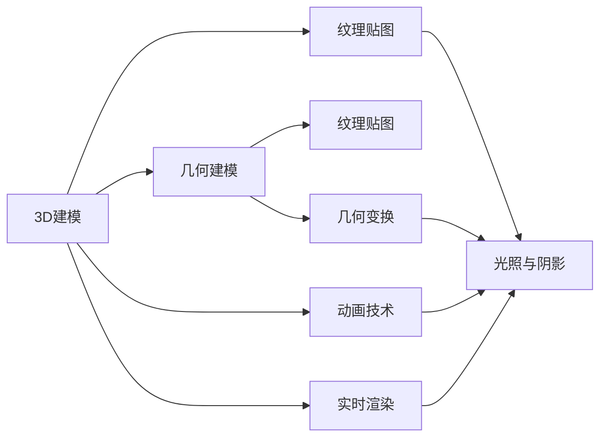

                 

# 计算机图形学：从3D建模到渲染技术

## 1. 背景介绍

计算机图形学是计算机科学中的一个重要分支，它研究如何通过计算机生成、处理和展示图形信息。在过去几十年中，计算机图形学已经从简单的几何图形渲染发展到了复杂的3D建模和实时渲染技术，为虚拟现实、动画制作、游戏开发等领域提供了强大的支持。本文将系统介绍计算机图形学从3D建模到渲染技术的核心概念、算法原理和实际应用，帮助读者全面掌握这一领域的知识。

## 2. 核心概念与联系

### 2.1 核心概念概述

计算机图形学涉及众多核心概念，以下是其中几个关键概念及其联系：

- **3D建模**：使用计算机图形学技术，将三维世界中的物体转换成计算机可处理的模型。包括几何建模、纹理贴图、动画等步骤。
- **渲染技术**：将3D模型转换为二维图像的过程，分为光照、投影、阴影等步骤。
- **几何建模**：研究如何描述3D物体的几何形状，包括线框建模、多边形建模、曲面建模等方法。
- **纹理贴图**：为3D模型添加材质、颜色、光照等属性，使其看起来更真实。
- **动画技术**：实现3D模型的动态效果，包括关键帧动画、骨骼动画、物理模拟等。
- **实时渲染**：在互动环境中实时生成图形，如游戏、虚拟现实等。

这些概念之间相互关联，共同构成了计算机图形学的核心技术体系。

### 2.2 核心概念原理和架构的 Mermaid 流程图



这个流程图展示了3D建模到渲染技术的核心流程。3D建模是整个流程的起点，包括几何建模和纹理贴图；动画技术则在此基础上实现动态效果；光照与阴影为渲染提供了物理真实感；最终，实时渲染技术将渲染结果展示在互动环境中。

## 3. 核心算法原理 & 具体操作步骤

### 3.1 算法原理概述

计算机图形学的核心算法原理包括：

- **线框建模**：使用简单的线条来表示3D物体的轮廓。
- **多边形建模**：使用多个多边形来逼近3D物体的形状。
- **曲面建模**：使用曲面来表示3D物体的形状，如NURBS曲面。
- **纹理映射**：将2D纹理映射到3D模型上，增加模型的真实感。
- **光照模型**：计算3D模型表面每个点受到的光照强度，生成逼真的图像。
- **阴影计算**：模拟3D物体的阴影效果，增加图像的立体感。
- **实时渲染**：使用高效算法，在互动环境中实时生成高质量的图形。

这些算法原理共同构成了计算机图形学的技术基础，使得3D模型可以逼真地渲染出来，并在互动环境中展示。

### 3.2 算法步骤详解

#### 3.2.1 几何建模

几何建模是3D建模的第一步，通过定义3D物体的形状和结构，为后续的纹理贴图、光照和阴影计算提供基础。常见的几何建模方法包括：

- **线框建模**：使用简单的线条表示物体的轮廓，适合早期的2D图形处理。
- **多边形建模**：使用多个三角形或四边形来逼近物体的形状，是最常用的3D建模方法之一。
- **曲面建模**：使用曲面方程来表示3D物体的形状，如球面、圆柱面等，适合复杂的几何形状。

几何建模的步骤包括：

1. **定义顶点**：定义3D物体的顶点坐标。
2. **定义边和表面**：定义顶点之间的连接关系，形成几何表面。
3. **计算法线和法向量**：计算每个面的法线和法向量，用于光照和阴影计算。

#### 3.2.2 纹理贴图

纹理贴图是将2D纹理映射到3D模型上，增加模型的真实感。常见的纹理贴图方法包括：

- **平面映射**：将纹理平铺在3D模型的表面上，适合简单的几何形状。
- **球面映射**：将纹理映射到球面上，适合球形物体。
- **立方体映射**：将纹理映射到立方体上，适合四面体和八面体。

纹理贴图的步骤包括：

1. **选择纹理**：选择适合3D模型的纹理图像。
2. **纹理坐标计算**：计算每个顶点在纹理平面上的坐标。
3. **纹理映射**：将纹理平铺在3D模型的表面上。

#### 3.2.3 光照与阴影

光照与阴影是渲染技术中的关键步骤，通过模拟光线在3D模型上的反射和折射，增加图像的真实感。常见的光照模型包括：

- **漫反射模型**：假设光线在物体表面均匀反射，适用于大部分物体。
- **镜面反射模型**：假设光线在物体表面镜面反射，适用于光滑表面。
- **环境光模型**：考虑环境光对物体的影响，增加图像的立体感。

光照与阴影的计算步骤包括：

1. **定义光源**：定义光源的位置、颜色和强度。
2. **计算光照强度**：计算3D模型表面每个点受到的光照强度。
3. **计算阴影**：根据光照强度和光源位置，计算3D模型的阴影效果。

#### 3.2.4 实时渲染

实时渲染技术是在互动环境中实时生成高质量的图形，常用的方法包括：

- **光栅化**：将3D模型转换为2D图像的过程，包括线段转换、像素插值等。
- **反投影**：将3D模型投影到屏幕上，计算像素颜色。
- **光照和阴影计算**：根据光源位置和强度，计算像素颜色。

实时渲染的计算步骤包括：

1. **光栅化**：将3D模型转换为像素，生成光栅图像。
2. **光照和阴影计算**：根据光源位置和强度，计算像素颜色。
3. **合并效果**：将光栅化结果和光照效果合并，生成最终的渲染图像。

### 3.3 算法优缺点

#### 3.3.1 算法优点

- **逼真效果**：通过光照和阴影计算，可以生成逼真的图像效果。
- **灵活性高**：使用多边形建模和曲面建模，可以表示任意复杂的几何形状。
- **实时性**：通过光栅化和实时渲染技术，可以在互动环境中实时生成高质量的图形。

#### 3.3.2 算法缺点

- **计算复杂度高**：光照和阴影计算需要大量计算资源，可能导致渲染速度较慢。
- **细节损失**：高分辨率纹理贴图可能导致细节损失，影响渲染效果。
- **算法复杂**：实时渲染算法复杂，需要大量的优化和调试工作。

### 3.4 算法应用领域

计算机图形学的应用领域非常广泛，包括：

- **虚拟现实**：通过3D建模和实时渲染技术，构建虚拟环境，提供沉浸式体验。
- **动画制作**：使用动画技术，生成逼真的动画效果，制作电影、电视等。
- **游戏开发**：使用3D建模和实时渲染技术，开发各种类型的游戏，提供互动体验。
- **建筑设计**：使用3D建模和光照计算，展示建筑设计效果，帮助设计师进行可视化。
- **医学可视化**：使用3D建模和实时渲染技术，展示人体内部结构，帮助医生进行诊断和治疗。

## 4. 数学模型和公式 & 详细讲解 & 举例说明

### 4.1 数学模型构建

计算机图形学的数学模型主要涉及几何、光学、物理等方面的知识。以下是几个关键数学模型：

- **点、线、面的几何表示**：
  - **点**：用三维坐标$(x,y,z)$表示。
  - **线**：用两个点$(x_1,y_1,z_1)$和$(x_2,y_2,z_2)$表示。
  - **面**：用多个三角形或四边形表示。

- **光照模型**：
  - **漫反射模型**：$I_s = k_s \cdot L \cdot \cos(\theta)$，其中$I_s$表示漫反射强度，$L$表示光照强度，$k_s$表示漫反射系数，$\theta$表示法向量和光线的夹角。
  - **镜面反射模型**：$I_s = k_s \cdot L \cdot \cos(\theta)^n$，其中$n$表示镜面反射指数。

- **投影模型**：
  - **透视投影**：$x'=\frac{z \cdot x}{z+z_0}$，$y'=\frac{z \cdot y}{z+z_0}$，其中$(x',y',z')$表示投影后的坐标，$z_0$表示透视距离。
  - **正交投影**：$x'=x$，$y'=y$，$z'=z$。

### 4.2 公式推导过程

#### 4.2.1 点、线、面的几何表示

点、线、面的几何表示是计算机图形学的基础，其推导过程如下：

- **点**：用三维坐标$(x,y,z)$表示。
- **线**：假设点$(x_1,y_1,z_1)$和$(x_2,y_2,z_2)$定义了一条直线，则直线的参数方程为：
  - $x=x_1+t(x_2-x_1)$
  - $y=y_1+t(y_2-y_1)$
  - $z=z_1+t(z_2-z_1)$
  - 其中$t$为参数。

- **面**：假设三角形顶点为$(x_1,y_1,z_1)$、$(x_2,y_2,z_2)$和$(x_3,y_3,z_3)$，则三角形的平面方程为：
  - $A(x-x_1)+B(y-y_1)+C(z-z_1)=0$
  - 其中$A=a_2-a_1$，$B=b_2-b_1$，$C=c_2-c_1$，$a_1$、$b_1$和$c_1$分别为顶点坐标。

#### 4.2.2 光照模型

漫反射模型的推导过程如下：

- **漫反射模型**：
  - $I_s = k_s \cdot L \cdot \cos(\theta)$
  - 其中$I_s$表示漫反射强度，$L$表示光照强度，$k_s$表示漫反射系数，$\theta$表示法向量和光线的夹角。

- **镜面反射模型**：
  - $I_s = k_s \cdot L \cdot \cos(\theta)^n$
  - 其中$n$表示镜面反射指数，通常取$n=1$。

#### 4.2.3 投影模型

透视投影模型的推导过程如下：

- **透视投影**：
  - $x'=\frac{z \cdot x}{z+z_0}$
  - $y'=\frac{z \cdot y}{z+z_0}$
  - $z'=z$
  - 其中$(x',y',z')$表示投影后的坐标，$z_0$表示透视距离。

- **正交投影**：
  - $x'=x$
  - $y'=y$
  - $z'=z$

### 4.3 案例分析与讲解

#### 4.3.1 光照与阴影计算

假设有一个球体，光源在上方，球体表面为白色。

1. **漫反射计算**：
  - 假设球体表面每个点$(x,y,z)$到光源的法线角度$\theta$为$\pi/2$，则漫反射强度$I_s$为$k_s \cdot L \cdot \cos(\theta)$，其中$k_s$为漫反射系数，$L$为光照强度。
  - 由于$\cos(\pi/2)=0$，因此漫反射强度$I_s$为0。

2. **镜面反射计算**：
  - 假设球体表面每个点$(x,y,z)$到光源的法线角度$\theta$为$\pi/2$，则镜面反射强度$I_s$为$k_s \cdot L \cdot \cos(\theta)^n$，其中$n$为镜面反射指数。
  - 由于$\cos(\pi/2)=0$，因此镜面反射强度$I_s$为0。

3. **阴影计算**：
  - 假设光源在上方，球体表面$(x,y,z)$到光源的距离$d=\sqrt{(x-x_0)^2+(y-y_0)^2+(z-z_0)^2}$，其中$(x_0,y_0,z_0)$为光源的位置。
  - 如果$d>0$，则$(x,y,z)$在光源照射范围内，应计算光照强度。
  - 如果$d=0$，则$(x,y,z)$在光源照射范围外，应计算阴影。

#### 4.3.2 实时渲染

假设有一个立方体，每个面的纹理分别为不同的颜色，光源在上方。

1. **光栅化**：
  - 将立方体转换为像素，计算每个像素的坐标。
  - 假设光源在上方，立方体每个面的法向量和光源的夹角$\theta$小于90度，则该面的法向量和光线的夹角$\phi$为0度，漫反射强度$I_s$为$k_s \cdot L$。

2. **光照和阴影计算**：
  - 根据光源位置和强度，计算每个像素的光照强度。
  - 根据光源位置和角度，计算每个像素的阴影效果。

3. **合并效果**：
  - 将光栅化结果和光照效果合并，生成最终的渲染图像。
  - 立方体的每个面都有不同的纹理，最终渲染图像应为不同颜色。

## 5. 项目实践：代码实例和详细解释说明

### 5.1 开发环境搭建

计算机图形学的项目实践需要相应的开发环境，以下是Python和Pygame的搭建流程：

1. **安装Python**：
  - 从官网下载并安装Python。
  - 设置Python环境变量，在命令行中运行`python --version`测试安装。

2. **安装Pygame**：
  - 打开命令行，运行`pip install pygame`安装Pygame。
  - 测试安装，在Python脚本中导入Pygame模块，运行`import pygame`。

### 5.2 源代码详细实现

以下是使用Python和Pygame实现一个简单的3D球体渲染的代码示例：

```python
import pygame
import math
import random

# 定义球体参数
radius = 50
center = (300, 300)
colors = [(255, 0, 0), (0, 255, 0), (0, 0, 255)]

# 初始化Pygame
pygame.init()

# 设置窗口大小
screen = pygame.display.set_mode((600, 600))

# 定义球体类
class Sphere:
    def __init__(self, radius, center, color):
        self.radius = radius
        self.center = center
        self.color = color

    def draw(self):
        screen.fill((0, 0, 0))
        pygame.draw.circle(screen, self.color, self.center, self.radius)

# 定义光源类
class Light:
    def __init__(self, pos, color, intensity):
        self.pos = pos
        self.color = color
        self.intensity = intensity

    def draw(self):
        screen.fill((255, 255, 255))

# 主函数
if __name__ == '__main__':
    # 创建球体和光源
    sphere = Sphere(radius, center, colors[0])
    light = Light((200, 200, 200), (255, 255, 255), 1.0)

    # 渲染循环
    running = True
    while running:
        for event in pygame.event.get():
            if event.type == pygame.QUIT:
                running = False

        # 计算光照强度
        light.intensity = 0.0
        for color in colors:
            dx = center[0] - light.pos[0]
            dy = center[1] - light.pos[1]
            distance = math.sqrt(dx**2 + dy**2)
            if distance < light.intensity:
                light.intensity = distance

        # 渲染球体
        sphere.draw()
        light.draw()

        # 更新屏幕
        pygame.display.flip()

    pygame.quit()
```

### 5.3 代码解读与分析

这段代码实现了一个简单的3D球体渲染，其中包含了球体和光源的绘制、光照强度计算和屏幕更新等关键步骤。

1. **球体类和光源类**：
  - 定义了球体和光源的类，包含位置、半径、颜色等属性。
  - 使用Pygame的图形绘制函数，绘制球体和光源。

2. **光照强度计算**：
  - 使用球体的位置和光源的位置，计算球体表面每个点到光源的距离。
  - 根据光源的强度，计算每个像素的光照强度。

3. **渲染循环**：
  - 使用Pygame的事件循环，处理窗口关闭事件。
  - 在渲染循环中，计算光照强度，绘制球体和光源，更新屏幕。

### 5.4 运行结果展示

运行以上代码，可以观察到一个带有阴影的3D球体在屏幕上渲染，光源位置和球体位置的变化将影响球体的光照效果。

## 6. 实际应用场景

### 6.1 虚拟现实

虚拟现实(VR)技术使用3D建模和实时渲染技术，创建逼真的虚拟环境，提供沉浸式体验。例如，游戏玩家可以在虚拟世界中自由探索，医疗工作者可以模拟手术操作，教育工作者可以创建虚拟教室等。

### 6.2 动画制作

动画制作使用3D建模和动画技术，生成逼真的动画效果。例如，电影制作公司可以使用3D建模和实时渲染技术，制作逼真的动画场景，增强电影的视觉效果。

### 6.3 游戏开发

游戏开发使用3D建模和实时渲染技术，开发各种类型的游戏，提供互动体验。例如，动作游戏、角色扮演游戏、射击游戏等，都使用3D建模和实时渲染技术，实现逼真的游戏场景和角色。

### 6.4 医学可视化

医学可视化使用3D建模和光照计算，展示人体内部结构，帮助医生进行诊断和治疗。例如，医生可以使用CT、MRI等医学图像，通过3D建模和光照计算，生成逼真的三维模型，帮助医生进行诊断和治疗。

## 7. 工具和资源推荐

### 7.1 学习资源推荐

1. **《计算机图形学：现代方法》**：这是一本经典的计算机图形学教材，涵盖了计算机图形学的各个方面，包括几何建模、光照和阴影计算、实时渲染等。
2. **《OpenGL编程指南》**：这是一本关于OpenGL编程的书籍，介绍了OpenGL的各种功能和用法，适合计算机图形学初学者和中级开发者。
3. **Pygame官方文档**：Pygame官方文档提供了详细的Pygame教程和示例代码，适合Python和计算机图形学初学者。

### 7.2 开发工具推荐

1. **Blender**：Blender是一款免费的3D建模和渲染软件，提供了强大的建模工具和实时渲染引擎，适合计算机图形学开发者和艺术家使用。
2. **Maya**：Maya是一款专业的3D建模和动画制作软件，提供了强大的建模工具和动画技术，适合电影和游戏开发公司使用。
3. **Unity**：Unity是一款游戏引擎，支持3D建模和实时渲染，提供了丰富的游戏开发工具和资源，适合游戏开发者使用。

### 7.3 相关论文推荐

1. **《现代计算机图形学：用OpenGL版》**：这是一本关于OpenGL编程的书籍，介绍了OpenGL的各种功能和用法，适合计算机图形学初学者和中级开发者。
2. **《计算机图形学导论》**：这是一本经典的计算机图形学教材，介绍了计算机图形学的各个方面，包括几何建模、光照和阴影计算、实时渲染等。
3. **《三维计算机图形学基础》**：这是一本关于三维计算机图形学的书籍，介绍了三维图形学的基本概念和算法，适合计算机图形学开发者和研究者使用。

## 8. 总结：未来发展趋势与挑战

### 8.1 研究成果总结

计算机图形学从简单的几何图形渲染发展到了复杂的3D建模和实时渲染技术，为虚拟现实、动画制作、游戏开发等领域提供了强大的支持。当前，计算机图形学正处于快速发展阶段，呈现出多样化的应用场景和前沿技术。

### 8.2 未来发展趋势

1. **实时性提升**：随着硬件性能的提升，实时渲染技术将更加高效，可以在互动环境中实时生成高质量的图形。
2. **虚拟现实和增强现实**：虚拟现实和增强现实技术将进一步发展，为用户提供更加沉浸式和互动式的体验。
3. **人工智能和机器学习**：人工智能和机器学习技术将与计算机图形学进一步融合，实现更加智能化的图像生成和增强。
4. **跨平台和跨设备**：计算机图形学将更多地应用于移动设备、嵌入式设备等，实现跨平台和跨设备的图形渲染。

### 8.3 面临的挑战

1. **计算资源**：实时渲染和虚拟现实需要大量的计算资源，可能导致硬件瓶颈。
2. **实时性**：实时渲染需要高效算法和优化，实现高质量的实时渲染。
3. **用户体验**：如何提供更加沉浸式和互动式的用户体验，需要进一步研究和优化。

### 8.4 研究展望

1. **多模态图形学**：结合视觉、听觉、触觉等多模态信息，实现更加全面的图形渲染和交互。
2. **自适应渲染**：根据用户反馈和环境变化，动态调整渲染参数，实现更加智能化的图形渲染。
3. **深度学习**：结合深度学习技术，实现更加智能化的图像生成和增强。

## 9. 附录：常见问题与解答

**Q1：计算机图形学和游戏开发有什么区别？**

A: 计算机图形学是研究如何通过计算机生成、处理和展示图形信息，而游戏开发是使用计算机图形学技术，开发各种类型的游戏，提供互动体验。两者都是计算机图形学的重要应用领域，但侧重点不同。

**Q2：如何优化实时渲染算法？**

A: 实时渲染算法优化需要考虑多方面的因素，例如：
- 选择合适的渲染引擎和工具。
- 使用高效的图形绘制算法，如光栅化和层次渲染。
- 优化纹理贴图和光照计算，减少计算资源消耗。
- 使用多线程和GPU加速，提高渲染速度。

**Q3：计算机图形学有哪些实际应用？**

A: 计算机图形学的主要应用领域包括：
- 虚拟现实和增强现实。
- 动画制作和电影制作。
- 游戏开发和互动娱乐。
- 医学可视化。
- 建筑设计。

以上是计算机图形学从3D建模到渲染技术的核心概念、算法原理和实际应用的全面介绍。通过深入理解这些知识，相信你能够更好地掌握计算机图形学的技术，并在实际应用中发挥其强大的作用。

