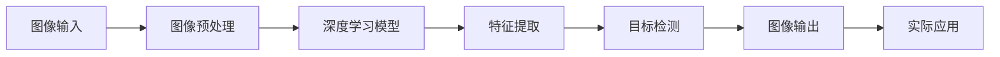

                 

# 计算机视觉实战：OpenCV与深度学习的结合

> 关键词：计算机视觉, OpenCV, 深度学习, 图像处理, 目标检测, 特征提取, 卷积神经网络, 图像分类, 实时应用, 模型部署

## 1. 背景介绍

### 1.1 问题由来

计算机视觉(Computer Vision, CV)是人工智能(AI)领域的重要分支，旨在使计算机能够“看见”和理解真实世界的视觉信息。它通过模拟人类视觉感知和认知的过程，使机器能够自动地从图像、视频等视觉数据中提取信息、进行分类、检测、跟踪等任务。

传统的计算机视觉方法主要依赖于手写的特征工程和传统的机器学习算法。但是，这种方法往往需要大量的人工干预，对领域知识和经验依赖较大。近年来，深度学习技术，尤其是卷积神经网络(Convolutional Neural Networks, CNNs)在图像分类、目标检测、语义分割等任务上取得了突破性进展，被广泛应用于计算机视觉领域。

然而，深度学习模型的训练和推理需要巨大的计算资源和时间，且模型的通用性和可解释性较差，难以在大规模实际应用中快速部署。这使得深度学习在计算机视觉领域的推广受到了一定的限制。

OpenCV是一个流行的计算机视觉库，提供了许多图像处理和计算机视觉算法的实现。它以跨平台的C++ API为基础，同时支持Python等高级编程语言，并集成了深度学习模型的接口，可以帮助开发者更高效地实现图像处理和计算机视觉算法。

本文将探讨如何结合OpenCV和深度学习技术，构建高效、易用的计算机视觉应用。首先，我们将介绍OpenCV和深度学习的基本概念和原理，然后，我们将展示如何在实际项目中结合两者进行图像处理和计算机视觉开发。最后，我们将讨论在实际应用中如何优化性能和提高模型的可解释性。

### 1.2 问题核心关键点

本文的核心关键点如下：

- **OpenCV**：一个广泛使用的计算机视觉库，提供了多种图像处理和计算机视觉算法。
- **深度学习**：一种强大的机器学习技术，通过卷积神经网络等模型进行图像分类、目标检测等任务。
- **图像处理**：通过OpenCV和深度学习技术，提升图像的质量和鲁棒性，为计算机视觉任务提供更好的输入数据。
- **目标检测**：一种重要的计算机视觉任务，目标检测模型能够识别图像中的物体并进行定位。
- **特征提取**：通过卷积神经网络等深度学习模型，提取图像的高级特征，用于分类、检测等任务。
- **模型部署**：将深度学习模型部署到实际应用中，通过OpenCV等工具提高模型的实时性和稳定性。

## 2. 核心概念与联系

### 2.1 核心概念概述

为了更好地理解OpenCV与深度学习结合的实践，我们需要先介绍一些核心概念：

- **计算机视觉**：计算机视觉是一门涉及图像处理、图像分析、模式识别等技术的学科，旨在使计算机能够理解和分析视觉信息。
- **图像处理**：通过各种算法和工具，对图像进行预处理、增强、分割、变换等操作，以提高图像质量、提取有用信息。
- **目标检测**：计算机视觉中的重要任务之一，目标检测模型能够识别图像中的物体，并给出其位置信息。
- **特征提取**：通过深度学习模型，自动地从图像中提取有用的特征，用于分类、检测等任务。
- **深度学习**：一种通过多层次神经网络模型进行复杂数据模式学习的技术。
- **OpenCV**：一个跨平台的计算机视觉库，提供了多种图像处理和计算机视觉算法的实现。

### 2.2 核心概念原理和架构的 Mermaid 流程图

以下是一个简单的Mermaid流程图，展示了OpenCV与深度学习结合的原理：



这个流程图展示了从图像输入到实际应用的基本流程。图像经过预处理后，输入到深度学习模型中进行特征提取，再通过目标检测模型进行物体识别和定位，最终得到图像输出，供实际应用使用。

## 3. 核心算法原理 & 具体操作步骤

### 3.1 算法原理概述

结合OpenCV与深度学习的计算机视觉应用，主要涉及以下几个核心算法：

- **图像预处理**：包括图像的滤波、去噪、灰度化、归一化等操作，目的是提高图像质量，为深度学习模型提供更好的输入数据。
- **深度学习模型**：如卷积神经网络(CNNs)、循环神经网络(RNNs)等，用于从图像中提取特征和进行分类、检测等任务。
- **特征提取**：通过卷积神经网络等模型，从图像中自动提取有用的特征。
- **目标检测**：通过目标检测模型，识别图像中的物体，并给出其位置信息。

### 3.2 算法步骤详解

以下是一个简单的步骤详解，展示了结合OpenCV与深度学习的计算机视觉应用的基本流程：

1. **图像输入**：获取原始图像数据，包括图像文件或摄像头捕捉的实时图像。
2. **图像预处理**：对原始图像进行滤波、去噪、灰度化、归一化等操作，提高图像质量。
3. **深度学习模型**：加载预训练的深度学习模型，或使用OpenCV集成的深度学习库进行模型的构建和训练。
4. **特征提取**：通过深度学习模型，自动提取图像的高级特征，用于分类、检测等任务。
5. **目标检测**：通过目标检测模型，识别图像中的物体，并给出其位置信息。
6. **图像输出**：将目标检测结果叠加在原始图像上，供实际应用使用。
7. **实际应用**：将处理后的图像输出应用到实际场景中，如图像分类、物体检测、人脸识别等。

### 3.3 算法优缺点

结合OpenCV与深度学习的计算机视觉应用，有以下优缺点：

- **优点**：
  - **高效性**：OpenCV提供了许多高效的图像处理和计算机视觉算法，可以提高处理速度和效率。
  - **易用性**：OpenCV提供了跨平台的C++ API和Python接口，易于集成和使用。
  - **灵活性**：OpenCV支持多种深度学习框架，如TensorFlow、PyTorch等，可以灵活选择和集成深度学习模型。

- **缺点**：
  - **资源消耗**：深度学习模型需要大量的计算资源和时间，增加了系统的负担。
  - **模型复杂性**：深度学习模型通常比较复杂，难以解释和调试。
  - **应用场景限制**：深度学习模型需要大量的标注数据进行训练，对于小数据集和少见任务，可能效果不佳。

### 3.4 算法应用领域

结合OpenCV与深度学习的计算机视觉技术，已经在诸多领域得到了广泛应用，例如：

- **自动驾驶**：通过目标检测和图像识别技术，自动驾驶车辆可以识别道路上的其他车辆、行人、交通标志等，进行路径规划和决策。
- **医疗影像分析**：通过图像分类和特征提取技术，自动识别和分析医疗影像，如X光片、CT扫描等，辅助医生进行诊断。
- **安防监控**：通过目标检测和图像识别技术，监控系统可以自动检测异常行为，如入侵、破坏等，提高安全防范能力。
- **工业检测**：通过目标检测和图像分类技术，自动检测生产过程中的异常情况，提高生产效率和质量。
- **人脸识别**：通过人脸检测和特征提取技术，自动识别人脸，用于身份验证、门禁管理等场景。

## 4. 数学模型和公式 & 详细讲解 & 举例说明

### 4.1 数学模型构建

在计算机视觉应用中，数学模型通常涉及以下几种：

- **图像预处理**：包括滤波、去噪、灰度化等操作，可以使用傅里叶变换、小波变换等数学工具进行描述。
- **深度学习模型**：如卷积神经网络(CNNs)、循环神经网络(RNNs)等，可以通过神经网络数学模型进行描述。
- **目标检测**：如YOLO、Faster R-CNN等模型，可以通过其数学模型进行描述。

### 4.2 公式推导过程

以下是一个简单的公式推导过程，展示了卷积神经网络(CNN)的基本数学模型：

设输入图像为 $x \in \mathbb{R}^{H \times W \times C}$，卷积核为 $w \in \mathbb{R}^{F \times F \times C \times O}$，其中 $H$、$W$、$C$ 分别为输入图像的高度、宽度和通道数，$F$ 为卷积核的大小，$O$ 为卷积核的数量。卷积操作可以表示为：

$$y = \sum_{i=0}^{H-1} \sum_{j=0}^{W-1} \sum_{k=0}^{C-1} \sum_{o=0}^{O-1} w_{iojklo}x_{i+o,j+o,k}$$

其中 $y \in \mathbb{R}^{H' \times W' \times O}$，$H'$、$W'$ 分别为输出特征图的大小。

### 4.3 案例分析与讲解

以下是一个简单的案例分析，展示了如何使用卷积神经网络进行图像分类：

设输入图像为 $x \in \mathbb{R}^{H \times W \times C}$，其中 $C$ 为通道数。使用一个包含 $O$ 个卷积核的卷积层，每个卷积核的输出为 $\mathbb{R}^{H' \times W' \times O}$，其中 $H'$、$W'$ 分别为卷积核大小和输出特征图的大小。对每个卷积核的输出进行池化操作，得到 $\mathbb{R}^{H'' \times W'' \times O}$，其中 $H''$、$W''$ 分别为池化后的大小。将池化后的特征图输入全连接层，得到分类结果。

设全连接层有 $M$ 个神经元，分类结果为 $y \in \mathbb{R}^{M}$。使用softmax函数对分类结果进行归一化，得到每个类别的概率 $p_i$，其中 $i$ 为类别编号。最终，将 $p_i$ 最大的类别作为分类结果。

## 5. 项目实践：代码实例和详细解释说明

### 5.1 开发环境搭建

要进行计算机视觉应用开发，需要搭建一个开发环境。以下是一个简单的开发环境搭建流程：

1. **安装OpenCV**：在Linux系统下，可以使用以下命令安装OpenCV：

   ```bash
   sudo apt-get update
   sudo apt-get install libopencv-dev
   ```

2. **安装深度学习框架**：如TensorFlow、PyTorch等，可以使用以下命令安装：

   ```bash
   pip install tensorflow==2.6
   ```

3. **安装Python环境**：可以使用Anaconda或Virtualenv等工具，创建一个虚拟Python环境。

4. **安装OpenCV-Python接口**：在Python环境下，可以使用以下命令安装OpenCV-Python接口：

   ```bash
   pip install opencv-python
   ```

5. **安装深度学习库**：如TensorFlow、PyTorch等，可以使用以下命令安装：

   ```bash
   pip install tensorflow==2.6
   ```

### 5.2 源代码详细实现

以下是一个简单的源代码实现，展示了如何使用OpenCV与深度学习进行图像分类：

```python
import cv2
import numpy as np
import tensorflow as tf

# 加载图像
img = cv2.imread('image.jpg')

# 图像预处理
img = cv2.resize(img, (224, 224))
img = img / 255.0

# 加载模型
model = tf.keras.applications.MobileNetV2(weights='imagenet')

# 特征提取
features = model.predict(img)

# 图像分类
class_names = ['cat', 'dog', 'bird']
prediction = np.argmax(features, axis=-1)
label = class_names[prediction]

# 显示结果
cv2.putText(img, label, (10, 30), cv2.FONT_HERSHEY_SIMPLEX, 1, (0, 255, 0), 2)
cv2.imshow('Image', img)
cv2.waitKey(0)
cv2.destroyAllWindows()
```

### 5.3 代码解读与分析

让我们再详细解读一下关键代码的实现细节：

- **图像输入**：使用OpenCV的`cv2.imread`函数读取图像文件，加载到内存中。
- **图像预处理**：使用OpenCV的`cv2.resize`函数将图像调整为固定大小，然后使用Python的`np.divide`函数将图像归一化，使其值在0到1之间。
- **深度学习模型**：使用TensorFlow的`tf.keras.applications.MobileNetV2`函数加载预训练的MobileNetV2模型，该模型已经在ImageNet数据集上进行了预训练。
- **特征提取**：使用加载的模型对图像进行特征提取，得到特征向量。
- **图像分类**：使用numpy的`np.argmax`函数找到特征向量中最大值的索引，对应分类结果。
- **图像输出**：使用OpenCV的`cv2.putText`函数在图像上添加分类标签，并显示结果。

## 6. 实际应用场景

### 6.1 自动驾驶

在自动驾驶应用中，目标检测和图像识别技术非常重要。自动驾驶车辆需要实时检测道路上的其他车辆、行人、交通标志等，进行路径规划和决策。使用OpenCV与深度学习技术，可以实现实时目标检测和图像识别，提高自动驾驶车辆的安全性和可靠性。

### 6.2 医疗影像分析

在医疗影像分析应用中，图像分类和特征提取技术可以自动检测和分析医疗影像，如X光片、CT扫描等。使用OpenCV与深度学习技术，可以实现快速、准确的医疗影像分析，辅助医生进行诊断和治疗。

### 6.3 安防监控

在安防监控应用中，目标检测和图像识别技术可以自动检测异常行为，如入侵、破坏等，提高安全防范能力。使用OpenCV与深度学习技术，可以实现实时监控和异常行为检测，保护人身和财产安全。

### 6.4 工业检测

在工业检测应用中，目标检测和图像分类技术可以自动检测生产过程中的异常情况，提高生产效率和质量。使用OpenCV与深度学习技术，可以实现实时检测和质量控制，提高生产线的自动化和智能化水平。

## 7. 工具和资源推荐

### 7.1 学习资源推荐

为了帮助开发者系统掌握OpenCV与深度学习的实践，这里推荐一些优质的学习资源：

- **《Python计算机视觉编程》**：详细介绍了OpenCV的API和算法，并结合深度学习技术进行实例演示。
- **《深度学习入门》**：一本通俗易懂的深度学习入门书籍，介绍了深度学习的基本概念和算法。
- **Coursera计算机视觉课程**：斯坦福大学开设的计算机视觉课程，涵盖计算机视觉的基本概念和算法。

### 7.2 开发工具推荐

为了提高OpenCV与深度学习应用的开发效率，需要使用一些高效的工具：

- **Visual Studio Code**：一个流行的代码编辑器，支持Python和OpenCV的开发环境。
- **PyCharm**：另一个流行的代码编辑器，支持Python和TensorFlow的开发环境。
- **Anaconda**：一个流行的科学计算环境，提供了Python、OpenCV、TensorFlow等工具的集成和环境管理。

### 7.3 相关论文推荐

OpenCV与深度学习技术的结合，已经在诸多领域得到了广泛应用。以下是几篇重要的相关论文，推荐阅读：

- **Real-time Object Detection with Deep Neural Networks**：展示了使用深度学习技术进行实时目标检测的方法。
- **CS231n：卷积神经网络视觉识别**：斯坦福大学开设的计算机视觉课程，详细介绍了卷积神经网络等深度学习算法。
- **Deep Residual Learning for Image Recognition**：展示了使用残差网络进行图像分类的方法。

## 8. 总结：未来发展趋势与挑战

### 8.1 研究成果总结

本文系统地介绍了OpenCV与深度学习结合的计算机视觉应用，涵盖了图像预处理、深度学习模型、特征提取、目标检测等核心概念和算法。通过结合OpenCV和深度学习，可以实现高效的图像处理和计算机视觉应用，提高系统的实时性和稳定性。

### 8.2 未来发展趋势

未来，结合OpenCV与深度学习的计算机视觉技术将呈现以下几个发展趋势：

- **实时性提升**：随着硬件设备的提升和深度学习模型的优化，未来计算机视觉应用的实时性将进一步提升。
- **可解释性增强**：深度学习模型的可解释性将成为研究重点，帮助开发者更好地理解和调试模型。
- **跨平台支持**：OpenCV将进一步支持跨平台开发，提高应用的普及性和可移植性。
- **多模态融合**：结合图像、视频、语音等多模态数据，进行更加全面和准确的计算机视觉分析。
- **自动化优化**：使用自动化工具和算法，优化深度学习模型和图像处理算法，提高系统性能。

### 8.3 面临的挑战

尽管结合OpenCV与深度学习的计算机视觉技术已经取得了显著进展，但在实际应用中仍面临诸多挑战：

- **资源消耗**：深度学习模型需要大量的计算资源和时间，增加了系统的负担。
- **模型复杂性**：深度学习模型通常比较复杂，难以解释和调试。
- **应用场景限制**：深度学习模型需要大量的标注数据进行训练，对于小数据集和少见任务，可能效果不佳。
- **数据隐私**：计算机视觉应用中涉及大量个人隐私数据，如何保护数据隐私和安全，是亟待解决的问题。

### 8.4 研究展望

未来的研究需要在以下几个方面寻求新的突破：

- **模型优化**：开发更加高效、轻量级的深度学习模型，提高系统的实时性和稳定性。
- **数据增强**：使用数据增强技术，扩大训练数据集，提高模型的泛化能力。
- **多模态融合**：结合图像、视频、语音等多模态数据，进行更加全面和准确的计算机视觉分析。
- **自动化优化**：使用自动化工具和算法，优化深度学习模型和图像处理算法，提高系统性能。
- **可解释性增强**：研究深度学习模型的可解释性，帮助开发者更好地理解和调试模型。

## 9. 附录：常见问题与解答

**Q1：如何选择合适的深度学习模型？**

A: 选择合适的深度学习模型需要考虑以下几个因素：
1. **任务需求**：根据具体任务的需求，选择合适的模型。如目标检测任务，可以选择YOLO、Faster R-CNN等模型。
2. **计算资源**：考虑计算资源的限制，选择合适的模型。如计算资源有限，可以选择MobileNet、SqueezeNet等轻量级模型。
3. **数据集大小**：考虑数据集的大小和复杂性，选择合适的模型。如数据集较小，可以选择小型模型或迁移学习的方式。

**Q2：如何提高图像分类模型的准确率？**

A: 提高图像分类模型的准确率需要考虑以下几个因素：
1. **数据增强**：使用数据增强技术，扩大训练数据集，提高模型的泛化能力。
2. **迁移学习**：使用预训练模型进行迁移学习，提高模型的初始化效果。
3. **正则化**：使用L2正则、Dropout等正则化技术，防止模型过拟合。
4. **模型优化**：使用优化算法和超参数调优，提高模型的性能。
5. **模型融合**：使用模型融合技术，提高模型的鲁棒性和泛化能力。

**Q3：如何在OpenCV中实现目标检测？**

A: 在OpenCV中实现目标检测，可以使用以下步骤：
1. **加载目标检测模型**：使用OpenCV的`cv2.dnn.readNetFromCaffe`或`cv2.dnn.readNetFromTensorflow`函数加载目标检测模型。
2. **进行目标检测**：使用OpenCV的`cv2.dnn.blobFromImage`函数将图像转化为网络输入，再使用`cv2.dnn.net.setInput`和`cv2.dnn.net.forward`函数进行目标检测。
3. **输出检测结果**：使用OpenCV的`cv2.putText`和`cv2.rectangle`函数将检测结果叠加在图像上，并显示结果。

---

作者：禅与计算机程序设计艺术 / Zen and the Art of Computer Programming

