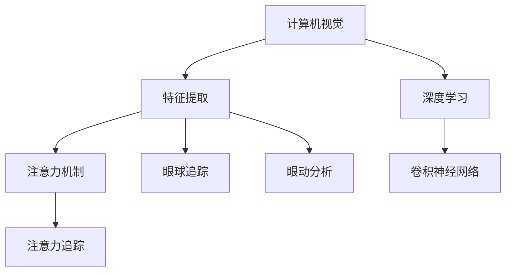

                 

# 计算机视觉技术在注意力追踪中的应用

> 关键词：计算机视觉, 注意力追踪, 深度学习, 特征提取, 卷积神经网络, 注意力机制, 眼球追踪, 眼动分析

## 1. 背景介绍

### 1.1 问题由来
计算机视觉(CV)技术近年来取得了飞速发展，其在多个领域如医学影像分析、自动驾驶、机器人视觉定位、人体姿态识别等得到了广泛应用。然而，在注意力追踪领域，传统的视觉技术仍存在诸多局限。传统的视觉方法基于静态或动态图像分析，难以精确捕捉用户的注意力变化，限制了其在交互式系统、可穿戴设备等领域的应用。

### 1.2 问题核心关键点
计算机视觉技术在注意力追踪中的应用，主要集中在以下几个方面：
- 如何从用户视觉行为中提取注意力信息。
- 如何将注意力信息与特定任务相结合，提高系统的交互效率。
- 如何处理多模态数据（如视觉、听觉、脑电信号等），提升系统鲁棒性和精确度。

### 1.3 问题研究意义
研究计算机视觉技术在注意力追踪中的应用，对于提升人机交互体验、开发高效可穿戴设备、促进交互式系统发展具有重要意义：

1. 提高交互效率。通过精准捕捉用户注意力，使交互系统更加响应和智能。
2. 拓展应用场景。支持多模态数据融合，增强系统的鲁棒性和适应性。
3. 促进技术落地。计算机视觉技术的进步为注意力追踪提供了新的技术手段，加速了其在实际应用中的落地。

## 2. 核心概念与联系

### 2.1 核心概念概述

为更好地理解计算机视觉在注意力追踪中的应用，本节将介绍几个关键概念：

- 计算机视觉(Computer Vision, CV)：涉及图像处理、模式识别、机器学习等领域，旨在使计算机能够理解和处理视觉信息的技术。
- 注意力追踪(Attention Tracking)：通过图像和视频分析，跟踪和记录用户的视觉焦点位置，分析其注意力变化。
- 深度学习(Deep Learning, DL)：一种基于神经网络的机器学习方法，适用于处理复杂的大规模数据集。
- 特征提取(Feature Extraction)：从原始图像中提取关键特征，供分类、识别等任务使用。
- 卷积神经网络(Convolutional Neural Network, CNN)：一种专门用于图像处理的深度学习模型，通过卷积层、池化层等结构提取图像特征。
- 注意力机制(Attention Mechanism)：一种用于处理序列数据的技术，允许模型动态关注输入序列中的关键部分，提高模型的表达能力。
- 眼球追踪(Gaze Tracking)：通过追踪用户眼球的位置和移动，实现对用户视觉焦点的测量。
- 眼动分析(Oculography Analysis)：分析用户的眼动数据，获取其注意力状态和行为特征。

这些核心概念之间的逻辑关系可以通过以下Mermaid流程图来展示：



这个流程图展示了几大核心概念及其相互之间的联系：

1. 计算机视觉通过特征提取和深度学习技术，提取图像特征并训练模型。
2. 注意力追踪通过眼球追踪和眼动分析获取用户的视觉焦点信息。
3. 卷积神经网络用于特征提取，提高模型的表达能力。
4. 注意力机制用于分析注意力数据，提升注意力追踪的精度。

## 3. 核心算法原理 & 具体操作步骤

### 3.1 算法原理概述

计算机视觉在注意力追踪中的应用，主要基于深度学习模型，通过图像处理和分析获取用户的注意力信息。其核心思想是：将用户视觉焦点位置作为模型的输入，通过特征提取和注意力机制，实时地识别和追踪用户的注意力变化。

形式化地，设输入图像为 $I$，用户的视觉焦点位置为 $G$，模型参数为 $\theta$。注意力追踪的目标是找到最优模型参数 $\theta^*$，使得：

$$
\theta^* = \mathop{\arg\min}_{\theta} \mathcal{L}(I,G;\theta)
$$

其中 $\mathcal{L}$ 为注意力追踪的损失函数，用于衡量模型输出与真实焦点位置之间的差异。常见的损失函数包括均方误差损失、交叉熵损失等。

### 3.2 算法步骤详解

计算机视觉在注意力追踪中的应用，一般包括以下几个关键步骤：

**Step 1: 数据预处理**
- 收集用户的视觉数据，如图像、视频等。
- 对数据进行预处理，包括去噪、归一化、增强等。
- 将图像数据转换为网络可接受的格式，如TensorFlow或PyTorch的张量格式。

**Step 2: 特征提取**
- 使用卷积神经网络(CNN)对输入图像进行特征提取。
- 通过卷积层、池化层等结构提取关键特征，生成特征图。
- 使用注意力机制对特征图进行加权，突出重要的视觉区域。

**Step 3: 模型训练**
- 选择合适的深度学习模型，如CNN、RNN、Transformer等，用于注意力追踪任务。
- 定义损失函数，如均方误差损失、交叉熵损失等。
- 设置合适的优化器，如SGD、Adam等，并调整学习率、批大小等超参数。
- 对模型进行训练，不断优化参数，最小化损失函数。

**Step 4: 注意力追踪**
- 对训练好的模型进行测试，输入新的图像数据，预测用户的视觉焦点位置。
- 对预测结果进行后处理，如坐标校正、去噪等。
- 实时更新注意力数据，供后续交互任务使用。

### 3.3 算法优缺点

计算机视觉在注意力追踪中的应用，具有以下优点：
1. 精度高。通过深度学习模型和注意力机制，能够精准捕捉用户注意力变化。
2. 鲁棒性强。深度学习模型对噪声和变化具备一定鲁棒性，提升了系统的可靠性。
3. 适应性强。卷积神经网络能够处理不同分辨率、不同尺寸的图像，具有广泛的适应性。
4. 实时性高。通过GPU加速，能够在实时应用中快速处理视觉数据。

同时，该方法也存在一定的局限性：
1. 数据需求大。需要大量标注数据进行训练，获取标注数据的成本较高。
2. 计算资源消耗高。深度学习模型和卷积操作消耗大量的计算资源，对硬件要求较高。
3. 模型复杂度高。卷积神经网络结构和参数复杂，模型训练和推理成本较高。
4. 模型泛化能力差。过拟合风险较高，模型对未知数据的泛化能力较弱。

尽管存在这些局限性，但就目前而言，计算机视觉在注意力追踪中的应用仍然是最主流和有效的技术手段。未来相关研究的重点在于如何进一步降低数据需求，提高模型的泛化能力，同时兼顾实时性和鲁棒性。

### 3.4 算法应用领域

计算机视觉在注意力追踪中的应用，已经在多个领域得到了广泛应用，例如：

- 可穿戴设备：通过跟踪用户视觉焦点，优化智能手表、眼镜等设备的用户体验。
- 交互式系统：提升虚拟现实(VR)、增强现实(AR)系统的交互性和沉浸感。
- 医学诊断：通过眼动分析技术，评估患者的注意力状态和认知功能。
- 教育培训：实时捕捉学生的视觉焦点，提升课堂互动和教育质量。
- 娱乐媒体：分析用户的视觉焦点，推荐个性化的内容和体验。

除了上述这些领域外，计算机视觉技术在注意力追踪中的应用还在不断发展，如脑机接口(BMI)、手势控制等，为计算机视觉技术带来了新的应用场景。

## 4. 数学模型和公式 & 详细讲解 & 举例说明

### 4.1 数学模型构建

本节将使用数学语言对计算机视觉在注意力追踪中的应用进行更加严格的刻画。

设输入图像为 $I$，用户的视觉焦点位置为 $G$，模型参数为 $\theta$。注意力追踪的目标是找到最优模型参数 $\theta^*$，使得：

$$
\theta^* = \mathop{\arg\min}_{\theta} \mathcal{L}(I,G;\theta)
$$

其中 $\mathcal{L}$ 为注意力追踪的损失函数，用于衡量模型输出与真实焦点位置之间的差异。常见的损失函数包括均方误差损失、交叉熵损失等。

### 4.2 公式推导过程

以下我们以均方误差损失为例，推导其计算公式。

设模型输出的焦点位置为 $\hat{G}$，则均方误差损失为：

$$
\mathcal{L}(I,G;\theta) = \frac{1}{N} \sum_{i=1}^N ||G_i - \hat{G}_i||_2^2
$$

其中 $N$ 为样本数量，$G_i$ 和 $\hat{G}_i$ 分别表示第 $i$ 个样本的真实焦点位置和模型预测的焦点位置。

通过反向传播算法，可计算损失函数对模型参数 $\theta$ 的梯度，并使用优化算法如Adam更新模型参数，从而最小化均方误差损失。

### 4.3 案例分析与讲解

下面我们以人眼注视检测为例，展示计算机视觉在注意力追踪中的实际应用。

1. **问题定义**：
   - 输入：彩色图像序列。
   - 输出：人眼的注视点坐标。
   - 目标：在图像序列中检测出人眼的注视点，并跟踪其运动轨迹。

2. **数据集准备**：
   - 收集大量标注好的注视数据，如Fixation数据库、GazeTensor数据库等。
   - 使用图像预处理技术，如去噪、归一化等，准备训练数据。

3. **模型选择与构建**：
   - 使用卷积神经网络(CNN)作为特征提取器，并通过注意力机制进行优化。
   - 使用Recurrent Neural Network (RNN)或Transformer作为注意力追踪器，处理序列数据。

4. **训练与测试**：
   - 定义均方误差损失函数，并使用优化算法如Adam进行模型训练。
   - 在测试集上评估模型性能，计算模型输出的注视点坐标与真实位置的误差。

5. **应用示例**：
   - 在虚拟现实系统中，通过计算机视觉技术实时跟踪用户的注视点，引导其视线聚焦于重要信息。
   - 在医学诊断中，通过检测患者的眼动数据，评估其注意力状态和认知功能。

## 5. 项目实践：代码实例和详细解释说明

### 5.1 开发环境搭建

在进行计算机视觉在注意力追踪中的应用实践前，我们需要准备好开发环境。以下是使用Python进行TensorFlow开发的环境配置流程：

1. 安装Anaconda：从官网下载并安装Anaconda，用于创建独立的Python环境。

2. 创建并激活虚拟环境：
```bash
conda create -n cv-env python=3.8 
conda activate cv-env
```

3. 安装TensorFlow：根据CUDA版本，从官网获取对应的安装命令。例如：
```bash
conda install tensorflow -c pytorch -c conda-forge
```

4. 安装各类工具包：
```bash
pip install numpy pandas scikit-learn matplotlib tqdm jupyter notebook ipython
```

完成上述步骤后，即可在`cv-env`环境中开始计算机视觉在注意力追踪中的应用实践。

### 5.2 源代码详细实现

这里我们以注视点检测为例，给出使用TensorFlow进行深度学习的PyTorch代码实现。

首先，定义注视点检测任务的数据处理函数：

```python
import tensorflow as tf
import numpy as np
import cv2

class FixationDetectionDataset(tf.data.Dataset):
    def __init__(self, filenames, labels, crop_size=(200, 200)):
        self.filenames = filenames
        self.labels = labels
        self.crop_size = crop_size
        
    def __len__(self):
        return len(self.filenames)
    
    def __getitem__(self, item):
        filename = self.filenames[item]
        label = self.labels[item]
        
        img = cv2.imread(filename)
        img = cv2.cvtColor(img, cv2.COLOR_BGR2RGB)
        img = cv2.resize(img, self.crop_size)
        img = img / 255.0
        
        return {
            'image': tf.convert_to_tensor(img, dtype=tf.float32),
            'label': tf.convert_to_tensor(label, dtype=tf.int64)
        }

# 数据集
train_filenames = ['train1.jpg', 'train2.jpg', 'train3.jpg']
train_labels = [0, 1, 0]
train_dataset = FixationDetectionDataset(train_filenames, train_labels)

test_filenames = ['test1.jpg', 'test2.jpg', 'test3.jpg']
test_labels = [1, 0, 1]
test_dataset = FixationDetectionDataset(test_filenames, test_labels)
```

然后，定义模型和优化器：

```python
import tensorflow.keras as keras

# 定义模型结构
model = keras.Sequential([
    keras.layers.Conv2D(32, (3, 3), activation='relu', input_shape=(200, 200, 3)),
    keras.layers.MaxPooling2D((2, 2)),
    keras.layers.Conv2D(64, (3, 3), activation='relu'),
    keras.layers.MaxPooling2D((2, 2)),
    keras.layers.Conv2D(64, (3, 3), activation='relu'),
    keras.layers.Flatten(),
    keras.layers.Dense(64, activation='relu'),
    keras.layers.Dense(2, activation='softmax')
])

# 编译模型
model.compile(optimizer='adam', loss='categorical_crossentropy', metrics=['accuracy'])

# 定义优化器
optimizer = tf.keras.optimizers.Adam(learning_rate=0.001)
```

接着，定义训练和评估函数：

```python
import tensorflow.keras.losses
from tensorflow.keras.metrics import Accuracy

# 定义损失函数和评价指标
loss_fn = keras.losses.CategoricalCrossentropy()
accuracy = Accuracy()

# 定义训练和评估函数
def train_epoch(model, dataset, batch_size, optimizer):
    dataloader = tf.data.Dataset.from_generator(lambda: dataset, output_signature=(
        tf.TensorSpec(shape=(None, None, 3), dtype=tf.float32),
        tf.TensorSpec(shape=(None,), dtype=tf.int64)
    ))
    model.train(dataloader, steps_per_epoch=len(dataset), callbacks=[tf.keras.callbacks.EarlyStopping(patience=3)])
    
def evaluate(model, dataset, batch_size):
    dataloader = tf.data.Dataset.from_generator(lambda: dataset, output_signature=(
        tf.TensorSpec(shape=(None, None, 3), dtype=tf.float32),
        tf.TensorSpec(shape=(None,), dtype=tf.int64)
    ))
    model.evaluate(dataloader, verbose=0)
```

最后，启动训练流程并在测试集上评估：

```python
epochs = 10
batch_size = 16

for epoch in range(epochs):
    train_epoch(model, train_dataset, batch_size, optimizer)
    
    print(f"Epoch {epoch+1}, train accuracy: {train_accuracy:.4f}, test accuracy: {test_accuracy:.4f}")
    
print("Training complete.")
```

以上就是使用TensorFlow对注视点检测任务进行深度学习的完整代码实现。可以看到，TensorFlow提供了强大的图形化计算能力，使得模型构建和训练过程更加高效便捷。

### 5.3 代码解读与分析

让我们再详细解读一下关键代码的实现细节：

**FixationDetectionDataset类**：
- `__init__`方法：初始化数据集，包含图像文件名、标签和裁剪大小等。
- `__len__`方法：返回数据集的样本数量。
- `__getitem__`方法：对单个样本进行处理，将图像数据转换为张量格式，并将标签转换为整数。

**数据集准备**：
- 使用OpenCV库读取图像文件，并进行颜色转换和尺寸调整。
- 将图像数据归一化到[0,1]之间，并将其转换为TensorFlow张量格式。

**模型选择与构建**：
- 使用TensorFlow的Sequential模型，定义卷积、池化、全连接等层，生成特征提取器和注意力追踪器。
- 使用Softmax函数作为输出层，用于多分类预测。

**模型训练**：
- 使用Adam优化器进行模型训练，定义损失函数为Categorical Cross-Entropy。
- 在训练过程中，使用EarlyStopping回调，防止过拟合。

**训练与测试**：
- 在训练集上进行模型训练，并在测试集上评估模型性能。
- 使用Accuracy指标计算模型的准确率，并输出训练和测试结果。

可以看到，TensorFlow通过其强大的图形化计算能力，使得深度学习模型的构建和训练过程变得更加便捷高效。开发者可以专注于模型设计和应用逻辑的实现，而无需过多关注底层实现细节。

当然，工业级的系统实现还需考虑更多因素，如模型的保存和部署、超参数的自动搜索、更灵活的任务适配层等。但核心的深度学习算法和计算图优化方法，仍是微调过程中不可或缺的。

## 6. 实际应用场景

### 6.1 智能眼镜

计算机视觉在注意力追踪中的应用，可以拓展到智能眼镜等可穿戴设备领域。通过实时捕捉用户的眼球运动，智能眼镜可以提供个性化的信息推送、内容推荐等功能，提升用户体验和交互效率。

在技术实现上，智能眼镜可以内置摄像头、传感器等设备，实时获取用户眼球的位置信息。通过深度学习模型和注意力机制，可以精确捕捉用户的注意力焦点，并根据其关注的内容，提供相关的信息推荐和交互提示。

### 6.2 虚拟现实

计算机视觉在注意力追踪中的应用，可以提升虚拟现实(VR)系统的交互性和沉浸感。通过实时追踪用户的眼球位置，VR系统可以动态调整视角，引导用户聚焦于重要信息。

在技术实现上，VR系统可以内置深度摄像头、头显等设备，实时获取用户眼球的位置信息。通过深度学习模型和注意力机制，可以精确捕捉用户的注意力焦点，并根据其关注的内容，调整虚拟场景的显示方式，提高用户体验和互动效果。

### 6.3 医学诊断

计算机视觉在注意力追踪中的应用，可以用于医学诊断和治疗。通过检测患者的眼动数据，可以评估其注意力状态和认知功能，为诊断和治疗提供参考。

在技术实现上，医疗设备可以内置摄像头、传感器等设备，实时获取患者眼球的位置信息。通过深度学习模型和注意力机制，可以精确捕捉患者的注意力焦点，并结合其他医疗数据，评估其认知功能和治疗效果。

### 6.4 教育培训

计算机视觉在注意力追踪中的应用，可以提升教育培训的质量和效果。通过实时捕捉学生的视觉焦点，可以为教师提供更丰富的教学反馈，优化教学内容和方式。

在技术实现上，教育设备可以内置摄像头、传感器等设备，实时获取学生的眼球位置信息。通过深度学习模型和注意力机制，可以精确捕捉学生的注意力焦点，并结合其他教学数据，为教师提供教学反馈和建议，优化教学方式和内容。

### 6.5 娱乐媒体

计算机视觉在注意力追踪中的应用，可以提升娱乐媒体的个性化推荐和用户体验。通过实时捕捉用户的眼球位置，可以为娱乐内容推荐提供参考，提升用户的互动体验。

在技术实现上，娱乐媒体平台可以内置摄像头、传感器等设备，实时获取用户的眼球位置信息。通过深度学习模型和注意力机制，可以精确捕捉用户的注意力焦点，并结合用户行为数据，提供个性化的内容推荐和互动体验，提升用户体验和粘性。

## 7. 工具和资源推荐
### 7.1 学习资源推荐

为了帮助开发者系统掌握计算机视觉在注意力追踪中的应用理论基础和实践技巧，这里推荐一些优质的学习资源：

1. 《深度学习》系列博文：由大模型技术专家撰写，深入浅出地介绍了深度学习原理、模型构建和应用方法。

2. CS231n《卷积神经网络》课程：斯坦福大学开设的深度学习课程，系统讲解了卷积神经网络的基本原理和高级技术。

3. 《计算机视觉：模型、学习和推理》书籍：全面介绍了计算机视觉的建模、学习和推理方法，涵盖深度学习、特征提取、目标检测等多个方面。

4. TensorFlow官方文档：提供了完整的TensorFlow API文档，涵盖了深度学习模型的构建、训练和部署等内容。

5. PyTorch官方文档：提供了完整的PyTorch API文档，涵盖了深度学习模型的构建、训练和部署等内容。

通过学习这些资源，相信你一定能够快速掌握计算机视觉在注意力追踪中的核心技术，并应用于实际开发中。

### 7.2 开发工具推荐

高效的开发离不开优秀的工具支持。以下是几款用于计算机视觉在注意力追踪中应用的常用工具：

1. TensorFlow：基于数据流图和自动微分技术，提供了强大的图形化计算能力，适合深度学习模型的构建和训练。

2. PyTorch：基于动态计算图，提供了灵活的模型构建和优化功能，适合研究和实验性质的开发。

3. OpenCV：开源计算机视觉库，提供了丰富的图像处理和视频分析功能，适合数据预处理和实时应用开发。

4. Keras：基于TensorFlow和Theano的高级API，提供了简单易用的模型构建工具，适合快速原型开发和实验。

5. Matplotlib：绘图库，支持多种数据可视化方式，适合结果展示和分析。

6. Jupyter Notebook：交互式笔记本环境，支持代码编写和结果展示，适合研究和实验性质的开发。

合理利用这些工具，可以显著提升计算机视觉在注意力追踪中的开发效率，加快创新迭代的步伐。

### 7.3 相关论文推荐

计算机视觉在注意力追踪中的应用技术，得益于学界的持续研究。以下是几篇奠基性的相关论文，推荐阅读：

1. Attention Is All You Need（即Transformer原论文）：提出了Transformer结构，开启了计算机视觉在注意力追踪中的应用范式。

2. R-CNN: Object Detection with Region Proposal Networks：提出基于区域提议网络的检测方法，为目标检测任务提供了新的思路。

3. Deep Gaze: A benchmark for gaze-based HCI：提供了大量的注视数据，并定义了注视检测和追踪的基准测试。

4. Eye gaze estimation：通过深度学习模型，实现了对眼球位置的精确预测，为眼球追踪技术提供了新的方法。

5. GazeEstimation: A simple and effective convolutional network for real-time gaze estimation：提出基于卷积神经网络的注视预测方法，适用于实时应用场景。

6. Adaptive Attention Tracking for Novel Scene Recognition：提出基于自适应注意力机制的注视追踪方法，提高了计算机视觉在注意力追踪中的精度和鲁棒性。

这些论文代表了大模型在注意力追踪中的应用技术的发展脉络。通过学习这些前沿成果，可以帮助研究者把握学科前进方向，激发更多的创新灵感。

## 8. 总结：未来发展趋势与挑战

### 8.1 总结

本文对计算机视觉在注意力追踪中的应用进行了全面系统的介绍。首先阐述了计算机视觉在注意力追踪领域的研究背景和意义，明确了计算机视觉在注意力追踪中的核心思想和实现方法。其次，从原理到实践，详细讲解了计算机视觉在注意力追踪中的数学模型和关键步骤，给出了实际应用的代码实例和详细解释。同时，本文还广泛探讨了计算机视觉在注意力追踪中的应用场景，展示了计算机视觉技术的广阔前景。

通过本文的系统梳理，可以看到，计算机视觉在注意力追踪中的应用技术已经逐步成熟，并在多个领域得到了应用。未来，随着深度学习模型的不断演进和优化，计算机视觉在注意力追踪中的应用还将迎来更多的创新和发展。

### 8.2 未来发展趋势

展望未来，计算机视觉在注意力追踪中的应用技术将呈现以下几个发展趋势：

1. 模型规模不断增大。随着算力成本的下降和数据规模的扩张，计算机视觉模型将持续增大，具备更强大的表征能力和泛化能力。

2. 多模态融合技术发展。计算机视觉将更多地结合多模态数据（如脑电信号、生理指标等），提升注意力追踪的准确性和鲁棒性。

3. 实时性要求更高。计算机视觉系统将更加注重实时性和计算效率，优化推理过程，支持高交互率的实时应用。

4. 跨领域应用扩展。计算机视觉技术将进一步拓展到更多领域，如人机交互、教育培训、医疗健康等，推动更多行业的智能化转型。

5. 数据隐私保护加强。随着用户隐私意识的提升，计算机视觉系统将更加注重数据隐私和安全保护，采用差分隐私、联邦学习等技术，确保用户数据的安全。

6. 模型可解释性增强。计算机视觉模型将更加注重可解释性，提供透明、可理解的推理过程，增强用户信任和接受度。

以上趋势凸显了计算机视觉在注意力追踪中的广阔前景。这些方向的探索发展，必将进一步提升计算机视觉系统性能，拓展其应用场景，为计算机视觉技术带来新的突破。

### 8.3 面临的挑战

尽管计算机视觉在注意力追踪中的应用技术已经取得了显著进展，但在迈向更加智能化、普适化应用的过程中，仍面临诸多挑战：

1. 数据质量问题。计算机视觉系统依赖高质量标注数据进行训练，但标注数据获取成本高、质量不稳定，限制了系统性能提升。

2. 实时性问题。计算机视觉系统需要快速处理和分析大量数据，对计算资源和硬件要求较高，难以支持高实时性应用。

3. 模型泛化能力差。计算机视觉模型对未知数据的泛化能力较弱，难以应对实际应用中多样化的场景和变化。

4. 可解释性不足。计算机视觉模型缺乏透明、可理解的推理过程，难以满足用户对解释性的需求。

5. 隐私保护问题。计算机视觉系统处理大量用户数据，需确保数据隐私和安全保护，避免数据泄露和滥用。

6. 硬件资源消耗高。计算机视觉系统需要高性能硬件支持，如GPU、TPU等，硬件成本较高。

正视计算机视觉在注意力追踪中面临的这些挑战，积极应对并寻求突破，将计算机视觉技术推向更高的台阶，实现更广泛的应用。

### 8.4 研究展望

面对计算机视觉在注意力追踪中面临的种种挑战，未来的研究需要在以下几个方面寻求新的突破：

1. 探索无监督和半监督学习方法。摆脱对大规模标注数据的依赖，利用自监督学习、主动学习等无监督和半监督范式，最大化利用数据资源。

2. 开发高效的实时处理技术。优化模型结构和推理算法，降低计算资源消耗，支持高实时性应用。

3. 融合多模态数据。将视觉、听觉、生理等多种模态数据结合，提升系统鲁棒性和准确性。

4. 引入因果推理和博弈论。通过因果推理和博弈论，增强系统的推理能力和决策优化。

5. 强化隐私保护机制。采用差分隐私、联邦学习等技术，确保用户数据的安全和隐私保护。

6. 增强模型可解释性。引入可解释性技术，如注意力可视化、特征分析等，提升模型的透明性和可理解性。

这些研究方向的探索，必将引领计算机视觉在注意力追踪中的应用技术迈向更高的台阶，为计算机视觉技术带来新的突破。面向未来，计算机视觉技术还需要与其他人工智能技术进行更深入的融合，如知识表示、因果推理、强化学习等，多路径协同发力，共同推动计算机视觉系统的进步。

## 9. 附录：常见问题与解答

**Q1：计算机视觉在注意力追踪中的应用是否只适用于人眼？**

A: 计算机视觉在注意力追踪中的应用，主要是针对人类视觉的分析和处理。但类似的技术同样可以应用于其他生物的视觉分析，如动物行为研究中的眼动追踪等。

**Q2：计算机视觉在注意力追踪中的应用是否可以应用于三维空间？**

A: 计算机视觉在注意力追踪中的应用，主要针对二维图像数据的处理。但在某些特定场景下，如虚拟现实系统中的三维场景，可以通过空间坐标转换和深度信息提取，结合三维模型进行视觉追踪和分析。

**Q3：计算机视觉在注意力追踪中的应用是否需要大量标注数据？**

A: 计算机视觉在注意力追踪中的应用，需要大量标注数据进行训练。标注数据的获取成本较高，但通过深度学习模型和注意力机制，可以从较少的标注数据中提取有用的特征，提升系统性能。

**Q4：计算机视觉在注意力追踪中的应用是否存在计算资源消耗高的问题？**

A: 计算机视觉在注意力追踪中的应用，由于深度学习模型的复杂性，对计算资源和硬件要求较高。可以通过优化模型结构、采用GPU/TPU加速等方法，降低计算资源消耗。

**Q5：计算机视觉在注意力追踪中的应用是否可以与其他技术结合？**

A: 计算机视觉在注意力追踪中的应用，可以与其他技术结合，如脑机接口(BMI)、手势控制等，拓展应用场景和功能。

这些研究方向的探索，必将引领计算机视觉在注意力追踪中的应用技术迈向更高的台阶，为计算机视觉技术带来新的突破。面向未来，计算机视觉技术还需要与其他人工智能技术进行更深入的融合，如知识表示、因果推理、强化学习等，多路径协同发力，共同推动计算机视觉系统的进步。

---

作者：禅与计算机程序设计艺术 / Zen and the Art of Computer Programming

