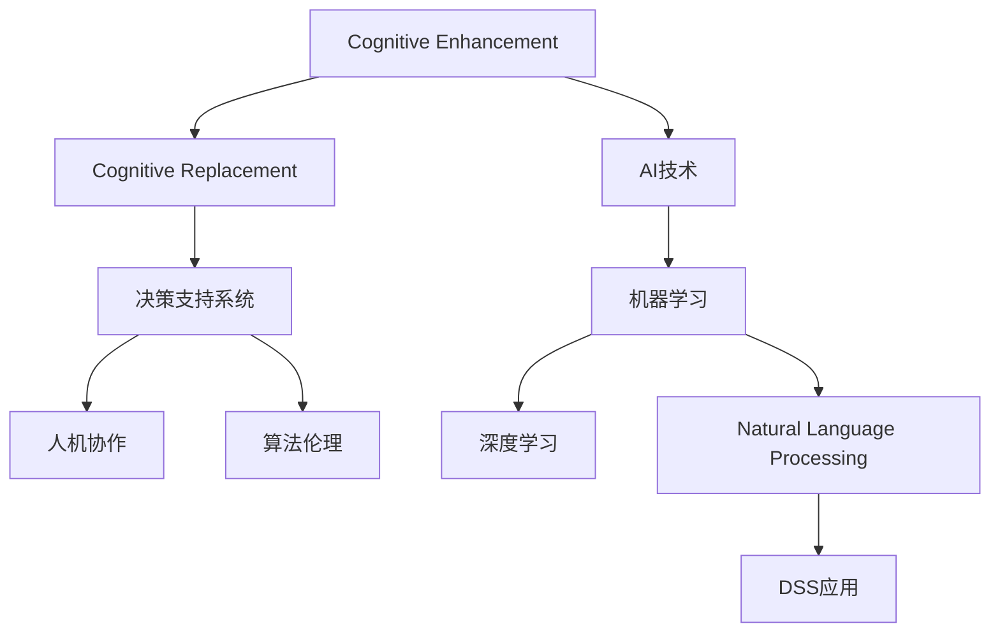

                 

# 认知增强vs认知替代：AI辅助决策的边界

> 关键词：人工智能,认知增强,认知替代,决策支持系统,人机协作,算法伦理,机器学习,深度学习,自然语言处理

## 1. 背景介绍

### 1.1 问题由来
在当今信息爆炸的时代，决策者面临的信息量和复杂性不断增加。无论是商业领袖、政策制定者还是科研人员，对于如何高效、准确地进行决策，都提出了越来越高的要求。人工智能（AI）技术的迅猛发展，尤其是深度学习、自然语言处理（NLP）等领域的突破，为决策支持系统（DSS）提供了强有力的技术支撑。

然而，与此同时，关于AI在决策过程中是增强人类认知（Cognitive Enhancement）还是替代人类认知（Cognitive Replacement）的讨论也日益激烈。决策者对于AI的信任度和接受度不同，可能导致他们在利用AI时采取不同的态度和策略。这一问题不仅关系到技术的应用，更涉及到伦理、法律和社会的方方面面。

### 1.2 问题核心关键点
在讨论AI与人类认知的交互关系时，需要关注的核心问题包括：

- **AI增强认知的程度与范围**：AI能提供多少辅助决策的信息？它能帮助决策者做出怎样的改善？
- **人机协作的边界**：AI在哪些方面可以提供帮助，在哪些方面应由人类独立决策？
- **算法伦理与决策透明性**：AI辅助决策的算法是否公正透明？决策结果能否解释和审查？
- **决策者与技术的关系**：AI如何与决策者交互？是否存在“技术幻觉”，即决策者过度依赖AI而忽视自身的直觉和经验？
- **技术普及与接受度**：如何让决策者更好地理解和接受AI技术？如何在不同组织和行业普及AI应用？

这些问题不仅仅是技术挑战，更是哲学和伦理学上的重大问题。只有回答这些问题，才能确保AI技术在决策支持系统中得到合理且负责任的使用。

### 1.3 问题研究意义
探讨AI与人类认知的关系，对于推动AI技术的发展和应用具有重要意义：

1. **优化决策过程**：通过了解AI增强认知的程度和边界，决策者可以更好地利用AI技术，提升决策的准确性和效率。
2. **建立信任基础**：通过透明和可解释的AI算法，增强决策者对AI的信任，推动AI技术的广泛应用。
3. **避免技术滥用**：通过制定伦理规范和法律框架，防止AI技术被滥用，保护人类决策的自主性和安全性。
4. **推动社会进步**：AI在决策支持中的应用，可以提升社会管理和公共服务水平，促进社会公平和进步。
5. **开拓应用场景**：通过深入研究人机协作的边界，发现更多AI辅助决策的新应用，推动AI技术的创新和产业化。

## 2. 核心概念与联系

### 2.1 核心概念概述

为更好地理解AI与人类认知交互的关系，本节将介绍几个密切相关的核心概念：

- **认知增强（Cognitive Enhancement）**：指AI技术通过提供辅助决策的信息、算法和工具，增强人类认知能力，提高决策效率和质量。
- **认知替代（Cognitive Replacement）**：指AI技术在决策过程中承担部分或全部决策任务，替代人类进行决策。
- **决策支持系统（DSS）**：利用计算机技术和AI算法，为决策者提供信息和分析支持的系统。
- **人机协作（Human-AI Collaboration）**：指在决策过程中，AI与人类互相补充、协同工作的模式。
- **算法伦理（Ethical Algorithm）**：指AI算法的设计和应用过程中，应遵循的伦理原则和道德规范。
- **机器学习（Machine Learning）**：通过数据和算法，让计算机系统具有学习能力，能够自动改进算法和决策能力。
- **深度学习（Deep Learning）**：一种特殊的机器学习技术，利用多层神经网络模拟人类神经系统的复杂结构，进行模式识别和决策。
- **自然语言处理（NLP）**：使计算机能够理解和处理人类语言的技术，是AI决策支持系统的重要组成部分。

这些核心概念之间的逻辑关系可以通过以下Mermaid流程图来展示：



这个流程图展示了大语言模型的核心概念及其之间的关系：

1. AI技术通过增强认知能力，帮助人类更好地做出决策。
2. 认知替代则表示AI可能取代部分或全部决策任务。
3. 决策支持系统利用AI技术提供决策支持。
4. 人机协作强调AI与人类在决策过程中的协同作用。
5. 算法伦理保证AI决策的公平、透明和可解释性。
6. 机器学习和深度学习是AI的核心技术基础。
7. 自然语言处理使AI能够理解和处理人类语言数据。
8. DSS应用指AI在决策支持系统中的具体应用场景。

这些概念共同构成了AI与人类认知交互的框架，揭示了人机协作的可能性和复杂性。

## 3. 核心算法原理 & 具体操作步骤
### 3.1 算法原理概述

AI在决策支持中的核心算法原理，是通过机器学习、深度学习和自然语言处理等技术，构建决策模型，分析决策数据，提供决策建议和辅助信息。其核心流程包括以下几个步骤：

1. **数据收集与预处理**：收集相关决策数据，包括历史数据、市场数据、用户反馈等，并进行清洗、归一化和标注。
2. **模型训练与优化**：利用机器学习和深度学习算法，对数据进行建模和训练，优化模型参数，提升模型预测准确性。
3. **结果生成与分析**：利用训练好的模型，对新的决策数据进行分析，生成决策建议或辅助信息。
4. **反馈与迭代**：根据决策者的反馈，调整模型参数，进行模型迭代优化，提升决策效果。

这一流程的核心在于，通过机器学习和深度学习算法，AI能够从海量数据中提取有价值的特征，构建预测模型，为决策者提供数据驱动的决策支持。

### 3.2 算法步骤详解

下面以一个简单的风险评估决策支持系统为例，详细介绍AI决策辅助的具体步骤：

**Step 1: 数据收集与预处理**

- **数据源**：从企业内部系统、市场调研报告、公共数据源等渠道收集风险数据。
- **数据预处理**：清洗数据，去除噪声和异常值，进行归一化和特征提取。
- **数据标注**：对数据进行标签标注，如风险级别、原因等。

**Step 2: 模型训练与优化**

- **选择模型**：根据任务特点，选择适当的机器学习或深度学习模型，如线性回归、决策树、随机森林、神经网络等。
- **训练模型**：利用标记数据集，对模型进行训练，使用交叉验证等方法优化模型参数。
- **模型评估**：在测试集上评估模型性能，如准确率、召回率、F1值等。
- **模型迭代**：根据评估结果，调整模型参数，进行多次迭代优化。

**Step 3: 结果生成与分析**

- **数据输入**：将新的决策数据输入模型。
- **结果输出**：模型输出预测结果，如风险评估、投资建议等。
- **结果解释**：将模型输出转换为易于理解的形式，如文字解释、图表展示等。

**Step 4: 反馈与迭代**

- **用户反馈**：收集决策者的反馈，了解模型预测与实际结果的差异。
- **模型调整**：根据反馈，调整模型参数，进行模型迭代优化。
- **决策优化**：通过多次迭代，提升模型的决策效果。

### 3.3 算法优缺点

AI在决策支持系统中的应用，具有以下优点：

1. **高效性**：AI能够在短时间内处理大量数据，提供实时的决策支持。
2. **准确性**：通过深度学习和机器学习算法，AI能够从数据中提取有价值的特征，提高预测准确性。
3. **可扩展性**：AI模型可以根据新数据进行迭代优化，适应不同的决策场景。
4. **客观性**：AI模型基于数据和算法，不受人类主观情感和偏见的影响。

然而，AI在决策支持中也存在一些缺点：

1. **数据依赖**：AI模型的性能高度依赖于数据的质量和数量，数据不足或数据偏差可能导致模型失效。
2. **透明度不足**：部分AI模型的决策过程和预测依据难以解释，缺乏透明性。
3. **缺乏创造性**：AI模型基于已有数据进行预测，难以进行创新和突破性决策。
4. **算法伦理风险**：AI模型可能存在偏见，导致不公平的决策结果。

### 3.4 算法应用领域

AI辅助决策的应用领域非常广泛，涉及金融、医疗、制造、公共服务等多个行业。以下是几个典型的应用场景：

- **金融投资**：利用AI进行风险评估、市场预测和投资建议，帮助投资者做出更理性的决策。
- **医疗诊断**：利用AI进行疾病诊断、治疗方案推荐和患者风险评估，提高医疗服务的质量和效率。
- **制造业**：利用AI进行供应链优化、设备维护和生产调度，提升生产效率和质量。
- **公共服务**：利用AI进行城市交通管理、环境监测和社会安全管理，提升公共服务水平。
- **客户服务**：利用AI进行智能客服、个性化推荐和用户反馈分析，提升客户体验和满意度。

这些应用场景展示了AI在决策支持系统中的广泛应用，体现了AI技术在提升决策质量和效率方面的巨大潜力。

## 4. 数学模型和公式 & 详细讲解  
### 4.1 数学模型构建

本节将使用数学语言对AI辅助决策的数学模型进行更加严格的刻画。

假设决策问题为预测事件$y$的概率$p(y|x)$，其中$x$为输入数据，$y$为事件结果。AI辅助决策的目标是构建一个预测模型$f(x)$，使得$p(y|x) \approx f(x)$。

### 4.2 公式推导过程

以线性回归模型为例，推导其预测公式及其梯度计算过程。

假设线性回归模型的预测公式为：
$$
f(x) = \theta_0 + \theta_1 x_1 + \theta_2 x_2 + \cdots + \theta_n x_n
$$

其中，$\theta_0,\theta_1,\theta_2,\cdots,\theta_n$为模型参数。模型的损失函数为均方误差损失（MSE）：
$$
L(\theta) = \frac{1}{2N} \sum_{i=1}^N (y_i - f(x_i))^2
$$

目标是最小化损失函数，即求解最优参数：
$$
\theta^* = \mathop{\arg\min}_{\theta} L(\theta)
$$

利用梯度下降法，求取参数$\theta$的更新公式：
$$
\theta \leftarrow \theta - \eta \nabla_{\theta} L(\theta)
$$

其中，$\eta$为学习率，$\nabla_{\theta} L(\theta)$为损失函数对参数$\theta$的梯度，可通过反向传播算法高效计算。

### 4.3 案例分析与讲解

以金融风险评估为例，解释线性回归模型的应用。

假设有一个贷款申请数据集，包括申请人的收入、年龄、婚姻状况等特征，以及是否违约的标签。通过线性回归模型，可以预测一个新贷款申请的违约概率。模型训练步骤如下：

1. 收集历史贷款数据，包括特征和标签，并进行预处理和标注。
2. 选择线性回归模型作为预测模型，利用训练集对模型进行训练，得到模型参数$\theta^*$。
3. 对于新的贷款申请数据，输入模型进行预测，输出违约概率$p(y|x)$。
4. 根据模型输出和实际结果，评估模型性能，并根据反馈调整模型参数，进行迭代优化。

通过这个过程，AI能够提供基于数据的决策支持，帮助金融机构评估贷款风险，做出更合理的决策。

## 5. 项目实践：代码实例和详细解释说明
### 5.1 开发环境搭建

在进行AI决策支持系统的开发前，我们需要准备好开发环境。以下是使用Python进行TensorFlow开发的Python环境配置流程：

1. 安装Anaconda：从官网下载并安装Anaconda，用于创建独立的Python环境。

2. 创建并激活虚拟环境：
```bash
conda create -n tf-env python=3.8 
conda activate tf-env
```

3. 安装TensorFlow：根据CUDA版本，从官网获取对应的安装命令。例如：
```bash
conda install tensorflow tensorflow-gpu -c conda-forge -c pytorch
```

4. 安装TensorBoard：
```bash
pip install tensorboard
```

5. 安装各类工具包：
```bash
pip install numpy pandas scikit-learn matplotlib tqdm jupyter notebook ipython
```

完成上述步骤后，即可在`tf-env`环境中开始项目实践。

### 5.2 源代码详细实现

下面我们以金融风险评估为例，给出使用TensorFlow对线性回归模型进行训练和预测的代码实现。

首先，定义模型和优化器：

```python
import tensorflow as tf
from tensorflow.keras.models import Sequential
from tensorflow.keras.layers import Dense

model = Sequential([
    Dense(64, activation='relu', input_shape=[n_features]),
    Dense(1)
])

optimizer = tf.keras.optimizers.Adam()
```

然后，定义训练和评估函数：

```python
from tensorflow.keras.losses import MeanSquaredError
from sklearn.metrics import mean_squared_error

device = tf.device('/cpu:0') if tf.test.is_gpu_available() else tf.device('/cpu:0')
model.to(device)

def train_epoch(model, dataset, batch_size, optimizer):
    dataloader = tf.data.Dataset.from_tensor_slices((dataset.data, dataset.target))
    dataloader = dataloader.shuffle(buffer_size=10000).batch(batch_size).prefetch(tf.data.AUTOTUNE)
    model.train()
    epoch_loss = 0
    for batch in dataloader:
        x, y = batch
        with tf.GradientTape() as tape:
            y_pred = model(x)
            loss = MeanSquaredError()(y_pred, y)
        gradients = tape.gradient(loss, model.trainable_variables)
        optimizer.apply_gradients(zip(gradients, model.trainable_variables))
        epoch_loss += loss
    return epoch_loss / len(dataloader)

def evaluate(model, dataset, batch_size):
    dataloader = tf.data.Dataset.from_tensor_slices((dataset.data, dataset.target))
    dataloader = dataloader.batch(batch_size).prefetch(tf.data.AUTOTUNE)
    model.eval()
    loss = 0
    for batch in dataloader:
        x, y = batch
        y_pred = model(x)
        loss += MeanSquaredError()(y_pred, y)
    return loss / len(dataset)
```

接着，启动训练流程并在测试集上评估：

```python
epochs = 10
batch_size = 64

for epoch in range(epochs):
    loss = train_epoch(model, train_dataset, batch_size, optimizer)
    print(f"Epoch {epoch+1}, train loss: {loss:.3f}")
    
    print(f"Epoch {epoch+1}, test loss: {evaluate(model, test_dataset, batch_size)}")
    
print("Test loss:", evaluate(model, test_dataset, batch_size))
```

以上就是使用TensorFlow进行线性回归模型训练和预测的完整代码实现。可以看到，利用TensorFlow的高层API，我们可以用相对简洁的代码完成模型的构建和训练。

### 5.3 代码解读与分析

让我们再详细解读一下关键代码的实现细节：

**Sequential模型**：
- `Dense`层：定义了全连接神经网络的每一层，包括输入层和输出层。

**优化器**：
- `Adam`：一种自适应学习率优化器，能够根据梯度动态调整学习率，加速模型收敛。

**训练和评估函数**：
- `train_epoch`：定义了训练函数，包括前向传播、反向传播和梯度更新。
- `evaluate`：定义了评估函数，用于计算模型在测试集上的性能指标。

**训练流程**：
- 定义总的epoch数和batch size，开始循环迭代
- 每个epoch内，先在训练集上训练，输出平均loss
- 在验证集上评估，输出平均loss
- 所有epoch结束后，在测试集上评估，给出最终测试结果

可以看到，TensorFlow的高层API使得模型构建和训练过程非常直观和易用。开发者可以将更多精力放在数据处理、模型改进等高层逻辑上，而不必过多关注底层的实现细节。

## 6. 实际应用场景
### 6.1 金融风险评估

金融风险评估是AI辅助决策的重要应用之一。传统的金融风险评估依赖于人工分析和经验，容易出现主观偏见和遗漏。通过AI辅助，金融决策者可以更高效、更客观地进行风险评估。

具体而言，可以收集金融市场的历史数据、交易记录、新闻报道等，构建一个线性回归模型，用于预测贷款违约概率、股票价格波动等。模型训练时，可以利用已标注的历史数据进行监督学习，优化模型参数。训练好的模型可以输入新的数据进行预测，生成决策建议。

### 6.2 医疗疾病诊断

在医疗领域，AI辅助诊断已经得到了广泛应用。AI通过分析病人的症状、历史数据和遗传信息，可以提供初步的疾病诊断和风险评估。

例如，利用深度学习模型，可以从病人的影像数据（如X光片、CT片等）中识别出病变区域，并给出相应的诊断建议。模型的训练数据包括已标注的影像数据和对应的疾病标签，通过监督学习优化模型参数。训练好的模型可以输入新的影像数据进行预测，生成诊断结果。

### 6.3 智能客服系统

智能客服系统是AI在客户服务领域的重要应用。通过AI辅助，客服系统能够更高效、更准确地解答客户问题，提高客户满意度。

具体而言，可以收集客户的历史咨询记录和反馈信息，构建一个自然语言处理模型，用于理解和生成自然语言文本。模型训练时，可以利用已标注的历史数据进行监督学习，优化模型参数。训练好的模型可以输入客户的新咨询问题，生成相应的回答或建议。

### 6.4 未来应用展望

随着AI技术的发展，未来AI在决策支持系统中的应用将更加广泛和深入。以下是几个可能的应用场景：

- **智能制造**：利用AI进行生产调度和质量控制，提高制造业的自动化和智能化水平。
- **智能交通**：利用AI进行交通流量预测和优化，提高交通管理和安全水平。
- **智能安防**：利用AI进行行为分析和异常检测，提高公共安全水平。
- **智能家居**：利用AI进行智能家电控制和环境监测，提升生活质量。

这些应用场景展示了AI在决策支持系统中的广阔前景，体现了AI技术在提升各行各业决策质量和效率方面的巨大潜力。

## 7. 工具和资源推荐
### 7.1 学习资源推荐

为了帮助开发者系统掌握AI辅助决策的理论基础和实践技巧，这里推荐一些优质的学习资源：

1. 《深度学习》系列博文：由深度学习专家撰写，深入浅出地介绍了深度学习、机器学习等基础概念和前沿话题。

2. 《机器学习实战》书籍：结合实战案例，详细讲解了机器学习算法的实现和应用。

3. TensorFlow官方文档：TensorFlow的官方文档，提供了丰富的API和样例代码，是AI项目开发的必备资料。

4. PyTorch官方文档：PyTorch的官方文档，提供了丰富的API和样例代码，是深度学习项目开发的必备资料。

5. Kaggle：数据科学和机器学习的竞赛平台，提供了大量的数据集和比赛项目，供开发者学习和实践。

通过对这些资源的学习实践，相信你一定能够快速掌握AI辅助决策的精髓，并用于解决实际的决策问题。
###  7.2 开发工具推荐

高效的开发离不开优秀的工具支持。以下是几款用于AI辅助决策开发的常用工具：

1. TensorFlow：由Google主导开发的深度学习框架，功能强大，支持多种模型架构和应用场景。

2. PyTorch：Facebook开发的深度学习框架，灵活易用，支持动态计算图和分布式训练。

3. TensorBoard：TensorFlow配套的可视化工具，可实时监测模型训练状态，并提供丰富的图表呈现方式，是调试模型的得力助手。

4. Weights & Biases：模型训练的实验跟踪工具，可以记录和可视化模型训练过程中的各项指标，方便对比和调优。

5. Scikit-learn：机器学习库，提供了丰富的算法和工具，适合快速原型开发和模型评估。

6. Jupyter Notebook：开源的交互式编程环境，支持多种编程语言和库，适合研究和分享笔记。

合理利用这些工具，可以显著提升AI辅助决策任务的开发效率，加快创新迭代的步伐。

### 7.3 相关论文推荐

AI辅助决策技术的发展源于学界的持续研究。以下是几篇奠基性的相关论文，推荐阅读：

1. Deep Residual Learning for Image Recognition（ResNet论文）：提出了深度残差网络结构，解决了深层神经网络训练中的梯度消失问题。

2. AlphaGo Zero：利用强化学习和深度学习，实现了在围棋中超越人类顶尖水平的目标。

3. Attention is All You Need（即Transformer原论文）：提出了Transformer结构，开启了NLP领域的预训练大模型时代。

4. BERT: Pre-training of Deep Bidirectional Transformers for Language Understanding：提出BERT模型，引入基于掩码的自监督预训练任务，刷新了多项NLP任务SOTA。

5. Adversarial Machine Learning（对抗机器学习）：研究对抗样本和对抗训练，探讨如何提高模型的鲁棒性和安全性。

这些论文代表了大语言模型辅助决策技术的发展脉络。通过学习这些前沿成果，可以帮助研究者把握学科前进方向，激发更多的创新灵感。

## 8. 总结：未来发展趋势与挑战
### 8.1 总结

本文对AI辅助决策的原理和实践进行了全面系统的介绍。首先阐述了AI在决策支持系统中的作用和意义，明确了AI增强认知的程度和边界。其次，从原理到实践，详细讲解了AI辅助决策的数学模型和关键步骤，给出了AI决策支持系统的代码实例。同时，本文还广泛探讨了AI辅助决策在金融、医疗、客服等多个行业领域的应用前景，展示了AI技术在提升决策质量和效率方面的巨大潜力。此外，本文精选了AI辅助决策技术的各类学习资源，力求为读者提供全方位的技术指引。

通过本文的系统梳理，可以看到，AI辅助决策技术正在成为决策支持系统的重要范式，极大地提升决策的准确性和效率。未来，伴随AI技术的发展和应用，基于数据驱动的决策将更加普遍，智能决策支持系统将发挥越来越重要的作用。

### 8.2 未来发展趋势

展望未来，AI辅助决策技术将呈现以下几个发展趋势：

1. **数据驱动决策**：通过大数据分析和机器学习，AI将提供更加准确和全面的决策支持，提高决策的科学性和可靠性。
2. **深度学习应用**：深度学习模型的非线性拟合能力和泛化能力，将进一步提升AI在决策中的表现。
3. **多模态融合**：将文本、图像、语音等多模态数据结合，提供更全面、更丰富的决策信息。
4. **实时决策支持**：通过云平台和边缘计算，实现实时数据分析和决策支持，提高决策的及时性和灵活性。
5. **自适应决策系统**：AI系统能够根据环境和数据的变化，自适应地调整决策策略，提高决策的适应性和鲁棒性。

以上趋势凸显了AI辅助决策技术的广阔前景。这些方向的探索发展，必将进一步提升决策支持系统的性能和应用范围，为人类决策提供更加智能、可靠的技术保障。

### 8.3 面临的挑战

尽管AI辅助决策技术已经取得了瞩目成就，但在迈向更加智能化、普适化应用的过程中，仍面临诸多挑战：

1. **数据隐私和安全**：AI系统需要处理大量敏感数据，如何保护数据隐私和安全，是亟待解决的问题。
2. **算法透明性**：AI模型的决策过程难以解释，缺乏透明性，可能导致决策者的不信任和抵触。
3. **技术偏见**：AI模型可能学习到数据中的偏见，导致不公平的决策结果。
4. **模型泛化能力**：AI模型在特定领域和特定场景下的表现可能不佳，如何提高模型的泛化能力，是一个重要的研究方向。
5. **人机协作问题**：AI在决策支持中的角色和地位，如何在人机协作中找到最佳平衡点，需要深入探讨。

这些挑战需要通过不断的技术创新和伦理规范的建立，才能得到有效解决。只有在这些方面取得突破，AI辅助决策技术才能真正在实际应用中发挥其潜力。

### 8.4 研究展望

面对AI辅助决策面临的诸多挑战，未来的研究需要在以下几个方面寻求新的突破：

1. **隐私保护技术**：开发隐私保护算法和机制，确保数据在处理和传输过程中的安全性。
2. **模型透明性**：研究可解释AI（XAI）技术，提供决策过程的透明性，增强决策者的信任。
3. **算法公平性**：开发公平性评估和修复技术，减少算法偏见，提升决策的公正性。
4. **跨领域应用**：研究跨领域决策模型，提升AI系统在不同场景下的泛化能力。
5. **人机协作框架**：研究人机协作理论和方法，建立AI在决策中的合理角色和责任机制。

这些研究方向将引领AI辅助决策技术迈向更高的台阶，为构建更加智能、公正、安全的决策系统铺平道路。面向未来，AI辅助决策技术需要与其他人工智能技术进行更深入的融合，如知识表示、因果推理、强化学习等，多路径协同发力，共同推动决策支持系统的进步。只有勇于创新、敢于突破，才能不断拓展AI辅助决策的边界，让人工智能技术更好地服务于人类决策。

## 9. 附录：常见问题与解答
**Q1：AI在决策支持系统中的角色是什么？**

A: AI在决策支持系统中的角色是辅助决策，即通过提供数据驱动的决策建议和信息，帮助决策者做出更准确、更快速的决策。AI不是完全替代人类决策，而是作为决策者的助手，提供参考和支持。

**Q2：如何确保AI辅助决策的公正性和透明性？**

A: 确保AI辅助决策的公正性和透明性，需要从数据采集、模型训练和模型应用三个方面进行保障：
1. 数据采集：确保数据来源广泛，覆盖不同群体和场景，避免数据偏见。
2. 模型训练：使用公平性和透明性评估指标，监控模型训练过程中的偏差和异常。
3. 模型应用：提供决策过程的可解释性，增强决策者的信任和理解。

**Q3：AI辅助决策是否会替代人类决策？**

A: AI辅助决策不会完全替代人类决策，而是通过提供决策支持和参考，帮助决策者更全面、更准确地做出决策。决策者仍然需要结合自身经验、知识和直觉，进行最终决策。

**Q4：AI辅助决策的局限性是什么？**

A: AI辅助决策的局限性主要包括以下几个方面：
1. 数据质量：AI模型的性能高度依赖于数据的质量和数量，数据不足或数据偏差可能导致模型失效。
2. 模型透明性：部分AI模型的决策过程难以解释，缺乏透明性。
3. 技术偏见：AI模型可能学习到数据中的偏见，导致不公平的决策结果。
4. 模型泛化能力：AI模型在特定领域和特定场景下的表现可能不佳，如何提高模型的泛化能力，是一个重要的研究方向。

**Q5：如何提高AI辅助决策的适应性和鲁棒性？**

A: 提高AI辅助决策的适应性和鲁棒性，需要从以下几个方面进行优化：
1. 数据多样性：确保数据覆盖不同场景和群体，避免数据偏见。
2. 模型复杂度：采用适当复杂度的模型，避免过拟合或欠拟合。
3. 模型融合：将多个模型的预测结果进行融合，提升模型的泛化能力和鲁棒性。
4. 动态调整：根据数据和环境的变化，动态调整模型的参数和策略，提高决策的适应性和鲁棒性。

通过以上措施，可以显著提升AI辅助决策系统的适应性和鲁棒性，增强其在实际应用中的表现。

---

作者：禅与计算机程序设计艺术 / Zen and the Art of Computer Programming

