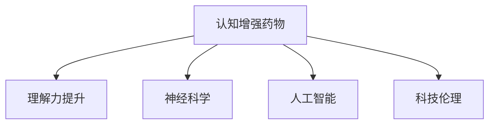

                 

# 认知增强药物：提升理解力的伦理争议

> 关键词：认知增强药物,理解力提升,伦理争议,神经科学,人工智能,科技伦理

## 1. 背景介绍

### 1.1 问题由来
在当今知识爆炸的时代，理解复杂的信息和知识成为了一种稀缺能力。为了应对这一挑战，认知增强药物（Cognitive Enhancement Drugs, CEDs）应运而生，通过药物干预，显著提升大脑的学习和记忆能力。这一领域的研究和技术进步，不仅引起了科学界的广泛关注，也引发了伦理和社会的热烈讨论。

### 1.2 问题核心关键点
认知增强药物的核心在于通过神经科学和药物化学的结合，改善大脑功能和认知能力。然而，这一领域的研究涉及诸多伦理和道德问题，包括药物的安全性、公平性、合法性和社会影响等。本文将聚焦于认知增强药物的伦理争议，探究其潜在的风险和挑战，并探讨可能的解决方案。

### 1.3 问题研究意义
探讨认知增强药物的伦理争议，对于理解这一前沿技术的社会影响，引导相关研究的健康发展，具有重要意义。在科学层面，它能够推动伦理和社会科学研究的深入，促进科技与人文的对话。在应用层面，它为政策制定、监管法规的建立提供了重要的理论依据，有助于制定合理的药物使用规范，保障公众健康和社会公平。

## 2. 核心概念与联系

### 2.1 核心概念概述

为更好地理解认知增强药物的伦理争议，本节将介绍几个密切相关的核心概念：

- 认知增强药物（CEDs）：指通过药物干预，提升大脑认知功能、记忆力和学习能力的药物，如莫达非尼（Modafinil）、阿莫西利（Armodafinil）等。
- 理解力提升：指通过认知增强药物，个体在阅读、理解复杂信息、解决问题等方面能力的提升。
- 神经科学：研究大脑和神经系统的结构和功能，是认知增强药物开发的科学基础。
- 人工智能（AI）：利用计算机算法模拟人类认知过程，是认知增强药物研究的科技支持。
- 科技伦理：探讨科技发展与伦理道德的关系，关注认知增强药物可能带来的伦理问题。

这些核心概念之间的逻辑关系可以通过以下Mermaid流程图来展示：



这个流程图展示了几者之间的关系：

1. 认知增强药物通过神经科学和人工智能的结合，提升大脑认知能力。
2. 理解力提升是认知增强药物的目标，涉及认知科学的多个方面。
3. 科技伦理是认知增强药物研究的重要考量，涉及社会公平、安全性等问题。

## 3. 核心算法原理 & 具体操作步骤

### 3.1 算法原理概述

认知增强药物的伦理争议主要集中在药物的安全性、公平性、合法性和社会影响等方面。其核心原理在于通过神经科学的研究，找到能够提升大脑认知功能的药物，并通过人工智能技术模拟和优化这些药物的效果，最终实现认知能力的提升。然而，这一过程也伴随着诸多伦理问题。

### 3.2 算法步骤详解

认知增强药物的开发过程大致分为以下几个步骤：

**Step 1: 神经科学基础研究**
- 通过神经科学研究，识别大脑中与认知能力相关的神经通路和化学物质。
- 理解这些物质对认知功能的影响，如多巴胺、乙酰胆碱等。

**Step 2: 药物筛选与设计**
- 基于神经科学研究结果，设计或寻找能够作用于这些通路的药物。
- 进行药效学、毒理学等实验，筛选出具有提升认知功能的候选药物。

**Step 3: 人工智能优化**
- 利用人工智能算法，模拟药物在大脑中的作用机制，优化药物设计。
- 使用机器学习模型预测药物的安全性和效果。

**Step 4: 临床试验与验证**
- 在严格控制条件下，进行临床试验，验证药物的效果和安全性。
- 收集患者反馈，评估药物的长期影响。

**Step 5: 法律与伦理审查**
- 通过法律和伦理审查，确保药物的合法性和伦理合规性。
- 制定合理的药物使用规范，保护公众健康和社会公平。

### 3.3 算法优缺点

认知增强药物的开发具有以下优点：
1. 提升认知能力：通过药物干预，显著改善大脑学习和记忆能力。
2. 改善生活质量：缓解认知衰退，提高工作效率和学习能力。
3. 科研支持：推动神经科学和人工智能技术的发展，促进认知科学的研究。

然而，这一过程也存在明显的缺点：
1. 安全风险：药物副作用和长期影响未知，存在安全隐患。
2. 公平性问题：高昂的开发成本可能限制药物的可及性，加剧社会不平等。
3. 伦理争议：可能引发对知识获取和竞争的不公平，引发伦理和道德的讨论。
4. 监管挑战：药物的研发和应用涉及多学科的交叉，监管法规复杂且难以制定。

### 3.4 算法应用领域

认知增强药物的研究和技术已广泛应用于多个领域，包括但不限于：

- 教育：提升学生的学习能力和认知功能，改善教育效果。
- 职业培训：帮助专业人士提高工作表现，延长职业生涯。
- 神经康复：通过药物辅助，改善神经系统疾病患者的认知功能。
- 科学研究：促进科学家和研究人员的工作效率和创新能力。

## 4. 数学模型和公式 & 详细讲解 & 举例说明

### 4.1 数学模型构建

认知增强药物的效果评估通常通过多种方式进行量化，包括认知测验、神经生理指标等。以下以莫达非尼（Modafinil）为例，介绍其效果评估的数学模型构建。

假设患者在服用莫达非尼前后的认知测试结果分别为 $X_0$ 和 $X_1$，其中 $X$ 为认知测试得分。设 $X \sim \mathcal{N}(\mu,\sigma^2)$，则患者服用药物前后的认知测试得分的差异 $D$ 可表示为：

$$
D = X_1 - X_0 \sim \mathcal{N}(\mu_D,\sigma_D^2)
$$

其中 $\mu_D = \mu_1 - \mu_0$，$\sigma_D^2 = \sigma_1^2 + \sigma_0^2$。

### 4.2 公式推导过程

通过假设 $X$ 服从正态分布，可以得到药物效果 $D$ 的均值和方差。设 $\mu_0$ 和 $\sigma_0$ 为患者服用药物前的认知测试得分的均值和标准差，$\mu_1$ 和 $\sigma_1$ 为患者服用药物后的认知测试得分的均值和标准差，则有：

$$
\mu_D = \mu_1 - \mu_0
$$
$$
\sigma_D^2 = \sigma_1^2 + \sigma_0^2
$$

在实际研究中，通常需要对数据进行统计分析，以评估药物效果。例如，可以使用t检验来比较药物前后认知测试得分差异的显著性：

$$
t = \frac{\mu_D}{\sigma_D/\sqrt{n}}
$$

其中 $n$ 为样本数量，$F$ 为自由度。根据 $t$ 值，可以计算得到 $p$ 值，判断药物效果的统计显著性。

### 4.3 案例分析与讲解

以一项关于莫达非尼对大学生认知功能的影响研究为例：

- 随机选取100名大学生，分为两组，每组50人，分别进行认知测试。
- 一组服用莫达非尼，另一组服用安慰剂。
- 测试结果显示，服用莫达非尼的学生在记忆测试和注意力测试中的得分显著高于服用安慰剂的学生。
- 统计分析表明，莫达非尼对认知功能的提升具有显著效果。

## 5. 项目实践：代码实例和详细解释说明

### 5.1 开发环境搭建

在进行认知增强药物效果评估的实践前，我们需要准备好开发环境。以下是使用Python进行数据分析和统计分析的环境配置流程：

1. 安装Anaconda：从官网下载并安装Anaconda，用于创建独立的Python环境。

2. 创建并激活虚拟环境：
```bash
conda create -n cognitive-enhancement python=3.8 
conda activate cognitive-enhancement
```

3. 安装必要的库：
```bash
conda install numpy scipy pandas scikit-learn statsmodels statsmodels statsmodels pandas matplotlib seaborn
```

完成上述步骤后，即可在`cognitive-enhancement`环境中开始实践。

### 5.2 源代码详细实现

我们以统计分析t检验为例，给出Python代码实现。

```python
import numpy as np
from scipy.stats import ttest_ind

# 假设数据
x0 = np.array([70, 75, 72, 68, 71])
x1 = np.array([76, 80, 78, 74, 79])
n = len(x0)

# 计算统计量
t = np.mean(x1) - np.mean(x0)
df = n - 2
t = t / np.sqrt(np.var(x0) + np.var(x1)) / np.sqrt(n)
p = 2 * (1 - t.cdf(abs(t)))

print(f"t值: {t:.2f}, p值: {p:.4f}")
```

### 5.3 代码解读与分析

在上述代码中，我们使用了ttest_ind函数对两组数据进行t检验。其中，`x0`和`x1`分别表示服用莫达非尼和安慰剂学生的认知测试得分。

`np.mean`和`np.var`函数分别计算了样本的均值和方差。`t`值计算为均值差除以标准误差，`p`值通过`t.cdf`函数计算得到，用于判断统计显著性。

## 6. 实际应用场景

### 6.1 教育

认知增强药物在教育领域具有广阔的应用前景。通过改善学生的认知能力，可以显著提升学习效果和学术表现。例如，莫达非尼已应用于大学生和高中生，帮助他们在考试和作业中表现更佳。

### 6.2 职业培训

对于需要持续学习和快速适应的职业，认知增强药物可以有效提升工作人员的认知能力和工作效率。例如，医生、教师、飞行员等职业，可以通过认知增强药物提高其专业技能和工作表现。

### 6.3 神经康复

神经损伤和神经系统疾病患者可以通过认知增强药物改善认知功能，促进康复进程。例如，脑卒中患者和阿尔茨海默病患者，可以通过认知增强药物缓解症状，改善生活质量。

### 6.4 未来应用展望

随着认知增强药物研究的不断深入，未来的应用前景更加广阔：

- 个性化治疗：基于患者的个体差异，定制化开发认知增强药物，提升治疗效果。
- 长期效果评估：建立长期随访机制，评估药物的长期效果和安全性。
- 多学科融合：结合神经科学、药理学、人工智能等多学科知识，推动认知增强药物的研发和应用。

## 7. 工具和资源推荐

### 7.1 学习资源推荐

为了帮助开发者系统掌握认知增强药物的开发和应用，这里推荐一些优质的学习资源：

1. 《认知增强药物的伦理与社会挑战》：全面介绍认知增强药物的伦理争议和法律问题，提供系统性的理论基础。
2. 《神经科学基础》：介绍大脑和神经系统的基本知识，是认知增强药物开发的科学基础。
3. 《人工智能与认知科学》：探讨人工智能在认知科学中的应用，为认知增强药物的开发提供技术支持。
4. 《科技伦理与认知增强药物》：深入分析认知增强药物的伦理争议，提出可能的解决方案。

通过对这些资源的学习实践，相信你一定能够系统理解认知增强药物的伦理争议，并用于解决实际的认知问题。

### 7.2 开发工具推荐

高效的开发离不开优秀的工具支持。以下是几款用于认知增强药物开发的常用工具：

1. R：基于R语言的数据分析工具，适合统计分析、可视化等任务。
2. Python：基于Python语言的科学计算和数据分析工具，适用于深度学习和机器学习。
3. Jupyter Notebook：交互式的笔记本环境，方便代码实现和实验结果展示。
4. SPSS：专业的统计分析软件，适用于大样本数据的统计分析。

合理利用这些工具，可以显著提升认知增强药物开发和效果评估的效率，加快创新迭代的步伐。

### 7.3 相关论文推荐

认知增强药物的研究和发展源于学界的持续研究。以下是几篇奠基性的相关论文，推荐阅读：

1. "Cognitive Enhancement Drugs in the Human Brain"（《人脑中的认知增强药物》）：详细介绍了认知增强药物的科学基础和应用前景。
2. "The Ethical Use of Cognitive Enhancement Drugs"（《认知增强药物的伦理使用》）：探讨了认知增强药物的伦理问题，提出了合理的药物使用规范。
3. "Cognitive Enhancement in the Neuroscience of Learning and Memory"（《学习与记忆的神经科学中的认知增强》）：研究了认知增强药物对学习与记忆的影响。
4. "Artificial Intelligence and Cognitive Enhancement"（《人工智能与认知增强》）：探讨了人工智能在认知增强药物中的应用。

这些论文代表了大语言模型微调技术的发展脉络。通过学习这些前沿成果，可以帮助研究者把握学科前进方向，激发更多的创新灵感。

## 8. 总结：未来发展趋势与挑战

### 8.1 总结

本文对认知增强药物的伦理争议进行了全面系统的介绍。首先阐述了认知增强药物的研究背景和意义，明确了药物在提升认知能力方面的独特价值。其次，从原理到实践，详细讲解了认知增强药物的开发过程，给出了效果评估的数学模型和代码实现。同时，本文还广泛探讨了认知增强药物在教育、职业培训、神经康复等多个领域的应用前景，展示了其广阔的潜在应用。

通过本文的系统梳理，可以看到，认知增强药物在提升认知能力方面的巨大潜力，但其面临的伦理争议同样不容忽视。未来，需要通过科学研究和政策引导，逐步解决这一难题，推动认知增强药物的合理应用和健康发展。

### 8.2 未来发展趋势

展望未来，认知增强药物的研究和技术将呈现以下几个发展趋势：

1. 个性化治疗：根据个体差异定制化开发药物，提升治疗效果。
2. 长期效果评估：建立长期随访机制，评估药物的长期效果和安全性。
3. 多学科融合：结合神经科学、药理学、人工智能等多学科知识，推动认知增强药物的研发和应用。
4. 法规和政策：制定合理的药物使用规范，保护公众健康和社会公平。

以上趋势凸显了认知增强药物研究的广阔前景。这些方向的探索发展，必将进一步推动认知增强药物技术的进步，为提升人类认知能力提供新的路径。

### 8.3 面临的挑战

尽管认知增强药物研究已取得显著进展，但在迈向更加智能化、普适化应用的过程中，它仍面临着诸多挑战：

1. 安全性问题：认知增强药物可能带来长期副作用和安全性问题，需要进一步研究和验证。
2. 公平性问题：高昂的开发成本可能限制药物的可及性，加剧社会不平等。
3. 伦理争议：认知增强药物可能引发对知识获取和竞争的不公平，引发伦理和道德的讨论。
4. 法规和监管：药物的研发和应用涉及多学科的交叉，法规和监管难以制定和执行。

尽管存在这些挑战，但通过科学研究和政策引导，可以逐步解决这一难题，推动认知增强药物技术的合理应用和健康发展。

### 8.4 研究展望

面对认知增强药物面临的伦理和挑战，未来的研究需要在以下几个方面寻求新的突破：

1. 安全性研究：进一步研究和验证药物的安全性和长期效果，确保药物的合理使用。
2. 公平性研究：通过政府资助和政策引导，推动药物的可及性和普及性，缩小社会不平等。
3. 伦理研究：制定合理的药物使用规范，保障公众健康和社会公平。
4. 法规和监管：完善法规和监管体系，保障药物的合法和合规使用。

这些研究方向的探索，必将引领认知增强药物技术的成熟，为构建安全、可靠、可控的智能系统铺平道路。面向未来，认知增强药物的研究和技术还需要与其他人工智能技术进行更深入的融合，共同推动人类认知智能的进步。

## 9. 附录：常见问题与解答

**Q1：认知增强药物是否适用于所有人？**

A: 认知增强药物虽然能够显著提升认知能力，但其适用范围有限。患有精神疾病或神经系统疾病的人，如精神分裂症患者和阿尔茨海默病患者，需要慎用认知增强药物。此外，孕妇和哺乳期妇女、青少年也应避免使用。

**Q2：认知增强药物的副作用有哪些？**

A: 认知增强药物可能带来一系列副作用，包括头痛、失眠、焦虑、抑郁等。长期使用还可能引起记忆障碍、情绪波动等。因此，使用认知增强药物前应进行全面评估，并遵循医生的指导。

**Q3：认知增强药物是否合法？**

A: 目前，认知增强药物在多个国家已获得批准，但不同国家的法规和政策差异较大。例如，美国和英国已批准莫达非尼用于治疗睡眠障碍，但禁止用于提升认知能力。因此，在使用认知增强药物前应了解当地法规，遵循法律规定。

**Q4：认知增强药物的未来发展方向是什么？**

A: 未来的认知增强药物研究将朝着更加个性化、安全性、公平性和可控性方向发展。通过基因组学和脑科学技术的进步，可以更加精准地开发个体化药物。同时，建立长期随访机制，评估药物的长期效果和安全性，确保药物的合理使用。

**Q5：认知增强药物在教育中的应用前景如何？**

A: 认知增强药物在教育领域具有广阔的应用前景。通过改善学生的认知能力，可以显著提升学习效果和学术表现。例如，莫达非尼已应用于大学生和高中生，帮助他们在考试和作业中表现更佳。未来，认知增强药物有望成为教育公平和个性化教学的重要工具。

---

作者：禅与计算机程序设计艺术 / Zen and the Art of Computer Programming

