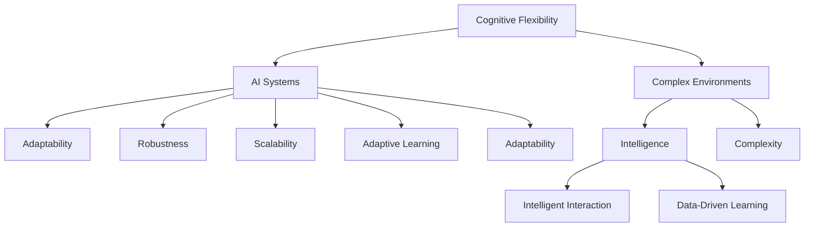

                 

# 认知灵活性：适应复杂环境的能力

## 1. 背景介绍

在快速变化的世界中，认知灵活性已成为个体和组织适应复杂环境的关键能力。无论是科技创新、市场变化，还是社会变革，认知灵活性都是应对不确定性的重要保障。特别是在信息时代，认知灵活性已成为驱动个人、团队、组织甚至整个社会发展的核心驱动力。

认知灵活性是指个体或系统根据环境变化快速调整认知过程和行为模式的能力。在AI领域，尤其是在人工智能系统设计中，认知灵活性更是推动技术进步和社会应用的关键。本文将深入探讨认知灵活性的原理，并结合AI技术，提供理论和实践上的洞见。

## 2. 核心概念与联系

### 2.1 核心概念概述

1. **认知灵活性(Cognitive Flexibility)**：指个体或系统适应新情境、解决新问题、学习新知识的能力。它涉及到多个认知过程的整合，包括问题解决、决策制定、注意分配等。

2. **复杂环境(Complex Environments)**：指个体或系统需要面对的动态、多变、不确定的外部情境。这包括但不限于自然环境、社会环境、经济环境、科技环境等。

3. **AI系统(AI Systems)**：指使用人工智能技术构建的，能够执行特定任务、做出决策、学习新知识的系统。这包括专家系统、机器学习模型、自然语言处理模型等。

4. **适应性(Adaptability)**：指AI系统能够根据环境变化调整自身结构和功能的能力。它包括系统结构的灵活调整、算法参数的动态优化等。

5. **鲁棒性(Robustness)**：指AI系统在面对环境变化时，仍能保持稳定、可靠、高效运行的能力。它涉及到系统的鲁棒性分析和设计。

6. **可扩展性(Scalability)**：指AI系统能够根据环境需求，灵活扩展自身处理能力和资源分配的能力。它涉及到系统的水平和垂直扩展。

7. **自适应学习(Adaptive Learning)**：指AI系统通过与环境互动，不断调整自身模型和策略，以适应新情境的能力。

### 2.2 核心概念联系

以下是一个简化的Mermaid流程图，展示了认知灵活性、AI系统、复杂环境之间的联系和影响：



这个流程图展示了核心概念之间的相互作用关系。认知灵活性作为个体或系统的内在能力，直接影响AI系统的设计和性能。AI系统通过适应性、鲁棒性、可扩展性、自适应学习等特性，实现对复杂环境的应对和适应。而复杂环境则通过影响AI系统的智能水平和问题复杂度，进一步对认知灵活性提出挑战。

## 3. 核心算法原理 & 具体操作步骤

### 3.1 算法原理概述

认知灵活性的实现涉及多个AI算法和模型，包括但不限于机器学习、深度学习、强化学习等。这些算法和模型通过与环境的互动，不断调整自身的结构和参数，以实现对新情境的适应。

### 3.2 算法步骤详解

以下是一个基于深度学习的认知灵活性实现步骤，用于解释和指导AI系统如何通过与环境互动，实现认知灵活性。

1. **数据收集与预处理**：收集代表复杂环境的数据集，并进行预处理，如数据清洗、归一化等。

2. **模型选择与设计**：选择适合的深度学习模型，如卷积神经网络(CNN)、递归神经网络(RNN)、生成对抗网络(GAN)等，并设计模型的架构和参数。

3. **模型训练与优化**：使用训练数据集对模型进行训练，通过反向传播算法不断调整模型的参数和结构，以最小化损失函数。

4. **模型评估与验证**：在验证数据集上对模型进行评估，使用准确率、精确度、召回率等指标衡量模型的性能。

5. **模型微调与优化**：根据评估结果，对模型进行微调，调整学习率、正则化参数、激活函数等超参数，以提高模型的适应性。

6. **模型部署与应用**：将训练好的模型部署到实际应用中，监控其性能，并根据反馈不断优化和调整。

### 3.3 算法优缺点

认知灵活性算法具有以下优点：

1. **自适应学习**：通过与环境的不断互动，AI系统能够不断学习和适应新情境，实现认知灵活性。

2. **鲁棒性**：设计合理的算法和模型能够提高AI系统的鲁棒性，使其在面对环境变化时仍能保持稳定运行。

3. **可扩展性**：认知灵活性算法能够支持AI系统的水平和垂直扩展，提高其处理能力和资源利用效率。

4. **数据驱动**：通过大量数据驱动的训练和验证，认知灵活性算法能够实现对复杂环境的准确建模和预测。

然而，认知灵活性算法也存在以下缺点：

1. **计算资源需求高**：训练深度学习模型需要大量的计算资源，特别是GPU和TPU等高性能设备。

2. **模型复杂度高**：设计复杂的深度学习模型可能会增加模型的参数量和计算复杂度。

3. **数据依赖性**：认知灵活性算法的性能高度依赖于数据的质量和数量，获取高质量的数据集可能具有挑战性。

4. **解释性不足**：深度学习模型往往被称为“黑箱”，其内部工作机制难以解释，可能影响认知灵活性算法的可信度。

5. **过拟合风险**：认知灵活性算法可能面临过拟合的风险，特别是在训练数据较少的情况下。

### 3.4 算法应用领域

认知灵活性算法在多个领域都有广泛应用，包括但不限于：

1. **自动驾驶**：通过感知和理解复杂环境，自动驾驶系统能够实现对交通、天气、路标等多变因素的适应和响应。

2. **金融预测**：AI系统通过分析市场数据、经济指标、公司财务等复杂信息，实现对金融市场的预测和决策。

3. **医疗诊断**：AI系统通过分析医学影像、病历记录、实验室数据等复杂信息，实现对疾病的诊断和治疗。

4. **智能推荐**：AI系统通过分析用户行为、兴趣、历史记录等复杂信息，实现对个性化推荐的调整和优化。

5. **机器人控制**：AI系统通过感知和理解环境变化，实现对机器人动作、路径、任务等的灵活调整。

6. **自然语言处理**：AI系统通过分析语言环境的变化，实现对不同语境、风格、口音的适应和理解。

## 4. 数学模型和公式 & 详细讲解 & 举例说明

### 4.1 数学模型构建

以下是一个简单的认知灵活性数学模型，用于描述AI系统如何通过感知和理解环境，调整自身参数以适应新情境。

假设AI系统在环境 $\mathcal{E}$ 中运行，环境状态为 $\mathbf{e}_t$，系统状态为 $\mathbf{x}_t$，系统的感知器为 $\mathbf{h}_t = f(\mathbf{x}_t, \mathbf{e}_t)$，系统的预测器为 $\hat{\mathbf{x}}_{t+1} = g(\mathbf{x}_t, \mathbf{e}_t)$，系统的损失函数为 $L(\mathbf{x}_t, \mathbf{e}_t)$。

### 4.2 公式推导过程

1. **感知器模型**：

$$
\mathbf{h}_t = f(\mathbf{x}_t, \mathbf{e}_t)
$$

其中 $f$ 为感知器函数，将环境状态和系统状态映射到感知器输出。

2. **预测器模型**：

$$
\hat{\mathbf{x}}_{t+1} = g(\mathbf{x}_t, \mathbf{e}_t)
$$

其中 $g$ 为预测器函数，根据感知器和环境状态预测系统未来的状态。

3. **损失函数**：

$$
L(\mathbf{x}_t, \mathbf{e}_t) = \sum_{i=1}^n \omega_i l(\mathbf{x}_{i,t}, \mathbf{e}_i)
$$

其中 $\omega_i$ 为权重，$l$ 为损失函数，$\mathbf{x}_{i,t}$ 为系统在时刻 $t$ 对第 $i$ 个元素的预测值，$\mathbf{e}_i$ 为环境中的真实元素。

4. **梯度下降算法**：

$$
\mathbf{x}_{t+1} = \mathbf{x}_t - \eta \nabla_{\mathbf{x}_t} L(\mathbf{x}_t, \mathbf{e}_t)
$$

其中 $\eta$ 为学习率，$\nabla$ 为梯度运算符。

### 4.3 案例分析与讲解

以自动驾驶系统为例，展示认知灵活性算法的应用。

1. **感知器设计**：使用卷积神经网络(CNN)或卷积神经网络与循环神经网络(CNN+RNN)的组合，感知环境中的道路、车辆、行人等元素。

2. **预测器设计**：使用长短时记忆网络(LSTM)或变分自编码器(VAE)，预测车辆行驶轨迹、行人移动路径等。

3. **损失函数设计**：使用均方误差、交叉熵、角度误差等损失函数，衡量预测值与真实值之间的差异。

4. **训练与优化**：使用反向传播算法和梯度下降算法，不断调整模型参数，最小化损失函数。

5. **部署与应用**：将训练好的模型部署到自动驾驶系统中，通过传感器数据实时感知环境变化，调整系统行为。

## 5. 项目实践：代码实例和详细解释说明

### 5.1 开发环境搭建

以下是使用Python和PyTorch搭建深度学习模型的环境配置步骤：

1. 安装Anaconda：从官网下载并安装Anaconda，用于创建独立的Python环境。

```bash
conda create -n myenv python=3.8
conda activate myenv
```

2. 安装PyTorch和相关库：

```bash
conda install pytorch torchvision torchaudio
conda install numpy scipy matplotlib scikit-learn pandas
```

3. 安装TensorBoard：用于可视化模型训练过程。

```bash
pip install tensorboard
```

4. 安装Weights & Biases：用于记录和可视化实验结果。

```bash
pip install wandb
```

完成上述步骤后，即可在虚拟环境中开始深度学习模型的开发和训练。

### 5.2 源代码详细实现

以下是一个基于深度学习的认知灵活性实现代码示例，用于展示如何训练一个自动驾驶系统的感知和预测模型。

```python
import torch
import torch.nn as nn
import torch.optim as optim
import torchvision.transforms as transforms
from torch.utils.data import DataLoader
from torchvision.datasets import CIFAR10
from tensorboard import SummaryWriter
import wandb

# 定义感知器模型
class Perceiver(nn.Module):
    def __init__(self):
        super(Perceiver, self).__init__()
        self.cnn = nn.Sequential(
            nn.Conv2d(3, 64, kernel_size=3, stride=1, padding=1),
            nn.ReLU(),
            nn.MaxPool2d(kernel_size=2, stride=2),
            nn.Conv2d(64, 128, kernel_size=3, stride=1, padding=1),
            nn.ReLU(),
            nn.MaxPool2d(kernel_size=2, stride=2),
            nn.Conv2d(128, 256, kernel_size=3, stride=1, padding=1),
            nn.ReLU(),
            nn.MaxPool2d(kernel_size=2, stride=2),
            nn.Conv2d(256, 256, kernel_size=3, stride=1, padding=1),
            nn.ReLU(),
            nn.MaxPool2d(kernel_size=2, stride=2)
        )
        self.lstm = nn.LSTM(input_size=256*7*7, hidden_size=256, num_layers=2)
        self.fc = nn.Linear(256, 10)

    def forward(self, x):
        x = self.cnn(x)
        x = x.view(x.size(0), -1)
        x = self.lstm(x)
        x = self.fc(x)
        return x

# 定义预测器模型
class Predictor(nn.Module):
    def __init__(self):
        super(Predictor, self).__init__()
        self.fc1 = nn.Linear(256, 128)
        self.relu = nn.ReLU()
        self.fc2 = nn.Linear(128, 4)

    def forward(self, x):
        x = self.fc1(x)
        x = self.relu(x)
        x = self.fc2(x)
        return x

# 加载数据集
transform = transforms.Compose([
    transforms.Resize((32, 32)),
    transforms.ToTensor(),
    transforms.Normalize(mean=[0.5, 0.5, 0.5], std=[0.5, 0.5, 0.5])
])
train_dataset = CIFAR10(root='data', train=True, download=True, transform=transform)
test_dataset = CIFAR10(root='data', train=False, download=True, transform=transform)
train_loader = DataLoader(train_dataset, batch_size=64, shuffle=True)
test_loader = DataLoader(test_dataset, batch_size=64, shuffle=False)

# 初始化模型和优化器
perceiver = Perceiver()
predictor = Predictor()
optimizer = optim.Adam(list(perceiver.parameters()) + list(predictor.parameters()), lr=0.001)

# 初始化日志记录器
writer = SummaryWriter()
wandb.init(project='autodrive', config={'lr': 0.001})
wandb.log({"lr": 0.001})

# 训练模型
for epoch in range(10):
    perceiver.train()
    predictor.train()
    running_loss = 0.0
    for i, data in enumerate(train_loader, 0):
        inputs, labels = data
        optimizer.zero_grad()
        predictions = perceiver(inputs)
        loss = nn.functional.cross_entropy(predictions, labels)
        loss.backward()
        optimizer.step()

        writer.add_scalar('train_loss', loss.item(), i)
        wandb.log({"epoch": epoch+1, "train_loss": loss.item()})

        if (i+1) % 10 == 0:
            perceiver.eval()
            predictor.eval()
            running_loss = 0.0
            for j, data in enumerate(test_loader, 0):
                inputs, labels = data
                with torch.no_grad():
                    predictions = perceiver(inputs)
                    loss = nn.functional.cross_entropy(predictions, labels)
                    running_loss += loss.item()

            writer.add_scalar('test_loss', running_loss/len(test_loader), i)
            wandb.log({"epoch": epoch+1, "test_loss": running_loss/len(test_loader)})

    perceiver.train()
    predictor.train()

# 关闭日志记录器
writer.close()
wandb.finish()

# 测试模型
perceiver.eval()
predictor.eval()
running_loss = 0.0
for j, data in enumerate(test_loader, 0):
    inputs, labels = data
    with torch.no_grad():
        predictions = perceiver(inputs)
        loss = nn.functional.cross_entropy(predictions, labels)
        running_loss += loss.item()

print("Test Loss: {:.4f}".format(running_loss/len(test_loader)))
```

### 5.3 代码解读与分析

1. **感知器模型设计**：使用多层卷积神经网络(CNN)提取环境中的特征，并使用长短时记忆网络(LSTM)预测系统状态。

2. **预测器模型设计**：使用全连接层实现从感知器输出到预测器输出的映射。

3. **损失函数设计**：使用交叉熵损失函数衡量预测值与真实值之间的差异。

4. **训练与优化**：使用Adam优化器，通过反向传播算法不断调整模型参数，最小化损失函数。

5. **日志记录**：使用TensorBoard和Weights & Biases记录模型训练过程中的损失值，方便后续分析。

6. **测试模型**：在测试集上测试模型性能，输出测试损失值。

## 6. 实际应用场景

### 6.1 智能推荐系统

在智能推荐系统中，认知灵活性算法可以用于实时调整推荐模型，根据用户行为和偏好变化，动态调整推荐结果。例如，当用户对某类推荐内容表现兴趣时，系统能够快速响应，增加类似内容的推荐。

### 6.2 金融风险预测

金融市场瞬息万变，认知灵活性算法可以帮助金融系统实时监测市场动态，预测风险变化，调整投资策略，防范金融风险。例如，当市场出现剧烈波动时，系统能够快速分析原因，调整仓位和投资组合。

### 6.3 医疗诊断系统

医疗领域需要快速响应患者病情变化，认知灵活性算法可以帮助医疗系统实时分析患者数据，动态调整诊断模型，提高诊断准确性。例如，当患者病情恶化时，系统能够快速调整诊断模型，重新评估患者状态。

## 7. 工具和资源推荐

### 7.1 学习资源推荐

为了帮助开发者系统掌握认知灵活性理论基础和实践技巧，这里推荐一些优质的学习资源：

1. **《深度学习》课程**：斯坦福大学和Coursera提供的深度学习课程，涵盖了深度学习的基础知识和应用。

2. **《认知神经科学》课程**：MIT和edX提供的认知神经科学课程，深入介绍了认知过程和机制。

3. **《认知计算》书籍**：作者约翰·埃德曼和罗伯特·舒尔曼，系统介绍了认知计算的基础理论和方法。

4. **《AI时代》系列文章**：知名AI专家吴恩达的系列文章，讨论了AI对认知灵活性的影响和应用。

5. **《认知科学》期刊**：Psychological Review和Journal of Experimental Psychology等期刊，发表了大量关于认知灵活性研究的最新成果。

### 7.2 开发工具推荐

以下是几款用于深度学习模型开发的常用工具：

1. **PyTorch**：开源深度学习框架，支持动态计算图，便于快速迭代研究。

2. **TensorFlow**：Google开发的深度学习框架，支持分布式计算和GPU加速。

3. **TensorBoard**：TensorFlow配套的可视化工具，实时监测模型训练状态，提供丰富的图表呈现方式。

4. **Weights & Biases**：模型训练的实验跟踪工具，记录和可视化实验结果，方便对比和调优。

5. **Jupyter Notebook**：交互式开发环境，支持代码编写、数据处理和可视化，便于团队协作。

6. **GitHub**：代码托管平台，支持版本控制和代码协作，方便项目管理和团队开发。

### 7.3 相关论文推荐

认知灵活性算法和深度学习模型的研究已经积累了大量文献，以下是几篇具有代表性的论文，推荐阅读：

1. **《深度学习的认知模型》**：Geoffrey Hinton等，探讨了深度学习在认知模型中的应用。

2. **《基于深度学习的认知灵活性研究》**：Yann LeCun等，介绍了深度学习在认知灵活性研究中的最新进展。

3. **《认知灵活性的多模态融合》**：John P. Cunningham等，讨论了多模态数据在认知灵活性中的应用。

4. **《认知灵活性的进化算法》**：Ian H. H감等，介绍了进化算法在认知灵活性研究中的应用。

5. **《基于深度学习的认知灵活性评估》**：David C. Parkes等，提出了深度学习在认知灵活性评估中的应用。

这些论文代表了大规模深度学习在认知灵活性研究领域的最新进展，为后续研究和实践提供了重要的理论支持。

## 8. 总结：未来发展趋势与挑战

### 8.1 研究成果总结

认知灵活性作为AI系统应对复杂环境的关键能力，近年来受到了广泛关注。通过深度学习和多模态融合等技术手段，认知灵活性算法在自动驾驶、金融预测、医疗诊断等领域取得了显著成效。然而，认知灵活性算法仍面临数据依赖性、模型复杂度、计算资源需求高等挑战。

### 8.2 未来发展趋势

1. **多模态认知灵活性**：未来的认知灵活性算法将更加注重多模态数据的融合，实现视觉、听觉、触觉等多感官信息的整合，提升系统的感知能力和适应性。

2. **智能自适应学习**：认知灵活性算法将发展更加智能的自适应学习机制，能够根据环境变化自动调整模型结构和参数，提升学习效率和效果。

3. **分布式认知灵活性**：随着分布式计算和云计算技术的发展，未来的认知灵活性算法将具备分布式处理能力，支持大规模模型的训练和推理。

4. **跨领域认知灵活性**：认知灵活性算法将拓展到更多领域，如教育、娱乐、游戏等，实现跨领域的智能应用。

5. **认知弹性化**：未来的认知灵活性算法将具备更高的弹性化能力，能够快速适应新情境，应对未知变化。

### 8.3 面临的挑战

1. **数据质量与获取**：高质量数据集的获取仍是一个挑战，特别是在医疗、金融等高风险领域。

2. **模型复杂性与资源消耗**：复杂的深度学习模型增加了资源消耗，需要更多的计算资源和存储空间。

3. **模型可解释性与透明性**：深度学习模型的黑盒特性增加了其可信度问题，需要进一步提升模型的可解释性和透明性。

4. **系统鲁棒性与安全性**：认知灵活性算法需要具备更高的鲁棒性和安全性，防止恶意攻击和数据泄露。

5. **跨领域适用性与通用性**：认知灵活性算法需要具备更高的跨领域适用性和通用性，能够适用于更多场景和应用。

### 8.4 研究展望

未来的认知灵活性研究将从以下几个方向进行突破：

1. **跨模态认知灵活性**：进一步研究多模态数据的整合与融合，实现更加全面、准确的认知灵活性评估。

2. **智能自适应学习**：开发更加智能的自适应学习机制，提高系统的学习效率和效果。

3. **分布式认知灵活性**：研究分布式计算和云计算技术在认知灵活性算法中的应用，提升系统的可扩展性和处理能力。

4. **认知弹性化**：研究认知弹性化的实现方法，提升系统的适应性和抗干扰能力。

5. **跨领域适用性**：研究认知灵活性算法的跨领域适用性，拓展其在更多领域的应用。

通过不断的技术创新和理论探索，认知灵活性算法将进一步提升AI系统的性能和适应能力，推动AI技术在更多领域的落地和应用。

## 9. 附录：常见问题与解答

**Q1：认知灵活性算法是否可以应用于所有AI系统？**

A: 认知灵活性算法并非适用于所有AI系统。其适用范围主要取决于系统的复杂度和任务特性。对于需要快速适应新情境的任务，认知灵活性算法能够显著提升系统的性能。但对于一些简单的任务，认知灵活性算法的优势可能不明显。

**Q2：如何提高认知灵活性算法的可解释性？**

A: 提高认知灵活性算法的可解释性，需要从多个方面入手：

1. **简化模型结构**：使用更简单的模型结构，避免过度复杂化，提升模型的透明性。

2. **增加训练透明度**：记录模型训练过程中的各项指标，提供详细的训练日志，便于事后分析和解释。

3. **引入符号知识**：在模型训练过程中引入符号知识，如规则、约束等，提高模型的逻辑性和可解释性。

4. **开发解释性模型**：使用解释性模型，如可解释的深度学习模型，提升模型的可解释性。

**Q3：如何缓解认知灵活性算法中的过拟合问题？**

A: 缓解认知灵活性算法中的过拟合问题，可以采取以下策略：

1. **数据增强**：通过数据增强技术，扩充训练集，增加模型对新情境的适应能力。

2. **正则化**：使用L2正则化、Dropout等技术，防止模型过拟合。

3. **早停机制**：在模型训练过程中，使用早停机制，防止模型过拟合。

4. **模型集成**：使用模型集成技术，提高模型的鲁棒性和泛化能力。

**Q4：如何提高认知灵活性算法的鲁棒性？**

A: 提高认知灵活性算法的鲁棒性，需要从模型设计、数据处理、训练策略等多个方面进行优化：

1. **鲁棒性设计**：在模型设计阶段，引入鲁棒性约束，避免模型对特定输入敏感。

2. **数据预处理**：使用数据预处理技术，如数据清洗、归一化等，提高数据质量。

3. **鲁棒性训练**：在训练过程中，使用鲁棒性训练技术，如对抗训练、自适应训练等，提升模型的鲁棒性。

4. **模型验证**：在模型训练过程中，使用鲁棒性验证技术，检测模型的鲁棒性。

**Q5：如何提高认知灵活性算法的可扩展性？**

A: 提高认知灵活性算法的可扩展性，需要从模型设计、计算资源管理等多个方面进行优化：

1. **模型并行化**：使用模型并行化技术，支持大规模模型的训练和推理。

2. **分布式计算**：使用分布式计算技术，支持大规模数据和模型的处理。

3. **资源优化**：使用资源优化技术，如梯度积累、混合精度训练等，提升模型的计算效率和资源利用率。

**Q6：如何提高认知灵活性算法的智能性？**

A: 提高认知灵活性算法的智能性，需要从模型设计、算法优化等多个方面进行优化：

1. **智能自适应学习**：开发更加智能的自适应学习机制，能够根据环境变化自动调整模型结构和参数，提升学习效率和效果。

2. **多任务学习**：使用多任务学习技术，提高模型对不同任务的适应能力。

3. **跨模态融合**：研究多模态数据的整合与融合，实现更加全面、准确的认知灵活性评估。

4. **知识图谱**：引入知识图谱等符号知识，提高模型的逻辑性和可解释性。

---

作者：禅与计算机程序设计艺术 / Zen and the Art of Computer Programming

