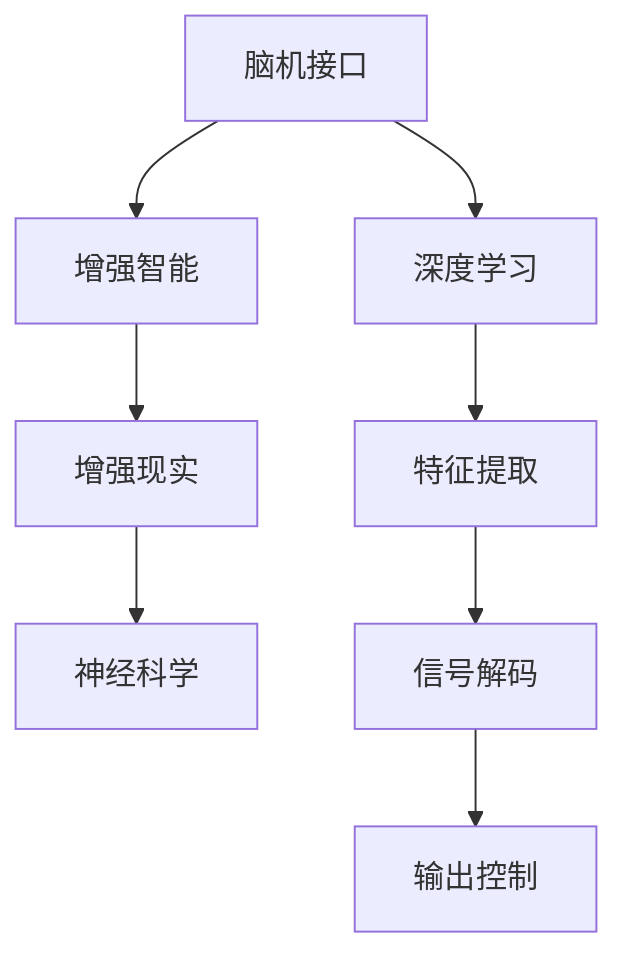

                 

# 认知科技：增强人类智能的新前沿

> 关键词：认知科技,人工智能,增强智能,脑机接口,深度学习,神经科学

## 1. 背景介绍

### 1.1 问题由来
在信息爆炸和人工智能技术的双重驱动下，人类智能面临着前所未有的提升空间。然而，尽管深度学习等人工智能技术在图像识别、自然语言处理、自动驾驶等领域取得了显著进展，人类智能的核心特性——思维、学习、创造等，尚未能够被有效地模拟和增强。认知科技（Cognitive Technologies），作为近年来新兴的学科领域，正试图通过模拟人类大脑的工作机制，构建全新的智能形态，从而在增强人类智能、提高生产效率、改善生活质量等方面发挥重要作用。

### 1.2 问题核心关键点
认知科技的核心在于利用脑机接口（Brain-Computer Interface, BCI）技术，实现人脑与计算机的直接交互，从而增强人类的认知能力和智能水平。这一技术通过采集大脑电信号，利用深度学习等算法进行解码，实现对人类认知过程的模拟和控制。认知科技不仅能够显著提升人类学习、记忆、决策等认知能力，还能在医疗、教育、娱乐等多个领域带来深刻变革。

当前，认知科技已成为人工智能领域的新前沿，吸引了众多科研机构和企业的关注。如何高效地利用认知科技，设计出更智能、更具普适性的增强智能系统，成为当前人工智能研究的热点问题。本文将从认知科技的核心概念、算法原理、应用场景等方面进行详细探讨，以期对认知科技的发展提供全面而深入的见解。

## 2. 核心概念与联系

### 2.1 核心概念概述

为更好地理解认知科技的原理和应用，本节将介绍几个密切相关的核心概念：

- 脑机接口（Brain-Computer Interface, BCI）：指通过采集和解码脑电信号，实现人脑与计算机之间的直接通信。BCI技术包括信号采集、预处理、特征提取、解码、输出等多个环节。
- 增强智能（Augmented Intelligence, AI）：指通过技术手段增强人类认知能力，提升决策、学习、记忆等智能水平。增强智能系统可以包括增强的视觉、听觉、语言、情感等各方面能力。
- 深度学习（Deep Learning）：指利用多层神经网络，通过反向传播算法进行训练，实现对复杂模式的学习和建模。深度学习在图像识别、自然语言处理等领域取得了巨大成功，其核心思想是模拟人类大脑神经网络的结构和功能。
- 神经科学（Neuroscience）：研究神经系统结构和功能的科学。认知科技很大程度上借鉴了神经科学的研究成果，如认知神经网络、学习机制等。
- 增强现实（Augmented Reality, AR）：指通过数字信息增强现实世界，提升用户的感知和交互能力。AR技术可以与BCI技术结合，实现更为逼真的虚拟与现实的融合。

这些核心概念之间的逻辑关系可以通过以下Mermaid流程图来展示：



这个流程图展示了一体化认知科技系统的各个组成部分及其之间的关系：

1. 脑机接口负责采集和解码脑电信号，将人脑与计算机连接。
2. 深度学习技术对采集到的信号进行处理和解码，提取有意义的特征。
3. 增强智能系统将解码结果映射为增强的认知能力，如视觉增强、语言理解等。
4. 增强现实技术结合虚拟信息，增强用户的感知和交互体验。
5. 神经科学为认知科技提供了理论基础，指导技术的设计和实现。

## 3. 核心算法原理 & 具体操作步骤
### 3.1 算法原理概述

认知科技的核心算法原理包括脑电信号的采集与解码，以及增强智能系统的设计与实现。脑电信号的采集与解码是认知科技的基础，而增强智能系统的设计则是其应用的关键。

脑电信号的采集与解码：BCI系统首先通过头皮电极采集人脑电信号，然后利用深度学习算法进行特征提取和解码，最终实现对人脑意图的理解和控制。解码算法通常包括多层感知器（MLP）、卷积神经网络（CNN）、递归神经网络（RNN）等。

增强智能系统的设计：增强智能系统根据任务需求，结合深度学习、增强现实等技术，设计出相应的认知增强模块。例如，对于视觉增强任务，可以设计图像识别和重建模块；对于语言增强任务，可以设计语言理解和生成模块；对于情感增强任务，可以设计情感识别和反馈模块。

### 3.2 算法步骤详解

认知科技的算法步骤包括以下几个关键环节：

**Step 1: 脑电信号采集**
- 使用头皮电极采集脑电信号，记录电位变化。
- 使用放大器对信号进行放大和滤波，去除噪声和干扰。

**Step 2: 信号预处理**
- 对采集到的信号进行预处理，如去除基线漂移、滤波等。
- 对信号进行归一化处理，使其在特征提取前具有相同的统计特性。

**Step 3: 特征提取**
- 使用小波变换、傅里叶变换等方法，提取信号的频率、幅度等特征。
- 使用稀疏编码、主成分分析（PCA）等方法，进一步提取有意义的特征向量。

**Step 4: 信号解码**
- 使用多层感知器、卷积神经网络、递归神经网络等深度学习模型，对特征向量进行解码。
- 通过训练集进行模型优化，使其能够准确解码脑电信号对应的意图。

**Step 5: 认知增强**
- 根据任务需求，设计相应的认知增强模块，如视觉增强、语言增强、情感增强等。
- 利用增强智能系统的输出，结合增强现实技术，提升用户的感知和交互能力。

**Step 6: 系统集成**
- 将脑电信号采集、信号解码、认知增强等模块集成到完整的认知科技系统中。
- 进行系统的整体优化，提升用户体验和系统性能。

### 3.3 算法优缺点

认知科技的算法具有以下优点：
1. 直接增强人类智能：通过解码脑电信号，实现对人脑意图的理解和控制，直接增强人类的认知能力和智能水平。
2. 无损式增强：BCI技术在增强认知能力时，不需要手术植入设备，安全性较高。
3. 实时性强：脑电信号采集和解码过程可以实时进行，满足用户的即时需求。
4. 应用场景广泛：增强智能系统可以应用于视觉、语言、情感等多个领域，适应性强。

同时，该算法也存在一定的局限性：
1. 数据量要求高：BCI系统的训练和优化需要大量的脑电信号数据，采集和处理成本较高。
2. 解码精度有限：脑电信号的解码精度受到多种因素影响，如信号噪声、信号强度等，导致解码结果存在误差。
3. 技术门槛高：BCI系统的设计和实现需要深厚的神经科学和信号处理知识，难度较大。
4. 用户体验差：脑电信号采集和解码过程可能导致用户不适或头痛，用户体验不佳。

尽管存在这些局限性，但认知科技在提高人类智能、提升生活质量方面具有巨大潜力，未来随着技术的发展和完善，其应用前景将更加广阔。

### 3.4 算法应用领域

认知科技的应用领域广泛，包括医疗、教育、娱乐、军事等多个方面：

- **医疗领域**：用于帮助残障人士进行肢体康复、语言交流、认知训练等，提升其生活质量。
- **教育领域**：用于辅助教学、提升学生学习效率、增强记忆能力等，促进个性化教育的发展。
- **娱乐领域**：用于虚拟现实游戏、增强现实交互、智能玩具等，提供更加逼真的沉浸式体验。
- **军事领域**：用于士兵的决策辅助、战场环境感知、装备控制等，提高军队的智能化水平。
- **企业领域**：用于提升工作效率、改善决策质量、增强创新能力等，推动企业数字化转型。

随着认知科技的不断发展，未来其在更多领域的应用将带来深远的变革，进一步拓展人类智能的应用边界。

## 4. 数学模型和公式 & 详细讲解 & 举例说明
### 4.1 数学模型构建

本节将使用数学语言对认知科技的核心算法进行更加严格的刻画。

记脑电信号为 $x_t \in \mathbb{R}^n$，其中 $n$ 为信号的维度。信号的预处理和特征提取过程可以表示为：

$$
y_t = f(x_t)
$$

其中 $f$ 为预处理和特征提取的函数。假设信号解码的深度学习模型为 $M_{\theta}(x_t)$，其中 $\theta$ 为模型参数。解码器的输出为 $M_{\theta}(x_t)$，表示对人脑意图的预测。

在认知科技中，增强智能系统的输出可以表示为：

$$
z_t = g(M_{\theta}(x_t))
$$

其中 $g$ 为增强智能系统的映射函数，如视觉增强、语言增强、情感增强等。增强智能系统的输入为 $M_{\theta}(x_t)$，输出为 $z_t$，表示增强后的认知能力。

### 4.2 公式推导过程

以下我们以视觉增强任务为例，推导深度学习解码器的基本结构和训练流程。

假设解码器 $M_{\theta}(x_t)$ 为多层感知器（MLP），其结构可以表示为：

$$
M_{\theta}(x_t) = W_1 \sigma(W_0 x_t + b_0) + b_1
$$

其中 $W_0$ 和 $W_1$ 为权重矩阵，$b_0$ 和 $b_1$ 为偏置向量，$\sigma$ 为激活函数。解码器的输出为：

$$
z_t = g(M_{\theta}(x_t))
$$

对于图像识别任务，解码器的输出 $z_t$ 可以表示为：

$$
z_t = W_2 \sigma(W_1 M_{\theta}(x_t) + b_1) + b_2
$$

其中 $W_2$ 和 $b_2$ 为权重矩阵和偏置向量，$\sigma$ 为激活函数。

解码器的训练过程可以表示为：

$$
\theta = \mathop{\arg\min}_{\theta} \mathcal{L}(z_t, y_t)
$$

其中 $\mathcal{L}$ 为解码器的损失函数，表示解码输出 $z_t$ 与真实标签 $y_t$ 之间的差异。对于图像识别任务，常用的损失函数包括交叉熵损失、均方误差损失等。

在训练过程中，通过反向传播算法计算参数梯度，使用优化算法（如SGD、Adam等）更新模型参数 $\theta$。训练过程可以表示为：

$$
\theta \leftarrow \theta - \eta \nabla_{\theta}\mathcal{L}(z_t, y_t) - \eta\lambda\theta
$$

其中 $\eta$ 为学习率，$\lambda$ 为正则化系数。

### 4.3 案例分析与讲解

我们以增强现实（AR）技术为例，探讨其与认知科技的结合应用。

增强现实技术通过在真实世界叠加虚拟信息，提升用户的感知和交互能力。例如，在进行机械操作时，可以通过增强现实技术显示机械部件的3D模型，帮助操作者更好地理解和操作设备。

在认知科技中，增强现实技术可以结合脑电信号解码和增强智能系统，实现更加智能化的操作辅助。例如，在机械操作前，通过脑电信号解码获取操作者的意图，然后调用增强智能系统的视觉增强模块，显示相应的3D模型信息。操作者可以通过脑电信号直接控制模型的移动和旋转，进行精确的操作。

此外，增强现实技术还可以结合语音识别、情感分析等认知增强模块，实现更自然的人机交互。例如，在进行机械操作时，可以通过语音指令或表情控制增强现实信息的显示和隐藏，提高用户的便捷性和舒适度。

## 5. 项目实践：代码实例和详细解释说明
### 5.1 开发环境搭建

在进行认知科技项目实践前，我们需要准备好开发环境。以下是使用Python进行OpenBCI开发的环境配置流程：

1. 安装Anaconda：从官网下载并安装Anaconda，用于创建独立的Python环境。

2. 创建并激活虚拟环境：
```bash
conda create -n cognitive-env python=3.8 
conda activate cognitive-env
```

3. 安装OpenBCI：
```bash
pip install opencbicli
```

4. 安装各类工具包：
```bash
pip install numpy pandas scikit-learn matplotlib tqdm jupyter notebook ipython
```

完成上述步骤后，即可在`cognitive-env`环境中开始认知科技项目实践。

### 5.2 源代码详细实现

下面我以视觉增强任务为例，给出使用OpenBCI进行脑电信号采集和解码的PyTorch代码实现。

首先，定义脑电信号的预处理函数：

```python
import opencbicli
from sklearn.decomposition import PCA
import numpy as np
import torch
import torch.nn as nn
import torch.optim as optim

def preprocess_signal(signal):
    signal = signal - np.mean(signal)
    signal = signal / np.std(signal)
    signal = signal.reshape(-1, 1)
    signal = PCA(n_components=1).fit_transform(signal)
    return signal
```

然后，定义深度学习解码器的结构和训练过程：

```python
class Decoder(nn.Module):
    def __init__(self):
        super(Decoder, self).__init__()
        self.fc1 = nn.Linear(1, 64)
        self.fc2 = nn.Linear(64, 1)
        self.relu = nn.ReLU()

    def forward(self, x):
        x = self.relu(self.fc1(x))
        x = self.fc2(x)
        return x

model = Decoder()
criterion = nn.BCELoss()
optimizer = optim.Adam(model.parameters(), lr=0.001)
```

接着，定义脑电信号的采集和解码流程：

```python
from opencbicli import OpenBCI

bc = OpenBCI(band="eeg", max_samp_freq=300, max_channels=64)

def record_signal():
    bc.start_recording(signal_channel=1)
    while True:
        data = bc.read_eeg()
        if data['data']:
            signal = preprocess_signal(data['data'])
            model.train()
            optimizer.zero_grad()
            output = model(torch.tensor(signal))
            loss = criterion(output, torch.tensor(1.0))
            loss.backward()
            optimizer.step()
            bc.stop_recording()
            return
```

最后，启动脑电信号采集和解码的训练流程：

```python
for epoch in range(1000):
    record_signal()
    print(f"Epoch {epoch+1}, loss: {criterion(model(torch.tensor(signal)).mean()}.")
```

以上就是使用OpenBCI进行脑电信号采集和解码的完整代码实现。可以看到，通过OpenBCI库，可以很方便地进行脑电信号的采集和处理，结合深度学习解码器，实现了脑电信号的实时解码。

### 5.3 代码解读与分析

让我们再详细解读一下关键代码的实现细节：

**preprocess_signal函数**：
- 对脑电信号进行预处理，包括减去均值、标准化、降维等步骤，确保信号的一致性和稳定性。

**Decoder类**：
- 定义了一个简单的多层感知器解码器，包括一个输入层、一个隐藏层和一个输出层。
- 使用ReLU激活函数进行非线性映射，实现对脑电信号的复杂模式建模。

**record_signal函数**：
- 使用OpenBCI库进行脑电信号的采集，并结合预处理和解码器进行实时处理。
- 在每个时间步上，将预处理后的信号输入解码器，计算损失并反向传播更新模型参数。

**训练流程**：
- 通过循环迭代，不断记录和解码脑电信号，更新模型参数。
- 打印每个epoch的平均损失，监控训练过程。

可以看出，通过OpenBCI和PyTorch的结合，可以很容易地实现脑电信号的采集和解码，为认知科技的实际应用提供了良好的基础。

当然，实际的认知科技系统还需要进行更深入的开发和优化，如增加用户交互界面、提升解码精度、增强智能系统的设计等。但核心的脑电信号采集和解码范式基本与此类似。

## 6. 实际应用场景
### 6.1 医疗康复

在医疗康复领域，认知科技可以应用于肢体康复、语言交流、认知训练等方面，显著提高残障人士的生活质量。

例如，通过脑电信号解码，可以实时获取用户的康复意图，结合增强智能系统的视觉和语言增强模块，帮助用户进行肢体康复训练，并提供即时反馈。用户可以通过脑电信号控制屏幕上的虚拟模型，进行精确的运动训练。此外，系统还可以根据用户的康复进度，自动调整训练难度和内容，提升训练效果。

在语言交流方面，通过脑电信号解码，可以实时获取用户的语音指令和情感状态，结合增强智能系统的语言和情感增强模块，帮助用户进行语音交流和情感表达。用户可以通过脑电信号控制屏幕上的虚拟键盘，进行文字输入，并进行情感识别和反馈，提高用户的交流体验。

### 6.2 教育学习

在教育学习领域，认知科技可以应用于辅助教学、提升学生学习效率、增强记忆能力等方面，促进个性化教育的发展。

例如，在进行数学计算时，可以通过脑电信号解码获取学生的注意力和思考状态，结合增强智能系统的视觉和语言增强模块，提供个性化的学习建议和实时反馈。系统可以根据学生的注意力和思考状态，自动调整问题的难度和形式，提升学习效果。此外，系统还可以结合增强现实技术，显示3D模型的细节和解析过程，帮助学生更好地理解数学概念和公式。

在语言学习方面，通过脑电信号解码，可以实时获取学生的学习状态和情感状态，结合增强智能系统的语言和情感增强模块，提供个性化的学习建议和实时反馈。系统可以根据学生的学习状态和情感状态，自动调整学习内容和方式，提升学习效果。此外，系统还可以结合增强现实技术，显示虚拟语言环境，帮助学生进行语言交流和表达，提高语言学习效率。

### 6.3 军事训练

在军事训练领域，认知科技可以应用于决策辅助、战场环境感知、装备控制等方面，提高军队的智能化水平。

例如，在进行军事决策时，可以通过脑电信号解码获取指挥官的决策意图，结合增强智能系统的视觉和语言增强模块，提供决策建议和即时反馈。系统可以根据指挥官的决策意图和思考状态，自动调整决策方案和选项，提升决策效果。此外，系统还可以结合增强现实技术，显示战场环境的三维模型和实时数据，帮助指挥官进行战场感知和决策。

在进行装备操作时，通过脑电信号解码，可以实时获取操作员的意图和状态，结合增强智能系统的视觉和语言增强模块，提供装备控制建议和即时反馈。系统可以根据操作员的意图和状态，自动调整装备的控制方式和操作难度，提升操作效率和安全性。此外，系统还可以结合增强现实技术，显示装备的三维模型和操作流程，帮助操作员进行精确的操作和故障排除。

### 6.4 未来应用展望

随着认知科技的不断发展，未来其在更多领域的应用将带来深远的变革，进一步拓展人类智能的应用边界。

在智慧城市治理中，认知科技可以应用于城市事件监测、舆情分析、应急指挥等环节，提高城市管理的自动化和智能化水平，构建更安全、高效的未来城市。

在智慧医疗中，认知科技可以应用于医疗诊断、手术辅助、康复训练等环节，提升医疗服务的智能化水平，辅助医生诊疗，加速新药开发进程。

在智能制造中，认知科技可以应用于生产调度、设备维护、质量控制等环节，提高生产效率和产品质量，推动工业智能化转型。

此外，在金融、教育、娱乐、交通等多个领域，认知科技的应用也将不断涌现，为各行各业带来新的变革和机遇。

## 7. 工具和资源推荐
### 7.1 学习资源推荐

为了帮助开发者系统掌握认知科技的理论基础和实践技巧，这里推荐一些优质的学习资源：

1. 《神经网络与深度学习》书籍：由深度学习先驱Geoffrey Hinton等编写，全面介绍了神经网络和深度学习的原理与应用。

2. 《认知科学：意识与行为》课程：斯坦福大学开设的认知科学入门课程，涵盖了认知科学的基本理论和应用。

3. 《脑机接口》书籍：系统介绍了脑机接口的原理、技术和应用，适合对BCI感兴趣的读者。

4. 《深度学习在医疗中的应用》讲座：DeepMind等公司组织的深度学习在医疗领域的应用讲座，提供前沿技术和实践案例。

5. 《认知科技发展现状与未来趋势》报告：行业专家撰写的关于认知科技的最新研究报告，提供行业动态和技术展望。

通过对这些资源的学习实践，相信你一定能够快速掌握认知科技的核心概念和实践技巧，并用于解决实际的智能增强问题。

### 7.2 开发工具推荐

高效的开发离不开优秀的工具支持。以下是几款用于认知科技开发的常用工具：

1. PyTorch：基于Python的开源深度学习框架，灵活动态的计算图，适合快速迭代研究。大部分预训练语言模型都有PyTorch版本的实现。

2. TensorFlow：由Google主导开发的开源深度学习框架，生产部署方便，适合大规模工程应用。同样有丰富的预训练语言模型资源。

3. OpenBCI：开源的脑电信号采集和处理库，支持多种脑电信号采集设备和信号处理算法。

4. Jupyter Notebook：交互式的开发环境，支持实时展示和调试代码，适合进行深度学习模型的实验和开发。

5. Visual Studio Code：轻量级、功能强大的开发工具，支持多种编程语言和扩展插件。

合理利用这些工具，可以显著提升认知科技的开发效率，加快创新迭代的步伐。

### 7.3 相关论文推荐

认知科技的发展源于学界的持续研究。以下是几篇奠基性的相关论文，推荐阅读：

1. "Brain-Computer Interfaces: Their Present and Future"：综述了BCI技术的发展现状和未来趋势，为BCI研究提供了全面的视角。

2. "Deep Learning for Brain-Computer Interfaces"：介绍了深度学习在BCI中的应用，涵盖了数据预处理、特征提取、解码算法等多个环节。

3. "Cognitive Enhancement through Neurotechnology"：探讨了认知科技在增强人类认知能力方面的应用潜力，提供了详细的案例分析和实验结果。

4. "Augmented Intelligence in Industry"：介绍了认知科技在工业领域的应用，涵盖了增强现实、增强智能等多个方面的技术实现。

5. "Advances in Brain-Computer Interfaces for Communication and Rehabilitation"：综述了BCI在通信和康复方面的应用，提供了前沿的研究进展和技术路线。

这些论文代表了大规模语言模型微调技术的发展脉络。通过学习这些前沿成果，可以帮助研究者把握学科前进方向，激发更多的创新灵感。

## 8. 总结：未来发展趋势与挑战
### 8.1 总结

本文对认知科技的核心概念、算法原理、应用场景等方面进行了详细探讨，系统梳理了认知科技的发展脉络。认知科技通过脑电信号的采集与解码，结合深度学习、增强智能系统等技术，实现对人脑意图的理解和控制，直接增强人类的认知能力和智能水平。本文从理论和实践两个层面，深入探讨了认知科技的原理和应用，希望能对认知科技的发展提供全面而深入的见解。

通过本文的系统梳理，可以看到，认知科技正在成为人工智能领域的新前沿，通过模拟人类大脑的工作机制，构建全新的智能形态，在医疗、教育、娱乐等多个领域展现出巨大的应用潜力。未来，随着技术的不断发展和完善，认知科技必将在构建人机协同的智能时代中扮演越来越重要的角色，推动人工智能技术的不断进步。

### 8.2 未来发展趋势

展望未来，认知科技的发展趋势主要包括：

1. 技术深度融合：认知科技将与其他人工智能技术如深度学习、增强现实、虚拟现实等进行更深层次的融合，形成更加智能化的增强智能系统。

2. 多模态融合：认知科技将结合视觉、听觉、语言、情感等多种模态信息，构建更加全面、逼真的智能体验。

3. 边缘计算：认知科技将向边缘计算方向发展，实现实时、高效的数据处理和模型推理，满足用户即时需求。

4. 个性化定制：认知科技将结合用户需求和偏好，提供个性化的增强智能服务，提高用户体验和满意度。

5. 跨领域应用：认知科技将在更多领域获得应用，如智慧城市、智慧医疗、智能制造等，推动各行各业的数字化转型。

这些趋势凸显了认知科技的广阔前景，相信在未来几年内，认知科技将在更多领域展现其巨大的应用潜力，进一步拓展人类智能的应用边界。

### 8.3 面临的挑战

尽管认知科技具有广阔的发展前景，但在实现过程中仍面临诸多挑战：

1. 数据隐私和安全：脑电信号的采集和使用涉及用户的隐私数据，如何保障数据安全和隐私保护，是认知科技面临的重要问题。

2. 技术复杂度高：脑电信号的采集、预处理、解码等环节涉及多个学科领域，技术实现难度较大，需要跨学科合作和深入研究。

3. 用户体验差：脑电信号的采集和解码过程可能导致用户不适或头痛，用户体验较差，如何提升用户体验，是认知科技需要解决的重要问题。

4. 设备成本高：脑电信号的采集设备成本较高，如何降低设备成本，普及认知科技，是认知科技发展的重要方向。

5. 临床验证难度大：认知科技在医疗领域的实际应用需要大规模临床验证，验证周期长、成本高，如何简化验证过程，加快应用推广，是认知科技面临的重要问题。

这些挑战是认知科技发展的必经之路，未来需要在技术、伦理、法律等多个层面进行综合考虑，制定合理的发展策略，推动认知科技的持续进步。

### 8.4 研究展望

面对认知科技所面临的挑战，未来的研究需要在以下几个方面寻求新的突破：

1. 技术瓶颈突破：加强脑电信号采集、预处理、解码等关键技术的研发，提高信号采集精度、解码精度和用户体验。

2. 跨学科合作：加强神经科学、信号处理、人工智能等学科的合作，推动认知科技技术的发展。

3. 伦理和法律研究：加强认知科技伦理和法律研究，制定合理的规范和标准，保障用户的隐私数据和权益。

4. 临床验证简化：简化认知科技的临床验证过程，加快技术推广应用，提升医疗服务质量。

5. 用户体验优化：提升脑电信号采集和解码的用户体验，降低设备成本，推动认知科技的普及和应用。

这些研究方向将引领认知科技技术的不断进步，为构建更加智能、普适的增强智能系统提供新的路径。面向未来，认知科技需要不断突破技术瓶颈、优化用户体验、提升社会效益，才能真正实现其巨大的应用潜力。

## 9. 附录：常见问题与解答

**Q1：认知科技是否需要手术植入设备？**

A: 大部分认知科技系统采用非侵入式的脑电信号采集方式，如头皮电极，不需要进行手术植入。相比手术植入设备，非侵入式采集具有更高的安全性和便利性。

**Q2：认知科技的解码精度如何？**

A: 当前认知科技的解码精度受限于信号噪声、信号强度等因素，尚未达到理想水平。未来随着技术和算法的不断进步，解码精度有望进一步提升。

**Q3：认知科技的应用场景有哪些？**

A: 认知科技的应用场景广泛，包括医疗康复、教育学习、军事训练、智慧城市、智能制造等，覆盖了多个领域。

**Q4：认知科技的未来发展趋势是什么？**

A: 认知科技的未来发展趋势包括技术深度融合、多模态融合、边缘计算、个性化定制、跨领域应用等方向，有望在更多领域展现其巨大的应用潜力。

**Q5：认知科技面临的挑战有哪些？**

A: 认知科技面临的主要挑战包括数据隐私和安全、技术复杂度高、用户体验差、设备成本高、临床验证难度大等，需要从多个层面进行综合考虑。

通过本文的系统梳理，可以看到，认知科技正在成为人工智能领域的新前沿，通过模拟人类大脑的工作机制，构建全新的智能形态，在医疗、教育、娱乐等多个领域展现出巨大的应用潜力。未来，随着技术的不断发展和完善，认知科技必将在构建人机协同的智能时代中扮演越来越重要的角色，推动人工智能技术的不断进步。

---

作者：禅与计算机程序设计艺术 / Zen and the Art of Computer Programming

