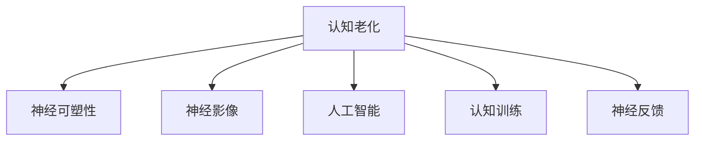

                 

# 认知老化：大脑健康的维护策略

> 关键词：认知老化, 大脑健康, 维护策略, 神经科学, 人工智能

## 1. 背景介绍

### 1.1 问题由来

认知老化是指随着年龄的增长，大脑处理信息的能力逐渐下降，出现记忆力减退、注意力分散、决策能力减弱等现象。这些变化不仅影响个人的日常生活和工作效率，还可能引发心理问题和社会问题。近年来，随着全球人口老龄化的加剧，认知老化的研究和干预成为了热点领域，引发了神经科学、心理学、人工智能等多个学科的广泛关注。

### 1.2 问题核心关键点

认知老化的研究重点在于理解其生物学机制、探索有效的干预手段，以及开发相应的技术工具。通过结合神经科学、心理学和人工智能技术，可以从多个维度分析和干预认知老化问题，为预防和缓解老年认知功能下降提供新的思路和方法。

## 2. 核心概念与联系

### 2.1 核心概念概述

为了更好地理解认知老化的机制和干预策略，本节将介绍几个关键概念：

- **认知老化(Cognitive Aging)**：指随着年龄的增长，大脑在认知功能（如记忆力、注意力、执行功能等）方面的自然衰退。
- **神经可塑性(Neural Plasticity)**：指大脑在学习和适应过程中，神经元之间的连接强度和结构可以发生改变的能力。
- **神经影像(Neuroimaging)**：利用磁共振成像(MRI)、正电子发射断层扫描(PET)等技术，观察大脑结构和功能的变化。
- **人工智能(AI)**：通过算法和大数据技术，模拟和扩展人类认知能力，辅助干预和评估认知老化。
- **认知训练(Cognitive Training)**：通过特定的任务和活动，强化和提升认知功能，延缓认知衰退。
- **神经反馈(Neurofeedback)**：利用实时的大脑信号监测，调整认知训练策略，优化训练效果。

这些概念之间的逻辑关系可以通过以下Mermaid流程图来展示：



这个流程图展示了一系列概念的相互关系，它们共同构成了认知老化的研究框架，帮助我们理解大脑功能的维护策略。

## 3. 核心算法原理 & 具体操作步骤

### 3.1 算法原理概述

认知老化的干预策略可以大致分为两大类：基于神经科学的干预和基于人工智能的干预。

- **基于神经科学的干预**：主要通过物理手段（如脑电刺激、神经调控）直接干预大脑功能，促进神经可塑性，增强认知能力。
- **基于人工智能的干预**：主要通过算法和大数据技术，模拟和增强人类认知能力，提供个性化的认知训练和评估，延缓认知衰退。

### 3.2 算法步骤详解

#### 3.2.1 基于神经科学的干预步骤

1. **神经影像分析**：利用神经影像技术，如fMRI、PET，观察大脑结构和功能的变化，识别出与认知老化相关的区域和特征。
2. **神经调控**：通过电刺激、光遗传、磁刺激等手段，调控特定区域或网络，促进神经可塑性，改善认知功能。
3. **脑电信号监测**：实时监测大脑的电信号活动，评估神经调控和认知训练的效果，并根据反馈调整干预策略。
4. **行为评估**：通过认知测试、心理评估等手段，客观评价干预前后的认知功能变化，判断干预效果。

#### 3.2.2 基于人工智能的干预步骤

1. **数据采集**：收集老年人的生理数据、认知测试数据、日常行为数据等，构建多样化的数据集。
2. **模型训练**：使用深度学习、机器学习等技术，训练认知老化预测模型、认知训练模型等，建立认知功能与生理参数、行为特征之间的关系。
3. **个性化训练**：根据模型预测结果，设计个性化的认知训练任务和方案，针对性地强化和提升特定认知功能。
4. **持续评估**：实时监测训练过程中的认知表现，根据评估结果动态调整训练难度和内容，优化训练效果。

### 3.3 算法优缺点

#### 3.3.1 基于神经科学的干预优缺点

**优点**：
- 直接作用于大脑，通过神经调控促进神经可塑性，效果可能更加显著。
- 结合神经影像和脑电监测，干预过程更加科学、可控。

**缺点**：
- 干预手段复杂，设备和技术要求高，成本较高。
- 可能存在一定的风险和副作用，需要严格控制干预剂量。

#### 3.3.2 基于人工智能的干预优缺点

**优点**：
- 技术门槛较低，易于大规模推广和应用。
- 可以实时监测和反馈，个性化训练效果更好。

**缺点**：
- 模型依赖数据质量和样本量，预测和干预效果存在不确定性。
- 个性化训练任务设计复杂，需要大量的开发和验证工作。

### 3.4 算法应用领域

基于神经科学的干预方法主要应用于医疗和科研领域，如脑神经调控、认知功能增强等。基于人工智能的干预方法则更广泛地应用于教育、健康管理、老年社区等多个领域。

## 4. 数学模型和公式 & 详细讲解 & 举例说明

### 4.1 数学模型构建

假设我们有一组老年人认知测试数据，包含年龄、记忆力、注意力等多个维度。我们可以构建一个多元线性回归模型，来预测认知老化程度与生理参数之间的关系：

$$y = \beta_0 + \beta_1 x_1 + \beta_2 x_2 + \cdots + \beta_n x_n + \epsilon$$

其中，$y$表示认知老化程度，$x_1, x_2, \cdots, x_n$表示不同生理参数，$\beta$表示对应的系数，$\epsilon$表示随机误差。

### 4.2 公式推导过程

通过多元线性回归，我们可以得到模型参数的最小二乘估计：

$$\hat{\beta} = (X^TX)^{-1}X^Ty$$

其中，$X$为特征矩阵，$Y$为目标变量向量，$\hat{\beta}$为模型参数估计。

以记忆力和年龄的关系为例，我们可以得到：

$$\hat{\beta}_{\text{记忆}} = \frac{X_{\text{记忆}}^TX_{\text{年龄}}^{-1}X_{\text{年龄}}^Ty_{\text{年龄}}}{X_{\text{年龄}}^TX_{\text{年龄}}^{-1}X_{\text{年龄}}^TX_{\text{年龄}}}$$

### 4.3 案例分析与讲解

假设我们收集了一组老年人的认知测试数据，其中包含年龄、记忆力、注意力等多个维度。我们希望构建一个模型，预测认知老化程度与年龄之间的关系。

1. **数据准备**：收集老年人的认知测试数据，包括年龄、记忆力、注意力等多个维度。
2. **模型训练**：使用多元线性回归模型，训练认知老化程度与年龄之间的关系。
3. **模型评估**：在测试集上评估模型的预测准确率，判断模型的泛化能力。
4. **结果分析**：分析模型参数的显著性，识别出对认知老化程度影响较大的因素。

## 5. 项目实践：代码实例和详细解释说明

### 5.1 开发环境搭建

在进行认知老化研究时，我们需要搭建相应的开发环境。以下是使用Python进行数据分析和模型训练的环境配置流程：

1. 安装Anaconda：从官网下载并安装Anaconda，用于创建独立的Python环境。
2. 创建并激活虚拟环境：
```bash
conda create -n cognitive-age python=3.8 
conda activate cognitive-age
```

3. 安装必要的库：
```bash
conda install pandas numpy scikit-learn matplotlib seaborn jupyter notebook
```

完成上述步骤后，即可在`cognitive-age`环境中进行认知老化相关的研究和分析。

### 5.2 源代码详细实现

这里以构建一个简单的认知老化预测模型为例，展示基于Python的实现过程。

```python
import pandas as pd
import numpy as np
from sklearn.linear_model import LinearRegression
from sklearn.model_selection import train_test_split

# 数据准备
df = pd.read_csv('cognitive_aging_data.csv')

# 数据预处理
X = df[['age', 'memory', 'attention']]
y = df['cognitive_aging']

# 模型训练
X_train, X_test, y_train, y_test = train_test_split(X, y, test_size=0.2, random_state=42)
model = LinearRegression()
model.fit(X_train, y_train)

# 模型评估
score = model.score(X_test, y_test)
print(f'Model accuracy: {score:.2f}')

# 结果分析
beta_hat = model.coef_
print(f'Model parameters: {beta_hat}')
```

### 5.3 代码解读与分析

以下是代码中各部分的详细解读：

- **数据准备**：使用pandas库读取数据集，将特征变量和目标变量分别赋值给X和y。
- **数据预处理**：将数据集划分为训练集和测试集，使用sklearn的train_test_split函数。
- **模型训练**：使用LinearRegression模型训练认知老化预测模型，在训练集上拟合数据。
- **模型评估**：使用测试集评估模型的预测准确率，计算R方值。
- **结果分析**：打印模型参数，识别出影响认知老化程度的主要因素。

## 6. 实际应用场景

### 6.1 医疗领域

在医疗领域，基于神经科学的干预方法可以帮助患者进行认知功能增强。例如，对于阿尔茨海默病等认知障碍患者，通过脑刺激、神经调控等手段，可以改善认知功能，提高生活质量。

### 6.2 教育领域

在教育领域，基于人工智能的干预方法可以提供个性化的认知训练方案，帮助老年学生保持认知活力，延缓认知衰退。例如，根据学生的认知测试结果，设计针对性的认知训练任务，提升记忆力、注意力等关键认知功能。

### 6.3 健康管理

在健康管理领域，基于人工智能的干预方法可以帮助老年人进行日常健康监测，及时发现认知老化迹象，提供相应的干预建议。例如，通过日常行为数据和生理参数，构建认知老化预测模型，及时提醒老年人关注认知健康。

### 6.4 老年社区

在老年社区，基于人工智能的干预方法可以提供全方位的认知支持，帮助老年人保持心理健康和社会功能。例如，利用智能家居设备，实时监测老年人的活动和行为，根据其认知状态，提供个性化的健康建议和认知训练方案。

## 7. 工具和资源推荐

### 7.1 学习资源推荐

为了帮助开发者系统掌握认知老化的理论基础和实践技巧，这里推荐一些优质的学习资源：

1. **《认知老化与神经科学》**：介绍了认知老化的生物学机制和神经科学方法，提供了丰富的实例和案例。
2. **Coursera《认知神经科学导论》课程**：由斯坦福大学教授主讲，系统介绍了认知神经科学的基本原理和方法。
3. **《人工智能与认知老化》**：探讨了人工智能在认知老化研究中的应用，提供了多个前沿论文的综述和分析。
4. **Google Scholar**：通过检索学术论文，了解认知老化的最新研究进展和热点问题。

通过对这些资源的学习实践，相信你一定能够快速掌握认知老化的理论基础，并用于解决实际的认知老化问题。

### 7.2 开发工具推荐

高效的开发离不开优秀的工具支持。以下是几款用于认知老化研究的常用工具：

1. **Python**：基于Python的开源数据分析平台，适用于数据处理、模型训练和可视化。
2. **R**：基于R的开源统计分析软件，提供了丰富的统计方法和绘图工具。
3. **MATLAB**：基于MATLAB的高级计算软件，适用于复杂的数值模拟和信号处理。
4. **Jupyter Notebook**：开源的交互式笔记本环境，适用于数据探索和模型验证。
5. **SPSS**：商业统计分析软件，提供了丰富的统计分析和可视化功能。

合理利用这些工具，可以显著提升认知老化研究的开发效率，加快创新迭代的步伐。

### 7.3 相关论文推荐

认知老化研究是一个跨学科的研究领域，涉及神经科学、心理学、人工智能等多个学科。以下是几篇奠基性的相关论文，推荐阅读：

1. **《认知老化与神经可塑性》**：介绍了神经可塑性的基本原理和认知老化的机制，提供了丰富的实例和案例。
2. **《认知训练的神经科学基础》**：探讨了认知训练对大脑结构和功能的影响，提供了多项研究成果。
3. **《人工智能在认知老化中的应用》**：介绍了人工智能在认知老化研究中的应用，提供了多项前沿论文的综述和分析。

这些论文代表了大数据技术在认知老化研究中的应用方向，通过学习这些前沿成果，可以帮助研究者把握学科前进方向，激发更多的创新灵感。

## 8. 总结：未来发展趋势与挑战

### 8.1 总结

本文对基于神经科学的干预方法和基于人工智能的干预方法进行了全面系统的介绍。首先阐述了认知老化的研究背景和重要性，明确了干预手段在延缓认知老化方面的独特价值。其次，从原理到实践，详细讲解了神经科学干预和人工智能干预的数学模型和操作步骤，给出了认知老化干预的完整代码实例。同时，本文还广泛探讨了认知老化干预方法在医疗、教育、健康管理等各个领域的应用前景，展示了认知老化干预的巨大潜力。此外，本文精选了认知老化干预技术的各类学习资源，力求为读者提供全方位的技术指引。

通过本文的系统梳理，可以看到，认知老化的干预技术正在成为医疗、教育和健康管理等领域的重要手段，极大地提升了老年人的生活质量和心理健康水平。未来，伴随技术的不断进步和应用场景的不断拓展，认知老化干预技术必将在更多领域得到广泛应用，为社会带来更广泛的积极影响。

### 8.2 未来发展趋势

展望未来，认知老化的干预技术将呈现以下几个发展趋势：

1. **多模态数据融合**：结合生理参数、行为数据、脑电信号等多模态数据，构建更全面、更准确的认知老化预测模型和干预方案。
2. **深度学习与神经科学的结合**：利用深度学习算法，模拟和增强人类认知能力，提高认知训练的个性化和精准度。
3. **个性化与群体化的结合**：根据个体差异，提供个性化的认知训练方案，同时关注群体共性，进行大规模的干预研究。
4. **智能家居与认知支持**：结合智能家居设备，实时监测老年人的认知状态，提供个性化的健康建议和认知训练方案。
5. **远程医疗与干预**：利用互联网和远程医疗技术，实现远程认知监测和干预，提高老年人的健康管理水平。

以上趋势凸显了认知老化干预技术的广阔前景。这些方向的探索发展，必将进一步提升认知老化的干预效果，为社会带来更广泛的健康和福祉。

### 8.3 面临的挑战

尽管认知老化干预技术已经取得了一定的进展，但在迈向更加智能化、普适化应用的过程中，它仍面临着诸多挑战：

1. **数据获取与隐私保护**：认知老化干预需要大量高质量的数据，但数据获取和隐私保护仍然是一个重要问题。如何平衡数据收集和隐私保护，是一个亟待解决的问题。
2. **干预效果的不确定性**：认知老化干预的效果受多种因素影响，如干预手段、个体差异、数据质量等，其效果和安全性还需要更多实证研究。
3. **技术门槛和成本**：认知老化干预涉及多种复杂技术，如脑电刺激、神经调控等，技术门槛较高，成本较高。如何降低干预技术门槛，实现大规模推广应用，是一个重要的课题。
4. **社会认知与接受度**：认知老化干预技术面临社会认知和接受度不足的问题，部分老年人对其效果持怀疑态度，如何提高认知老化干预的社会认知度，是一个需要重点关注的问题。
5. **长期干预的可持续性**：认知老化干预需要长期持续的监测和干预，如何建立可持续的干预机制，是一个需要深入研究的问题。

正视认知老化干预面临的这些挑战，积极应对并寻求突破，将是大数据技术走向成熟的必由之路。相信随着学界和产业界的共同努力，这些挑战终将一一被克服，认知老化干预必将在构建健康老龄化社会中扮演越来越重要的角色。

### 8.4 未来突破

面对认知老化干预所面临的种种挑战，未来的研究需要在以下几个方面寻求新的突破：

1. **多模态数据融合**：开发更加高效的数据融合技术，结合生理参数、行为数据、脑电信号等多模态数据，构建更全面、更准确的认知老化预测模型和干预方案。
2. **个性化与群体化的结合**：根据个体差异，提供个性化的认知训练方案，同时关注群体共性，进行大规模的干预研究，实现干预效果的最大化。
3. **深度学习与神经科学的结合**：利用深度学习算法，模拟和增强人类认知能力，提高认知训练的个性化和精准度。
4. **智能家居与认知支持**：结合智能家居设备，实时监测老年人的认知状态，提供个性化的健康建议和认知训练方案，提高老年人的生活质量。
5. **远程医疗与干预**：利用互联网和远程医疗技术，实现远程认知监测和干预，提高老年人的健康管理水平。

这些研究方向的探索，必将引领认知老化干预技术迈向更高的台阶，为构建健康老龄化社会带来更多的希望和可能。面向未来，认知老化干预技术还需要与其他人工智能技术进行更深入的融合，如知识表示、因果推理、强化学习等，多路径协同发力，共同推动认知老化干预技术的进步。只有勇于创新、敢于突破，才能不断拓展认知老化干预的边界，让健康科技更好地造福全人类。

## 9. 附录：常见问题与解答

**Q1：认知老化是否可以预防？**

A: 认知老化是一个自然过程，无法完全预防，但可以通过多种手段延缓其进展。例如，定期进行认知训练、保持身体健康、积极社交等，可以显著延缓认知老化进程。

**Q2：认知老化干预的效果如何评估？**

A: 评估认知老化干预效果通常需要多个维度，包括认知测试、行为评估、生理监测等。具体评估方法需要根据干预手段和目标来确定。

**Q3：认知老化干预是否需要长期持续？**

A: 是的，认知老化干预需要长期持续的监测和干预，才能取得较好的效果。定期评估干预效果，根据评估结果调整干预策略，是保证干预效果的重要手段。

**Q4：认知老化干预技术是否安全？**

A: 目前认知老化干预技术在安全性方面还需进一步验证，但一般认为技术风险较低。然而，干预过程中仍需注意监测副作用，根据个体情况调整干预剂量。

**Q5：认知老化干预是否适用于所有老年人？**

A: 认知老化干预通常适用于认知功能减退的老年人，但对于认知功能正常的老年人，干预效果可能有限。因此，在干预前需要进行评估，确保干预对象适合。

---

作者：禅与计算机程序设计艺术 / Zen and the Art of Computer Programming

