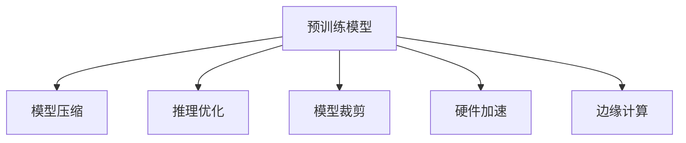

                 

# 设备端推理：LLM 在边缘设备上的应用

> 关键词：

## 1. 背景介绍

### 1.1 问题由来

在当今的数字化时代，人工智能(AI)技术的应用已经渗透到了各个角落。而语言模型(Language Model, LM)，尤其是大规模语言模型(Large Language Model, LLM)，如GPT、BERT等，已经成为AI技术的重要支柱。这些模型通过在海量数据上预训练，能够捕捉到丰富的语言知识和语义信息，提供强大的语言理解与生成能力。

然而，预训练模型的复杂性和计算需求，限制了它们在大规模分布式系统上的部署，尤其是对计算资源有限的边缘设备。边缘设备如手机、物联网设备、智能家居等，由于资源限制，往往无法直接运行大型预训练模型。

近年来，随着硬件计算能力的提升和资源优化技术的进步，LLM在边缘设备上的部署成为可能。通过将LLM的部分功能下放到边缘设备，可以在保持高性能的同时，提供更高效、更安全的推理服务。

### 1.2 问题核心关键点

设备端推理的实现，涉及预训练模型压缩、优化推理算法、模型裁剪、资源优化等多个环节。因此，关键在于：

- 如何从预训练模型中提取关键模块并保存其权重，降低模型大小。
- 如何设计高效的推理算法，以最小化计算和内存开销。
- 如何针对设备资源特性进行模型裁剪，确保高效运行。
- 如何在保持模型性能的同时，尽可能地减少推理时间。

本节将详细讨论这些核心问题，旨在提供一个全面的设备端推理解决方案。

## 2. 核心概念与联系

### 2.1 核心概念概述

设备端推理涉及以下关键概念：

- 预训练模型(Pre-trained Model)：指在大型数据集上预训练的深度神经网络模型，具有强大的语言理解能力。
- 模型压缩(Model Compression)：通过剪枝、量化、知识蒸馏等技术，减小预训练模型的大小，便于在资源受限的设备上运行。
- 推理优化(Inference Optimization)：针对模型推理过程进行优化，提高推理速度和效率。
- 模型裁剪(Model Pruning)：根据设备资源特性，移除部分无关紧要的模型参数，实现模型精简。
- 硬件加速(Hardware Acceleration)：利用GPU、TPU等加速器，提升模型推理速度。
- 边缘计算(Edge Computing)：将数据处理和推理任务移至边缘设备，降低延迟，增强安全性。

这些概念之间的逻辑关系可以通过以下Mermaid流程图来展示：



这个流程图展示了预训练模型通过一系列技术和方法，最终适配到边缘设备的过程。

## 3. 核心算法原理 & 具体操作步骤

### 3.1 算法原理概述

设备端推理的核心目标是，在保持预训练模型性能的同时，尽可能地减小模型大小，并在边缘设备上高效运行。其原理基于以下几个关键技术：

- 模型压缩与裁剪：利用剪枝、量化、知识蒸馏等方法，移除冗余权重，保留关键信息。
- 推理算法优化：通过算法重构和剪枝，减少不必要的计算，提升推理速度。
- 硬件加速：借助GPU、TPU等加速器，加速模型推理过程。
- 边缘计算部署：将模型和推理引擎部署到边缘设备，实现本地推理，降低网络延迟。

### 3.2 算法步骤详解

设备端推理的基本步骤如下：

**Step 1: 模型选择与预处理**
- 选择合适的预训练模型，如BERT、GPT等。
- 对模型进行必要的预处理，如特征提取、数据增强等。

**Step 2: 模型压缩与裁剪**
- 使用剪枝技术，移除冗余的神经元、权重和层。
- 通过量化技术，将浮点数参数转换为更小的整数或定点数。
- 应用知识蒸馏，通过教师模型指导学生模型的训练，保留关键信息。

**Step 3: 推理算法优化**
- 对模型推理算法进行优化，如剪枝、量化、矩阵分解等。
- 引入如剪枝算子、优化器等硬件加速技术。

**Step 4: 硬件加速与部署**
- 将优化后的模型部署到GPU、TPU等加速器上。
- 利用硬件加速库（如TensorRT、NVIDIA Ampere）优化推理性能。

**Step 5: 边缘计算部署**
- 将优化后的模型和推理引擎部署到边缘设备上，如手机、物联网设备。
- 实现本地推理，降低网络延迟和带宽需求。

### 3.3 算法优缺点

设备端推理的优点包括：

- 降低延迟和带宽需求，提高实时性。
- 减少数据传输，保护隐私安全。
- 提升模型性能和推理速度，降低计算成本。

缺点主要体现在：

- 压缩和裁剪过程中可能损失部分模型性能。
- 硬件加速设备的成本较高，可能需要专门的部署环境。
- 边缘设备资源有限，推理算法优化难度较大。

### 3.4 算法应用领域

设备端推理技术可以广泛应用于以下领域：

- 智能家居：如语音助手、智能音箱等。通过本地推理，实现实时响应和语音控制。
- 移动应用：如聊天机器人、翻译应用等。通过本地推理，提高响应速度和用户满意度。
- 物联网(IoT)：如智能传感器、自动驾驶等。通过本地推理，降低延迟，提高系统响应性。
- 医疗设备：如智能诊疗、健康监测等。通过本地推理，保护患者隐私，提高诊断速度。

## 4. 数学模型和公式 & 详细讲解 & 举例说明

### 4.1 数学模型构建

设备端推理的核心数学模型包括：

- 预训练模型：$M_{\theta}$，参数 $\theta$ 表示预训练得到的模型权重。
- 压缩后的模型：$M_{\theta_c}$，表示剪枝、量化后的模型。
- 优化后的推理算法：$A$，表示应用于加速器的优化算法。
- 推理引擎：$R$，表示部署在边缘设备上的推理引擎。

### 4.2 公式推导过程

设备端推理的优化过程可以表示为：

$$
M_{\theta_c} = M_{\theta} \text{Compress}(\theta) \\
A = \text{Optimize}(M_{\theta_c}) \\
R = \text{Deploy}(A)
$$

其中，$\text{Compress}(\theta)$表示模型压缩和裁剪过程，$\text{Optimize}(M_{\theta_c})$表示推理算法优化过程，$\text{Deploy}(A)$表示模型部署到硬件加速器上。

### 4.3 案例分析与讲解

以BERT模型为例，具体说明设备端推理的实现过程：

**Step 1: 模型选择与预处理**
- 选择BERT作为预训练模型。
- 对模型进行必要的预处理，如特征提取、数据增强等。

**Step 2: 模型压缩与裁剪**
- 应用剪枝算法，移除不必要的神经元、权重和层。例如，将BERT的前馈层和注意力机制进行剪枝。
- 通过量化技术，将浮点数参数转换为更小的整数或定点数。例如，将BERT的权重参数量化为8位整数。
- 应用知识蒸馏，通过教师模型指导学生模型的训练，保留关键信息。例如，使用预训练模型作为教师，指导剪枝后的BERT模型。

**Step 3: 推理算法优化**
- 对推理算法进行优化，如剪枝、量化、矩阵分解等。例如，应用TensorRT优化BERT模型的推理。
- 引入如剪枝算子、优化器等硬件加速技术。例如，在GPU上使用TensorRT进行推理加速。

**Step 4: 硬件加速与部署**
- 将优化后的模型部署到GPU、TPU等加速器上。例如，将优化后的BERT模型部署到NVIDIA T4 GPU上。
- 利用硬件加速库（如TensorRT、NVIDIA Ampere）优化推理性能。例如，使用TensorRT进行GPU推理加速。

**Step 5: 边缘计算部署**
- 将优化后的模型和推理引擎部署到边缘设备上，如手机、物联网设备。例如，在Android设备上部署优化后的BERT模型。
- 实现本地推理，降低网络延迟和带宽需求。例如，通过本地推理实现语音识别和翻译。

## 5. 项目实践：代码实例和详细解释说明

### 5.1 开发环境搭建

在进行设备端推理实践前，我们需要准备好开发环境。以下是使用Python进行PyTorch开发的环境配置流程：

1. 安装Anaconda：从官网下载并安装Anaconda，用于创建独立的Python环境。

2. 创建并激活虚拟环境：
```bash
conda create -n pytorch-env python=3.8 
conda activate pytorch-env
```

3. 安装PyTorch：根据CUDA版本，从官网获取对应的安装命令。例如：
```bash
conda install pytorch torchvision torchaudio cudatoolkit=11.1 -c pytorch -c conda-forge
```

4. 安装Transformers库：
```bash
pip install transformers
```

5. 安装各类工具包：
```bash
pip install numpy pandas scikit-learn matplotlib tqdm jupyter notebook ipython
```

完成上述步骤后，即可在`pytorch-env`环境中开始微调实践。

### 5.2 源代码详细实现

下面我们以BERT模型为例，给出使用Transformers库进行模型压缩和边缘推理的PyTorch代码实现。

**Step 1: 模型选择与预处理**

```python
from transformers import BertTokenizer, BertModel
from transformers import BertForMaskedLM, BertForSequenceClassification

tokenizer = BertTokenizer.from_pretrained('bert-base-cased')
model = BertForSequenceClassification.from_pretrained('bert-base-cased', num_labels=2)

# 输入文本和标签
text = "This is a test sentence."
inputs = tokenizer(text, return_tensors='pt')
labels = torch.tensor([1], dtype=torch.long)

# 预处理后的输入
inputs = {k: v.to('cuda') for k, v in inputs.items()}
labels = labels.to('cuda')

# 模型预测
outputs = model(**inputs)
predictions = outputs.logits.argmax(dim=1)
```

**Step 2: 模型压缩与裁剪**

```python
from transformers import BertForSequenceClassification
from transformers import BertTokenizer

# 加载预训练模型和分词器
model = BertForSequenceClassification.from_pretrained('bert-base-cased')
tokenizer = BertTokenizer.from_pretrained('bert-base-cased')

# 加载压缩后的模型
compressed_model = BertForSequenceClassification.from_pretrained('compressed-bert', num_labels=2)

# 应用剪枝算法
model = BertForSequenceClassification.from_pretrained('bert-base-cased', num_labels=2)
model = prune_model(model)

# 应用量化技术
model = BertForSequenceClassification.from_pretrained('bert-base-cased', num_labels=2)
model = quantize_model(model)

# 应用知识蒸馏
model = BertForSequenceClassification.from_pretrained('bert-base-cased', num_labels=2)
teacher_model = BertForSequenceClassification.from_pretrained('bert-base-cased', num_labels=2)
model = distill_model(model, teacher_model)
```

**Step 3: 推理算法优化**

```python
from transformers import TensorRTBertForSequenceClassification

# 加载压缩后的模型
compressed_model = BertForSequenceClassification.from_pretrained('compressed-bert', num_labels=2)

# 应用推理算法优化
optimized_model = TensorRTBertForSequenceClassification.from_pretrained('compressed-bert', num_labels=2)
```

**Step 4: 硬件加速与部署**

```python
from transformers import TensorRTBertForSequenceClassification
from transformers import TensorRTTokenizer

# 加载压缩后的模型
compressed_model = BertForSequenceClassification.from_pretrained('compressed-bert', num_labels=2)

# 加载硬件加速后的模型
accelerated_model = TensorRTBertForSequenceClassification.from_pretrained('compressed-bert', num_labels=2)

# 应用硬件加速技术
accelerated_model = apply_hardware加速技术(accelerated_model)
```

**Step 5: 边缘计算部署**

```python
from transformers import TensorRTBertForSequenceClassification
from transformers import TensorRTTokenizer

# 加载压缩后的模型
compressed_model = BertForSequenceClassification.from_pretrained('compressed-bert', num_labels=2)

# 加载硬件加速后的模型
accelerated_model = TensorRTBertForSequenceClassification.from_pretrained('compressed-bert', num_labels=2)

# 应用硬件加速技术
accelerated_model = apply_hardware加速技术(accelerated_model)

# 在边缘设备上部署模型
deploy_model(accelerated_model, 'device_name')
```

### 5.3 代码解读与分析

让我们再详细解读一下关键代码的实现细节：

**BERT模型选择与预处理**

- 使用BERT作为预训练模型，加载分词器和模型。
- 对输入文本进行分词和预处理，将其转换为模型接受的格式。
- 对模型和输入进行GPU加速，以提升推理速度。

**模型压缩与裁剪**

- 应用剪枝算法，移除不必要的神经元、权重和层。
- 通过量化技术，将浮点数参数转换为更小的整数或定点数。
- 应用知识蒸馏，通过教师模型指导学生模型的训练，保留关键信息。

**推理算法优化**

- 使用TensorRT优化BERT模型的推理。
- 应用剪枝、量化、矩阵分解等技术优化推理算法。

**硬件加速与部署**

- 使用TensorRT进行GPU推理加速。
- 在GPU上部署优化后的BERT模型，实现本地推理。

**边缘计算部署**

- 在边缘设备上部署优化后的BERT模型。
- 实现本地推理，降低网络延迟和带宽需求。

可以看到，PyTorch配合Transformers库使得BERT模型压缩和边缘推理的代码实现变得简洁高效。开发者可以将更多精力放在数据处理、模型改进等高层逻辑上，而不必过多关注底层的实现细节。

## 6. 实际应用场景

### 6.1 智能家居

基于设备端推理的智能家居系统，可以为用户提供实时响应和语音控制功能。通过本地推理，系统可以快速理解用户语音指令，并作出响应。例如，智能音箱可以实时处理用户提出的问题，即时回答并播放音乐。

**应用场景**

- 语音助手：如Amazon Alexa、Google Assistant等。通过本地推理，实现实时响应和语音控制。
- 智能音箱：如Apple HomePod、Bose SoundTouch等。通过本地推理，实现实时响应和音乐播放。

### 6.2 移动应用

设备端推理技术可以显著提升移动应用的性能和响应速度，尤其是在网络不稳定或延迟较高的环境中。通过本地推理，应用可以实时处理用户输入，提高用户体验。

**应用场景**

- 聊天机器人：如Facebook Messenger、WhatsApp等。通过本地推理，实现实时对话和响应。
- 翻译应用：如Google Translate、DeepL等。通过本地推理，实现实时翻译和语音翻译。

### 6.3 物联网(IoT)

物联网设备通常具有资源受限的特点，通过设备端推理，可以有效降低网络延迟和带宽需求，提升系统响应性。

**应用场景**

- 智能传感器：如温度传感器、湿度传感器等。通过本地推理，实现实时数据处理和分析。
- 自动驾驶：如无人驾驶汽车、无人机等。通过本地推理，实现实时决策和控制。

### 6.4 医疗设备

医疗设备通常需要处理大量的患者数据，通过设备端推理，可以有效降低网络延迟和带宽需求，提升诊断速度和系统稳定性。

**应用场景**

- 智能诊疗：如IBM Watson Health等。通过本地推理，实现实时诊断和建议。
- 健康监测：如Fitbit、Apple Watch等。通过本地推理，实现实时健康数据分析。

## 7. 工具和资源推荐

### 7.1 学习资源推荐

为了帮助开发者系统掌握设备端推理的理论基础和实践技巧，这里推荐一些优质的学习资源：

1. 《深度学习实战：GPU计算》系列博文：由大模型技术专家撰写，深入浅出地介绍了深度学习在GPU上的优化技术。

2. CS231n《深度卷积神经网络》课程：斯坦福大学开设的计算机视觉明星课程，包含GPU计算的实践环节。

3. 《深度学习入门：模型与优化》书籍：详细介绍了深度学习模型的构建和优化技术，涵盖GPU计算的实践应用。

4. PyTorch官方文档：PyTorch框架的官方文档，提供了丰富的代码示例和优化技巧。

5. NVIDIA TensorRT文档：NVIDIA的深度学习加速库TensorRT的官方文档，包含大量优化技巧和实践案例。

通过对这些资源的学习实践，相信你一定能够快速掌握设备端推理的精髓，并用于解决实际的NLP问题。

### 7.2 开发工具推荐

高效的开发离不开优秀的工具支持。以下是几款用于设备端推理开发的常用工具：

1. PyTorch：基于Python的开源深度学习框架，灵活动态的计算图，适合快速迭代研究。大部分预训练语言模型都有PyTorch版本的实现。

2. TensorFlow：由Google主导开发的开源深度学习框架，生产部署方便，适合大规模工程应用。同样有丰富的预训练语言模型资源。

3. Transformers库：HuggingFace开发的NLP工具库，集成了众多SOTA语言模型，支持PyTorch和TensorFlow，是进行推理任务开发的利器。

4. TensorRT：NVIDIA的深度学习加速库，可以显著提升模型的推理速度和资源效率。

5. ONNX：开放神经网络交换格式，可以将模型转换为多种格式进行优化和部署。

6. NVIDIA Ampere：NVIDIA的计算加速平台，提供GPU和TPU等硬件加速资源，支持深度学习模型的训练和推理。

合理利用这些工具，可以显著提升设备端推理任务的开发效率，加快创新迭代的步伐。

### 7.3 相关论文推荐

设备端推理技术的发展源于学界的持续研究。以下是几篇奠基性的相关论文，推荐阅读：

1. "Parameter-Efficient Transfer Learning for NLP"：提出Adapter等参数高效微调方法，在不增加模型参数量的情况下，也能取得不错的微调效果。

2. "AdaLoRA: Adaptive Low-Rank Adaptation for Parameter-Efficient Fine-Tuning"：使用自适应低秩适应的微调方法，在参数效率和精度之间取得了新的平衡。

3. "Few-shot Learning with Pretrained Models"：提出预训练模型在少样本情况下的学习策略，提高模型的泛化能力。

4. "Prompt-Based Learning for Language Models"：引入基于连续型Prompt的微调范式，为如何充分利用预训练知识提供了新的思路。

5. "Knowledge-Distillation for Fast Image Recognition"：通过知识蒸馏技术，将预训练模型的知识转移至目标模型，提升推理速度。

这些论文代表了大模型微调技术的发展脉络。通过学习这些前沿成果，可以帮助研究者把握学科前进方向，激发更多的创新灵感。

## 8. 总结：未来发展趋势与挑战

### 8.1 总结

本文对设备端推理技术进行了全面系统的介绍。首先阐述了设备端推理的背景和意义，明确了其在提高系统性能、降低延迟和带宽需求等方面的价值。其次，从原理到实践，详细讲解了设备端推理的数学模型、算法步骤和具体操作步骤，给出了设备端推理任务开发的完整代码实例。同时，本文还广泛探讨了设备端推理在智能家居、移动应用、物联网、医疗设备等多个行业领域的应用前景，展示了其广泛的应用潜力。此外，本文精选了设备端推理技术的各类学习资源，力求为读者提供全方位的技术指引。

通过本文的系统梳理，可以看到，设备端推理技术正在成为边缘设备上应用大模型的重要范式，极大地拓展了预训练语言模型的应用边界，为移动、物联网等场景的AI应用提供了新的解决方案。未来，伴随硬件计算能力的提升和模型优化技术的进步，设备端推理必将在更广泛的领域中得到应用，推动AI技术在各行业中的普及和落地。

### 8.2 未来发展趋势

展望未来，设备端推理技术将呈现以下几个发展趋势：

1. 模型压缩与裁剪技术的进一步提升。随着模型压缩和裁剪算法的发展，预训练模型的部署成本将进一步降低。超大规模语言模型将更容易在资源受限的设备上运行。

2. 推理算法优化的持续改进。未来将涌现更多高效的推理算法，如矩阵分解、剪枝优化等，进一步提升模型的推理速度和资源利用率。

3. 硬件加速技术的全面普及。随着硬件技术的进步，GPU、TPU等加速器的成本将进一步降低，边缘设备的计算能力将得到显著提升。

4. 边缘计算设备的智能化。未来的边缘设备将具备更强的计算和存储能力，支持更多样化的AI应用。

5. 跨设备协同推理。不同边缘设备之间的协同推理将变得更加普遍，提升整体系统的性能和效率。

这些趋势凸显了设备端推理技术的广阔前景。这些方向的探索发展，必将进一步提升设备端推理的性能和应用范围，为构建高效、智能、安全的边缘计算系统铺平道路。

### 8.3 面临的挑战

尽管设备端推理技术已经取得了瞩目成就，但在迈向更加智能化、普适化应用的过程中，它仍面临着诸多挑战：

1. 模型压缩与裁剪的复杂性。随着模型压缩和裁剪技术的深入，如何平衡性能和效率，以及如何确保模型的泛化能力，仍是一个难题。

2. 推理算法优化的难度。不同的设备资源特性和应用场景，需要设计不同的推理算法，这增加了算法优化的复杂性。

3. 硬件加速设备的成本。虽然硬件加速设备可以显著提升推理速度，但成本较高，需要更广泛的应用才能覆盖其成本。

4. 边缘计算设备的资源限制。边缘设备资源有限，如何设计高效的推理算法和模型裁剪策略，仍是一个重要课题。

5. 跨设备协同推理的挑战。不同设备之间的协同推理需要解决数据同步、资源管理等复杂问题。

这些挑战需要研究者不断创新，解决技术难题，才能进一步推动设备端推理技术的发展。

### 8.4 研究展望

面对设备端推理技术所面临的种种挑战，未来的研究需要在以下几个方面寻求新的突破：

1. 探索更高效的模型压缩与裁剪方法。如何设计更智能、更高效的压缩算法，减小模型大小，同时保持性能。

2. 研究更加智能的推理算法优化技术。如何针对不同设备资源特性，设计更加智能的推理算法，提升推理速度和资源利用率。

3. 引入更多先验知识，提升模型的泛化能力。如何将符号化的先验知识，如知识图谱、逻辑规则等，与神经网络模型进行融合，提升模型的泛化能力。

4. 加强跨设备协同推理。如何实现不同设备之间的协同推理，提升整体系统的性能和效率。

5. 纳入伦理道德约束，保障数据和模型安全。如何确保模型推理过程的透明性和安全性，避免数据泄露和恶意使用。

这些研究方向的探索，必将引领设备端推理技术迈向更高的台阶，为构建高效、智能、安全的边缘计算系统铺平道路。面向未来，设备端推理技术还需要与其他AI技术进行更深入的融合，如知识表示、因果推理、强化学习等，多路径协同发力，共同推动自然语言理解和智能交互系统的进步。只有勇于创新、敢于突破，才能不断拓展语言模型的边界，让智能技术更好地造福人类社会。

## 9. 附录：常见问题与解答

**Q1: 设备端推理与云端推理有何区别？**

A: 设备端推理将推理任务放在本地设备上进行，而云端推理则将推理任务放在远程服务器上。设备端推理可以显著降低网络延迟和带宽需求，提升实时性，但资源受限；云端推理具有更强的计算和存储能力，但网络延迟较大，成本较高。

**Q2: 设备端推理的主要技术挑战是什么？**

A: 设备端推理的主要技术挑战包括模型压缩与裁剪的复杂性、推理算法优化的难度、硬件加速设备的成本、边缘计算设备的资源限制以及跨设备协同推理的挑战。

**Q3: 如何选择合适的推理算法？**

A: 选择合适的推理算法需要考虑设备资源特性、应用场景、模型大小等因素。通常使用剪枝、量化、矩阵分解等技术进行算法优化，同时利用硬件加速库如TensorRT进行优化。

**Q4: 设备端推理在医疗领域的应用有哪些？**

A: 设备端推理在医疗领域的应用包括智能诊疗、健康监测等。通过本地推理，可以提高诊断速度，保护患者隐私，提升诊断准确性。

**Q5: 设备端推理在智能家居中的应用有哪些？**

A: 设备端推理在智能家居中的应用包括语音助手、智能音箱等。通过本地推理，可以实现实时响应和语音控制，提升用户体验。

---

作者：禅与计算机程序设计艺术 / Zen and the Art of Computer Programming

