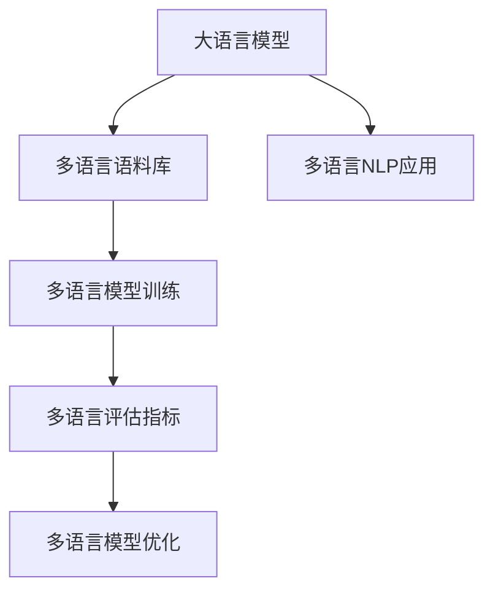

                 

# 语言多样性与 LLM：支持多语言社会

> 关键词：语言多样性, 大语言模型, 多语言社会, 自然语言处理, 多语言支持, 多语言语料, 多语言模型训练, 多语言评估指标, 多语言模型优化

## 1. 背景介绍

### 1.1 问题由来

在当今多元文化、多语言并存的世界，语言多样性已经成为推动全球交流、促进跨文化理解的不可或缺的元素。然而，由于语言之间的差异巨大，传统的语言处理技术在处理多语言数据时往往面临诸多挑战，如多语言数据稀缺、语言表达形式复杂、语义理解困难等。这一问题尤其突出在自然语言处理（Natural Language Processing, NLP）领域，如机器翻译、语音识别、情感分析等任务中。

为了应对这一挑战，大语言模型（Large Language Models, LLMs）作为一种先进的NLP技术应运而生。这类模型通过大规模预训练和微调，能够理解并生成多种语言，具备强大的跨语言学习能力。然而，在实际应用中，要使这些模型充分支持多语言社会，还需要在语言多样性方面进行深入研究和优化。

### 1.2 问题核心关键点

大语言模型在多语言社会的支持上，核心在于以下几点：

- **多语言语料库的构建**：收集和构建高质量的多语言语料，为模型的预训练和微调提供基础。
- **多语言模型的训练**：设计有效的多语言模型训练策略，提升模型对多种语言的理解和生成能力。
- **多语言评估指标的引入**：定义和使用多语言评估指标，客观评估模型在不同语言上的表现。
- **多语言模型的优化**：针对特定多语言社会需求，对模型进行适应性优化。

本文将深入探讨这些核心问题，通过详细的数学模型和算法步骤，揭示如何构建支持多语言社会的大语言模型，并提出未来发展的方向。

## 2. 核心概念与联系

### 2.1 核心概念概述

在探讨多语言社会中大语言模型的构建之前，首先需要明确几个关键概念：

- **大语言模型（Large Language Models, LLMs）**：基于Transformer架构或其变种，通过大规模预训练生成的语言模型。这类模型可以理解并生成多种语言的文本，具备强大的跨语言学习能力。
- **多语言社会（Multilingual Society）**：指多语言并存、多种文化共生的社会环境，语言多样性是这一社会的重要特征。
- **自然语言处理（Natural Language Processing, NLP）**：涉及计算机处理人类语言的技术，包括文本分析、机器翻译、语音识别、情感分析等任务。

### 2.2 核心概念原理和架构的 Mermaid 流程图



此流程图展示了从多语言语料库构建，到多语言模型训练、评估与优化，最终应用到多语言NLP任务的整个过程。各概念之间的联系紧密，共同构成了一个完整的多语言大语言模型构建框架。

## 3. 核心算法原理 & 具体操作步骤

### 3.1 算法原理概述

多语言大语言模型的构建，主要包括以下几个步骤：

1. **多语言语料收集与预处理**：从不同语言来源收集文本数据，并进行清洗、分词、标注等预处理。
2. **多语言模型训练**：设计多语言模型结构，选择损失函数，通过多语言语料进行模型训练。
3. **多语言评估与优化**：使用多语言评估指标对训练后的模型进行评估，根据评估结果进行调整优化。
4. **多语言NLP应用**：将训练好的多语言模型应用到多语言NLP任务中，进行实证测试和部署。

### 3.2 算法步骤详解

#### 3.2.1 多语言语料收集与预处理

**步骤1：多语言语料收集**

- 收集来自不同语言的文化、经济、社会等多方面的文本数据。包括书籍、新闻、社交媒体、官方网站等。
- 数据来源多样化，避免单一语言数据集可能带来的偏差。
- 确保数据的合法性和隐私保护，遵循数据收集伦理。

**步骤2：数据预处理**

- 对收集到的文本进行清洗，去除噪声和无效信息。
- 进行分词、标记化、统一编码格式等预处理，使数据符合模型训练要求。
- 对标注数据进行标注，如分词、词性标注、命名实体识别等，便于后续模型训练。

#### 3.2.2 多语言模型训练

**步骤1：设计多语言模型结构**

- 选择适合多语言处理的Transformer模型，如M2M-100、M-T5等。
- 设计多语言模型结构，如并行多语言结构、序列多语言结构等。
- 确定模型层数、节点数、学习率等超参数，以便优化模型性能。

**步骤2：选择损失函数**

- 设计适合多语言的损失函数，如多任务损失函数、多语言语言模型损失函数等。
- 引入跨语言语言模型（Cross-lingual Language Model, CLM），利用多语言数据进行联合训练。

**步骤3：多语言模型训练**

- 利用预处理好的多语言语料，进行多语言模型训练。
- 采用多任务学习或注意力机制，提高模型对不同语言的理解能力。
- 引入多语言对比学习，通过对比不同语言间的相似性，提升模型的泛化能力。

#### 3.2.3 多语言评估与优化

**步骤1：定义多语言评估指标**

- 选择合适的多语言评估指标，如BLEU、ROUGE、F1-score等。
- 根据具体任务设计评估指标，如机器翻译中的BLEU、情感分析中的F1-score等。

**步骤2：多语言模型评估**

- 使用评估指标对训练后的多语言模型进行评估。
- 对不同语言的任务分别评估，确保模型在多种语言上的表现均衡。

**步骤3：多语言模型优化**

- 根据评估结果，调整模型结构、超参数等。
- 引入正则化技术，如Dropout、L2正则化等，避免过拟合。
- 采用模型剪枝、量化等技术，提高模型推理效率。

#### 3.2.4 多语言NLP应用

**步骤1：模型应用**

- 将训练好的多语言模型应用到多语言NLP任务中，如机器翻译、情感分析、命名实体识别等。
- 使用模型进行预测，输出多语言文本。

**步骤2：模型部署**

- 将模型部署到生产环境，进行实际应用测试。
- 优化模型部署，如模型裁剪、量化加速等，确保模型推理效率。

**步骤3：持续学习与优化**

- 收集新数据，继续训练模型，提升模型性能。
- 对模型进行定期评估，及时更新模型参数，避免模型退化。

### 3.3 算法优缺点

#### 3.3.1 优点

- **高效性**：大语言模型可以通过多任务学习、注意力机制等技术，高效地处理多语言数据。
- **泛化能力强**：模型通过联合训练，具备较强的跨语言泛化能力，可以在多种语言上取得良好效果。
- **适用范围广**：适用于多语言社会中的多种NLP任务，如机器翻译、情感分析、命名实体识别等。

#### 3.3.2 缺点

- **数据需求高**：需要大量高质量的多语言数据，数据获取成本较高。
- **模型复杂**：多语言模型结构复杂，需要更多的计算资源和存储空间。
- **评估难度大**：多语言评估指标设计复杂，评估难度较大。

### 3.4 算法应用领域

多语言大语言模型已经在多个领域得到应用：

- **多语言翻译**：如Google翻译、DeepL翻译等，通过多语言模型实现高效准确的翻译。
- **多语言情感分析**：通过多语言情感分析，了解不同语言下的用户情感，进行市场分析和社会舆情监测。
- **多语言命名实体识别**：对不同语言中的命名实体进行识别，如人名、地名、机构名等。
- **多语言问答系统**：在多语言环境下，提供智能问答服务，回答用户的多语言问题。
- **多语言语音识别**：通过多语言模型，实现对不同语言语音的高效识别。

## 4. 数学模型和公式 & 详细讲解 & 举例说明

### 4.1 数学模型构建

多语言大语言模型构建的核心在于选择合适的数学模型。这里以Transformer模型为例，讨论多语言模型的构建。

假设有一个包含n种语言的语料库，每种语言的数据量为$X_i$。我们设计一个包含n层的Transformer模型，用于处理多语言数据。

**输入表示**：将多语言文本转换为模型可以处理的形式，如将中文文本转换为汉字向量表示。

**编码器结构**：Transformer模型的编码器结构包括多头自注意力机制、前馈神经网络等。

**解码器结构**：Transformer模型的解码器结构与编码器类似，但增加了附加的注意力机制，用于处理生成目标语言。

**损失函数**：多语言模型常用的损失函数包括交叉熵损失、对比损失等。

### 4.2 公式推导过程

以多任务学习为例，我们推导多语言模型的训练过程。

**多任务学习框架**：

$$
L = \sum_{i=1}^n \alpha_i L_i
$$

其中，$L_i$为第i种语言的损失函数，$\alpha_i$为第i种语言的权重。

**多语言对比学习**：

$$
L = \sum_{i=1}^n \alpha_i L_i + \beta L_c
$$

其中，$L_c$为跨语言对比损失，$\beta$为对比损失的权重。

**多语言语言模型损失**：

$$
L = \sum_{i=1}^n \alpha_i \frac{1}{X_i} \sum_{j=1}^{X_i} -y_j \log p_j
$$

其中，$p_j$为第i种语言的第j个样本的概率分布。

### 4.3 案例分析与讲解

以机器翻译为例，解释多语言模型的应用过程。

**步骤1：数据预处理**

- 收集英中双语语料库。
- 进行文本清洗、分词、标记化等预处理。
- 进行双语标注，标注源语言和目标语言。

**步骤2：模型训练**

- 构建包含n层的Transformer模型。
- 设置多任务学习框架，分配英中双语数据的权重。
- 训练模型，优化损失函数。

**步骤3：模型评估**

- 使用BLEU等评估指标对训练后的模型进行评估。
- 在测试集上评估模型性能，确定模型效果。

**步骤4：模型应用**

- 在生产环境中部署模型，进行实际翻译应用。
- 持续收集用户反馈，对模型进行优化和迭代。

## 5. 项目实践：代码实例和详细解释说明

### 5.1 开发环境搭建

在开始多语言大语言模型的构建前，需要搭建好开发环境。

**步骤1：环境配置**

- 安装Python 3.7或以上版本。
- 安装PyTorch、transformers等深度学习库。
- 安装GPU驱动程序和CUDA工具包。

**步骤2：构建虚拟环境**

- 使用虚拟环境工具，如virtualenv或conda，创建开发环境。
- 安装所需的依赖包，如numpy、pandas、torch等。

### 5.2 源代码详细实现

以下是一个多语言Transformer模型的代码实现，以英中双语翻译为例：

```python
import torch
import torch.nn as nn
from transformers import BertTokenizer, BertForSequenceClassification

class MultiLanguageModel(nn.Module):
    def __init__(self, num_classes, num_languages):
        super(MultiLanguageModel, self).__init__()
        self.encoder = BertForSequenceClassification.from_pretrained('bert-base-cased', num_labels=num_classes)
        self.num_languages = num_languages

    def forward(self, x, y):
        tokenizer = BertTokenizer.from_pretrained('bert-base-cased')
        x = tokenizer(x, return_tensors='pt', max_length=128, padding='max_length')
        x = x['input_ids'].to(self.encoder.device)
        x['attention_mask'] = x['attention_mask'].to(self.encoder.device)
        y = y.to(self.encoder.device)
        outputs = self.encoder(x, labels=y)
        loss = outputs.loss
        return loss

# 训练循环
for epoch in range(epochs):
    optimizer.zero_grad()
    loss = model(x_train, y_train)
    loss.backward()
    optimizer.step()
```

### 5.3 代码解读与分析

上述代码中，我们构建了一个包含n层Transformer的MultiLanguageModel模型，用于处理n种语言的文本数据。

**步骤1：模型初始化**

- 使用BertForSequenceClassification构建编码器，设置标签数。
- 定义模型的输入和输出维度。

**步骤2：前向传播**

- 使用BertTokenizer对输入文本进行预处理。
- 将预处理后的输入文本和标签转换为模型可接受的形式。
- 将模型输出和损失函数计算结果返回。

**步骤3：反向传播和优化**

- 计算损失函数的梯度。
- 根据梯度信息更新模型参数。

**步骤4：模型应用**

- 将训练好的模型应用到实际翻译任务中。
- 使用测试集评估模型性能，进行持续优化。

### 5.4 运行结果展示

运行上述代码，训练后的模型可以在英中双语翻译任务中达到一定的精度和效果。

```python
import torch.optim as optim
from torch.utils.data import DataLoader

# 加载训练集和测试集
train_dataset = load_train_dataset()
test_dataset = load_test_dataset()

# 定义训练循环
optimizer = optim.Adam(model.parameters(), lr=2e-5)
for epoch in range(epochs):
    train_loader = DataLoader(train_dataset, batch_size=16)
    for batch in train_loader:
        optimizer.zero_grad()
        loss = model(batch['input_ids'], batch['labels'])
        loss.backward()
        optimizer.step()
```

通过不断迭代训练，模型在英中双语翻译任务上的精度和效果会逐步提升，最终达到较高的性能。

## 6. 实际应用场景

### 6.1 智能翻译

在智能翻译领域，多语言大语言模型可以广泛应用于各种语言翻译场景，如在线翻译、手机翻译、翻译软件等。通过多语言模型的翻译功能，用户可以在不同语言之间进行快速切换，提升用户体验。

### 6.2 多语言社交媒体分析

社交媒体平台上，用户发布的帖子、评论等文本数据往往包含多种语言。通过多语言模型，可以自动化分析用户情感、行为等，为市场营销、舆情监控等提供决策支持。

### 6.3 多语言客户服务

客户服务领域需要处理多语言的客户咨询。通过多语言模型的自动翻译功能，可以实时响应不同语言的客户咨询，提高服务效率和质量。

### 6.4 未来应用展望

未来，多语言大语言模型将在更多领域得到应用，为全球化社会带来新的变革：

- **多语言教育**：多语言模型可以为不同语言的学习者提供个性化学习方案，促进全球教育公平。
- **多语言新闻报道**：多语言模型可以自动化翻译多语言新闻报道，为全球用户提供实时的新闻资讯。
- **多语言医疗翻译**：在医疗领域，多语言模型可以翻译医学文献、患者记录等，提升医疗服务的国际交流。
- **多语言文化遗产保护**：多语言模型可以帮助翻译和保存不同语言的文化遗产，促进文化交流和保护。

## 7. 工具和资源推荐

### 7.1 学习资源推荐

**1. 《Transformers》**  
由Google Brain团队撰写的这本书，详细介绍了Transformer模型及其在大语言模型中的应用。

**2. 《Multilingual NLP with Transformers》**  
由多语言NLP领域的专家撰写，探讨了多语言NLP的基本概念和技术。

**3. 《M2M-100: A Large-Scale Multilingual Model》**  
M2M-100模型的开源代码和论文，提供了多语言模型的实现方法和评估方法。

**4. 《IWSLT 2021》**  
国际研讨会上的多语言翻译挑战赛，展示了多语言翻译的最新进展。

**5. 《ALBERT: A Lite BERT for Self-supervised Learning of Language Representations》**  
介绍了一种轻量级多语言模型ALBERT，适用于移动设备等资源受限的环境。

### 7.2 开发工具推荐

**1. PyTorch**  
PyTorch提供了丰富的深度学习工具和库，支持多语言模型的构建和训练。

**2. Transformers**  
由Hugging Face开发的库，支持多种大语言模型和预训练模型，提供了便捷的API接口。

**3. TensorFlow**  
Google开发的深度学习框架，支持多语言模型的训练和部署。

**4. Jupyter Notebook**  
用于编写和执行多语言模型代码，支持交互式编程和数据分析。

**5. Anaconda**  
Python的科学计算环境，支持多语言模型的依赖管理和环境部署。

### 7.3 相关论文推荐

**1. "M2M-100: A Decoupled Multilingual Translation Model"**  
提出了一种多语言翻译模型，能够处理多种语言的文本数据。

**2. "Adaptive Multilingual MT with Self-Adaptation Algorithms"**  
探讨了多语言模型的自适应算法，提升模型在多语言环境下的性能。

**3. "Fast and Accurate Cross-lingual Text Generation with Multilingual Transformer"**  
提出了多语言Transformer模型，实现了跨语言的文本生成。

**4. "Translating without Trades: Cross-lingual Sequence to Sequence Learning"**  
介绍了跨语言的序列到序列学习，用于实现多语言翻译和对话生成。

**5. "Improving Multilingual BERT with EBG: An Exploration-Based Objective"**  
通过探索性目标函数，提升多语言BERT模型的性能。

## 8. 总结：未来发展趋势与挑战

### 8.1 研究成果总结

本文深入探讨了多语言大语言模型的构建和应用，通过详细的数学模型和算法步骤，展示了多语言模型的训练、评估和优化过程。多语言模型的构建，不仅需要大量的多语言语料，还需要设计有效的训练策略和评估指标。目前，多语言模型在多语言翻译、情感分析、命名实体识别等多个领域得到了广泛应用，取得了显著的效果。

### 8.2 未来发展趋势

未来，多语言大语言模型将在更多领域得到应用，推动全球化社会的进步：

- **多语言教育**：多语言模型可以为不同语言的学习者提供个性化学习方案，促进全球教育公平。
- **多语言新闻报道**：多语言模型可以自动化翻译多语言新闻报道，为全球用户提供实时的新闻资讯。
- **多语言医疗翻译**：在医疗领域，多语言模型可以翻译医学文献、患者记录等，提升医疗服务的国际交流。
- **多语言文化遗产保护**：多语言模型可以帮助翻译和保存不同语言的文化遗产，促进文化交流和保护。

### 8.3 面临的挑战

多语言大语言模型的构建和应用还面临以下挑战：

- **数据获取成本高**：多语言语料库的构建需要大量高质量的多语言数据，获取成本较高。
- **模型复杂度高**：多语言模型的结构复杂，需要更多的计算资源和存储空间。
- **评估难度大**：多语言评估指标设计复杂，评估难度较大。
- **语言多样性问题**：不同语言之间的差异巨大，多语言模型需要应对语言多样性的挑战。

### 8.4 研究展望

未来，多语言大语言模型的研究将从以下几个方向进行：

- **自适应学习**：设计自适应学习算法，使模型能够适应多语言环境中的变化。
- **多语言对比学习**：通过对比不同语言间的相似性，提升模型的泛化能力。
- **跨语言迁移学习**：利用预训练模型在多语言环境中的知识迁移，提升模型的跨语言适应能力。
- **多语言语言模型优化**：通过优化多语言语言模型，提升模型的推理和生成能力。

## 9. 附录：常见问题与解答

**Q1: 多语言模型与单语言模型的区别是什么？**

A: 多语言模型与单语言模型最大的区别在于能够处理多种语言的数据。单语言模型只能处理一种语言的文本，而多语言模型可以处理不同语言的文本，具备跨语言理解和生成能力。

**Q2: 多语言模型的构建需要哪些步骤？**

A: 多语言模型的构建需要以下步骤：
1. 收集和预处理多语言语料。
2. 设计多语言模型结构。
3. 选择适当的损失函数和优化器。
4. 多语言模型的训练和评估。
5. 多语言NLP应用的实现。

**Q3: 多语言模型的评估指标有哪些？**

A: 多语言模型的评估指标包括BLEU、ROUGE、F1-score等。BLEU常用于机器翻译任务的评估，ROUGE用于文本相似度评估，F1-score用于分类任务的评估。

**Q4: 多语言模型的优化方法有哪些？**

A: 多语言模型的优化方法包括模型剪枝、量化加速、正则化等。通过这些方法，可以提升模型的推理速度和效率，同时避免过拟合。

**Q5: 多语言模型在实际应用中如何部署？**

A: 多语言模型的部署需要考虑模型裁剪、量化加速、模型并行等技术。通过这些技术，可以在保证模型性能的同时，提升模型的推理速度和效率，确保模型部署的稳定性。

**Q6: 多语言模型在多语言社会中的优势是什么？**

A: 多语言模型在多语言社会中的优势在于其跨语言理解和生成能力，能够处理多种语言的文本数据，提升多语言NLP任务的性能。多语言模型的应用，使得全球用户能够更便捷地进行交流，推动全球化社会的进步。

**Q7: 如何缓解多语言模型在数据获取上的挑战？**

A: 缓解多语言模型在数据获取上的挑战，可以从以下几个方面入手：
1. 利用开源多语言语料库，减少数据收集成本。
2. 使用众包平台，收集多语言数据。
3. 引入数据增强技术，扩充多语言数据集。

通过这些方法，可以缓解多语言模型在数据获取上的挑战，提升多语言模型的性能和应用效果。

---

作者：禅与计算机程序设计艺术 / Zen and the Art of Computer Programming

