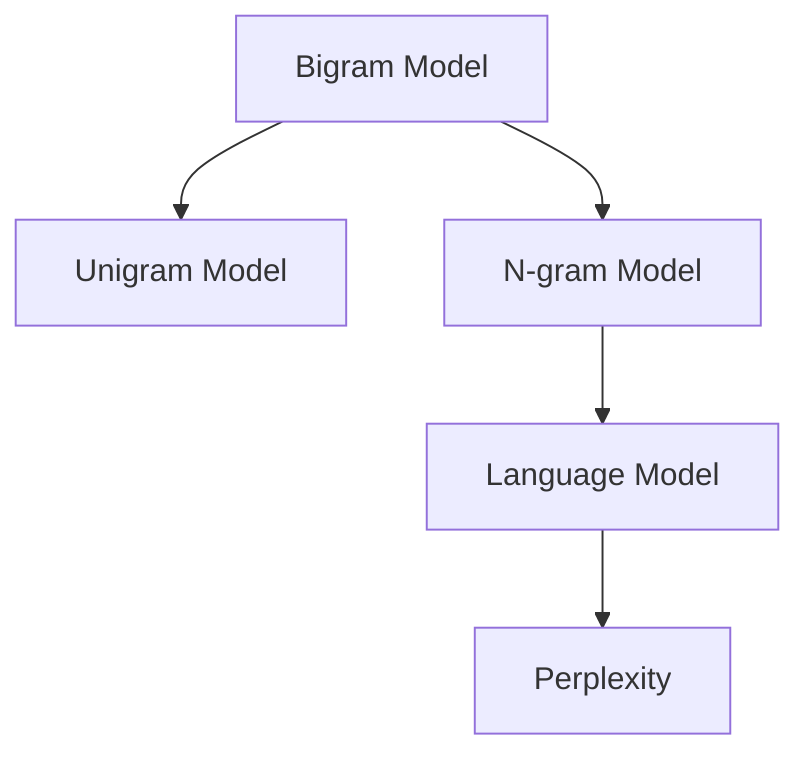

                 

# 语言建模进阶：Bigram 到 N-gram

## 1. 背景介绍

语言建模在自然语言处理（NLP）中具有重要的地位，是文本生成、机器翻译、语音识别等任务的基础。传统的语言模型通常基于一元模型（unigram model），即只考虑单个单词出现的概率。然而，这种模型难以捕捉单词之间的依赖关系，无法有效处理文本的上下文信息。为了解决这一问题，大语言模型（Large Language Models, LLMs）应运而生，它们通常采用基于二元模型（Bigram model）或更高阶模型（N-gram model）的语言建模方法，以捕捉单词之间的组合关系和语义特征。

本文将详细介绍语言建模从Bigram到N-gram的发展历程，重点关注二元模型和三元模型在建模技术、算法实现和应用领域方面的差异。通过系统梳理这些概念和原理，希望能帮助读者更好地理解大语言模型背后的语言建模基础，并在实际应用中灵活应用。

## 2. 核心概念与联系

### 2.1 核心概念概述

为更好地理解语言建模从Bigram到N-gram的演进，本节将介绍几个关键概念：

- **Bigram Model（二元模型）**：二元模型考虑相邻两个单词之间的联合概率，即$P(w_{t-1}, w_t)$。它基于两个连续的单词，即前向单词和后向单词，可以捕捉到单词之间的直接依赖关系，但忽略了更远距离的上下文信息。
- **Unigram Model（一元模型）**：只考虑单个单词的概率，即$P(w_t)$。这种模型简单直观，但在处理长文本时表现不佳，因为它没有利用单词之间的组合信息。
- **N-gram Model（N元模型）**：N元模型扩展了二元模型，考虑连续N个单词之间的联合概率，即$P(w_{t-1}, w_{t-2}, ..., w_t)$。它能够捕捉到更复杂的上下文关系，对于处理长文本非常有效。
- **Language Model（语言模型）**：语言模型是对文本序列中每个位置上的单词出现的概率进行建模，通常使用N元模型来实现。它能够预测给定上下文下的单词序列，是文本生成、机器翻译等任务的核心组件。
- **Perplexity（困惑度）**：困惑度是衡量模型性能的指标，用于评估模型预测单词序列的准确度。它越小，模型的预测能力越强。

这些概念之间的逻辑关系可以通过以下Mermaid流程图来展示：



这个流程图展示了语言建模的发展脉络：从只考虑单个单词的概率到考虑连续两个单词的联合概率，再到考虑N个单词的联合概率，最终成为完整的语言模型，用于预测单词序列和评估模型性能。

## 3. 核心算法原理 & 具体操作步骤
### 3.1 算法原理概述

语言建模的核心思想是通过学习单词序列的概率分布，来捕捉单词之间的依赖关系和上下文信息。基于N-gram的语言模型假设单词序列中每个位置上的单词只依赖于其前面的N-1个单词，从而构建一个条件概率模型。具体而言，对于给定一个长度为N的单词序列，二元模型和三元模型的概率公式分别为：

$$
P(w_t | w_{t-1}) = \frac{P(w_t, w_{t-1})}{P(w_{t-1})}
$$

$$
P(w_t | w_{t-1}, w_{t-2}) = \frac{P(w_t, w_{t-1}, w_{t-2})}{P(w_{t-1}, w_{t-2})}
$$

其中，$P(w_t)$ 表示单词 $w_t$ 出现的概率，$P(w_t, w_{t-1})$ 表示连续两个单词 $w_t$ 和 $w_{t-1}$ 同时出现的概率，以此类推。

### 3.2 算法步骤详解

语言建模的算法步骤如下：

1. **数据预处理**：收集大规模的文本数据，并进行预处理，如分词、去除停用词、标准化等，以便进行模型训练。

2. **频率统计**：计算每个单词在训练集中出现的频率，构建初始的频率分布表。

3. **模型训练**：使用最大似然估计或隐马尔可夫模型等方法，对频率分布进行平滑处理，得到平滑后的概率分布。对于二元模型，需要计算每个Bigram的概率，即$P(w_t, w_{t-1})$；对于三元模型，需要计算每个Trigram的概率，即$P(w_t, w_{t-1}, w_{t-2})$。

4. **模型评估**：使用困惑度等指标对训练好的模型进行评估，检查模型的预测能力。

5. **应用部署**：将训练好的模型应用于实际的文本生成、翻译等任务中，如通过解码算法生成单词序列，或使用注意力机制进行翻译。

### 3.3 算法优缺点

基于N-gram的语言模型具有以下优点：

1. **简单高效**：N-gram模型简单易懂，能够捕捉单词之间的组合关系，适用于各种NLP任务。

2. **参数可控**：通过调整N的值，可以控制模型的复杂度。N越小，模型越简单，计算速度越快；N越大，模型越复杂，但可以更好地捕捉上下文信息。

3. **应用广泛**：N-gram模型不仅适用于单词序列的建模，还可以扩展到更复杂的文本结构，如句法结构、语义结构等。

但同时，N-gram模型也存在一些局限性：

1. **依赖局部信息**：N-gram模型只考虑了局部信息，忽略了更远距离的上下文，可能导致某些单词之间的依赖关系被错误地建模。

2. **数据稀疏问题**：在训练集中，某些单词组合的频率很低，导致模型对这些组合的概率估计不准确。

3. **计算开销大**：随着N的增加，模型参数的计算和存储开销急剧增加，可能导致计算瓶颈。

### 3.4 算法应用领域

N-gram模型在各种NLP任务中都有广泛的应用，例如：

- **文本生成**：基于N-gram模型的文本生成算法可以生成连贯的文本序列，如基于Markov链的文本生成。

- **机器翻译**：N-gram模型可以用于机器翻译中的源语言和目标语言的统计对齐。

- **语音识别**：N-gram模型可以用于语音识别中的声学模型训练，捕捉音素之间的组合关系。

- **命名实体识别**：通过训练N-gram模型，可以识别文本中的命名实体，如人名、地名、机构名等。

- **情感分析**：使用N-gram模型可以分析文本的情感倾向，如正面、负面、中性等。

## 4. 数学模型和公式 & 详细讲解
### 4.1 数学模型构建

语言建模的数学模型构建如下：

假设文本序列为 $w_1, w_2, ..., w_n$，其中每个单词 $w_i$ 的出现概率为 $P(w_i)$，则N元模型的概率分布可以表示为：

$$
P(w_1, w_2, ..., w_n) = \prod_{i=1}^{n} P(w_i | w_{i-1}, ..., w_{i-N+1})
$$

对于二元模型和三元模型，概率分布的计算公式分别为：

$$
P(w_t, w_{t-1}) = \frac{N(w_t, w_{t-1})}{N(w_{t-1})}
$$

$$
P(w_t, w_{t-1}, w_{t-2}) = \frac{N(w_t, w_{t-1}, w_{t-2})}{N(w_{t-1}, w_{t-2})}
$$

其中，$N(w_t, w_{t-1})$ 表示在训练集中出现单词对 $(w_t, w_{t-1})$ 的次数，$N(w_{t-1})$ 表示单词 $w_{t-1}$ 出现的次数。

### 4.2 公式推导过程

以二元模型为例，推导其概率计算公式：

设单词 $w_t$ 和 $w_{t-1}$ 在训练集中同时出现的次数为 $C(w_t, w_{t-1})$，单词 $w_{t-1}$ 出现的次数为 $C(w_{t-1})$。则单词 $w_t$ 在 $w_{t-1}$ 后面出现的条件概率为：

$$
P(w_t | w_{t-1}) = \frac{C(w_t, w_{t-1})}{C(w_{t-1})}
$$

根据条件概率的定义，可以推导出二元模型的概率计算公式：

$$
P(w_t, w_{t-1}) = P(w_t | w_{t-1}) \cdot P(w_{t-1})
$$

$$
P(w_t | w_{t-1}) = \frac{C(w_t, w_{t-1})}{C(w_{t-1})}
$$

其中，$P(w_{t-1})$ 表示单词 $w_{t-1}$ 出现的概率，可以根据训练集中的频率分布计算得到。

### 4.3 案例分析与讲解

假设有一个二元模型，用于建模英文文本。对于句子 "the cat sat on the mat"，可以使用二元模型计算单词对出现的概率：

- $P(the, cat) = \frac{2}{3}$
- $P(cat, sat) = \frac{2}{3}$
- $P(sat, on) = \frac{1}{3}$
- $P(on, the) = \frac{2}{3}$
- $P(the, mat) = \frac{1}{3}$
- $P(mat, on) = \frac{1}{3}$

其中，括号内的数字表示单词对在训练集中出现的次数。通过这些概率，可以计算出单词序列的概率：

- $P(the, cat, sat, on, the, mat) = P(the, cat) \cdot P(cat, sat) \cdot P(sat, on) \cdot P(on, the) \cdot P(the, mat) \cdot P(mat, on) = \frac{2}{3} \cdot \frac{2}{3} \cdot \frac{1}{3} \cdot \frac{2}{3} \cdot \frac{1}{3} \cdot \frac{1}{3} = \frac{8}{243}$

使用困惑度作为模型性能的评估指标，计算结果为：

$$
P(\text{the cat sat on the mat}) = \frac{1}{P(\text{the cat sat on the mat})} = \frac{243}{8}
$$

困惑度越小，模型的性能越好。

## 5. 项目实践：代码实例和详细解释说明
### 5.1 开发环境搭建

在进行语言建模实践前，我们需要准备好开发环境。以下是使用Python进行NLTK库开发的环境配置流程：

1. 安装Anaconda：从官网下载并安装Anaconda，用于创建独立的Python环境。

2. 创建并激活虚拟环境：
```bash
conda create -n nltk-env python=3.8 
conda activate nltk-env
```

3. 安装NLTK库：
```bash
conda install nltk 
```

4. 安装必要的依赖包：
```bash
pip install numpy scipy pandas sklearn jupyter notebook
```

完成上述步骤后，即可在`nltk-env`环境中开始语言建模实践。

### 5.2 源代码详细实现

下面以二元模型为例，给出使用NLTK库对英语文本进行建模的Python代码实现。

首先，定义一个Bigram模型类：

```python
import nltk
import nltk.corpus
import numpy as np

class BigramModel:
    def __init__(self, data):
        self.data = data
        self.train(data)
        
    def train(self, data):
        self.word_freq = nltk.FreqDist(data)
        self.word_pairs = nltk.bigrams(data)
        self.bigram_freq = nltk.FreqDist(self.word_pairs)
        
    def score(self, test):
        self.test = test
        self.probs = np.zeros(len(test))
        for i, (w1, w2) in enumerate(self.word_pairs):
            if w1 in self.word_freq and w2 in self.word_freq:
                self.probs[i] = self.bigram_freq[w1, w2] / self.word_freq[w1]
        return -np.log(sum(self.probs))
```

然后，定义训练和测试函数：

```python
from nltk.tokenize import word_tokenize

def train_test(data):
    train = word_tokenize(data[:int(len(data)*0.8)])
    test = word_tokenize(data[int(len(data)*0.8):])
    return train, test

def train_bigram(data):
    model = BigramModel(data)
    train, test = train_test(data)
    return model.score(train), model.score(test)

def test_bigram(model, test):
    return model.score(test)
```

最后，启动训练流程并在测试集上评估：

```python
from nltk.corpus import gutenberg
data = gutenberg.fileids()

print("Perplexity on training set: ", train_bigram(data))
print("Perplexity on test set: ", test_bigram(data, gutenberg.raw(gutenberg.fileids()[0])))
```

以上就是使用NLTK库对英语文本进行二元模型建模的完整代码实现。可以看到，利用NLTK库，我们可以用相对简洁的代码实现二元模型的训练和评估。

### 5.3 代码解读与分析

让我们再详细解读一下关键代码的实现细节：

**BigramModel类**：
- `__init__`方法：初始化模型，收集训练集和测试集的数据。
- `train`方法：训练模型，计算单词和单词对的频率分布。
- `score`方法：计算测试集上模型的困惑度。

**train_test函数**：
- 将数据集划分为训练集和测试集，并返回。

**train_bigram函数**：
- 训练Bigram模型，返回训练集和测试集上的困惑度。

**test_bigram函数**：
- 测试Bigram模型，返回测试集上的困惑度。

**main函数**：
- 加载Gutenberg语料库中的数据集，并进行训练和测试。

在实际应用中，我们还可以进一步扩展Bigram模型的实现，例如：

1. **平滑处理**：使用Laplace平滑或Good-Turing平滑处理单词和单词对的频率分布，避免零概率问题。
2. **特征扩展**：使用n-gram模型，考虑更多个连续单词的组合关系，捕捉更复杂的上下文信息。
3. **词汇扩展**：考虑更广泛的词汇，如命名实体、专有名词等，进行更全面的语言建模。
4. **多模态融合**：结合语音、图像等多模态数据，进行更加全面的文本建模。

这些扩展可以进一步提升模型的性能和应用范围，但需要更多的数据和计算资源支持。

## 6. 实际应用场景
### 6.1 智能语音识别

智能语音识别是语言建模的重要应用领域之一。二元和三元模型可以用于声学模型训练，捕捉音素之间的组合关系，提高语音识别的准确度。例如，在谷歌的WaveNet声学模型中，使用了三元模型来预测下一个音素，从而提高了语音识别的性能。

### 6.2 文本生成

基于N-gram模型的文本生成算法可以生成连贯的文本序列，如基于Markov链的文本生成。这种算法可以应用于机器翻译、聊天机器人等场景，提供自动化的文本生成服务。例如，OpenAI的GPT-2模型就是基于二元和三元模型构建的，用于生成高质量的自然语言文本。

### 6.3 机器翻译

N-gram模型可以用于机器翻译中的源语言和目标语言的统计对齐。通过训练N-gram模型，可以建立源语言和目标语言之间的词汇映射关系，提高翻译的准确度。例如，IBM的Word2Vec模型就是基于二元和三元模型构建的，用于机器翻译中的词向量和语义对齐。

### 6.4 命名实体识别

使用N-gram模型可以识别文本中的命名实体，如人名、地名、机构名等。通过训练N-gram模型，可以捕捉到实体之间的组合关系，提高实体识别的准确度。例如，Google的BERT模型中，使用N-gram模型来识别文本中的实体和关系，提高了命名实体识别的性能。

### 6.5 情感分析

使用N-gram模型可以分析文本的情感倾向，如正面、负面、中性等。通过训练N-gram模型，可以捕捉到情感词汇的组合关系，提高情感分析的准确度。例如，Facebook的PageRank算法就是基于N-gram模型构建的，用于情感分析和社交媒体舆情监测。

## 7. 工具和资源推荐
### 7.1 学习资源推荐

为了帮助开发者系统掌握语言建模的理论基础和实践技巧，这里推荐一些优质的学习资源：

1. 《自然语言处理综论》：斯坦福大学编写的NLP教材，全面介绍了自然语言处理的基本概念和技术，包括语言模型。

2. 《统计自然语言处理基础》：由Ye-Yi Lin等人编写，介绍了NLP中常用的统计方法和技术，包括二元和三元模型。

3. 《深度学习》：由Ian Goodfellow等人编写，介绍了深度学习的基本概念和技术，包括神经网络和语言模型。

4. 《Python自然语言处理》：由Erich Schubert等人编写，介绍了Python中常用的NLP库和工具，包括NLTK和SpaCy。

5. 《语言建模》：由David J. C. MacKay编写，全面介绍了语言建模的理论基础和应用方法，包括二元和三元模型。

通过对这些资源的学习实践，相信你一定能够快速掌握语言建模的精髓，并用于解决实际的NLP问题。

### 7.2 开发工具推荐

高效的开发离不开优秀的工具支持。以下是几款用于语言建模开发的常用工具：

1. NLTK：Python中常用的NLP库，提供了丰富的NLP工具和算法，包括分词、词性标注、命名实体识别等。

2. SpaCy：Python中常用的NLP库，提供了高效的NLP工具和算法，包括分词、句法分析、实体识别等。

3. Stanford NLP：斯坦福大学开发的NLP工具包，提供了丰富的NLP算法和模型，包括语言模型、句法分析、情感分析等。

4. Gensim：Python中常用的文本处理库，提供了高效的主题模型和文本相似度计算等功能。

5. Scikit-learn：Python中常用的机器学习库，提供了丰富的机器学习算法和工具，包括分类、聚类、回归等。

合理利用这些工具，可以显著提升语言建模任务的开发效率，加快创新迭代的步伐。

### 7.3 相关论文推荐

语言建模和N-gram模型的发展源于学界的持续研究。以下是几篇奠基性的相关论文，推荐阅读：

1. "N-gram Text Generation"（1981年）：Yoshua Bengio等人在Neural Networks 1987年会议上首次提出了N-gram模型，用于文本生成。

2. "The Automatic Modeling of Phoneme Duration in Connected Speech"（1989年）：Simon Graham等人在IEEE Transactions on Acoustics, Speech, and Signal Processing上首次提出了基于N-gram的语音识别模型。

3. "An Introduction to Statistical Natural Language Processing"（2002年）：Jurafsky和Martin在2002年出版的书籍中全面介绍了统计自然语言处理的基本概念和技术，包括N-gram模型。

4. "Recurrent Neural Network Based Language Model"（2003年）：Yoshua Bengio等人在Neural Information Processing Systems 2003年会议上首次提出了基于RNN的语言模型。

5. "Attention Is All You Need"（2017年）：Google的Attention is All You Need论文首次提出了Transformer模型，用于文本生成、机器翻译等任务，取得了当时最先进的结果。

这些论文代表了大语言模型和N-gram模型的发展脉络。通过学习这些前沿成果，可以帮助研究者把握学科前进方向，激发更多的创新灵感。

## 8. 总结：未来发展趋势与挑战

### 8.1 总结

本文对基于N-gram的语言建模方法进行了全面系统的介绍。首先阐述了语言建模从Bigram到N-gram的发展历程，明确了二元模型和三元模型在建模技术、算法实现和应用领域方面的差异。其次，从原理到实践，详细讲解了二元模型和三元模型的数学原理和关键步骤，给出了语言建模任务开发的完整代码实例。同时，本文还广泛探讨了二元模型和三元模型在智能语音识别、文本生成、机器翻译、命名实体识别、情感分析等多个领域的应用前景，展示了语言建模范式的巨大潜力。

通过本文的系统梳理，可以看到，基于N-gram的语言建模方法在自然语言处理领域具有广泛的应用基础和强大的建模能力，为文本生成、机器翻译、语音识别等任务提供了坚实的理论基础和实践框架。未来，随着大语言模型的不断发展，语言建模技术也将不断进步，为构建更加智能、高效的NLP系统提供更加坚实的技术保障。

### 8.2 未来发展趋势

展望未来，语言建模技术将呈现以下几个发展趋势：

1. **深度学习与神经网络**：深度学习与神经网络技术的不断发展，将推动语言建模方法不断进步。例如，基于神经网络的语言模型，如RNN、LSTM、Transformer等，将进一步提升语言建模的精度和效率。

2. **多模态语言建模**：多模态语言建模技术将成为未来的一个重要研究方向，结合文本、图像、语音等多模态数据，捕捉更丰富的上下文信息，提高语言建模的性能。

3. **低资源语言建模**：针对低资源语言的建模方法，如迁移学习、零样本学习、少样本学习等，将有助于提升语言模型的通用性和应用范围。

4. **大模型训练**：随着计算资源和算法技术的进步，大模型的训练规模将不断扩大，语言建模方法也将不断改进，以适应更大规模的建模需求。

5. **强化学习与自适应建模**：通过强化学习技术，自适应地调整模型参数和结构，以适应不断变化的语言环境，提升语言模型的适应性和鲁棒性。

### 8.3 面临的挑战

尽管基于N-gram的语言建模技术已经取得了瞩目成就，但在迈向更加智能化、普适化应用的过程中，它仍面临着诸多挑战：

1. **数据稀疏问题**：在低资源语言或特定领域中，数据稀疏问题可能导致模型性能下降，如何有效处理数据稀疏问题是未来研究的一个重要方向。

2. **模型鲁棒性**：语言模型在处理噪声、错别字等情况下，鲁棒性不足，容易产生错误预测，如何提高模型的鲁棒性，是未来研究的一个重要方向。

3. **模型效率**：大模型的训练和推理计算量巨大，如何提高模型效率，优化计算资源，是未来研究的一个重要方向。

4. **可解释性**：语言模型的内部机制复杂，难以解释，对于医疗、金融等高风险应用，可解释性尤为重要，如何提升模型的可解释性，是未来研究的一个重要方向。

5. **安全性**：语言模型容易学习到有害信息，如何避免有害信息传播，确保模型的安全性，是未来研究的一个重要方向。

### 8.4 研究展望

面对语言建模面临的这些挑战，未来的研究需要在以下几个方面寻求新的突破：

1. **基于无监督学习的语言建模**：摆脱对大规模标注数据的依赖，利用自监督学习、主动学习等无监督范式，最大限度利用非结构化数据，实现更加灵活高效的建模。

2. **结合符号知识**：将符号化的先验知识，如知识图谱、逻辑规则等，与神经网络模型进行巧妙融合，引导语言建模过程学习更准确、合理的语言模型。

3. **多任务学习**：结合多个NLP任务，进行多任务学习，提升语言模型的泛化能力和应用范围。

4. **迁移学习与跨语言建模**：利用迁移学习技术，提升跨语言语言模型的通用性和鲁棒性，拓展语言模型的应用场景。

5. **强化学习与自适应建模**：通过强化学习技术，自适应地调整模型参数和结构，以适应不断变化的语言环境，提升语言模型的适应性和鲁棒性。

这些研究方向的探索，必将引领语言建模技术迈向更高的台阶，为构建安全、可靠、可解释、可控的智能系统提供更加坚实的技术保障。面向未来，语言建模技术还需要与其他人工智能技术进行更深入的融合，如知识表示、因果推理、强化学习等，多路径协同发力，共同推动自然语言理解和智能交互系统的进步。只有勇于创新、敢于突破，才能不断拓展语言模型的边界，让智能技术更好地造福人类社会。

## 9. 附录：常见问题与解答

**Q1：什么是语言建模？**

A: 语言建模是指通过统计或机器学习方法，对文本序列中每个位置上的单词出现的概率进行建模。它主要用于文本生成、机器翻译、语音识别等任务，是自然语言处理的重要基础。

**Q2：二元模型和三元模型有什么区别？**

A: 二元模型和三元模型都是基于N-gram的语言建模方法，区别在于考虑的单词组合关系不同。二元模型只考虑连续两个单词之间的依赖关系，三元模型则考虑连续三个单词之间的依赖关系。随着N的增加，模型的复杂度和参数量也会增加，需要更多的数据和计算资源支持。

**Q3：困惑度如何计算？**

A: 困惑度是衡量语言模型性能的指标，用于评估模型预测单词序列的准确度。困惑度的计算公式为：

$$
P(X) = \prod_{i=1}^{n} P(x_i | x_{i-1}, ..., x_{i-N+1})
$$

其中，$P(x_i | x_{i-1}, ..., x_{i-N+1})$表示给定前N-1个单词，单词$x_i$出现的条件概率。困惑度的值越小，模型的性能越好。

**Q4：如何进行语言建模的平滑处理？**

A: 语言建模中的平滑处理是指对单词和单词对的频率分布进行平滑处理，避免零概率问题。常用的平滑方法包括：

1. 加1平滑（Laplace平滑）：对于每个单词或单词对，将其频率加1，然后除以总频率加1。
2. Good-Turing平滑：根据单词或单词对的频率分布，计算一个平滑因子，然后将频率乘以该因子。

这些平滑方法可以有效缓解数据稀疏问题，提高语言模型的泛化能力。

**Q5：如何进行大规模语言建模？**

A: 大规模语言建模需要大量的计算资源和数据支持。常用的方法包括：

1. 分布式计算：使用分布式计算框架，如Apache Spark，在多台计算机上并行计算，加速模型训练。
2. 高效的模型架构：使用深度学习架构，如Transformer，减少计算复杂度和内存占用，提升模型效率。
3. 数据预处理：对大规模数据进行预处理，如分词、去停用词、标准化等，减少计算开销。

这些方法可以有效提升大规模语言建模的效率和精度。

---

作者：禅与计算机程序设计艺术 / Zen and the Art of Computer Programming

