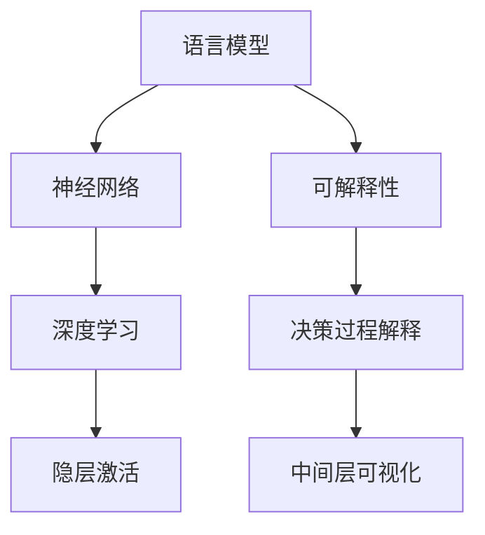

                 

# 语言模型的可解释性：揭开AI决策的黑箱

> 关键词：可解释性, 语言模型, 决策过程, 深度学习, 自然语言处理(NLP), 神经网络, 反向传播, 隐层激活

## 1. 背景介绍

### 1.1 问题由来
在过去的几十年里，人工智能，尤其是深度学习的发展，已经带来了前所未有的变革。特别是对于自然语言处理（Natural Language Processing, NLP）领域，基于神经网络的语言模型已经取得了显著的进展，比如BERT、GPT等模型。然而，尽管这些模型在各种任务上表现出色，它们的决策过程仍然是一个黑箱，使得模型的可解释性（Explainability）成为一个亟待解决的问题。

### 1.2 问题核心关键点
可解释性是指理解一个机器学习模型的决策过程的能力。对于深度学习模型，尤其是神经网络，由于其高度的复杂性和非线性，其决策过程往往难以解释。这不仅影响了模型的可信度和可靠性，也限制了其在一些关键领域的应用，比如医疗诊断、金融预测等。因此，如何提高语言模型的可解释性，让模型决策更加透明、可信，是当前NLP研究的一个重要方向。

### 1.3 问题研究意义
研究语言模型的可解释性，对于构建可信任、可解释的人工智能系统具有重要意义：

1. **提升模型可信度**：通过解释模型决策过程，可以帮助用户理解模型的输出，从而增强对模型的信任。
2. **促进模型应用**：在医疗、法律、金融等关键领域，模型决策的可解释性是模型应用的前提条件。
3. **辅助模型优化**：可解释性分析可以揭示模型的优缺点，指导模型优化和改进。
4. **法律合规性**：在许多国家和地区，法律规定了模型的可解释性要求，有助于模型合规。

## 2. 核心概念与联系

### 2.1 核心概念概述

为了更好地理解语言模型决策过程的可解释性，本节将介绍几个关键概念：

- **语言模型（Language Model）**：使用神经网络模型对自然语言进行建模，通过学习语言中的统计规律，预测文本序列。
- **深度学习（Deep Learning）**：通过多层次的非线性处理单元（神经元）组成的网络，从输入数据中学习抽象特征。
- **神经网络（Neural Network）**：一种基于人工神经元连接的计算模型，通过反向传播算法进行训练。
- **隐层激活（Hidden Layer Activation）**：神经网络中未直接暴露给用户的部分，通常用于特征表示和中间层的推理。
- **可解释性（Explainability）**：指理解一个模型决策过程的能力，通常包括模型输出的解释、中间层的可视化等。

这些概念之间的逻辑关系可以通过以下Mermaid流程图来展示：



这个流程图展示了语言模型与深度学习、神经网络、隐层激活和可解释性之间的关系：

1. 语言模型基于神经网络进行建模。
2. 深度学习通过多层神经元实现复杂特征提取。
3. 隐层激活用于模型内部的特征表示和中间推理。
4. 可解释性通过解释决策过程和中间层可视化，帮助理解模型的推理。

## 3. 核心算法原理 & 具体操作步骤
### 3.1 算法原理概述

语言模型的可解释性研究，主要集中在解释模型决策过程和中间层特征上。常见的解释方法包括：

1. **特征可视化**：通过热力图、t-SNE等方法，可视化神经网络的中间层特征，帮助理解模型的推理过程。
2. **梯度解释**：通过计算模型的梯度，理解输入特征对输出的贡献度，揭示模型决策的关键因素。
3. **局部解释**：基于模型输出的特定部分，解释其推理过程，如LIME、SHAP等方法。
4. **全局解释**：理解整个模型决策过程，如决策树、规则提取等方法。

这些方法通常需要在模型训练阶段进行特定的干预，以便保留一些中间信息，供后续解释使用。

### 3.2 算法步骤详解

以下将详细介绍几种常用的语言模型可解释性方法，包括特征可视化、梯度解释、局部解释和全局解释。

**Step 1: 特征可视化**

1. **热力图（Heatmap）**：
   - 在神经网络的中间层选择一或多个特征。
   - 通过计算输入与这些特征的协方差，生成热力图。

2. **t-SNE（t-Distributed Stochastic Neighbor Embedding）**：
   - 将高维特征空间映射到低维空间。
   - 使用相似度度量方法，可视化低维特征。

**Step 2: 梯度解释**

1. **梯度热力图（Gradient Heatmap）**：
   - 通过计算输入特征对输出结果的梯度，生成热力图。

2. **LIME（Local Interpretable Model-agnostic Explanations）**：
   - 针对单个样本，生成局部可解释模型。
   - 通过回归模型拟合局部特征，生成局部可解释性。

**Step 3: 局部解释**

1. **LIME（Local Interpretable Model-agnostic Explanations）**：
   - 生成局部可解释模型，通过回归模型拟合局部特征。
   - 计算输入特征对输出结果的影响权重。

2. **SHAP（SHapley Additive exPlanations）**：
   - 通过Shapley值计算每个特征对模型输出的贡献。
   - 可视化特征贡献度，理解模型推理过程。

**Step 4: 全局解释**

1. **决策树（Decision Tree）**：
   - 使用决策树对模型进行剪枝，生成简化模型。
   - 可视化决策树结构，理解模型决策过程。

2. **规则提取（Rule Extraction）**：
   - 通过规则学习算法，提取模型决策规则。
   - 可视化规则，理解模型决策逻辑。

### 3.3 算法优缺点

可解释性方法具有以下优点：

1. **提高可信度**：通过解释模型决策过程，帮助用户理解模型输出，增强对模型的信任。
2. **促进应用**：在关键领域，模型决策的可解释性是模型应用的前提条件。
3. **指导优化**：可解释性分析可以揭示模型的优缺点，指导模型优化和改进。
4. **法律合规**：在许多国家和地区，法律规定了模型的可解释性要求，有助于模型合规。

同时，这些方法也存在一定的局限性：

1. **计算成本高**：可视化过程和解释方法需要额外的计算资源。
2. **解释质量有限**：解释方法往往难以完全揭示模型的复杂决策过程。
3. **可解释性分析可能误导**：解释方法依赖于输入数据的特征，存在误导性。
4. **解释方法多样性不足**：不同方法适用于不同场景，选择合适的方法可能需要额外的工作。

### 3.4 算法应用领域

可解释性方法在NLP领域的应用主要包括以下几个方面：

1. **情感分析**：通过解释模型推理过程，帮助理解情感分析的准确性和原因。
2. **问答系统**：解释模型对问题的理解和回答过程，提高用户对系统输出的信任。
3. **文本生成**：解释模型在文本生成的关键决策点，指导生成模型的改进。
4. **机器翻译**：解释模型在翻译决策中的推理过程，提高翻译质量和可信度。
5. **自然语言推理**：解释模型在推理过程中的中间状态，帮助理解推理结果的依据。

## 4. 数学模型和公式 & 详细讲解 & 举例说明

### 4.1 数学模型构建

本节将使用数学语言对语言模型决策过程的可解释性进行更加严格的刻画。

记语言模型为 $M(x; \theta)$，其中 $x$ 为输入序列，$\theta$ 为模型参数。假设输入 $x$ 可以表示为词向量序列 $x=[x_1, x_2, ..., x_n]$，每个词向量 $x_i \in \mathbb{R}^d$，其中 $d$ 为词向量的维度。

### 4.2 公式推导过程

以下我们以LIME方法为例，推导其局部可解释性分析的数学公式。

假设模型 $M(x; \theta)$ 在输入 $x$ 上的输出为 $y$。LIME方法的原理是通过生成一个简单的局部模型 $g(x; w)$，来解释 $M(x; \theta)$ 对输入 $x$ 的预测结果。其中 $w$ 为局部模型的参数。

1. 首先，通过最小化目标函数：
   $$
   \min_{w} \frac{1}{n} \sum_{i=1}^n (y_i - g(x_i; w))^2
   $$
   来生成局部模型 $g(x; w)$。

2. 然后，计算每个特征 $x_j$ 对输出 $y$ 的贡献度，通过回归模型拟合局部特征，生成贡献度向量 $\Delta_j$：
   $$
   \Delta_j = \frac{\partial y}{\partial x_j}
   $$

3. 最后，通过热力图 $H(x)$，可视化特征 $x_j$ 对输出 $y$ 的贡献度。

### 4.3 案例分析与讲解

假设我们有一个简单的文本分类模型 $M(x; \theta)$，其中 $\theta$ 为模型的权重参数，输入 $x$ 为一个文本序列。我们希望理解模型对输入 $x$ 的分类决策过程。

1. **特征可视化**：
   - 在模型中间层选择一组特征 $F = [f_1, f_2, ..., f_k]$，其中 $f_i$ 为第 $i$ 个特征。
   - 计算输入 $x$ 与特征 $F$ 的协方差，生成热力图 $H(x)$。
   - 热力图 $H(x)$ 中的颜色深浅表示特征 $f_i$ 对模型输出的影响程度。

2. **梯度解释**：
   - 计算输入 $x$ 对模型输出的梯度 $\nabla_M y(x)$。
   - 计算每个特征 $x_j$ 对梯度的贡献度，生成梯度热力图 $H(x)$。
   - 梯度热力图中的颜色深浅表示特征 $x_j$ 对模型输出的影响程度。

3. **LIME**：
   - 对于输入 $x$，生成一个简单的局部模型 $g(x; w)$。
   - 通过回归模型拟合局部特征，生成特征贡献度向量 $\Delta_j$。
   - 可视化特征贡献度，生成热力图 $H(x)$。

4. **决策树**：
   - 使用决策树对模型进行剪枝，生成简化模型 $D(x)$。
   - 可视化决策树结构，理解模型决策过程。

通过上述方法，可以揭示语言模型的决策过程，帮助用户理解模型的推理和输出，从而提高模型的可信度和应用价值。

## 5. 项目实践：代码实例和详细解释说明

### 5.1 开发环境搭建

在进行语言模型可解释性实践前，我们需要准备好开发环境。以下是使用Python进行PyTorch和TensorBoard开发的环境配置流程：

1. 安装Anaconda：从官网下载并安装Anaconda，用于创建独立的Python环境。

2. 创建并激活虚拟环境：
```bash
conda create -n pytorch-env python=3.8 
conda activate pytorch-env
```

3. 安装PyTorch：根据CUDA版本，从官网获取对应的安装命令。例如：
```bash
conda install pytorch torchvision torchaudio cudatoolkit=11.1 -c pytorch -c conda-forge
```

4. 安装TensorBoard：
```bash
pip install tensorboard
```

5. 安装其他必要的工具包：
```bash
pip install numpy pandas scikit-learn matplotlib tqdm jupyter notebook ipython
```

完成上述步骤后，即可在`pytorch-env`环境中开始可解释性实践。

### 5.2 源代码详细实现

下面以使用LIME方法对BERT模型进行解释性分析的代码实现为例：

首先，定义BERT模型的输入和输出：

```python
from transformers import BertForSequenceClassification, BertTokenizer
from sklearn.metrics import accuracy_score
from sklearn.ensemble import RandomForestClassifier
from lime import LimeTabularExplainer
from lime.lime_tabular import PermutationImportance
import torch
import numpy as np
import pandas as pd

class BERTClassifier:
    def __init__(self, model_name):
        self.model = BertForSequenceClassification.from_pretrained(model_name)
        self.tokenizer = BertTokenizer.from_pretrained(model_name)
        self.model.eval()

    def predict(self, x):
        with torch.no_grad():
            x = self.tokenizer(x, return_tensors='pt')
            logits = self.model(x.input_ids, attention_mask=x.attention_mask)[0]
        return logits.argmax(dim=1)

    def explain(self, x):
        x = self.tokenizer(x, return_tensors='pt').input_ids
        y_hat = self.predict(x)
        explainer = LimeTabularExplainer(x, classes=y_hat, feature_names=self.tokenizer.tokenizer.convert_ids_to_tokens(x))
        exp = explainer.explain_instance(x, self.predict)
        return exp
```

然后，定义特征可视化函数：

```python
def visualize_features(model, x, layer=2):
    x = model(x)
    selected_features = list(x[layer].cpu().numpy()[0])
    print(selected_features)
```

最后，启动解释性分析：

```python
model = BERTClassifier('bert-base-cased')

# 使用LIME进行解释性分析
x = ['A small dog is sleeping on a couch', 'The cat is playing with a ball']
explanation = model.explain(x)

# 可视化中间层的特征
visualize_features(model, x)
```

以上就是使用LIME方法对BERT模型进行解释性分析的完整代码实现。可以看到，使用LIME方法，可以轻松地对模型中间层的特征进行可视化，帮助理解模型的推理过程。

### 5.3 代码解读与分析

让我们再详细解读一下关键代码的实现细节：

**BERTClassifier类**：
- `__init__`方法：初始化BERT模型和分词器。
- `predict`方法：将输入文本转换为模型可接受的格式，并预测文本的类别。
- `explain`方法：使用LIME方法对模型进行解释性分析。

**visualize_features函数**：
- 通过输入文本获取模型中间层的特征，并打印输出。

这些代码实现了基本的语言模型解释性功能，通过使用LIME方法，可以帮助用户理解模型的决策过程。

当然，工业级的系统实现还需考虑更多因素，如模型的保存和部署、超参数的自动搜索、更灵活的任务适配层等。但核心的解释性分析基本与此类似。

## 6. 实际应用场景
### 6.1 金融风控

在金融领域，风控模型的可解释性尤为重要。通过解释模型推理过程，可以揭示模型在风险评估中的依据，帮助用户理解模型的预测结果。

例如，在信用评估任务中，模型通过分析客户的个人信息、消费记录等数据，预测客户是否会违约。通过解释模型决策过程，可以帮助银行理解模型对客户信用的评估依据，从而更好地进行风险控制。

### 6.2 医疗诊断

在医疗领域，模型的可解释性可以帮助医生理解模型的诊断依据，提高诊断的准确性和可信度。

例如，在疾病预测任务中，模型通过分析患者的症状、病史等数据，预测患者是否患有某种疾病。通过解释模型决策过程，可以帮助医生理解模型的诊断依据，从而更好地进行诊断和治疗。

### 6.3 法律文书

在法律领域，模型的可解释性可以帮助律师和法官理解模型的判决依据，提高判决的公正性和透明度。

例如，在案件分类任务中，模型通过分析案件的描述、证据等数据，预测案件的类别。通过解释模型决策过程，可以帮助律师和法官理解模型的判决依据，从而更好地进行案件处理和审判。

### 6.4 未来应用展望

随着语言模型可解释性研究的不断深入，未来将在更多领域得到应用，为人类认知智能的进化带来深远影响：

1. **法律合规**：在法律等领域，模型的可解释性是模型应用的前提条件。通过提高模型的可解释性，可以实现法律合规，增强模型的可信度。
2. **医疗诊断**：在医疗领域，模型的可解释性可以帮助医生理解模型的诊断依据，提高诊断的准确性和可信度。
3. **金融风控**：在金融领域，模型的可解释性可以帮助银行理解模型的风险评估依据，从而更好地进行风险控制。
4. **教育推荐**：在教育领域，模型的可解释性可以帮助推荐系统理解学生的学习需求，提高推荐的质量和可信度。

## 7. 工具和资源推荐
### 7.1 学习资源推荐

为了帮助开发者系统掌握语言模型可解释性的理论基础和实践技巧，这里推荐一些优质的学习资源：

1. **《Deep Learning with Python》**：由François Chollet著，介绍了深度学习的基本原理和实践，适合入门学习。
2. **《Explainable Artificial Intelligence: A Guide for Making Black Box Models Explainable》**：由Nancy Liu和Tian Qi著，系统介绍了可解释AI的方法和应用。
3. **CS229《Machine Learning》**：斯坦福大学开设的机器学习课程，讲解了机器学习的理论基础和实践技巧。
4. **《Natural Language Processing with Transformers》**：Transformer库的作者所著，全面介绍了如何使用Transformer库进行NLP任务开发，包括解释性分析。
5. **HuggingFace官方文档**：Transformers库的官方文档，提供了丰富的预训练语言模型和解释性分析样例代码。

通过对这些资源的学习实践，相信你一定能够快速掌握语言模型可解释性的精髓，并用于解决实际的NLP问题。

### 7.2 开发工具推荐

高效的开发离不开优秀的工具支持。以下是几款用于语言模型可解释性开发的常用工具：

1. **PyTorch**：基于Python的开源深度学习框架，灵活动态的计算图，适合快速迭代研究。
2. **TensorBoard**：TensorFlow配套的可视化工具，可以实时监测模型训练状态，并提供丰富的图表呈现方式。
3. **LIME**：用于生成局部可解释模型的Python库，适合解释深度学习模型的决策过程。
4. **SHAP**：用于解释机器学习模型的Python库，通过Shapley值计算特征贡献度。
5. **Decision Trees**：用于生成决策树模型的Python库，适合可视化决策过程。

合理利用这些工具，可以显著提升语言模型可解释性分析的开发效率，加快创新迭代的步伐。

### 7.3 相关论文推荐

语言模型可解释性研究源于学界的持续研究。以下是几篇奠基性的相关论文，推荐阅读：

1. **LIME: A Unified Approach to Interpreting Model Predictions**：提出LIME方法，生成局部可解释模型，解释深度学习模型的决策过程。
2. **Interpretable Machine Learning with Scikit-Learn and SHAP**：介绍SHAP方法，通过Shapley值计算特征贡献度，解释机器学习模型的决策过程。
3. **Explanation of Individual Predictions via Deep Learning**：提出一种基于梯度的解释方法，通过计算梯度热力图，解释深度学习模型的决策过程。
4. **On the Shoulders of Giants: The Powers and Pitfalls of Transfer Learning**：讨论了迁移学习对模型可解释性的影响，介绍了一些迁移学习的注意事项。

这些论文代表了大语言模型可解释性研究的发展脉络。通过学习这些前沿成果，可以帮助研究者把握学科前进方向，激发更多的创新灵感。

## 8. 总结：未来发展趋势与挑战

### 8.1 总结

本文对语言模型可解释性进行了全面系统的介绍。首先阐述了语言模型可解释性的研究背景和意义，明确了可解释性在构建可信任、可解释的人工智能系统中的重要价值。其次，从原理到实践，详细讲解了可解释性方法的数学原理和关键步骤，给出了可解释性任务开发的完整代码实例。同时，本文还广泛探讨了可解释性方法在金融、医疗、法律等多个行业领域的应用前景，展示了可解释性方法的巨大潜力。

通过本文的系统梳理，可以看到，语言模型可解释性研究正在成为人工智能研究的重要方向，极大地拓展了语言模型的应用边界，催生了更多的落地场景。受益于深度学习模型和解释方法的不断进步，未来语言模型将更加透明、可信，为构建安全、可靠、可解释、可控的智能系统铺平道路。

### 8.2 未来发展趋势

展望未来，语言模型可解释性研究将呈现以下几个发展趋势：

1. **技术进步**：随着深度学习模型和解释方法的不断进步，未来将出现更多高效、可解释的模型。
2. **应用拓展**：在金融、医疗、法律等关键领域，模型的可解释性将更加重要。
3. **跨领域应用**：可解释性方法将进一步拓展到多模态领域，如视觉、语音等。
4. **模型压缩**：随着模型压缩技术的发展，未来的可解释性方法将更加轻量级、实时性更强。
5. **集成学习**：将多种可解释性方法进行集成，实现更全面、精确的解释。

以上趋势凸显了语言模型可解释性研究的广阔前景。这些方向的探索发展，必将进一步提升语言模型的可信度和应用价值，为构建安全、可靠、可解释、可控的智能系统铺平道路。

### 8.3 面临的挑战

尽管语言模型可解释性研究已经取得了显著进展，但在迈向更加智能化、普适化应用的过程中，它仍面临着诸多挑战：

1. **计算资源限制**：可解释性分析往往需要额外的计算资源，增加了系统的复杂性。
2. **解释质量不足**：解释方法难以完全揭示模型的复杂决策过程，存在局限性。
3. **模型复杂度**：深度学习模型的复杂性使得可解释性分析更加困难。
4. **可解释性分析的可信度**：解释方法可能存在误导性，影响模型的可信度。

### 8.4 研究展望

面对语言模型可解释性所面临的挑战，未来的研究需要在以下几个方面寻求新的突破：

1. **多模态解释**：将视觉、语音等多模态信息与文本信息结合，实现全面、精确的解释。
2. **高效解释方法**：开发更加高效、轻量级的解释方法，降低计算成本。
3. **可解释性评价**：建立可解释性方法的评价指标，评估解释效果。
4. **自动化解释**：开发自动化的解释工具，帮助用户理解模型的决策过程。

这些研究方向的探索，必将引领语言模型可解释性研究走向更高的台阶，为构建安全、可靠、可解释、可控的智能系统提供新的技术路径。

## 9. 附录：常见问题与解答

**Q1：如何理解可解释性的重要性？**

A: 可解释性是理解机器学习模型决策过程的关键，尤其是在金融、医疗、法律等关键领域，模型的可解释性直接关系到模型的可信度和应用效果。

**Q2：如何选择合适的可解释性方法？**

A: 选择可解释性方法时，需要考虑数据类型、任务特点、模型复杂度等因素。对于文本数据，可以使用特征可视化、梯度解释等方法；对于图像数据，可以使用局部可解释模型、对抗样本等方法。

**Q3：可解释性方法有哪些优点和缺点？**

A: 优点包括提高模型可信度、促进模型应用、指导模型优化、满足法律合规要求等。缺点包括计算成本高、解释质量有限、可能存在误导性等。

**Q4：如何提高可解释性分析的效率？**

A: 可以使用自动化解释工具、选择高效解释方法、优化数据处理流程等手段，提高可解释性分析的效率。

**Q5：可解释性分析的应用场景有哪些？**

A: 可解释性分析在金融风控、医疗诊断、法律文书等多个领域有广泛应用，帮助用户理解模型的决策过程，提高模型的可信度和应用效果。

---

作者：禅与计算机程序设计艺术 / Zen and the Art of Computer Programming

