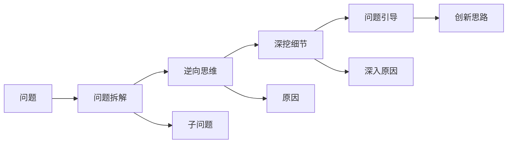

                 

# 费曼提问法在管理问题诊断中的应用

在管理中，面对复杂多变的业务问题，如何从纷繁复杂的现象中抽丝剥茧，找到问题的根本原因，制定有效的解决方案，是每个管理者面临的巨大挑战。费曼提问法（Feynman Technique）作为信息抽取与思考利器，在管理问题诊断中扮演着重要的角色。本文将系统介绍费曼提问法的核心概念与原理，结合实际案例深入讲解其操作步骤与技巧，并探讨其在管理问题诊断中的应用前景。

## 1. 背景介绍

费曼提问法是由著名物理学家理查德·费曼（Richard Feynman）提出的一种自我理解和深入思考的方法。该方法通过将复杂问题拆解为一系列简单、具体、易于理解的问题，引导思维深入挖掘问题的本质，从而达到深度理解和创新的目的。在现代管理领域，费曼提问法已经被广泛用于问题诊断、决策制定、团队协作等多个环节，成为提升团队创新能力和决策水平的利器。

### 1.1 问题由来

在项目管理、企业战略规划、运营优化等场景中，常见的问题包括：

- 项目进度延迟，原因是什么？
- 销售额下降，影响因素有哪些？
- 客户满意度低，根本原因是什么？

这些问题往往涉及多个部门、多条业务线，且原因复杂多样，传统线性思维方法难以迅速厘清。费曼提问法则提供了一种系统化、结构化的分析框架，帮助管理者通过层层剖析，快速定位问题，制定有效应对策略。

### 1.2 问题核心关键点

费曼提问法包含以下几个核心关键点：

- **问题拆解**：将复杂问题拆分为多个具体、易于理解的小问题。
- **逆向思维**：从结果开始思考，逆推问题产生的根源。
- **深挖细节**：通过层层追问，深入挖掘问题背后深层次的原因。
- **问题引导**：用提问引导团队思考，激发创新灵感。

这些关键点通过信息提取、结构化分析、深度挖掘等步骤，帮助管理者逐步找到问题的根本原因，制定出科学合理的解决方案。

## 2. 核心概念与联系

### 2.1 核心概念概述

费曼提问法基于信息提取和逆向思维，通过拆分问题、逆推原因、深挖细节和引导思考，逐步揭示问题的本质。该方法主要包括以下几个核心概念：

- **问题拆解**：将复杂问题拆解为若干小问题，便于理解和分析。
- **逆向思维**：从最终结果开始，逆推原因，逐步找到问题的根源。
- **深挖细节**：对每个小问题进行深入挖掘，找到更深层次的原因。
- **问题引导**：通过不断提出问题，引导团队深入思考，激发创新。

这些概念通过逻辑链条串联起来，形成了一套系统化、结构化的思维框架，帮助管理者从繁杂的信息中抽丝剥茧，找到问题的本质。

### 2.2 核心概念原理和架构的 Mermaid 流程图

该图展示了费曼提问法的核心流程：

1. 从问题开始，拆解为多个子问题。
2. 从最终结果开始，逆向思维，寻找原因。
3. 对每个子问题进行深入挖掘，找到更深层次的原因。
4. 通过不断提问，引导团队深入思考，激发创新。

这些步骤环环相扣，形成一个循环迭代的过程，逐步逼近问题的本质，最终找到有效的解决方案。

## 3. 核心算法原理 & 具体操作步骤

### 3.1 算法原理概述

费曼提问法的核心原理基于信息提取和逆向思维。通过将复杂问题拆解为若干小问题，引导思维逆推问题的根源，同时深入挖掘每个小问题背后的细节，最终引导团队进行深入思考，提出创新解决方案。

具体来说，费曼提问法主要包含以下几个步骤：

1. **问题拆解**：将复杂问题拆解为具体、易于理解的小问题。
2. **逆向思维**：从最终结果开始，逆推问题产生的根源。
3. **深挖细节**：对每个小问题进行深入挖掘，找到更深层次的原因。
4. **问题引导**：通过不断提出问题，引导团队深入思考，激发创新。

### 3.2 算法步骤详解

以下是一个典型的费曼提问法应用案例，以项目进度延迟为例进行详细讲解。

#### 案例背景

假设一家软件公司的一个项目进度严重延迟，且涉及多个部门和多项工作。项目经理希望通过费曼提问法找到问题的根源，并制定有效的解决方案。

#### 第一步：问题拆解

项目经理首先列出项目进度延迟的主要原因，包括但不限于：

- 项目范围不清晰
- 资源分配不合理
- 技术瓶颈
- 沟通不畅
- 客户需求变动

针对这些问题，进一步拆解为更具体的小问题：

- 项目范围不清晰：具体问题是什么？如何识别？
- 资源分配不合理：有哪些不合理之处？如何优化？
- 技术瓶颈：哪些技术影响了进度？如何解决？
- 沟通不畅：沟通存在哪些问题？如何改进？
- 客户需求变动：变动原因是什么？如何预测？

通过问题拆解，将复杂问题逐步简化，便于深入分析。

#### 第二步：逆向思维

针对每个小问题，从最终结果（项目进度延迟）逆推问题产生的根源。例如，针对“技术瓶颈”这一问题，项目经理可以问：

- 项目延迟的直接原因是什么？
- 哪些技术环节影响了进度？
- 技术瓶颈的根本原因是什么？

通过逆向思维，逐步找到问题的根源。

#### 第三步：深挖细节

针对逆推出的根源，深入挖掘每个小问题的细节。例如，针对“技术瓶颈”，项目经理可以进一步问：

- 技术瓶颈的具体表现是什么？
- 哪些技术环节出现了问题？
- 技术瓶颈的原因是什么？
- 如何改进技术环节？

通过深挖细节，找到问题的具体原因。

#### 第四步：问题引导

通过不断提出问题，引导团队深入思考，激发创新灵感。例如，针对“资源分配不合理”这一问题，项目经理可以问：

- 资源分配不合理的具体表现是什么？
- 如何更合理地分配资源？
- 资源分配不合理的原因是什么？
- 如何改进资源分配流程？

通过问题引导，激发团队成员的思考和创新，共同寻找解决方案。

### 3.3 算法优缺点

费曼提问法的优点包括：

- **系统化思维**：通过问题拆解和逆向思维，引导思维系统化分析问题。
- **深入挖掘**：通过深挖细节，找到问题的根源。
- **团队协作**：通过问题引导，激发团队创新，促进协作。

其缺点包括：

- **时间成本高**：初期问题拆解和逆向思维需要时间投入。
- **依赖提问质量**：提问质量决定了分析效果，需要不断提升提问能力。

### 3.4 算法应用领域

费曼提问法在以下领域有广泛应用：

- **项目管理**：用于项目进度管理、风险控制、问题诊断等。
- **运营管理**：用于业务流程优化、质量控制、成本降低等。
- **产品管理**：用于需求分析、用户反馈、产品迭代等。
- **战略管理**：用于市场分析、竞争策略、资源配置等。

在各个领域，费曼提问法均能帮助管理者从复杂问题中提取关键信息，找到问题根源，制定有效解决方案。

## 4. 数学模型和公式 & 详细讲解 & 举例说明

费曼提问法主要依赖于信息提取和逻辑推理，不涉及复杂的数学模型。但在实际操作中，可以通过数学模型进一步分析问题，找到更深层次的解决方案。

### 4.1 数学模型构建

费曼提问法不涉及数学模型，但可以通过一些辅助模型帮助理解问题。例如，利用因果图(Causal Graph)将问题及其因果关系可视化，帮助团队更直观地理解问题。

### 4.2 公式推导过程

由于费曼提问法不涉及数学公式，故此部分略过。

### 4.3 案例分析与讲解

假设一家零售企业在销售下滑后，通过费曼提问法找到问题的根源。具体步骤包括：

1. **问题拆解**：销售下滑的原因可能包括市场环境变化、产品质量问题、库存管理不善等。
2. **逆向思维**：从最终结果（销售下滑）逆推原因，可能找到产品库存过高、市场推广不足等。
3. **深挖细节**：进一步挖掘库存管理不善的具体原因，如库存积压、库存周转率低等。
4. **问题引导**：通过不断提问，引导团队深入思考，提出改进库存管理的方法，如优化供应链流程、提高库存周转率等。

通过这些问题，零售企业最终找到了销售下滑的根本原因，并制定了具体的改进措施。

## 5. 项目实践：代码实例和详细解释说明

费曼提问法主要用于思考和分析，不涉及具体的代码实现。但在实际应用中，可以使用一些项目管理工具来辅助进行问题拆解和引导团队思考。

### 5.1 开发环境搭建

费曼提问法的开发环境主要涉及项目管理工具和协作平台。常见工具包括：

- **项目管理工具**：如JIRA、Trello等，用于任务管理和进度跟踪。
- **协作平台**：如Slack、Confluence等，用于团队沟通和文档共享。
- **绘图工具**：如Lucidchart、Cacoo等，用于绘制因果图。

### 5.2 源代码详细实现

由于费曼提问法不涉及代码实现，故此部分略过。

### 5.3 代码解读与分析

费曼提问法不涉及代码实现，故此部分略过。

### 5.4 运行结果展示

费曼提问法的效果主要体现在问题诊断的准确性和解决方案的创新性上。通过费曼提问法，管理团队能够深入分析问题，找到根源，并制定有效的应对措施。

## 6. 实际应用场景

### 6.1 项目延期管理

在项目管理中，费曼提问法可以用于问题诊断和风险控制。通过将复杂问题拆解为多个小问题，逆向思维，深入挖掘细节，逐步找到问题的根源，制定科学合理的解决方案。

### 6.2 运营流程优化

在运营管理中，费曼提问法可以用于业务流程优化和质量控制。通过问题引导，激发团队思考，提出改进建议，逐步优化流程，提升运营效率。

### 6.3 产品迭代开发

在产品管理中，费曼提问法可以用于需求分析、用户反馈、产品迭代等。通过问题引导，深入理解用户需求，优化产品设计，提升用户体验。

### 6.4 战略规划制定

在战略管理中，费曼提问法可以用于市场分析、竞争策略、资源配置等。通过系统化思维和深入挖掘，找到战略方向，制定科学合理的规划。

## 7. 工具和资源推荐

### 7.1 学习资源推荐

- **《深度思考：费曼学习法》**：介绍费曼学习法的理论基础和实践技巧，适合初学者入门。
- **《富爸爸穷爸爸》**：通过真实案例，展示费曼学习法在投资、理财等方面的应用。
- **《费曼学习法：如何将知识变为能力》**：系统讲解费曼学习法，适合进阶学习者。

### 7.2 开发工具推荐

- **JIRA**：项目管理工具，用于任务管理和进度跟踪。
- **Trello**：项目管理工具，用于任务协作和资源配置。
- **Slack**：协作平台，用于团队沟通和信息同步。
- **Confluence**：协作平台，用于文档共享和知识管理。
- **Lucidchart**：绘图工具，用于绘制因果图。

### 7.3 相关论文推荐

- **《深度思考：费曼学习法》**：介绍费曼学习法的理论基础和实践技巧，适合初学者入门。
- **《富爸爸穷爸爸》**：通过真实案例，展示费曼学习法在投资、理财等方面的应用。
- **《费曼学习法：如何将知识变为能力》**：系统讲解费曼学习法，适合进阶学习者。

## 8. 总结：未来发展趋势与挑战

### 8.1 研究成果总结

费曼提问法作为一种系统化、结构化的思维工具，已在多个领域得到广泛应用，展示了其强大的问题诊断能力。其核心在于问题拆解、逆向思维、深挖细节和问题引导，帮助团队逐步找到问题的根源，制定科学合理的解决方案。

### 8.2 未来发展趋势

未来，费曼提问法在以下方面将持续发展：

- **自动化工具**：开发自动化的费曼提问工具，辅助问题拆解和逆向思维。
- **数据驱动**：结合数据分析工具，利用数据帮助定位问题根源。
- **跨领域应用**：将费曼提问法应用于更多领域，如医疗、教育、金融等，提升各行各业的创新能力。

### 8.3 面临的挑战

尽管费曼提问法在问题诊断中具有显著优势，但仍面临一些挑战：

- **问题拆解复杂性**：复杂问题拆解需要较高的思维能力。
- **逆向思维难度**：逆向思维需要较强的逻辑推理能力。
- **深挖细节深度**：深度挖掘需要大量的时间和精力投入。
- **问题引导难度**：问题引导需要具备较强的领导力和团队协作能力。

### 8.4 研究展望

未来，如何提高问题拆解的自动化程度、增强逆向思维的辅助工具、降低深挖细节的时间成本、优化问题引导的流程，将成为费曼提问法发展的关键。通过这些改进，费曼提问法将更易于应用，助力更多团队提升问题诊断能力。

## 9. 附录：常见问题与解答

### Q1: 什么是费曼提问法？

**A:** 费曼提问法是一种系统化、结构化的思维工具，通过将复杂问题拆解为多个小问题，引导思维逆推问题的根源，同时深入挖掘每个小问题的细节，最终引导团队进行深入思考，提出创新解决方案。

### Q2: 如何应用费曼提问法？

**A:** 应用费曼提问法的主要步骤包括：
1. 问题拆解：将复杂问题拆解为具体、易于理解的小问题。
2. 逆向思维：从最终结果开始，逆推问题产生的根源。
3. 深挖细节：对每个小问题进行深入挖掘，找到更深层次的原因。
4. 问题引导：通过不断提问，引导团队深入思考，激发创新。

### Q3: 费曼提问法的优缺点是什么？

**A:** 费曼提问法的优点包括系统化思维、深入挖掘和团队协作。其缺点包括时间成本高和依赖提问质量。

### Q4: 费曼提问法在哪些领域有应用？

**A:** 费曼提问法在项目管理、运营管理、产品管理、战略管理等多个领域有广泛应用。

### Q5: 如何学习费曼提问法？

**A:** 通过阅读相关书籍和文章，如《深度思考：费曼学习法》、《富爸爸穷爸爸》、《费曼学习法：如何将知识变为能力》等，可以逐步掌握费曼提问法的理论和实践技巧。

---

作者：禅与计算机程序设计艺术 / Zen and the Art of Computer Programming

