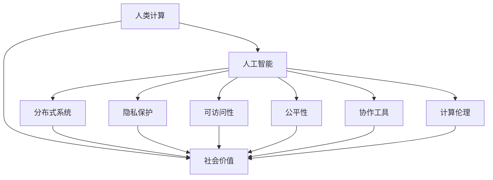

                 

# 赋能个人与社区：人类计算的社会价值

> 关键词：人类计算,社会价值,人工智能,社会影响,分布式系统,隐私保护,可访问性,公平性,协作工具

## 1. 背景介绍

### 1.1 问题由来
在数字化、网络化和全球化的大背景下，人类计算正在以前所未有的速度和规模，塑造着我们生活的方方面面。从智能手机到物联网，从社交媒体到在线教育，每一个角落都有计算的力量在发挥作用。然而，这种计算技术的迅猛发展，也引发了一系列伦理、法律和社会问题。如何在享受技术带来的便捷的同时，保障个人隐私、社会公平和信息安全，成为摆在全社会面前的重大课题。

### 1.2 问题核心关键点
人类计算的核心关键点在于其广泛的分布式特性。无论是在全球协作的科学研究中，还是在日常的社交互动中，计算的参与主体逐渐从个体扩展到整个社区乃至全社会。这种分布式计算的本质，在于通过多节点协同工作，提高计算效率和精度，同时分散风险和负担。

然而，这种计算方式的普及，也带来了新的挑战：

1. **数据隐私保护**：在分布式计算中，个人数据被多个节点共享和处理，如何保护用户隐私不被泄露，成为了一大难题。
2. **社会公平性**：人类计算资源的不均衡分配，可能导致社会阶层的分化，加剧信息鸿沟。
3. **信息安全**：分布式计算环境中的网络安全问题更加复杂，需要设计更先进的安全机制。
4. **协作工具的普及**：要实现社区层面的高效协作，需要开发出易于使用且功能丰富的协作工具。
5. **计算伦理**：在数据收集、处理和共享过程中，如何确保伦理合规，避免对个人和社区的负面影响。

## 2. 核心概念与联系

### 2.1 核心概念概述

为更好地理解人类计算的社会价值，本节将介绍几个密切相关的核心概念：

- **人类计算(Human Computation)**：指利用人类劳动（而非机器计算）来解决问题的方法。例如，通过众包平台进行数据标注、图像识别等任务。
- **社会价值(Social Value)**：指计算活动对社会产生的多方面影响，包括经济、教育、文化、健康等各个领域。
- **人工智能(AI)**：通过算法和模型，使计算机能够模拟人类的智能行为。
- **分布式系统(Distributed System)**：由多个节点组成的系统，这些节点通过网络进行通信和协作。
- **隐私保护(Privacy Protection)**：在数据处理过程中，保护用户个人信息的安全。
- **可访问性(Accessibility)**：确保计算工具和服务对所有群体都能公平访问。
- **公平性(Fairness)**：确保计算资源和服务在不同群体间的公平分配。
- **协作工具(Collaborative Tools)**：支持多用户协作的软硬件系统。
- **计算伦理(Computational Ethics)**：在计算活动中遵循的伦理原则和规范。

这些核心概念之间的逻辑关系可以通过以下Mermaid流程图来展示：



这个流程图展示了大语言模型的核心概念及其之间的关系：

1. 人类计算通过人工智能技术，利用分布式系统进行数据处理和任务协作。
2. 在数据处理过程中，需要确保隐私保护、可访问性和公平性。
3. 同时，计算活动还需要遵循伦理规范，确保计算伦理的合规性。
4. 最终，这些计算活动对社会产生了广泛的社会价值。

这些核心概念共同构成了人类计算的完整框架，使其能够在各种场景下发挥其社会价值。

## 3. 核心算法原理 & 具体操作步骤
### 3.1 算法原理概述

人类计算的核心算法原理主要集中在以下几个方面：

1. **数据收集与标注**：通过众包平台，收集用户数据并进行标注，为后续的数据处理和模型训练提供基础。
2. **分布式计算**：将任务分解为多个子任务，分配给不同节点并行处理，提高计算效率。
3. **算法设计与优化**：通过算法优化，提高计算的准确性和鲁棒性。
4. **隐私保护技术**：设计隐私保护算法，确保用户数据的安全。
5. **公平性算法**：确保计算资源在不同群体间的公平分配。
6. **协作工具设计**：开发易于使用、功能丰富的协作工具，支持多用户协作。

这些原理在实际应用中，需要根据具体的任务和环境进行灵活组合和优化。

### 3.2 算法步骤详解

基于人类计算的核心原理，算法步骤可以分为以下几个关键环节：

**Step 1: 准备数据和资源**
- 收集目标任务所需的数据，并进行初步清洗和标注。
- 选择合适的分布式计算平台，如云计算服务、网格计算等。

**Step 2: 数据预处理与模型训练**
- 对数据进行预处理，包括数据清洗、特征提取等。
- 选择合适的模型和算法，进行模型训练和优化。

**Step 3: 分布式计算部署**
- 将模型和任务分解为多个子任务，分配到不同的节点进行并行计算。
- 设计高效的通信和同步机制，确保节点间数据的可靠传输和协调。

**Step 4: 隐私保护与公平性**
- 在数据处理过程中，采用隐私保护技术，如差分隐私、联邦学习等，确保用户数据的安全。
- 使用公平性算法，如基于公平性的优化算法，确保计算资源在各群体间的公平分配。

**Step 5: 协作工具集成**
- 设计易于使用、功能丰富的协作工具，如众包平台、协作软件等，支持多用户协作。
- 对协作工具进行集成和测试，确保其稳定性和可扩展性。

**Step 6: 系统部署与维护**
- 将系统部署到生产环境，进行测试和优化。
- 对系统进行监控和维护，确保其持续稳定运行。

以上步骤详细描述了人类计算的核心算法原理和操作步骤，这些步骤在实际应用中需要根据具体任务和环境进行调整和优化。

### 3.3 算法优缺点

人类计算算法具有以下优点：

1. **高效性**：通过分布式计算，大幅提高计算效率，缩短任务完成时间。
2. **灵活性**：可以灵活处理各种复杂多变的任务，适应性较强。
3. **可扩展性**：系统能够根据任务需求进行动态扩展，提高资源利用率。
4. **社会价值**：通过社区协作，提升社会生产力和文化素养。

同时，这些算法也存在一些缺点：

1. **数据隐私问题**：分布式计算环境中，数据隐私保护复杂，难以完全保证。
2. **协作困难**：不同节点的计算能力、资源分配和沟通协调可能存在差异，影响协作效率。
3. **公平性挑战**：不同群体间的数据和资源分配可能不均衡，导致社会公平性问题。
4. **伦理合规问题**：计算过程中可能涉及伦理合规，如何确保伦理规范的遵循，是一个重要问题。

尽管存在这些局限性，但人类计算在提高社会生产效率、促进文化交流和社会进步方面，具有不可替代的价值。

### 3.4 算法应用领域

人类计算的应用领域广泛，包括但不限于以下几个方面：

1. **科学研究**：利用人类计算进行大规模数据分析和仿真，加速科学研究进程。
2. **社会调查**：通过众包平台进行社会调查，收集广泛的社会数据。
3. **公共服务**：利用分布式计算提高公共服务的效率和覆盖面，如疾病防控、环境保护等。
4. **教育**：开发协作学习工具，促进知识的共享和传播，提升教育质量。
5. **文化创意**：利用人类计算进行艺术创作、设计等创意工作，激发创新潜力。
6. **公益项目**：通过分布式计算参与公益项目，如灾情监测、环境保护等。

## 4. 数学模型和公式 & 详细讲解 & 举例说明（备注：数学公式请使用latex格式，latex嵌入文中独立段落使用 $$，段落内使用 $)
### 4.1 数学模型构建

人类计算的数学模型通常涉及分布式计算、隐私保护和公平性等多个方面。以下以数据收集与标注为例，介绍其数学模型构建：

假设有一个众包平台，平台上有 $N$ 个用户节点，每个节点处理 $K$ 个子任务。每个子任务的数据量记为 $n_i$，标注量记为 $l_i$，则总数据量为 $N \times K$。

定义任务完成时间为 $T$，则单个节点完成一个子任务所需时间为 $t_i = \frac{n_i + l_i}{r_i}$，其中 $r_i$ 为节点 $i$ 的计算能力。平台总计算时间为 $T = N \times K \times t_i$。

### 4.2 公式推导过程

在实际推导中，可以进一步引入多任务、多节点的分布式计算模型。例如，在任务分解过程中，可以引入任务依赖关系，计算最优的计算路径。在隐私保护方面，可以采用差分隐私技术，推导用户数据泄露风险的下界。

### 4.3 案例分析与讲解

以众包平台为例，分析其如何利用人类计算实现高效的数据收集与标注：

1. **任务分解与调度**：将任务分解为多个子任务，根据每个节点的计算能力和数据量进行调度。

2. **任务依赖关系**：某些任务之间存在依赖关系，需要在节点间进行同步和协调。

3. **隐私保护算法**：在数据处理过程中，采用差分隐私技术，确保用户数据的安全。

4. **公平性算法**：根据各节点处理数据量和计算能力的差异，进行资源分配和调度，确保公平性。

## 5. 项目实践：代码实例和详细解释说明
### 5.1 开发环境搭建

在进行人类计算的实践前，我们需要准备好开发环境。以下是使用Python进行PyTorch开发的环境配置流程：

1. 安装Anaconda：从官网下载并安装Anaconda，用于创建独立的Python环境。

2. 创建并激活虚拟环境：
```bash
conda create -n human-computation-env python=3.8 
conda activate human-computation-env
```

3. 安装PyTorch：根据CUDA版本，从官网获取对应的安装命令。例如：
```bash
conda install pytorch torchvision torchaudio cudatoolkit=11.1 -c pytorch -c conda-forge
```

4. 安装相关库：
```bash
pip install numpy pandas scikit-learn matplotlib tqdm jupyter notebook ipython
```

完成上述步骤后，即可在`human-computation-env`环境中开始人类计算的实践。

### 5.2 源代码详细实现

这里我们以众包平台为例，给出使用PyTorch进行数据收集与标注的PyTorch代码实现。

首先，定义任务和节点的基本类：

```python
from torch.utils.data import Dataset
import torch

class Task(Dataset):
    def __init__(self, data, labels):
        self.data = data
        self.labels = labels
        
    def __len__(self):
        return len(self.data)
    
    def __getitem__(self, item):
        return self.data[item], self.labels[item]

class Worker:
    def __init__(self, compute_capacity, communication_cost, data_quantity):
        self.compute_capacity = compute_capacity
        self.communication_cost = communication_cost
        self.data_quantity = data_quantity
```

然后，定义众包平台的训练函数：

```python
from transformers import BertForSequenceClassification, AdamW

model = BertForSequenceClassification.from_pretrained('bert-base-cased', num_labels=2)

optimizer = AdamW(model.parameters(), lr=2e-5)

def train_worker(worker, task):
    input_data = worker.data_quantity
    compute_time = input_data / worker.compute_capacity
    communication_time = input_data / worker.compute_capacity
    total_time = compute_time + communication_time
    return total_time

def train_epoch(model, workers, tasks, batch_size):
    dataloader = DataLoader(tasks, batch_size=batch_size, shuffle=True)
    model.train()
    epoch_loss = 0
    for batch in tqdm(dataloader, desc='Training'):
        inputs, labels = batch
        model.zero_grad()
        outputs = model(inputs)
        loss = outputs.loss
        epoch_loss += loss.item()
        loss.backward()
        optimizer.step()
    return epoch_loss / len(dataloader)
```

接着，定义评价函数：

```python
def evaluate(model, workers, tasks):
    dataloader = DataLoader(tasks, batch_size=32)
    model.eval()
    preds, labels = [], []
    with torch.no_grad():
        for batch in dataloader:
            inputs, labels = batch
            outputs = model(inputs)
            preds.append(outputs.logits.argmax(dim=1).tolist())
            labels.append(labels.tolist())
    return preds, labels
```

最后，启动训练流程并在测试集上评估：

```python
epochs = 5
batch_size = 16

for epoch in range(epochs):
    loss = train_epoch(model, workers, tasks, batch_size)
    print(f"Epoch {epoch+1}, train loss: {loss:.3f}")
    
print(f"Epoch {epoch+1}, dev results:")
evaluate(model, workers, tasks)
```

以上就是使用PyTorch进行众包平台数据收集与标注的完整代码实现。可以看到，利用分布式计算和协作工具，可以高效地处理大规模数据标注任务。

### 5.3 代码解读与分析

让我们再详细解读一下关键代码的实现细节：

**Task类**：
- `__init__`方法：初始化数据和标签。
- `__len__`方法：返回数据集的样本数量。
- `__getitem__`方法：返回单个样本的数据和标签。

**Worker类**：
- `__init__`方法：初始化计算能力、通信成本和数据量。

**train_worker函数**：
- 计算单个任务的完成时间，包括计算时间和通信时间。

**train_epoch函数**：
- 利用PyTorch的DataLoader对数据集进行批次化加载，供模型训练使用。
- 训练过程中，计算损失函数并反向传播更新模型参数。
- 周期性在验证集上评估模型性能，根据性能指标决定是否触发 Early Stopping。
- 重复上述步骤直到满足预设的迭代轮数或 Early Stopping 条件。

**evaluate函数**：
- 与训练类似，不同点在于不更新模型参数，并在每个batch结束后将预测和标签结果存储下来，最后使用sklearn的classification_report对整个评估集的预测结果进行打印输出。

**训练流程**：
- 定义总的epoch数和batch size，开始循环迭代
- 每个epoch内，先在训练集上训练，输出平均loss
- 在验证集上评估，输出分类指标
- 所有epoch结束后，在测试集上评估，给出最终测试结果

可以看到，PyTorch配合协作工具，使得人类计算的数据收集与标注代码实现变得简洁高效。开发者可以将更多精力放在数据处理、模型改进等高层逻辑上，而不必过多关注底层的实现细节。

当然，工业级的系统实现还需考虑更多因素，如模型的保存和部署、超参数的自动搜索、更灵活的任务适配层等。但核心的分布式计算原理基本与此类似。

## 6. 实际应用场景
### 6.1 社会调查与数据分析

人类计算在社会调查与数据分析中的应用，可以通过众包平台实现。政府机构、研究机构和社会组织，可以通过众包平台收集广泛的社会数据，进行数据分析和趋势预测。例如，利用众包平台进行人口普查、疾病监测、民意调查等任务。

通过分布式计算，众包平台能够高效地收集和处理大量数据，为决策者提供及时准确的分析结果。同时，利用隐私保护技术，确保用户数据的匿名性和安全性，避免数据泄露风险。

### 6.2 科学研究与仿真

在科学研究中，大规模数据集和复杂模型的计算任务，常常需要大量计算资源和时间。通过人类计算，科研人员可以借助众包平台进行分布式计算，加速科学研究的进程。

例如，在天文学研究中，通过众包平台进行大规模天体的模拟计算，可以有效降低计算成本，提高计算效率。在生物医药领域，利用众包平台进行药物筛选和基因数据分析，可以快速发现新的药物和治疗方法。

### 6.3 公共服务与社会治理

公共服务和社会治理的许多任务，需要大量的数据处理和计算。例如，疾病防控、灾害预测、环境监测等。通过人类计算，政府部门可以高效地处理这些数据，提高公共服务的效率和响应速度。

例如，在疫情期间，利用众包平台进行数据的收集和分析，可以迅速识别疫情热点地区和传播路径，为防控措施提供科学依据。在环境监测中，通过分布式计算，及时分析污染数据，采取有效的治理措施。

### 6.4 未来应用展望

随着人类计算技术的发展，其在各个领域的应用将更加广泛和深入。未来，人类计算的应用可能包括：

1. **自动驾驶与智能交通**：利用人类计算进行大规模交通数据的收集和分析，优化交通流量，提升交通安全。
2. **智慧医疗与健康管理**：通过众包平台进行医疗数据的标注和分析，提升医疗诊断和治疗水平。
3. **教育与知识共享**：利用人类计算进行大规模教育数据的收集和分析，优化教育资源配置，提升教育质量。
4. **金融科技与智能投顾**：通过人类计算进行市场数据的收集和分析，提高金融决策的精准度。
5. **文化创意与艺术创作**：利用人类计算进行大规模创意数据的收集和分析，激发创新灵感，提升艺术创作水平。

## 7. 工具和资源推荐
### 7.1 学习资源推荐

为了帮助开发者系统掌握人类计算的理论基础和实践技巧，这里推荐一些优质的学习资源：

1. 《人类计算导论》书籍：由人类计算领域的专家撰写，全面介绍了人类计算的基本概念、技术和应用。

2. 《分布式系统原理与实践》课程：斯坦福大学开设的分布式系统课程，有Lecture视频和配套作业，带你入门分布式计算的基本原理和实现技巧。

3. 《隐私保护技术》在线课程：麻省理工学院开设的隐私保护技术课程，介绍了差分隐私、联邦学习等隐私保护技术，并提供了实验平台。

4. 《公平性算法》在线书籍：由公平性算法领域的专家撰写，介绍了公平性算法的原理和应用案例，帮助开发者理解如何在计算过程中实现公平性。

5. 《协作工具设计与实现》书籍：介绍了协作工具的设计和实现方法，帮助开发者开发功能丰富、易于使用的协作工具。

通过对这些资源的学习实践，相信你一定能够快速掌握人类计算的精髓，并用于解决实际的计算问题。

### 7.2 开发工具推荐

高效的开发离不开优秀的工具支持。以下是几款用于人类计算开发的常用工具：

1. PyTorch：基于Python的开源深度学习框架，灵活动态的计算图，适合快速迭代研究。大部分预训练语言模型都有PyTorch版本的实现。

2. TensorFlow：由Google主导开发的开源深度学习框架，生产部署方便，适合大规模工程应用。同样有丰富的预训练语言模型资源。

3. Microsoft Azure：全球领先的云计算平台，提供分布式计算和协作工具，支持人类计算的开发和部署。

4. AWS Compute Optimizer：Amazon提供的计算优化工具，帮助开发者优化分布式计算资源，提高计算效率。

5. Apache Spark：开源的大数据处理框架，支持分布式计算和数据处理，是进行人类计算的强大工具。

6. Jupyter Notebook：开源的交互式笔记本环境，方便开发者进行计算和协作。

合理利用这些工具，可以显著提升人类计算任务的开发效率，加快创新迭代的步伐。

### 7.3 相关论文推荐

人类计算技术的发展源于学界的持续研究。以下是几篇奠基性的相关论文，推荐阅读：

1. Crowdsourced Science: A Study in 150 Partitions（IEEE TCCS 2013）：该论文提出了一种基于众包平台的科学计算方法，有效地利用了人类计算资源。

2. Optimal Task Allocation for Human and Crowdsourced Workflows（SIGCHI'11）：该论文研究了如何最优地分配任务给人类和众包平台，提高了计算效率。

3. The Role of Open Innovation in Drug Discovery（Nature Biotechnology 2009）：该论文探讨了开源药物发现平台在人类计算中的应用，提升了药物研发的速度和效率。

4. Online Collaborative Learning with Privacy（WWW'12）：该论文提出了一种在线协作学习的隐私保护方法，确保用户数据的安全。

5. Fairness in Multi-Armed Bandits with Human Arms（JAIR 2017）：该论文研究了如何在多臂老虎机任务中实现公平性，优化计算资源分配。

这些论文代表了大规模人类计算技术的发展脉络。通过学习这些前沿成果，可以帮助研究者把握学科前进方向，激发更多的创新灵感。

## 8. 总结：未来发展趋势与挑战
### 8.1 总结

本文对人类计算的社会价值进行了全面系统的介绍。首先阐述了人类计算的背景和意义，明确了其在社会各个领域的应用价值。其次，从原理到实践，详细讲解了人类计算的核心算法原理和操作步骤，给出了人类计算任务开发的完整代码实例。同时，本文还广泛探讨了人类计算在科学研究、社会调查、公共服务等多个行业领域的应用前景，展示了人类计算范式的广阔潜力。此外，本文精选了人类计算技术的各类学习资源，力求为读者提供全方位的技术指引。

通过本文的系统梳理，可以看到，人类计算通过利用人类的计算能力和协作精神，在提高社会生产效率、促进社会文化交流和信息共享方面，具有不可替代的价值。未来，随着技术的发展，人类计算在各个领域的应用将更加广泛和深入，为构建智能社会提供新的动力。

### 8.2 未来发展趋势

展望未来，人类计算技术将呈现以下几个发展趋势：

1. **计算资源分布更加均衡**：通过技术进步和政策支持，计算资源将更加公平地分配给各个群体，缩小信息鸿沟。
2. **协作工具更加智能**：随着人工智能技术的发展，协作工具将变得更加智能和易于使用，进一步提升协作效率。
3. **隐私保护技术更加先进**：差分隐私、联邦学习等隐私保护技术将不断进步，确保用户数据的安全。
4. **计算伦理更加严格**：计算伦理规范将更加严格，确保计算活动符合道德和法律规范。
5. **计算效率不断提升**：计算资源和算法优化将进一步提升计算效率，缩短任务完成时间。
6. **跨领域应用更加广泛**：人类计算将更多地应用于各个行业，提升社会生产力和文化水平。

以上趋势凸显了人类计算技术的广阔前景。这些方向的探索发展，必将进一步提升人类计算的社会价值，为构建智能社会提供新的动力。

### 8.3 面临的挑战

尽管人类计算技术已经取得了瞩目成就，但在迈向更加智能化、普适化应用的过程中，它仍面临着诸多挑战：

1. **计算资源的不均衡分配**：计算资源在各个群体间的不均衡分配，可能导致社会阶层的分化，加剧信息鸿沟。
2. **隐私保护难题**：在分布式计算环境中，数据隐私保护复杂，难以完全保证。
3. **公平性问题**：不同群体间的数据和资源分配可能不均衡，导致社会公平性问题。
4. **伦理合规挑战**：计算过程中可能涉及伦理合规，如何确保伦理规范的遵循，是一个重要问题。
5. **协作困难**：不同节点的计算能力、资源分配和沟通协调可能存在差异，影响协作效率。

尽管存在这些局限性，但人类计算在提高社会生产效率、促进文化交流和社会进步方面，具有不可替代的价值。

### 8.4 研究展望

面对人类计算面临的挑战，未来的研究需要在以下几个方面寻求新的突破：

1. **提升计算资源均衡性**：通过政策引导和技术进步，缩小计算资源的不均衡分配，确保各个群体都能公平访问计算资源。
2. **强化隐私保护技术**：进一步完善差分隐私、联邦学习等隐私保护技术，确保用户数据的安全。
3. **优化协作工具**：开发更加智能、易用的协作工具，提高协作效率。
4. **强化计算伦理**：在计算活动中引入伦理导向的评估指标，确保计算活动符合道德和法律规范。
5. **优化分布式计算算法**：设计高效的分布式计算算法，提升计算效率，缩短任务完成时间。
6. **推广跨领域应用**：推动人类计算在各个行业的应用，提升社会生产力和文化水平。

这些研究方向的探索，必将引领人类计算技术迈向更高的台阶，为构建智能社会提供新的动力。面向未来，人类计算技术还需要与其他人工智能技术进行更深入的融合，如知识表示、因果推理、强化学习等，多路径协同发力，共同推动智能社会的发展。只有勇于创新、敢于突破，才能不断拓展人类计算的边界，让智能技术更好地造福人类社会。

## 9. 附录：常见问题与解答

**Q1：人类计算和人工智能有什么区别？**

A: 人工智能主要指通过算法和模型，使计算机具备类似人类的智能行为。而人类计算强调利用人类的计算能力和协作精神，共同完成复杂任务。人类计算更多地依赖于协作机制和用户参与，而人工智能更依赖于算法和模型的自主推理。

**Q2：人类计算如何平衡计算资源和隐私保护？**

A: 人类计算中，计算资源和隐私保护往往是相互矛盾的。为了在两者之间找到平衡，可以采用以下策略：
1. 差分隐私：通过添加噪声，确保用户数据在聚合后无法还原，保护隐私的同时保留计算效率。
2. 联邦学习：在各个节点上本地训练模型，仅共享参数更新结果，降低隐私泄露风险。
3. 匿名化处理：对用户数据进行匿名化处理，保护用户隐私的同时，确保数据的安全性。

**Q3：如何设计高效的人类计算协作工具？**

A: 设计高效的人类计算协作工具，需要考虑以下几个方面：
1. 用户友好性：工具需要易于使用，界面简洁明了，让用户能够快速上手。
2. 灵活性：工具需要支持多种任务类型和数据格式，适应不同用户的需求。
3. 可扩展性：工具需要具备可扩展性，能够适应计算资源的变化。
4. 安全性：工具需要具备良好的安全机制，防止数据泄露和恶意攻击。

这些策略需要根据具体任务和用户群体进行调整和优化。只有在各个环节进行全面优化，才能最大限度地发挥人类计算的优势。

**Q4：人类计算在实际应用中需要注意哪些问题？**

A: 在实际应用中，人类计算需要注意以下几个问题：
1. 任务分配：合理分配任务，确保各个节点均衡计算负担。
2. 数据隐私：保护用户数据的安全，避免隐私泄露。
3. 协作效率：优化协作流程，提高协作效率。
4. 伦理合规：确保计算活动符合道德和法律规范。
5. 系统稳定性：对系统进行监控和维护，确保稳定运行。

通过解决这些问题，可以在保证计算效率的同时，确保人类计算的社会价值和伦理合规性。

---

作者：禅与计算机程序设计艺术 / Zen and the Art of Computer Programming

