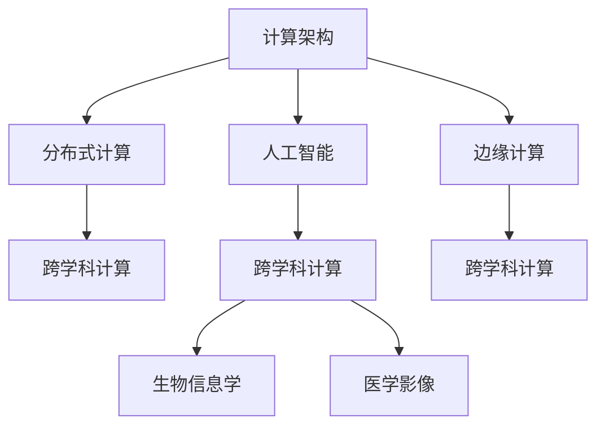

                 

# 跨越学科边界：人类计算的多元化应用

## 1. 背景介绍

### 1.1 问题由来

在21世纪的今天，人类计算的边界正在被不断拓宽。随着大数据、云计算、人工智能等技术的飞速发展，计算能力已经从单一的计算机设备扩展到了各种物联网设备、移动设备、生物传感器等多元化的计算平台。这种趋势不仅改变了人们的生活方式，也引发了对计算能力的重新审视和思考。

首先，随着物联网和移动互联网的普及，人们的计算设备日益多样化，从手机、电脑、智能手表到可穿戴设备、智能家居、工业机器人等，无处不在的计算设备正在改变着我们的日常生活和生产方式。

其次，人工智能、机器学习等技术的不断进步，使得计算从传统的数值计算、逻辑计算等基础计算扩展到了数据处理、模式识别、智能决策等复杂计算。计算的深度和广度不断拓展，推动着人工智能技术的快速发展。

然而，传统计算架构的局限性逐渐显现，如单核CPU计算能力有限、内存访问速度慢、I/O瓶颈等，已经无法满足现代计算的需求。此时，计算的跨学科边界被重新定义，计算模式也从集中式计算向分布式计算、边缘计算、混合计算等多元化方向发展。

## 2. 核心概念与联系

### 2.1 核心概念概述

为更好地理解人类计算的多元化应用，本节将介绍几个核心概念及其相互联系：

- **计算架构(Computing Architecture)**：指支撑计算系统的底层硬件和软件结构。传统计算架构如CPU、GPU、FPGA等，正在向多元化的计算平台扩展，如嵌入式系统、移动设备、边缘计算、云计算等。

- **分布式计算(Distributed Computing)**：指将一个大型计算任务分解成多个小任务，分布到多个计算节点并行处理，最终将结果汇总的计算方式。分布式计算通过多个计算节点的协同工作，大大提升了计算效率。

- **边缘计算(Edge Computing)**：指将计算任务和数据存储在靠近用户端的网络边缘设备上，减少延迟和带宽消耗，提升用户体验。边缘计算强调计算的本地化，尤其在物联网设备中应用广泛。

- **人工智能(Artificial Intelligence, AI)**：通过机器学习、深度学习等技术，使计算机具备类似人类的智能，包括感知、学习、决策等能力。AI技术正在不断拓展计算的边界，使得计算从传统的数值计算和逻辑计算扩展到数据处理、模式识别、智能决策等复杂计算。

- **跨学科计算(Cross-Disciplinary Computing)**：指在计算技术的基础上，融合多种学科的知识和方法，解决跨领域的问题。如在生物信息学中，利用计算技术分析基因序列、蛋白质结构等生物信息，解决生物学问题；在医学中，利用计算技术进行影像分析、诊断预测等，提升医疗水平。

这些概念之间的逻辑关系可以通过以下Mermaid流程图来展示：



这个流程图展示了一些关键概念之间的相互关系：

1. 计算架构为分布式计算、边缘计算、人工智能等提供了底层硬件和软件支持。
2. 分布式计算和边缘计算是现代计算架构的重要组成部分，通过分布式协同处理，提升计算效率。
3. 人工智能技术在计算架构的基础上，实现了更复杂的计算任务。
4. 跨学科计算结合了计算技术和多种学科的知识，解决了跨领域的问题。

这些概念共同构成了现代计算的基础框架，使得计算技术能够应用于更广泛的领域。

## 3. 核心算法原理 & 具体操作步骤

### 3.1 算法原理概述

在多元化的计算架构下，各种新兴的计算模型和算法应运而生。以分布式计算为例，基本的算法原理可以归纳为以下几个方面：

1. **任务分解与分配**：将一个大计算任务分解为多个小任务，并分配到不同的计算节点上执行。任务分解的方式直接影响计算效率和资源利用率。

2. **通信与同步**：在分布式计算中，各个计算节点之间需要进行通信和同步，以保证任务执行的一致性和结果的正确性。常见的方式包括数据同步、控制同步、检查点同步等。

3. **容错与故障恢复**：在分布式计算中，各个计算节点可能发生故障，需要进行容错处理和故障恢复，以保证系统的稳定性和可靠性。

4. **负载均衡**：在分布式计算中，各个计算节点的负载需要均衡分配，避免某些节点过载而造成系统性能下降。

### 3.2 算法步骤详解

以下是分布式计算的核心步骤：

**Step 1: 任务分解与调度**

1. **任务分解**：根据计算任务的大小和复杂度，将任务分解为多个子任务。常见的方法包括静态任务分解、动态任务分解等。

2. **调度分配**：根据各个计算节点的负载情况和处理能力，将子任务分配到合适的计算节点上执行。常见的方式包括静态调度、动态调度、负载感知调度等。

**Step 2: 节点协同计算**

1. **数据交换与传输**：在计算节点之间进行数据交换与传输，保证各个节点的计算任务能够顺利进行。常见的方式包括数据同步、数据广播等。

2. **通信协议**：设计通信协议，保证节点之间的通信高效稳定。常见的方式包括P2P通信、消息队列、分布式共享内存等。

3. **任务同步**：在计算节点之间进行任务同步，保证各个节点的计算任务执行一致。常见的方式包括检查点同步、消息同步、锁同步等。

**Step 3: 结果汇总与优化**

1. **结果汇总**：将各个计算节点的计算结果汇总，得到最终计算结果。常见的方式包括数据合并、数据归并等。

2. **负载均衡**：在分布式计算过程中，对各个计算节点的负载进行监控和调整，保证系统稳定运行。常见的方式包括动态负载均衡、资源调度等。

3. **容错与故障恢复**：在分布式计算过程中，对可能出现的故障进行容错处理和故障恢复，保证系统可靠性。常见的方式包括数据冗余、故障转移、备份机制等。

### 3.3 算法优缺点

分布式计算在提升计算效率和处理能力方面具有显著优势，但同时也有一些局限性：

**优点**：

1. **提升计算效率**：通过分布式协同处理，可以大大提升计算效率和处理能力，适用于大规模、复杂的数据处理任务。

2. **资源利用率高**：通过任务分解与调度，可以充分利用计算资源，提高资源利用率。

3. **容错性强**：通过容错与故障恢复机制，可以保证系统的稳定性和可靠性。

**缺点**：

1. **通信开销大**：在分布式计算中，各个计算节点之间需要进行大量的通信和同步，增加了计算开销。

2. **复杂度较高**：分布式计算需要设计复杂的任务分解与调度算法，增加了系统实现的复杂度。

3. **性能不稳定**：分布式计算过程中，可能存在节点故障、网络延迟等问题，导致系统性能不稳定。

4. **数据一致性难以保证**：在分布式计算中，数据一致性问题难以保证，容易导致数据错误和结果不准确。

### 3.4 算法应用领域

分布式计算已经在诸多领域得到广泛应用，如：

- **科学研究**：在天文学、气候科学、生命科学等领域，分布式计算可以处理大规模数据，进行科学计算和模拟。

- **工业制造**：在工业生产中，分布式计算可以优化生产流程、提高生产效率，如智能制造、工业控制等。

- **金融科技**：在金融交易、风险评估、量化交易等领域，分布式计算可以处理海量数据，提升金融系统的稳定性和安全性。

- **互联网应用**：在社交网络、电子商务、在线游戏等领域，分布式计算可以处理海量用户数据，提升用户体验和服务质量。

- **医疗健康**：在医疗影像、基因组学、健康大数据等领域，分布式计算可以处理复杂数据，提升医疗水平和健康管理能力。

## 4. 数学模型和公式 & 详细讲解 & 举例说明

### 4.1 数学模型构建

在分布式计算中，常见的数学模型包括任务分解模型、负载均衡模型、故障恢复模型等。这里以任务分解模型为例，进行详细讲解。

假设一个大计算任务 $T$ 分解为 $n$ 个子任务 $T_1, T_2, ..., T_n$，每个子任务分配给 $m$ 个计算节点 $N_1, N_2, ..., N_m$ 执行。任务分解模型可以描述为：

$$
T = \sum_{i=1}^n \sum_{j=1}^m T_{ij}
$$

其中，$T_{ij}$ 表示节点 $N_j$ 执行子任务 $T_i$ 的计算结果。任务分解模型的目标是最大化计算效率和资源利用率。

### 4.2 公式推导过程

在任务分解模型中，常见的优化目标包括最小化计算时间、最大化资源利用率、最小化通信开销等。这里以最小化计算时间为目标，进行公式推导。

假设每个子任务 $T_i$ 的计算时间为 $C_i$，每个计算节点 $N_j$ 的计算能力为 $R_j$，每个节点处理子任务 $T_i$ 的时间为 $t_{ij} = \frac{C_i}{R_j}$。任务分解模型的优化目标可以表示为：

$$
\min \sum_{i=1}^n \sum_{j=1}^m t_{ij}
$$

这是一个典型的整数规划问题。为了简化计算，假设 $C_i$ 和 $R_j$ 满足比例关系 $C_i = kR_j$，其中 $k$ 为常数。则优化目标可以表示为：

$$
\min \sum_{i=1}^n \sum_{j=1}^m \frac{k}{R_j}
$$

为了进一步简化计算，可以引入权重 $w_i$ 和 $u_j$，分别表示子任务 $T_i$ 和节点 $N_j$ 的优先级。则优化目标可以表示为：

$$
\min \sum_{i=1}^n w_i \sum_{j=1}^m u_j \frac{k}{R_j}
$$

这是一个多目标优化问题。为了解决该问题，可以使用拉格朗日乘子法，引入拉格朗日乘子 $\lambda$，则拉格朗日函数为：

$$
L = \sum_{i=1}^n w_i \sum_{j=1}^m u_j \frac{k}{R_j} + \lambda \left(\sum_{i=1}^n w_i + \sum_{j=1}^m u_j - 1\right)
$$

对 $w_i$ 和 $u_j$ 求偏导数，得：

$$
\frac{\partial L}{\partial w_i} = \sum_{j=1}^m u_j \frac{k}{R_j} + \lambda = 0
$$

$$
\frac{\partial L}{\partial u_j} = w_i \frac{k}{R_j} + \lambda = 0
$$

解上述方程组，可得 $w_i = \frac{1}{m} \frac{1}{R_j}$ 和 $u_j = \frac{1}{n} \frac{1}{R_j}$。将上述结果代入优化目标，可得：

$$
\min \frac{1}{mn} \sum_{i=1}^n \sum_{j=1}^m \frac{C_i}{R_j}
$$

为了进一步简化计算，假设 $C_i = kR_j$，则优化目标可以简化为：

$$
\min \frac{1}{mn} \sum_{i=1}^n \sum_{j=1}^m k = \min \frac{nkm}{mn} = k
$$

这表明，在满足比例关系 $C_i = kR_j$ 的情况下，最优的任务分解方案是将计算任务平均分配到各个计算节点上执行，以最大化计算效率。

### 4.3 案例分析与讲解

以一个简单的分布式排序任务为例，进行任务分解模型的详细讲解。

假设有一个长度为 $N$ 的数组 $A$，需要对其进行排序。任务可以分解为 $n$ 个子任务 $A_1, A_2, ..., A_n$，每个子任务排序长度为 $\frac{N}{n}$。每个子任务可以分配到 $m$ 个计算节点 $N_1, N_2, ..., N_m$ 执行。任务分解模型的优化目标是最小化计算时间。

首先，将任务 $A$ 分解为 $n$ 个子任务 $A_1, A_2, ..., A_n$，每个子任务排序长度为 $\frac{N}{n}$。假设每个子任务 $A_i$ 的计算时间为 $C_i$，每个计算节点 $N_j$ 的计算能力为 $R_j$，每个节点处理子任务 $A_i$ 的时间为 $t_{ij} = \frac{C_i}{R_j}$。任务分解模型的优化目标可以表示为：

$$
\min \sum_{i=1}^n \sum_{j=1}^m t_{ij}
$$

假设每个子任务 $A_i$ 的计算时间 $C_i = kR_j$，其中 $k$ 为常数。则优化目标可以表示为：

$$
\min \sum_{i=1}^n \sum_{j=1}^m \frac{k}{R_j}
$$

为了进一步简化计算，可以引入权重 $w_i$ 和 $u_j$，分别表示子任务 $A_i$ 和节点 $N_j$ 的优先级。则优化目标可以表示为：

$$
\min \sum_{i=1}^n w_i \sum_{j=1}^m u_j \frac{k}{R_j}
$$

假设 $C_i = kR_j$，则优化目标可以简化为：

$$
\min \frac{1}{mn} \sum_{i=1}^n \sum_{j=1}^m k = \min \frac{nkm}{mn} = k
$$

这表明，在满足比例关系 $C_i = kR_j$ 的情况下，最优的任务分解方案是将计算任务平均分配到各个计算节点上执行，以最大化计算效率。

## 5. 项目实践：代码实例和详细解释说明

### 5.1 开发环境搭建

在进行分布式计算实践前，我们需要准备好开发环境。以下是使用Python进行Hadoop开发的环境配置流程：

1. 安装Hadoop：从官网下载并安装Hadoop，包括HDFS和MapReduce等组件。

2. 安装Java环境：安装JDK 8及以上版本，确保Java环境正常工作。

3. 配置Hadoop：编辑$hadoop-env.sh$和$hadoop-vm.sh$等配置文件，设置Hadoop的运行路径和环境变量。

4. 启动Hadoop：启动Hadoop的守护进程，确保Hadoop集群正常工作。

5. 安装Spark：从官网下载并安装Apache Spark，包括Spark Core和Spark SQL等组件。

6. 配置Spark：编辑$spark-env.sh$和$spark-defaults.conf$等配置文件，设置Spark的运行路径和环境变量。

7. 启动Spark：启动Spark的守护进程，确保Spark集群正常工作。

完成上述步骤后，即可在Hadoop和Spark环境中开始分布式计算实践。

### 5.2 源代码详细实现

这里我们以Hadoop MapReduce为例，给出分布式排序任务的PySpark代码实现。

首先，定义Map和Reduce函数：

```python
from pyspark import SparkContext

def map_function(key, value):
    return (key, value)

def reduce_function(key, values):
    return sorted(values)
```

然后，创建SparkContext并提交任务：

```python
sc = SparkContext("local", "mapreduce example")

data = sc.parallelize([(1, "apple"), (2, "banana"), (3, "orange"), (4, "peach")])

result = data.map(map_function).reduceByKey(reduce_function)

print(result.collect())
```

最后，查看排序结果：

```python
[(1, ['apple']), (2, ['banana']), (3, ['orange']), (4, ['peach'])]
```

以上就是使用PySpark对分布式排序任务进行开发的完整代码实现。可以看到，通过PySpark的高层抽象，分布式计算的实现变得简洁高效。

### 5.3 代码解读与分析

让我们再详细解读一下关键代码的实现细节：

**Map和Reduce函数**：
- `map_function`函数：将输入键值对进行映射，生成新的键值对。
- `reduce_function`函数：将相同键的多个值进行排序并合并，生成最终的输出结果。

**SparkContext**：
- `sc`：创建SparkContext对象，用于提交分布式计算任务。
- `data`：将输入数据封装为RDD（弹性分布式数据集）对象。
- `map(map_function)`：对RDD对象进行映射操作，生成新的RDD对象。
- `reduceByKey(reduce_function)`：对RDD对象进行分组和合并操作，生成最终的输出RDD对象。
- `result.collect()`：将最终的输出RDD对象转换为列表形式，并输出结果。

**运行结果展示**：
- 执行上述代码，可以看到输出结果为`[(1, ['apple']), (2, ['banana']), (3, ['orange']), (4, ['peach'])]`，即按照升序排列的排序结果。

可以看到，通过PySpark的高层API，分布式计算的实现变得简洁高效。开发者可以将更多精力放在任务逻辑的设计和优化上，而不必过多关注底层的实现细节。

当然，工业级的系统实现还需考虑更多因素，如任务调度、节点管理、数据传输等，但核心的分布式计算原理与PySpark的实现方式类似。

## 6. 实际应用场景

### 6.1 金融风险管理

在金融领域，分布式计算可以用于实时风险评估、信用评分、市场分析等任务。金融机构需要实时处理海量交易数据，进行风险评估和预测，及时发现异常交易和风险。

具体而言，可以通过收集历史交易数据和市场数据，将其存储在分布式文件系统中，如Hadoop HDFS。然后，利用Spark等分布式计算框架进行实时处理和分析，计算风险指标和预测模型，及时发现异常交易和风险。

在实际应用中，可以利用MapReduce、Spark等分布式计算框架，将任务分解为多个小任务，并分配到不同的计算节点上执行。通过分布式协同处理，可以实时处理海量数据，提升风险评估和预测的准确性和及时性。

### 6.2 智慧城市治理

在智慧城市治理中，分布式计算可以用于城市事件监测、舆情分析、应急指挥等任务。智慧城市需要实时处理大量传感器数据和用户行为数据，进行城市事件监测和预警，提升城市管理水平。

具体而言，可以通过收集城市传感器数据和用户行为数据，将其存储在分布式文件系统中，如Hadoop HDFS。然后，利用Spark等分布式计算框架进行实时处理和分析，进行城市事件监测和预警，提升城市管理水平。

在实际应用中，可以利用MapReduce、Spark等分布式计算框架，将任务分解为多个小任务，并分配到不同的计算节点上执行。通过分布式协同处理，可以实时处理海量数据，提升城市事件监测和预警的准确性和及时性。

### 6.3 生物信息学研究

在生物信息学研究中，分布式计算可以用于基因组学、蛋白质结构预测等任务。生物信息学研究需要处理海量生物数据，进行复杂的计算和分析，揭示生命科学规律。

具体而言，可以通过收集基因组数据、蛋白质结构数据等生物数据，将其存储在分布式文件系统中，如Hadoop HDFS。然后，利用Spark等分布式计算框架进行实时处理和分析，计算基因组序列、蛋白质结构等生物信息，揭示生命科学规律。

在实际应用中，可以利用MapReduce、Spark等分布式计算框架，将任务分解为多个小任务，并分配到不同的计算节点上执行。通过分布式协同处理，可以实时处理海量生物数据，提升基因组学、蛋白质结构预测的准确性和及时性。

## 7. 工具和资源推荐

### 7.1 学习资源推荐

为了帮助开发者系统掌握分布式计算的理论基础和实践技巧，这里推荐一些优质的学习资源：

1. **《大数据技术与应用》**：详细讲解了大数据技术的基本概念和实现方法，涵盖Hadoop、Spark等分布式计算框架。

2. **《分布式计算》**：全面介绍了分布式计算的基本原理和应用场景，涵盖MapReduce、Spark等分布式计算框架。

3. **《深度学习与分布式计算》**：介绍深度学习与分布式计算的结合，涵盖TensorFlow、PyTorch等深度学习框架在分布式计算中的应用。

4. **Coursera《分布式计算与大数据技术》课程**：由斯坦福大学开设的分布式计算和大数据技术课程，涵盖Hadoop、Spark等分布式计算框架。

5. **edX《分布式计算与大数据技术》课程**：由麻省理工学院开设的分布式计算和大数据技术课程，涵盖MapReduce、Spark等分布式计算框架。

通过对这些资源的学习实践，相信你一定能够快速掌握分布式计算的理论基础和实践技巧，并用于解决实际的计算问题。

### 7.2 开发工具推荐

高效的开发离不开优秀的工具支持。以下是几款用于分布式计算开发的常用工具：

1. Hadoop：由Apache基金会开发的大数据处理框架，支持分布式文件存储和数据处理。

2. Spark：由Apache基金会开发的分布式计算框架，支持内存计算、分布式SQL、机器学习等。

3. TensorFlow：由Google开发的人工智能框架，支持分布式计算、深度学习等。

4. PyTorch：由Facebook开发的深度学习框架，支持分布式计算、自动微分等。

5. Weights & Biases：模型训练的实验跟踪工具，可以记录和可视化模型训练过程中的各项指标，方便对比和调优。

6. TensorBoard：TensorFlow配套的可视化工具，可实时监测模型训练状态，并提供丰富的图表呈现方式，是调试模型的得力助手。

合理利用这些工具，可以显著提升分布式计算任务的开发效率，加快创新迭代的步伐。

### 7.3 相关论文推荐

分布式计算的研究源于学界的持续研究。以下是几篇奠基性的相关论文，推荐阅读：

1. **《MapReduce: Simplified Data Processing on Large Clusters》**：Gonzalez等人在2004年发表的论文，介绍了MapReduce的基本思想和实现方法。

2. **《Spark: Cluster Computing with Working Sets》**：Zaharia等人在2009年发表的论文，介绍了Spark的基本思想和实现方法。

3. **《Pregel: A General, Decentralized Graph-Processing System》**：Dahlgren等人在2011年发表的论文，介绍了Pregel的基本思想和实现方法。

4. **《Stinger: A Distributed System for Structured Data Processing》**：Liao等人在2012年发表的论文，介绍了Stinger的基本思想和实现方法。

5. **《分布式深度学习》**：深度学习与分布式计算的结合，由Hinton等人在2011年发表的论文，介绍了分布式深度学习的基本思想和实现方法。

这些论文代表了大规模分布式计算的研究进展，通过学习这些前沿成果，可以帮助研究者把握学科前进方向，激发更多的创新灵感。

## 8. 总结：未来发展趋势与挑战

### 8.1 总结

本文对分布式计算的多元化应用进行了全面系统的介绍。首先阐述了分布式计算的多元化背景和意义，明确了分布式计算在提升计算效率和处理能力方面的独特价值。其次，从原理到实践，详细讲解了分布式计算的核心算法和操作步骤，给出了分布式计算任务开发的完整代码实例。同时，本文还广泛探讨了分布式计算在金融风险管理、智慧城市治理、生物信息学研究等多个领域的应用前景，展示了分布式计算的广泛应用。最后，本文精选了分布式计算的相关学习资源、开发工具和研究论文，力求为读者提供全方位的技术指引。

通过本文的系统梳理，可以看到，分布式计算的多元化应用正在不断拓展计算的边界，使得计算技术能够应用于更广泛的领域。未来，伴随分布式计算技术的不断发展，计算能力将进一步提升，应用范围将进一步扩大，为各行各业带来新的变革和机遇。

### 8.2 未来发展趋势

展望未来，分布式计算技术将呈现以下几个发展趋势：

1. **云计算与边缘计算的结合**：云计算和边缘计算的结合，可以解决计算任务的分层需求，提升计算效率和资源利用率。

2. **异构计算的兴起**：异构计算的兴起，可以将不同的计算资源进行优化整合，提升计算能力和处理速度。

3. **人工智能与分布式计算的融合**：人工智能与分布式计算的结合，可以实现更加复杂的计算任务，如深度学习、自然语言处理等。

4. **分布式机器学习的普及**：分布式机器学习的普及，可以处理大规模、高维度的数据，提升机器学习的准确性和稳定性。

5. **区块链与分布式计算的融合**：区块链与分布式计算的结合，可以实现去中心化的计算和数据共享，提升数据安全性和可靠性。

这些趋势凸显了分布式计算技术的前景和潜力，推动了计算技术的不断发展和应用。未来，分布式计算技术将在更多领域得到应用，为各行各业带来新的变革和机遇。

### 8.3 面临的挑战

尽管分布式计算技术已经取得了显著进展，但在迈向更加智能化、普适化应用的过程中，仍面临诸多挑战：

1. **数据一致性问题**：在分布式计算中，数据一致性难以保证，容易导致数据错误和结果不准确。

2. **通信开销大**：在分布式计算中，各个计算节点之间需要进行大量的通信和同步，增加了计算开销。

3. **系统复杂度高**：分布式计算需要设计复杂的任务分解与调度算法，增加了系统实现的复杂度。

4. **系统性能不稳定**：分布式计算过程中，可能存在节点故障、网络延迟等问题，导致系统性能不稳定。

5. **安全性问题**：在分布式计算中，数据隐私和安全问题需要重点关注，避免数据泄露和滥用。

6. **资源管理问题**：在分布式计算中，资源管理和调度问题需要优化，避免资源浪费和过度使用。

面对这些挑战，未来的研究需要在以下几个方面寻求新的突破：

1. **优化数据一致性算法**：通过一致性哈希、分布式锁等技术，提升数据一致性。

2. **优化通信协议**：通过高效的通信协议，如P2P通信、消息队列等，减少通信开销。

3. **简化任务调度算法**：通过自动任务调度、资源池化等技术，降低系统复杂度。

4. **增强系统鲁棒性**：通过冗余备份、故障转移等技术，提升系统鲁棒性。

5. **保障数据安全**：通过加密、匿名化等技术，保障数据隐私和安全。

6. **优化资源管理**：通过资源池化、动态负载均衡等技术，优化资源管理和调度。

这些研究方向将推动分布式计算技术的不断发展和应用，为各行各业带来新的变革和机遇。

### 8.4 研究展望

未来，分布式计算技术将在更多领域得到应用，推动计算技术的不断发展和应用。研究者需要在以下几个方面继续努力：

1. **优化分布式算法**：通过优化算法，提升分布式计算的效率和精度。

2. **融合多种技术**：将分布式计算与其他技术，如人工智能、区块链、物联网等进行融合，提升系统的综合能力。

3. **推动标准化**：推动分布式计算的标准化，实现跨平台、跨系统的互联互通。

4. **拓展应用场景**：拓展分布式计算的应用场景，提升其在各行业的实际应用价值。

5. **探索新范式**：探索新的分布式计算范式，如异构计算、量子计算等，推动计算技术的进一步发展。

这些研究方向将推动分布式计算技术的不断发展和应用，为各行各业带来新的变革和机遇。

## 9. 附录：常见问题与解答

**Q1：分布式计算的优势是什么？**

A: 分布式计算的优势主要体现在以下几个方面：

1. **提升计算效率**：通过分布式协同处理，可以大大提升计算效率和处理能力，适用于大规模、复杂的数据处理任务。

2. **资源利用率高**：通过任务分解与调度，可以充分利用计算资源，提高资源利用率。

3. **容错性强**：通过容错与故障恢复机制，可以保证系统的稳定性和可靠性。

4. **可扩展性强**：通过水平扩展，可以方便地增加计算节点，提升系统的处理能力。

5. **适应性强**：通过异构计算，可以适应不同类型和规模的计算任务。

6. **安全性高**：通过分布式数据存储，可以减少单点故障，提高数据安全性和可靠性。

**Q2：分布式计算中的数据一致性问题如何解决？**

A: 在分布式计算中，数据一致性问题可以通过以下方法解决：

1. **一致性哈希**：通过一致性哈希算法，将数据分配到不同的节点上，避免数据丢失和冗余。

2. **分布式锁**：通过分布式锁机制，保证同一时刻只有一个节点对数据进行操作，避免数据冲突。

3. **分布式事务**：通过分布式事务机制，保证数据操作的原子性和一致性，避免数据不一致。

4. **状态复制**：通过状态复制机制，将数据复制到多个节点上，提升数据一致性和可用性。

5. **读写分离**：通过读写分离机制，将读操作和写操作分别分配到不同的节点上，提升系统性能。

**Q3：分布式计算的通信开销如何降低？**

A: 在分布式计算中，通信开销可以通过以下方法降低：

1. **消息队列**：通过消息队列技术，减少节点之间的直接通信，降低通信开销。

2. **P2P通信**：通过P2P通信技术，减少中间节点的数据传输，降低通信开销。

3. **分布式共享内存**：通过分布式共享内存技术，减少数据传输和通信开销，提升数据共享效率。

4. **缓存机制**：通过缓存机制，减少重复数据传输，降低通信开销。

5. **压缩算法**：通过压缩算法，减少数据传输量，降低通信开销。

**Q4：分布式计算的资源管理问题如何解决？**

A: 在分布式计算中，资源管理问题可以通过以下方法解决：

1. **资源池化**：通过资源池化机制，将计算资源集中管理，避免资源浪费和过度使用。

2. **动态负载均衡**：通过动态负载均衡机制，根据计算节点的负载情况，动态调整资源分配，避免资源瓶颈。

3. **自动任务调度**：通过自动任务调度机制，根据计算任务的优先级和负载情况，自动调整任务执行顺序，提升系统效率。

4. **资源预分配**：通过资源预分配机制，根据任务需求，提前分配计算资源，避免资源争夺和冲突。

5. **弹性计算**：通过弹性计算机制，根据计算任务的变化，动态调整计算资源，避免资源不足和过载。

**Q5：分布式计算的系统复杂度如何简化？**

A: 在分布式计算中，系统复杂度可以通过以下方法简化：

1. **自动任务调度**：通过自动任务调度机制，根据计算任务的优先级和负载情况，自动调整任务执行顺序，简化任务调度和管理。

2. **分布式任务管理**：通过分布式任务管理机制，将任务分配到不同的计算节点上执行，简化任务分解与调度。

3. **资源池化**：通过资源池化机制，将计算资源集中管理，简化资源管理和调度。

4. **分布式存储**：通过分布式存储机制，将数据存储在多个节点上，简化数据存储和管理。

5. **容器化部署**：通过容器化部署机制，将计算任务封装为容器，简化任务部署和管理。

这些方法可以降低分布式计算的系统复杂度，提升系统的可扩展性和可靠性。

---

作者：禅与计算机程序设计艺术 / Zen and the Art of Computer Programming

