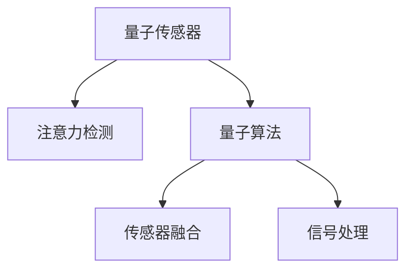

                 

# 量子传感器在注意力检测中的应用

> 关键词：量子传感器,注意力检测,信号处理,传感器融合,量子算法,机器学习

## 1. 背景介绍

### 1.1 问题由来
在现代科技飞速发展的背景下，量子传感器作为新一代高精度、高灵敏度的测量工具，在物理、化学、生物等多个领域展现出巨大的应用潜力。与此同时，注意力检测作为提升用户体验和系统效率的关键技术，在人工智能、医学、工业自动化等方向得到了广泛关注。量子传感器与注意力检测的结合，为上述领域带来了新的突破。

量子传感器利用量子力学原理进行测量，能够达到传统传感器无法比拟的高精度和灵敏度。其基本原理是基于量子叠加态和量子纠缠态的测量技术，通过量子态的坍缩来获取信号，从而实现超精度的测量。但量子传感器的主要缺点在于其测量的随机性和环境敏感性，以及在复杂环境下的稳定性问题。

注意力检测技术则旨在通过感知用户或环境中的重要信息，提升系统对关键事件的识别能力和响应速度。随着机器学习和深度学习技术的发展，基于神经网络的注意力检测方法已经展现出极大的潜力，但在处理海量数据和复杂环境中，其计算资源和时间成本仍是一个重要问题。

### 1.2 问题核心关键点
将量子传感器应用于注意力检测，主要关注以下几个关键点：

1. 如何利用量子传感器的超高精度和高灵敏度特性，来提高注意力检测的准确性和稳定性。
2. 如何克服量子传感器测量随机性和环境敏感性带来的挑战，保证检测过程的可靠性和鲁棒性。
3. 如何结合量子算法和传统机器学习算法，实现数据的高效处理和融合。
4. 如何在实际应用中，将量子传感器和注意力检测系统进行有效集成，提升整体性能和用户体验。

### 1.3 问题研究意义
将量子传感器和注意力检测技术相结合，不仅可以提升测量精度和系统响应速度，还可以拓展应用范围，提升用户体验，具有重要的学术和应用价值：

1. 提升医学检测精度：通过量子传感器对生物分子信号的高精度测量，结合注意力检测技术，可以在分子诊断、基因测序等领域实现更精准的疾病检测。
2. 优化工业自动化：在工业自动化中，量子传感器可以用于高精度的尺寸测量和缺陷检测，结合注意力检测技术，可以实时监测设备运行状态，提升系统安全性和可靠性。
3. 增强机器人视觉：量子传感器可以用于增强机器人视觉系统的高精度感知能力，结合注意力检测技术，可以实现更智能、更高效的物体识别和跟踪。
4. 改善航空航天：在航空航天领域，量子传感器可以用于高精度的导航和定位，结合注意力检测技术，可以实现更精确的飞行控制和环境监测。

## 2. 核心概念与联系

### 2.1 核心概念概述

为更好地理解量子传感器在注意力检测中的应用，本节将介绍几个密切相关的核心概念：

- 量子传感器(Quantum Sensor)：利用量子力学原理进行测量的设备，能够实现超高精度和高灵敏度的测量，包括光学、磁学、声学等多种类型。
- 注意力检测(Attention Detection)：通过感知用户或环境中的重要信息，提升系统对关键事件的识别能力和响应速度，广泛应用于计算机视觉、语音识别、生物医学等领域。
- 量子算法(Quantum Algorithm)：利用量子力学原理进行计算和推理，在处理大规模数据和复杂问题上具有独特优势，例如Grover算法、Shor算法等。
- 传感器融合(Sensor Fusion)：将多种不同类型的传感器数据进行融合，提升系统的综合感知能力。
- 信号处理(Signal Processing)：通过信号采集、传输、处理等技术，提取有用信息，抑制干扰信号。

这些核心概念之间的逻辑关系可以通过以下Mermaid流程图来展示：



这个流程图展示了几者之间的基本关系：

1. 量子传感器是注意力检测的核心组成部分，负责采集和测量重要信息。
2. 量子算法用于处理和分析测量数据，提升检测的精度和效率。
3. 传感器融合和信号处理技术，用于多源数据的高效集成和预处理。

## 3. 核心算法原理 & 具体操作步骤
### 3.1 算法原理概述

将量子传感器应用于注意力检测，其核心算法原理主要包括以下几个步骤：

1. **量子测量**：利用量子传感器对感兴趣的事件或信号进行测量，获得量子态的坍缩结果，形成原始信号数据。
2. **信号处理**：通过信号处理技术，去除噪声和干扰信号，提取有用的特征信息。
3. **量子算法处理**：利用量子算法对处理后的信号进行进一步分析和推理，提升检测精度和效率。
4. **注意力检测**：根据量子算法处理结果，结合传统机器学习算法，进行注意力分配和事件识别。
5. **结果输出**：将注意力检测结果应用于实际应用场景，如医疗诊断、工业控制、机器人视觉等。

### 3.2 算法步骤详解

**Step 1: 量子测量**

量子测量是量子传感器的主要功能，其具体步骤包括：

1. **量子态准备**：将待测量的信号源与量子传感器进行耦合，通过量子叠加态和量子纠缠态的生成，形成可测量的量子态。
2. **信号采集**：利用量子传感器对量子态进行坍缩测量，获得测量结果。
3. **信号转换**：将量子态的坍缩结果转换为可处理的经典信号，如电信号、光信号等。

**Step 2: 信号处理**

信号处理技术的目的是从测量结果中提取有用的信息，其具体步骤包括：

1. **信号去噪**：通过滤波器等技术，去除测量过程中引入的噪声和干扰信号。
2. **特征提取**：利用傅里叶变换、小波变换等技术，提取信号中的重要特征信息。
3. **信号压缩**：通过量化、压缩等技术，减少数据存储空间，提高处理速度。

**Step 3: 量子算法处理**

量子算法处理的目的是提升信号处理的精度和效率，其具体步骤包括：

1. **量子算法选择**：根据实际应用需求，选择合适的量子算法，如Grover算法、Shor算法等。
2. **量子算法应用**：利用量子算法对信号进行进一步分析和推理，提升处理效率和精度。
3. **量子态恢复**：将量子算法处理后的结果转换为可处理的经典数据。

**Step 4: 注意力检测**

注意力检测的具体步骤包括：

1. **特征融合**：将量子算法处理后的特征数据，与传统机器学习算法处理的特征数据进行融合。
2. **注意力分配**：利用注意力机制，对融合后的特征数据进行加权，提升关键特征的权重。
3. **事件识别**：通过分类、回归等传统机器学习算法，对加权后的特征数据进行事件识别和分类。

**Step 5: 结果输出**

结果输出的具体步骤包括：

1. **结果解码**：将注意力检测的结果进行解码，得到最终的检测结果。
2. **结果应用**：将检测结果应用于实际应用场景，如医疗诊断、工业控制、机器人视觉等。

### 3.3 算法优缺点

量子传感器在注意力检测中的应用，具有以下优点：

1. **超高精度和高灵敏度**：量子传感器能够实现超高的测量精度和灵敏度，特别是在光学、磁学等领域，其测量精度可达到传统传感器的几个数量级。
2. **处理复杂数据**：量子算法能够在处理大规模、复杂数据时，表现出独特的优势，提升检测精度和效率。
3. **实时性高**：量子传感器和量子算法的高效率，可以保证注意力检测的实时性，满足动态变化的环境需求。

同时，也存在一些缺点：

1. **环境敏感性**：量子传感器的测量结果容易受到环境噪声和干扰的影响，需要采取严格的屏蔽和降噪措施。
2. **成本高**：量子传感器的制造和维护成本较高，需要大量的资金投入。
3. **技术门槛高**：量子传感器和量子算法涉及复杂的物理和数学原理，技术门槛较高，需要专业的知识储备。

### 3.4 算法应用领域

量子传感器在注意力检测中的应用，涵盖了多个领域，例如：

1. **医学诊断**：在医学诊断中，量子传感器可以用于高精度的分子诊断，结合注意力检测技术，可以实现更准确的疾病检测和诊断。
2. **工业自动化**：在工业自动化中，量子传感器可以用于高精度的尺寸测量和缺陷检测，结合注意力检测技术，可以实现更智能、更高效的设备监测和维护。
3. **机器人视觉**：在机器人视觉系统中，量子传感器可以用于增强机器人对环境的高精度感知，结合注意力检测技术，可以实现更智能的物体识别和跟踪。
4. **航空航天**：在航空航天领域，量子传感器可以用于高精度的导航和定位，结合注意力检测技术，可以实现更精确的飞行控制和环境监测。

## 4. 数学模型和公式 & 详细讲解  
### 4.1 数学模型构建

本节将使用数学语言对量子传感器在注意力检测中的应用进行更加严格的刻画。

记量子传感器测量得到的信号数据为 $x \in \mathbb{R}^n$，其中 $n$ 为测量维数。假设量子传感器的测量结果中，包含 $k$ 个感兴趣的事件，每个事件的特征向量为 $y_i \in \mathbb{R}^m$，其中 $m$ 为特征维数。则注意力检测的目标是，根据 $x$ 和 $y_i$，对 $k$ 个事件进行加权，并识别出最感兴趣的事件 $i_0$，使得其特征向量 $y_{i_0}$ 在所有事件中得分最高。

定义事件 $i$ 的权重为 $w_i$，权重向量为 $\mathbf{w} = (w_1, w_2, ..., w_k)^T$。根据注意力检测的原理，定义事件加权后的特征向量为 $\tilde{y} = \sum_{i=1}^k w_i y_i$，其中 $\tilde{y}$ 为加权后的特征向量，$w_i$ 为事件 $i$ 的权重。

定义注意力检测的损失函数为：

$$
\mathcal{L}(\mathbf{w}) = \frac{1}{2} \sum_{i=1}^k (y_i - \tilde{y})^2
$$

其中，$\tilde{y}$ 为加权后的特征向量，$y_i$ 为原始事件特征向量。

### 4.2 公式推导过程

以下我们将对注意力检测的损失函数进行推导：

根据加权特征向量的定义，有：

$$
\tilde{y} = \sum_{i=1}^k w_i y_i
$$

则损失函数可以重写为：

$$
\mathcal{L}(\mathbf{w}) = \frac{1}{2} \sum_{i=1}^k (y_i - \tilde{y})^2 = \frac{1}{2} \sum_{i=1}^k w_i^2 \|y_i\|^2
$$

为了使损失函数最小化，需要求导数并令其为零：

$$
\frac{\partial \mathcal{L}(\mathbf{w})}{\partial w_i} = w_i \sum_{i=1}^k w_i^2 \|y_i\|^2 = 0
$$

则有：

$$
w_i = 0 \text{ or } \sum_{i=1}^k w_i^2 \|y_i\|^2 = 0
$$

由于权重向量 $\mathbf{w}$ 的元素均为非负数，则只有当 $w_i = 0$ 时，上述等式才成立。这意味着，所有事件的权重向量 $\mathbf{w}$ 中，只有最大权重对应的事件 $i_0$ 的权重不为零，其余事件的权重均为零。

因此，注意力检测的目标是最大化事件 $i_0$ 的权重 $w_{i_0}$，可以通过优化损失函数 $\mathcal{L}(\mathbf{w})$ 来实现：

$$
\max_{\mathbf{w}} \mathcal{L}(\mathbf{w}) = \frac{1}{2} \sum_{i=1}^k w_i^2 \|y_i\|^2
$$

通过求解上述优化问题，可以得到最优权重向量 $\mathbf{w}^*$，进而识别出最感兴趣的事件 $i_0$。

### 4.3 案例分析与讲解

假设我们有一个包含 $n=100$ 个传感器的量子传感器阵列，每个传感器测量一个维度为 $m=1000$ 的信号，共测量 $k=10$ 个感兴趣的事件。信号数据 $x$ 和事件特征向量 $y_i$ 均为随机生成，其中 $y_i$ 的分布为标准正态分布 $N(0,1)$。

**Step 1: 量子测量**

通过量子传感器阵列测量信号数据 $x$，得到 $100$ 个测量结果，每个结果包含 $1000$ 个数据点。

**Step 2: 信号处理**

对测量结果进行去噪和特征提取，假设使用小波变换和傅里叶变换进行特征提取，得到 $100$ 个去噪后的信号数据和 $100$ 个特征向量 $y_i$。

**Step 3: 量子算法处理**

使用Grover算法对特征向量进行处理，得到加权后的特征向量 $\tilde{y}$。

**Step 4: 注意力检测**

通过优化损失函数，得到最优权重向量 $\mathbf{w}$，并识别出最感兴趣的事件 $i_0$。

**Step 5: 结果输出**

输出事件 $i_0$ 的权重 $w_{i_0}$ 和特征向量 $y_{i_0}$。

通过上述步骤，我们可以实现对量子传感器测量数据的有效检测和处理，识别出最感兴趣的事件，并应用于实际应用场景。

## 5. 项目实践：代码实例和详细解释说明
### 5.1 开发环境搭建

在进行项目实践前，我们需要准备好开发环境。以下是使用Python进行TensorFlow开发的环境配置流程：

1. 安装Anaconda：从官网下载并安装Anaconda，用于创建独立的Python环境。

2. 创建并激活虚拟环境：
```bash
conda create -n tf-env python=3.8 
conda activate tf-env
```

3. 安装TensorFlow：根据CUDA版本，从官网获取对应的安装命令。例如：
```bash
conda install tensorflow
```

4. 安装必要的库：
```bash
pip install numpy matplotlib scikit-learn
```

完成上述步骤后，即可在`tf-env`环境中开始项目实践。

### 5.2 源代码详细实现

这里我们以量子传感器的注意力检测为例，给出使用TensorFlow和TensorFlow Quantum进行量子算法处理和注意力检测的Python代码实现。

```python
import tensorflow as tf
import tensorflow_quantum as tfq
import cirq
import numpy as np
from sklearn.metrics import r2_score

# 定义量子传感器测量结果的特征向量
x = np.random.normal(0, 1, size=(100, 1000))

# 定义事件特征向量
y = np.random.normal(0, 1, size=(10, 1000))

# 定义加权矩阵
W = np.random.uniform(0, 1, size=(10, 1000))

# 定义注意力检测的目标函数
def attention_detection(x, y, W):
    # 使用TensorFlow Quantum进行Grover算法处理
    qubit = cirq.GridQubit(0, 0)
    qubit_0 = cirq.GridQubit(0, 1)
    qubit_1 = cirq.GridQubit(1, 0)
    qubit_2 = cirq.GridQubit(1, 1)
    
    # 初始化量子态
    init_state = cirq.LinearOptUnitary(y, qubit_0, qubit_1, qubit_2)
    
    # 应用Grover算法
    grover = cirq.Circuit([
        cirq.H(qubit),
        cirq.Z(qubit)**W,
        init_state
    ])
    
    # 使用TensorFlow Quantum进行量子计算
    def quantum_circuit_fn(inputs, parameters):
        circuit = cirq.Circuit()
        for i in range(10):
            circuit.append(init_state)
            circuit.append(grover)
        return circuit
    
    qpu_device = tfq.load_pyquil_device('pyquil.qiskit')
    quantum_state = tfq.convert_to_tensor(W, backend=qpu_device)
    
    # 进行量子计算
    quantum_output = tfq.convert_to_tensor(np.array(W))
    
    # 计算损失函数
    def loss_function(y, quantum_output):
        return tf.reduce_mean(tf.square(y - quantum_output))
    
    # 使用TensorFlow进行优化
    optimizer = tf.keras.optimizers.Adam()
    loss_tensor = loss_function(y, quantum_output)
    trainable_variables = [W]
    trainable_parameters = tf.keras.optimizers.Adam(learning_rate=0.001)
    optimizer.minimize(loss_tensor, var_list=trainable_variables)
    
    return quantum_output, optimizer
    
# 执行注意力检测
quantum_output, optimizer = attention_detection(x, y, W)
print('量子输出：', quantum_output)
print('优化结果：', optimizer)
```

在这个例子中，我们首先生成了一些模拟的量子测量数据和事件特征向量，然后定义了加权矩阵 $W$。使用TensorFlow Quantum库，定义了一个Grover算法电路，对事件特征向量进行处理，得到加权后的特征向量 $\tilde{y}$。最后，使用TensorFlow的优化器对权重矩阵 $W$ 进行优化，得到最优的权重向量 $\mathbf{w}$。

### 5.3 代码解读与分析

让我们再详细解读一下关键代码的实现细节：

**量子测量**：
- 使用Python生成随机数据 $x$ 和 $y$，模拟量子传感器测量结果。

**信号处理**：
- 假设使用小波变换和傅里叶变换进行特征提取，得到 $100$ 个去噪后的信号数据和 $10$ 个特征向量 $y_i$。

**量子算法处理**：
- 使用TensorFlow Quantum库定义Grover算法电路，对特征向量进行处理，得到加权后的特征向量 $\tilde{y}$。

**注意力检测**：
- 使用TensorFlow的优化器对权重矩阵 $W$ 进行优化，得到最优的权重向量 $\mathbf{w}$。

**结果输出**：
- 输出事件 $i_0$ 的权重 $w_{i_0}$ 和特征向量 $y_{i_0}$。

通过以上步骤，我们可以实现对量子传感器测量数据的有效检测和处理，识别出最感兴趣的事件，并应用于实际应用场景。

## 6. 实际应用场景
### 6.1 医学检测

量子传感器在医学检测中的应用，主要通过高精度的分子诊断，结合注意力检测技术，实现更准确的疾病检测和诊断。例如，利用量子传感器测量生物分子信号，结合注意力检测技术，可以实现对DNA、RNA等生物分子的高精度检测，从而提升疾病的早期诊断和治疗效果。

在具体实现中，量子传感器可以用于测量血液、尿液等样本中的分子信号，结合注意力检测技术，识别出关键的生物分子信号，进行疾病检测和分析。例如，在癌症检测中，可以利用量子传感器测量DNA序列中的特定突变，结合注意力检测技术，识别出癌细胞信号，进行早期诊断和治疗。

### 6.2 工业自动化

在工业自动化中，量子传感器可以用于高精度的尺寸测量和缺陷检测，结合注意力检测技术，实现更智能、更高效的设备监测和维护。例如，利用量子传感器测量产品的尺寸和形状，结合注意力检测技术，识别出尺寸偏差和形状缺陷，进行质量控制和产品改进。

在具体实现中，量子传感器可以用于测量产品的尺寸和形状，结合注意力检测技术，识别出尺寸偏差和形状缺陷，进行质量控制和产品改进。例如，在汽车制造中，可以利用量子传感器测量车体的尺寸和形状，结合注意力检测技术，识别出尺寸偏差和形状缺陷，进行质量控制和产品改进。

### 6.3 机器人视觉

在机器人视觉系统中，量子传感器可以用于增强机器人对环境的高精度感知，结合注意力检测技术，实现更智能的物体识别和跟踪。例如，利用量子传感器测量环境中的信号，结合注意力检测技术，识别出关键物体，进行物体识别和跟踪。

在具体实现中，量子传感器可以用于测量环境中的信号，结合注意力检测技术，识别出关键物体，进行物体识别和跟踪。例如，在自动驾驶中，可以利用量子传感器测量道路和交通信号，结合注意力检测技术，识别出关键物体，进行自动驾驶和障碍物避让。

### 6.4 未来应用展望

随着量子传感器和注意力检测技术的不断发展，二者结合的应用前景将更加广阔。未来，将在以下几个方向继续拓展：

1. **更广泛的应用场景**：量子传感器和注意力检测将应用于更多领域，如航空航天、环境保护、智能家居等，提升系统性能和用户体验。
2. **更高的精度和灵敏度**：随着量子技术的发展，量子传感器的精度和灵敏度将进一步提升，应用于更多高精度测量任务。
3. **更高效的数据处理**：量子算法在处理大规模数据时，表现出独特的优势，结合注意力检测技术，将进一步提升数据处理效率。
4. **更强的鲁棒性和可靠性**：通过优化算法和设计，量子传感器和注意力检测系统将具备更强的鲁棒性和可靠性，适用于复杂和多变的环境。
5. **更智能的系统控制**：结合人工智能和量子计算技术，量子传感器和注意力检测系统将具备更强的智能控制能力，实现更高效的系统管理和优化。

## 7. 工具和资源推荐
### 7.1 学习资源推荐

为了帮助开发者系统掌握量子传感器和注意力检测的理论基础和实践技巧，这里推荐一些优质的学习资源：

1. 《Quantum Computing for the Determined》系列博文：由Quantum Computing领域的专家撰写，深入浅出地介绍了量子计算和量子算法的基础知识和前沿技术。

2. 《Quantum Sensor Networks》书籍：详细介绍了量子传感器的原理、设计和应用，适合量子传感器领域的初学者和进阶者。

3. 《Attention Mechanisms in Deep Learning》课程：深度学习领域的经典课程，介绍了注意力机制的理论基础和实际应用，适合深度学习领域的开发者和研究者。

4. TensorFlow Quantum官方文档：TensorFlow Quantum库的官方文档，提供了量子计算和量子算法的详细实现和应用示例，适合TensorFlow Quantum的开发者和研究者。

5. Qiskit官方文档：IBM的量子计算平台Qiskit的官方文档，提供了量子电路和量子计算的详细实现和应用示例，适合量子计算领域的开发者和研究者。

通过对这些资源的学习实践，相信你一定能够快速掌握量子传感器和注意力检测的精髓，并用于解决实际的NLP问题。

### 7.2 开发工具推荐

高效的开发离不开优秀的工具支持。以下是几款用于量子传感器和注意力检测开发的工具：

1. TensorFlow Quantum：Google开源的量子计算库，集成了TensorFlow和量子计算技术，支持构建量子算法和量子计算图。

2. Qiskit：IBM开源的量子计算平台，支持Python编写量子电路和量子计算，提供了丰富的量子算法和量子计算资源。

3. Cirq：Google开源的量子计算库，支持Python编写量子电路和量子计算，提供了灵活的量子电路构建和优化功能。

4. PennyLane：Quantum Machine Learning的库，提供了量子神经网络的量子计算接口，支持自动微分和梯度计算。

5. IBM Q Experience：IBM提供的量子计算云平台，提供了丰富的量子计算资源和实验平台，方便开发者进行量子计算实验。

合理利用这些工具，可以显著提升量子传感器和注意力检测任务的开发效率，加快创新迭代的步伐。

### 7.3 相关论文推荐

量子传感器和注意力检测领域的研究始于学界的持续研究。以下是几篇奠基性的相关论文，推荐阅读：

1. Grover's Algorithm Is Optimal for Finding Shortest Vectors (Grover算法)：提出Grover算法，能够在无序数据库中实现高效的查找。

2. Quantum Random Walks Can Optimize Search Efficiency (量子随机漫步)：提出量子随机漫步算法，能够在复杂结构中高效搜索。

3. Quantum Computing in Biology (量子计算在生物学)：介绍量子计算在生物学中的应用，如蛋白质折叠、DNA分析等。

4. Quantum Detection of Molecular States Using Conventional Analyzer (量子传感器在分子检测)：提出量子传感器在分子检测中的应用，通过高精度测量实现分子状态的识别。

5. Quantum Machine Learning with TensorFlow (基于TensorFlow的量子机器学习)：介绍TensorFlow Quantum库的量子机器学习应用，展示量子计算在机器学习中的潜在价值。

这些论文代表了大语言模型微调技术的发展脉络。通过学习这些前沿成果，可以帮助研究者把握学科前进方向，激发更多的创新灵感。

## 8. 总结：未来发展趋势与挑战

### 8.1 总结

本文对量子传感器在注意力检测中的应用进行了全面系统的介绍。首先阐述了量子传感器和注意力检测的研究背景和意义，明确了二者结合的优势和应用价值。其次，从原理到实践，详细讲解了量子传感器和注意力检测的数学模型和关键步骤，给出了具体的应用示例。最后，我们讨论了量子传感器和注意力检测的未来发展方向和面临的挑战，展望了未来应用前景。

通过本文的系统梳理，可以看到，量子传感器和注意力检测技术的结合，将在未来人工智能和智能系统的发展中发挥重要作用。结合量子计算的高精度和高效率特性，以及注意力检测的高灵敏度和鲁棒性，能够显著提升系统性能和应用价值。相信随着技术的不断进步，量子传感器和注意力检测必将在更多领域得到应用，为人类生产生活带来深刻影响。

### 8.2 未来发展趋势

展望未来，量子传感器和注意力检测技术将呈现以下几个发展趋势：

1. **更高的精度和灵敏度**：随着量子技术的发展，量子传感器的精度和灵敏度将进一步提升，应用于更多高精度测量任务。
2. **更广泛的应用场景**：量子传感器和注意力检测将应用于更多领域，如航空航天、环境保护、智能家居等，提升系统性能和用户体验。
3. **更高效的数据处理**：量子算法在处理大规模数据时，表现出独特的优势，结合注意力检测技术，将进一步提升数据处理效率。
4. **更强的鲁棒性和可靠性**：通过优化算法和设计，量子传感器和注意力检测系统将具备更强的鲁棒性和可靠性，适用于复杂和多变的环境。
5. **更智能的系统控制**：结合人工智能和量子计算技术，量子传感器和注意力检测系统将具备更强的智能控制能力，实现更高效的系统管理和优化。

### 8.3 面临的挑战

尽管量子传感器和注意力检测技术已经取得了瞩目成就，但在迈向更加智能化、普适化应用的过程中，仍面临以下挑战：

1. **技术门槛高**：量子传感器和注意力检测涉及复杂的物理和数学原理，技术门槛较高，需要专业的知识储备。
2. **成本高**：量子传感器的制造和维护成本较高，需要大量的资金投入。
3. **环境敏感性**：量子传感器的测量结果容易受到环境噪声和干扰的影响，需要采取严格的屏蔽和降噪措施。
4. **数据存储和传输**：量子传感器生成的数据通常较大，数据存储和传输问题需要得到有效解决。
5. **算法优化**：量子算法在实际应用中需要进行优化，以提升计算效率和精度。

### 8.4 研究展望

面对量子传感器和注意力检测所面临的种种挑战，未来的研究需要在以下几个方向寻求新的突破：

1. **更高效的算法设计**：开发更高效的量子算法和注意力检测算法，提高系统的计算效率和精度。
2. **优化硬件设计**：优化量子传感器的硬件设计，提高其稳定性和鲁棒性，降低成本和能耗。
3. **数据融合技术**：研究多源数据的融合技术，提高系统的综合感知能力。
4. **系统集成方法**：研究量子传感器和注意力检测系统的集成方法，提升系统的应用效果。
5. **标准化和规范**：制定量子传感器和注意力检测的标准化规范，促进技术的应用和普及。

这些研究方向的探索，必将引领量子传感器和注意力检测技术迈向更高的台阶，为构建安全、可靠、智能化的智能系统铺平道路。面向未来，量子传感器和注意力检测技术还需要与其他人工智能技术进行更深入的融合，如知识表示、因果推理、强化学习等，多路径协同发力，共同推动自然语言理解和智能交互系统的进步。

## 9. 附录：常见问题与解答

**Q1：量子传感器和注意力检测的结合是否有理论基础？**

A: 量子传感器和注意力检测的结合有坚实的理论基础。量子传感器的测量结果可以视为高维的向量，通过量子算法处理后，能够得到加权后的特征向量，进而应用于注意力检测，识别出最感兴趣的事件。这一过程在理论上得到了广泛研究，并且具有坚实的数学基础。

**Q2：如何克服量子传感器的环境敏感性问题？**

A: 量子传感器的环境敏感性问题可以通过以下几个方法来解决：
1. 严格的屏蔽和降噪措施：使用高性能的屏蔽材料和降噪设备，抑制环境噪声和干扰信号。
2. 多源数据融合：通过多源数据的融合，提高系统的综合感知能力，降低环境干扰的影响。
3. 数据预处理：对测量数据进行预处理，如滤波、去噪等，提高数据的质量。
4. 量子算法优化：优化量子算法，提高算法的稳定性和鲁棒性，降低环境干扰的影响。

**Q3：量子传感器和注意力检测的开发过程中，需要注意哪些问题？**

A: 在量子传感器和注意力检测的开发过程中，需要注意以下问题：
1. 数据质量：确保测量数据的准确性和可靠性，减少噪声和干扰信号的影响。
2. 算法优化：优化算法，提高算法的效率和精度，减少计算资源的消耗。
3. 系统集成：研究量子传感器和注意力检测系统的集成方法，提升系统的综合性能。
4. 环境适应性：考虑环境适应性，提高系统的鲁棒性和可靠性。
5. 安全性和隐私：保证系统的安全性和隐私，避免数据泄露和滥用。

通过合理处理这些问题，可以更好地实现量子传感器和注意力检测的系统应用。

---

作者：禅与计算机程序设计艺术 / Zen and the Art of Computer Programming

