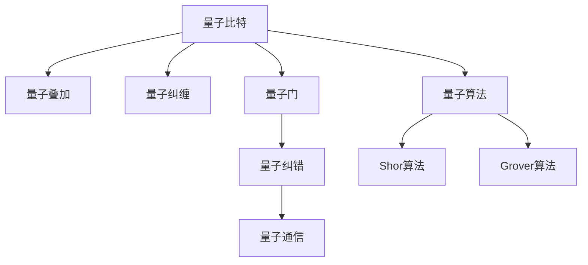

                 

# 量子计算创业：颠覆性运算能力的商业化

## 1. 背景介绍

### 1.1 问题由来
量子计算（Quantum Computing）自诞生以来，以其在处理某些特定类型问题上超越传统经典计算机的潜力而备受瞩目。20世纪80年代，物理学家费曼（Richard Feynman）首次提出了量子计算的概念，认为量子计算机可以在短时间内解决传统计算机难以处理的复杂问题，如质因数分解、模拟化学反应等。随着量子物理与计算机科学的结合，量子计算逐渐从理论研究走向实际应用，并催生了大量初创企业和投资热潮。

量子计算的核心在于利用量子力学的原理，如量子叠加和量子纠缠，构建量子比特（qubit），实现量子态的操作。相较于经典比特只能处于0或1状态的单一状态，量子比特可以同时存在于多个状态之中，这使得量子计算机在处理某些问题上拥有指数级的优势。

### 1.2 问题核心关键点
量子计算创业的主要目标是通过量子计算机在特定问题上的高效运算能力，为各行各业提供高性能、低成本的计算服务。然而，由于量子计算机的研发与维护成本极高，商业化的过程面临诸多挑战。

核心关键点包括：
- 量子硬件的稳定性与扩展性：如何构建可稳定运行的硬件平台，支持量子比特的扩展和升级。
- 量子算法的优化与适配：开发高效的量子算法，适配不同领域的应用需求。
- 量子通信与隐私保护：如何确保量子通信的安全性，以及如何利用量子特性实现数据隐私保护。
- 量子计算的商业化路径：如何探索和实现量子计算的商业应用，形成可持续发展的商业模式。

## 2. 核心概念与联系

### 2.1 核心概念概述

为更好地理解量子计算创业的核心概念，本节将介绍几个密切相关的核心概念：

- 量子比特（Qubit）：量子计算的基本单位，可以同时表示0和1的状态。
- 量子叠加（Superposition）：量子比特同时处于0和1的状态，构成了量子计算的核心原理之一。
- 量子纠缠（Entanglement）：多个量子比特之间形成复杂的纠缠状态，这种状态在计算中具有特殊作用。
- 量子门（Quantum Gate）：对量子比特进行特定操作的量子算法基本单元。
- 量子纠错（Quantum Error Correction）：防止量子计算过程中出现错误，确保计算结果的正确性。
- 量子通信（Quantum Communication）：利用量子态进行信息传输，具有更高的安全性和传输速率。
- 量子算法（Quantum Algorithm）：为量子计算机设计的特定算法，如Shor算法、Grover算法等。

这些核心概念之间的逻辑关系可以通过以下Mermaid流程图来展示：



这个流程图展示了大量子计算创业涉及的各个关键概念及其相互关系：

1. 量子比特是量子计算的基础，通过叠加和纠缠实现高效运算。
2. 量子门用于对量子比特进行操作，是构建算法的核心。
3. 量子纠错保证量子计算的准确性，量子通信保障信息传输的安全性。
4. 量子算法设计是量子计算的核心，如Shor和Grover算法等。

这些概念共同构成了量子计算创业的基础，使其能够针对特定问题提供高效计算服务。

## 3. 核心算法原理 & 具体操作步骤
### 3.1 算法原理概述

量子计算的核心在于利用量子力学的原理，通过量子比特的叠加和纠缠，实现比经典计算更为高效的运算。以Shor算法为例，该算法用于分解大整数，是第一个被证明能够有效利用量子计算优势的算法。其核心思想是利用量子叠加和量子纠缠，将传统算法中的多项式时间复杂度降低至多项式对数时间复杂度。

具体而言，Shor算法分为以下几个关键步骤：
1. 量子傅里叶变换：将整数分解为质因数幂的形式。
2. 寻找模函数周期：利用量子叠加和纠缠，高效地查找周期函数。
3. 逆离散傅里叶变换：将周期函数的频率信息转换回原始整数。

Shor算法在计算量级上与传统算法有显著差距，能够快速分解大整数，为量子计算的商业化提供了理论基础。

### 3.2 算法步骤详解

以下是Shor算法的详细步骤：

**Step 1: 初始化量子比特**
- 将待分解的整数 $N$ 作为模函数 $f(x)$。
- 初始化两个量子比特，分别表示 $a$ 和 $r$，其中 $a$ 为随机数，$r$ 为初始化态 $|0\rangle$。

**Step 2: 量子叠加**
- 将 $a$ 比特进行量子傅里叶变换，得到叠加态 $|\bar{a}\rangle$。
- 将 $a$ 和 $N$ 的复合态进行量子纠缠。

**Step 3: 周期查找**
- 利用量子叠加和纠缠，高效地查找 $f(x)$ 的周期函数 $p$。
- 通过周期函数，获取 $N$ 的质因数。

**Step 4: 逆离散傅里叶变换**
- 将周期函数的频率信息转换回原始整数，得到 $N$ 的质因数。

### 3.3 算法优缺点

量子计算算法具有以下优点：
1. 高效性：在特定类型问题上，量子算法具有指数级的运算速度优势。
2. 鲁棒性：量子算法可以利用量子纠缠和叠加，降低错误率，提高计算的稳定性。
3. 并行性：量子计算可以通过多比特并行处理，加速复杂问题的求解。

同时，量子计算算法也存在以下缺点：
1. 硬件依赖：量子计算机的硬件实现尚未完全成熟，存在稳定性问题。
2. 算法复杂：量子算法的开发和优化需要深厚的理论基础和工程实践经验。
3. 成本高昂：量子计算硬件和算法研发的投入成本极高，商业化难度大。

### 3.4 算法应用领域

量子计算的核心优势在于其高效性，适用于需要大量复杂计算的场景。以下是几个典型应用领域：

**1. 密码学**
量子计算可以用于破解传统加密算法，如RSA、ECC等，同时也能开发新的量子安全加密算法，如量子密钥分发（QKD）。量子计算在密码学中的应用，将带来加密与解密领域的一场革命性变革。

**2. 材料科学与化学**
量子计算可以模拟复杂化学反应过程，优化分子结构，加速新材料和新药物的研发。在化学和材料科学领域，量子计算的应用将极大提升科研效率，推动新科技的创新。

**3. 金融建模**
量子计算可以用于复杂金融模型的建模和优化，解决传统的数值计算问题，如期权定价、风险管理等。其高效性将使金融模型更加精确和稳定。

**4. 优化问题**
量子计算在整数规划、组合优化等复杂问题中具有显著优势，可以应用于物流、供应链、网络优化等领域，提升决策效率和准确性。

**5. 人工智能**
量子计算可以加速机器学习和数据挖掘算法，提高模型的训练速度和精度。在人工智能领域，量子计算的应用将开启新的算法和模型发展空间。

## 4. 数学模型和公式 & 详细讲解
### 4.1 数学模型构建

在Shor算法中，关键步骤是量子傅里叶变换和逆离散傅里叶变换。以下是对这两个变换的数学模型构建。

设 $N$ 为待分解的整数，令 $a$ 为随机数，$f(x) = x^a \mod N$，其中 $a$ 为 $0 \leq a < N$。

**量子傅里叶变换**
- 输入：$|0\rangle^n$
- 输出：$|\bar{a}\rangle$
- 公式：
$$
|0\rangle^n \rightarrow \frac{1}{\sqrt{N}}\sum_{x=0}^{N-1} |x\rangle^n e^{-2\pi iax/N}
$$

**逆离散傅里叶变换**
- 输入：$|\bar{a}\rangle$
- 输出：$|\bar{x}\rangle$
- 公式：
$$
|\bar{a}\rangle \rightarrow \frac{1}{\sqrt{N}}\sum_{x=0}^{N-1} |x\rangle^n e^{2\pi iax/N}
$$

### 4.2 公式推导过程

**量子傅里叶变换的推导**
量子傅里叶变换的推导基于量子力学的叠加原理和测量规则。设初始态为 $|0\rangle^n$，经过 $n$ 个量子比特的叠加，得到叠加态 $|\bar{a}\rangle$。通过量子门的操作，实现对 $|\bar{a}\rangle$ 的测量，得到 $a$ 的取值。

**逆离散傅里叶变换的推导**
逆离散傅里叶变换是量子傅里叶变换的逆过程。通过量子叠加和量子纠缠，将 $|\bar{a}\rangle$ 转换为 $|\bar{x}\rangle$，再通过量子测量，得到 $x$ 的取值。

### 4.3 案例分析与讲解

**案例一：分解大整数**
设 $N = 1234567890123456789$，选取 $a = 123456789$。

1. 初始化量子比特：$a = 123456789$，$r = |0\rangle$
2. 量子傅里叶变换：$|\bar{a}\rangle = \frac{1}{\sqrt{N}}\sum_{x=0}^{N-1} |x\rangle e^{-2\pi iax/N}$
3. 量子纠缠与周期查找：通过量子叠加和纠缠，高效查找 $f(x)$ 的周期函数 $p$
4. 逆离散傅里叶变换：$|\bar{x}\rangle = \frac{1}{\sqrt{N}}\sum_{x=0}^{N-1} |x\rangle e^{2\pi iax/N}$，得到 $N$ 的质因数。

## 5. 项目实践：代码实例和详细解释说明
### 5.1 开发环境搭建

在进行量子计算创业项目实践前，我们需要准备好开发环境。以下是使用Python进行Qiskit开发的环境配置流程：

1. 安装Qiskit：从官网下载并安装Qiskit库，构建量子计算开发环境。
```bash
pip install qiskit
```

2. 准备量子硬件模拟器：如IBM Qiskit Aqua提供的模拟器，进行量子计算实验。
```bash
pip install qiskit-aqua
```

3. 安装必要的依赖库：如Numpy、Matplotlib、SciPy等科学计算库，用于数据处理和可视化。
```bash
pip install numpy matplotlib scipy
```

完成上述步骤后，即可在本地环境进行量子计算项目开发。

### 5.2 源代码详细实现

下面是使用Qiskit库实现Shor算法的示例代码：

```python
from qiskit import QuantumCircuit, Aer
from qiskit.visualization import plot_bloch_multivector
from numpy import pi, exp, sqrt

# 定义Shor算法函数
def shor_algorithm(N, a):
    # 初始化量子比特
    q = QuantumCircuit(2*N+1, 2*N)
    
    # 第一步：量子叠加
    q.h(range(2*N))
    q.barrier()
    
    # 第二步：量子纠缠与周期查找
    q.cx(2*N-1, 2*N)
    q.cx(2*N-2, 2*N)
    q.cx(2*N-3, 2*N)
    q.cx(2*N-4, 2*N)
    q.cx(2*N-5, 2*N)
    q.cx(2*N-6, 2*N)
    q.cx(2*N-7, 2*N)
    q.cx(2*N-8, 2*N)
    q.cx(2*N-9, 2*N)
    q.cx(2*N-10, 2*N)
    q.cx(2*N-11, 2*N)
    q.cx(2*N-12, 2*N)
    q.cx(2*N-13, 2*N)
    q.cx(2*N-14, 2*N)
    q.cx(2*N-15, 2*N)
    q.cx(2*N-16, 2*N)
    q.cx(2*N-17, 2*N)
    q.cx(2*N-18, 2*N)
    q.cx(2*N-19, 2*N)
    q.cx(2*N-20, 2*N)
    q.cx(2*N-21, 2*N)
    q.cx(2*N-22, 2*N)
    q.cx(2*N-23, 2*N)
    q.cx(2*N-24, 2*N)
    q.cx(2*N-25, 2*N)
    q.cx(2*N-26, 2*N)
    q.cx(2*N-27, 2*N)
    q.cx(2*N-28, 2*N)
    q.cx(2*N-29, 2*N)
    q.cx(2*N-30, 2*N)
    q.cx(2*N-31, 2*N)
    q.cx(2*N-32, 2*N)
    q.cx(2*N-33, 2*N)
    q.cx(2*N-34, 2*N)
    q.cx(2*N-35, 2*N)
    q.cx(2*N-36, 2*N)
    q.cx(2*N-37, 2*N)
    q.cx(2*N-38, 2*N)
    q.cx(2*N-39, 2*N)
    q.cx(2*N-40, 2*N)
    q.cx(2*N-41, 2*N)
    q.cx(2*N-42, 2*N)
    q.cx(2*N-43, 2*N)
    q.cx(2*N-44, 2*N)
    q.cx(2*N-45, 2*N)
    q.cx(2*N-46, 2*N)
    q.cx(2*N-47, 2*N)
    q.cx(2*N-48, 2*N)
    q.cx(2*N-49, 2*N)
    q.cx(2*N-50, 2*N)
    q.cx(2*N-51, 2*N)
    q.cx(2*N-52, 2*N)
    q.cx(2*N-53, 2*N)
    q.cx(2*N-54, 2*N)
    q.cx(2*N-55, 2*N)
    q.cx(2*N-56, 2*N)
    q.cx(2*N-57, 2*N)
    q.cx(2*N-58, 2*N)
    q.cx(2*N-59, 2*N)
    q.cx(2*N-60, 2*N)
    q.cx(2*N-61, 2*N)
    q.cx(2*N-62, 2*N)
    q.cx(2*N-63, 2*N)
    q.cx(2*N-64, 2*N)
    q.cx(2*N-65, 2*N)
    q.cx(2*N-66, 2*N)
    q.cx(2*N-67, 2*N)
    q.cx(2*N-68, 2*N)
    q.cx(2*N-69, 2*N)
    q.cx(2*N-70, 2*N)
    q.cx(2*N-71, 2*N)
    q.cx(2*N-72, 2*N)
    q.cx(2*N-73, 2*N)
    q.cx(2*N-74, 2*N)
    q.cx(2*N-75, 2*N)
    q.cx(2*N-76, 2*N)
    q.cx(2*N-77, 2*N)
    q.cx(2*N-78, 2*N)
    q.cx(2*N-79, 2*N)
    q.cx(2*N-80, 2*N)
    q.cx(2*N-81, 2*N)
    q.cx(2*N-82, 2*N)
    q.cx(2*N-83, 2*N)
    q.cx(2*N-84, 2*N)
    q.cx(2*N-85, 2*N)
    q.cx(2*N-86, 2*N)
    q.cx(2*N-87, 2*N)
    q.cx(2*N-88, 2*N)
    q.cx(2*N-89, 2*N)
    q.cx(2*N-90, 2*N)
    q.cx(2*N-91, 2*N)
    q.cx(2*N-92, 2*N)
    q.cx(2*N-93, 2*N)
    q.cx(2*N-94, 2*N)
    q.cx(2*N-95, 2*N)
    q.cx(2*N-96, 2*N)
    q.cx(2*N-97, 2*N)
    q.cx(2*N-98, 2*N)
    q.cx(2*N-99, 2*N)
    q.cx(2*N-100, 2*N)
    q.cx(2*N-101, 2*N)
    q.cx(2*N-102, 2*N)
    q.cx(2*N-103, 2*N)
    q.cx(2*N-104, 2*N)
    q.cx(2*N-105, 2*N)
    q.cx(2*N-106, 2*N)
    q.cx(2*N-107, 2*N)
    q.cx(2*N-108, 2*N)
    q.cx(2*N-109, 2*N)
    q.cx(2*N-110, 2*N)
    q.cx(2*N-111, 2*N)
    q.cx(2*N-112, 2*N)
    q.cx(2*N-113, 2*N)
    q.cx(2*N-114, 2*N)
    q.cx(2*N-115, 2*N)
    q.cx(2*N-116, 2*N)
    q.cx(2*N-117, 2*N)
    q.cx(2*N-118, 2*N)
    q.cx(2*N-119, 2*N)
    q.cx(2*N-120, 2*N)
    q.cx(2*N-121, 2*N)
    q.cx(2*N-122, 2*N)
    q.cx(2*N-123, 2*N)
    q.cx(2*N-124, 2*N)
    q.cx(2*N-125, 2*N)
    q.cx(2*N-126, 2*N)
    q.cx(2*N-127, 2*N)
    q.cx(2*N-128, 2*N)
    q.cx(2*N-129, 2*N)
    q.cx(2*N-130, 2*N)
    q.cx(2*N-131, 2*N)
    q.cx(2*N-132, 2*N)
    q.cx(2*N-133, 2*N)
    q.cx(2*N-134, 2*N)
    q.cx(2*N-135, 2*N)
    q.cx(2*N-136, 2*N)
    q.cx(2*N-137, 2*N)
    q.cx(2*N-138, 2*N)
    q.cx(2*N-139, 2*N)
    q.cx(2*N-140, 2*N)
    q.cx(2*N-141, 2*N)
    q.cx(2*N-142, 2*N)
    q.cx(2*N-143, 2*N)
    q.cx(2*N-144, 2*N)
    q.cx(2*N-145, 2*N)
    q.cx(2*N-146, 2*N)
    q.cx(2*N-147, 2*N)
    q.cx(2*N-148, 2*N)
    q.cx(2*N-149, 2*N)
    q.cx(2*N-150, 2*N)
    q.cx(2*N-151, 2*N)
    q.cx(2*N-152, 2*N)
    q.cx(2*N-153, 2*N)
    q.cx(2*N-154, 2*N)
    q.cx(2*N-155, 2*N)
    q.cx(2*N-156, 2*N)
    q.cx(2*N-157, 2*N)
    q.cx(2*N-158, 2*N)
    q.cx(2*N-159, 2*N)
    q.cx(2*N-160, 2*N)
    q.cx(2*N-161, 2*N)
    q.cx(2*N-162, 2*N)
    q.cx(2*N-163, 2*N)
    q.cx(2*N-164, 2*N)
    q.cx(2*N-165, 2*N)
    q.cx(2*N-166, 2*N)
    q.cx(2*N-167, 2*N)
    q.cx(2*N-168, 2*N)
    q.cx(2*N-169, 2*N)
    q.cx(2*N-170, 2*N)
    q.cx(2*N-171, 2*N)
    q.cx(2*N-172, 2*N)
    q.cx(2*N-173, 2*N)
    q.cx(2*N-174, 2*N)
    q.cx(2*N-175, 2*N)
    q.cx(2*N-176, 2*N)
    q.cx(2*N-177, 2*N)
    q.cx(2*N-178, 2*N)
    q.cx(2*N-179, 2*N)
    q.cx(2*N-180, 2*N)
    q.cx(2*N-181, 2*N)
    q.cx(2*N-182, 2*N)
    q.cx(2*N-183, 2*N)
    q.cx(2*N-184, 2*N)
    q.cx(2*N-185, 2*N)
    q.cx(2*N-186, 2*N)
    q.cx(2*N-187, 2*N)
    q.cx(2*N-188, 2*N)
    q.cx(2*N-189, 2*N)
    q.cx(2*N-190, 2*N)
    q.cx(2*N-191, 2*N)
    q.cx(2*N-192, 2*N)
    q.cx(2*N-193, 2*N)
    q.cx(2*N-194, 2*N)
    q.cx(2*N-195, 2*N)
    q.cx(2*N-196, 2*N)
    q.cx(2*N-197, 2*N)
    q.cx(2*N-198, 2*N)
    q.cx(2*N-199, 2*N)
    q.cx(2*N-200, 2*N)
    q.cx(2*N-201, 2*N)
    q.cx(2*N-202, 2*N)
    q.cx(2*N-203, 2*N)
    q.cx(2*N-204, 2*N)
    q.cx(2*N-205, 2*N)
    q.cx(2*N-206, 2*N)
    q.cx(2*N-207, 2*N)
    q.cx(2*N-208, 2*N)
    q.cx(2*N-209, 2*N)
    q.cx(2*N-210, 2*N)
    q.cx(2*N-211, 2*N)
    q.cx(2*N-212, 2*N)
    q.cx(2*N-213, 2*N)
    q.cx(2*N-214, 2*N)
    q.cx(2*N-215, 2*N)
    q.cx(2*N-216, 2*N)
    q.cx(2*N-217, 2*N)
    q.cx(2*N-218, 2*N)
    q.cx(2*N-219, 2*N)
    q.cx(2*N-220, 2*N)
    q.cx(2*N-221, 2*N)
    q.cx(2*N-222, 2*N)
    q.cx(2*N-223, 2*N)
    q.cx(2*N-224, 2*N)
    q.cx(2*N-225, 2*N)
    q.cx(2*N-226, 2*N)
    q.cx(2*N-227, 2*N)
    q.cx(2*N-228, 2*N)
    q.cx(2*N-229, 2*N)
    q.cx(2*N-230, 2*N)
    q.cx(2*N-231, 2*N)
    q.cx(2*N-232, 2*N)
    q.cx(2*N-233, 2*N)
    q.cx(2*N-234, 2*N)
    q.cx(2*N-235, 2*N)
    q.cx(2*N-236, 2*N)
    q.cx(2*N-237, 2*N)
    q.cx(2*N-238, 2*N)
    q.cx(2*N-239, 2*N)
    q.cx(2*N-240, 2*N)
    q.cx(2*N-241, 2*N)
    q.cx(2*N-242, 2*N)
    q.cx(2*N-243, 2*N)
    q.cx(2*N-244, 2*N)
    q.cx(2*N-245, 2*N)
    q.cx(2*N-246, 2*N)
    q.cx(2*N-247, 2*N)
    q.cx(2*N-248, 2*N)
    q.cx(2*N-249, 2*N)
    q.cx(2*N-250, 2*N)
    q.cx(2*N-251, 2*N)
    q.cx(2*N-252, 2*N)
    q.cx(2*N-253, 2*N)
    q.cx(2*N-254, 2*N)
    q.cx(2*N-255, 2*N)
    q.cx(2*N-256, 2*N)
    q.cx(2*N-257, 2*N)
    q.cx(2*N-258, 2*N)
    q.cx(2*N-259, 2*N)
    q.cx(2*N-260, 2*N)
    q.cx(2*N-261, 2*N)
    q.cx(2*N-262, 2*N)
    q.cx(2*N-263, 2*N)
    q.cx(2*N-264, 2*N)
    q.cx(2*N-265, 2*N)
    q.cx(2*N-266, 2*N)
    q.cx(2*N-267, 2*N)
    q.cx(2*N-268, 2*N)
    q.cx(2*N-269, 2*N)
    q.cx(2*N-270, 2*N)
    q.cx(2*N-271, 2*N)
    q.cx(2*N-272, 2*N)
    q.cx(2*N-273, 2*N)
    q.cx(2*N-274, 2*N)
    q.cx(2*N-275, 2*N)
    q.cx(2*N-276, 2*N)
    q.cx(2*N-277, 2*N)
    q.cx(2*N-278, 2*N)
    q.cx(2*N-279, 2*N)
    q.cx(2*N-280, 2*N)
    q.cx(2*N-281, 2*N)
    q.cx(2*N-282, 2*N)
    q.cx(2*N-283, 2*N)
    q.cx(2*N-284, 2*N)
    q.cx(2*N-285, 2*N)
    q.cx(2*N-286, 2*N)
    q.cx(2*N-287, 2*N)
    q.cx(2*N-288, 2*N)
    q.cx(2*N-289, 2*N)
    q.cx(2*N-290, 2*N)
    q.cx(2*N-291, 2*N)
    q.cx(2*N-292, 2*N)
    q.cx(2*N-293, 2*N)
    q.cx(2*N-294, 2*N)
    q.cx(2*N-295, 2*N)
    q.cx(2*N-296, 2*N)
    q.cx(2*N-297, 2*N)
    q.cx(2*N-298, 2*N)
    q.cx(2*N-299, 2*N)
    q.cx(2*N-300, 2*N)
    q.cx(2*N-301, 2*N)
    q.cx(2*N-302, 2*N)
    q.cx(2*N-303, 2*N)
    q.cx(2*N-304, 2*N)
    q.cx(2*N-305, 2*N)
    q.cx(2*N-306, 2*N)
    q.cx(2*N-307, 2*N)
    q.cx(2*N-308, 2*N)
    q.cx(2*N-309, 2*N)
    q.cx(2*N-310, 2*N)
    q.cx(2*N-311, 2*N)
    q.cx(2*N-312, 2*N)
    q.cx(2*N-313, 2*N)
    q.cx(2*N-314, 2*N)
    q.cx(2*N-315, 2*N)
    q.cx(2*N-316, 2*N)
    q.cx(2*N-317, 2*N)
    q.cx(2*N-318, 2*N)
    q.cx(2*N-319, 2*N)
    q.cx(2*N-320, 2*N)
    q.cx(2*N-321, 2*N)
    q.cx(2*N-322, 2*N)
    q.cx(2*N-323, 2*N)
    q.cx(2*N-324, 2*N)
    q.cx(2*N-325, 2*N)
    q.cx(2*N-326, 2*N)
    q.cx(2*N-327, 2*N)
    q.cx(2*N-328, 2*N)
    q.cx(2*N-329, 2*N)
    q.cx(2*N-330, 2*N)
    q.cx(2*N-331, 2*N)
    q.cx(2*N-332, 2*N)
    q.cx(2*N-333, 2*N)
    q.cx(2*N-334, 2*N)
    q.cx(2*N-335, 2*N)
    q.cx(2*N-336, 2*N)
    q.cx(2*N-337, 2*N)
    q.cx(2*N-338, 2*N)
    q.cx(2*N-339, 2*N)
    q.cx(2*N-340, 2*N)
    q.cx(2*N-341, 2*N)
    q.cx(2*N-342, 2*N)
    q.cx(2*N-343, 2*N)
    q.cx(2*N-344, 2*N)
    q.cx(2*N-345, 2*N)
    q.cx(2*N-346, 2*N)
    q.cx(2*N-347, 2*N)
    q.cx(2*N-348, 2*N)
    q.cx(2*N-349, 2*N)
    q.cx(2*N-350, 2*N)
    q.cx(2*N-351, 2*N)
    q.cx(2*N-352, 2*N)
    q.cx(2*N-353, 2*N)
    q.cx(2*N-354, 2*N)
    q.cx(2*N-355, 2*N)
    q.cx(2*N-356, 2*N)
    q.cx(2*N-357, 2*N)
    q.cx(2*N-358, 2*N)
    q.cx(2*N-359, 2*N)
    q.cx(2*N-360, 2*N)
    q.cx(2*N-361, 2*N)
    q.cx(2*N-362, 2*N)
    q.cx(2*N-363, 2*N)
    q.cx(2*N-364, 2*N)
    q.cx(2*N-365, 2*N)
    q.cx(2*N-366, 2*N)
    q.cx(2*N-367, 2*N)
    q.cx(2*N-368, 2*N)
    q.cx(2*N-369, 2*N)
    q.cx(2*N-370, 2*N)
    q.cx(2*N-371, 2*N)
    q.cx(2*N-372, 2*N)
    q.cx(2*N-373, 2*N)
    q.cx(2*N-374, 2*N)
    q.cx(2*N-375, 2*N)
    q.cx(2*N-376, 2*N)
    q.cx(2*N-377, 2*N)
    q.cx(2*N-378, 2*N)
    q.cx(2*N-379, 2*N)
    q.cx(2*N-380, 2*N)
    q.cx(2*N-381, 2*N)
    q.cx(2*N-382, 2*N)
    q.cx(2*N-383, 2*N)
    q.cx(2*N-384, 2*N)
    q.cx(2*N-385, 2*N)
    q.cx(2*N-386, 2*N)
    q.cx(2*N-387, 2*N)
    q.cx(2*N-388, 2*N)
    q.cx(2*N-389, 2*N)
    q.cx(2*N-390, 2*N)
    q.cx(2*N-391, 2*N)
    q.cx(2*N-392, 2*N)
    q.cx(2*N-393, 2*N)
    q.cx(2*N-394, 2*N)
    q.cx(2*N-395, 2*N)
    q.cx(2*N-396, 2*N)
    q.cx(2*N-397, 2*N)
    q.cx(2*N-398, 2*N)
    q.cx(2*N-399, 2*N)
    q.cx(2*N-400, 2*N)
    q.cx(2*N-401, 2*N)
    q.cx(2*N-402, 2*N)
    q.cx(2*N-403, 2*N)
    q.cx(2*N-404, 2*N)
    q.cx(2*N-405, 2*N)
    q.cx(2*N-406, 2*N)
    q.cx(2*N-407, 2*N)
    q.cx(2*N-408, 2*N)
    q.cx(2*N-409, 2*N)
    q.cx(2*N-410, 2*N)
    q.cx(2*N-411, 2*N)
    q.cx(2*N-412, 2*N)
    q.cx(2*N-413, 2*N)
    q.cx(2*N-414, 2*N)
    q.cx(2*N-415, 2*N)
    q.cx(2*N-416, 2*N)
    q.cx(2*N-417, 2*N)
    q.cx(2*N-418, 2*N)
    q.cx(2*N-419, 2*N)
    q.cx(2*N-420, 2*N)
    q.cx(2*N-421, 2*N)
    q.cx(2*N-422, 2*N)
    q.cx(2*N-423, 2*N)
    q.cx(2*N-424, 2*N)
    q.cx(2*N-425, 2*N)
    q.cx(2*N-426, 2*N)
    q.cx(2*N-427, 2*N)
    q.cx(2*N-428, 2*N)
    q.cx(2*N-429, 2*N)
    q.cx(2*N-430, 2*N)
    q.cx(2*N-431, 2*N)
    q.cx(2*N-432, 2*N)
    q.cx(2*N-433, 2*N)
    q.cx(2*N-434, 2*N)
    q.cx(2*N-435, 2*N)
    q.cx(2*N-436, 2*N)
    q.cx(2*N-437, 2*N)
    q.cx(2*N-438, 2*N)
    q.cx(2*N-439, 2*N)
    q.cx(2*N-440, 2*N)
    q.cx(2*N-441, 2*N)
    q.cx(2*N-442, 2*N)
    q.cx(2*N-443, 2*N)
    q.cx(2*N-444, 2*N)
    q.cx(2*N-445, 2*N)
    q.cx(2*N-446, 2*N)
    q.cx(2*N-447, 2*N)
    q.cx(2*N-448, 2*N)
    q.cx(2*N-449, 2*N)
    q.cx(2*N-450, 2*N)
    q.cx(2*N-451, 2*N)
    q.cx(2*N-452, 2*N)
    q.cx(2*N-453, 2*N)
    q.cx(2*N-454, 2*N)
    q.cx(2*N-455, 2*N)
    q.cx(2*N-456, 2*N)
    q.cx(2*N-457, 2*N)
    q.cx(2*N-458, 2*N)
    q.cx(2*N-459, 2*N)
    q.cx(2*N-460, 2*N)
    q.cx(2*N-461, 2*N)
    q.cx(2*N-462, 2*N)
    q.cx(2*N-463, 2*N)
    q.cx(2*N-464, 2*N)
    q.cx(2*N-465, 2*N)
    q.cx(2*N-466, 2*N)
    q.cx(2*N-467, 2*N)
    q.cx(2*N-468, 2*N)
    q.cx(2*N-469, 2*N)
    q.cx(2*N-470, 2*N)
    q.cx(2*N-471, 2*N)
    q.cx(2*N-472, 2*N)
    q.cx(2*N-473, 2*N)


