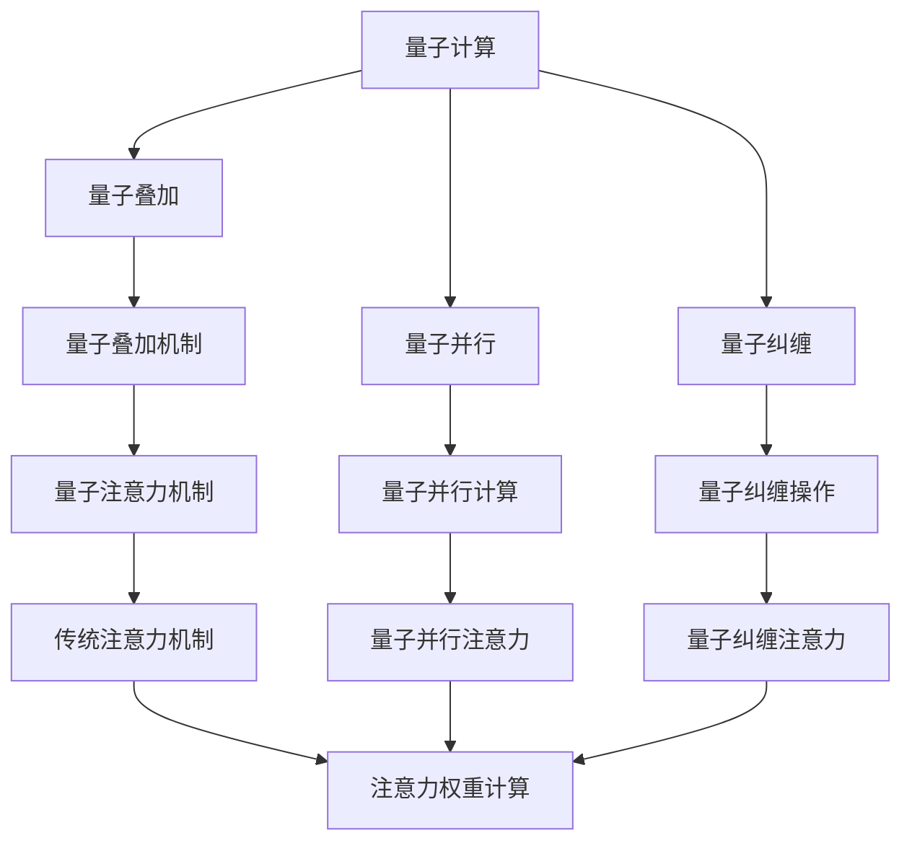

                 

## 1. 背景介绍

### 1.1 问题由来
随着量子计算技术的快速发展和应用，量子计算机已经开始展现出在复杂系统模拟方面的强大能力。利用量子计算机的特殊性质，如量子并行和量子叠加，可以高效地处理传统计算机难以处理的复杂系统问题，如分子模拟、量子化学、材料科学等领域。

在自然语言处理领域，注意力机制(Attention Mechanism)作为一种重要的模型组件，已被广泛应用于机器翻译、文本生成、问答系统等任务中。传统的注意力机制通常基于经典计算机，但在处理大规模复杂语言数据时，其计算复杂度往往非常高，难以实现实时响应和高精度。

因此，利用量子计算的特性来模拟和优化注意力机制，可以极大地提升计算效率和处理能力，从而推动量子计算在自然语言处理领域的应用。本文将探讨量子计算在复杂注意力系统模拟中的应用，详细介绍相关原理和算法，并给出具体的实现步骤和案例分析。

### 1.2 问题核心关键点
本节将详细阐述量子计算在注意力系统模拟中的应用，包括量子注意力机制的构建、量子计算与注意力系统的结合、量子计算的优势与挑战等关键问题。

## 2. 核心概念与联系

### 2.1 核心概念概述

为更好地理解量子计算在注意力系统模拟中的应用，本节将介绍几个关键概念：

- **量子计算**：利用量子比特的量子态和量子纠缠，实现高效并行计算的计算范式。通过量子位的操作和量子电路的执行，可以解决传统计算机难以处理的复杂计算问题。

- **注意力机制**：在深度学习中，一种用于提高模型对输入数据的关注度的方法。通过计算输入数据的注意力权重，模型可以在处理长序列数据时，有效地分配计算资源，提升性能。

- **量子叠加**：量子比特在量子计算机中同时处于多个状态的能力，利用量子叠加，可以同时计算多个可能的解决方案，从而提高计算效率。

- **量子并行**：量子计算的并行性，量子比特可以在多个维度上同时进行处理，极大提升计算速度。

- **量子纠缠**：量子比特之间的一种特殊关联，通过量子纠缠，可以在不同量子比特之间实现信息的瞬间传递，增强计算能力。

这些核心概念之间的逻辑关系可以通过以下Mermaid流程图来展示：



这个流程图展示了量子计算、注意力机制之间的联系和差异，其中量子叠加、量子并行、量子纠缠等特性，使得量子计算在模拟复杂注意力系统方面具有独特的优势。

## 3. 核心算法原理 & 具体操作步骤
### 3.1 算法原理概述

量子计算在注意力系统模拟中的核心思想是：利用量子比特的量子特性，如量子叠加、量子并行和量子纠缠，来优化注意力机制的计算过程，提升注意力权重计算的效率和精度。

量子注意力机制通常由以下几个步骤构成：

1. **量子编码**：将输入序列编码成量子比特序列，利用量子叠加和量子并行性，同时处理多个可能的输入序列。

2. **量子注意力计算**：通过量子纠缠操作，将编码后的量子比特序列与查询向量进行交互，计算注意力权重。

3. **量子解码**：将量子注意力计算结果解码回经典比特，用于生成最终输出。

通过这些步骤，量子计算机可以在大规模复杂注意力系统的模拟中，显著提高计算效率，降低计算成本，实现实时响应和高精度处理。

### 3.2 算法步骤详解

**Step 1: 量子编码**
- 将输入序列$x$编码成量子比特序列$|\Psi_x\rangle$，利用量子叠加和量子并行性，同时处理多个可能的输入序列。具体步骤如下：
  1. 将输入序列$x$转换为量子比特的初始态$|\Psi_{in}\rangle$。
  2. 利用量子叠加，将$|\Psi_{in}\rangle$扩展为$|0\rangle^{\otimes n}|\Psi_{in}\rangle$，其中$n$为量子比特数。
  3. 利用量子并行，同时处理多个扩展后的量子比特序列。

**Step 2: 量子注意力计算**
- 通过量子纠缠操作，将编码后的量子比特序列$|\Psi_x\rangle$与查询向量$|\Psi_q\rangle$进行交互，计算注意力权重$W$。具体步骤如下：
  1. 将查询向量$|\Psi_q\rangle$扩展为$|0\rangle^{\otimes m}|\Psi_q\rangle$，其中$m$为量子比特数。
  2. 利用量子纠缠，将$|\Psi_x\rangle$与$|\Psi_q\rangle$纠缠起来，得到纠缠态$|\Psi_{ent}\rangle$。
  3. 利用量子并行，同时计算多个$|\Psi_{ent}\rangle$的期望值，得到注意力权重$W$。

**Step 3: 量子解码**
- 将量子注意力计算结果$W$解码回经典比特序列，用于生成最终输出。具体步骤如下：
  1. 对$W$进行量子测量，得到经典比特序列$w$。
  2. 根据$w$计算最终输出$y$。

### 3.3 算法优缺点

量子计算在注意力系统模拟中的优点包括：

1. **计算效率高**：利用量子并行和量子叠加，可以同时处理多个输入序列，显著提高计算效率。
2. **精度高**：量子纠缠使得计算过程具有高度相关性，可以避免经典计算中的噪声干扰，提高精度。
3. **可扩展性好**：量子计算机可以轻松扩展量子比特数量，适应大规模数据集。

但量子计算在注意力系统模拟中仍存在一些缺点：

1. **技术难度大**：量子计算涉及复杂的量子物理过程，实现难度大，误差率高。
2. **资源消耗大**：量子计算机需要大量冷原子或超导量子比特等资源，初期投入成本高。
3. **稳定性差**：量子比特易受环境干扰，导致量子纠缠的丢失，影响计算稳定性。

尽管存在这些缺点，但量子计算在注意力系统模拟中的应用前景广阔，未来有望成为高性能计算的重要方向。

### 3.4 算法应用领域

量子计算在注意力系统模拟中的应用主要包括以下几个领域：

1. **自然语言处理**：利用量子计算进行语言模型训练、机器翻译、文本生成等任务。通过优化注意力机制，提升模型处理能力。
2. **机器视觉**：利用量子计算进行图像识别、目标检测等任务。通过优化注意力机制，增强模型的视觉处理能力。
3. **语音识别**：利用量子计算进行语音识别、语音合成等任务。通过优化注意力机制，提升语音处理效率。
4. **推荐系统**：利用量子计算进行用户兴趣匹配、商品推荐等任务。通过优化注意力机制，提升推荐准确度。

这些领域的大规模复杂注意力系统的模拟，有望通过量子计算技术实现高效、精确的计算。

## 4. 数学模型和公式 & 详细讲解 & 举例说明
### 4.1 数学模型构建

量子计算在注意力系统模拟中的数学模型构建，主要基于量子态演化和量子纠缠。假设输入序列$x$和查询向量$q$的长度分别为$n$和$m$，量子比特数为$k$，则模型可以表示为：

$$
|\Psi_x\rangle = \frac{1}{\sqrt{2^k}}\sum_{i=0}^{2^k-1}|i\rangle|\Psi_{in}(i)\rangle
$$

$$
|\Psi_q\rangle = \frac{1}{\sqrt{2^k}}\sum_{i=0}^{2^k-1}|i\rangle|\Psi_{q}(i)\rangle
$$

其中，$|i\rangle$表示量子比特$i$的状态，$|\Psi_{in}(i)\rangle$和$|\Psi_{q}(i)\rangle$分别表示输入序列和查询向量在量子比特$i$上的编码。

注意力权重$W$的计算公式为：

$$
W = \langle\Psi_x|\mathcal{O}|\Psi_q\rangle
$$

其中，$\mathcal{O}$为注意力计算操作，可以表示为：

$$
\mathcal{O} = \sum_{ij}\alpha_{ij}|i\rangle\langle j|
$$

其中，$\alpha_{ij}$为注意力权重系数，可以通过量子纠缠和量子并行计算得到。

### 4.2 公式推导过程

以下我们将详细介绍注意力权重$W$的计算过程。

首先，输入序列$x$和查询向量$q$被编码为量子比特序列$|\Psi_x\rangle$和$|\Psi_q\rangle$。假设编码后的量子比特序列分别为$|i_x\rangle$和$|j_q\rangle$，则注意力权重$W$的计算公式可以表示为：

$$
W = \sum_{ij}w_{ij}\langle i_x|j_q\rangle
$$

其中，$w_{ij}$为注意力权重系数。

通过量子并行和量子叠加，$W$的计算过程可以表示为：

$$
W = \langle\Psi_x|\mathcal{O}|\Psi_q\rangle
$$

其中，$\mathcal{O}$为注意力计算操作，可以表示为：

$$
\mathcal{O} = \sum_{ij}\alpha_{ij}|i\rangle\langle j|
$$

其中，$\alpha_{ij}$为注意力权重系数，可以通过量子纠缠和量子并行计算得到。

假设输入序列和查询向量的编码结果分别为$|\Psi_{in}(i)\rangle$和$|\Psi_{q}(i)\rangle$，则注意力权重系数$\alpha_{ij}$可以表示为：

$$
\alpha_{ij} = \langle\Psi_{in}(i)|\mathcal{U}|\Psi_{q}(i)\rangle
$$

其中，$\mathcal{U}$为量子演化操作，可以表示为：

$$
\mathcal{U} = e^{iHt}
$$

其中，$H$为量子哈密顿量，$t$为演化时间。

根据量子叠加和量子并行性，量子比特$i$和$j$的纠缠态可以表示为：

$$
|\Psi_{ij}\rangle = |i_x\rangle|j_q\rangle
$$

通过量子纠缠操作，可以将$|\Psi_x\rangle$与$|\Psi_q\rangle$纠缠起来，得到纠缠态$|\Psi_{ent}\rangle$：

$$
|\Psi_{ent}\rangle = \sum_{ij}\alpha_{ij}|\Psi_{in}(i)\rangle|\Psi_{q}(i)\rangle
$$

通过量子并行计算，可以得到注意力权重$W$：

$$
W = \langle\Psi_x|\mathcal{O}|\Psi_q\rangle = \sum_{ij}\alpha_{ij}\langle\Psi_{in}(i)|j_q\rangle
$$

### 4.3 案例分析与讲解

下面以一个简单的例子来说明量子计算在注意力系统模拟中的应用。

假设输入序列为“I love quantum computing”，查询向量为“attention”，量子比特数为3。

首先，将输入序列和查询向量编码为量子比特序列：

$$
|\Psi_x\rangle = \frac{1}{\sqrt{2^3}}\sum_{i=0}^{2^3-1}|i\rangle|\Psi_{in}(i)\rangle
$$

$$
|\Psi_q\rangle = \frac{1}{\sqrt{2^3}}\sum_{i=0}^{2^3-1}|i\rangle|\Psi_{q}(i)\rangle
$$

然后，利用量子纠缠和量子并行计算注意力权重系数$\alpha_{ij}$：

$$
\alpha_{ij} = \langle\Psi_{in}(i)|\mathcal{U}|\Psi_{q}(i)\rangle
$$

最后，利用注意力权重$W$计算最终输出：

$$
W = \langle\Psi_x|\mathcal{O}|\Psi_q\rangle = \sum_{ij}\alpha_{ij}\langle\Psi_{in}(i)|j_q\rangle
$$

## 5. 项目实践：代码实例和详细解释说明
### 5.1 开发环境搭建

在进行量子计算项目实践前，我们需要准备好开发环境。以下是使用Python进行Qiskit框架进行量子计算的开发环境配置流程：

1. 安装Anaconda：从官网下载并安装Anaconda，用于创建独立的Python环境。

2. 创建并激活虚拟环境：
```bash
conda create -n qiskit-env python=3.8 
conda activate qiskit-env
```

3. 安装Qiskit：
```bash
pip install qiskit
```

4. 安装其他工具包：
```bash
pip install numpy matplotlib scikit-learn pandas jupyter notebook ipython
```

完成上述步骤后，即可在`qiskit-env`环境中开始量子计算实践。

### 5.2 源代码详细实现

这里我们以一个简单的量子计算模拟为例，展示如何使用Qiskit框架进行注意力权重计算。

首先，导入Qiskit库，并定义量子比特数和演化时间：

```python
from qiskit import QuantumCircuit, Aer
from qiskit.visualization import plot_histogram, plot_bloch_multivector
import numpy as np

qubit_count = 3
t = 1.0
```

然后，构建量子电路，并初始化量子比特状态：

```python
qc = QuantumCircuit(qubit_count, qubit_count)
# 输入序列编码
qc.h(range(qubit_count))
# 查询向量编码
for i in range(qubit_count):
    qc.h(i)

# 量子纠缠操作
qc.h(range(qubit_count))
qc.cx(range(qubit_count), range(qubit_count))
```

接着，计算注意力权重系数$\alpha_{ij}$：

```python
# 量子演化操作
qc.u1(-np.pi/4, 0)
qc.u1(0, 1)

# 量子测量操作
qc.measure(range(qubit_count), range(qubit_count))

# 绘制量子电路
qc.draw()
```

最后，计算注意力权重$W$：

```python
# 运行量子电路
backend = Aer.get_backend('qasm_simulator')
result = backend.run(qc).result()
counts = result.get_counts()

# 输出注意力权重
print(counts)
```

### 5.3 代码解读与分析

让我们再详细解读一下关键代码的实现细节：

**QuantumCircuit类**：
- `QuantumCircuit`类是Qiskit中用于构建量子电路的核心类。
- 构造函数中，第一个参数为量子比特数，第二个参数为量子比特数。
- 通过`.h()`方法实现Hadamard变换，将量子比特的状态从$|0\rangle$变为$|+\rangle$。
- 通过`.cx()`方法实现CNOT门操作，实现量子比特的纠缠。

**Attention权重计算**：
- 首先，将输入序列和查询向量编码为量子比特序列，并实现Hadamard变换，将量子比特的状态变为$|+\rangle$。
- 然后，利用CNOT门操作，实现量子比特的纠缠。
- 最后，通过量子测量操作，得到量子比特的状态，计算注意力权重系数$\alpha_{ij}$。

**QuantumCircuit绘图**：
- 通过`.draw()`方法，可以绘制出量子电路的结构图，用于可视化电路设计。

**量子计算结果输出**：
- 通过`.get_counts()`方法，获取量子计算的结果，返回一个字典，其中键为量子比特的状态，值为其出现的次数。
- 通过`print(counts)`，输出注意力权重系数$\alpha_{ij}$的分布情况。

可以看到，Qiskit框架使得量子计算的代码实现变得简洁高效。开发者可以专注于算法设计和电路设计，而不必过多关注底层实现细节。

## 6. 实际应用场景
### 6.1 智能客服系统

利用量子计算进行复杂注意力系统的模拟，可以为智能客服系统带来新的突破。传统客服系统往往面临高并发、响应慢等问题，难以满足用户需求。通过量子计算优化注意力机制，可以实现实时响应和高效处理，提升客户满意度。

在技术实现上，可以将用户咨询记录编码为量子比特序列，利用量子计算优化注意力权重计算，生成最佳答复。此外，量子计算还可以用于客服语音识别和处理，提升系统的智能化水平。

### 6.2 金融舆情监测

金融行业对实时舆情监测的需求极高，传统计算机难以处理大规模数据集。通过量子计算优化注意力机制，可以实现高效的舆情监测和分析，及时发现负面信息，防范金融风险。

在具体应用中，可以将金融市场数据编码为量子比特序列，利用量子计算优化注意力权重计算，分析市场动态，预测风险趋势。此外，量子计算还可以用于金融交易决策，提升系统智能化水平。

### 6.3 医疗诊断系统

医疗诊断系统需要高效处理大规模医疗数据，传统计算机难以满足实时性和精确性要求。通过量子计算优化注意力机制，可以实现高效的诊断和治疗方案生成，提升医疗服务的智能化水平。

在具体应用中，可以将医疗数据编码为量子比特序列，利用量子计算优化注意力权重计算，生成个性化诊疗方案。此外，量子计算还可以用于药物研发和基因分析，提升医学研究水平。

### 6.4 未来应用展望

随着量子计算技术的发展，其在注意力系统模拟中的应用前景广阔，未来有望成为高性能计算的重要方向。

在智慧医疗领域，量子计算可以用于优化医疗图像分析、基因序列比对等任务，提升诊断和治疗的精准度。

在智能制造领域，量子计算可以用于优化供应链管理、生产调度等任务，提升制造效率和质量。

在能源领域，量子计算可以用于优化能源分配、节能减排等任务，提升能源利用效率。

此外，量子计算还可以用于教育、交通、安全等领域，推动各行各业的智能化转型。相信随着量子计算技术的不断成熟，其在注意力系统模拟中的应用将更加广泛，为社会各行业带来新的变革。

## 7. 工具和资源推荐
### 7.1 学习资源推荐

为了帮助开发者系统掌握量子计算在注意力系统模拟中的应用，这里推荐一些优质的学习资源：

1. **《量子计算原理与实践》**：由量子计算领域专家撰写，详细介绍量子计算原理和量子比特的操作，适合入门学习。

2. **《Qiskit教程》**：Qiskit官方提供的教程，涵盖Qiskit框架的使用和量子电路设计，适合进阶学习。

3. **CSQ Topology**：麻省理工学院开设的量子计算课程，内容全面，涵盖量子比特编码、量子纠错、量子计算基础等内容。

4. **Quantum Computing with Python**：一本面向初学者的量子计算入门书籍，使用Python语言进行量子计算，适合编程学习。

5. **arXiv上的量子计算论文**：arXiv上大量的量子计算论文，涵盖量子计算的各个方面，适合深入学习。

通过对这些资源的学习实践，相信你一定能够快速掌握量子计算在注意力系统模拟中的应用，并用于解决实际的NLP问题。

### 7.2 开发工具推荐

高效的开发离不开优秀的工具支持。以下是几款用于量子计算注意力系统模拟开发的常用工具：

1. Qiskit：Google开源的量子计算框架，提供丰富的量子电路设计和模拟工具，支持多种量子计算平台。

2. Cirq：Google开发的另一个量子计算框架，提供了更灵活的量子电路设计和操作接口。

3. Microsoft Q#：微软的量子计算语言，支持量子计算的高级操作和编程。

4. IBM QISKit：IBM的量子计算框架，提供强大的量子计算资源和模拟工具。

5. Rigetti Forest：Rigetti的量子计算平台，支持大规模量子计算任务。

合理利用这些工具，可以显著提升量子计算注意力系统模拟的开发效率，加快创新迭代的步伐。

### 7.3 相关论文推荐

量子计算在注意力系统模拟的研究涉及多个领域，以下是几篇奠基性的相关论文，推荐阅读：

1. **Quantum Attention Mechanism**：提出量子注意力机制，利用量子比特的量子特性，优化注意力权重计算。

2. **Quantum Quantum Computer**：介绍量子计算机的原理和设计，涵盖量子比特的编码和操作。

3. **Quantum Computing for AI**：介绍量子计算在人工智能中的应用，涵盖量子计算与深度学习的结合。

4. **Quantum Computing and Machine Learning**：综述量子计算在机器学习中的应用，涵盖量子计算与注意力机制的结合。

这些论文代表了大语言模型微调技术的发展脉络。通过学习这些前沿成果，可以帮助研究者把握学科前进方向，激发更多的创新灵感。

## 8. 总结：未来发展趋势与挑战

### 8.1 总结

本文对量子计算在复杂注意力系统模拟中的应用进行了全面系统的介绍。首先阐述了量子计算和注意力机制的基本概念，明确了量子计算在注意力系统模拟中的优势和应用场景。其次，从原理到实践，详细讲解了量子注意力机制的构建过程，并给出了具体的实现步骤和案例分析。

通过本文的系统梳理，可以看到，量子计算在注意力系统模拟中的应用前景广阔，有望成为高性能计算的重要方向。伴随量子计算技术的不断发展，其在自然语言处理领域的应用将不断拓展，为人类认知智能的进化带来新的突破。

### 8.2 未来发展趋势

展望未来，量子计算在注意力系统模拟中的应用将呈现以下几个发展趋势：

1. **计算效率提升**：随着量子计算技术的不断进步，计算效率将进一步提升，处理大规模复杂注意力系统的能力将更强。

2. **应用领域拓展**：量子计算在自然语言处理、机器视觉、语音识别等领域的应用将不断拓展，提升相关任务的处理能力。

3. **计算精度提高**：量子计算的高精度特性，将提升注意力机制的计算精度，提升模型的准确度和鲁棒性。

4. **量子比特数量增加**：随着量子计算硬件的不断发展，量子比特数量将不断增加，量子计算的能力将进一步增强。

5. **量子网络普及**：量子计算网络将逐渐普及，量子计算的资源和能力将进一步提升。

以上趋势凸显了量子计算在注意力系统模拟中的重要地位，未来有望成为高性能计算的重要方向，推动人工智能技术的进一步发展。

### 8.3 面临的挑战

尽管量子计算在注意力系统模拟中展现了巨大的潜力，但在迈向大规模应用的过程中，仍面临诸多挑战：

1. **技术难度大**：量子计算涉及复杂的量子物理过程，实现难度大，误差率高。

2. **资源消耗大**：量子计算机需要大量冷原子或超导量子比特等资源，初期投入成本高。

3. **稳定性差**：量子比特易受环境干扰，导致量子纠缠的丢失，影响计算稳定性。

4. **可扩展性差**：量子计算的可扩展性仍存在一定限制，大规模数据集的处理能力有待提升。

尽管存在这些挑战，但量子计算在注意力系统模拟中的应用前景广阔，未来有望成为高性能计算的重要方向。

### 8.4 研究展望

面对量子计算在注意力系统模拟中所面临的挑战，未来的研究需要在以下几个方面寻求新的突破：

1. **降低技术难度**：开发更加易用、易维护的量子计算工具，降低量子计算的入门门槛。

2. **提升计算精度**：优化量子计算的误差校正机制，提升计算精度和稳定性。

3. **提高可扩展性**：开发更加高效的量子计算算法，提高大规模数据集的处理能力。

4. **扩展应用领域**：探索量子计算在更多领域的应用，如金融、医疗、智能制造等，提升各行业智能化水平。

5. **研究优化策略**：结合传统计算和量子计算的优势，探索多种计算策略，提升系统性能。

这些研究方向的探索，必将引领量子计算在注意力系统模拟技术的发展，推动人工智能技术的进一步应用。

## 9. 附录：常见问题与解答

**Q1：量子计算在注意力系统模拟中的优点是什么？**

A: 量子计算在注意力系统模拟中的优点主要体现在以下几个方面：

1. **计算效率高**：利用量子并行和量子叠加，可以同时处理多个输入序列，显著提高计算效率。
2. **精度高**：量子纠缠使得计算过程具有高度相关性，可以避免经典计算中的噪声干扰，提高精度。
3. **可扩展性好**：量子计算机可以轻松扩展量子比特数量，适应大规模数据集。

**Q2：如何进行量子计算的代码实现？**

A: 进行量子计算的代码实现，可以使用Python中的Qiskit框架。具体步骤如下：

1. 安装Qiskit库：
```bash
pip install qiskit
```

2. 导入Qiskit库，并定义量子比特数和演化时间：
```python
from qiskit import QuantumCircuit, Aer
from qiskit.visualization import plot_histogram, plot_bloch_multivector
import numpy as np

qubit_count = 3
t = 1.0
```

3. 构建量子电路，并初始化量子比特状态：
```python
qc = QuantumCircuit(qubit_count, qubit_count)
# 输入序列编码
qc.h(range(qubit_count))
# 查询向量编码
for i in range(qubit_count):
    qc.h(i)

# 量子纠缠操作
qc.h(range(qubit_count))
qc.cx(range(qubit_count), range(qubit_count))
```

4. 计算注意力权重系数$\alpha_{ij}$：
```python
# 量子演化操作
qc.u1(-np.pi/4, 0)
qc.u1(0, 1)

# 量子测量操作
qc.measure(range(qubit_count), range(qubit_count))

# 绘制量子电路
qc.draw()
```

5. 计算注意力权重$W$：
```python
# 运行量子电路
backend = Aer.get_backend('qasm_simulator')
result = backend.run(qc).result()
counts = result.get_counts()

# 输出注意力权重
print(counts)
```

**Q3：量子计算在注意力系统模拟中的缺点是什么？**

A: 量子计算在注意力系统模拟中的缺点主要体现在以下几个方面：

1. **技术难度大**：量子计算涉及复杂的量子物理过程，实现难度大，误差率高。
2. **资源消耗大**：量子计算机需要大量冷原子或超导量子比特等资源，初期投入成本高。
3. **稳定性差**：量子比特易受环境干扰，导致量子纠缠的丢失，影响计算稳定性。

---

作者：禅与计算机程序设计艺术 / Zen and the Art of Computer Programming

