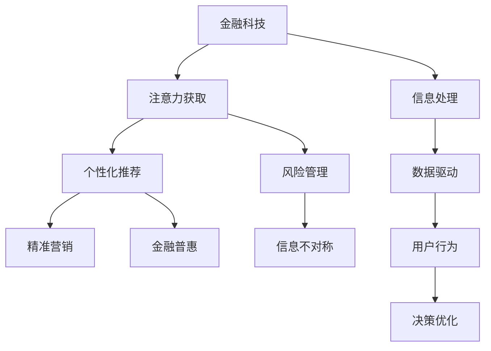

                 

# 金融科技在注意力经济中的机遇

## 1. 背景介绍

### 1.1 问题由来

在数字经济时代，注意力成为一种稀缺资源。消费者在信息海洋中浏览、选择、决策，企业则希望通过抓住用户注意力，实现品牌曝光、流量转化、收益提升等目标。这催生了以注意力为核心的经济模式，即注意力经济。

随着移动互联网、大数据、AI等技术的发展，注意力经济逐渐成为经济发展的新热点。如何高效获取、利用和转化注意力，成为当前产业升级和转型创新的关键课题。金融科技（Fintech）作为数字经济的重要组成部分，正面临历史性机遇，从消费金融、保险、资产管理等多个维度，赋能注意力经济，探索新的增长点和竞争优势。

### 1.2 问题核心关键点

1. **注意力获取与识别**：通过大数据分析、用户行为研究等技术，精准识别和理解用户注意力特征。
2. **个性化推荐**：利用机器学习、深度学习等算法，推荐用户感兴趣的内容和服务。
3. **决策支持与优化**：结合金融科技工具，对用户的决策过程进行分析和优化，提升金融服务的精准度和效率。
4. **风险控制与防范**：通过数据监控、模型评估等手段，识别和防范金融风险，保护用户权益。

### 1.3 问题研究意义

研究金融科技在注意力经济中的应用，对于提升金融服务的智能化水平，促进金融与信息技术的深度融合，具有重要意义：

1. **精准营销**：通过技术手段精准识别用户注意力，实现更高效的广告投放和品牌曝光，提高营销转化率。
2. **金融普惠**：利用注意力经济模式，提供个性化的金融服务，缩小金融服务的城乡差距，促进普惠金融发展。
3. **服务创新**：通过技术手段重构金融服务的模式和流程，创造出更多符合用户需求的产品和服务。
4. **风险管理**：运用数据和模型对用户行为进行动态监控，及时识别风险隐患，提高风险防控能力。

## 2. 核心概念与联系

### 2.1 核心概念概述

为更好地理解金融科技在注意力经济中的应用，本节将介绍几个密切相关的核心概念：

- **金融科技（Fintech）**：运用互联网、大数据、人工智能等技术，提升金融服务的效率和精准度，实现金融服务的创新和升级。
- **注意力经济**：以用户注意力为资源，通过数字化手段获取、分析和利用注意力，创造出经济价值。
- **个性化推荐**：利用用户数据和机器学习算法，为用户提供符合其兴趣和需求的推荐内容和服务。
- **风险管理**：通过数据和模型评估用户的风险偏好和行为特征，动态调整金融产品的风险控制策略。
- **信息不对称**：指在金融交易中，信息掌握不均衡，导致一方可能受到不公平待遇的问题。
- **金融普惠**：通过数字化手段，降低金融服务的门槛，使更多人获得公平、便捷的金融服务。

这些核心概念之间的逻辑关系可以通过以下Mermaid流程图来展示：



这个流程图展示了大语言模型微调的各个核心概念及其之间的关系：

1. 金融科技通过大数据和AI技术，获取和处理用户注意力数据。
2. 获取的注意力数据经过信息处理和数据分析，应用于个性化推荐和风险管理。
3. 个性化推荐和风险管理反过来进一步提升精准营销和金融普惠的效果。
4. 数据驱动和信息处理共同支撑金融科技的高效决策优化。

这些概念共同构成了金融科技在注意力经济中的应用框架，使其能够通过精准、高效的技术手段，赋能金融服务，提升用户体验，促进经济发展。

## 3. 核心算法原理 & 具体操作步骤

### 3.1 算法原理概述

金融科技在注意力经济中的应用，主要依赖于以下核心算法：

- **用户注意力分析**：通过大数据分析和机器学习模型，识别和分析用户的注意力特征和行为模式。
- **个性化推荐算法**：基于用户注意力数据和行为特征，推荐符合用户兴趣的内容和服务。
- **风险管理模型**：利用机器学习算法和数据挖掘技术，评估和控制金融风险。
- **决策优化算法**：通过数据驱动和模型评估，对用户的决策过程进行优化和调整。

这些算法共同构成了金融科技在注意力经济中的技术基础，使得金融机构能够更精准地识别和转化用户注意力，提升服务质量和效率。

### 3.2 算法步骤详解

金融科技在注意力经济中的应用，通常包括以下关键步骤：

**Step 1: 数据收集与预处理**
- 通过互联网、移动应用等渠道，收集用户的行为数据、偏好数据等注意力相关信息。
- 对数据进行清洗、去重、归一化等预处理操作，确保数据质量和一致性。

**Step 2: 用户注意力分析**
- 利用机器学习模型，如协同过滤、内容推荐算法等，分析用户的注意力特征和行为模式。
- 识别用户的兴趣偏好、消费习惯、行为轨迹等，为后续推荐和决策优化提供依据。

**Step 3: 个性化推荐**
- 构建推荐模型，如基于矩阵分解的推荐算法、基于深度学习的推荐模型等。
- 根据用户的注意力特征和行为数据，推荐符合用户兴趣和需求的内容和服务。
- 利用A/B测试、CTR（点击率）优化等技术手段，持续提升推荐效果。

**Step 4: 风险管理**
- 构建风险评估模型，如信用评分模型、欺诈检测模型等。
- 利用用户数据和行为特征，评估用户的风险偏好和行为特征。
- 实时监控金融交易行为，识别异常交易和风险信号，及时采取控制措施。

**Step 5: 决策优化**
- 结合金融科技工具，如大数据分析、AI决策系统等，优化用户的决策过程。
- 通过用户行为数据和模型评估，动态调整金融产品的策略和定价。
- 结合市场趋势和用户反馈，持续优化金融产品和服务。

### 3.3 算法优缺点

金融科技在注意力经济中的应用，具有以下优点：
1. **精准高效**：通过数据驱动和机器学习算法，能够实现精准的注意力识别和用户推荐，提升营销转化率和用户满意度。
2. **降低成本**：利用技术手段自动化处理用户数据，减少人力和运营成本，提高运营效率。
3. **提升体验**：通过个性化推荐和风险管理，提供更符合用户需求的服务，提升用户体验。

同时，也存在一定的局限性：
1. **数据隐私**：在获取和处理用户数据过程中，存在隐私保护和数据安全风险。
2. **模型复杂**：构建和维护复杂的推荐模型和风险管理模型，需要较高的技术投入和运维成本。
3. **公平性**：存在算法偏见和信息不对称问题，可能导致不公平的金融服务。

尽管存在这些局限性，但金融科技在注意力经济中的应用，仍具有广阔的前景和潜力，值得进一步探索和优化。

### 3.4 算法应用领域

金融科技在注意力经济中的应用，已经在多个领域取得了初步成效，具体包括：

- **消费金融**：利用注意力分析技术，识别和引导用户消费行为，提升信用卡、贷款等产品的转化率和使用率。
- **保险服务**：通过个性化推荐和风险管理，提供更符合用户需求和风险偏好的保险产品，优化保险服务体验。
- **资产管理**：利用大数据和机器学习算法，识别用户理财需求和行为特征，提供个性化的资产管理服务，提高理财产品的销售和用户满意度。
- **金融产品创新**：通过用户注意力数据和行为特征，设计符合用户需求的金融产品和应用场景，推动金融产品创新。

这些应用领域展示了金融科技在注意力经济中的广泛潜力和应用价值，未来有望在更多领域落地并创造新的增长点。

## 4. 数学模型和公式 & 详细讲解 & 举例说明

### 4.1 数学模型构建

本节将使用数学语言对金融科技在注意力经济中的应用进行更加严格的刻画。

记用户的注意力数据为 $D=\{x_i,y_i\}_{i=1}^N$，其中 $x_i$ 为用户的行为数据（如浏览记录、点击行为等），$y_i$ 为用户对某个金融产品的反应（如购买、评分等）。

定义用户的注意力特征为 $A=\{a_{ij}\}_{j=1}^M$，其中 $a_{ij}$ 表示用户对第 $j$ 项注意力信息的偏好程度。
记金融产品的特性为 $P=\{p_k\}_{k=1}^K$，其中 $p_k$ 表示第 $k$ 个金融产品的特性向量。

定义个性化推荐模型的参数为 $\theta$，则模型的预测概率为 $f(x_i,\theta)=\sigma(\sum_{k=1}^Ka_{ik}p_k)$，其中 $\sigma$ 为激活函数。

### 4.2 公式推导过程

以下我们以个性化推荐为例，推导模型损失函数及其梯度计算公式。

假设模型在输入 $x_i$ 上的预测概率为 $p_i=\sigma(\theta^T\phi(x_i))$，其中 $\phi$ 为特征映射函数，$\theta$ 为模型参数。定义损失函数为交叉熵损失函数：

$$
\mathcal{L}(\theta)=\frac{1}{N}\sum_{i=1}^N-y_i\log p_i-(1-y_i)\log(1-p_i)
$$

根据链式法则，损失函数对模型参数 $\theta$ 的梯度为：

$$
\nabla_\theta\mathcal{L}(\theta)=\frac{1}{N}\sum_{i=1}^N(y_i-p_i)\phi(x_i)
$$

在得到梯度后，带入优化算法（如随机梯度下降）更新模型参数，最小化损失函数 $\mathcal{L}(\theta)$，实现个性化推荐。

### 4.3 案例分析与讲解

**案例一：消费金融个性化推荐**

假设某电商平台收集了用户的历史浏览记录和购买行为数据，使用协同过滤算法分析用户的注意力特征。模型预测用户对某个金融产品的购买概率为 $p=\sigma(\theta^T\phi(x_i))$，其中 $\phi$ 为特征映射函数，$\theta$ 为模型参数。

模型训练数据集为 $\{(x_i,y_i)\}_{i=1}^N$，定义损失函数为交叉熵损失函数：

$$
\mathcal{L}(\theta)=\frac{1}{N}\sum_{i=1}^N-y_i\log p_i-(1-y_i)\log(1-p_i)
$$

根据链式法则，损失函数对模型参数 $\theta$ 的梯度为：

$$
\nabla_\theta\mathcal{L}(\theta)=\frac{1}{N}\sum_{i=1}^N(y_i-p_i)\phi(x_i)
$$

使用随机梯度下降等优化算法更新模型参数 $\theta$，最小化损失函数 $\mathcal{L}(\theta)$，实现个性化推荐。

**案例二：保险服务风险管理**

假设某保险公司收集了用户的保险历史数据和行为数据，使用机器学习模型评估用户风险。模型预测用户对某个保险产品的风险概率为 $p=\sigma(\theta^T\phi(x_i))$，其中 $\phi$ 为特征映射函数，$\theta$ 为模型参数。

模型训练数据集为 $\{(x_i,y_i)\}_{i=1}^N$，定义损失函数为交叉熵损失函数：

$$
\mathcal{L}(\theta)=\frac{1}{N}\sum_{i=1}^N-y_i\log p_i-(1-y_i)\log(1-p_i)
$$

根据链式法则，损失函数对模型参数 $\theta$ 的梯度为：

$$
\nabla_\theta\mathcal{L}(\theta)=\frac{1}{N}\sum_{i=1}^N(y_i-p_i)\phi(x_i)
$$

使用随机梯度下降等优化算法更新模型参数 $\theta$，最小化损失函数 $\mathcal{L}(\theta)$，实现风险管理。

## 5. 项目实践：代码实例和详细解释说明

### 5.1 开发环境搭建

在进行金融科技项目实践前，我们需要准备好开发环境。以下是使用Python进行TensorFlow开发的环境配置流程：

1. 安装Anaconda：从官网下载并安装Anaconda，用于创建独立的Python环境。

2. 创建并激活虚拟环境：
```bash
conda create -n tf-env python=3.8 
conda activate tf-env
```

3. 安装TensorFlow：根据CUDA版本，从官网获取对应的安装命令。例如：
```bash
conda install tensorflow
```

4. 安装各类工具包：
```bash
pip install numpy pandas scikit-learn matplotlib tqdm jupyter notebook ipython
```

完成上述步骤后，即可在`tf-env`环境中开始金融科技项目的开发。

### 5.2 源代码详细实现

这里我们以消费金融个性化推荐系统为例，给出使用TensorFlow和Keras进行开发的PyTorch代码实现。

首先，定义个性化推荐系统的数据处理函数：

```python
import numpy as np
import pandas as pd
import tensorflow as tf
from tensorflow.keras.models import Sequential
from tensorflow.keras.layers import Dense, Activation

def prepare_data(data_path):
    data = pd.read_csv(data_path)
    # 数据预处理
    # 将数据转换为Numpy数组
    features = np.array(data[['feature1', 'feature2', ...]])
    labels = np.array(data['label'])
    return features, labels

# 加载数据
features, labels = prepare_data('financial_data.csv')

# 数据划分
train_features, train_labels = features[:80], labels[:80]
test_features, test_labels = features[80:], labels[80:]
```

然后，定义模型：

```python
# 定义模型
model = Sequential([
    Dense(64, input_shape=(features.shape[1],)),
    Activation('relu'),
    Dense(1, activation='sigmoid')
])

# 编译模型
model.compile(optimizer='adam', loss='binary_crossentropy', metrics=['accuracy'])
```

接着，训练模型并评估性能：

```python
# 训练模型
model.fit(train_features, train_labels, epochs=10, batch_size=32, validation_data=(test_features, test_labels))

# 评估模型性能
test_loss, test_acc = model.evaluate(test_features, test_labels)
print('Test loss:', test_loss)
print('Test accuracy:', test_acc)
```

最后，生成推荐结果：

```python
# 预测推荐结果
recommendations = model.predict(features)
for i, rec in enumerate(recommendations):
    print(f'User {i+1} score: {rec:.2f}, Recommend: {1 if rec > 0.5 else 0}')
```

以上就是使用TensorFlow进行消费金融个性化推荐系统的完整代码实现。可以看到，得益于TensorFlow和Keras的强大封装，我们能够快速实现个性化推荐模型的训练和评估。

### 5.3 代码解读与分析

让我们再详细解读一下关键代码的实现细节：

**prepare_data函数**：
- 加载数据集，进行数据预处理，包括特征选择、数据清洗、数据划分等。
- 将数据转换为Numpy数组，确保数据格式和类型一致。

**定义模型**：
- 使用Keras的Sequential模型，定义了输入层、隐藏层和输出层。
- 隐藏层使用64个神经元，激活函数为ReLU，输出层使用sigmoid激活函数，适合二分类任务。
- 编译模型时，选择Adam优化器和交叉熵损失函数，并监控准确率。

**训练模型**：
- 使用模型训练函数fit，设置训练轮数、批次大小和验证集。
- 通过多轮训练，优化模型参数，最小化损失函数，提升模型性能。

**评估模型性能**：
- 使用evaluate函数在测试集上评估模型性能，输出损失和准确率。
- 通过评估结果，可以判断模型是否过拟合或欠拟合，指导后续调参。

**生成推荐结果**：
- 使用predict函数对新数据进行预测，输出推荐结果。
- 通过设定阈值，将预测结果转换为实际推荐。

这些关键代码帮助我们在实际应用中快速构建和评估个性化推荐模型，进一步提升金融科技在注意力经济中的应用效果。

## 6. 实际应用场景

### 6.1 智能投顾

智能投顾（Robo-Advisor）是一种基于算法驱动的投资管理服务，通过分析用户的投资偏好和风险容忍度，提供个性化的投资组合和理财建议。

在智能投顾系统中，注意力分析技术可以用于识别和预测用户的投资行为和偏好，构建用户画像，实现动态推荐和决策优化。结合风险评估模型和个性化推荐算法，系统能够实时调整投资策略，提升用户体验和投资效果。

### 6.2 保险精算

保险精算是评估和控制保险产品风险的关键环节。传统上，精算师需要大量历史数据和复杂模型进行风险评估，但这一过程耗时耗力。

通过金融科技，注意力分析技术可以实时监控用户的健康状况、行为特征等数据，构建风险评估模型，及时识别高风险用户。结合个性化推荐算法，系统能够向用户推荐最适合的保险产品，并提供定制化的保障方案，降低道德风险，提高保单销售和客户满意度。

### 6.3 智能支付

智能支付系统通过大数据分析和机器学习算法，识别和分析用户的支付行为，提供个性化的支付服务和优惠。

在智能支付中，注意力分析技术可以用于识别用户的支付偏好和消费习惯，构建用户画像，实现动态推荐和决策优化。结合个性化推荐算法和风险管理模型，系统能够实时调整支付策略，优化支付流程，提升用户体验和支付效率。

### 6.4 未来应用展望

随着技术的不断发展，金融科技在注意力经济中的应用前景将更加广阔。

1. **AI辅助决策**：结合大数据和AI技术，为用户提供个性化的投资和理财建议，提升决策质量和效率。
2. **风险管理升级**：利用注意力分析技术和机器学习算法，构建更加精准的风险评估模型，降低金融风险。
3. **智能客服**：通过自然语言处理和情感分析技术，提升客服系统的智能化水平，提供更高效、更人性化的服务。
4. **普惠金融**：利用注意力分析技术，识别和引导低收入人群的金融需求，提供更公平、更便捷的金融服务。
5. **区块链应用**：结合区块链技术，实现透明、可信的交易记录和数据共享，提升金融服务的信任度和安全性。

## 7. 工具和资源推荐

### 7.1 学习资源推荐

为了帮助开发者系统掌握金融科技在注意力经济中的应用，这里推荐一些优质的学习资源：

1. **金融科技在注意力经济中的应用**：相关学术论文、技术白皮书和行业报告，提供理论基础和实践指导。
2. **TensorFlow官方文档**：提供TensorFlow的详细使用指南和示例代码，适合初学者和进阶开发者。
3. **Keras官方文档**：提供Keras的详细使用指南和示例代码，适合初学者和进阶开发者。
4. **机器学习实战**：详细介绍机器学习和深度学习算法的实现，包括推荐系统和风险管理等应用案例。
5. **自然语言处理入门**：介绍自然语言处理的基本概念和实践方法，适合关注金融科技在语言模型中的应用。

通过对这些资源的学习实践，相信你一定能够快速掌握金融科技在注意力经济中的应用技术，并用于解决实际的金融问题。

### 7.2 开发工具推荐

高效的开发离不开优秀的工具支持。以下是几款用于金融科技项目开发的常用工具：

1. **TensorFlow**：由Google主导开发的开源深度学习框架，生产部署方便，适合大规模工程应用。
2. **Keras**：基于TensorFlow的高级API，提供了简单易用的模型定义和训练接口，适合快速原型开发。
3. **PyTorch**：由Facebook主导的开源深度学习框架，灵活动态，适合科研和原型开发。
4. **NumPy**：提供高效的数组计算和线性代数运算，适合处理大规模数据。
5. **Pandas**：提供数据分析和处理功能，适合处理和分析金融数据。
6. **Scikit-learn**：提供机器学习算法的实现，适合构建和评估推荐系统和风险管理模型。

合理利用这些工具，可以显著提升金融科技项目的开发效率，加快创新迭代的步伐。

### 7.3 相关论文推荐

金融科技在注意力经济中的应用源于学界的持续研究。以下是几篇奠基性的相关论文，推荐阅读：

1. **Attention is All You Need**：提出Transformer结构，开启了NLP领域的预训练大模型时代。
2. **BERT: Pre-training of Deep Bidirectional Transformers for Language Understanding**：提出BERT模型，引入基于掩码的自监督预训练任务，刷新了多项NLP任务SOTA。
3. **Transformers from the Bottom Up**：深入介绍Transformer模型的工作原理和实现细节。
4. **Deep Learning for Recommender Systems**：详细介绍深度学习在推荐系统中的应用，包括协同过滤和内容推荐等算法。
5. **Finance and AI**：讨论金融科技和人工智能的融合，提供理论和实践的结合视角。
6. **Blockchain and Finance**：探讨区块链技术在金融中的应用，提供技术实现和行业应用的指导。

这些论文代表了大语言模型微调技术的发展脉络。通过学习这些前沿成果，可以帮助研究者把握学科前进方向，激发更多的创新灵感。

## 8. 总结：未来发展趋势与挑战

### 8.1 总结

本文对金融科技在注意力经济中的应用进行了全面系统的介绍。首先阐述了注意力经济的概念和金融科技的应用背景，明确了金融科技在精准营销、金融普惠、服务创新和风险管理等多个方面的应用价值。其次，从原理到实践，详细讲解了注意力分析和个性化推荐等核心算法的数学原理和关键步骤，给出了金融科技项目开发的完整代码实例。同时，本文还广泛探讨了金融科技在智能投顾、保险精算、智能支付等多个领域的应用前景，展示了金融科技在注意力经济中的广阔潜力。此外，本文精选了金融科技相关的学习资源和开发工具，力求为读者提供全方位的技术指引。

通过本文的系统梳理，可以看到，金融科技在注意力经济中的应用正在成为数字经济的重要组成部分，极大地提升了金融服务的智能化水平和效率。未来，伴随技术的不断演进和优化，金融科技必将在更多领域落地并创造新的增长点，为金融服务注入新的活力和动力。

### 8.2 未来发展趋势

展望未来，金融科技在注意力经济中的应用将呈现以下几个发展趋势：

1. **技术融合加速**：金融科技与人工智能、区块链、大数据等技术的深度融合，将带来更高效、更智能的金融服务。
2. **个性化服务升级**：通过大数据分析和机器学习算法，实现更加精准和个性化的金融服务，提升用户体验和满意度。
3. **金融产品创新**：利用注意力分析技术和推荐算法，设计符合用户需求和偏好的金融产品，推动金融产品创新。
4. **风险管理强化**：结合机器学习算法和数据挖掘技术，构建更加精准和动态的风险评估模型，提升金融系统的安全性和稳定性。

以上趋势凸显了金融科技在注意力经济中的广阔前景。这些方向的探索发展，必将进一步提升金融服务的智能化水平，促进金融与信息技术的深度融合，带来更多新的增长点和商业机遇。

### 8.3 面临的挑战

尽管金融科技在注意力经济中的应用已经取得了初步成效，但在迈向更加智能化、普适化应用的过程中，它仍面临着诸多挑战：

1. **数据隐私**：在获取和处理用户数据过程中，存在隐私保护和数据安全风险。如何平衡数据利用和隐私保护，仍是一个重要问题。
2. **算法偏见**：存在算法偏见和信息不对称问题，可能导致不公平的金融服务。如何消除偏见，提升算法的公平性，需要更多的技术和社会探索。
3. **模型复杂性**：构建和维护复杂的推荐模型和风险管理模型，需要较高的技术投入和运维成本。如何简化模型，提高可解释性和可维护性，是未来的一个重要研究方向。
4. **计算资源**：金融科技项目通常需要处理大规模数据和高维数据，对计算资源有较高要求。如何优化计算效率，降低计算成本，是一个技术难题。
5. **用户接受度**：金融科技的应用需要用户信任和接受，如何提升用户体验，降低使用门槛，是推广应用的关键。

尽管存在这些挑战，但金融科技在注意力经济中的应用，仍具有广阔的前景和潜力，值得进一步探索和优化。相信通过多方合作和创新，金融科技必将在更多领域落地并创造新的增长点。

### 8.4 研究展望

面对金融科技在注意力经济中的应用所面临的种种挑战，未来的研究需要在以下几个方面寻求新的突破：

1. **数据隐私保护**：研究更加高效、安全的数据隐私保护技术，保障用户数据的安全和隐私。
2. **算法公平性**：开发公平性评估工具和算法，消除算法偏见，提升算法的公平性和可解释性。
3. **模型简化**：简化模型结构和优化算法，提高模型的可解释性和可维护性，降低计算成本。
4. **用户交互优化**：设计更加友好和高效的用户界面，提升用户体验和用户接受度，促进金融科技的应用推广。
5. **安全与合规**：结合法律法规和伦理道德，构建安全可靠、合规合法的金融科技应用系统。

这些研究方向的探索，必将引领金融科技在注意力经济中的应用迈向更高的台阶，为构建安全、可靠、可解释、可控的智能金融系统铺平道路。面向未来，金融科技需要在技术、伦理、社会多方面协同发力，共同推动金融服务的发展和创新。

## 9. 附录：常见问题与解答

**Q1：金融科技在注意力经济中的应用是否具有普适性？**

A: 金融科技在注意力经济中的应用，具有较强的普适性。不同的金融产品和场景，可以通过个性化的推荐和风险管理，提升用户体验和效果。但具体应用需要结合不同场景的业务特点和数据特点，进行定制化设计和优化。

**Q2：如何评估金融科技项目的经济效益？**

A: 评估金融科技项目的经济效益，通常需要考虑以下几个方面：
1. **用户转化率**：评估金融科技应用对用户行为的影响，如投资行为、消费行为等。
2. **运营成本**：评估金融科技应用对运营成本的影响，如人力成本、运维成本等。
3. **收益增长**：评估金融科技应用对收益的影响，如金融产品的销售量、金融服务的用户数等。
4. **用户满意度**：评估用户对金融科技应用的满意度，如用户体验、用户反馈等。

**Q3：在金融科技项目开发中，如何避免算法偏见和信息不对称？**

A: 避免算法偏见和信息不对称，需要从以下几个方面进行：
1. **数据多样性**：使用多样化的数据来源，避免数据单一性和偏见。
2. **模型公平性**：构建公平性评估工具和算法，定期检测和校正模型的偏见。
3. **用户参与**：鼓励用户参与数据标注和模型评估，提升算法的公平性和透明度。
4. **透明度和可解释性**：增强模型的可解释性，让用户了解模型的决策逻辑和依据。
5. **法律法规合规**：确保金融科技应用符合法律法规和伦理道德，避免对用户产生负面影响。

这些措施有助于提升金融科技应用的公平性和透明度，保障用户的权益和隐私。

**Q4：金融科技项目开发中，如何高效利用计算资源？**

A: 高效利用计算资源，可以从以下几个方面进行：
1. **分布式计算**：利用分布式计算框架，如Hadoop、Spark等，提高计算效率和处理能力。
2. **模型压缩**：使用模型压缩技术，如剪枝、量化等，降低模型大小和计算资源消耗。
3. **算法优化**：优化算法实现，如使用GPU、TPU等加速硬件，提升计算效率。
4. **数据预处理**：进行数据预处理，如特征选择、数据清洗等，减少数据处理时间和计算资源消耗。
5. **缓存技术**：使用缓存技术，如Redis、Memcached等，减少数据读取时间和计算资源消耗。

这些措施有助于提高金融科技项目的计算效率和资源利用率，降低计算成本。

**Q5：如何构建安全的金融科技应用系统？**

A: 构建安全的金融科技应用系统，可以从以下几个方面进行：
1. **数据加密**：对敏感数据进行加密存储和传输，防止数据泄露和窃取。
2. **访问控制**：实施严格的访问控制策略，防止非法访问和数据篡改。
3. **安全审计**：定期进行安全审计，发现和修复系统漏洞。
4. **用户教育**：对用户进行安全教育，提升用户安全意识和防护能力。
5. **应急响应**：建立应急响应机制，及时处理安全事件，保障系统稳定运行。

这些措施有助于提升金融科技应用系统的安全性和可靠性，保障用户数据和隐私安全。

---

作者：禅与计算机程序设计艺术 / Zen and the Art of Computer Programming

