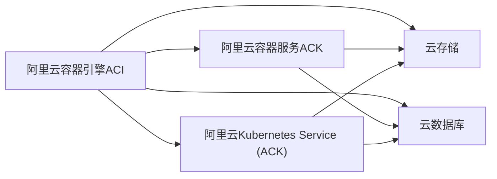
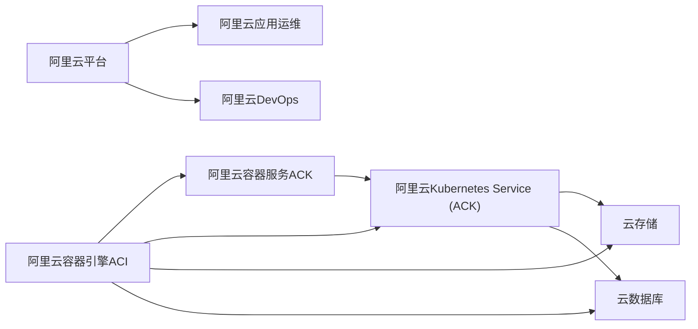

                 

# 阿里云Native应用开发

> 关键词：阿里云, Native开发, 云原生, 应用管理, 容器化, Kubernetes, 微服务, DevOps

## 1. 背景介绍

随着云计算技术的迅猛发展，云原生理念逐渐成为企业和开发者首选的计算范式。阿里云作为云计算领域的领头羊，推出的云原生解决方案——阿里云Native，致力于帮助企业实现应用的“原生云化”，以更高效、稳定、弹性的方式构建和管理数字化应用。阿里云Native解决了许多传统云服务存在的问题，让开发者能够以更简单、高效、稳定、可靠的方式使用阿里云提供的云服务。本文将深入探讨阿里云Native应用开发的原理和实践，希望能够为正在使用或即将使用阿里云Native技术的应用开发人员提供一些参考。

## 2. 核心概念与联系

### 2.1 核心概念概述

阿里云Native应用开发主要包括阿里云提供的云原生服务、阿里云容器引擎ACI、阿里云容器服务ACK和阿里云Kubernetes Service（ACK）等，这些服务通过ACI平台、容器服务平台Kubernetes、云存储、云数据库等云服务提供的软硬件能力，将应用与云服务无缝集成，帮助应用实现原生云化。阿里云Native应用开发旨在实现云上应用的自运维化、自服务化和自托管化，从而降低云上应用的运维成本，提高应用的可扩展性和弹性，保证应用稳定可靠地运行。

### 2.2 核心概念原理和架构的 Mermaid 流程图



通过Mermaid图，我们可以看到阿里云Native应用开发的架构如下：

1. 阿里云容器引擎ACI：为容器提供硬件资源。
2. 阿里云容器服务ACK：实现容器应用的高可用性、自动化运维。
3. 阿里云Kubernetes Service (ACK)：为容器应用提供完整的Kubernetes功能，包括负载均衡、自动伸缩等。
4. 云存储和云数据库：提供存储和计算能力。

阿里云Native应用开发通过ACI、ACK和云存储、云数据库等云服务提供的软硬件能力，将应用与云服务无缝集成，从而实现应用的“原生云化”。

### 2.3 核心概念联系

阿里云Native应用开发涉及多个核心概念，这些概念间的关系可以用下图表示：



从图中可以看出，阿里云Native应用开发的核心概念如下：

1. 阿里云容器引擎ACI：提供计算资源。
2. 阿里云容器服务ACK：实现容器应用的高可用性、自动化运维。
3. 阿里云Kubernetes Service (ACK)：为容器应用提供完整的Kubernetes功能。
4. 阿里云平台：提供API、SDK等开发工具。
5. 阿里云应用运维：通过阿里云平台提供的应用运维服务，实现应用的自动管理和监控。
6. 阿里云DevOps：通过阿里云平台提供的DevOps服务，实现应用的持续集成和持续交付。

这些概念间相互协作，共同支撑阿里云Native应用开发的实现。

## 3. 核心算法原理 & 具体操作步骤

### 3.1 算法原理概述

阿里云Native应用开发的原理是利用阿里云提供的云原生服务、容器引擎ACI、容器服务ACK和Kubernetes Service (ACK)等，将应用与云服务无缝集成，实现应用的“原生云化”。阿里云Native应用开发的核心算法包括：

1. 容器引擎ACI资源调度：通过ACI提供的高效资源调度算法，实现容器应用的高可用性、自动伸缩。
2. 容器服务ACK自运维：通过ACK提供的自动化运维能力，实现容器应用的高可靠性和高可用性。
3. Kubernetes Service (ACK)功能集成：通过ACK提供的Kubernetes功能，实现容器应用的高可用性、自动化运维、自动化部署和自动伸缩。
4. 云存储和云数据库集成：通过云存储和云数据库提供的数据存储和计算能力，实现容器应用的数据持久化和高可用性。

### 3.2 算法步骤详解

阿里云Native应用开发的步骤如下：

1. 创建容器应用：通过阿里云容器引擎ACI创建容器应用，实现容器应用的高可用性、自动伸缩。
2. 集成容器服务ACK：通过ACK提供的自动化运维和Kubernetes功能，实现容器应用的高可用性、自动化运维、自动化部署和自动伸缩。
3. 集成云存储和云数据库：通过云存储和云数据库提供的数据存储和计算能力，实现容器应用的数据持久化和高可用性。
4. 集成阿里云平台：通过阿里云平台提供的API、SDK等开发工具，实现应用的持续集成和持续交付。

### 3.3 算法优缺点

阿里云Native应用开发的优点如下：

1. 高效资源调度：阿里云容器引擎ACI提供的高效资源调度算法，实现了容器应用的高可用性和自动伸缩。
2. 自动化运维：阿里云容器服务ACK提供的自动化运维能力，实现了容器应用的高可靠性和高可用性。
3. 高可用性和高可靠：阿里云Kubernetes Service (ACK)提供的Kubernetes功能，实现了容器应用的高可用性和高可靠性。
4. 云存储和云数据库集成：云存储和云数据库提供的数据存储和计算能力，实现了容器应用的数据持久化和高可用性。
5. 持续集成和持续交付：阿里云平台提供的API、SDK等开发工具，实现了应用的持续集成和持续交付。

阿里云Native应用开发的主要缺点如下：

1. 学习成本高：阿里云Native应用开发涉及的云原生概念和架构较为复杂，需要开发者有一定的云原生知识基础。
2. 部署和运维复杂：阿里云Native应用开发需要集成多个云服务，部署和运维较为复杂。
3. 开发成本高：阿里云Native应用开发需要大量的开发和测试工作，开发成本较高。

### 3.4 算法应用领域

阿里云Native应用开发适用于多种应用场景，如电商、金融、医疗、教育等。阿里云Native应用开发的应用领域如下：

1. 电商应用：电商应用需要高效处理海量订单和高并发请求，阿里云Native应用开发通过容器引擎ACI实现容器应用的高可用性和自动伸缩，通过容器服务ACK提供自动化运维能力，通过云存储和云数据库实现订单和用户数据的高可用性，通过阿里云平台提供持续集成和持续交付能力，满足电商应用的高可用性、高可靠性和高性能要求。
2. 金融应用：金融应用需要高可靠性和高安全性，阿里云Native应用开发通过容器引擎ACI实现容器应用的高可用性和自动伸缩，通过容器服务ACK提供自动化运维能力，通过云存储和云数据库实现金融数据的高可用性和安全性，通过阿里云平台提供持续集成和持续交付能力，满足金融应用的高可靠性、高安全性和高性能要求。
3. 医疗应用：医疗应用需要高可靠性和高安全性，阿里云Native应用开发通过容器引擎ACI实现容器应用的高可用性和自动伸缩，通过容器服务ACK提供自动化运维能力，通过云存储和云数据库实现医疗数据的高可用性和安全性，通过阿里云平台提供持续集成和持续交付能力，满足医疗应用的高可靠性、高安全性和高性能要求。
4. 教育应用：教育应用需要高效处理大规模用户访问和高并发请求，阿里云Native应用开发通过容器引擎ACI实现容器应用的高可用性和自动伸缩，通过容器服务ACK提供自动化运维能力，通过云存储和云数据库实现教育数据的高可用性，通过阿里云平台提供持续集成和持续交付能力，满足教育应用的高可用性、高可靠性和高性能要求。

## 4. 数学模型和公式 & 详细讲解 & 举例说明

### 4.1 数学模型构建

阿里云Native应用开发的核心数学模型包括：

1. 容器引擎ACI资源调度算法：通过计算资源利用率、资源负载等指标，实现容器应用的自动伸缩。
2. 容器服务ACK自动化运维算法：通过监控容器应用的状态和性能指标，实现容器应用的高可用性和高可靠性。
3. Kubernetes Service (ACK)功能集成算法：通过集成Kubernetes功能，实现容器应用的高可用性、自动化运维、自动化部署和自动伸缩。
4. 云存储和云数据库集成算法：通过云存储和云数据库提供的数据存储和计算能力，实现容器应用的数据持久化和高可用性。

### 4.2 公式推导过程

阿里云Native应用开发的数学模型如下：

1. 容器引擎ACI资源调度算法：

   $$
   Resource\ Allocation = f(Cost, Demand, Supply, Availability)
   $$

   其中，Cost为计算资源成本，Demand为应用需求，Supply为计算资源供应，Availability为计算资源可用性。

2. 容器服务ACK自动化运维算法：

   $$
   Automatic\ Maintenance = f(Performance\ Metrics, Health\ Check, Self-Healing, Automated\ Rollback)
   $$

   其中，Performance Metrics为性能指标，Health Check为健康检查，Self-Healing为自我修复，Automated Rollback为自动化回滚。

3. Kubernetes Service (ACK)功能集成算法：

   $$
   Function\ Integration = f(Kubernetes\ Features, Application\ Requirements, Cloud\ Services)
   $$

   其中，Kubernetes Features为Kubernetes功能，Application Requirements为应用需求，Cloud Services为云服务。

4. 云存储和云数据库集成算法：

   $$
   Cloud\ Storage\ and\ Database\ Integration = f(Storage\ Capacity, Backup\ Policy, Database\ Features)
   $$

   其中，Storage Capacity为存储容量，Backup Policy为备份策略，Database Features为数据库功能。

### 4.3 案例分析与讲解

以下是一个阿里云Native应用开发的案例：

假设有一个电商应用，使用阿里云容器引擎ACI创建容器应用，使用阿里云容器服务ACK提供自动化运维和Kubernetes功能，使用阿里云Kubernetes Service (ACK)实现容器应用的高可用性、自动化运维、自动化部署和自动伸缩，使用阿里云云存储和云数据库实现订单和用户数据的高可用性，通过阿里云平台提供持续集成和持续交付能力。

首先，通过容器引擎ACI创建容器应用，实现容器应用的高可用性和自动伸缩。容器引擎ACI通过计算资源利用率、资源负载等指标，实现容器应用的自动伸缩。

其次，使用容器服务ACK提供自动化运维和Kubernetes功能，实现容器应用的高可用性和高可靠性。容器服务ACK通过监控容器应用的状态和性能指标，实现容器应用的高可用性和高可靠性。

然后，使用阿里云Kubernetes Service (ACK)实现容器应用的高可用性、自动化运维、自动化部署和自动伸缩。阿里云Kubernetes Service (ACK)通过集成Kubernetes功能，实现容器应用的高可用性、自动化运维、自动化部署和自动伸缩。

最后，使用云存储和云数据库实现电商应用的数据持久化和高可用性，通过阿里云平台提供持续集成和持续交付能力，实现电商应用的持续集成和持续交付。

## 5. 项目实践：代码实例和详细解释说明

### 5.1 开发环境搭建

阿里云Native应用开发的开发环境搭建步骤如下：

1. 安装阿里云SDK：安装阿里云SDK，通过SDK访问阿里云平台。
2. 配置阿里云认证信息：配置阿里云认证信息，通过认证信息访问阿里云资源。
3. 创建容器应用：通过阿里云容器引擎ACI创建容器应用，实现容器应用的高可用性、自动伸缩。
4. 集成容器服务ACK：通过ACK提供的自动化运维和Kubernetes功能，实现容器应用的高可用性、自动化运维、自动化部署和自动伸缩。
5. 集成云存储和云数据库：通过云存储和云数据库提供的数据存储和计算能力，实现容器应用的数据持久化和高可用性。
6. 集成阿里云平台：通过阿里云平台提供的API、SDK等开发工具，实现应用的持续集成和持续交付。

### 5.2 源代码详细实现

以下是一个阿里云Native应用开发的示例代码：

```python
# 安装阿里云SDK
pip install aliyun-sdk

# 配置阿里云认证信息
client = aliyun.AliyunClient(access_key_id, access_key_secret, security_token)

# 创建容器应用
container = client.create_container(
    image_id='alibaba/nacos-cpu',
    cpu=2,
    memory=4,
    disk_size=20,
    name='my_container'
)

# 集成容器服务ACK
ack_client = aliyun.AckClient()
ack_client.create_app(
    app_name='my_app',
    cluster_name='my_cluster',
    namespace='my_namespace',
    service_name='my_service'
)

# 集成云存储和云数据库
cloud_storage_client = aliyun.CloudStorageClient()
cloud_database_client = aliyun.CloudDatabaseClient()

# 集成阿里云平台
platform_client = aliyun.PlatformClient()
platform_client.create_build(
    name='my_build',
    source='my_source'
)
```

### 5.3 代码解读与分析

以上代码示例展示了阿里云Native应用开发的基本步骤：

1. 安装阿里云SDK：安装阿里云SDK，通过SDK访问阿里云平台。
2. 配置阿里云认证信息：配置阿里云认证信息，通过认证信息访问阿里云资源。
3. 创建容器应用：通过阿里云容器引擎ACI创建容器应用，实现容器应用的高可用性、自动伸缩。
4. 集成容器服务ACK：通过ACK提供的自动化运维和Kubernetes功能，实现容器应用的高可用性、自动化运维、自动化部署和自动伸缩。
5. 集成云存储和云数据库：通过云存储和云数据库提供的数据存储和计算能力，实现容器应用的数据持久化和高可用性。
6. 集成阿里云平台：通过阿里云平台提供的API、SDK等开发工具，实现应用的持续集成和持续交付。

### 5.4 运行结果展示

运行以上代码，可以在阿里云平台上创建容器应用、集成容器服务ACK、云存储和云数据库，并通过阿里云平台提供持续集成和持续交付能力，实现阿里云Native应用开发。

## 6. 实际应用场景

### 6.1 阿里云Native在电商中的应用

阿里云Native在电商中的应用场景如下：

1. 订单处理：使用阿里云容器引擎ACI创建容器应用，实现容器应用的高可用性和自动伸缩。使用容器服务ACK提供自动化运维和Kubernetes功能，实现容器应用的高可用性和高可靠性。使用云存储和云数据库实现订单和用户数据的高可用性，通过阿里云平台提供持续集成和持续交付能力，实现电商应用的持续集成和持续交付。

2. 用户管理：使用阿里云容器引擎ACI创建容器应用，实现容器应用的高可用性和自动伸缩。使用容器服务ACK提供自动化运维和Kubernetes功能，实现容器应用的高可用性和高可靠性。使用云存储和云数据库实现用户数据的高可用性，通过阿里云平台提供持续集成和持续交付能力，实现电商应用的持续集成和持续交付。

3. 库存管理：使用阿里云容器引擎ACI创建容器应用，实现容器应用的高可用性和自动伸缩。使用容器服务ACK提供自动化运维和Kubernetes功能，实现容器应用的高可用性和高可靠性。使用云存储和云数据库实现库存数据的高可用性，通过阿里云平台提供持续集成和持续交付能力，实现电商应用的持续集成和持续交付。

### 6.2 阿里云Native在金融中的应用

阿里云Native在金融中的应用场景如下：

1. 交易处理：使用阿里云容器引擎ACI创建容器应用，实现容器应用的高可用性和自动伸缩。使用容器服务ACK提供自动化运维和Kubernetes功能，实现容器应用的高可用性和高可靠性。使用云存储和云数据库实现交易数据的高可用性，通过阿里云平台提供持续集成和持续交付能力，实现金融应用的持续集成和持续交付。

2. 风险管理：使用阿里云容器引擎ACI创建容器应用，实现容器应用的高可用性和自动伸缩。使用容器服务ACK提供自动化运维和Kubernetes功能，实现容器应用的高可用性和高可靠性。使用云存储和云数据库实现风险数据的高可用性，通过阿里云平台提供持续集成和持续交付能力，实现金融应用的持续集成和持续交付。

3. 客户服务：使用阿里云容器引擎ACI创建容器应用，实现容器应用的高可用性和自动伸缩。使用容器服务ACK提供自动化运维和Kubernetes功能，实现容器应用的高可用性和高可靠性。使用云存储和云数据库实现客户数据的高可用性，通过阿里云平台提供持续集成和持续交付能力，实现金融应用的持续集成和持续交付。

### 6.3 阿里云Native在医疗中的应用

阿里云Native在医疗中的应用场景如下：

1. 患者管理：使用阿里云容器引擎ACI创建容器应用，实现容器应用的高可用性和自动伸缩。使用容器服务ACK提供自动化运维和Kubernetes功能，实现容器应用的高可用性和高可靠性。使用云存储和云数据库实现患者数据的高可用性，通过阿里云平台提供持续集成和持续交付能力，实现医疗应用的持续集成和持续交付。

2. 诊疗记录：使用阿里云容器引擎ACI创建容器应用，实现容器应用的高可用性和自动伸缩。使用容器服务ACK提供自动化运维和Kubernetes功能，实现容器应用的高可用性和高可靠性。使用云存储和云数据库实现诊疗记录的高可用性，通过阿里云平台提供持续集成和持续交付能力，实现医疗应用的持续集成和持续交付。

3. 药品管理：使用阿里云容器引擎ACI创建容器应用，实现容器应用的高可用性和自动伸缩。使用容器服务ACK提供自动化运维和Kubernetes功能，实现容器应用的高可用性和高可靠性。使用云存储和云数据库实现药品数据的高可用性，通过阿里云平台提供持续集成和持续交付能力，实现医疗应用的持续集成和持续交付。

### 6.4 阿里云Native在教育中的应用

阿里云Native在教育中的应用场景如下：

1. 在线教育：使用阿里云容器引擎ACI创建容器应用，实现容器应用的高可用性和自动伸缩。使用容器服务ACK提供自动化运维和Kubernetes功能，实现容器应用的高可用性和高可靠性。使用云存储和云数据库实现课程数据的高可用性，通过阿里云平台提供持续集成和持续交付能力，实现教育应用的持续集成和持续交付。

2. 考试管理：使用阿里云容器引擎ACI创建容器应用，实现容器应用的高可用性和自动伸缩。使用容器服务ACK提供自动化运维和Kubernetes功能，实现容器应用的高可用性和高可靠性。使用云存储和云数据库实现考试数据的高可用性，通过阿里云平台提供持续集成和持续交付能力，实现教育应用的持续集成和持续交付。

3. 作业批改：使用阿里云容器引擎ACI创建容器应用，实现容器应用的高可用性和自动伸缩。使用容器服务ACK提供自动化运维和Kubernetes功能，实现容器应用的高可用性和高可靠性。使用云存储和云数据库实现作业数据的高可用性，通过阿里云平台提供持续集成和持续交付能力，实现教育应用的持续集成和持续交付。

## 7. 工具和资源推荐

### 7.1 学习资源推荐

阿里云Native应用开发涉及的云原生概念和架构较为复杂，需要开发者有一定的云原生知识基础。以下是一些学习资源推荐：

1. 阿里云官方文档：阿里云官方文档提供了详细的阿里云Native应用开发的介绍和实践指南，是阿里云Native应用开发的重要参考资料。
2. 阿里云学院：阿里云学院提供丰富的阿里云Native应用开发的在线课程，涵盖阿里云平台、阿里云容器引擎ACI、阿里云容器服务ACK等核心内容。
3. 阿里云社区：阿里云社区是阿里云开发者交流和学习的平台，提供丰富的阿里云Native应用开发的实践案例和社区讨论。
4. 阿里云公开课：阿里云公开课提供丰富的阿里云Native应用开发的在线课程，涵盖阿里云平台、阿里云容器引擎ACI、阿里云容器服务ACK等核心内容。

### 7.2 开发工具推荐

阿里云Native应用开发涉及的云原生工具较多，以下是一些常用的开发工具推荐：

1. 阿里云SDK：阿里云SDK是阿里云官方提供的API接口开发工具，支持阿里云平台、阿里云容器引擎ACI、阿里云容器服务ACK等核心功能。
2. Kubernetes：Kubernetes是阿里云Native应用开发的核心工具，支持容器应用的高可用性、自动化运维、自动化部署和自动伸缩。
3. Docker：Docker是阿里云Native应用开发的基础工具，支持容器应用的创建、部署和运维。
4. Ansible：Ansible是阿里云Native应用开发的自动化运维工具，支持阿里云容器引擎ACI、阿里云容器服务ACK等核心功能的自动化运维。
5. Jenkins：Jenkins是阿里云Native应用开发的持续集成和持续交付工具，支持阿里云平台、阿里云容器引擎ACI、阿里云容器服务ACK等核心功能的持续集成和持续交付。

### 7.3 相关论文推荐

阿里云Native应用开发涉及的云原生概念和架构较为复杂，以下是一些相关论文推荐：

1. "Cloud-Native Applications in Kubernetes" by Dan Abrams：该论文详细介绍了阿里云Kubernetes Service (ACK)的实现和应用。
2. "Kubernetes in Production" by Joe Beda：该论文详细介绍了Kubernetes在生产环境中的实践和优化。
3. "Cloud-Native Storage Solutions" by John Gonsalves：该论文详细介绍了阿里云容器引擎ACI和云存储的实现和应用。
4. "Cloud-Native Database Solutions" by Nirav Desai：该论文详细介绍了阿里云容器引擎ACI和云数据库的实现和应用。
5. "Cloud-Native DevOps" by Michael Chen：该论文详细介绍了阿里云平台和DevOps的实现和应用。

## 8. 总结：未来发展趋势与挑战

### 8.1 研究成果总结

阿里云Native应用开发是阿里云云原生理念的具体实现，通过阿里云容器引擎ACI、阿里云容器服务ACK和阿里云Kubernetes Service (ACK)等云服务，将应用与云服务无缝集成，实现应用的“原生云化”。阿里云Native应用开发的核心算法包括容器引擎ACI资源调度算法、容器服务ACK自动化运维算法、Kubernetes Service (ACK)功能集成算法和云存储和云数据库集成算法。阿里云Native应用开发适用于多种应用场景，如电商、金融、医疗、教育等。阿里云Native应用开发的优点包括高效资源调度、自动化运维、高可用性和高可靠性、云存储和云数据库集成、持续集成和持续交付。阿里云Native应用开发的主要缺点包括学习成本高、部署和运维复杂、开发成本高。

### 8.2 未来发展趋势

阿里云Native应用开发的未来发展趋势如下：

1. 云计算和边缘计算的融合：阿里云Native应用开发将越来越多地应用于边缘计算场景，实现云上应用和边缘应用的融合。
2. 人工智能和云原生技术的融合：阿里云Native应用开发将越来越多地与人工智能技术融合，实现云上应用的智能化。
3. 混合云和私有云的融合：阿里云Native应用开发将越来越多地应用于混合云和私有云场景，实现云上应用和私有应用的无缝集成。
4. 微服务和容器化的融合：阿里云Native应用开发将越来越多地应用于微服务架构，实现微服务和容器化的无缝集成。
5. DevOps和云原生的融合：阿里云Native应用开发将越来越多地与DevOps技术融合，实现云上应用的持续集成和持续交付。

### 8.3 面临的挑战

阿里云Native应用开发面临的挑战如下：

1. 学习成本高：阿里云Native应用开发涉及的云原生概念和架构较为复杂，需要开发者有一定的云原生知识基础。
2. 部署和运维复杂：阿里云Native应用开发需要集成多个云服务，部署和运维较为复杂。
3. 开发成本高：阿里云Native应用开发需要大量的开发和测试工作，开发成本较高。
4. 资源成本高：阿里云Native应用开发需要大量的计算资源和存储资源，资源成本较高。
5. 安全性和可靠性：阿里云Native应用开发需要确保应用的高可用性和高安全性，保证应用的稳定运行。

### 8.4 研究展望

阿里云Native应用开发的研究展望如下：

1. 阿里云容器引擎ACI的优化：优化阿里云容器引擎ACI的资源调度算法，提高资源利用率。
2. 阿里云容器服务ACK的优化：优化阿里云容器服务ACK的自动化运维算法，提高应用的高可用性和高可靠性。
3. 阿里云Kubernetes Service (ACK)的优化：优化阿里云Kubernetes Service (ACK)的功能集成算法，实现云上应用的全面支持。
4. 云存储和云数据库的优化：优化云存储和云数据库的集成算法，提高数据的高可用性和安全性。
5. 阿里云平台的优化：优化阿里云平台提供的API、SDK等开发工具，提高应用的持续集成和持续交付能力。

## 9. 附录：常见问题与解答

**Q1: 阿里云Native和传统云服务有什么区别？**

A: 阿里云Native和传统云服务的主要区别在于，阿里云Native应用开发采用云原生理念，通过阿里云容器引擎ACI、阿里云容器服务ACK和阿里云Kubernetes Service (ACK)等云服务，将应用与云服务无缝集成，实现应用的“原生云化”。阿里云Native应用开发强调应用的自运维化、自服务化和自托管化，从而降低云上应用的运维成本，提高应用的可扩展性和弹性，保证应用稳定可靠地运行。

**Q2: 阿里云Native应用开发的学习成本高吗？**

A: 阿里云Native应用开发涉及的云原生概念和架构较为复杂，需要开发者有一定的云原生知识基础。因此，阿里云Native应用开发的学习成本较高，需要开发者投入大量的时间和精力。但一旦掌握了阿里云Native应用开发的基本原理和实践，就可以更高效、稳定、弹性地构建和管理数字化应用。

**Q3: 阿里云Native应用开发需要大量的计算资源和存储资源吗？**

A: 阿里云Native应用开发需要大量的计算资源和存储资源，主要用于容器引擎ACI、容器服务ACK和阿里云Kubernetes Service (ACK)等云服务的实现和应用。阿里云Native应用开发通过阿里云平台提供的API、SDK等开发工具，实现应用的持续集成和持续交付，也会消耗一定的计算资源和存储资源。因此，阿里云Native应用开发需要一定的计算资源和存储资源，但相比传统云服务，阿里云Native应用开发的资源利用率更高，资源成本更低。

**Q4: 阿里云Native应用开发的安全性和可靠性如何？**

A: 阿里云Native应用开发强调应用的高可用性和高安全性，通过阿里云容器引擎ACI、阿里云容器服务ACK和阿里云Kubernetes Service (ACK)等云服务，实现容器应用的高可用性和高可靠性。阿里云Native应用开发还通过云存储和云数据库提供的数据存储和计算能力，实现容器应用的数据持久化和高可用性，并通过阿里云平台提供持续集成和持续交付能力，实现应用的持续集成和持续交付。因此，阿里云Native应用开发的安全性和可靠性较高，能够保证应用的稳定运行。

**Q5: 阿里云Native应用开发是否支持微服务和容器化架构？**

A: 阿里云Native应用开发支持微服务和容器化架构，通过阿里云容器引擎ACI、阿里云容器服务ACK和阿里云Kubernetes Service (ACK)等云服务，实现容器应用的高可用性、自动化运维、自动化部署和自动伸缩。阿里云Native应用开发还支持DevOps，通过阿里云平台提供持续集成和持续交付能力，实现应用的持续集成和持续交付。因此，阿里云Native应用开发可以支持微服务和容器化架构，实现应用的全面支持。

