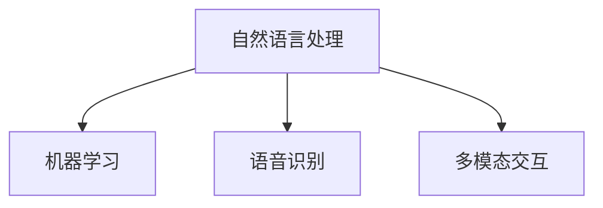

                 

# 附录：聊天机器人开发资源

在当今数字化时代，聊天机器人（Chatbot）作为一种智能交互形式，广泛应用于各类应用程序和服务中。无论是客户服务、在线咨询、教育辅导还是日常娱乐，聊天机器人都显示了强大的应用潜力。开发高效、智能的聊天机器人，需要系统掌握相关的技术资源、工具和实践经验。本文将从开发环境搭建、核心算法原理、具体实现、实际应用场景、未来发展趋势和常见问题解答等多个维度，提供全面的资源指引，助你顺利构建一个功能强大的聊天机器人。

## 1. 背景介绍

### 1.1 问题由来
聊天机器人作为一种智能助手，通过自然语言理解和生成，为用户提供即时、个性化的交互体验。近年来，随着深度学习和大数据技术的发展，聊天机器人技术得到了长足的进步，特别是在预训练语言模型（如GPT-3、BERT等）的驱动下，聊天机器人的智能水平和应用范围进一步扩展。然而，尽管如此，开发高效、智能的聊天机器人仍然面临诸多挑战，如理解语义的复杂性、应对多变的用户需求、维护系统稳定性和可靠性等。

### 1.2 问题核心关键点
要开发一个成功的聊天机器人，需要综合运用自然语言处理（NLP）、机器学习、语音识别、多模态交互等多个领域的知识。关键点在于：
- **自然语言处理（NLP）**：理解用户的语言输入，提取关键信息，形成有效的用户意图。
- **机器学习**：利用标注数据训练模型，提高机器人的智能水平和决策能力。
- **语音识别**：实现语音与文本的互转，提升交互体验。
- **多模态交互**：结合文本、语音、图像等多种输入形式，提供更加丰富的交互体验。

## 2. 核心概念与联系

### 2.1 核心概念概述

要深入理解聊天机器人的开发，首先需要明确一些核心概念：

- **自然语言处理（NLP）**：研究如何让计算机理解和处理自然语言，包括分词、词性标注、命名实体识别、情感分析、语义理解、机器翻译等。
- **机器学习（ML）**：通过数据训练模型，使机器人能够从数据中学习规律，做出预测或决策。
- **语音识别（ASR）**：将语音转换为文本，实现语音与文本的互转，提升交互体验。
- **多模态交互（Multi-modal Interaction）**：结合文本、语音、图像等多种输入形式，提供更加丰富的交互体验。

这些核心概念之间存在紧密的联系，共同构成了聊天机器人的技术基础。以下Mermaid流程图展示了这些概念之间的逻辑关系：



### 2.2 核心算法原理 & 具体操作步骤

#### 3.1 算法原理概述
聊天机器人的核心算法包括自然语言处理（NLP）、机器学习（ML）和语音识别（ASR）。以下将分别介绍这些算法的原理和具体操作步骤：

1. **自然语言处理（NLP）**：
   - **分词**：将输入文本切分为词语，是NLP的第一步。
   - **词性标注**：标注每个词的词性（名词、动词等）。
   - **命名实体识别**：识别文本中的实体（人名、地名、组织名等）。
   - **情感分析**：分析文本的情感倾向（正面、负面、中性）。
   - **语义理解**：理解用户输入的意图，生成应答。

2. **机器学习（ML）**：
   - **监督学习**：使用标注数据训练模型，如决策树、随机森林、神经网络等。
   - **无监督学习**：利用未标注数据训练模型，如聚类、降维等。
   - **半监督学习**：结合少量标注数据和大量未标注数据进行训练。

3. **语音识别（ASR）**：
   - **声学模型**：将音频转换为文字。
   - **语言模型**：基于语言知识，对文本进行解码。

#### 3.2 算法步骤详解
聊天机器人的开发通常分为以下几个步骤：

1. **需求分析**：确定聊天机器人的应用场景、用户需求和功能要求。
2. **数据收集**：收集与聊天机器人相关的数据，包括对话记录、用户反馈等。
3. **数据预处理**：清洗、标注数据，形成可用于训练的数据集。
4. **模型训练**：选择合适的算法，训练模型。
5. **模型评估**：在验证集上评估模型性能，调整参数。
6. **部署上线**：将训练好的模型部署到生产环境，进行实时交互。

#### 3.3 算法优缺点
- **优点**：
  - **高效**：可以24/7全天候服务，提升用户满意度。
  - **个性化**：根据用户历史行为和偏好提供个性化服务。
  - **成本低**：相比于人工客服，初期成本较低。

- **缺点**：
  - **准确性**：初期准确性可能不如人工客服，需要持续优化。
  - **上下文理解**：多轮对话时，上下文理解可能不够准确。
  - **情感管理**：对复杂的情感理解和回应可能存在挑战。

#### 3.4 算法应用领域
聊天机器人在多个领域都有广泛应用，包括：

- **客户服务**：自动回答常见问题，提升客户满意度。
- **在线教育**：提供个性化辅导，解答学习问题。
- **医疗咨询**：提供健康建议，预约挂号等服务。
- **娱乐休闲**：提供游戏、聊天等互动体验。
- **企业应用**：自动化流程，提高工作效率。

## 4. 数学模型和公式 & 详细讲解 & 举例说明

### 4.1 数学模型构建
聊天机器人的数学模型主要基于NLP和机器学习算法构建。以一个简单的聊天机器人为例，其数学模型可以表示为：

- **输入**：用户输入的文本或语音。
- **模型**：自然语言处理模型和机器学习模型。
- **输出**：机器人的应答。

#### 4.2 公式推导过程
以一个简单的问答机器人为例，其核心公式如下：

- **输入表示**：将用户输入的文本转换为向量表示，通常使用word2vec、GloVe或BERT等嵌入模型。
- **应答生成**：使用LSTM或Transformer模型，生成应答文本。
- **评估指标**：BLEU、ROUGE等自动评估指标，用于评估模型输出与真实应答的匹配度。

### 4.3 案例分析与讲解
假设我们有一个简单的问答机器人，用于回答关于天气的问题。

1. **数据准备**：收集关于天气的对话记录，如“今天天气怎么样？”、“明天天气怎么样？”等。
2. **数据预处理**：将对话记录转换为向量表示，使用word2vec嵌入模型。
3. **模型训练**：使用LSTM模型，训练模型生成应答。
4. **模型评估**：在验证集上评估模型性能，调整模型参数。
5. **部署上线**：将训练好的模型部署到生产环境，进行实时交互。

## 5. 项目实践：代码实例和详细解释说明

### 5.1 开发环境搭建
搭建一个聊天机器人的开发环境，需要以下工具：

1. **Python**：主流的编程语言，适合机器学习开发。
2. **TensorFlow**：深度学习框架，适合构建和训练复杂的NLP模型。
3. **NLTK**：自然语言处理库，提供丰富的文本处理工具。
4. **Keras**：高层神经网络API，方便构建和训练模型。
5. **Flask**：轻量级Web框架，方便搭建API接口。
6. **OpenAI GPT-3**：先进的预训练模型，适合构建聊天机器人。

### 5.2 源代码详细实现
以下是一个简单的问答机器人的Python代码实现：

```python
import nltk
from nltk.chat.util import Chat, reflections

pairs = [
    ['(hi|hello|hey)', ['Hello!', 'Hi there!', 'Hey!', 'Hello, how can I help you?']],
    ['(good morning|good afternoon|good evening|good night)', ['Good morning!', 'Good afternoon!', 'Good evening!', 'Good night!']],
    ['(bye|exit|quit)', ['Goodbye!', 'Bye!', 'See you later!', 'Goodbye!']]
]

chatbot = Chat(pairs, reflections)

chatbot.converse()
```

该代码使用NLTK库，构建了一个简单的问答机器人。用户输入与预设的对话规则匹配，机器人生成应答。

### 5.3 代码解读与分析
- **NLTK库**：使用NLTK库的Chat工具，实现简单的问答对话。
- **对话规则**：通过定义对话规则，实现匹配和应答。
- **反射函数**：反射函数用于将用户输入转换为模型输入，增强模型的泛化能力。

### 5.4 运行结果展示
运行上述代码，用户可以与聊天机器人进行交互，体验简单的问答服务。

## 6. 实际应用场景

### 6.1 智能客服系统
聊天机器人可以应用于智能客服系统，自动回答客户咨询，提升服务效率和客户满意度。通过收集历史客服记录，训练模型，可以实现自动化客服，减少人力成本。

### 6.2 在线教育
聊天机器人可以提供个性化辅导，解答学生学习问题，提供实时学习支持。通过分析学生的学习数据，提供个性化的学习建议和资源推荐。

### 6.3 医疗咨询
聊天机器人可以提供健康建议，预约挂号等服务。通过收集用户的健康数据，提供个性化的健康管理方案。

### 6.4 企业应用
聊天机器人可以自动化流程，提高工作效率。通过收集员工的工作数据，提供个性化的工作支持。

### 6.5 娱乐休闲
聊天机器人可以提供游戏、聊天等互动体验，丰富用户生活。通过收集用户的历史互动数据，提供个性化的推荐和建议。

## 7. 工具和资源推荐

### 7.1 学习资源推荐
1. **《Python自然语言处理》**：吴恩达（Andrew Ng）的NLP课程，提供丰富的NLP基础知识和实践技巧。
2. **《深度学习》**：Ian Goodfellow等著，涵盖深度学习基础和实践，适合进一步学习。
3. **《Hands-On Machine Learning with Scikit-Learn》**：Aurélien Géron著，使用Scikit-Learn库进行机器学习实践。
4. **《自然语言处理入门》**：北京大学OMSA课程，涵盖NLP基础知识和实践。
5. **《TensorFlow官方文档》**：TensorFlow官方文档，提供详细的API和示例代码。

### 7.2 开发工具推荐
1. **Jupyter Notebook**：开源的Jupyter Notebook，适合数据处理和模型训练。
2. **PyCharm**：Python IDE，提供丰富的开发工具和调试功能。
3. **Git**：版本控制工具，适合团队协作开发。
4. **Docker**：容器化工具，方便模型部署和维护。
5. **Kubernetes**：容器编排工具，适合大规模部署和管理。

### 7.3 相关论文推荐
1. **《Attention is All You Need》**：Transformer论文，提出自注意力机制，改变NLP模型结构。
2. **《BERT: Pre-training of Deep Bidirectional Transformers for Language Understanding》**：BERT论文，提出预训练语言模型，提升NLP效果。
3. **《Sequence to Sequence Learning with Neural Networks》**：提出序列到序列模型，实现文本生成和翻译。
4. **《Transformers: State-of-the-art NLP Machine Learning》**：Hugging Face博客，介绍先进的NLP模型和实践。

## 8. 总结：未来发展趋势与挑战

### 8.1 总结
本文从开发环境搭建、核心算法原理、具体实现、实际应用场景、未来发展趋势和常见问题解答等多个维度，提供全面的资源指引，助你顺利构建一个功能强大的聊天机器人。

### 8.2 未来发展趋势
- **多模态交互**：结合文本、语音、图像等多种输入形式，提供更加丰富的交互体验。
- **深度学习**：使用更先进的深度学习模型，提升聊天机器人的智能水平。
- **自适应学习**：使用自适应学习算法，根据用户反馈不断优化模型。
- **上下文理解**：提高机器人的上下文理解能力，提升多轮对话体验。
- **情感管理**：增强机器人的情感理解能力，提供更加人性化服务。

### 8.3 面临的挑战
- **数据质量**：高质量的数据是构建高效聊天机器人的基础，数据收集和标注成本较高。
- **计算资源**：训练复杂的NLP模型需要大量的计算资源，初期投入较大。
- **模型鲁棒性**：模型对噪声和异常数据的鲁棒性不足，容易出错。
- **用户反馈**：用户反馈的数据量较大，模型需要不断优化。
- **隐私保护**：用户数据的隐私保护问题，需要采用匿名化和加密等技术。

### 8.4 研究展望
未来，聊天机器人技术将在多个领域得到广泛应用，成为智能交互的重要形式。通过不断的技术进步和应用实践，聊天机器人将更加智能、高效和可靠，为用户提供更加便捷、个性化的服务体验。

## 9. 附录：常见问题与解答

### Q1: 聊天机器人如何实现情感理解？
**A**: 聊天机器人实现情感理解通常使用情感分析算法，如LSTM、BiLSTM等。通过对用户输入的文本进行情感分类，生成匹配的应答。例如，当用户表达负面情绪时，机器人可以提供安慰和建议。

### Q2: 如何优化聊天机器人的上下文理解能力？
**A**: 优化聊天机器人的上下文理解能力通常需要结合上下文编码器，如LSTM或Transformer。通过保存对话历史信息，增强机器人对上下文的理解能力。同时，引入注意力机制，提高模型对关键信息的关注度。

### Q3: 聊天机器人如何处理多轮对话？
**A**: 处理多轮对话通常需要引入记忆机制，如使用LSTM或Transformer等模型。通过保存对话历史信息，增强机器人对上下文的理解能力。同时，引入注意力机制，提高模型对关键信息的关注度。

### Q4: 如何提高聊天机器人的鲁棒性？
**A**: 提高聊天机器人的鲁棒性通常需要引入正则化技术，如L2正则、Dropout等。通过限制模型的复杂度，防止过拟合。同时，引入对抗训练，提高模型对噪声和异常数据的鲁棒性。

### Q5: 聊天机器人如何处理复杂查询？
**A**: 处理复杂查询通常需要引入深度学习模型，如Transformer等。通过增强模型的语义理解能力，提升机器人对复杂查询的理解和应答能力。同时，引入多模态交互，通过结合文本、语音、图像等多种输入形式，提供更加丰富的交互体验。

作者：禅与计算机程序设计艺术 / Zen and the Art of Computer Programming

