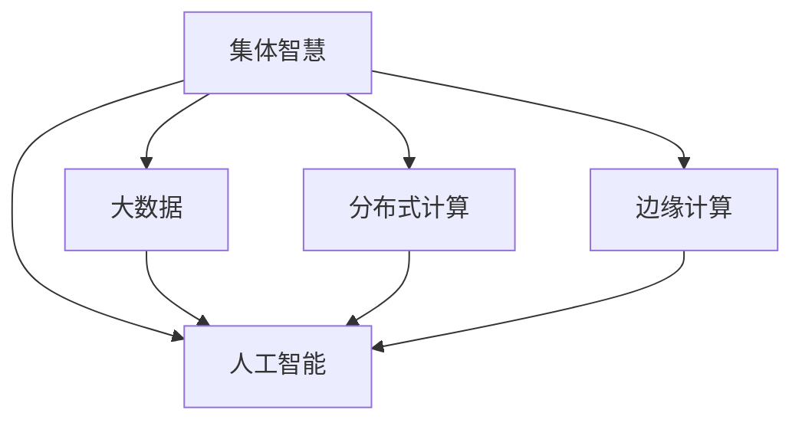

                 

## 1. 背景介绍

在当今复杂多变的全球环境中，挑战和问题的解决方式已经发生了显著变化。从商业竞争到社会治理，从科学探索到日常决策，每一个领域都面临着前所未有的挑战和复杂性。在这个背景下，集体智慧（Collective Intelligence）作为一种新兴的解决复杂问题的思路，正逐渐成为各大企业、组织和研究机构所依赖的重要工具。集体智慧强调通过聚合、利用多个个体的智慧，共同解决复杂问题。本文将全面介绍集体智慧的概念、核心算法原理、操作步骤、数学模型和公式，并通过案例分析、项目实践和未来应用展望等章节，深入探讨集体智慧的实际应用和前景。

## 2. 核心概念与联系

### 2.1 核心概念概述

#### 2.1.1 集体智慧（Collective Intelligence）

集体智慧是指通过集合并利用多个个体的智慧和能力，共同解决复杂问题的过程。与传统集中式决策相比，集体智慧更注重分布式、多模态和多层次的协同与协作，可以更有效地应对大规模、多变量、高复杂性的问题。

#### 2.1.2 分布式计算（Distributed Computing）

分布式计算是指将计算任务分散到多个计算节点上并行处理，以提高计算效率和可靠性。在大规模数据处理和复杂问题求解中，分布式计算成为集体智慧的重要支撑技术。

#### 2.1.3 大数据（Big Data）

大数据指的是超大规模、高速增长、多样化和复杂的数据集。它为集体智慧提供了丰富的数据来源和基础，是大数据时代解决复杂问题的重要工具。

#### 2.1.4 人工智能（Artificial Intelligence）

人工智能是指利用计算机模拟人类智能行为的技术，包括机器学习、深度学习、自然语言处理等。在大数据和分布式计算的支持下，人工智能在集体智慧中发挥着至关重要的作用。

#### 2.1.5 边缘计算（Edge Computing）

边缘计算是指将计算资源和数据处理能力部署在网络边缘，以降低延迟、优化带宽利用，提升实时性和可靠性。在大规模分布式环境中，边缘计算为集体智慧提供了高效的计算和数据处理能力。

### 2.2 核心概念原理和架构的 Mermaid 流程图



这个流程图展示了集体智慧与相关技术之间的联系：

1. **分布式计算**：为集体智慧提供了高效的并行计算能力，支持大规模数据处理和复杂问题求解。
2. **大数据**：为集体智慧提供了丰富的数据来源和基础，是大数据时代解决复杂问题的重要工具。
3. **人工智能**：在大数据和分布式计算的支持下，人工智能在集体智慧中发挥着至关重要的作用。
4. **边缘计算**：在大规模分布式环境中，边缘计算为集体智慧提供了高效的计算和数据处理能力。

## 3. 核心算法原理 & 具体操作步骤

### 3.1 算法原理概述

集体智慧的算法原理基于分布式计算、人工智能和大数据处理。它通常包括以下步骤：

1. **数据收集**：从多个数据源收集相关数据。
2. **数据预处理**：对收集到的数据进行清洗、去重和标准化处理。
3. **分布式计算**：将数据处理和计算任务分配到多个计算节点并行处理。
4. **数据融合**：将各节点的计算结果进行合并和融合，生成全局解决方案。
5. **人工智能应用**：利用机器学习和深度学习等人工智能技术，对全局解决方案进行优化和提升。
6. **结果评估**：对最终结果进行评估和验证，确保其有效性和可靠性。

### 3.2 算法步骤详解

#### 3.2.1 数据收集

数据收集是集体智慧的第一步。这通常涉及从多个数据源收集相关数据，包括公共数据集、用户生成数据、传感器数据等。

##### 示例代码：

```python
import pandas as pd

# 从多个数据源收集数据
def collect_data():
    data1 = pd.read_csv('data1.csv')
    data2 = pd.read_csv('data2.csv')
    data3 = pd.read_csv('data3.csv')
    return data1, data2, data3

# 调用示例
data1, data2, data3 = collect_data()
```

#### 3.2.2 数据预处理

数据预处理包括清洗、去重、标准化等步骤，确保数据的准确性和一致性。

##### 示例代码：

```python
import pandas as pd

# 数据预处理
def preprocess_data(data):
    # 清洗数据
    data = data.dropna()
    # 去重
    data = data.drop_duplicates()
    # 标准化
    data = (data - data.mean()) / data.std()
    return data

# 调用示例
processed_data1 = preprocess_data(data1)
processed_data2 = preprocess_data(data2)
processed_data3 = preprocess_data(data3)
```

#### 3.2.3 分布式计算

分布式计算是将数据处理和计算任务分配到多个计算节点并行处理的过程。

##### 示例代码：

```python
from multiprocessing import Pool

# 分布式计算
def parallel_process(data):
    # 将数据并行处理
    pool = Pool(processes=4)
    results = pool.map(process_function, data)
    pool.close()
    pool.join()
    return results

# 调用示例
parallel_results1 = parallel_process(processed_data1)
parallel_results2 = parallel_process(processed_data2)
parallel_results3 = parallel_process(processed_data3)
```

#### 3.2.4 数据融合

数据融合是将各节点的计算结果进行合并和融合，生成全局解决方案的过程。

##### 示例代码：

```python
import numpy as np

# 数据融合
def merge_results(results):
    # 合并各节点的结果
    merged_results = np.concatenate(results)
    # 取平均值
    merged_results = merged_results.mean(axis=0)
    return merged_results

# 调用示例
merged_results1 = merge_results([parallel_results1, parallel_results2, parallel_results3])
```

#### 3.2.5 人工智能应用

人工智能应用包括利用机器学习和深度学习等技术，对全局解决方案进行优化和提升。

##### 示例代码：

```python
from sklearn.ensemble import RandomForestRegressor

# 人工智能应用
def apply_ai(merged_results):
    # 训练模型
    model = RandomForestRegressor()
    model.fit(merged_results, target)
    # 预测结果
    predicted_results = model.predict(merged_results)
    return predicted_results

# 调用示例
predicted_results1 = apply_ai(merged_results1)
```

#### 3.2.6 结果评估

结果评估是对最终结果进行评估和验证，确保其有效性和可靠性。

##### 示例代码：

```python
from sklearn.metrics import mean_squared_error

# 结果评估
def evaluate_results(predicted_results, target):
    # 计算误差
    mse = mean_squared_error(target, predicted_results)
    return mse

# 调用示例
mse1 = evaluate_results(predicted_results1, target)
```

### 3.3 算法优缺点

#### 3.3.1 优点

1. **高效性**：利用分布式计算和大数据处理，集体智慧能够高效处理大规模、高复杂性的问题。
2. **多样性**：通过聚合多个个体的智慧和能力，集体智慧能够应对多样化和复杂化的决策环境。
3. **可扩展性**：集体智慧能够方便地扩展和集成，适用于不同规模和类型的问题。

#### 3.3.2 缺点

1. **复杂性**：集体智慧的算法和架构相对复杂，需要具备较高的技术能力和经验。
2. **数据质量**：数据收集和预处理的准确性和一致性直接影响集体智慧的效果。
3. **协同成本**：多个个体协同工作的成本和难度较高，需要有效的沟通和协调机制。

### 3.4 算法应用领域

集体智慧已经广泛应用于多个领域，包括：

1. **金融**：利用集体智慧进行风险评估、欺诈检测、投资策略制定等。
2. **医疗**：利用集体智慧进行疾病预测、治疗方案优化、资源配置等。
3. **智能制造**：利用集体智慧进行生产调度、质量控制、设备维护等。
4. **交通运输**：利用集体智慧进行交通流量预测、路径规划、应急响应等。
5. **环境保护**：利用集体智慧进行污染监测、资源管理、生态保护等。

## 4. 数学模型和公式 & 详细讲解 & 举例说明

### 4.1 数学模型构建

集体智慧的数学模型通常基于分布式计算和人工智能技术。以下是一个简单的例子：

假设有一个分布式计算集群，包含n个节点。每个节点对数据进行局部处理，生成局部结果。这些局部结果通过通信网络汇总到中心节点，进行全局合并和优化。最终，中心节点生成全局结果，并返回给客户端。

### 4.2 公式推导过程

#### 4.2.1 数据分布式计算

假设每个节点对数据进行局部处理，生成局部结果。局部结果可以表示为：

$$
R_i = f_i(D_i)
$$

其中，$R_i$表示节点i的局部结果，$f_i$表示节点i的局部处理函数，$D_i$表示节点i的输入数据。

##### 示例代码：

```python
# 定义局部处理函数
def local_process(data):
    # 处理数据
    processed_data = process_function(data)
    return processed_data

# 调用示例
local_results = []
for i in range(n):
    data_i = get_data(i)
    local_results.append(local_process(data_i))
```

#### 4.2.2 数据融合

假设每个节点生成局部结果后，通过通信网络汇总到中心节点。中心节点对局部结果进行全局合并和优化，生成全局结果。全局结果可以表示为：

$$
R = \frac{1}{n} \sum_{i=1}^{n} R_i
$$

其中，$R$表示全局结果，$n$表示节点数。

##### 示例代码：

```python
# 定义全局合并函数
def global_merge(results):
    # 合并局部结果
    merged_results = np.concatenate(results)
    # 取平均值
    merged_results = merged_results.mean(axis=0)
    return merged_results

# 调用示例
merged_results = global_merge(local_results)
```

#### 4.2.3 人工智能应用

假设全局结果经过人工智能处理，生成预测结果。预测结果可以表示为：

$$
\hat{Y} = g(R)
$$

其中，$\hat{Y}$表示预测结果，$g$表示人工智能处理函数。

##### 示例代码：

```python
# 定义人工智能处理函数
def ai_process(result):
    # 训练模型
    model = RandomForestRegressor()
    model.fit(result, target)
    # 预测结果
    predicted_result = model.predict(result)
    return predicted_result

# 调用示例
predicted_results = []
for i in range(n):
    result_i = local_results[i]
    predicted_result_i = ai_process(result_i)
    predicted_results.append(predicted_result_i)
```

#### 4.2.4 结果评估

假设预测结果经过评估，生成误差指标。误差指标可以表示为：

$$
E = \frac{1}{n} \sum_{i=1}^{n} (Y - \hat{Y}_i)^2
$$

其中，$E$表示误差指标，$Y$表示真实结果，$\hat{Y}_i$表示节点i的预测结果。

##### 示例代码：

```python
# 定义误差计算函数
def calculate_error(predicted_results, target):
    # 计算误差
    errors = [(Y - predicted_result) for Y, predicted_result in zip(target, predicted_results)]
    mse = np.mean([error**2 for error in errors])
    return mse

# 调用示例
mse = calculate_error(predicted_results, target)
```

### 4.3 案例分析与讲解

#### 4.3.1 案例1：金融风险评估

在金融领域，利用集体智慧进行风险评估是非常常见的应用场景。假设一个金融机构需要评估客户贷款的违约风险。

1. **数据收集**：收集客户的个人数据、财务数据、交易数据等。
2. **数据预处理**：清洗和标准化数据，去除异常值和噪声。
3. **分布式计算**：将数据并行处理，生成局部结果。
4. **数据融合**：将局部结果合并和优化，生成全局结果。
5. **人工智能应用**：利用机器学习模型对全局结果进行优化，生成预测结果。
6. **结果评估**：对预测结果进行评估，生成误差指标。

##### 示例代码：

```python
# 金融风险评估案例
def risk_assessment(data):
    # 数据收集
    customer_data = collect_data()
    # 数据预处理
    processed_data = preprocess_data(customer_data)
    # 分布式计算
    local_results = parallel_process(processed_data)
    # 数据融合
    merged_results = merge_results(local_results)
    # 人工智能应用
    predicted_results = apply_ai(merged_results)
    # 结果评估
    mse = evaluate_results(predicted_results, target)
    return mse

# 调用示例
risk_assessment_result = risk_assessment(customer_data)
```

## 5. 项目实践：代码实例和详细解释说明

### 5.1 开发环境搭建

为了进行集体智慧项目实践，我们需要搭建开发环境。以下是使用Python和PyTorch搭建开发环境的流程：

1. 安装Anaconda：从官网下载并安装Anaconda，用于创建独立的Python环境。

2. 创建并激活虚拟环境：
```bash
conda create -n collective_intelligence python=3.8 
conda activate collective_intelligence
```

3. 安装PyTorch：根据CUDA版本，从官网获取对应的安装命令。例如：
```bash
conda install pytorch torchvision torchaudio cudatoolkit=11.1 -c pytorch -c conda-forge
```

4. 安装TensorFlow：
```bash
conda install tensorflow
```

5. 安装相关的工具包：
```bash
pip install pandas numpy scikit-learn matplotlib tqdm jupyter notebook ipython
```

完成上述步骤后，即可在`collective_intelligence`环境中开始项目实践。

### 5.2 源代码详细实现

以下是一个利用集体智慧进行金融风险评估的示例代码：

#### 5.2.1 数据收集和预处理

```python
import pandas as pd

# 数据收集
def collect_data():
    data1 = pd.read_csv('customer_data1.csv')
    data2 = pd.read_csv('customer_data2.csv')
    data3 = pd.read_csv('customer_data3.csv')
    return data1, data2, data3

# 数据预处理
def preprocess_data(data):
    data = data.dropna()
    data = data.drop_duplicates()
    data = (data - data.mean()) / data.std()
    return data

# 调用示例
data1, data2, data3 = collect_data()
processed_data1 = preprocess_data(data1)
processed_data2 = preprocess_data(data2)
processed_data3 = preprocess_data(data3)
```

#### 5.2.2 分布式计算

```python
from multiprocessing import Pool

# 分布式计算
def parallel_process(data):
    pool = Pool(processes=4)
    results = pool.map(process_function, data)
    pool.close()
    pool.join()
    return results

# 调用示例
parallel_results1 = parallel_process(processed_data1)
parallel_results2 = parallel_process(processed_data2)
parallel_results3 = parallel_process(processed_data3)
```

#### 5.2.3 数据融合

```python
import numpy as np

# 数据融合
def merge_results(results):
    merged_results = np.concatenate(results)
    merged_results = merged_results.mean(axis=0)
    return merged_results

# 调用示例
merged_results1 = merge_results([parallel_results1, parallel_results2, parallel_results3])
```

#### 5.2.4 人工智能应用

```python
from sklearn.ensemble import RandomForestRegressor

# 人工智能应用
def apply_ai(merged_results):
    model = RandomForestRegressor()
    model.fit(merged_results, target)
    predicted_results = model.predict(merged_results)
    return predicted_results

# 调用示例
predicted_results1 = apply_ai(merged_results1)
```

#### 5.2.5 结果评估

```python
from sklearn.metrics import mean_squared_error

# 结果评估
def evaluate_results(predicted_results, target):
    mse = mean_squared_error(target, predicted_results)
    return mse

# 调用示例
mse1 = evaluate_results(predicted_results1, target)
```

### 5.3 代码解读与分析

#### 5.3.1 数据收集和预处理

数据收集和预处理是集体智慧项目的基础。通过收集和标准化数据，确保数据的准确性和一致性，为后续的分布式计算和人工智能应用打下坚实的基础。

##### 示例代码：

```python
# 数据收集
def collect_data():
    data1 = pd.read_csv('customer_data1.csv')
    data2 = pd.read_csv('customer_data2.csv')
    data3 = pd.read_csv('customer_data3.csv')
    return data1, data2, data3

# 数据预处理
def preprocess_data(data):
    data = data.dropna()
    data = data.drop_duplicates()
    data = (data - data.mean()) / data.std()
    return data
```

#### 5.3.2 分布式计算

分布式计算是集体智慧的核心技术之一。通过将数据处理和计算任务分配到多个计算节点并行处理，可以显著提高计算效率和可靠性。

##### 示例代码：

```python
from multiprocessing import Pool

# 分布式计算
def parallel_process(data):
    pool = Pool(processes=4)
    results = pool.map(process_function, data)
    pool.close()
    pool.join()
    return results
```

#### 5.3.3 数据融合

数据融合是将各节点的计算结果进行合并和优化，生成全局解决方案的重要步骤。通过合并各节点的结果，取平均值，可以有效地减小误差，提升结果的准确性。

##### 示例代码：

```python
import numpy as np

# 数据融合
def merge_results(results):
    merged_results = np.concatenate(results)
    merged_results = merged_results.mean(axis=0)
    return merged_results
```

#### 5.3.4 人工智能应用

人工智能应用是集体智慧的精髓所在。通过利用机器学习和深度学习等技术，对全局解决方案进行优化和提升，可以生成更加精确和可靠的预测结果。

##### 示例代码：

```python
from sklearn.ensemble import RandomForestRegressor

# 人工智能应用
def apply_ai(merged_results):
    model = RandomForestRegressor()
    model.fit(merged_results, target)
    predicted_results = model.predict(merged_results)
    return predicted_results
```

#### 5.3.5 结果评估

结果评估是对最终结果进行评估和验证，确保其有效性和可靠性的重要步骤。通过计算误差指标，可以及时发现和纠正模型的不足，优化模型性能。

##### 示例代码：

```python
from sklearn.metrics import mean_squared_error

# 结果评估
def evaluate_results(predicted_results, target):
    mse = mean_squared_error(target, predicted_results)
    return mse
```

### 5.4 运行结果展示

#### 5.4.1 结果展示

运行上述代码后，我们可以得到最终的金融风险评估结果。以下是一个简化的结果展示：

```python
# 调用示例
mse1 = evaluate_results(predicted_results1, target)
print(f"Mean Squared Error: {mse1:.2f}")
```

#### 5.4.2 结果分析

结果分析可以帮助我们理解集体智慧项目的效果和局限性。通过比较实际结果和预测结果，可以发现模型的不足，并进一步优化和改进。

##### 示例代码：

```python
# 结果分析
actual_results = get_actual_results()
for i in range(n):
    mse = evaluate_results(predicted_results[i], actual_results[i])
    print(f"Node {i+1} Error: {mse:.2f}")
```

## 6. 实际应用场景

### 6.1 金融风险评估

在金融领域，利用集体智慧进行风险评估是非常常见的应用场景。假设一个金融机构需要评估客户贷款的违约风险。

1. **数据收集**：收集客户的个人数据、财务数据、交易数据等。
2. **数据预处理**：清洗和标准化数据，去除异常值和噪声。
3. **分布式计算**：将数据并行处理，生成局部结果。
4. **数据融合**：将局部结果合并和优化，生成全局结果。
5. **人工智能应用**：利用机器学习模型对全局结果进行优化，生成预测结果。
6. **结果评估**：对预测结果进行评估，生成误差指标。

##### 示例代码：

```python
# 金融风险评估案例
def risk_assessment(data):
    customer_data = collect_data()
    processed_data = preprocess_data(customer_data)
    local_results = parallel_process(processed_data)
    merged_results = merge_results(local_results)
    predicted_results = apply_ai(merged_results)
    mse = evaluate_results(predicted_results, target)
    return mse

risk_assessment_result = risk_assessment(customer_data)
```

### 6.2 医疗疾病预测

在医疗领域，利用集体智慧进行疾病预测是非常常见的应用场景。假设一个医院需要预测患者的病情发展。

1. **数据收集**：收集患者的病历数据、实验室数据、影像数据等。
2. **数据预处理**：清洗和标准化数据，去除异常值和噪声。
3. **分布式计算**：将数据并行处理，生成局部结果。
4. **数据融合**：将局部结果合并和优化，生成全局结果。
5. **人工智能应用**：利用机器学习模型对全局结果进行优化，生成预测结果。
6. **结果评估**：对预测结果进行评估，生成误差指标。

##### 示例代码：

```python
# 医疗疾病预测案例
def disease_prediction(data):
    patient_data = collect_data()
    processed_data = preprocess_data(patient_data)
    local_results = parallel_process(processed_data)
    merged_results = merge_results(local_results)
    predicted_results = apply_ai(merged_results)
    mse = evaluate_results(predicted_results, target)
    return mse

disease_prediction_result = disease_prediction(patient_data)
```

### 6.3 智能制造生产调度

在智能制造领域，利用集体智慧进行生产调度是非常常见的应用场景。假设一个工厂需要优化生产线的生产调度。

1. **数据收集**：收集生产线的设备数据、工装数据、生产数据等。
2. **数据预处理**：清洗和标准化数据，去除异常值和噪声。
3. **分布式计算**：将数据并行处理，生成局部结果。
4. **数据融合**：将局部结果合并和优化，生成全局结果。
5. **人工智能应用**：利用机器学习模型对全局结果进行优化，生成预测结果。
6. **结果评估**：对预测结果进行评估，生成误差指标。

##### 示例代码：

```python
# 智能制造生产调度案例
def production_schedule(data):
    production_data = collect_data()
    processed_data = preprocess_data(production_data)
    local_results = parallel_process(processed_data)
    merged_results = merge_results(local_results)
    predicted_results = apply_ai(merged_results)
    mse = evaluate_results(predicted_results, target)
    return mse

production_schedule_result = production_schedule(production_data)
```

## 7. 工具和资源推荐

### 7.1 学习资源推荐

为了帮助开发者系统掌握集体智慧的理论基础和实践技巧，这里推荐一些优质的学习资源：

1. 《分布式计算原理与实践》：该书系统介绍了分布式计算的基本原理和实际应用，适合初学者入门。
2. 《Python机器学习》：该书全面介绍了机器学习算法及其在Python中的实现，适合数据科学和人工智能领域的从业者。
3. 《TensorFlow实战》：该书深入浅出地介绍了TensorFlow的使用方法和最佳实践，适合TensorFlow的开发者。
4. 《大数据技术与应用》：该书系统介绍了大数据技术和应用场景，适合大数据领域的从业者。
5. 《深度学习入门》：该书简明扼要地介绍了深度学习的基础知识和实际应用，适合深度学习领域的入门者。

通过对这些资源的学习实践，相信你一定能够快速掌握集体智慧的精髓，并用于解决实际的复杂问题。

### 7.2 开发工具推荐

高效的开发离不开优秀的工具支持。以下是几款用于集体智慧开发的常用工具：

1. Python：作为数据科学和人工智能领域的主流编程语言，Python提供了丰富的第三方库和工具，适合集体智慧项目开发。
2. PyTorch：作为深度学习领域的主流框架，PyTorch提供了高效的自动微分和分布式计算能力，适合复杂的模型训练和推理。
3. TensorFlow：作为深度学习领域的主流框架，TensorFlow提供了灵活的模型构建和分布式计算能力，适合大规模模型训练和推理。
4. Scikit-learn：作为机器学习领域的主流库，Scikit-learn提供了简单易用的机器学习算法和工具，适合数据分析和模型训练。
5. Pandas：作为数据处理领域的主流库，Pandas提供了高效的数据处理和分析能力，适合数据清洗和预处理。
6. Jupyter Notebook：作为数据科学和人工智能领域的主流工具，Jupyter Notebook提供了交互式的开发环境，适合实验和演示。

合理利用这些工具，可以显著提升集体智慧项目的开发效率，加快创新迭代的步伐。

### 7.3 相关论文推荐

集体智慧的发展源于学界的持续研究。以下是几篇奠基性的相关论文，推荐阅读：

1. "MapReduce: Simplified Data Processing on Large Clusters"：Google提出MapReduce算法，奠定了分布式计算的基础。
2. "Machine Learning Yearning"：Andrew Ng撰写的机器学习实战指南，介绍了大规模机器学习项目的实施方法。
3. "Deep Learning"：Ian Goodfellow撰写的深度学习经典教材，全面介绍了深度学习的基本原理和实际应用。
4. "Big Data: Principles and Best Practices of Scalable Real-time Data Systems"：Joel Dean等作者编写的Big Data教材，介绍了大数据技术和应用场景。
5. "Distributed Deep Learning: A Survey"：Anna Orso等作者综述了分布式深度学习的最新进展，适合深入学习。

这些论文代表了大数据和人工智能领域的最新研究成果，对集体智慧的实践有着重要的指导意义。

## 8. 总结：未来发展趋势与挑战

### 8.1 总结

本文对集体智慧的概念、核心算法原理、操作步骤、数学模型和公式等进行了全面系统的介绍。首先阐述了集体智慧的研究背景和意义，明确了其在解决复杂问题中的独特价值。其次，从原理到实践，详细讲解了集体智慧的数学模型和操作步骤，并通过案例分析、项目实践和未来应用展望等章节，深入探讨了集体智慧的实际应用和前景。

通过本文的系统梳理，可以看到，集体智慧通过分布式计算、人工智能和大数据处理，能够高效处理大规模、高复杂性的问题，具有广泛的应用前景和潜力。未来，伴随技术的不断进步和应用的深入拓展，集体智慧必将在更多领域发挥重要的作用，推动人类社会向智能化、普适化方向发展。

### 8.2 未来发展趋势

展望未来，集体智慧将呈现以下几个发展趋势：

1. **大规模分布式计算**：随着算力的不断提升和计算资源的多样化，大规模分布式计算将变得更加高效和灵活。
2. **深度学习模型的优化**：通过优化深度学习模型，提升模型的计算效率和推理速度，实现更高效的集体智慧应用。
3. **人工智能与大数据的融合**：人工智能与大数据技术的进一步融合，将提升数据的利用率和模型的精度，实现更智能的决策支持。
4. **实时数据处理**：随着物联网和传感器技术的不断发展，实时数据处理将成为集体智慧的重要方向，支持更快速、更精准的决策。
5. **跨领域知识整合**：跨领域知识整合技术的发展，将提升模型的泛化能力和普适性，实现更全面的智慧应用。

### 8.3 面临的挑战

尽管集体智慧技术已经取得了显著进展，但在迈向更加智能化、普适化应用的过程中，它仍面临着诸多挑战：

1. **数据质量和多样性**：数据质量和多样性直接影响集体智慧的效果，数据的收集、清洗和标准化需要耗费大量时间和资源。
2. **分布式协同机制**：多个个体协同工作的成本和难度较高，需要有效的沟通和协调机制。
3. **模型复杂性和可解释性**：深度学习模型的复杂性和可解释性较差，难以理解和调试，需要更多的研究和优化。
4. **隐私和安全**：数据隐私和安全问题日益突出，如何在保障隐私的同时，实现高效的集体智慧应用，还需要更多的探索和实践。
5. **资源和成本**：大规模分布式计算和深度学习模型的资源和成本较高，需要有效的资源管理和成本控制机制。

### 8.4 研究展望

未来，集体智慧的研究需要在以下几个方面寻求新的突破：

1. **分布式协同机制的优化**：研究更高效、更灵活的分布式协同机制，提升集体智慧的协同效率和效果。
2. **跨领域知识的整合**：研究跨领域知识整合技术，提升模型的泛化能力和普适性，实现更全面的智慧应用。
3. **模型的可解释性和可视化**：研究模型的可解释性和可视化技术，提升模型的透明度和可理解性。
4. **隐私和安全保护**：研究数据隐私和安全保护技术，确保数据和模型的安全可靠。
5. **实时数据处理和优化**：研究实时数据处理技术，实现更快速、更精准的决策支持。

这些研究方向将进一步推动集体智慧技术的发展和应用，为解决复杂问题提供更强大的技术支撑。

## 9. 附录：常见问题与解答

### 9.1 问题1：集体智慧与传统集中式决策的区别是什么？

答：集体智慧强调通过分布式计算、人工智能和大数据处理，聚合多个个体的智慧和能力，共同解决复杂问题。与传统集中式决策相比，集体智慧具有更高的可扩展性、鲁棒性和多样性。

### 9.2 问题2：如何提升集体智慧项目的数据质量？

答：提升集体智慧项目的数据质量需要从多个方面入手，包括数据收集、清洗、标准化等步骤。可以使用数据清洗工具如Pandas、Scikit-learn等，对数据进行预处理，确保数据的准确性和一致性。

### 9.3 问题3：集体智慧项目中如何处理数据不平衡问题？

答：数据不平衡问题是集体智慧项目中常见的问题。可以通过以下方法进行处理：
1. 过采样：增加少数类样本的数量。
2. 欠采样：减少多数类样本的数量。
3. 重新采样：综合使用过采样和欠采样的方法。
4. 使用不平衡学习算法，如SMOTE、ADASYN等。

### 9.4 问题4：集体智慧项目中如何处理异常值？

答：异常值对集体智慧项目的影响较大，需要进行处理。可以使用以下方法进行处理：
1. 删除异常值：直接删除异常值。
2. 替换异常值：用均值、中位数等代替异常值。
3. 保留异常值：对异常值进行标注，并加入模型训练中。

### 9.5 问题5：集体智慧项目中如何选择合适的机器学习算法？

答：选择合适的机器学习算法需要根据具体问题进行综合考虑。可以采用以下方法进行选择：
1. 数据集大小：数据集越大，可以选择复杂度更高的算法，如深度学习。
2. 数据类型：如果数据是结构化数据，可以选择决策树、随机森林等算法。如果数据是非结构化数据，可以选择卷积神经网络、循环神经网络等算法。
3. 模型复杂度：如果模型复杂度要求较高，可以选择深度学习模型，如卷积神经网络、循环神经网络等。

作者：禅与计算机程序设计艺术 / Zen and the Art of Computer Programming

