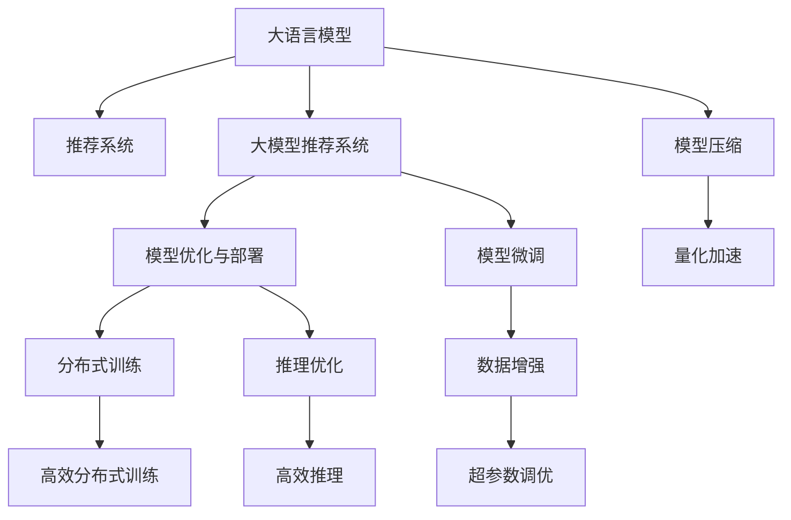

                 

# 面向不同推荐场景的大模型应用部署拆解与优化

> 关键词：大模型推荐系统, 推荐算法, 深度学习, 模型优化, 超参数调优, 分布式训练, 推理优化, 实时推荐

## 1. 背景介绍

随着大数据和人工智能技术的快速发展，推荐系统已广泛应用于电商、新闻、社交网络等多个领域。传统的推荐系统基于协同过滤、内容推荐等算法，存在冷启动问题、数据稀疏性和时效性不足等缺点。近年来，大语言模型（Large Language Model, LLM）如BERT、GPT-3、T5等被引入推荐系统，通过自然语言理解和生成能力，拓展了推荐算法的边界，带来了新的技术范式。

## 2. 核心概念与联系

### 2.1 核心概念概述

- 大语言模型（LLM）：如BERT、GPT-3、T5等，通过大规模无标签数据预训练，学习通用的语言表示，具备强大的语言理解和生成能力。
- 推荐系统：通过算法为用户推荐个性化内容，常见算法包括协同过滤、基于内容的推荐、混合推荐等。
- 大模型推荐系统：将大语言模型引入推荐系统，通过自然语言处理技术提升推荐精度和个性化程度。
- 模型优化与部署：针对大模型推荐系统，进行模型压缩、量化、推理优化等，提升系统效率和用户体验。
- 分布式训练与推理：针对大模型推荐系统，需要高效的分布式训练和推理框架支持，满足大规模数据处理需求。

这些核心概念之间的逻辑关系可以通过以下Mermaid流程图来展示：



这个流程图展示了大语言模型推荐系统的核心概念及其之间的关系：

1. 大语言模型通过大规模数据预训练获得语言表示能力。
2. 将预训练模型引入推荐系统，进行推荐任务微调。
3. 微调后的大模型进行模型压缩和量化加速，提升推理速度。
4. 模型通过分布式训练和推理，满足大规模数据处理需求。

## 3. 核心算法原理 & 具体操作步骤

### 3.1 算法原理概述

大模型推荐系统的核心原理是将大语言模型引入推荐系统，通过自然语言理解和生成能力，提升推荐精度和个性化程度。具体而言，大模型通过预训练学习到通用的语言表示，可以在微调过程中适应不同领域的推荐任务。

假设预训练模型为 $M_{\theta}$，推荐系统为 $R$，其中 $\theta$ 为大模型的预训练参数，$R$ 为推荐算法的参数。推荐系统训练集为 $D=\{(x_i, y_i)\}_{i=1}^N$，其中 $x_i$ 为用户输入的特征，$y_i$ 为用户期望的推荐结果。

微调的目标是最小化推荐系统的损失函数，即：

$$
\min_{\theta} \mathcal{L}(M_{\theta}, D)
$$

其中 $\mathcal{L}$ 为推荐系统的损失函数，常见包括交叉熵损失、均方误差损失等。通过梯度下降等优化算法，微调过程不断更新模型参数 $\theta$，最小化损失函数 $\mathcal{L}$，使得模型输出逼近真实推荐结果。

### 3.2 算法步骤详解

基于大模型的推荐系统一般包括以下几个关键步骤：

**Step 1: 准备预训练模型和数据集**
- 选择合适的预训练语言模型 $M_{\theta}$ 作为初始化参数，如 BERT、GPT-3等。
- 准备推荐系统的训练集 $D$，划分为训练集、验证集和测试集。一般要求标注数据与预训练数据的分布不要差异过大。

**Step 2: 添加推荐适配层**
- 根据推荐任务类型，在预训练模型顶层设计合适的推荐适配层。
- 对于点击率预测任务，通常在顶层添加线性分类器和交叉熵损失函数。
- 对于用户推荐列表生成任务，通常使用语言模型的解码器输出概率分布，并以负对数似然为损失函数。

**Step 3: 设置推荐超参数**
- 选择合适的优化算法及其参数，如 AdamW、SGD 等，设置学习率、批大小、迭代轮数等。
- 设置正则化技术及强度，包括权重衰减、Dropout、Early Stopping 等。
- 确定冻结预训练参数的策略，如仅微调顶层，或全部参数都参与微调。

**Step 4: 执行梯度训练**
- 将训练集数据分批次输入模型，前向传播计算损失函数。
- 反向传播计算参数梯度，根据设定的优化算法和学习率更新模型参数。
- 周期性在验证集上评估模型性能，根据性能指标决定是否触发 Early Stopping。
- 重复上述步骤直到满足预设的迭代轮数或 Early Stopping 条件。

**Step 5: 测试和部署**
- 在测试集上评估微调后模型 $M_{\hat{\theta}}$ 的性能，对比微调前后的精度提升。
- 使用微调后的模型对新样本进行推理预测，集成到实际的应用系统中。
- 持续收集新的数据，定期重新微调模型，以适应数据分布的变化。

以上是基于大模型的推荐系统的一般流程。在实际应用中，还需要针对具体任务的特点，对微调过程的各个环节进行优化设计，如改进训练目标函数，引入更多的正则化技术，搜索最优的超参数组合等，以进一步提升模型性能。

### 3.3 算法优缺点

基于大模型的推荐系统具有以下优点：
1. 简单高效。只需准备少量标注数据，即可对预训练模型进行快速适配，获得较大的性能提升。
2. 通用适用。适用于各种推荐任务，包括点击率预测、用户推荐列表生成等，设计简单的推荐适配层即可实现微调。
3. 效果显著。在学术界和工业界的诸多任务上，基于微调的方法已经刷新了最先进的性能指标。

同时，该方法也存在一定的局限性：
1. 依赖标注数据。推荐系统的效果很大程度上取决于标注数据的质量和数量，获取高质量标注数据的成本较高。
2. 迁移能力有限。当推荐任务与预训练数据的分布差异较大时，微调的性能提升有限。
3. 可解释性不足。推荐系统的决策过程通常缺乏可解释性，难以对其推理逻辑进行分析和调试。

尽管存在这些局限性，但就目前而言，基于大模型的推荐系统仍然是大模型应用的最主流范式。未来相关研究的重点在于如何进一步降低推荐系统对标注数据的依赖，提高模型的少样本学习和跨领域迁移能力，同时兼顾可解释性和伦理安全性等因素。

### 3.4 算法应用领域

基于大模型的推荐系统已经在电商、新闻、社交网络等多个领域得到了广泛应用，覆盖了推荐系统的大多数常见任务，例如：

- 电商推荐：为用户推荐个性化商品，提升购物体验。
- 新闻推荐：为用户推荐个性化新闻内容，增加用户粘性。
- 社交推荐：为用户推荐个性化社交内容，增加互动率。
- 视频推荐：为用户推荐个性化视频内容，增加观看时长。
- 游戏推荐：为用户推荐个性化游戏内容，增加用户留存率。

除了上述这些经典任务外，大模型推荐系统也被创新性地应用到更多场景中，如可控文本生成、对话推荐、跨领域推荐等，为推荐系统带来了全新的突破。随着预训练模型和推荐方法的不断进步，相信推荐系统将在更广阔的应用领域大放异彩。

## 4. 数学模型和公式 & 详细讲解 & 举例说明

### 4.1 数学模型构建

本节将使用数学语言对基于大模型的推荐系统进行更加严格的刻画。

假设预训练模型为 $M_{\theta}$，推荐系统为 $R$，其中 $\theta$ 为大模型的预训练参数，$R$ 为推荐算法的参数。推荐系统训练集为 $D=\{(x_i, y_i)\}_{i=1}^N$，其中 $x_i$ 为用户输入的特征，$y_i$ 为用户期望的推荐结果。

定义推荐系统 $R$ 在数据样本 $(x,y)$ 上的损失函数为 $\ell(R(x),y)$，则在数据集 $D$ 上的经验风险为：

$$
\mathcal{L}(R) = \frac{1}{N} \sum_{i=1}^N \ell(R(x_i),y_i)
$$

微调的目标是最小化经验风险，即找到最优参数：

$$
R^* = \mathop{\arg\min}_{R} \mathcal{L}(R)
$$

在实践中，我们通常使用基于梯度的优化算法（如SGD、Adam等）来近似求解上述最优化问题。设 $\eta$ 为学习率，$\lambda$ 为正则化系数，则参数的更新公式为：

$$
R \leftarrow R - \eta \nabla_{R}\mathcal{L}(R) - \eta\lambda R
$$

其中 $\nabla_{R}\mathcal{L}(R)$ 为损失函数对参数 $R$ 的梯度，可通过反向传播算法高效计算。

### 4.2 公式推导过程

以下我们以点击率预测任务为例，推导交叉熵损失函数及其梯度的计算公式。

假设推荐系统 $R$ 在用户输入 $x$ 上的输出为 $\hat{y}=M_{\theta}(x) \in [0,1]$，表示样本点击的概率。真实标签 $y \in \{0,1\}$。则二分类交叉熵损失函数定义为：

$$
\ell(R(x),y) = -[y\log \hat{y} + (1-y)\log (1-\hat{y})]
$$

将其代入经验风险公式，得：

$$
\mathcal{L}(R) = -\frac{1}{N}\sum_{i=1}^N [y_i\log M_{\theta}(x_i)+(1-y_i)\log(1-M_{\theta}(x_i))]
$$

根据链式法则，损失函数对参数 $R$ 的梯度为：

$$
\frac{\partial \mathcal{L}(R)}{\partial R} = -\frac{1}{N}\sum_{i=1}^N (\frac{y_i}{M_{\theta}(x_i)}-\frac{1-y_i}{1-M_{\theta}(x_i)}) \frac{\partial M_{\theta}(x_i)}{\partial R}
$$

其中 $\frac{\partial M_{\theta}(x_i)}{\partial R}$ 可进一步递归展开，利用自动微分技术完成计算。

在得到损失函数的梯度后，即可带入参数更新公式，完成模型的迭代优化。重复上述过程直至收敛，最终得到适应推荐任务的最优模型参数 $R^*$。

## 5. 项目实践：代码实例和详细解释说明

### 5.1 开发环境搭建

在进行推荐系统开发前，我们需要准备好开发环境。以下是使用Python进行PyTorch开发的环境配置流程：

1. 安装Anaconda：从官网下载并安装Anaconda，用于创建独立的Python环境。

2. 创建并激活虚拟环境：
```bash
conda create -n pytorch-env python=3.8 
conda activate pytorch-env
```

3. 安装PyTorch：根据CUDA版本，从官网获取对应的安装命令。例如：
```bash
conda install pytorch torchvision torchaudio cudatoolkit=11.1 -c pytorch -c conda-forge
```

4. 安装各类工具包：
```bash
pip install numpy pandas scikit-learn matplotlib tqdm jupyter notebook ipython
```

完成上述步骤后，即可在`pytorch-env`环境中开始推荐系统开发。

### 5.2 源代码详细实现

下面我们以电商推荐任务为例，给出使用Transformers库对BERT模型进行推荐系统微调的PyTorch代码实现。

首先，定义推荐任务的数据处理函数：

```python
from transformers import BertTokenizer
from torch.utils.data import Dataset
import torch

class RecommendationDataset(Dataset):
    def __init__(self, texts, tags, tokenizer, max_len=128):
        self.texts = texts
        self.tags = tags
        self.tokenizer = tokenizer
        self.max_len = max_len
        
    def __len__(self):
        return len(self.texts)
    
    def __getitem__(self, item):
        text = self.texts[item]
        tags = self.tags[item]
        
        encoding = self.tokenizer(text, return_tensors='pt', max_length=self.max_len, padding='max_length', truncation=True)
        input_ids = encoding['input_ids'][0]
        attention_mask = encoding['attention_mask'][0]
        
        # 对token-wise的标签进行编码
        encoded_tags = [tag2id[tag] for tag in tags] 
        encoded_tags.extend([tag2id['O']] * (self.max_len - len(encoded_tags)))
        labels = torch.tensor(encoded_tags, dtype=torch.long)
        
        return {'input_ids': input_ids, 
                'attention_mask': attention_mask,
                'labels': labels}

# 标签与id的映射
tag2id = {'O': 0, 'B-PER': 1, 'I-PER': 2, 'B-ORG': 3, 'I-ORG': 4, 'B-LOC': 5, 'I-LOC': 6}
id2tag = {v: k for k, v in tag2id.items()}

# 创建dataset
tokenizer = BertTokenizer.from_pretrained('bert-base-cased')

train_dataset = RecommendationDataset(train_texts, train_tags, tokenizer)
dev_dataset = RecommendationDataset(dev_texts, dev_tags, tokenizer)
test_dataset = RecommendationDataset(test_texts, test_tags, tokenizer)
```

然后，定义模型和优化器：

```python
from transformers import BertForTokenClassification, AdamW

model = BertForTokenClassification.from_pretrained('bert-base-cased', num_labels=len(tag2id))

optimizer = AdamW(model.parameters(), lr=2e-5)
```

接着，定义训练和评估函数：

```python
from torch.utils.data import DataLoader
from tqdm import tqdm
from sklearn.metrics import classification_report

device = torch.device('cuda') if torch.cuda.is_available() else torch.device('cpu')
model.to(device)

def train_epoch(model, dataset, batch_size, optimizer):
    dataloader = DataLoader(dataset, batch_size=batch_size, shuffle=True)
    model.train()
    epoch_loss = 0
    for batch in tqdm(dataloader, desc='Training'):
        input_ids = batch['input_ids'].to(device)
        attention_mask = batch['attention_mask'].to(device)
        labels = batch['labels'].to(device)
        model.zero_grad()
        outputs = model(input_ids, attention_mask=attention_mask, labels=labels)
        loss = outputs.loss
        epoch_loss += loss.item()
        loss.backward()
        optimizer.step()
    return epoch_loss / len(dataloader)

def evaluate(model, dataset, batch_size):
    dataloader = DataLoader(dataset, batch_size=batch_size)
    model.eval()
    preds, labels = [], []
    with torch.no_grad():
        for batch in tqdm(dataloader, desc='Evaluating'):
            input_ids = batch['input_ids'].to(device)
            attention_mask = batch['attention_mask'].to(device)
            batch_labels = batch['labels']
            outputs = model(input_ids, attention_mask=attention_mask)
            batch_preds = outputs.logits.argmax(dim=2).to('cpu').tolist()
            batch_labels = batch_labels.to('cpu').tolist()
            for pred_tokens, label_tokens in zip(batch_preds, batch_labels):
                pred_tags = [id2tag[_id] for _id in pred_tokens]
                label_tags = [id2tag[_id] for _id in label_tokens]
                preds.append(pred_tags[:len(label_tags)])
                labels.append(label_tags)
                
    print(classification_report(labels, preds))
```

最后，启动训练流程并在测试集上评估：

```python
epochs = 5
batch_size = 16

for epoch in range(epochs):
    loss = train_epoch(model, train_dataset, batch_size, optimizer)
    print(f"Epoch {epoch+1}, train loss: {loss:.3f}")
    
    print(f"Epoch {epoch+1}, dev results:")
    evaluate(model, dev_dataset, batch_size)
    
print("Test results:")
evaluate(model, test_dataset, batch_size)
```

以上就是使用PyTorch对BERT进行推荐系统任务微调的完整代码实现。可以看到，得益于Transformers库的强大封装，我们可以用相对简洁的代码完成BERT模型的加载和微调。

### 5.3 代码解读与分析

让我们再详细解读一下关键代码的实现细节：

**RecommendationDataset类**：
- `__init__`方法：初始化文本、标签、分词器等关键组件。
- `__len__`方法：返回数据集的样本数量。
- `__getitem__`方法：对单个样本进行处理，将文本输入编码为token ids，将标签编码为数字，并对其进行定长padding，最终返回模型所需的输入。

**tag2id和id2tag字典**：
- 定义了标签与数字id之间的映射关系，用于将token-wise的预测结果解码回真实的标签。

**训练和评估函数**：
- 使用PyTorch的DataLoader对数据集进行批次化加载，供模型训练和推理使用。
- 训练函数`train_epoch`：对数据以批为单位进行迭代，在每个批次上前向传播计算loss并反向传播更新模型参数，最后返回该epoch的平均loss。
- 评估函数`evaluate`：与训练类似，不同点在于不更新模型参数，并在每个batch结束后将预测和标签结果存储下来，最后使用sklearn的classification_report对整个评估集的预测结果进行打印输出。

**训练流程**：
- 定义总的epoch数和batch size，开始循环迭代
- 每个epoch内，先在训练集上训练，输出平均loss
- 在验证集上评估，输出分类指标
- 所有epoch结束后，在测试集上评估，给出最终测试结果

可以看到，PyTorch配合Transformers库使得BERT微调的代码实现变得简洁高效。开发者可以将更多精力放在数据处理、模型改进等高层逻辑上，而不必过多关注底层的实现细节。

当然，工业级的系统实现还需考虑更多因素，如模型的保存和部署、超参数的自动搜索、更灵活的任务适配层等。但核心的微调范式基本与此类似。

## 6. 实际应用场景

### 6.1 电商推荐

基于大模型的推荐系统可以在电商平台上广泛应用，为用户推荐个性化商品，提升购物体验。

在技术实现上，可以收集用户的历史浏览、购买记录等行为数据，将其转化为输入特征，构建推荐系统训练集。将商品描述作为文本输入，使用微调后的BERT模型计算用户与商品之间的相似度，最终生成推荐列表。对于新的用户行为数据，模型可以实时更新推荐结果，增加新商品的曝光率，提升用户购物体验。

### 6.2 新闻推荐

新闻推荐系统通过分析用户的阅读偏好，为用户推荐个性化新闻内容，增加用户粘性。

在技术实现上，可以收集用户的浏览记录和阅读习惯，提取关键词和兴趣标签，构建推荐系统训练集。将新闻标题和摘要作为文本输入，使用微调后的BERT模型计算用户与新闻内容的相似度，最终生成推荐列表。对于新的用户行为数据，模型可以实时更新推荐结果，增加新新闻的曝光率，提升用户阅读体验。

### 6.3 社交推荐

社交推荐系统通过分析用户的社交关系和内容偏好，为用户推荐个性化社交内容，增加互动率。

在技术实现上，可以收集用户的社交网络数据和内容偏好数据，提取关键词和兴趣标签，构建推荐系统训练集。将社交内容和用户评论作为文本输入，使用微调后的BERT模型计算用户与社交内容之间的相似度，最终生成推荐列表。对于新的用户行为数据，模型可以实时更新推荐结果，增加新内容的曝光率，提升用户互动体验。

### 6.4 视频推荐

视频推荐系统通过分析用户的观看历史和评分记录，为用户推荐个性化视频内容，增加观看时长。

在技术实现上，可以收集用户的观看历史和评分记录，提取关键词和兴趣标签，构建推荐系统训练集。将视频标题和摘要作为文本输入，使用微调后的BERT模型计算用户与视频内容的相似度，最终生成推荐列表。对于新的用户行为数据，模型可以实时更新推荐结果，增加新视频的曝光率，提升用户观看体验。

### 6.5 游戏推荐

游戏推荐系统通过分析用户的游玩历史和评分记录，为用户推荐个性化游戏内容，增加用户留存率。

在技术实现上，可以收集用户的游玩历史和评分记录，提取关键词和兴趣标签，构建推荐系统训练集。将游戏描述和玩法作为文本输入，使用微调后的BERT模型计算用户与游戏内容之间的相似度，最终生成推荐列表。对于新的用户行为数据，模型可以实时更新推荐结果，增加新游戏的曝光率，提升用户游玩体验。

### 6.6 未来应用展望

随着大模型推荐系统的发展，基于微调的方法将在更多领域得到应用，为各个行业带来变革性影响。

在智慧医疗领域，基于微调的医疗推荐系统，可以为用户推荐个性化医疗信息，辅助医生诊疗，提高诊疗效果。

在智能教育领域，基于微调的教育推荐系统，可以为用户推荐个性化学习内容，因材施教，提高学习效率。

在智慧城市治理中，基于微调的城市推荐系统，可以为用户推荐个性化城市服务，提升城市管理效率。

此外，在企业生产、社会治理、文娱传媒等众多领域，基于大模型推荐系统的人工智能应用也将不断涌现，为各行各业带来新的业务价值。相信随着技术的日益成熟，推荐系统必将在更广阔的应用领域大放异彩，为人类生活和工作带来新的变革。

## 7. 工具和资源推荐

### 7.1 学习资源推荐

为了帮助开发者系统掌握大模型推荐系统的理论基础和实践技巧，这里推荐一些优质的学习资源：

1. 《深度学习自然语言处理》系列博文：由大模型技术专家撰写，深入浅出地介绍了深度学习在自然语言处理中的应用，包括推荐系统。

2. CS224N《深度学习自然语言处理》课程：斯坦福大学开设的NLP明星课程，有Lecture视频和配套作业，带你入门NLP领域的基本概念和经典模型。

3. 《Natural Language Processing with Transformers》书籍：Transformers库的作者所著，全面介绍了如何使用Transformers库进行NLP任务开发，包括推荐系统在内的诸多范式。

4. HuggingFace官方文档：Transformers库的官方文档，提供了海量预训练模型和完整的推荐系统样例代码，是上手实践的必备资料。

5. Kaggle竞赛：Kaggle社区定期举办推荐系统竞赛，从数据预处理、模型训练到业务部署，涵盖了推荐系统开发的完整流程。

通过对这些资源的学习实践，相信你一定能够快速掌握大模型推荐系统的精髓，并用于解决实际的推荐问题。

### 7.2 开发工具推荐

高效的开发离不开优秀的工具支持。以下是几款用于大模型推荐系统开发的常用工具：

1. PyTorch：基于Python的开源深度学习框架，灵活动态的计算图，适合快速迭代研究。大部分预训练语言模型都有PyTorch版本的实现。

2. TensorFlow：由Google主导开发的开源深度学习框架，生产部署方便，适合大规模工程应用。同样有丰富的预训练语言模型资源。

3. Transformers库：HuggingFace开发的NLP工具库，集成了众多SOTA语言模型，支持PyTorch和TensorFlow，是进行推荐系统微调任务开发的利器。

4. Weights & Biases：模型训练的实验跟踪工具，可以记录和可视化模型训练过程中的各项指标，方便对比和调优。与主流深度学习框架无缝集成。

5. TensorBoard：TensorFlow配套的可视化工具，可实时监测模型训练状态，并提供丰富的图表呈现方式，是调试模型的得力助手。

6. Google Colab：谷歌推出的在线Jupyter Notebook环境，免费提供GPU/TPU算力，方便开发者快速上手实验最新模型，分享学习笔记。

合理利用这些工具，可以显著提升大模型推荐系统的开发效率，加快创新迭代的步伐。

### 7.3 相关论文推荐

大模型推荐系统的发展源于学界的持续研究。以下是几篇奠基性的相关论文，推荐阅读：

1. Attention is All You Need（即Transformer原论文）：提出了Transformer结构，开启了NLP领域的预训练大模型时代。

2. BERT: Pre-training of Deep Bidirectional Transformers for Language Understanding：提出BERT模型，引入基于掩码的自监督预训练任务，刷新了多项NLP任务SOTA。

3. Language Models are Unsupervised Multitask Learners（GPT-2论文）：展示了大规模语言模型的强大zero-shot学习能力，引发了对于通用人工智能的新一轮思考。

4. Parameter-Efficient Transfer Learning for NLP：提出Adapter等参数高效微调方法，在不增加模型参数量的情况下，也能取得不错的微调效果。

5. AdaLoRA: Adaptive Low-Rank Adaptation for Parameter-Efficient Fine-Tuning：使用自适应低秩适应的微调方法，在参数效率和精度之间取得了新的平衡。

这些论文代表了大模型推荐系统的发展脉络。通过学习这些前沿成果，可以帮助研究者把握学科前进方向，激发更多的创新灵感。

## 8. 总结：未来发展趋势与挑战

### 8.1 总结

本文对基于大模型的推荐系统进行了全面系统的介绍。首先阐述了大模型推荐系统的研究背景和意义，明确了微调在拓展预训练模型应用、提升推荐精度和个性化程度方面的独特价值。其次，从原理到实践，详细讲解了推荐系统的数学原理和关键步骤，给出了推荐系统微调的完整代码实例。同时，本文还广泛探讨了推荐系统在电商、新闻、社交网络等多个领域的应用前景，展示了微调范式的巨大潜力。

通过本文的系统梳理，可以看到，基于大模型的推荐系统正在成为NLP领域的重要范式，极大地拓展了预训练语言模型的应用边界，催生了更多的落地场景。受益于大规模语料的预训练，推荐系统以更低的时间和标注成本，在推荐精度和个性化程度方面取得了新的突破。未来，伴随预训练语言模型和推荐方法的不断进步，相信推荐系统将在更广阔的应用领域大放异彩，深刻影响人类的生产生活方式。

### 8.2 未来发展趋势

展望未来，大模型推荐系统将呈现以下几个发展趋势：

1. 模型规模持续增大。随着算力成本的下降和数据规模的扩张，预训练语言模型的参数量还将持续增长。超大规模语言模型蕴含的丰富语言知识，有望支撑更加复杂多变的推荐任务。

2. 推荐方法日趋多样。除了传统的基于内容的推荐，未来会涌现更多基于深度学习的推荐方法，如基于图神经网络、基于注意力机制的推荐等，提升推荐精度和个性化程度。

3. 分布式训练成为常态。随着推荐任务规模的扩大，分布式训练框架如TensorFlow、PyTorch等将得到广泛应用，满足大规模数据处理需求。

4. 推荐系统面向实时需求。未来的推荐系统将更加注重实时性和交互性，通过分布式推理和边缘计算等技术，实现高效实时推荐。

5. 推荐系统面向移动端。随着移动设备的普及，推荐系统将越来越多地适配移动端应用，提升用户体验。

6. 推荐系统面向多模态数据。未来的推荐系统将更好地融合多模态数据，提升推荐系统的鲁棒性和多样性。

以上趋势凸显了大模型推荐系统的广阔前景。这些方向的探索发展，必将进一步提升推荐系统的性能和用户体验，为人类生活和工作带来新的变革。

### 8.3 面临的挑战

尽管大模型推荐系统已经取得了瞩目成就，但在迈向更加智能化、普适化应用的过程中，它仍面临着诸多挑战：

1. 推荐系统依赖高质量标注数据。推荐系统的效果很大程度上取决于标注数据的质量和数量，获取高质量标注数据的成本较高。如何进一步降低推荐系统对标注样本的依赖，将是一大难题。

2. 推荐系统泛化能力不足。当前推荐系统面对域外数据时，泛化性能往往大打折扣。对于测试样本的微小扰动，推荐系统的预测也容易发生波动。如何提高推荐系统的鲁棒性，避免灾难性遗忘，还需要更多理论和实践的积累。

3. 推荐系统实时性不足。大规模推荐系统在实时推荐过程中，常常面临延迟和计算资源不足的问题。如何优化推理流程，提升推荐系统的实时性和稳定性，将是一大挑战。

4. 推荐系统推荐精度不足。尽管推荐系统在推荐精度和个性化程度方面取得了很大进步，但仍然存在冷启动、数据稀疏等困难，导致推荐结果不够理想。如何进一步提升推荐系统的推荐精度和多样性，将是重要的研究方向。

5. 推荐系统可解释性不足。推荐系统的决策过程通常缺乏可解释性，难以对其推理逻辑进行分析和调试。对于医疗、金融等高风险应用，算法的可解释性和可审计性尤为重要。如何赋予推荐系统更强的可解释性，将是亟待攻克的难题。

6. 推荐系统安全性不足。预训练语言模型难免会学习到有偏见、有害的信息，通过推荐系统传递到用户端，可能造成误导性、歧视性的输出，给实际应用带来安全隐患。如何从数据和算法层面消除推荐系统的偏见，避免恶意用途，确保输出的安全性，也将是重要的研究课题。

尽管存在这些挑战，但就目前而言，基于大模型的推荐系统仍然是大模型应用的最主流范式。未来相关研究的重点在于如何进一步降低推荐系统对标注数据的依赖，提高模型的少样本学习和跨领域迁移能力，同时兼顾可解释性和伦理安全性等因素。

### 8.4 研究展望

面向未来，大模型推荐系统的研究需要在以下几个方面寻求新的突破：

1. 探索无监督和半监督推荐方法。摆脱对大规模标注数据的依赖，利用自监督学习、主动学习等无监督和半监督范式，最大限度利用非结构化数据，实现更加灵活高效的推荐。

2. 研究参数高效和计算高效的推荐范式。开发更加参数高效的推荐方法，在固定大部分预训练参数的同时，只更新极少量的任务相关参数。同时优化推荐系统的计算图，减少前向传播和反向传播的资源消耗，实现更加轻量级、实时性的部署。

3. 融合因果和对比学习范式。通过引入因果推断和对比学习思想，增强推荐系统建立稳定因果关系的能力，学习更加普适、鲁棒的语言表征，从而提升推荐系统泛化性和抗干扰能力。

4. 引入更多先验知识。将符号化的先验知识，如知识图谱、逻辑规则等，与神经网络模型进行巧妙融合，引导推荐过程学习更准确、合理的语言模型。同时加强不同模态数据的整合，实现视觉、语音等多模态信息与文本信息的协同建模。

5. 结合因果分析和博弈论工具。将因果分析方法引入推荐系统，识别出推荐决策的关键特征，增强推荐系统的可解释性。借助博弈论工具刻画用户行为，主动探索并规避推荐系统的脆弱点，提高系统稳定性。

6. 纳入伦理道德约束。在推荐系统训练目标中引入伦理导向的评估指标，过滤和惩罚有偏见、有害的输出倾向。同时加强人工干预和审核，建立推荐系统的监管机制，确保推荐输出符合人类价值观和伦理道德。

这些研究方向的探索，必将引领大模型推荐系统迈向更高的台阶，为构建安全、可靠、可解释、可控的智能推荐系统铺平道路。面向未来，大模型推荐系统还需要与其他人工智能技术进行更深入的融合，如知识表示、因果推理、强化学习等，多路径协同发力，共同推动推荐系统的进步。只有勇于创新、敢于突破，才能不断拓展推荐系统的边界，让智能推荐更好地服务人类生活和工作。

## 9. 附录：常见问题与解答

**Q1：大模型推荐系统是否适用于所有推荐任务？**

A: 大模型推荐系统在大多数推荐任务上都能取得不错的效果，特别是对于数据量较小的任务。但对于一些特定领域的任务，如医学、法律等，仅仅依靠通用语料预训练的模型可能难以很好地适应。此时需要在特定领域语料上进一步预训练，再进行微调，才能获得理想效果。此外，对于一些需要时效性、个性化很强的任务，如对话、推荐等，推荐方法也需要针对性的改进优化。

**Q2：推荐系统依赖高质量标注数据。如何进一步降低推荐系统对标注样本的依赖？**

A: 推荐系统的效果很大程度上取决于标注数据的质量和数量，获取高质量标注数据的成本较高。为了降低推荐系统对标注数据的依赖，可以采用以下策略：

1. 无监督学习：利用用户行为数据本身的信息，进行无监督的聚类、关联规则挖掘等，寻找用户兴趣点。

2. 半监督学习：利用部分标注数据和大量未标注数据，进行半监督学习，提升推荐系统的泛化能力。

3. 主动学习：在推荐系统中，主动地选择最有价值的未标注数据进行标注，提升标注数据的质量。

4. 自监督学习：利用预训练语言模型自身的知识，进行自监督学习，减少对标注数据的依赖。

通过这些策略，可以最大限度利用非结构化数据，实现更加灵活高效的推荐。

**Q3：推荐系统实时性不足。如何优化推理流程，提升推荐系统的实时性和稳定性？**

A: 推荐系统在实时推荐过程中，常常面临延迟和计算资源不足的问题。为了优化推理流程，提升推荐系统的实时性和稳定性，可以采用以下策略：

1. 模型压缩和量化：通过模型压缩和量化，减少推理过程的计算量，提升推理速度。

2. 分布式推理：利用分布式计算框架，将推理任务分布到多个计算节点上，实现并行计算，提升推理速度。

3. 缓存技术：将热门商品的推荐结果缓存到内存中，减少重复计算，提升推荐速度。

4. 边缘计算：在用户设备上进行边缘计算，减少数据传输延迟，提升推荐速度。

5. 异步推理：利用异步计算技术，将推荐任务异步处理，减少等待时间，提升推荐速度。

通过这些策略，可以显著提升推荐系统的实时性和稳定性，满足用户对实时推荐的需求。

**Q4：推荐系统推荐精度不足。如何进一步提升推荐系统的推荐精度和多样性？**

A: 尽管推荐系统在推荐精度和个性化程度方面取得了很大进步，但仍然存在冷启动、数据稀疏等困难，导致推荐结果不够理想。为了进一步提升推荐系统的推荐精度和多样性，可以采用以下策略：

1. 多模型融合：将多个推荐模型的预测结果进行融合，提升推荐系统的精度和多样性。

2. 多任务学习：在推荐系统中，同时训练多个推荐任务，提升推荐系统的泛化能力。

3. 强化学习：通过强化学习算法，动态调整推荐策略，提升推荐系统的性能。

4. 知识图谱：将推荐系统与知识图谱结合，利用图神经网络等技术，提升推荐系统的精度和多样性。

5. 数据增强：通过数据增强技术，扩充训练集，提升推荐系统的泛化能力。

通过这些策略，可以进一步提升推荐系统的推荐精度和多样性，满足用户对高质量推荐的需求。

**Q5：推荐系统可解释性不足。如何赋予推荐系统更强的可解释性？**

A: 推荐系统的决策过程通常缺乏可解释性，难以对其推理逻辑进行分析和调试。为了赋予推荐系统更强的可解释性，可以采用以下策略：

1. 透明算法：使用透明、可解释的算法，提升推荐系统的可解释性。

2. 特征可视化：将推荐系统的特征选择和权重计算过程可视化，帮助用户理解推荐过程。

3. 模型分解：将推荐系统拆分为多个子模块，分别解释每个子模块的功能和作用。

4. 规则集成：将推荐系统与规则系统结合，利用规则约束推荐过程，提升推荐系统的可解释性。

5. 用户反馈：利用用户反馈数据，优化推荐系统，提升推荐系统的可解释性。

通过这些策略，可以赋予推荐系统更强的可解释性，帮助用户理解和信任推荐系统，提升用户体验。

**Q6：推荐系统安全性不足。如何从数据和算法层面消除推荐系统的偏见，避免恶意用途？**

A: 预训练语言模型难免会学习到有偏见、有害的信息，通过推荐系统传递到用户端，可能造成误导性、歧视性的输出，给实际应用带来安全隐患。为了消除推荐系统的偏见，避免恶意用途，可以采用以下策略：

1. 数据清洗：在数据预处理阶段，清洗数据中的偏见和有害信息，减少推荐系统的偏见。

2. 算法约束：在算法设计阶段，加入公平性约束，减少推荐系统的偏见。

3. 用户反馈：利用用户反馈数据，动态调整推荐策略，减少推荐系统的偏见。

4. 模型监控：实时监控推荐系统的输出，及时发现和纠正偏见和有害信息。

5. 隐私保护：在推荐系统中，保护用户隐私，防止个人信息泄露。

通过这些策略，可以消除推荐系统的偏见，避免恶意用途，确保推荐系统的安全性。

---

作者：禅与计算机程序设计艺术 / Zen and the Art of Computer Programming

