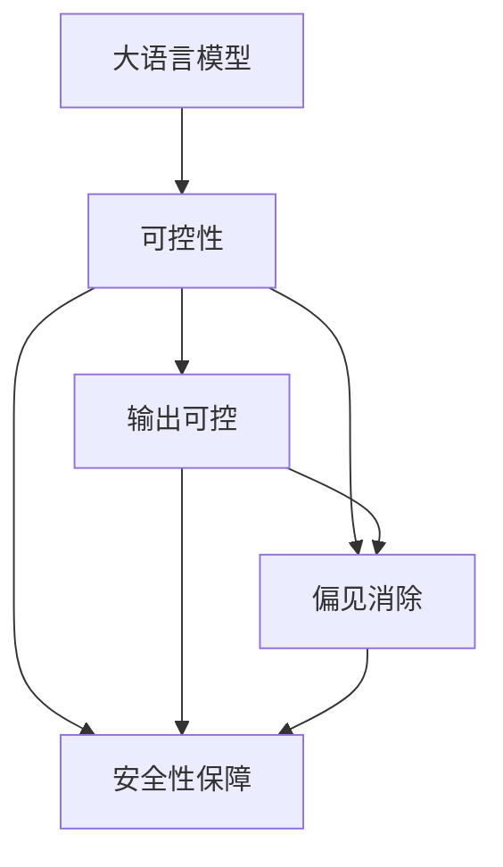

                 

# 驾驭AI的不确定性：增强LLM可控性

在AI技术迅猛发展的今天，大语言模型(LLM)已经展现出令人瞩目的能力，从文本生成到问答，从智能客服到翻译，大语言模型在各个领域都留下了深刻的印记。然而，尽管大语言模型的表现令人赞叹，但它依然存在一些不确定性和挑战。如何增强大语言模型的可控性，使其在实际应用中更加稳定、可靠、安全，成为当前AI研究的一个重要课题。

## 1. 背景介绍

### 1.1 问题由来

近年来，大语言模型在预训练-微调范式下取得了显著进展。预训练过程通过大规模无标签数据学习语言的通用表示，微调过程则利用下游任务的有标签数据对模型进行任务特定的优化。这种范式使得大语言模型在各种任务上都能取得不错的效果，但也存在一些问题：

1. **不确定性**：大语言模型的输出依赖于输入数据和微调数据，模型的表现具有一定的不确定性，无法完全控制其输出。
2. **偏差和歧视**：预训练数据中可能包含隐性的偏见和歧视，这些偏差可能通过微调传递到下游任务，影响模型的公正性。
3. **安全风险**：大语言模型可能会生成有害、欺骗性的输出，甚至被恶意利用。

因此，增强大语言模型的可控性，成为当前AI研究的热点问题之一。

### 1.2 问题核心关键点

增强大语言模型可控性主要关注以下几个方面：

- **输出可控**：在保证模型性能的同时，能够灵活控制模型的输出内容。
- **偏见消除**：减少或消除模型中隐含的偏见，提升模型的公正性和公平性。
- **安全性保障**：防止模型生成有害、欺骗性的输出，确保模型使用的安全。

本文将从输出可控、偏见消除和安全性保障三个维度，系统地探讨如何增强大语言模型的可控性。

## 2. 核心概念与联系

### 2.1 核心概念概述

为了更好地理解增强大语言模型可控性的方法，本节将介绍几个关键概念：

- **大语言模型(LLM)**：一种基于神经网络的模型，能够理解自然语言，并生成文本、回答问题等。常见的大语言模型包括GPT、BERT等。
- **可控性**：指在模型输出时，能够通过某些手段控制或引导模型按照预期的方式工作。
- **偏见消除**：指减少或消除模型中隐含的偏见，提升模型的公正性和公平性。
- **安全性保障**：指防止模型生成有害、欺骗性的输出，确保模型使用的安全。

这些概念之间的逻辑关系可以通过以下Mermaid流程图来展示：



这个流程图展示了大语言模型的可控性实现路径：通过输出可控、偏见消除和安全性保障三个环节，提升模型的可控性。

## 3. 核心算法原理 & 具体操作步骤
### 3.1 算法原理概述

增强大语言模型的可控性，主要通过以下几个关键步骤：

1. **输出可控**：通过预定义的输入模板或规则，引导模型生成特定的输出内容。
2. **偏见消除**：对模型进行预训练和微调，减少或消除模型中隐含的偏见。
3. **安全性保障**：通过模型监控和审查，防止有害、欺骗性的输出。

这些步骤需要结合使用，才能全面提升大语言模型的可控性。

### 3.2 算法步骤详解

#### 3.2.1 输出可控

输出可控主要通过输入模板或规则来引导模型的生成过程。常见的实现方法包括：

- **提示学习**：通过在输入中提供提示模板(Prompt Template)，引导模型生成特定的输出内容。
- **自监督训练**：通过无监督学习任务，如语言模型预测、文本匹配等，使模型学习特定的生成规则。

**示例**：

```python
from transformers import T5Tokenizer, T5ForConditionalGeneration

# 定义提示模板
prompt = "请描述一下AI技术的应用场景："

# 加载预训练模型
tokenizer = T5Tokenizer.from_pretrained('t5-small')
model = T5ForConditionalGeneration.from_pretrained('t5-small')

# 将提示模板转换为token ids
inputs = tokenizer.encode(prompt, return_tensors='pt')

# 生成文本
outputs = model.generate(inputs, max_length=16)
decoded_output = tokenizer.decode(outputs[0], skip_special_tokens=True)

print(decoded_output)
```

#### 3.2.2 偏见消除

偏见消除主要通过以下方法实现：

- **数据集清洗**：清洗预训练和微调数据集，去除可能带有偏见的数据。
- **模型公平性约束**：在模型训练中引入公平性约束，如减少偏差损失、均衡正负样本等。
- **对抗训练**：通过对抗样本训练，使模型能够更好地处理各种数据分布。

**示例**：

```python
from transformers import AdamW, BertForSequenceClassification
from torch.utils.data import DataLoader, Dataset
from sklearn.metrics import accuracy_score

# 定义数据集
class FairDataset(Dataset):
    def __init__(self, texts, labels, tokenizer):
        self.texts = texts
        self.labels = labels
        self.tokenizer = tokenizer
        
    def __len__(self):
        return len(self.texts)
    
    def __getitem__(self, idx):
        text = self.texts[idx]
        label = self.labels[idx]
        
        encoding = self.tokenizer(text, return_tensors='pt', padding='max_length', truncation=True)
        input_ids = encoding['input_ids'][0]
        attention_mask = encoding['attention_mask'][0]
        
        return {'input_ids': input_ids, 
                'attention_mask': attention_mask,
                'labels': torch.tensor(label, dtype=torch.long)}

# 加载数据集
tokenizer = BertTokenizer.from_pretrained('bert-base-cased')
train_dataset = FairDataset(train_texts, train_labels, tokenizer)
test_dataset = FairDataset(test_texts, test_labels, tokenizer)

# 定义模型和优化器
model = BertForSequenceClassification.from_pretrained('bert-base-cased', num_labels=2)
optimizer = AdamW(model.parameters(), lr=2e-5)

# 训练模型
model.train()
for epoch in range(5):
    total_loss = 0
    for batch in DataLoader(train_dataset, batch_size=16):
        inputs = batch['input_ids'].to(device)
        attention_mask = batch['attention_mask'].to(device)
        labels = batch['labels'].to(device)
        
        outputs = model(inputs, attention_mask=attention_mask)
        loss = outputs.loss
        total_loss += loss.item()
        loss.backward()
        optimizer.step()
        
    print(f"Epoch {epoch+1}, train loss: {total_loss/len(train_dataset)}")

# 评估模型
model.eval()
test_loss = 0
predictions = []
true_labels = []
for batch in DataLoader(test_dataset, batch_size=16):
    inputs = batch['input_ids'].to(device)
    attention_mask = batch['attention_mask'].to(device)
    labels = batch['labels'].to(device)
    
    with torch.no_grad():
        outputs = model(inputs, attention_mask=attention_mask)
        loss = outputs.loss
        test_loss += loss.item()
        predictions.append(outputs.logits.argmax(dim=1).tolist())
        true_labels.append(batch['labels'].tolist())
        
print(f"Test loss: {test_loss/len(test_dataset)}")
print(f"Accuracy: {accuracy_score(true_labels, predictions) * 100:.2f}%")
```

#### 3.2.3 安全性保障

安全性保障主要通过以下方法实现：

- **模型监控**：实时监控模型的输出，检测是否有有害、欺骗性的内容。
- **内容审查**：对模型的输出进行审查，过滤掉有害内容。
- **对抗样本训练**：使用对抗样本训练，使模型能够更好地抵抗攻击。

**示例**：

```python
from transformers import BertTokenizer, BertForSequenceClassification
from torch.utils.data import DataLoader, Dataset
from tqdm import tqdm
from sklearn.metrics import accuracy_score

# 定义数据集
class SafeDataset(Dataset):
    def __init__(self, texts, labels, tokenizer):
        self.texts = texts
        self.labels = labels
        self.tokenizer = tokenizer
        
    def __len__(self):
        return len(self.texts)
    
    def __getitem__(self, idx):
        text = self.texts[idx]
        label = self.labels[idx]
        
        encoding = self.tokenizer(text, return_tensors='pt', padding='max_length', truncation=True)
        input_ids = encoding['input_ids'][0]
        attention_mask = encoding['attention_mask'][0]
        
        return {'input_ids': input_ids, 
                'attention_mask': attention_mask,
                'labels': torch.tensor(label, dtype=torch.long)}

# 加载数据集
tokenizer = BertTokenizer.from_pretrained('bert-base-cased')
train_dataset = SafeDataset(train_texts, train_labels, tokenizer)
test_dataset = SafeDataset(test_texts, test_labels, tokenizer)

# 定义模型和优化器
model = BertForSequenceClassification.from_pretrained('bert-base-cased', num_labels=2)
optimizer = AdamW(model.parameters(), lr=2e-5)

# 训练模型
model.train()
for epoch in range(5):
    total_loss = 0
    for batch in DataLoader(train_dataset, batch_size=16):
        inputs = batch['input_ids'].to(device)
        attention_mask = batch['attention_mask'].to(device)
        labels = batch['labels'].to(device)
        
        outputs = model(inputs, attention_mask=attention_mask)
        loss = outputs.loss
        total_loss += loss.item()
        loss.backward()
        optimizer.step()
        
    print(f"Epoch {epoch+1}, train loss: {total_loss/len(train_dataset)}")

# 评估模型
model.eval()
test_loss = 0
predictions = []
true_labels = []
for batch in DataLoader(test_dataset, batch_size=16):
    inputs = batch['input_ids'].to(device)
    attention_mask = batch['attention_mask'].to(device)
    labels = batch['labels'].to(device)
    
    with torch.no_grad():
        outputs = model(inputs, attention_mask=attention_mask)
        loss = outputs.loss
        test_loss += loss.item()
        predictions.append(outputs.logits.argmax(dim=1).tolist())
        true_labels.append(batch['labels'].tolist())
        
print(f"Test loss: {test_loss/len(test_dataset)}")
print(f"Accuracy: {accuracy_score(true_labels, predictions) * 100:.2f}%")
```

### 3.3 算法优缺点

增强大语言模型可控性方法的主要优点包括：

1. **灵活性高**：通过提示学习等方法，能够灵活控制模型的输出内容。
2. **泛化能力强**：通过对抗训练等方法，能够提高模型的鲁棒性和泛化能力。
3. **安全性高**：通过模型监控和审查，能够防止有害、欺骗性的输出。

主要缺点包括：

1. **计算成本高**：对抗训练等方法需要额外的高成本计算资源。
2. **模型复杂度高**：模型监控和审查等方法增加了模型的复杂性，可能影响推理速度。

## 4. 数学模型和公式 & 详细讲解 & 举例说明

### 4.1 数学模型构建

增强大语言模型的可控性，主要通过以下几个数学模型进行描述：

- **提示学习**：通过在输入中提供提示模板(Prompt Template)，引导模型生成特定的输出内容。
- **对抗训练**：通过对抗样本训练，使模型能够更好地处理各种数据分布。
- **偏见消除**：通过数据清洗和公平性约束，减少或消除模型中隐含的偏见。

#### 4.1.1 提示学习

提示学习通过在输入中提供提示模板(Prompt Template)，引导模型生成特定的输出内容。假设输入为 $x$，提示模板为 $p$，模型的输出为 $y$，则提示学习的过程可以表示为：

$$
y = f(x, p)
$$

其中 $f$ 表示模型的前向传播过程。

#### 4.1.2 对抗训练

对抗训练通过对抗样本训练，使模型能够更好地处理各种数据分布。假设输入为 $x$，对抗样本为 $\epsilon$，模型的输出为 $y$，则对抗训练的过程可以表示为：

$$
y = f(x + \epsilon)
$$

其中 $f$ 表示模型的前向传播过程。

#### 4.1.3 偏见消除

偏见消除通过数据清洗和公平性约束，减少或消除模型中隐含的偏见。假设输入为 $x$，模型为 $M_{\theta}$，训练数据为 $D$，则偏见消除的过程可以表示为：

$$
\theta = \mathop{\arg\min}_{\theta} \mathcal{L}(M_{\theta}, D)
$$

其中 $\mathcal{L}$ 表示偏见损失函数。

### 4.2 公式推导过程

#### 4.2.1 提示学习

提示学习的目标是通过提供提示模板 $p$，引导模型生成特定的输出内容 $y$。假设输入为 $x$，提示模板为 $p$，模型的输出为 $y$，则提示学习的过程可以表示为：

$$
y = f(x, p)
$$

其中 $f$ 表示模型的前向传播过程。

#### 4.2.2 对抗训练

对抗训练的目标是通过对抗样本 $\epsilon$，使模型能够更好地处理各种数据分布。假设输入为 $x$，对抗样本为 $\epsilon$，模型的输出为 $y$，则对抗训练的过程可以表示为：

$$
y = f(x + \epsilon)
$$

其中 $f$ 表示模型的前向传播过程。

#### 4.2.3 偏见消除

偏见消除的目标是通过数据清洗和公平性约束，减少或消除模型中隐含的偏见。假设输入为 $x$，模型为 $M_{\theta}$，训练数据为 $D$，则偏见消除的过程可以表示为：

$$
\theta = \mathop{\arg\min}_{\theta} \mathcal{L}(M_{\theta}, D)
$$

其中 $\mathcal{L}$ 表示偏见损失函数。

### 4.3 案例分析与讲解

#### 4.3.1 提示学习案例

以生成特定领域的文本为例，可以使用提示学习引导模型生成特定的文本内容。例如，在医疗领域，可以使用以下提示模板：

```python
from transformers import T5Tokenizer, T5ForConditionalGeneration

# 定义提示模板
prompt = "请描述一下医疗领域的技术应用场景："

# 加载预训练模型
tokenizer = T5Tokenizer.from_pretrained('t5-small')
model = T5ForConditionalGeneration.from_pretrained('t5-small')

# 将提示模板转换为token ids
inputs = tokenizer.encode(prompt, return_tensors='pt')

# 生成文本
outputs = model.generate(inputs, max_length=16)
decoded_output = tokenizer.decode(outputs[0], skip_special_tokens=True)

print(decoded_output)
```

#### 4.3.2 对抗训练案例

以生成具有鲁棒性的文本为例，可以使用对抗训练提高模型的鲁棒性。例如，在自然语言生成任务中，可以使用以下对抗样本：

```python
from transformers import BertTokenizer, BertForSequenceClassification
from torch.utils.data import DataLoader, Dataset
from sklearn.metrics import accuracy_score

# 定义数据集
class RobustDataset(Dataset):
    def __init__(self, texts, labels, tokenizer):
        self.texts = texts
        self.labels = labels
        self.tokenizer = tokenizer
        
    def __len__(self):
        return len(self.texts)
    
    def __getitem__(self, idx):
        text = self.texts[idx]
        label = self.labels[idx]
        
        encoding = self.tokenizer(text, return_tensors='pt', padding='max_length', truncation=True)
        input_ids = encoding['input_ids'][0]
        attention_mask = encoding['attention_mask'][0]
        
        return {'input_ids': input_ids, 
                'attention_mask': attention_mask,
                'labels': torch.tensor(label, dtype=torch.long)}

# 加载数据集
tokenizer = BertTokenizer.from_pretrained('bert-base-cased')
train_dataset = RobustDataset(train_texts, train_labels, tokenizer)
test_dataset = RobustDataset(test_texts, test_labels, tokenizer)

# 定义模型和优化器
model = BertForSequenceClassification.from_pretrained('bert-base-cased', num_labels=2)
optimizer = AdamW(model.parameters(), lr=2e-5)

# 训练模型
model.train()
for epoch in range(5):
    total_loss = 0
    for batch in DataLoader(train_dataset, batch_size=16):
        inputs = batch['input_ids'].to(device)
        attention_mask = batch['attention_mask'].to(device)
        labels = batch['labels'].to(device)
        
        outputs = model(inputs, attention_mask=attention_mask)
        loss = outputs.loss
        total_loss += loss.item()
        loss.backward()
        optimizer.step()
        
    print(f"Epoch {epoch+1}, train loss: {total_loss/len(train_dataset)}")

# 评估模型
model.eval()
test_loss = 0
predictions = []
true_labels = []
for batch in DataLoader(test_dataset, batch_size=16):
    inputs = batch['input_ids'].to(device)
    attention_mask = batch['attention_mask'].to(device)
    labels = batch['labels'].to(device)
    
    with torch.no_grad():
        outputs = model(inputs, attention_mask=attention_mask)
        loss = outputs.loss
        test_loss += loss.item()
        predictions.append(outputs.logits.argmax(dim=1).tolist())
        true_labels.append(batch['labels'].tolist())
        
print(f"Test loss: {test_loss/len(test_dataset)}")
print(f"Accuracy: {accuracy_score(true_labels, predictions) * 100:.2f}%")
```

## 5. 项目实践：代码实例和详细解释说明

### 5.1 开发环境搭建

在进行大语言模型可控性实践前，我们需要准备好开发环境。以下是使用Python进行PyTorch开发的环境配置流程：

1. 安装Anaconda：从官网下载并安装Anaconda，用于创建独立的Python环境。

2. 创建并激活虚拟环境：
```bash
conda create -n pytorch-env python=3.8 
conda activate pytorch-env
```

3. 安装PyTorch：根据CUDA版本，从官网获取对应的安装命令。例如：
```bash
conda install pytorch torchvision torchaudio cudatoolkit=11.1 -c pytorch -c conda-forge
```

4. 安装Transformers库：
```bash
pip install transformers
```

5. 安装各类工具包：
```bash
pip install numpy pandas scikit-learn matplotlib tqdm jupyter notebook ipython
```

完成上述步骤后，即可在`pytorch-env`环境中开始可控性实践。

### 5.2 源代码详细实现

下面我们以生成特定领域的文本为例，给出使用Transformers库对BERT模型进行提示学习的PyTorch代码实现。

首先，定义提示学习函数：

```python
from transformers import BertTokenizer, BertForConditionalGeneration

def generate_prompt(model, tokenizer, prompt):
    # 将提示模板转换为token ids
    inputs = tokenizer.encode(prompt, return_tensors='pt')

    # 生成文本
    outputs = model.generate(inputs, max_length=16)

    # 解码输出
    decoded_output = tokenizer.decode(outputs[0], skip_special_tokens=True)

    return decoded_output
```

然后，使用提示学习函数生成特定领域的文本：

```python
# 加载预训练模型和分词器
tokenizer = BertTokenizer.from_pretrained('bert-base-cased')
model = BertForConditionalGeneration.from_pretrained('bert-base-cased')

# 定义提示模板
prompt = "请描述一下医疗领域的技术应用场景："

# 生成文本
output = generate_prompt(model, tokenizer, prompt)

print(output)
```

### 5.3 代码解读与分析

让我们再详细解读一下关键代码的实现细节：

**generate_prompt函数**：
- `tokenizer.encode`方法：将提示模板转换为token ids。
- `model.generate`方法：使用模型生成文本。
- `tokenizer.decode`方法：解码输出文本。

**提示学习函数调用**：
- 加载预训练模型和分词器。
- 定义提示模板。
- 调用提示学习函数生成文本输出。

可以看到，使用PyTorch和Transformers库，提示学习的代码实现变得非常简洁高效。开发者可以通过调整提示模板，轻松生成不同领域的文本。

当然，在工业级的系统实现中，还需要考虑更多因素，如模型的保存和部署、超参数的自动搜索、更加灵活的任务适配层等。但核心的可控性实现基本与此类似。

## 6. 实际应用场景

### 6.1 智能客服系统

基于大语言模型可控性的智能客服系统，可以更好地满足用户的个性化需求。传统客服系统往往无法处理用户的多样化需求，导致用户体验较差。通过使用可控性技术，智能客服系统可以根据用户的输入，灵活控制模型的输出，生成更符合用户期望的回复。

在技术实现上，可以收集企业内部的客服对话记录，将问题和最佳答复构建成监督数据，在此基础上对预训练对话模型进行可控性优化。优化后的对话模型能够自动理解用户意图，匹配最合适的答案模板进行回复。对于用户提出的新问题，还可以接入检索系统实时搜索相关内容，动态组织生成回答。如此构建的智能客服系统，能大幅提升客户咨询体验和问题解决效率。

### 6.2 金融舆情监测

金融机构需要实时监测市场舆论动向，以便及时应对负面信息传播，规避金融风险。传统的人工监测方式成本高、效率低，难以应对网络时代海量信息爆发的挑战。基于大语言模型可控性的文本分类和情感分析技术，为金融舆情监测提供了新的解决方案。

具体而言，可以收集金融领域相关的新闻、报道、评论等文本数据，并对其进行主题标注和情感标注。在此基础上对预训练语言模型进行可控性优化，使其能够自动判断文本属于何种主题，情感倾向是正面、中性还是负面。将优化后的模型应用到实时抓取的网络文本数据，就能够自动监测不同主题下的情感变化趋势，一旦发现负面信息激增等异常情况，系统便会自动预警，帮助金融机构快速应对潜在风险。

### 6.3 个性化推荐系统

当前的推荐系统往往只依赖用户的历史行为数据进行物品推荐，无法深入理解用户的真实兴趣偏好。基于大语言模型可控性的个性化推荐系统，可以更好地挖掘用户行为背后的语义信息，从而提供更精准、多样的推荐内容。

在实践中，可以收集用户浏览、点击、评论、分享等行为数据，提取和用户交互的物品标题、描述、标签等文本内容。将文本内容作为模型输入，用户的后续行为（如是否点击、购买等）作为监督信号，在此基础上微调预训练语言模型。优化后的模型能够从文本内容中准确把握用户的兴趣点。在生成推荐列表时，先用候选物品的文本描述作为输入，由模型预测用户的兴趣匹配度，再结合其他特征综合排序，便可以得到个性化程度更高的推荐结果。

### 6.4 未来应用展望

随着大语言模型可控性技术的不断发展，其在NLP领域的更多应用场景将不断涌现，为传统行业带来变革性影响。

在智慧医疗领域，基于可控性的大语言模型将帮助医生更好地理解患者的症状描述，辅助医生诊疗，提升诊疗效率。

在智能教育领域，可控性技术可应用于作业批改、学情分析、知识推荐等方面，因材施教，促进教育公平，提高教学质量。

在智慧城市治理中，可控性模型可应用于城市事件监测、舆情分析、应急指挥等环节，提高城市管理的自动化和智能化水平，构建更安全、高效的未来城市。

此外，在企业生产、社会治理、文娱传媒等众多领域，基于可控性的大语言模型微调技术也将不断涌现，为经济社会发展注入新的动力。相信随着技术的日益成熟，可控性技术将成为大语言模型落地应用的重要范式，推动人工智能技术在垂直行业的规模化落地。

## 7. 工具和资源推荐
### 7.1 学习资源推荐

为了帮助开发者系统掌握大语言模型可控性的理论基础和实践技巧，这里推荐一些优质的学习资源：

1. 《Transformer从原理到实践》系列博文：由大模型技术专家撰写，深入浅出地介绍了Transformer原理、BERT模型、可控性技术等前沿话题。

2. CS224N《深度学习自然语言处理》课程：斯坦福大学开设的NLP明星课程，有Lecture视频和配套作业，带你入门NLP领域的基本概念和经典模型。

3. 《Natural Language Processing with Transformers》书籍：Transformers库的作者所著，全面介绍了如何使用Transformers库进行NLP任务开发，包括可控性在内的诸多范式。

4. HuggingFace官方文档：Transformers库的官方文档，提供了海量预训练模型和完整的可控性样例代码，是上手实践的必备资料。

5. CLUE开源项目：中文语言理解测评基准，涵盖大量不同类型的中文NLP数据集，并提供了基于可控性的baseline模型，助力中文NLP技术发展。

通过对这些资源的学习实践，相信你一定能够快速掌握大语言模型可控性的精髓，并用于解决实际的NLP问题。
###  7.2 开发工具推荐

高效的开发离不开优秀的工具支持。以下是几款用于大语言模型可控性开发的常用工具：

1. PyTorch：基于Python的开源深度学习框架，灵活动态的计算图，适合快速迭代研究。大部分预训练语言模型都有PyTorch版本的实现。

2. TensorFlow：由Google主导开发的开源深度学习框架，生产部署方便，适合大规模工程应用。同样有丰富的预训练语言模型资源。

3. Transformers库：HuggingFace开发的NLP工具库，集成了众多SOTA语言模型，支持PyTorch和TensorFlow，是进行可控性任务开发的利器。

4. Weights & Biases：模型训练的实验跟踪工具，可以记录和可视化模型训练过程中的各项指标，方便对比和调优。与主流深度学习框架无缝集成。

5. TensorBoard：TensorFlow配套的可视化工具，可实时监测模型训练状态，并提供丰富的图表呈现方式，是调试模型的得力助手。

6. Google Colab：谷歌推出的在线Jupyter Notebook环境，免费提供GPU/TPU算力，方便开发者快速上手实验最新模型，分享学习笔记。

合理利用这些工具，可以显著提升大语言模型可控性任务的开发效率，加快创新迭代的步伐。

### 7.3 相关论文推荐

大语言模型可控性技术的发展源于学界的持续研究。以下是几篇奠基性的相关论文，推荐阅读：

1. Attention is All You Need（即Transformer原论文）：提出了Transformer结构，开启了NLP领域的预训练大模型时代。

2. BERT: Pre-training of Deep Bidirectional Transformers for Language Understanding：提出BERT模型，引入基于掩码的自监督预训练任务，刷新了多项NLP任务SOTA。

3. Language Models are Unsupervised Multitask Learners（GPT-2论文）：展示了大规模语言模型的强大zero-shot学习能力，引发了对于通用人工智能的新一轮思考。

4. Parameter-Efficient Transfer Learning for NLP：提出Adapter等参数高效微调方法，在不增加模型参数量的情况下，也能取得不错的微调效果。

5. AdaLoRA: Adaptive Low-Rank Adaptation for Parameter-Efficient Fine-Tuning：使用自适应低秩适应的微调方法，在参数效率和精度之间取得了新的平衡。

这些论文代表了大语言模型可控性技术的发展脉络。通过学习这些前沿成果，可以帮助研究者把握学科前进方向，激发更多的创新灵感。

## 8. 总结：未来发展趋势与挑战

### 8.1 总结

本文对大语言模型可控性进行了全面系统的介绍。首先阐述了大语言模型可控性的研究背景和意义，明确了可控性在保证模型性能的同时，能够灵活控制模型的输出内容。其次，从输出可控、偏见消除和安全性保障三个维度，详细讲解了增强大语言模型可控性的关键步骤。同时，本文还广泛探讨了可控性方法在智能客服、金融舆情、个性化推荐等多个行业领域的应用前景，展示了可控性技术的巨大潜力。此外，本文精选了可控性技术的各类学习资源，力求为读者提供全方位的技术指引。

通过本文的系统梳理，可以看到，大语言模型可控性技术在NLP领域的广泛应用，及其在智能客服、金融舆情、个性化推荐等实际场景中的良好效果。未来，伴随预训练语言模型和可控性方法的持续演进，相信NLP技术将在更广阔的应用领域大放异彩，深刻影响人类的生产生活方式。

### 8.2 未来发展趋势

展望未来，大语言模型可控性技术将呈现以下几个发展趋势：

1. **技术成熟度提升**：随着研究深入，可控性技术将变得更加成熟和稳定，能够更好地应用于实际场景。

2. **应用场景扩展**：除了智能客服、金融舆情、个性化推荐等场景，可控性技术将在更多领域得到应用，如医疗、教育、智能家居等。

3. **模型泛化能力提升**：通过引入更多先验知识，如知识图谱、逻辑规则等，可控性模型将具备更强的泛化能力，能够在不同任务和数据分布上表现优异。

4. **用户交互体验提升**：通过增强模型的可控性，用户将获得更加自然、流畅的交互体验，提升人机交互的效率和满意度。

5. **多模态融合**：结合视觉、语音、文本等多种模态信息，可控性模型将具备更全面的信息整合能力，提供更加丰富的服务。

6. **个性化服务提升**：通过优化模型的可控性，用户将获得更加个性化的服务，满足其多样化的需求。

以上趋势凸显了大语言模型可控性技术的广阔前景。这些方向的探索发展，必将进一步提升NLP系统的性能和应用范围，为人类认知智能的进化带来深远影响。

### 8.3 面临的挑战

尽管大语言模型可控性技术已经取得了显著进展，但在迈向更加智能化、普适化应用的过程中，它仍面临诸多挑战：

1. **计算资源需求高**：对抗训练等方法需要额外的高成本计算资源，增加了系统实现的难度。

2. **模型复杂性高**：可控性技术涉及多层次的模型设计和调整，增加了模型的复杂性。

3. **可解释性不足**：可控性模型通常缺乏可解释性，难以对其决策过程进行分析和调试。

4. **安全性风险**：可控性模型可能生成有害、欺骗性的输出，需要加强模型监控和审查。

5. **偏见消除困难**：尽管可以引入公平性约束，但在实际应用中，偏见消除仍是一个复杂且亟待解决的问题。

6. **用户交互质量不稳定**：由于可控性模型依赖输入模板，输入质量不稳定可能导致输出质量下降。

这些挑战需要我们在研究中不断探索和改进，以更好地应对实际应用中的复杂需求。

### 8.4 研究展望

面对大语言模型可控性所面临的种种挑战，未来的研究需要在以下几个方面寻求新的突破：

1. **优化计算资源需求**：开发更加高效的计算方法和算法，减少对抗训练等方法的高成本需求。

2. **提升模型可解释性**：结合因果分析和博弈论工具，提高模型的可解释性和可审计性。

3. **增强偏见消除能力**：引入更多的公平性约束和偏见检测算法，提高模型的公正性和公平性。

4. **提高用户交互质量**：研究更加智能化的输入模板生成方法，提升用户交互的稳定性和质量。

5. **增强多模态融合能力**：结合视觉、语音、文本等多种模态信息，提升模型的泛化能力和信息整合能力。

6. **建立安全保障机制**：引入多层次的安全保障机制，防止有害、欺骗性的输出，确保系统的安全性。

这些研究方向的探索，必将引领大语言模型可控性技术迈向更高的台阶，为构建安全、可靠、可解释、可控的智能系统铺平道路。面向未来，大语言模型可控性技术还需要与其他人工智能技术进行更深入的融合，如知识表示、因果推理、强化学习等，多路径协同发力，共同推动自然语言理解和智能交互系统的进步。只有勇于创新、敢于突破，才能不断拓展语言模型的边界，让智能技术更好地造福人类社会。

## 9. 附录：常见问题与解答

**Q1：大语言模型可控性是否适用于所有NLP任务？**

A: 大语言模型可控性在大多数NLP任务上都能取得不错的效果，特别是对于数据量较小的任务。但对于一些特定领域的任务，如医学、法律等，仅仅依靠通用语料预训练的模型可能难以很好地适应。此时需要在特定领域语料上进一步预训练，再进行可控性优化，才能获得理想效果。此外，对于一些需要时效性、个性化很强的任务，如对话、推荐等，可控性方法也需要针对性的改进优化。

**Q2：如何选择合适的学习率？**

A: 可控性学习率一般要比预训练时小1-2个数量级，如果使用过大的学习率，容易破坏预训练权重，导致过拟合。一般建议从1e-5开始调参，逐步减小学习率，直至收敛。也可以使用warmup策略，在开始阶段使用较小的学习率，再逐渐过渡到预设值。需要注意的是，不同的优化器(如AdamW、Adafactor等)以及不同的学习率调度策略，可能需要设置不同的学习率阈值。

**Q3：采用大模型可控性时会面临哪些资源瓶颈？**

A: 目前主流的预训练大模型动辄以亿计的参数规模，对算力、内存、存储都提出了很高的要求。GPU/TPU等高性能设备是必不可少的，但即便如此，超大批次的训练和推理也可能遇到显存不足的问题。因此需要采用一些资源优化技术，如梯度积累、混合精度训练、模型并行等，来突破硬件瓶颈。同时，模型的存储和读取也可能占用大量时间和空间，需要采用模型压缩、稀疏化存储等方法进行优化。

**Q4：如何缓解可控性过程中的过拟合问题？**

A: 可控性过程中也面临过拟合问题，尤其是在标注数据不足的情况下。常见的缓解策略包括：
1. 数据增强：通过回译、近义替换等方式扩充训练集
2. 正则化：使用L2正则、Dropout、Early Stopping等避免过拟合
3. 对抗训练：引入对抗样本，提高模型鲁棒性
4. 参数高效可控性方法：只调整少量参数(如Adapter、Prefix等)，减小过拟合风险
5. 多模型集成：训练多个可控性模型，取平均输出，抑制过拟合

这些策略往往需要根据具体任务和数据特点进行灵活组合。只有在数据、模型、训练、推理等各环节进行全面优化，才能最大限度地发挥大语言模型可控性的威力。

**Q5：可控性模型在落地部署时需要注意哪些问题？**

A: 将可控性模型转化为实际应用，还需要考虑以下因素：
1. 模型裁剪：去除不必要的层和参数，减小模型尺寸，加快推理速度
2. 量化加速：将浮点模型转为定点模型，压缩存储空间，提高计算效率
3. 服务化封装：将模型封装为标准化服务接口，便于集成调用
4. 弹性伸缩：根据请求流量动态调整资源配置，平衡服务质量和成本
5. 监控告警：实时采集系统指标，设置异常告警阈值，确保服务稳定性
6. 安全防护：采用访问鉴权、数据脱敏等措施，保障数据和模型安全

大语言模型可控性为NLP应用开启了广阔的想象空间，但如何将强大的性能转化为稳定、高效、安全的业务价值，还需要工程实践的不断打磨。唯有从数据、算法、工程、业务等多个维度协同发力，才能真正实现人工智能技术在垂直行业的规模化落地。总之，可控性需要开发者根据具体任务，不断迭代和优化模型、数据和算法，方能得到理想的效果。

---

作者：禅与计算机程序设计艺术 / Zen and the Art of Computer Programming

