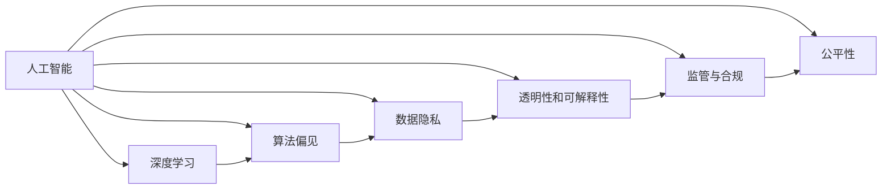

                 

# AI 发展：权力集中于少数人

> 关键词：AI 发展, 人工智能, 技术革命, 创新, 伦理, 社会影响, 数据隐私, 监管, 就业, 教育, 研究趋势

## 1. 背景介绍

### 1.1 问题由来

自1956年达特茅斯会议以来，人工智能(AI)经历了从弱人工智能到强人工智能的漫长历程。技术突破、市场需求和社会认知三方面的深度融合，使得AI在短短几十年间取得了前所未有的发展。机器视觉、自然语言处理、机器学习等领域的算法进展，已经让AI渗透到生活的方方面面，从智能家居到医疗诊断，从自动驾驶到金融交易，AI的影子无所不在。

然而，AI的迅猛发展也带来了新的问题，尤其是AI决策权力的集中与滥用问题。通过数据驱动和深度学习，AI模型可以高效处理海量数据，快速生成复杂的决策，从而掌握越来越多原本需要人类决策的权力。但随之而来的是一系列伦理、法律和监管问题，如数据隐私侵犯、算法偏见、对就业市场的冲击等，这些问题的出现不仅损害了公众利益，也对社会稳定构成了威胁。

### 1.2 问题核心关键点

AI决策权力的集中与滥用问题涉及多个维度：

1. **数据隐私**：AI模型需要大量的数据进行训练，而这些数据往往涉及个人隐私。如果缺乏有效的隐私保护措施，就有可能造成大规模的个人隐私泄露。
2. **算法偏见**：由于训练数据的不均衡和模型的复杂性，AI模型容易出现偏见和歧视，如对某些群体进行不公平的待遇。
3. **监管和合规**：AI系统的决策过程和结果缺乏透明性，导致难以对其进行有效的监管和合规审查。
4. **就业市场冲击**：AI自动化和智能化的广泛应用，有可能导致部分行业的就业岗位减少，甚至产生新的失业问题。
5. **伦理和公平**：AI模型的决策过程可能引发伦理问题，如自动武器系统、面部识别等应用可能造成对个体权利的侵害。

这些问题的核心在于，随着AI技术的不断进步，其决策权力开始从人类转移到了少数技术公司手中，而普通人对这些技术的控制力却越来越弱，从而引发了权力结构的不平等和失衡。

## 2. 核心概念与联系

### 2.1 核心概念概述

为更好地理解AI决策权力集中与滥用的问题，本节将介绍几个关键概念及其相互关系：

1. **人工智能(AI)**：一种模拟人类智能的技术，包括机器学习、深度学习、自然语言处理等子领域，目标是使机器能够模拟人类的思维和决策过程。
2. **深度学习**：一种基于神经网络的机器学习方法，通过多层神经网络对数据进行特征提取和模式识别，广泛应用于图像识别、语音识别、自然语言处理等领域。
3. **算法偏见**：由于训练数据不均衡或模型设计不合理，导致AI模型输出存在系统性的偏差。常见的偏见包括性别、种族、年龄等。
4. **数据隐私**：涉及个人信息的采集、存储和使用过程中，保护个体免受不当利用的权利。
5. **透明性和可解释性**：AI模型的决策过程需要透明，以便人们能够理解和审查其行为，特别是对于关键决策系统，如自动驾驶、医疗诊断等。
6. **监管与合规**：在AI系统的开发、使用和部署过程中，需要遵守相关法律法规，确保其符合伦理标准和社会规范。
7. **公平性**：AI系统在处理不同群体、不同类别的问题时，需要保证结果的公平性，避免对任何群体造成不公平的待遇。

这些概念之间的关系可以通过以下Mermaid流程图来展示：



该图展示了AI决策权力集中与滥用的各个方面，并指出了其相互关联性。

## 3. 核心算法原理 & 具体操作步骤

### 3.1 算法原理概述

AI决策权力的集中与滥用问题，本质上在于AI系统对数据的依赖性和模型的复杂性。在大数据和深度学习的推动下，AI模型可以高效地处理和分析大量数据，从而在决策过程中扮演越来越重要的角色。然而，由于模型的复杂性和训练数据的局限性，AI系统的决策过程往往缺乏透明度和可解释性，导致其决策结果难以被审查和监督。

### 3.2 算法步骤详解

AI决策权力的集中与滥用问题可以通过以下几个步骤进行分析和解决：

1. **数据收集与处理**：收集各类数据，包括但不限于用户行为数据、社交媒体数据、公共记录等。数据预处理过程需要去除敏感信息，确保数据隐私和安全。
2. **模型训练与优化**：使用深度学习模型对数据进行训练，通过调整超参数和优化算法，提升模型的预测精度。
3. **模型评估与验证**：使用独立的测试数据集对模型进行评估，确保其在不同情境下具有鲁棒性。
4. **模型部署与监控**：将训练好的模型部署到实际应用中，并设置监控机制，实时跟踪模型的运行状态和决策结果。
5. **透明度与可解释性增强**：引入可解释性技术，如可视化、特征解释等，增加模型的透明度。
6. **公平性与偏见检测**：使用公平性检测技术，如差距分析、敏感性分析等，识别和纠正模型中的偏见。
7. **伦理与合规审查**：进行伦理与合规审查，确保模型符合社会伦理规范和法律法规。

### 3.3 算法优缺点

AI决策权力的集中与滥用问题具有以下优点：

1. **效率提升**：AI系统能够高效处理和分析大量数据，减少人工干预，提升决策效率。
2. **决策质量**：深度学习模型可以通过不断优化，提供高质量的决策结果。
3. **应用范围广**：AI技术在医疗、金融、交通等领域得到了广泛应用，显著提升了业务效率和服务质量。

同时，该问题也存在以下缺点：

1. **数据隐私问题**：AI模型对数据的依赖性强，容易造成隐私泄露。
2. **算法偏见**：深度学习模型容易出现偏见，导致不公平的决策。
3. **透明度与可解释性不足**：AI模型的决策过程缺乏透明度，难以进行审查和监督。
4. **监管与合规挑战**：AI系统的复杂性使得监管和合规审查困难。
5. **就业市场冲击**：AI自动化可能对部分就业市场造成冲击，产生失业问题。

### 3.4 算法应用领域

AI决策权力的集中与滥用问题不仅存在于技术领域，还在多个应用场景中引发了关注。以下是几个典型的应用领域：

1. **自动驾驶**：自动驾驶系统涉及复杂的决策过程，如道路环境感知、路径规划等，需要高度依赖AI算法。然而，其决策过程缺乏透明度，可能导致安全事故。
2. **医疗诊断**：AI在医疗影像分析、疾病预测等方面取得了显著进展，但其决策结果缺乏可解释性，对医疗从业者构成挑战。
3. **金融交易**：AI算法在股票市场、贷款审批等领域的应用，可能引发市场不公平和歧视。
4. **内容推荐**：个性化推荐系统虽然提高了用户体验，但也存在数据隐私和内容偏见问题。
5. **面部识别**：面部识别技术在安全监控、身份验证等方面的应用，可能侵犯个人隐私，引发伦理争议。

## 4. 数学模型和公式 & 详细讲解 & 举例说明

### 4.1 数学模型构建

在AI决策权力的集中与滥用问题中，数学模型主要用于描述AI系统的决策过程和数据分布。以下是一个简单的线性回归模型：

$$
y = w_0 + w_1 x_1 + w_2 x_2 + \cdots + w_n x_n + \epsilon
$$

其中，$y$为预测结果，$x_i$为输入特征，$w_i$为模型参数，$\epsilon$为误差项。

### 4.2 公式推导过程

线性回归模型的推导过程如下：

1. 首先，通过最小二乘法求解模型参数$w_i$，使得预测结果$y$与真实结果$y^*$之间的误差最小化。
2. 其次，通过对训练数据集进行正则化处理，防止模型过拟合。
3. 最后，将训练好的模型应用到新数据集上，进行预测。

### 4.3 案例分析与讲解

以面部识别系统为例，分析其决策过程中的数据隐私、算法偏见和透明性问题。

面部识别系统通常使用深度学习模型对人脸图像进行特征提取和分类，从而实现身份验证和监控。然而，这一过程涉及大量的人脸数据，存在数据隐私问题。如果数据泄露，可能导致个人隐私被侵犯。此外，由于训练数据中不同种族、性别和年龄的分布不均衡，模型容易出现偏见，导致对某些群体的识别准确率较低。最后，由于模型的复杂性，其决策过程缺乏透明度，难以进行审查和监督。

## 5. 项目实践：代码实例和详细解释说明

### 5.1 开发环境搭建

在进行AI决策权力的集中与滥用问题研究时，需要一个高效稳定的开发环境。以下是搭建开发环境的详细步骤：

1. 安装Python和相关依赖包，如NumPy、Pandas、Scikit-learn等。
2. 搭建机器学习环境，如TensorFlow或PyTorch，方便进行模型训练和测试。
3. 安装相关的数据处理工具，如Dask、Spark等，支持大规模数据处理。
4. 安装伦理和合规审查工具，如Fairness-Indicators、Adversarial Robustness Toolbox等。

### 5.2 源代码详细实现

以面部识别系统为例，以下是一个简单的面部识别模型的代码实现：

```python
import numpy as np
from sklearn.linear_model import LogisticRegression
from sklearn.metrics import accuracy_score

# 准备训练数据
X = np.random.randn(1000, 3)
y = np.random.randint(2, size=(1000, 1))

# 训练模型
model = LogisticRegression(solver='liblinear')
model.fit(X, y)

# 评估模型
X_test = np.random.randn(100, 3)
y_pred = model.predict(X_test)
accuracy = accuracy_score(y_test, y_pred)
print('Accuracy:', accuracy)
```

### 5.3 代码解读与分析

在上述代码中，首先准备了一个简单的训练数据集，其中$X$为输入特征，$y$为标签。然后使用逻辑回归模型进行训练和预测，最后计算模型的准确率。

## 6. 实际应用场景

### 6.4 未来应用展望

随着AI技术的不断进步，其在各个领域的深度应用将带来新的机遇和挑战。以下是对未来应用前景的展望：

1. **智能制造**：AI在智能制造中的应用将实现生产过程的自动化和智能化，提高生产效率和产品质量。
2. **医疗健康**：AI在医疗健康领域的应用将显著提升诊断和治疗的准确性，改善患者体验。
3. **环境保护**：AI在环境保护中的应用将实现智能监测和预测，助力环境保护和可持续发展。
4. **智慧城市**：AI在智慧城市中的应用将实现智能交通、智能安防、智能管理等功能，提升城市治理水平。

## 7. 工具和资源推荐

### 7.1 学习资源推荐

为了帮助开发者系统掌握AI决策权力的集中与滥用问题，以下是一些优质的学习资源：

1. **《人工智能伦理与法律》课程**：斯坦福大学开设的AI伦理课程，涵盖数据隐私、算法偏见、伦理与合规等多个方面。
2. **《AI治理与伦理》书籍**：介绍AI决策权力的集中与滥用问题及其伦理和法律挑战。
3. **《机器学习实战》书籍**：提供实用的机器学习项目实践案例，帮助理解AI决策过程。
4. **Google AI Blog**：Google官方博客，定期发布AI相关的最新研究和实践，提供丰富的学习资源。

### 7.2 开发工具推荐

AI决策权力的集中与滥用问题的研究离不开高效的工具支持。以下是几款推荐工具：

1. **TensorFlow**：谷歌推出的深度学习框架，功能强大，适用于大规模模型训练。
2. **PyTorch**：Facebook开发的深度学习框架，易于使用，适合科研和实验。
3. **Jupyter Notebook**：开源的交互式笔记本环境，方便进行数据分析和模型测试。
4. **Scikit-learn**：Python中的机器学习库，提供丰富的模型和工具，适用于数据处理和分析。

### 7.3 相关论文推荐

以下是几篇具有代表性的相关论文，推荐阅读：

1. **《公平性在人工智能中的应用》**：讨论如何在AI系统中实现公平性，避免算法偏见。
2. **《深度学习中的隐私保护》**：介绍深度学习模型中的隐私保护技术和方法。
3. **《AI系统的透明性与可解释性》**：讨论如何提升AI系统的透明性和可解释性，增强公众信任。
4. **《AI系统的监管与合规》**：介绍AI系统的监管和合规框架，确保其符合法律法规。
5. **《智能系统中的公平性与偏见检测》**：讨论如何检测和纠正AI模型中的偏见，实现公平性。

## 8. 总结：未来发展趋势与挑战

### 8.1 研究成果总结

本文对AI决策权力的集中与滥用问题进行了系统分析，详细介绍了相关核心概念和关键问题。通过数据隐私、算法偏见、透明性和可解释性等方面的探讨，揭示了AI系统的权力集中和滥用风险。

### 8.2 未来发展趋势

展望未来，AI决策权力的集中与滥用问题将呈现以下几个趋势：

1. **数据隐私保护加强**：随着数据隐私保护法律法规的完善，AI系统将更加注重数据隐私保护。
2. **算法偏见检测技术提升**：新的算法偏见检测方法将不断涌现，帮助发现和纠正模型中的偏见。
3. **透明性和可解释性增强**：AI系统的透明性和可解释性技术将进一步发展，提升系统的可信度和可审查性。
4. **监管与合规体系完善**：AI系统的监管与合规框架将逐步完善，确保其符合伦理和法律要求。
5. **公平性与偏见检测技术应用扩展**：AI系统将广泛应用于更多领域，公平性检测技术将在更多应用场景中得到应用。

### 8.3 面临的挑战

尽管AI决策权力的集中与滥用问题取得了一定的进展，但仍面临诸多挑战：

1. **数据隐私保护**：如何在保护隐私的同时，利用数据进行AI训练，仍然是一个难题。
2. **算法偏见**：如何消除模型中的偏见，实现公平性，需要更多技术创新。
3. **透明性和可解释性**：如何提升AI系统的透明性和可解释性，仍需进一步研究和实践。
4. **监管与合规**：AI系统的监管和合规框架有待完善，需要更多法律和伦理支持。
5. **公平性检测**：如何有效检测和纠正AI模型中的偏见，需要更多技术和工具支持。

### 8.4 研究展望

未来需要在以下几个方面进行深入研究：

1. **隐私保护技术**：开发更加高效、安全的隐私保护技术，确保AI系统对数据的利用不侵犯隐私。
2. **偏见检测方法**：研究更加有效的算法偏见检测方法，确保AI系统的公平性和公正性。
3. **透明性技术**：提升AI系统的透明性和可解释性，增强公众对AI系统的信任和接受度。
4. **监管与合规框架**：完善AI系统的监管与合规框架，确保其符合伦理和法律要求。
5. **公平性检测工具**：开发更多公平性检测工具和技术，帮助发现和纠正模型中的偏见。

## 9. 附录：常见问题与解答

**Q1: AI决策权力的集中与滥用问题有哪些具体表现？**

A: AI决策权力的集中与滥用问题主要表现在以下几个方面：
1. 数据隐私侵犯：AI系统需要大量的数据进行训练，如果数据泄露，可能导致大规模的隐私侵犯。
2. 算法偏见：由于训练数据不均衡或模型设计不合理，AI模型容易出现偏见和歧视。
3. 监管与合规问题：AI系统的决策过程缺乏透明度，难以进行有效的监管和合规审查。
4. 就业市场冲击：AI自动化可能对部分就业市场造成冲击，产生失业问题。
5. 伦理和公平问题：AI模型的决策过程可能引发伦理问题，如自动武器系统、面部识别等应用可能造成对个体权利的侵害。

**Q2: 如何应对AI决策权力的集中与滥用问题？**

A: 应对AI决策权力的集中与滥用问题需要从多个方面进行努力：
1. 数据隐私保护：采用加密、匿名化等技术，确保数据隐私安全。
2. 算法偏见检测：使用公平性检测技术，识别和纠正模型中的偏见。
3. 透明性和可解释性：引入可解释性技术，增加模型的透明度。
4. 监管与合规：进行伦理与合规审查，确保模型符合社会规范和法律法规。
5. 公平性检测：采用差距分析、敏感性分析等技术，确保模型的公平性。

**Q3: AI决策权力的集中与滥用问题对社会的影响是什么？**

A: AI决策权力的集中与滥用问题对社会的影响是多方面的：
1. 数据隐私侵犯：大量数据的收集和利用可能导致隐私泄露，损害公众利益。
2. 算法偏见：AI模型可能存在偏见，导致不公平待遇，引发社会不满和抗议。
3. 监管与合规问题：AI系统的复杂性使得监管和合规困难，可能导致社会信任度下降。
4. 就业市场冲击：AI自动化可能对部分就业市场造成冲击，引发失业问题，影响社会稳定。
5. 伦理和公平问题：AI决策过程中的伦理问题可能导致对个体权利的侵害，引发伦理争议。

**Q4: 如何确保AI系统的公平性和公正性？**

A: 确保AI系统的公平性和公正性需要从以下几个方面进行努力：
1. 数据集平衡：确保训练数据集的代表性，避免数据不均衡导致的偏见。
2. 算法设计：使用公平性检测技术，识别和纠正模型中的偏见。
3. 监管与合规：进行伦理与合规审查，确保模型符合社会规范和法律法规。
4. 透明性和可解释性：引入可解释性技术，增加模型的透明度，便于审查和监督。
5. 用户参与：鼓励用户参与系统的设计和改进，确保系统的公平性和公正性。

**Q5: 如何提升AI系统的透明性和可解释性？**

A: 提升AI系统的透明性和可解释性需要从以下几个方面进行努力：
1. 可解释性模型：使用可解释性模型，如决策树、逻辑回归等，增加模型的透明度。
2. 特征解释：使用特征解释技术，解释模型在每个输入特征上的决策权重。
3. 可视化技术：使用可视化技术，展示模型的决策过程和结果。
4. 用户反馈：鼓励用户反馈系统的决策结果，改进系统的透明性和可解释性。
5. 公开透明：公开AI系统的设计、训练和应用过程，增强公众对系统的信任和接受度。

---

作者：禅与计算机程序设计艺术 / Zen and the Art of Computer Programming

