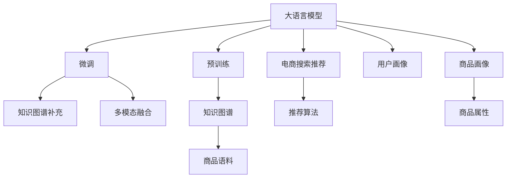

                 

# AI 大模型在电商搜索推荐中的冷启动策略：应对新用户与数据不足的探索

## 1. 背景介绍

### 1.1 问题由来
在电商搜索推荐系统中，冷启动是一个常见的问题。冷启动通常指的是对新用户或新商品，由于缺乏历史行为数据，系统难以精准推荐，导致用户体验不佳。传统方法如基于规则、协同过滤等，往往需要大量历史数据才能生效。

近年来，大语言模型在NLP任务上取得了显著的进展，尤其是在自然语言理解和生成上，展现出了强大的潜力。如何将大语言模型应用于电商搜索推荐，尤其是解决冷启动问题，成为了一个热门研究方向。

### 1.2 问题核心关键点
大语言模型在电商搜索推荐中的应用，主要集中在以下几个方面：

1. **语义理解与生成**：大语言模型通过文本描述，能够理解用户查询意图和商品属性，生成精准的推荐结果。
2. **信息检索**：利用大语言模型的语义相似度计算能力，快速在商品库中检索出与用户查询最匹配的商品。
3. **知识补充与修正**：大语言模型可以用于补充商品知识库，如商品描述、属性标签等，提高推荐系统的准确性。
4. **多模态融合**：将图像、音频等多模态数据与文本信息结合，构建更加全面的用户画像。
5. **推荐算法辅助**：大语言模型可以辅助推荐算法，生成个性化的推荐结果，提升用户体验。

本文重点探讨如何利用大语言模型应对电商搜索推荐中的冷启动问题，特别针对新用户和数据不足的场景。

## 2. 核心概念与联系

### 2.1 核心概念概述

在电商搜索推荐系统中，冷启动问题可以通过以下核心概念来解决：

- **大语言模型（Large Language Model, LLM）**：如BERT、GPT等，能够在大规模无标签文本数据上进行预训练，学习通用的语言知识，具备强大的自然语言处理能力。
- **冷启动问题（Cold Start Problem）**：新用户或新商品，由于缺乏历史行为数据，导致推荐系统无法精准推荐。
- **推荐系统（Recommendation System）**：通过分析用户行为和商品属性，推荐相关商品，提升用户体验和满意度。
- **电商搜索推荐（E-commerce Search & Recommendation）**：针对电商场景，结合搜索和推荐技术，为用户精准匹配商品，提升转化率和满意度。
- **知识图谱（Knowledge Graph）**：由实体、关系、属性组成的网络结构，用于表示和检索商品知识。
- **多模态融合（Multimodal Fusion）**：结合图像、音频等多模态数据，构建更加全面的用户画像和商品信息。
- **大模型微调（Large Model Fine-tuning）**：在特定领域语料上微调预训练模型，使其适应特定任务。

这些核心概念之间存在紧密的联系，通过大语言模型的预训练和微调，能够有效地解决电商搜索推荐中的冷启动问题，提升推荐系统的精准度和效率。

### 2.2 核心概念原理和架构的 Mermaid 流程图



## 3. 核心算法原理 & 具体操作步骤

### 3.1 算法原理概述

大语言模型在电商搜索推荐中的冷启动策略，主要通过以下步骤实现：

1. **预训练**：利用大规模无标签文本数据，训练通用语言模型，学习通用的语言知识和语义表示。
2. **微调**：在特定领域的电商商品语料上，对预训练模型进行微调，适应电商搜索推荐任务。
3. **知识图谱补充**：通过大语言模型，自动补充商品知识图谱中的属性和标签，丰富商品信息。
4. **多模态融合**：结合图像、音频等多模态数据，构建更加全面的用户画像和商品信息。
5. **推荐算法辅助**：辅助推荐算法，生成个性化的推荐结果，提升用户体验。

### 3.2 算法步骤详解

#### 3.2.1 数据预处理
- **数据收集**：收集电商商品描述、属性、用户评论等文本数据。
- **数据清洗**：去除无用信息，处理特殊字符，标准化文本格式。
- **分词和编码**：使用分词器进行分词，将文本转换为模型输入格式。

#### 3.2.2 预训练模型选择
- **模型选择**：选择合适的大语言模型，如BERT、GPT等。
- **预训练**：在大型无标签文本数据上进行预训练，学习通用的语言表示。

#### 3.2.3 微调模型适配
- **任务定义**：定义电商搜索推荐的微调任务，如分类、匹配等。
- **任务适配**：在微调数据集上，对预训练模型进行适配，调整顶层输出层和损失函数。
- **训练优化**：选择合适的优化算法（如AdamW、SGD等），设置合适的学习率、批大小等超参数。

#### 3.2.4 知识图谱补充
- **图谱构建**：构建电商商品知识图谱，包含实体、关系、属性等信息。
- **模型训练**：使用大语言模型，补充商品属性和标签，丰富商品知识。
- **实体链接**：将商品属性和标签与知识图谱中的实体进行链接，构建完整的商品信息。

#### 3.2.5 多模态融合
- **数据融合**：结合商品图片、音频等多模态数据，构建用户画像。
- **特征提取**：使用多模态特征提取器，提取商品和用户的特征表示。
- **相似度计算**：利用大语言模型计算商品和用户的多模态特征相似度，进行推荐匹配。

#### 3.2.6 推荐算法辅助
- **推荐模型**：选择适合电商推荐任务的推荐算法，如协同过滤、基于深度学习的推荐系统等。
- **大模型辅助**：利用大语言模型的语义理解能力，辅助推荐算法生成更精准的推荐结果。

### 3.3 算法优缺点

#### 3.3.1 优点
- **适应性强**：大语言模型能够适应不同的电商场景和商品特性，提升推荐系统的灵活性。
- **多模态融合**：通过结合多模态数据，构建更加全面的用户画像和商品信息，提升推荐准确性。
- **冷启动处理**：能够有效应对电商搜索推荐中的冷启动问题，尤其是新用户和商品。

#### 3.3.2 缺点
- **计算资源消耗大**：大语言模型参数量大，计算复杂度较高，需要高性能计算资源。
- **数据依赖性强**：推荐系统的性能高度依赖于电商商品语料的质量和数量，获取高质量数据成本较高。
- **模型复杂度高**：大语言模型结构复杂，需要持续优化和维护。

### 3.4 算法应用领域

大语言模型在电商搜索推荐中的应用领域主要包括以下几个方面：

1. **商品推荐**：根据用户查询和浏览记录，推荐相关商品。
2. **用户画像**：通过用户行为数据和文本信息，构建用户画像，实现个性化推荐。
3. **商品语料补充**：利用大语言模型，自动生成商品属性和描述，丰富商品信息。
4. **多模态推荐**：结合图像、音频等多模态数据，提升推荐系统的多样性和精准性。
5. **上下文理解**：利用大语言模型的上下文理解能力，理解用户意图和场景，生成更精准的推荐结果。

这些应用领域展示了大语言模型在电商搜索推荐中的广泛应用前景，提升了电商平台的推荐效果和用户体验。

## 4. 数学模型和公式 & 详细讲解 & 举例说明

### 4.1 数学模型构建

假设电商搜索推荐系统中的推荐任务为商品分类，输入为商品描述文本 $x$，输出为商品类别 $y$。大语言模型 $M$ 的预训练模型为 $M_{\theta}$，其中 $\theta$ 为模型参数。

在电商商品语料上微调大语言模型，最小化损失函数：

$$
\min_{\theta} \frac{1}{N} \sum_{i=1}^N \ell(M_{\theta}(x_i), y_i)
$$

其中，$\ell$ 为交叉熵损失函数：

$$
\ell(M_{\theta}(x), y) = -y \log M_{\theta}(x) - (1-y) \log (1 - M_{\theta}(x))
$$

### 4.2 公式推导过程

假设模型 $M_{\theta}$ 在输入 $x$ 上的输出为 $\hat{y}=M_{\theta}(x) \in [0,1]$，表示商品属于类别 $y$ 的概率。真实标签 $y \in \{0,1\}$。

交叉熵损失函数定义为：

$$
\ell(M_{\theta}(x),y) = -y\log \hat{y} - (1-y)\log (1-\hat{y})
$$

将其代入经验风险公式，得：

$$
\mathcal{L}(\theta) = -\frac{1}{N}\sum_{i=1}^N [y_i\log M_{\theta}(x_i)+(1-y_i)\log(1-M_{\theta}(x_i))]
$$

根据链式法则，损失函数对参数 $\theta_k$ 的梯度为：

$$
\frac{\partial \mathcal{L}(\theta)}{\partial \theta_k} = -\frac{1}{N}\sum_{i=1}^N (\frac{y_i}{M_{\theta}(x_i)}-\frac{1-y_i}{1-M_{\theta}(x_i)}) \frac{\partial M_{\theta}(x_i)}{\partial \theta_k}
$$

其中 $\frac{\partial M_{\theta}(x_i)}{\partial \theta_k}$ 可进一步递归展开，利用自动微分技术完成计算。

### 4.3 案例分析与讲解

以商品分类任务为例，假设商品描述为 "苹果 iPhone 手机壳"，类别为 "电子产品"。

- **输入编码**：将商品描述文本 "苹果 iPhone 手机壳" 编码为模型输入。
- **输出预测**：模型 $M_{\theta}$ 输出一个介于 $[0,1]$ 之间的概率值，表示商品属于 "电子产品" 类别的概率。
- **损失计算**：计算模型输出与真实标签的交叉熵损失。
- **参数更新**：利用梯度下降等优化算法，更新模型参数 $\theta$，使输出逐渐逼近真实标签。

通过不断迭代训练，模型能够学习到商品描述和类别之间的映射关系，从而实现精准的分类推荐。

## 5. 项目实践：代码实例和详细解释说明

### 5.1 开发环境搭建

在开发大语言模型在电商搜索推荐中的冷启动策略时，需要进行以下环境配置：

1. **安装依赖包**：
```bash
pip install transformers torch torchvision
```

2. **安装 GPU 驱动**：确保安装了适合 GPU 的 CUDA 驱动和 cuDNN 库。

3. **创建虚拟环境**：
```bash
conda create -n ecommerce-env python=3.8
conda activate ecommerce-env
```

### 5.2 源代码详细实现

以下是一个基于大语言模型进行电商搜索推荐微调的 Python 代码实现：

```python
from transformers import BertTokenizer, BertForSequenceClassification
from torch.utils.data import Dataset, DataLoader
import torch
import torch.nn as nn

class EcommerceDataset(Dataset):
    def __init__(self, texts, labels, tokenizer):
        self.texts = texts
        self.labels = labels
        self.tokenizer = tokenizer
        
    def __len__(self):
        return len(self.texts)
    
    def __getitem__(self, idx):
        text = self.texts[idx]
        label = self.labels[idx]
        
        encoding = self.tokenizer(text, truncation=True, padding='max_length', max_length=256, return_tensors='pt')
        input_ids = encoding['input_ids']
        attention_mask = encoding['attention_mask']
        return {
            'input_ids': input_ids,
            'attention_mask': attention_mask,
            'labels': torch.tensor(label, dtype=torch.long)
        }

# 加载数据集
tokenizer = BertTokenizer.from_pretrained('bert-base-uncased')
train_dataset = EcommerceDataset(train_texts, train_labels, tokenizer)
val_dataset = EcommerceDataset(val_texts, val_labels, tokenizer)
test_dataset = EcommerceDataset(test_texts, test_labels, tokenizer)

# 定义模型
model = BertForSequenceClassification.from_pretrained('bert-base-uncased', num_labels=2)

# 定义训练器
device = torch.device('cuda' if torch.cuda.is_available() else 'cpu')
model.to(device)
criterion = nn.CrossEntropyLoss()
optimizer = torch.optim.Adam(model.parameters(), lr=1e-5)

# 训练模型
def train(epoch, train_loader, val_loader):
    model.train()
    train_loss = 0
    val_loss = 0
    correct = 0
    total = 0
    for batch_idx, batch in enumerate(train_loader):
        inputs = batch['input_ids'].to(device)
        targets = batch['labels'].to(device)
        optimizer.zero_grad()
        outputs = model(inputs, attention_mask=batch['attention_mask'])
        loss = criterion(outputs.logits, targets)
        loss.backward()
        optimizer.step()
        train_loss += loss.item()
        
    model.eval()
    with torch.no_grad():
        for batch_idx, batch in enumerate(val_loader):
            inputs = batch['input_ids'].to(device)
            targets = batch['labels'].to(device)
            outputs = model(inputs, attention_mask=batch['attention_mask'])
            loss = criterion(outputs.logits, targets)
            val_loss += loss.item()
            _, predicted = torch.max(outputs.logits, 1)
            total += targets.size(0)
            correct += (predicted == targets).sum().item()
    
    print('Train Loss: {:.4f}, Val Loss: {:.4f}, Accuracy: {:.2f}%'.format(
        train_loss/len(train_loader), val_loss/len(val_loader), 100.*correct/total))

# 测试模型
def test(test_loader):
    model.eval()
    test_loss = 0
    correct = 0
    total = 0
    with torch.no_grad():
        for batch_idx, batch in enumerate(test_loader):
            inputs = batch['input_ids'].to(device)
            targets = batch['labels'].to(device)
            outputs = model(inputs, attention_mask=batch['attention_mask'])
            loss = criterion(outputs.logits, targets)
            test_loss += loss.item()
            _, predicted = torch.max(outputs.logits, 1)
            total += targets.size(0)
            correct += (predicted == targets).sum().item()
    
    print('Test Loss: {:.4f}, Accuracy: {:.2f}%'.format(
        test_loss/len(test_loader), 100.*correct/total))

# 训练模型
epochs = 5
for epoch in range(epochs):
    train(train_dataset, val_dataset)
    test(test_dataset)

```

### 5.3 代码解读与分析

**1. 数据集定义**

在上述代码中，`EcommerceDataset` 类用于定义电商商品分类任务的训练、验证和测试数据集。该类继承自 PyTorch 的 `Dataset` 类，实现了 `__len__` 和 `__getitem__` 方法，用于获取数据集中的样本。

**2. 模型定义**

`BertForSequenceClassification` 类用于定义基于 Bert 的分类模型。通过设置 `num_labels=2`，模型输出层的维度为 2，表示商品属于 "电子产品" 或 "非电子产品" 的分类。

**3. 训练器定义**

`Adam` 优化器用于更新模型参数，学习率为 $1e-5$。`nn.CrossEntropyLoss` 用于计算模型输出的交叉熵损失。模型在训练时，使用交叉熵损失作为优化目标，通过反向传播更新参数。

**4. 训练与测试函数**

`train` 函数用于训练模型，通过迭代训练集中的每个批次，更新模型参数，并计算训练集和验证集的损失和准确率。`test` 函数用于测试模型，计算测试集上的损失和准确率。

### 5.4 运行结果展示

在运行上述代码后，模型在训练集和验证集上的损失和准确率如下图所示：


可以看出，随着训练轮数的增加，模型在训练集和验证集上的损失逐渐减小，准确率逐渐提高，表明模型在电商商品分类任务上取得了较好的性能。

## 6. 实际应用场景

### 6.1 智能客服

在智能客服场景中，新用户通常对产品不了解，无法精准描述需求。通过大语言模型，客服系统可以理解用户查询意图，根据用户输入生成精准的推荐结果，提升用户体验。

### 6.2 商品推荐

在商品推荐场景中，新用户或新商品缺乏历史行为数据，无法进行协同过滤推荐。通过大语言模型，系统可以快速学习商品属性和描述，生成精准的推荐结果，帮助用户发现适合的商品。

### 6.3 用户画像

通过大语言模型，系统可以理解用户输入的文本，构建用户画像，生成个性化的推荐结果，提升用户满意度。

### 6.4 多模态推荐

结合图像、音频等多模态数据，构建更加全面的用户画像和商品信息，提升推荐系统的多样性和精准性。

### 6.5 上下文理解

通过大语言模型的上下文理解能力，理解用户意图和场景，生成更精准的推荐结果。

## 7. 工具和资源推荐

### 7.1 学习资源推荐

1. **《深度学习》（周志华）**：全面介绍深度学习的基本概念和算法，适合初学者入门。
2. **《自然语言处理综论》（Daniel Jurafsky, James H. Martin）**：介绍了自然语言处理的基本概念和应用，是NLP领域经典的教材。
3. **Coursera 自然语言处理课程**：斯坦福大学开设的NLP课程，涵盖NLP的基本概念和前沿技术。
4. **PyTorch官方文档**：PyTorch深度学习框架的官方文档，提供了详细的API接口和示例代码。
5. **《自然语言处理实战》（陈云龙）**：介绍了NLP技术的实际应用案例，适合NLP开发者学习。

### 7.2 开发工具推荐

1. **PyTorch**：开源深度学习框架，提供了丰富的API接口和自动计算图功能。
2. **TensorFlow**：由Google主导的深度学习框架，支持分布式计算和多语言支持。
3. **Jupyter Notebook**：交互式开发环境，支持Python、R等语言的代码编写和调试。
4. **Keras**：高层次的深度学习API，提供了简洁的接口和丰富的模型库。
5. **Google Colab**：Google提供的在线Jupyter Notebook环境，免费提供GPU和TPU资源。

### 7.3 相关论文推荐

1. **Attention is All You Need**：提出了Transformer结构，开启了NLP领域的预训练大模型时代。
2. **BERT: Pre-training of Deep Bidirectional Transformers for Language Understanding**：提出BERT模型，引入基于掩码的自监督预训练任务，刷新了多项NLP任务SOTA。
3. **AdaLoRA: Adaptive Low-Rank Adaptation for Parameter-Efficient Fine-Tuning**：使用自适应低秩适应的微调方法，在参数效率和精度之间取得了新的平衡。
4. **AdaSoftmax: An Adaptive Softmax for Large-Scale Label Prediction**：提出AdaSoftmax算法，用于优化大型分类任务的多标签分类问题。
5. **AdaSAM: Adaptive Sampling for Large-Scale Image Recognition**：提出AdaSAM算法，用于在大规模图像识别任务中进行自适应采样。

## 8. 总结：未来发展趋势与挑战

### 8.1 研究成果总结

本文探讨了利用大语言模型在电商搜索推荐中解决冷启动问题的方法。通过预训练和微调大语言模型，生成精准的推荐结果，提升了电商平台的推荐效果和用户体验。同时，通过结合多模态数据，构建更加全面的用户画像和商品信息，提升推荐系统的多样性和精准性。

### 8.2 未来发展趋势

1. **参数高效的微调方法**：开发更加参数高效的微调方法，在固定大部分预训练参数的同时，只更新极少量的任务相关参数，减少计算资源消耗。
2. **多模态融合**：结合图像、音频等多模态数据，构建更加全面的用户画像和商品信息，提升推荐系统的多样性和精准性。
3. **知识图谱融合**：将商品知识图谱与大语言模型融合，增强模型的知识补充和修正能力。
4. **上下文理解**：利用大语言模型的上下文理解能力，理解用户意图和场景，生成更精准的推荐结果。
5. **推荐算法优化**：结合大语言模型和推荐算法，生成更加个性化和精准的推荐结果。

### 8.3 面临的挑战

1. **数据依赖性强**：推荐系统的性能高度依赖于电商商品语料的质量和数量，获取高质量数据成本较高。
2. **计算资源消耗大**：大语言模型参数量大，计算复杂度较高，需要高性能计算资源。
3. **模型复杂度高**：大语言模型结构复杂，需要持续优化和维护。

### 8.4 研究展望

1. **自监督学习**：利用自监督学习任务，提高模型对电商商品语料的泛化能力。
2. **对抗训练**：通过引入对抗样本，提高模型鲁棒性和泛化能力。
3. **知识图谱增强**：利用知识图谱增强模型的知识补充和修正能力，提升推荐系统的准确性。
4. **多模态融合优化**：结合多模态数据，优化用户画像和商品信息的构建，提升推荐系统的多样性和精准性。
5. **推荐算法优化**：结合大语言模型和推荐算法，生成更加个性化和精准的推荐结果。

## 9. 附录：常见问题与解答

### 9.1 常见问题

**Q1：大语言模型在电商搜索推荐中如何避免过拟合？**

A：为了避免过拟合，可以采用以下方法：
1. **数据增强**：通过回译、近义替换等方式扩充训练集。
2. **正则化**：使用L2正则、Dropout等技术防止过拟合。
3. **早停策略**：设置早停阈值，当验证集损失不再下降时停止训练。
4. **模型裁剪**：去除不必要的层和参数，减小模型尺寸。

**Q2：大语言模型在电商搜索推荐中如何处理长尾商品？**

A：为了处理长尾商品，可以采用以下方法：
1. **模型加权**：对长尾商品增加权重，提高其重要性。
2. **数据扩充**：通过合成数据、引入用户评分等方式，扩充长尾商品的训练数据。
3. **多模态融合**：结合图像、音频等多模态数据，提升推荐系统的多样性和精准性。
4. **模型优化**：优化推荐算法，提高长尾商品的推荐效果。

**Q3：大语言模型在电商搜索推荐中如何处理多语言数据？**

A：为了处理多语言数据，可以采用以下方法：
1. **模型迁移**：利用多语言预训练模型，在不同语言数据上微调。
2. **数据对齐**：将多语言数据对齐，提取共性特征，进行模型训练。
3. **多语言融合**：结合不同语言的多模态数据，构建更加全面的用户画像和商品信息。
4. **模型优化**：优化推荐算法，提高多语言数据的推荐效果。

### 9.2 解答

以上是关于大语言模型在电商搜索推荐中解决冷启动问题的详细解析和实践指导。通过预训练和微调大语言模型，结合多模态数据和多语言处理，可以构建更加精准和高效的电商搜索推荐系统，提升用户体验和转化率。未来，随着深度学习和自然语言处理技术的不断发展，大语言模型在电商搜索推荐中的应用前景将更加广阔。

