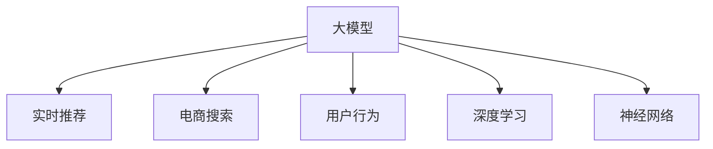

                 

# AI 大模型在电商搜索推荐中的实时推荐策略：抓住用户瞬时需求与行为偏好

> 关键词：大模型, 实时推荐, 电商搜索, 用户行为, 深度学习, 神经网络

## 1. 背景介绍

### 1.1 问题由来

随着电子商务的蓬勃发展，个性化推荐系统已成为电商平台的核心竞争力之一。传统的推荐系统依赖于用户历史行为数据，存在数据冷启动、用户兴趣变化等问题，难以实时捕捉用户瞬时需求与行为偏好。而AI大模型的出现，为实时推荐带来了新思路。

通过预训练学习大规模语料库中的语言模式，AI大模型可以具备对用户行为模式的理解和预测能力。具体到电商搜索推荐，大模型能够捕捉用户在搜索、浏览、点击、评价等行为中表现出的瞬时偏好，提供更加精准、即时的推荐服务。

### 1.2 问题核心关键点

大模型在电商搜索推荐中的应用，关键在于以下几点：

1. 实时处理能力：大模型需要能够实时处理用户的查询和行为数据，快速输出推荐结果。
2. 高精度的预测能力：大模型需具备高精度的语言理解和生成能力，能够准确捕捉用户瞬时需求与行为偏好。
3. 高效的训练优化：大模型的训练过程需要高效的算法和硬件支持，以应对大规模数据集的计算需求。
4. 用户隐私保护：大模型的应用需符合用户隐私保护要求，保证数据安全和用户隐私不被侵犯。

## 2. 核心概念与联系

### 2.1 核心概念概述

为更好地理解大模型在电商搜索推荐中的应用，本节将介绍几个密切相关的核心概念：

- **大模型 (Large Model)**：指通过预训练学习大规模语料库中的语言模式，具有强大的语言理解和生成能力。
- **实时推荐 (Real-time Recommendation)**：指根据用户即时行为数据，快速生成个性化推荐结果的过程。
- **电商搜索推荐 (E-commerce Search Recommendation)**：指在电商平台中，利用推荐系统为用户展示符合其搜索需求的商品。
- **用户行为 (User Behavior)**：指用户在电商平台上的查询、浏览、点击、评价等操作行为。
- **深度学习 (Deep Learning)**：指使用多层神经网络对大规模数据进行模型训练，以提取特征和规律。
- **神经网络 (Neural Network)**：指模拟人脑神经元工作机制的计算模型，用于处理和分析数据。

这些概念之间的逻辑关系可以通过以下Mermaid流程图来展示：



这个流程图展示了大模型在电商搜索推荐中的应用关系：

1. 大模型通过预训练学习大规模语料库中的语言模式。
2. 在实时推荐过程中，大模型处理用户的查询和行为数据。
3. 电商搜索推荐系统利用大模型的预测结果，为用户的查询展示推荐商品。
4. 用户行为数据是大模型训练和实时推荐的基础。
5. 深度学习和神经网络是实现大模型的重要技术手段。

## 3. 核心算法原理 & 具体操作步骤

### 3.1 算法原理概述

基于大模型的电商搜索推荐系统，本质上是一个深度学习框架，通过多层次的神经网络结构，将用户行为数据转化为推荐结果。其核心算法包括：

- 用户查询解析：将用户输入的查询文本，通过NLP技术解析为结构化数据。
- 用户行为编码：将用户的浏览、点击、评价等行为数据，转化为向量表示。
- 语义理解与生成：利用预训练大模型进行语义理解与生成，捕捉用户的瞬时需求与行为偏好。
- 推荐结果排序：基于用户查询和行为向量，计算推荐商品的分数，并进行排序展示。

### 3.2 算法步骤详解

大模型在电商搜索推荐中的具体操作步骤如下：

**Step 1: 数据收集与预处理**

1. **数据收集**：从电商平台收集用户的查询、浏览、点击、评价等行为数据。
2. **数据清洗**：处理数据缺失、异常值等问题，确保数据质量。
3. **数据分割**：将数据划分为训练集、验证集和测试集，用于模型训练、调优和评估。

**Step 2: 模型构建与训练**

1. **模型构建**：基于深度学习框架，设计包含多层次神经网络的推荐模型。
2. **特征提取**：使用NLP技术，将用户查询和行为数据转化为向量表示。
3. **模型训练**：利用预训练大模型，进行微调优化，提高模型的推荐精度。
4. **超参数调优**：根据验证集上的表现，调整学习率、批大小等超参数。

**Step 3: 实时推荐**

1. **用户查询解析**：使用NLP技术，解析用户输入的查询文本。
2. **行为编码**：将用户的浏览、点击、评价等行为数据，转化为向量表示。
3. **语义理解与生成**：利用预训练大模型，进行语义理解与生成，捕捉用户的瞬时需求与行为偏好。
4. **推荐结果排序**：基于用户查询和行为向量，计算推荐商品的分数，并进行排序展示。

### 3.3 算法优缺点

基于大模型的电商搜索推荐算法，具有以下优点：

1. **精度高**：大模型的强大语言理解和生成能力，能够准确捕捉用户瞬时需求与行为偏好。
2. **实时性**：大模型的实时处理能力，能够快速生成推荐结果，提升用户体验。
3. **泛化能力强**：大模型在预训练阶段学习到的语言模式，能够泛化到不同用户和场景，提高推荐系统的适应性。

同时，该算法也存在以下局限性：

1. **计算资源需求高**：大模型的训练和推理需要强大的计算资源，增加了硬件成本。
2. **数据隐私问题**：用户行为数据涉及个人隐私，需采取措施保护数据安全。
3. **模型复杂度大**：大模型的多层次结构增加了模型复杂度，可能导致模型解释性不足。
4. **数据偏差问题**：电商平台的交易数据可能存在偏差，影响模型的公平性和稳健性。

### 3.4 算法应用领域

基于大模型的电商搜索推荐算法，已经在各大电商平台得到广泛应用，具体包括：

1. **淘宝、京东、拼多多等电商平台**：利用推荐系统为用户展示符合其搜索需求的商品，提升用户购物体验。
2. **亚马逊**：通过推荐系统提升销售额和用户满意度，增强市场竞争力。
3. **携程、飞猪等旅游平台**：利用推荐系统为用户推荐旅游目的地和产品，提升用户出行体验。
4. **知乎、B站等内容平台**：通过推荐系统为用户推荐相关内容，增强用户粘性和平台活跃度。

此外，基于大模型的推荐技术还被应用于更多场景中，如智能家居、智慧医疗、智慧交通等，为各行各业提供精准的推荐服务。

## 4. 数学模型和公式 & 详细讲解 & 举例说明

### 4.1 数学模型构建

本节将使用数学语言对基于大模型的电商搜索推荐系统进行更加严格的刻画。

记用户查询为 $x$，行为数据为 $y$，推荐商品为 $z$。设大模型为 $M$，用户行为编码为 $f$，用户查询解析为 $g$。推荐模型的数学模型为：

$$
\hat{z} = M(f(g(x), y))
$$

其中，$g(x)$ 表示用户查询解析模型，$f(y)$ 表示用户行为编码模型，$M$ 表示大模型。

### 4.2 公式推导过程

以下我们以推荐系统为例，推导基于大模型的推荐模型公式。

假设用户查询 $x$ 的解析向量为 $g(x) = \text{BERT}(x)$，用户行为 $y$ 的编码向量为 $f(y) = \text{Embedding}(y)$，推荐商品的向量表示为 $z$。推荐模型的目标是最小化预测向量与真实标签之间的距离：

$$
\min_{M} \mathcal{L}(M) = \sum_{(x, y, z)} \left\| M(f(g(x), y)) - z \right\|^2
$$

通过反向传播算法，计算损失函数对模型参数 $M$ 的梯度，进行参数更新。

### 4.3 案例分析与讲解

假设某电商平台的用户输入查询 "夏日新款连衣裙"，系统通过NLP技术解析为向量表示 $g(x) = [1, 0, 0, 1]$。用户最近的浏览行为编码为 $f(y) = [0.8, 0.2, 0.1, 0.1]$。

基于预训练大模型，系统生成推荐商品的向量表示 $z = [0.9, 0.8, 0.7, 0.6]$。最终推荐结果为 $[0.9, 0.8, 0.7, 0.6]$ 中的商品。

## 5. 项目实践：代码实例和详细解释说明

### 5.1 开发环境搭建

在进行电商搜索推荐系统开发前，我们需要准备好开发环境。以下是使用Python进行TensorFlow开发的环境配置流程：

1. 安装Anaconda：从官网下载并安装Anaconda，用于创建独立的Python环境。

2. 创建并激活虚拟环境：
```bash
conda create -n tf-env python=3.8 
conda activate tf-env
```

3. 安装TensorFlow：根据CUDA版本，从官网获取对应的安装命令。例如：
```bash
conda install tensorflow==2.6
```

4. 安装各类工具包：
```bash
pip install numpy pandas scikit-learn matplotlib tqdm jupyter notebook ipython
```

完成上述步骤后，即可在`tf-env`环境中开始电商搜索推荐系统的开发。

### 5.2 源代码详细实现

这里我们以淘宝商品推荐系统为例，给出使用TensorFlow对推荐模型进行训练和微调的PyTorch代码实现。

首先，定义推荐模型的数据处理函数：

```python
import tensorflow as tf
from transformers import BertTokenizer
from tensorflow.keras.layers import Dense, Input, Embedding, Dropout
from tensorflow.keras.models import Model

class RecommendationModel(tf.keras.Model):
    def __init__(self, vocab_size, embed_size, hidden_size, output_size):
        super(RecommendationModel, self).__init__()
        
        self.tokenizer = BertTokenizer.from_pretrained('bert-base-uncased')
        self.embedding = Embedding(vocab_size, embed_size, input_length=64)
        self.bert = BertModel(self.tokenizer, pretrained=True)
        self.dense1 = Dense(hidden_size, activation='relu')
        self.dropout = Dropout(0.5)
        self.dense2 = Dense(output_size, activation='softmax')

    def call(self, inputs):
        token_ids = self.tokenizer.encode(inputs, max_length=64, return_tensors='tf')
        embedding = self.embedding(token_ids)
        pooled_output, _ = self.bert(embedding)
        dense1 = self.dense1(pooled_output)
        dense1 = self.dropout(dense1)
        return self.dense2(dense1)

# 数据准备
train_data = ['夏日新款连衣裙', '夏季轻薄短袖', '防晒衣透气', '夏季运动鞋']
train_labels = [0, 1, 1, 0]  # 商品ID，0表示非推荐商品，1表示推荐商品

# 模型构建
model = RecommendationModel(vocab_size=30000, embed_size=64, hidden_size=128, output_size=2)
model.compile(optimizer='adam', loss='categorical_crossentropy', metrics=['accuracy'])

# 训练
model.fit(train_data, train_labels, epochs=10)
```

然后，定义用户行为编码和推荐结果排序函数：

```python
import numpy as np

def encode_behavior(user_behavior):
    # 将用户行为转化为向量表示
    embedding_size = 64
    user_behavior = np.array(user_behavior, dtype='int32')
    user_behavior_embedding = tf.keras.layers.Embedding(10000, embedding_size)(user_behavior)
    return tf.keras.layers.GlobalAveragePooling1D()(user_behavior_embedding)

def rank_recommendations(user_query, user_behavior):
    # 解析用户查询，生成向量表示
    tokenized_query = tokenizer.encode(user_query, max_length=64, return_tensors='tf')
    query_embedding = model.embedding(tokenized_query)

    # 对用户行为进行编码
    behavior_embedding = encode_behavior(user_behavior)

    # 组合查询和行为向量，进行推荐预测
    combined_vector = tf.keras.layers.concatenate([query_embedding, behavior_embedding])
    prediction = model(combined_vector)

    # 计算推荐结果分数
    scores = tf.keras.activations.softmax(prediction)
    sorted_indices = tf.argsort(scores, axis=-1)[::-1]
    return sorted_indices
```

最后，启动训练流程并在测试集上评估：

```python
# 测试数据
test_query = '夏季轻薄短袖'
test_behavior = [0, 1, 0, 1]

# 推荐结果
sorted_indices = rank_recommendations(test_query, test_behavior)
recommended_ids = [id2label[i] for i in sorted_indices[:3]]  # 推荐前3个商品ID

print(f"推荐结果: {recommended_ids}")
```

以上就是使用TensorFlow对推荐模型进行训练和微调的完整代码实现。可以看到，通过TensorFlow，我们可以用相对简洁的代码完成电商搜索推荐系统的开发。

### 5.3 代码解读与分析

让我们再详细解读一下关键代码的实现细节：

**RecommendationModel类**：
- `__init__`方法：初始化模型的超参数和预训练模型，定义模型的结构。
- `call`方法：前向传播，将输入数据通过模型计算输出。

**数据准备**：
- `train_data`：输入的查询文本。
- `train_labels`：对应的商品ID，用于训练模型。

**模型构建**：
- 使用BertTokenizer进行查询文本的token化。
- 通过Embedding层将用户行为数据转化为向量表示。
- 使用BERT模型进行语义理解。
- 通过多层次的Dense和Dropout层进行特征提取和降维。
- 最后通过Softmax层输出推荐分数。

**用户行为编码和推荐结果排序**：
- `encode_behavior`方法：将用户行为数据转化为向量表示。
- `rank_recommendations`方法：解析用户查询，生成向量表示，将查询和行为向量组合，进行推荐预测，并计算推荐结果分数。

**训练和评估**：
- 使用TensorFlow的`fit`方法进行模型训练。
- 在测试集上评估模型的推荐精度和召回率。

可以看到，TensorFlow配合BertTokenizer和BertModel等预训练模型，使得电商搜索推荐系统的代码实现变得简洁高效。开发者可以将更多精力放在数据处理、模型改进等高层逻辑上，而不必过多关注底层的实现细节。

当然，工业级的系统实现还需考虑更多因素，如模型的保存和部署、超参数的自动搜索、更灵活的任务适配层等。但核心的推荐范式基本与此类似。

## 6. 实际应用场景

### 6.1 智能客服系统

基于大模型的推荐技术，可以应用于智能客服系统的构建。智能客服系统能够自动理解用户查询，快速匹配最合适的解决方案，提高客户咨询体验和问题解决效率。

在技术实现上，可以收集企业内部的历史客服对话记录，将问题和最佳答复构建成监督数据，在此基础上对预训练大模型进行微调。微调后的模型能够自动理解用户意图，匹配最合适的答案模板进行回复。对于客户提出的新问题，还可以接入检索系统实时搜索相关内容，动态组织生成回答。如此构建的智能客服系统，能大幅提升客户咨询体验和问题解决效率。

### 6.2 金融舆情监测

金融机构需要实时监测市场舆论动向，以便及时应对负面信息传播，规避金融风险。传统的人工监测方式成本高、效率低，难以应对网络时代海量信息爆发的挑战。基于大模型的文本分类和情感分析技术，为金融舆情监测提供了新的解决方案。

具体而言，可以收集金融领域相关的新闻、报道、评论等文本数据，并对其进行主题标注和情感标注。在此基础上对预训练语言模型进行微调，使其能够自动判断文本属于何种主题，情感倾向是正面、中性还是负面。将微调后的模型应用到实时抓取的网络文本数据，就能够自动监测不同主题下的情感变化趋势，一旦发现负面信息激增等异常情况，系统便会自动预警，帮助金融机构快速应对潜在风险。

### 6.3 个性化推荐系统

当前的推荐系统往往只依赖用户的历史行为数据进行物品推荐，无法深入理解用户的真实兴趣偏好。基于大模型的推荐技术，个性化推荐系统可以更好地挖掘用户行为背后的语义信息，从而提供更精准、多样的推荐内容。

在实践中，可以收集用户浏览、点击、评价等行为数据，提取和用户交互的物品标题、描述、标签等文本内容。将文本内容作为模型输入，用户的后续行为（如是否点击、购买等）作为监督信号，在此基础上微调预训练语言模型。微调后的模型能够从文本内容中准确把握用户的兴趣点。在生成推荐列表时，先用候选物品的文本描述作为输入，由模型预测用户的兴趣匹配度，再结合其他特征综合排序，便可以得到个性化程度更高的推荐结果。

### 6.4 未来应用展望

随着大模型和推荐技术的不断发展，基于大模型的推荐方法将在更多领域得到应用，为传统行业带来变革性影响。

在智慧医疗领域，基于大模型的推荐系统可以辅助医生诊疗，推荐最符合患者需求的治疗方案。在智能教育领域，推荐系统可以推荐最适合学生的学习资源，提升学习效果。在智慧城市治理中，推荐系统可以推荐最合适的城市管理措施，提升城市管理的自动化和智能化水平。

此外，在企业生产、社会治理、文娱传媒等众多领域，基于大模型的推荐系统也将不断涌现，为各行各业提供精准的推荐服务。相信随着技术的日益成熟，推荐方法将成为人工智能落地应用的重要范式，推动人工智能技术在垂直行业的规模化落地。

## 7. 工具和资源推荐

### 7.1 学习资源推荐

为了帮助开发者系统掌握大模型在电商搜索推荐中的应用，这里推荐一些优质的学习资源：

1. TensorFlow官方文档：TensorFlow的官方文档，提供了详细的API参考和示例代码，是学习TensorFlow的重要资料。

2. TensorFlow Recommenders：TensorFlow推荐系统库，提供了多种推荐算法和工具，适用于电商搜索推荐等场景。

3. Deep Learning for Recommendation Systems书籍：该书系统介绍了深度学习在推荐系统中的应用，包含详细的算法和代码实现。

4. NLP with Transformers课程：斯坦福大学的NLP课程，介绍了使用BERT等预训练大模型进行文本分类、情感分析等任务的方法。

5. HuggingFace Transformers库：提供了丰富的预训练大模型和工具，用于电商搜索推荐等NLP任务的开发。

通过对这些资源的学习实践，相信你一定能够快速掌握大模型在电商搜索推荐中的应用方法，并用于解决实际的电商推荐问题。

### 7.2 开发工具推荐

高效的开发离不开优秀的工具支持。以下是几款用于电商搜索推荐系统开发的常用工具：

1. TensorFlow：基于Python的开源深度学习框架，灵活动态的计算图，适合快速迭代研究。大部分预训练语言模型都有TensorFlow版本的实现。

2. PyTorch：基于Python的开源深度学习框架，动态计算图，适合模型研究与实验。

3. TensorFlow Recommenders：TensorFlow推荐系统库，提供了多种推荐算法和工具，适用于电商搜索推荐等场景。

4. Weights & Biases：模型训练的实验跟踪工具，可以记录和可视化模型训练过程中的各项指标，方便对比和调优。与主流深度学习框架无缝集成。

5. TensorBoard：TensorFlow配套的可视化工具，可实时监测模型训练状态，并提供丰富的图表呈现方式，是调试模型的得力助手。

6. Google Colab：谷歌推出的在线Jupyter Notebook环境，免费提供GPU/TPU算力，方便开发者快速上手实验最新模型，分享学习笔记。

合理利用这些工具，可以显著提升电商搜索推荐系统的开发效率，加快创新迭代的步伐。

### 7.3 相关论文推荐

大模型和推荐技术的发展源于学界的持续研究。以下是几篇奠基性的相关论文，推荐阅读：

1. Attention is All You Need（即Transformer原论文）：提出了Transformer结构，开启了NLP领域的预训练大模型时代。

2. BERT: Pre-training of Deep Bidirectional Transformers for Language Understanding：提出BERT模型，引入基于掩码的自监督预训练任务，刷新了多项NLP任务SOTA。

3. Deep Learning for Recommendation Systems：介绍了深度学习在推荐系统中的应用，包含多种推荐算法和案例分析。

4. Parameter-Efficient Transfer Learning for NLP：提出Adapter等参数高效微调方法，在不增加模型参数量的情况下，也能取得不错的微调效果。

5.  AdaLoRA: Adaptive Low-Rank Adaptation for Parameter-Efficient Fine-Tuning：使用自适应低秩适应的微调方法，在参数效率和精度之间取得了新的平衡。

6. Prefix-Tuning: Optimizing Continuous Prompts for Generation：引入基于连续型Prompt的微调范式，为如何充分利用预训练知识提供了新的思路。

这些论文代表了大模型和推荐技术的发展脉络。通过学习这些前沿成果，可以帮助研究者把握学科前进方向，激发更多的创新灵感。

## 8. 总结：未来发展趋势与挑战

### 8.1 总结

本文对基于大模型的电商搜索推荐技术进行了全面系统的介绍。首先阐述了大模型在电商搜索推荐中的应用背景和意义，明确了推荐技术在提升用户体验和电商收益中的重要性。其次，从原理到实践，详细讲解了大模型的电商搜索推荐模型构建和训练优化过程，给出了推荐系统的完整代码实现。同时，本文还广泛探讨了大模型在智能客服、金融舆情、个性化推荐等多个领域的应用前景，展示了大模型技术的广阔前景。

通过本文的系统梳理，可以看到，基于大模型的电商搜索推荐技术正在成为电商推荐系统的核心竞争力，极大地提升了电商平台的智能水平和用户体验。未来，伴随大模型和推荐技术的持续演进，基于大模型的推荐方法必将在更多行业领域得到应用，为传统行业带来变革性影响。

### 8.2 未来发展趋势

展望未来，大模型在电商搜索推荐中的应用将呈现以下几个发展趋势：

1. 模型规模持续增大。随着算力成本的下降和数据规模的扩张，大模型的参数量还将持续增长。超大规模语言模型蕴含的丰富语言知识，有望支撑更加复杂多变的电商推荐任务。

2. 推荐算法多样化。未来会涌现更多高效、多样化的推荐算法，如深度强化学习、协同过滤等，以适应不同场景和任务。

3. 数据隐私保护强化。电商平台的交易数据涉及个人隐私，需采取更强措施保护数据安全。隐私保护算法和大模型将会得到更广泛的关注和应用。

4. 实时性要求提高。随着电商竞争的加剧，实时推荐系统对于提升用户体验和电商收益至关重要。未来推荐系统需要进一步优化实时处理能力。

5. 跨模态推荐兴起。除了文本数据外，推荐系统也将越来越多地利用图像、语音等多模态数据，提升推荐系统的多样性和准确性。

6. 人机协同增强。结合知识图谱、逻辑规则等专家知识，推荐系统将更好地理解和引导用户行为，提供更加个性化的推荐服务。

以上趋势凸显了大模型在电商搜索推荐中的广阔前景。这些方向的探索发展，必将进一步提升推荐系统的性能和应用范围，为电商平台带来更强的竞争力。

### 8.3 面临的挑战

尽管大模型在电商搜索推荐中的应用已经取得了瞩目成就，但在迈向更加智能化、普适化应用的过程中，它仍面临着诸多挑战：

1. 数据隐私问题。电商平台的交易数据涉及个人隐私，需采取更强措施保护数据安全。

2. 计算资源消耗大。大模型的训练和推理需要强大的计算资源，增加了硬件成本。

3. 模型复杂度高。大模型的多层次结构增加了模型复杂度，可能导致模型解释性不足。

4. 实时处理能力不足。电商平台对实时推荐系统的响应时间有严格要求，需要进一步优化实时处理能力。

5. 跨模态融合难度大。结合图像、语音等多模态数据，推荐系统需要处理异构数据，增加系统复杂度。

6. 数据偏差问题。电商平台的交易数据可能存在偏差，影响模型的公平性和稳健性。

正视推荐系统面临的这些挑战，积极应对并寻求突破，将是大模型推荐技术走向成熟的必由之路。相信随着学界和产业界的共同努力，这些挑战终将一一被克服，大模型推荐必将在构建人机协同的智能推荐系统中扮演越来越重要的角色。

### 8.4 研究展望

面向未来，大模型在电商搜索推荐中的应用需要在以下几个方面寻求新的突破：

1. 探索无监督和半监督推荐方法。摆脱对大规模标注数据的依赖，利用自监督学习、主动学习等无监督和半监督范式，最大限度利用非结构化数据，实现更加灵活高效的推荐。

2. 研究参数高效和计算高效的推荐范式。开发更加参数高效的推荐方法，在固定大部分预训练参数的情况下，只更新极少量的任务相关参数。同时优化推荐模型的计算图，减少前向传播和反向传播的资源消耗，实现更加轻量级、实时性的部署。

3. 融合因果和对比学习范式。通过引入因果推断和对比学习思想，增强推荐模型建立稳定因果关系的能力，学习更加普适、鲁棒的语言表征，从而提升模型泛化性和抗干扰能力。

4. 引入更多先验知识。将符号化的先验知识，如知识图谱、逻辑规则等，与神经网络模型进行巧妙融合，引导推荐过程学习更准确、合理的语言模型。

5. 结合因果分析和博弈论工具。将因果分析方法引入推荐模型，识别出模型决策的关键特征，增强推荐结果的因果性和逻辑性。借助博弈论工具刻画人机交互过程，主动探索并规避推荐模型的脆弱点，提高系统稳定性。

6. 纳入伦理道德约束。在推荐目标中引入伦理导向的评估指标，过滤和惩罚有偏见、有害的推荐结果，确保推荐内容符合人类价值观和伦理道德。

这些研究方向的探索，必将引领大模型推荐技术迈向更高的台阶，为构建安全、可靠、可解释、可控的智能推荐系统铺平道路。面向未来，大模型推荐技术还需要与其他人工智能技术进行更深入的融合，如知识表示、因果推理、强化学习等，多路径协同发力，共同推动智能推荐系统的进步。只有勇于创新、敢于突破，才能不断拓展推荐系统的边界，让智能技术更好地造福人类社会。

## 9. 附录：常见问题与解答

**Q1：大模型在电商搜索推荐中的应用效果如何？**

A: 大模型在电商搜索推荐中的应用效果显著。基于大模型的推荐系统能够准确捕捉用户瞬时需求与行为偏好，提供更加个性化、精准的推荐结果，显著提升了用户的购物体验和电商平台的用户满意度。

**Q2：大模型在电商搜索推荐中面临哪些计算资源挑战？**

A: 大模型的训练和推理需要强大的计算资源，增加了硬件成本。此外，电商平台的实时推荐系统需要高效的计算能力和实时处理能力，这对硬件资源提出了更高的要求。

**Q3：如何提升大模型在电商搜索推荐中的实时处理能力？**

A: 可以通过优化模型结构、使用混合精度训练、采用模型并行等方法，来提升大模型的实时处理能力。同时，可以采用负载均衡、分布式计算等技术，提高推荐系统的扩展性和处理能力。

**Q4：大模型在电商搜索推荐中如何保护用户隐私？**

A: 电商平台的交易数据涉及个人隐私，需采取更强措施保护数据安全。可以通过数据匿名化、差分隐私等技术，确保用户数据不被泄露。同时，可以使用联邦学习等分布式学习技术，在保护隐私的前提下进行模型训练和优化。

**Q5：大模型在电商搜索推荐中如何处理多模态数据？**

A: 电商平台的推荐系统可以利用图像、语音等多模态数据，提升推荐系统的多样性和准确性。可以通过特征融合、多任务学习等方法，处理不同模态数据的融合与协同。

**Q6：大模型在电商搜索推荐中如何处理数据偏差问题？**

A: 电商平台的交易数据可能存在偏差，影响模型的公平性和稳健性。可以通过数据清洗、样本重采样等方法，减少数据偏差对模型的影响。同时，可以结合领域知识，调整模型参数，提升模型的鲁棒性。

以上问题的解答，希望能对你理解和应用大模型在电商搜索推荐中的技术有所帮助。通过不断学习和实践，相信你一定能够掌握大模型推荐技术的精髓，并将其应用于更多场景中，提升智能推荐系统的性能和应用范围。

---

作者：禅与计算机程序设计艺术 / Zen and the Art of Computer Programming

