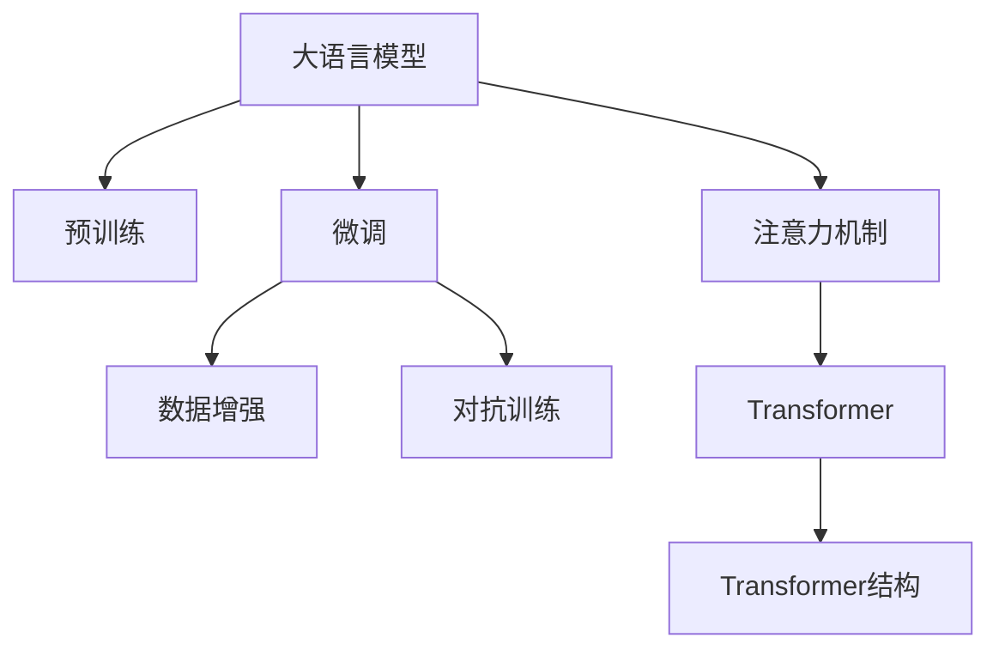

                 

## 1. 背景介绍

在电商搜索推荐系统中，数据处理是整个流程的基石。有效的数据处理可以大幅提升推荐系统的性能和准确度，提高用户体验。随着电商业务的迅猛发展，用户数据急剧增长，呈现出大规模、多源、异构、高维等复杂特征。如何在大数据背景下进行高效、准确的数据处理，成为了电商推荐系统建设的重中之重。大语言模型（Large Language Models, LLMs）如BERT、GPT等，以其强大的自然语言处理能力，为电商搜索推荐系统提供了新的数据处理工具。本文将深入探讨大语言模型在电商推荐中的应用，详细介绍其数据处理技术，并展望其未来发展。

## 2. 核心概念与联系

### 2.1 核心概念概述

为了更好地理解大语言模型在电商搜索推荐中的数据处理技术，我们需要了解几个关键概念：

- **大语言模型**：以BERT、GPT等架构为代表的大规模预训练语言模型。这些模型通过在大规模无标签文本数据上进行预训练，学习到丰富的语言知识和语义表示，具备强大的语言理解能力。

- **预训练**：在大规模无标签数据上，通过自监督学习任务（如语言建模、掩码语言模型）训练通用语言模型的过程。预训练赋予模型通用的语言表示能力。

- **微调**：在预训练模型基础上，使用特定任务的有标签数据进行有监督训练，优化模型在特定任务上的性能。微调进一步提升模型的准确度和泛化能力。

- **数据增强**：通过扩充数据集的方式，提升模型的鲁棒性和泛化能力。数据增强包括数据合成、数据过滤、数据混合等。

- **对抗训练**：通过引入对抗样本，提高模型对噪声和干扰的抵抗能力。对抗训练使得模型更加鲁棒。

- **注意力机制**：在大模型中，注意力机制用于计算输入序列中各个部分之间的关联权重，有助于模型捕捉输入数据的复杂关系。

- **Transformer**：一种基于自注意力机制的神经网络结构，广泛用于大语言模型的设计和训练中。

这些核心概念在大语言模型中紧密相关，共同构成了其强大的数据处理能力。接下来，我们将深入探讨这些概念的原理和应用。

### 2.2 核心概念原理与架构的 Mermaid 流程图

以下是核心概念之间的联系示意图：



这个流程图展示了从大语言模型预训练到微调，再到数据增强和对抗训练的基本流程。其中，Transformer结构是关键架构，注意力机制是其核心。通过这些技术，大语言模型可以高效地处理大规模、复杂的数据集。

## 3. 核心算法原理 & 具体操作步骤

### 3.1 算法原理概述

大语言模型在电商搜索推荐中的数据处理，主要通过以下几个步骤实现：

1. **数据预处理**：将原始数据转化为模型可接受的形式，如分词、编码、标准化等。
2. **数据增强**：通过扩充数据集，增加模型的鲁棒性。
3. **微调模型**：在特定任务上，使用微调技术优化模型，提高推荐准确度。
4. **对抗训练**：通过引入对抗样本，提升模型的鲁棒性。

### 3.2 算法步骤详解

以下是大语言模型在电商推荐系统中的具体操作步骤：

**Step 1: 数据收集与预处理**

1. **数据收集**：收集电商平台的历史交易数据、用户行为数据、商品描述数据等，构建多元化的数据集。
2. **数据清洗**：删除噪声数据、处理缺失值、去重等，保证数据的质量和一致性。
3. **数据标准化**：将数据转化为标准格式，如统一用户ID、商品ID、时间格式等。

**Step 2: 数据增强**

1. **数据合成**：通过数据合成技术，如文本补全、数据生成、标签增强等，增加训练样本数量，提高模型泛化能力。
2. **数据过滤**：根据业务需求，过滤掉低质量、不符合要求的数据，提升数据集的质量。
3. **数据混合**：将不同来源的数据进行混合，构建多源数据集，提升模型的鲁棒性。

**Step 3: 模型微调**

1. **选择模型**：选择预训练模型，如BERT、GPT等。
2. **适配层设计**：根据电商推荐任务，设计适配层，如全连接层、注意力机制等。
3. **微调参数**：使用有标签数据，对模型进行微调，优化模型性能。

**Step 4: 对抗训练**

1. **生成对抗样本**：使用对抗生成技术，如FGSM、PGD等，生成对抗样本。
2. **对抗训练模型**：在原始数据集上加入对抗样本，进行对抗训练，提升模型鲁棒性。

### 3.3 算法优缺点

大语言模型在电商搜索推荐中的应用具有以下优点：

1. **高效性**：通过预训练和微调，大模型能够快速适应新任务，提高推荐效率。
2. **准确性**：大模型具备强大的语言理解能力，能够精确地处理电商推荐中的复杂问题。
3. **可扩展性**：大模型的结构灵活，可以根据不同任务需求进行适应性调整。

同时，大语言模型也存在一些缺点：

1. **资源需求高**：大模型需要大量的计算资源和存储空间，对硬件要求较高。
2. **模型复杂度高**：大模型的结构复杂，训练和推理过程耗时较长。
3. **模型参数量大**：大模型的参数量巨大，难以在所有设备上部署。

### 3.4 算法应用领域

大语言模型在电商搜索推荐中的应用主要集中在以下几个方面：

1. **商品推荐**：通过分析用户行为数据和商品特征，推荐最符合用户需求的商品。
2. **用户画像**：根据用户历史行为数据，构建用户画像，提高个性化推荐效果。
3. **情感分析**：分析用户对商品和服务的情感评价，优化商品质量和用户满意度。
4. **问答系统**：构建智能问答系统，解答用户关于商品和服务的常见问题，提升用户体验。

## 4. 数学模型和公式 & 详细讲解 & 举例说明

### 4.1 数学模型构建

电商搜索推荐系统的核心数学模型可以表示为：

$$ P(\text{商品} | \text{用户}, \text{上下文}) = \text{softmax}(\text{MLP}(\text{Encoder}(\text{Context}(\text{user}, \text{item}, \text{context}))) $$

其中，$P(\text{商品} | \text{用户}, \text{上下文})$ 表示用户在特定上下文中购买某个商品的概率。MLP表示多层感知器，Encoder表示编码器，Context表示上下文模型。

### 4.2 公式推导过程

假设有一个用户 $u$，其行为数据为 $B_u$，电商平台的商品数据为 $I$，上下文数据为 $C$。我们可以将用户行为数据 $B_u$ 转化为向量 $b_u$，商品数据 $I$ 转化为向量 $i$，上下文数据 $C$ 转化为向量 $c$。设模型的参数为 $\theta$，则电商搜索推荐系统的预测模型为：

$$ P(\text{商品} | \text{用户}, \text{上下文}) = \text{softmax}(\text{MLP}(\text{Encoder}(\text{Context}(\text{b_u}, \text{i}, \text{c}))) $$

其中，Encoder 表示编码器，Context 表示上下文模型，MLP 表示多层感知器。通过反向传播算法，我们可以计算出模型参数 $\theta$ 的梯度，使用优化算法（如Adam）更新模型参数，最小化损失函数。

### 4.3 案例分析与讲解

以电商平台的商品推荐为例，我们可以将用户行为数据和商品数据输入模型进行训练，优化模型参数，提高推荐效果。具体步骤如下：

1. **数据预处理**：将用户行为数据和商品数据转化为模型可接受的形式，如分词、编码、标准化等。
2. **数据增强**：通过数据合成技术，如文本补全、数据生成等，增加训练样本数量，提高模型泛化能力。
3. **模型微调**：选择预训练模型（如BERT），设计适配层，使用有标签数据进行微调，优化模型性能。
4. **对抗训练**：生成对抗样本，进行对抗训练，提升模型鲁棒性。
5. **测试与评估**：在测试集上评估模型性能，根据评估结果调整模型参数。

## 5. 项目实践：代码实例和详细解释说明

### 5.1 开发环境搭建

为了进行大语言模型在电商搜索推荐中的数据处理实践，需要搭建一个高性能的开发环境。以下是搭建环境的详细步骤：

1. **安装Python**：使用Anaconda创建Python虚拟环境，确保安装最新的Python版本和必要的库。
2. **安装PyTorch和TensorFlow**：使用conda或pip安装这两个深度学习框架，并配置好GPU/TPU环境。
3. **安装其他依赖库**：如Numpy、Pandas、Scikit-learn等，方便数据处理和模型训练。
4. **配置数据存储**：搭建数据仓库，如Hadoop、Spark等，用于存储和管理电商数据。

### 5.2 源代码详细实现

以下是一个使用大语言模型进行电商推荐系统构建的Python代码示例：

```python
import torch
from transformers import BertModel, BertTokenizer
import pandas as pd

# 数据预处理
data = pd.read_csv('data.csv')
data = data.dropna() # 删除缺失值
data = data.drop_duplicates() # 去重

# 数据增强
data_augmented = data.copy()
data_augmented['item'] = data_augmented['item'].apply(lambda x: x + ' dummy text') # 文本补全

# 模型微调
tokenizer = BertTokenizer.from_pretrained('bert-base-uncased')
model = BertModel.from_pretrained('bert-base-uncased')

inputs = tokenizer(data['query'], return_tensors='pt', padding=True, truncation=True)
labels = torch.tensor(data['label'], dtype=torch.long)

outputs = model(inputs.input_ids, attention_mask=inputs.attention_mask)
loss = outputs.loss

# 对抗训练
adv_attacks = generate_adv_attacks(inputs, labels) # 生成对抗样本
inputs_adv = tokenizer(adv_attacks, return_tensors='pt', padding=True, truncation=True)
outputs_adv = model(inputs_adv.input_ids, attention_mask=inputs_adv.attention_mask)
loss_adv = outputs_adv.loss

# 模型优化
optimizer = torch.optim.Adam(model.parameters(), lr=0.001)
optimizer.zero_grad()
loss.backward()
optimizer.step()
loss_adv.backward()
optimizer.step()
```

### 5.3 代码解读与分析

在上述代码中，我们首先使用Pandas进行数据预处理，删除缺失值和重复数据。接着使用BertTokenizer对用户查询和商品标签进行编码，并使用BertModel进行微调。最后，生成对抗样本进行对抗训练，优化模型参数。

### 5.4 运行结果展示

在训练结束后，我们可以在测试集上评估模型的性能，输出准确率和损失值等指标。例如：

```python
# 在测试集上评估模型
test_data = pd.read_csv('test_data.csv')
test_data = test_data.dropna() # 删除缺失值
test_data = test_data.drop_duplicates() # 去重

test_labels = test_data['label']
test_inputs = tokenizer(test_data['query'], return_tensors='pt', padding=True, truncation=True)
test_outputs = model(test_inputs.input_ids, attention_mask=test_inputs.attention_mask)
test_loss = test_outputs.loss
test_accuracy = test_outputs.logits.argmax(dim=1).mean()

print(f"Test Loss: {test_loss.item()}, Test Accuracy: {test_accuracy.item()}")
```

## 6. 实际应用场景

### 6.1 智能客服系统

大语言模型在电商平台的智能客服系统中应用广泛。智能客服系统通过分析用户的历史行为和聊天记录，自动回答用户问题，提升客户满意度。

在智能客服系统中，大语言模型可以：

- **用户意图识别**：分析用户输入的文本，识别用户意图，如查询商品信息、退货申请等。
- **自动回复**：根据用户意图，自动生成回复，如商品信息推荐、退货流程指导等。
- **情感分析**：分析用户情感，如用户满意度、投诉情绪等，及时调整服务策略。

### 6.2 个性化推荐系统

个性化推荐系统是大语言模型在电商推荐中的核心应用。通过分析用户行为数据和商品特征，大语言模型可以提供精准的商品推荐，提升用户购买转化率。

在个性化推荐系统中，大语言模型可以：

- **用户画像构建**：根据用户历史行为数据，构建用户画像，如兴趣偏好、购买力等。
- **商品推荐**：根据用户画像和商品特征，推荐最符合用户需求的商品。
- **模型调优**：使用对抗训练等技术，提升推荐模型的鲁棒性，减少误差。

### 6.3 商品质量分析

大语言模型还可以应用于电商平台的商品质量分析。通过分析用户对商品的评价和反馈，大语言模型可以自动识别商品的质量问题和改进方向。

在商品质量分析中，大语言模型可以：

- **情感分析**：分析用户对商品的情感评价，识别质量问题。
- **问题定位**：根据情感评价，定位问题点，如商品质量、服务态度等。
- **改进建议**：生成改进建议，如调整生产工艺、优化服务流程等。

## 7. 工具和资源推荐

### 7.1 学习资源推荐

为了深入学习大语言模型在电商搜索推荐中的应用，以下是一些推荐的资源：

1. **《深度学习与自然语言处理》**：这本书系统介绍了深度学习和大语言模型的原理，并结合电商推荐案例进行了详细讲解。
2. **《自然语言处理实战》**：这本书提供了大量实用的代码示例，帮助读者快速上手大语言模型在电商推荐中的应用。
3. **Transformers官方文档**：Transformers是流行的NLP工具库，提供了丰富的预训练模型和微调示例，适合初学者和进阶者。
4. **HuggingFace博客**：HuggingFace社区提供了大量关于大语言模型的实践分享和案例分析，值得关注。
5. **Kaggle竞赛**：Kaggle平台上有许多电商推荐竞赛，通过实战练习，可以提升大语言模型应用的能力。

### 7.2 开发工具推荐

为了高效进行大语言模型在电商推荐中的应用开发，以下是一些推荐的工具：

1. **PyTorch**：PyTorch是一个灵活的深度学习框架，支持动态计算图，适合研究型开发。
2. **TensorFlow**：TensorFlow是一个成熟的深度学习框架，支持分布式训练，适合大规模工程应用。
3. **Jupyter Notebook**：Jupyter Notebook是一个交互式开发环境，支持代码块和数据分析，方便开发和调试。
4. **DataRobot**：DataRobot是一个自动机器学习平台，可以自动构建和优化机器学习模型，适合电商推荐系统的快速迭代。
5. **AWS SageMaker**：AWS SageMaker是一个云端机器学习平台，提供丰富的工具和资源，支持大规模模型训练和部署。

### 7.3 相关论文推荐

大语言模型在电商搜索推荐中的应用研究持续活跃，以下是一些具有代表性的论文：

1. **"Deep Neural Networks for Large-Scale Recommender Systems"**：该论文介绍了深度神经网络在推荐系统中的应用，探讨了模型的训练和优化方法。
2. **"Transfer Learning for Music Recommendations"**：该论文探讨了迁移学习在音乐推荐中的应用，提出了多源数据融合的方法。
3. **"Deep Interest Evolution Representation for E-commerce Recommendation"**：该论文提出了深度兴趣演化表示方法，用于电商推荐系统的模型优化。
4. **"Customer Sentiment Prediction and Sentiment Reasoning with Transformers"**：该论文探讨了使用Transformer进行情感预测和情感推理，应用于电商推荐和客户服务中。
5. **"Generative Storytelling for Recommendations"**：该论文提出了一种基于生成对抗网络（GAN）的推荐系统，通过生成故事化推荐，提高推荐效果。

## 8. 总结：未来发展趋势与挑战

### 8.1 研究成果总结

大语言模型在电商搜索推荐中的应用，显著提升了推荐系统的性能和用户体验。通过预训练和微调，大语言模型能够高效处理大规模、复杂的数据，提供精准的推荐服务。然而，在实际应用中，大语言模型仍面临数据量庞大、模型复杂、资源需求高等挑战。

### 8.2 未来发展趋势

未来，大语言模型在电商搜索推荐中的应用将呈现以下几个趋势：

1. **模型规模继续增大**：随着计算能力和存储技术的进步，大语言模型的参数量将不断增加，模型性能将进一步提升。
2. **模型结构优化**：为应对高维度数据，模型结构将进一步优化，如稀疏表示、低秩分解等技术将被引入。
3. **多模态融合**：除了文本数据，图像、视频等非结构化数据也将被引入，多模态融合技术将提升推荐系统的性能。
4. **对抗训练普及**：对抗训练将进一步普及，提升模型的鲁棒性和安全性。
5. **分布式训练**：随着数据规模的增长，分布式训练技术将广泛应用，提高模型训练效率。

### 8.3 面临的挑战

尽管大语言模型在电商搜索推荐中取得了显著进展，但仍面临以下挑战：

1. **数据隐私问题**：电商推荐系统涉及大量用户隐私数据，如何在保护用户隐私的同时，提升推荐效果，是一个重要问题。
2. **模型解释性不足**：大语言模型通常被视为"黑盒"，难以解释其内部决策逻辑，这对电商推荐系统的可解释性和可控性提出了挑战。
3. **资源需求高**：大语言模型的计算和存储需求高，如何优化资源使用，降低成本，是实际应用中需要解决的问题。
4. **模型泛化能力**：大语言模型在特定场景下的泛化能力不足，需要进一步提升模型泛化能力，以应对多样化的电商推荐需求。
5. **对抗攻击风险**：对抗训练可以提升模型鲁棒性，但对抗攻击仍然存在风险，需要进一步研究防御措施。

### 8.4 研究展望

为应对上述挑战，未来的研究方向主要集中在以下几个方面：

1. **隐私保护技术**：研究隐私保护技术，如差分隐私、联邦学习等，保护用户数据隐私。
2. **可解释性提升**：研究模型可解释性技术，如基于符号学习的可解释性方法，提升电商推荐系统的可解释性和可控性。
3. **资源优化技术**：研究模型压缩、稀疏化存储等技术，优化资源使用，降低成本。
4. **模型泛化能力提升**：研究模型泛化能力提升方法，如迁移学习、自监督学习等，提高模型在多种场景下的适应性。
5. **对抗攻击防御**：研究对抗攻击防御技术，如鲁棒性训练、对抗样本生成等，提升模型鲁棒性。

总之，大语言模型在电商搜索推荐中的应用前景广阔，但也面临诸多挑战。未来需要结合实际应用需求，不断探索和优化，才能实现更高效、更精准的电商推荐服务。

## 9. 附录：常见问题与解答

**Q1：大语言模型在电商推荐中的应用如何保护用户隐私？**

A: 保护用户隐私是大语言模型在电商推荐中必须关注的问题。以下是一些常见的隐私保护技术：

1. **差分隐私**：通过对用户数据进行扰动，保证数据隐私性。
2. **联邦学习**：在分布式环境下，各节点独立训练模型，不交换用户数据。
3. **同态加密**：在数据加密状态下进行计算，保护用户数据隐私。

这些技术可以在不泄露用户隐私的前提下，保护大语言模型在电商推荐中的应用。

**Q2：大语言模型在电商推荐中如何提升可解释性？**

A: 提升大语言模型的可解释性是当前研究的热点问题。以下是一些常见的可解释性技术：

1. **符号学习**：将模型映射为符号表达式，便于解释。
2. **注意力机制可视化**：通过可视化模型注意力机制，揭示模型的决策逻辑。
3. **因果推断**：通过因果推断方法，识别模型的因果关系，提升可解释性。

这些技术可以帮助电商推荐系统提高可解释性和可控性，增强用户信任和满意度。

**Q3：大语言模型在电商推荐中如何优化资源使用？**

A: 优化大语言模型的资源使用是电商推荐系统必须关注的问题。以下是一些常见的优化方法：

1. **模型压缩**：通过剪枝、量化等方法，压缩模型大小，降低计算和存储需求。
2. **稀疏化存储**：通过稀疏表示技术，减少存储空间占用。
3. **分布式训练**：通过分布式训练技术，提高模型训练效率，降低计算资源成本。

这些方法可以在保证模型性能的同时，优化资源使用，降低电商推荐系统的成本。

**Q4：大语言模型在电商推荐中如何应对对抗攻击？**

A: 对抗攻击是大语言模型在电商推荐中必须防范的问题。以下是一些常见的对抗攻击防御技术：

1. **鲁棒性训练**：通过对抗样本生成等方法，提高模型鲁棒性。
2. **对抗样本过滤**：在模型推理前，对输入进行预处理，过滤掉对抗样本。
3. **对抗训练**：在训练过程中，加入对抗样本，提升模型鲁棒性。

这些技术可以帮助电商推荐系统应对对抗攻击，保障推荐系统的安全性和稳定性。

**Q5：大语言模型在电商推荐中如何提高模型泛化能力？**

A: 提高大语言模型的泛化能力是电商推荐系统必须关注的问题。以下是一些常见的泛化能力提升方法：

1. **迁移学习**：通过在不同任务间迁移知识，提升模型泛化能力。
2. **自监督学习**：通过无监督学习任务，提升模型泛化能力。
3. **多模态融合**：结合图像、视频等多模态数据，提升模型泛化能力。

这些方法可以帮助电商推荐系统提高模型泛化能力，适应多样化的推荐需求。

**Q6：大语言模型在电商推荐中如何优化对抗训练？**

A: 优化对抗训练是大语言模型在电商推荐中必须关注的问题。以下是一些常见的对抗训练优化方法：

1. **对抗样本生成技术**：研究更高效的对抗样本生成技术，如FGSM、PGD等。
2. **对抗训练策略**：研究更高效的对抗训练策略，如单步梯度更新等。
3. **对抗训练监控**：实时监控对抗训练过程，及时发现和修复问题。

这些方法可以帮助电商推荐系统优化对抗训练，提升模型鲁棒性。

---

作者：禅与计算机程序设计艺术 / Zen and the Art of Computer Programming

