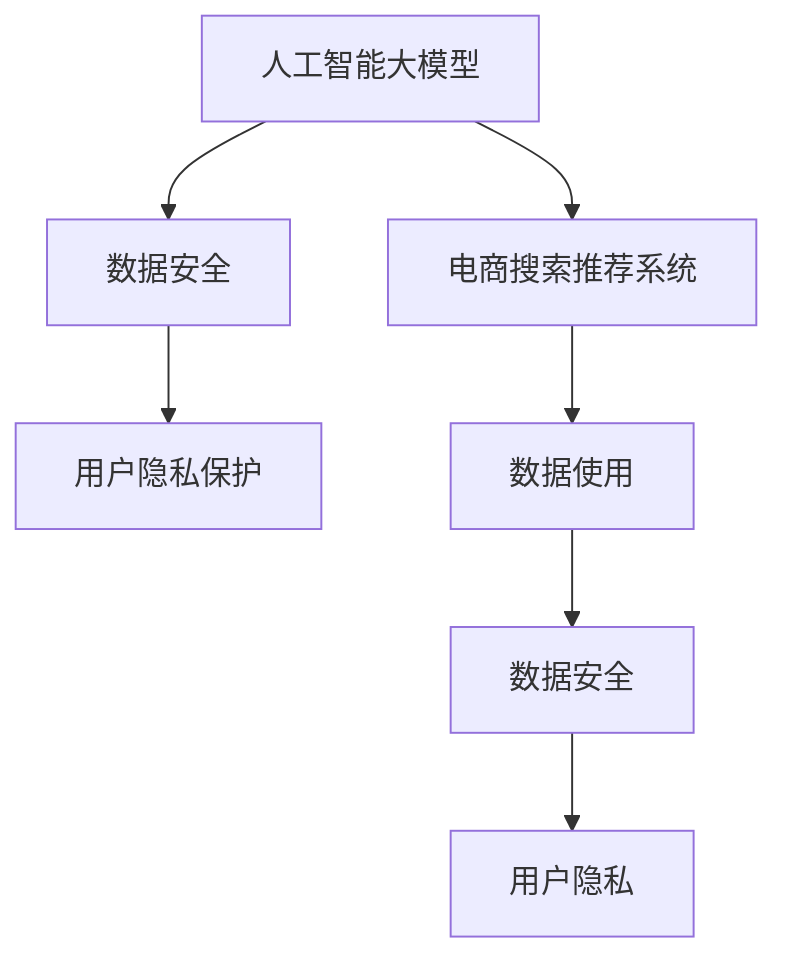

                 

# AI 大模型在电商搜索推荐中的数据安全策略：保障数据安全与用户隐私

> 关键词：
1. 人工智能大模型
2. 数据安全
3. 用户隐私
4. 电商搜索推荐系统
5. 数据脱敏技术
6. 差分隐私
7. 可解释性AI

## 1. 背景介绍

### 1.1 电商行业现状
近年来，随着电子商务平台的快速发展，消费者对购物体验的期望也随之提高。电商平台通过强大的搜索推荐系统，为用户提供个性化的购物建议，极大地提升了用户的购物效率和满意度。但与此同时，搜索推荐系统在数据采集和使用过程中，也面临诸多数据安全和用户隐私问题。这些问题若不加以妥善解决，可能会引发用户的不信任，甚至导致严重的法律风险和经济损失。

### 1.2 数据安全与隐私的重要性
电商搜索推荐系统通常涉及海量用户数据，包括但不限于用户的浏览历史、购买记录、地理位置、搜索关键词等敏感信息。如果这些数据被滥用或泄露，不仅会侵犯用户隐私，还可能导致经济损失、信用受损甚至犯罪行为。因此，保障数据安全和用户隐私，不仅是法律和伦理的要求，也是商业成功的关键。

## 2. 核心概念与联系

### 2.1 核心概念概述
为了更好地理解大模型在电商搜索推荐中应用数据安全策略，我们先梳理一些核心概念：

- **人工智能大模型**：指通过预训练和微调得到的大型神经网络模型，如BERT、GPT-3等。这些模型具有强大的语义理解和生成能力，常用于处理文本、图像等多模态数据。
- **电商搜索推荐系统**：通过分析用户行为数据，预测用户可能感兴趣的商品或服务，并向用户推荐，以提高用户体验和销售额。
- **数据安全**：指保护数据免受未授权访问、修改、泄露等威胁的过程。
- **用户隐私**：指用户个人信息不被未经授权的个人或组织获取、使用、泄露等权利。

这些概念之间的逻辑关系可以通过以下Mermaid流程图来展示：



这个流程图展示了数据安全与用户隐私在大模型驱动的电商搜索推荐系统中的应用：

1. 人工智能大模型是电商搜索推荐系统的基础，用于提取和处理用户行为数据。
2. 数据安全与用户隐私保护是大模型应用的前提，确保数据使用的合规性和安全性。
3. 电商搜索推荐系统需要合理使用数据，遵守数据安全和隐私保护要求。

## 3. 核心算法原理 & 具体操作步骤

### 3.1 算法原理概述

在电商搜索推荐系统中，数据安全和用户隐私保护的核心在于如何处理用户数据，使其既能被模型有效利用，又不会侵犯用户隐私。常见的方法包括数据脱敏、差分隐私和可解释性AI等。

**数据脱敏**：指通过对数据进行伪装、屏蔽、删除等操作，减少敏感信息的泄露。在电商搜索推荐中，常见的数据脱敏方法包括：
- 数据匿名化：将用户ID等标识信息替换为伪随机值。
- 数据扰动：在数据中添加噪声，使其难以直接恢复原始数据。
- 数据屏蔽：对于敏感字段，如身份证号、银行卡号等，直接删除或隐藏。

**差分隐私**：指在数据分析过程中，通过添加噪声等方式，确保即使攻击者获取了数据，也无法反推出个体信息。在电商搜索推荐中，差分隐私可以应用于：
- 聚合统计：在统计分析用户行为数据时，加入噪声，确保数据无法反推出具体用户行为。
- 参数优化：在模型训练过程中，通过差分隐私技术，保护用户隐私的同时，优化模型参数。

**可解释性AI**：指使AI模型的决策过程透明可解释，增强用户信任。在电商搜索推荐中，可解释性AI可以应用于：
- 模型解释：通过可视化、文本解释等方法，向用户展示模型推荐理由。
- 用户反馈：收集用户对推荐结果的反馈，调整模型参数和策略。

### 3.2 算法步骤详解

基于上述核心算法，电商搜索推荐系统在处理用户数据时，可以遵循以下详细步骤：

**Step 1: 数据收集与预处理**
- 通过API接口或日志记录等方式，收集用户浏览、点击、购买等行为数据。
- 对数据进行清洗和格式化，去除噪音和异常值，确保数据质量。

**Step 2: 数据脱敏**
- 对涉及个人身份、支付等敏感信息的字段进行匿名化或屏蔽处理。
- 使用数据扰动技术，如Laplace机制，在数据分析和统计时加入噪声。

**Step 3: 差分隐私保护**
- 在统计分析用户行为数据时，使用差分隐私技术，如Gaussian机制，加入随机噪声。
- 在模型训练过程中，采用差分隐私策略，如教师-学生机制，保护模型训练数据。

**Step 4: 数据使用与监控**
- 将脱敏和差分隐私保护后的数据，输入到电商搜索推荐模型进行训练和预测。
- 定期监控系统运行状态，及时发现并处理异常情况，确保数据安全和隐私保护措施的有效性。

**Step 5: 用户反馈与模型优化**
- 收集用户对推荐结果的反馈，根据反馈调整模型参数和策略。
- 定期更新模型，根据新的数据和用户需求，进行微调优化。

### 3.3 算法优缺点

**数据脱敏的优点**：
- 简单易实现：大多数情况下，数据脱敏操作可以在数据处理阶段完成，无需修改模型和算法。
- 效果显著：通过对敏感信息进行掩盖，可以显著降低数据泄露的风险。

**数据脱敏的缺点**：
- 数据精度下降：过度的数据脱敏可能破坏数据的精度和完整性，影响模型的性能。
- 误导性：伪造的匿名数据可能被攻击者利用，误导分析结果。

**差分隐私的优点**：
- 高安全性：差分隐私通过引入噪声，确保攻击者无法反推出个体数据。
- 隐私保护与性能并存：差分隐私技术可以在保证隐私保护的同时，不显著影响数据分析和模型训练的效果。

**差分隐私的缺点**：
- 计算复杂度高：差分隐私的计算过程复杂，增加了系统实现的难度和计算成本。
- 噪声累积：多次应用差分隐私技术，可能引入噪声累积，影响结果的可靠性。

**可解释性AI的优点**：
- 增强信任：使模型决策透明可解释，增强用户对系统的信任。
- 及时反馈：通过用户反馈，可以及时调整模型策略，提升用户体验。

**可解释性AI的缺点**：
- 模型复杂性增加：引入解释机制，可能增加模型的复杂性和计算量。
- 安全风险：解释机制可能被攻击者利用，暴露敏感信息。

### 3.4 算法应用领域

大模型在电商搜索推荐中的应用，主要涉及以下领域：

- **推荐系统设计**：使用大模型提取用户行为特征，通过推荐算法生成个性化推荐列表。
- **搜索排序优化**：使用大模型优化搜索结果排序，提升用户满意度。
- **广告投放优化**：使用大模型预测用户广告响应，优化广告投放策略。
- **个性化服务**：使用大模型提供个性化商品、优惠等推荐服务。

这些领域都需要大量的用户数据作为输入，因此在数据安全和隐私保护方面，有极高的要求。

## 4. 数学模型和公式 & 详细讲解

### 4.1 数学模型构建

为了更好地理解和分析电商搜索推荐系统中数据安全与隐私保护的方法，我们需要使用数学模型进行形式化描述。假设用户数据集为 $D=\{x_1, x_2, ..., x_n\}$，其中 $x_i$ 为第 $i$ 个用户的数据向量。模型输入为 $X=\{X_1, X_2, ..., X_m\}$，其中 $X_i$ 为第 $i$ 个数据项的特征向量。

目标是在保证数据安全与用户隐私的前提下，优化推荐模型 $M$，使其能最大化用户满意度。

### 4.2 公式推导过程

假设推荐模型为 $M:\mathbb{R}^n \rightarrow \mathbb{R}^m$，其中 $n$ 为用户数据维数，$m$ 为推荐结果维数。推荐模型训练目标为：

$$
\min_{M} \sum_{i=1}^n \ell(M(x_i), y_i)
$$

其中 $\ell$ 为推荐模型损失函数，$y_i$ 为第 $i$ 个用户的真实推荐结果。

在进行数据脱敏时，可以采用Laplace机制，对用户数据 $x_i$ 加入噪声 $\epsilon_i$，得到脱敏数据 $x'_i$。则脱敏后的损失函数变为：

$$
\min_{M} \sum_{i=1}^n \ell(M(x'_i), y_i)
$$

其中 $\epsilon_i \sim \mathcal{L}(1/\delta)$，$\mathcal{L}$ 为Laplace分布。

在进行差分隐私保护时，可以使用Gaussian机制，对推荐模型参数 $\theta$ 加入噪声 $\eta$，得到差分隐私模型 $\theta'$。则差分隐私保护的损失函数变为：

$$
\min_{\theta'} \sum_{i=1}^n \ell(M(x'_i), y_i)
$$

其中 $\eta \sim \mathcal{N}(0,\sigma^2)$，$\sigma$ 为噪声标准差。

在进行可解释性AI时，可以引入特征重要性算法，如SHAP（Shapley Additive Explanations），计算特征对推荐结果的影响。假设推荐结果为 $R$，特征向量为 $X$，则特征重要性 $I$ 为：

$$
I = \frac{\partial R}{\partial X}
$$

通过对特征重要性的计算，可以生成解释文本，向用户展示推荐理由。

### 4.3 案例分析与讲解

下面以推荐系统为例，具体分析如何应用上述算法原理。

假设电商平台的推荐系统采用基于大模型的推荐算法，数据集为 $D=\{x_1, x_2, ..., x_n\}$，其中 $x_i$ 包含用户浏览历史、购买记录等特征。推荐模型为 $M$，目标是最大化用户满意度，即最大化 $y_i$ 的预测准确度。

在进行数据脱敏时，可以采用以下步骤：
1. 对用户ID等敏感信息进行匿名化，替换为伪随机值。
2. 在统计分析用户行为数据时，加入Laplace噪声，确保攻击者无法反推出具体用户行为。

在进行差分隐私保护时，可以采用以下步骤：
1. 在推荐模型训练过程中，加入Gaussian噪声，确保模型参数在隐私保护的前提下，仍能得到有效优化。
2. 在推荐模型预测时，再次加入Gaussian噪声，确保预测结果的隐私性。

在进行可解释性AI时，可以采用以下步骤：
1. 使用SHAP算法计算推荐结果中各个特征的贡献度。
2. 根据特征重要性生成解释文本，向用户展示推荐理由。

## 5. 项目实践：代码实例和详细解释说明

### 5.1 开发环境搭建

在进行电商搜索推荐系统的大模型应用时，我们需要准备好开发环境。以下是使用Python进行PyTorch开发的环境配置流程：

1. 安装Anaconda：从官网下载并安装Anaconda，用于创建独立的Python环境。

2. 创建并激活虚拟环境：
```bash
conda create -n pytorch-env python=3.8 
conda activate pytorch-env
```

3. 安装PyTorch：根据CUDA版本，从官网获取对应的安装命令。例如：
```bash
conda install pytorch torchvision torchaudio cudatoolkit=11.1 -c pytorch -c conda-forge
```

4. 安装Transformers库：
```bash
pip install transformers
```

5. 安装各类工具包：
```bash
pip install numpy pandas scikit-learn matplotlib tqdm jupyter notebook ipython
```

完成上述步骤后，即可在`pytorch-env`环境中开始微调实践。

### 5.2 源代码详细实现

下面我们以电商搜索推荐系统的推荐模型为例，给出使用Transformers库对BERT模型进行微调的PyTorch代码实现。

首先，定义推荐系统任务的数据处理函数：

```python
from transformers import BertTokenizer
from torch.utils.data import Dataset
import torch

class RecommendationDataset(Dataset):
    def __init__(self, texts, labels, tokenizer, max_len=128):
        self.texts = texts
        self.labels = labels
        self.tokenizer = tokenizer
        self.max_len = max_len
        
    def __len__(self):
        return len(self.texts)
    
    def __getitem__(self, item):
        text = self.texts[item]
        label = self.labels[item]
        
        encoding = self.tokenizer(text, return_tensors='pt', max_length=self.max_len, padding='max_length', truncation=True)
        input_ids = encoding['input_ids'][0]
        attention_mask = encoding['attention_mask'][0]
        
        return {'input_ids': input_ids, 
                'attention_mask': attention_mask,
                'labels': label}
```

然后，定义模型和优化器：

```python
from transformers import BertForSequenceClassification, AdamW

model = BertForSequenceClassification.from_pretrained('bert-base-cased', num_labels=2)

optimizer = AdamW(model.parameters(), lr=2e-5)
```

接着，定义训练和评估函数：

```python
from torch.utils.data import DataLoader
from tqdm import tqdm
from sklearn.metrics import classification_report

device = torch.device('cuda') if torch.cuda.is_available() else torch.device('cpu')
model.to(device)

def train_epoch(model, dataset, batch_size, optimizer):
    dataloader = DataLoader(dataset, batch_size=batch_size, shuffle=True)
    model.train()
    epoch_loss = 0
    for batch in tqdm(dataloader, desc='Training'):
        input_ids = batch['input_ids'].to(device)
        attention_mask = batch['attention_mask'].to(device)
        labels = batch['labels'].to(device)
        model.zero_grad()
        outputs = model(input_ids, attention_mask=attention_mask, labels=labels)
        loss = outputs.loss
        epoch_loss += loss.item()
        loss.backward()
        optimizer.step()
    return epoch_loss / len(dataloader)

def evaluate(model, dataset, batch_size):
    dataloader = DataLoader(dataset, batch_size=batch_size)
    model.eval()
    preds, labels = [], []
    with torch.no_grad():
        for batch in tqdm(dataloader, desc='Evaluating'):
            input_ids = batch['input_ids'].to(device)
            attention_mask = batch['attention_mask'].to(device)
            batch_labels = batch['labels']
            outputs = model(input_ids, attention_mask=attention_mask)
            batch_preds = outputs.logits.argmax(dim=2).to('cpu').tolist()
            batch_labels = batch_labels.to('cpu').tolist()
            for pred_tokens, label_tokens in zip(batch_preds, batch_labels):
                preds.append(pred_tokens[:len(label_tokens)])
                labels.append(label_tokens)
                
    print(classification_report(labels, preds))
```

最后，启动训练流程并在测试集上评估：

```python
epochs = 5
batch_size = 16

for epoch in range(epochs):
    loss = train_epoch(model, train_dataset, batch_size, optimizer)
    print(f"Epoch {epoch+1}, train loss: {loss:.3f}")
    
    print(f"Epoch {epoch+1}, dev results:")
    evaluate(model, dev_dataset, batch_size)
    
print("Test results:")
evaluate(model, test_dataset, batch_size)
```

以上就是使用PyTorch对BERT进行电商搜索推荐任务微调的完整代码实现。可以看到，得益于Transformers库的强大封装，我们可以用相对简洁的代码完成BERT模型的加载和微调。

### 5.3 代码解读与分析

让我们再详细解读一下关键代码的实现细节：

**RecommendationDataset类**：
- `__init__`方法：初始化文本、标签、分词器等关键组件。
- `__len__`方法：返回数据集的样本数量。
- `__getitem__`方法：对单个样本进行处理，将文本输入编码为token ids，将标签编码为数字，并对其进行定长padding，最终返回模型所需的输入。

**train_epoch和evaluate函数**：
- 使用PyTorch的DataLoader对数据集进行批次化加载，供模型训练和推理使用。
- 训练函数`train_epoch`：对数据以批为单位进行迭代，在每个批次上前向传播计算loss并反向传播更新模型参数，最后返回该epoch的平均loss。
- 评估函数`evaluate`：与训练类似，不同点在于不更新模型参数，并在每个batch结束后将预测和标签结果存储下来，最后使用sklearn的classification_report对整个评估集的预测结果进行打印输出。

**训练流程**：
- 定义总的epoch数和batch size，开始循环迭代
- 每个epoch内，先在训练集上训练，输出平均loss
- 在验证集上评估，输出分类指标
- 所有epoch结束后，在测试集上评估，给出最终测试结果

可以看到，PyTorch配合Transformers库使得BERT微调的代码实现变得简洁高效。开发者可以将更多精力放在数据处理、模型改进等高层逻辑上，而不必过多关注底层的实现细节。

当然，工业级的系统实现还需考虑更多因素，如模型的保存和部署、超参数的自动搜索、更灵活的任务适配层等。但核心的微调范式基本与此类似。

## 6. 实际应用场景

### 6.1 智能客服系统

基于大模型微调的电商搜索推荐系统，可以广泛应用于智能客服系统的构建。智能客服系统通过分析用户对话记录，自动回复用户咨询，提升客户满意度。

在技术实现上，可以收集用户的历史对话记录，将问题-回答对作为监督数据，训练模型学习匹配回答。微调后的模型能够自动理解用户意图，匹配最合适的回答，进一步提升客户体验。

### 6.2 金融舆情监测

金融行业需要实时监测市场舆论动向，以便及时应对负面信息传播，规避金融风险。金融舆情监测系统通常需要收集大量金融领域相关的新闻、报道、评论等文本数据，进行情感分析等处理。

使用微调后的推荐模型，可以从用户行为数据中提取情感倾向，预测市场动向，提供及时预警，帮助金融机构快速应对潜在风险。

### 6.3 个性化推荐系统

当前的推荐系统往往只依赖用户的历史行为数据进行物品推荐，无法深入理解用户的真实兴趣偏好。基于大模型微调的推荐系统，可以更好地挖掘用户行为背后的语义信息，从而提供更精准、多样的推荐内容。

在实践中，可以收集用户浏览、点击、评论、分享等行为数据，提取和用户交互的物品标题、描述、标签等文本内容。将文本内容作为模型输入，用户的后续行为（如是否点击、购买等）作为监督信号，在此基础上微调预训练语言模型。微调后的模型能够从文本内容中准确把握用户的兴趣点。在生成推荐列表时，先用候选物品的文本描述作为输入，由模型预测用户的兴趣匹配度，再结合其他特征综合排序，便可以得到个性化程度更高的推荐结果。

### 6.4 未来应用展望

随着大模型和微调方法的不断发展，基于微调范式将在更多领域得到应用，为传统行业带来变革性影响。

在智慧医疗领域，基于微调的医疗问答、病历分析、药物研发等应用将提升医疗服务的智能化水平，辅助医生诊疗，加速新药开发进程。

在智能教育领域，微调技术可应用于作业批改、学情分析、知识推荐等方面，因材施教，促进教育公平，提高教学质量。

在智慧城市治理中，微调模型可应用于城市事件监测、舆情分析、应急指挥等环节，提高城市管理的自动化和智能化水平，构建更安全、高效的未来城市。

此外，在企业生产、社会治理、文娱传媒等众多领域，基于大模型微调的人工智能应用也将不断涌现，为经济社会发展注入新的动力。相信随着技术的日益成熟，微调方法将成为人工智能落地应用的重要范式，推动人工智能技术向更广阔的领域加速渗透。

## 7. 工具和资源推荐

### 7.1 学习资源推荐

为了帮助开发者系统掌握大模型在电商搜索推荐中应用数据安全策略的理论基础和实践技巧，这里推荐一些优质的学习资源：

1. 《深度学习理论与实践》系列博文：由大模型技术专家撰写，深入浅出地介绍了深度学习的基本概念和前沿技术，包括数据安全与隐私保护。

2. 《人工智能安全与隐私》课程：国内外知名大学开设的在线课程，系统讲解人工智能安全与隐私保护的基本原理和实际应用。

3. 《数据科学与隐私保护》书籍：经典的数据科学教材，全面介绍了数据安全与隐私保护的理论基础和实践方法。

4. Kaggle竞赛平台：提供大量数据安全与隐私保护相关的竞赛和项目，供开发者学习和实践。

5. GitHub开源项目：收集了众多数据安全与隐私保护的代码实现和工具，供开发者参考和借鉴。

通过对这些资源的学习实践，相信你一定能够快速掌握大模型在电商搜索推荐中应用数据安全策略的精髓，并用于解决实际的NLP问题。

### 7.2 开发工具推荐

高效的开发离不开优秀的工具支持。以下是几款用于大模型微调开发的常用工具：

1. PyTorch：基于Python的开源深度学习框架，灵活动态的计算图，适合快速迭代研究。大部分预训练语言模型都有PyTorch版本的实现。

2. TensorFlow：由Google主导开发的开源深度学习框架，生产部署方便，适合大规模工程应用。同样有丰富的预训练语言模型资源。

3. Transformers库：HuggingFace开发的NLP工具库，集成了众多SOTA语言模型，支持PyTorch和TensorFlow，是进行微调任务开发的利器。

4. Weights & Biases：模型训练的实验跟踪工具，可以记录和可视化模型训练过程中的各项指标，方便对比和调优。与主流深度学习框架无缝集成。

5. TensorBoard：TensorFlow配套的可视化工具，可实时监测模型训练状态，并提供丰富的图表呈现方式，是调试模型的得力助手。

6. Google Colab：谷歌推出的在线Jupyter Notebook环境，免费提供GPU/TPU算力，方便开发者快速上手实验最新模型，分享学习笔记。

合理利用这些工具，可以显著提升大模型微调任务的开发效率，加快创新迭代的步伐。

### 7.3 相关论文推荐

大模型和微调技术的发展源于学界的持续研究。以下是几篇奠基性的相关论文，推荐阅读：

1. Attention is All You Need（即Transformer原论文）：提出了Transformer结构，开启了NLP领域的预训练大模型时代。

2. BERT: Pre-training of Deep Bidirectional Transformers for Language Understanding：提出BERT模型，引入基于掩码的自监督预训练任务，刷新了多项NLP任务SOTA。

3. Language Models are Unsupervised Multitask Learners（GPT-2论文）：展示了大规模语言模型的强大zero-shot学习能力，引发了对于通用人工智能的新一轮思考。

4. Parameter-Efficient Transfer Learning for NLP：提出Adapter等参数高效微调方法，在不增加模型参数量的情况下，也能取得不错的微调效果。

5. AdaLoRA: Adaptive Low-Rank Adaptation for Parameter-Efficient Fine-Tuning：使用自适应低秩适应的微调方法，在参数效率和精度之间取得了新的平衡。

6. Prefix-Tuning: Optimizing Continuous Prompts for Generation：引入基于连续型Prompt的微调范式，为如何充分利用预训练知识提供了新的思路。

这些论文代表了大模型和微调技术的发展脉络。通过学习这些前沿成果，可以帮助研究者把握学科前进方向，激发更多的创新灵感。

## 8. 总结：未来发展趋势与挑战

### 8.1 总结

本文对大模型在电商搜索推荐中应用数据安全策略进行了全面系统的介绍。首先阐述了电商搜索推荐系统的背景、数据安全和用户隐私的重要性，明确了大模型在其中的核心作用。其次，从原理到实践，详细讲解了数据脱敏、差分隐私和可解释性AI等核心算法，给出了微调任务开发的完整代码实例。同时，本文还广泛探讨了微调方法在智能客服、金融舆情、个性化推荐等多个行业领域的应用前景，展示了微调范式的巨大潜力。此外，本文精选了微调技术的各类学习资源，力求为读者提供全方位的技术指引。

通过本文的系统梳理，可以看到，大模型在电商搜索推荐中的应用，可以有效地保障数据安全和用户隐私，提升系统的信任度和稳定性。未来，伴随预训练语言模型和微调方法的持续演进，基于微调范式必将在更多领域得到应用，为传统行业带来变革性影响。

### 8.2 未来发展趋势

展望未来，大模型在电商搜索推荐中应用数据安全策略将呈现以下几个发展趋势：

1. 数据安全和隐私保护技术的进步。随着技术的发展，数据脱敏和差分隐私等技术将更加成熟，能够在更大程度上保护用户隐私。

2. 可解释性AI的普及。未来的系统将更加注重用户信任和可解释性，通过可解释性AI技术，使模型决策透明可解释，增强用户信任。

3. 多模态融合技术的引入。未来的系统将引入更多模态的数据，如视觉、语音等，通过多模态融合技术，提升模型的综合性能。

4. 隐私计算技术的突破。未来的系统将利用隐私计算技术，如联邦学习、同态加密等，在不泄露用户隐私的前提下，共享模型知识。

5. 法规和伦理的完善。未来的系统将更加注重合规性和伦理道德，确保数据使用的合法性和道德性。

以上趋势凸显了大模型在电商搜索推荐中应用数据安全策略的前景。这些方向的探索发展，必将进一步提升系统的性能和应用范围，为电商行业带来更大的价值。

### 8.3 面临的挑战

尽管大模型在电商搜索推荐中应用数据安全策略取得了一定的进展，但在实现过程中，仍面临诸多挑战：

1. 数据质量问题。电商搜索推荐系统依赖大量用户行为数据，数据的完整性和准确性直接影响模型的性能。如何确保数据的可靠性和一致性，将是重要课题。

2. 计算资源限制。大规模数据处理和模型训练需要大量计算资源，如何优化算法和系统架构，提升计算效率，是关键挑战。

3. 隐私保护与性能的平衡。在保障隐私的同时，需要确保系统性能不受显著影响。如何在隐私保护和性能之间找到平衡点，将是重要研究方向。

4. 系统复杂性增加。多模态融合、隐私计算等新技术的引入，增加了系统的复杂性和维护难度。如何在保持系统稳定性的同时，进行技术升级，是实际应用中需要面对的问题。

5. 法规和伦理的挑战。数据安全和隐私保护涉及众多法律法规，如何确保合规性，同时保护用户隐私，将是重要挑战。

6. 技术安全风险。微调过程和应用过程中可能引入新的安全风险，如模型被攻击者利用等。如何加强技术安全防护，是重要课题。

以上挑战需要各方共同努力，通过技术创新和政策支持，才能更好地解决。唯有技术、法规、伦理等多方面协同发力，才能确保大模型在电商搜索推荐中应用数据安全策略的顺利实施。

### 8.4 研究展望

面对大模型在电商搜索推荐中应用数据安全策略所面临的挑战，未来的研究需要在以下几个方面寻求新的突破：

1. 数据质量提升技术。开发更加智能的数据清洗和增强技术，提高数据的可靠性和一致性。

2. 高效计算框架。开发更加高效的计算框架和优化算法，提升大规模数据处理和模型训练的效率。

3. 隐私保护与性能的协同优化。探索新的隐私保护技术，如差分隐私、联邦学习等，同时优化模型性能，确保系统在隐私保护的前提下，仍能高效运行。

4. 系统安全防护技术。开发更加安全可靠的系统防护技术，确保模型在应用过程中不被攻击者利用，保障用户数据的安全性。

5. 法规与伦理的协同研究。加强法规与伦理的研究，制定更加完善的法律法规，确保数据安全和隐私保护的合法性和道德性。

这些研究方向的探索，必将引领大模型在电商搜索推荐中的应用，迈向更加智能化、普适化、安全可靠的未来。面向未来，大模型在电商搜索推荐中的应用，需要从技术、法规、伦理等多个维度进行全面提升，才能真正实现人工智能技术的落地应用，为电商行业带来更大的价值。

## 9. 附录：常见问题与解答

**Q1：电商搜索推荐系统如何收集用户数据？**

A: 电商搜索推荐系统通常通过API接口、日志记录等方式收集用户数据。API接口可以实时获取用户浏览、点击、购买等行为数据，日志记录可以回溯用户历史行为数据。

**Q2：数据脱敏和差分隐私有什么区别？**

A: 数据脱敏是对敏感信息进行掩盖，如替换用户ID等标识信息，减少信息泄露的风险。差分隐私是在数据分析和模型训练过程中，加入随机噪声，确保攻击者无法反推出个体数据，同时不显著影响模型性能。

**Q3：可解释性AI为何重要？**

A: 可解释性AI可以增强用户信任，使系统决策透明可解释，减少用户对系统的误解和抵触情绪。同时，通过用户反馈，可以及时调整模型策略，提升用户体验。

**Q4：如何使用差分隐私保护用户隐私？**

A: 在推荐模型训练过程中，加入Gaussian噪声，确保模型参数在隐私保护的前提下，仍能得到有效优化。在推荐模型预测时，再次加入Gaussian噪声，确保预测结果的隐私性。

**Q5：电商搜索推荐系统有哪些实际应用？**

A: 电商搜索推荐系统广泛应用于智能客服、金融舆情监测、个性化推荐等多个领域。在智能客服中，可以通过用户对话记录，自动回复用户咨询；在金融舆情监测中，可以预测市场动向，提供及时预警；在个性化推荐中，可以通过用户行为数据，提供精准推荐。

通过本文的系统梳理，可以看到，大模型在电商搜索推荐中的应用，通过数据安全策略的保障，可以有效地提升系统的信任度和稳定性。未来，伴随预训练语言模型和微调方法的持续演进，基于微调范式必将在更多领域得到应用，为传统行业带来变革性影响。希望开发者在技术实践中，不断探索和创新，推动大模型在电商搜索推荐中的应用走向更加智能化、普适化、安全可靠的未来。

