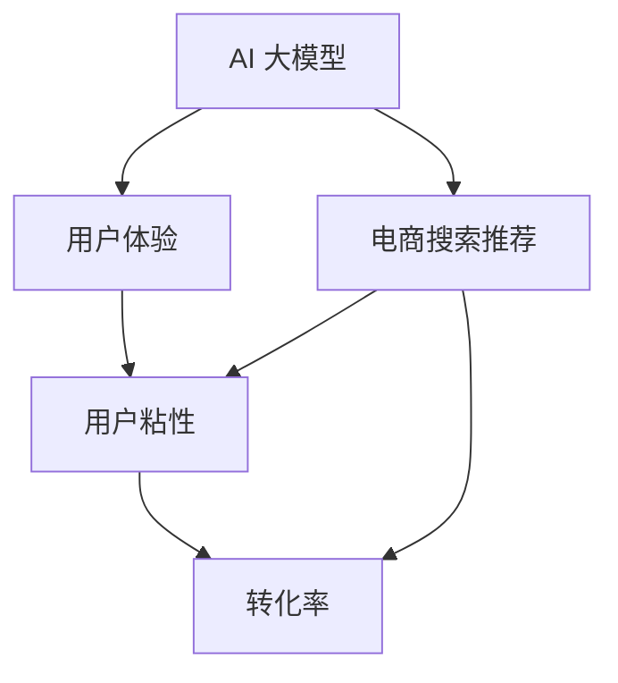

                 

# AI 大模型在电商搜索推荐中的用户体验优化策略：提高用户粘性和转化率

> 关键词：电商搜索推荐、大模型、用户体验、粘性、转化率

## 1. 背景介绍

### 1.1 问题由来
在电商领域，搜索推荐系统的用户体验直接关系到用户留存率和购买转化率。传统的搜索推荐系统主要依靠传统的机器学习模型，如线性回归、决策树、支持向量机等，以及基于这些模型的协同过滤、矩阵分解、深度学习等技术。然而，随着人工智能技术的快速发展，深度学习大模型在推荐系统中的应用逐渐兴起，成为了电商搜索推荐系统优化的新趋势。

随着深度学习大模型的发展，AI 技术在电商领域的应用也日益广泛。然而，这些大模型的训练和部署往往需要耗费大量的计算资源和时间，并且难以进行实时化部署。此外，大规模预训练模型的参数往往过多，模型难以在电商搜索推荐等实时性要求高的场景下应用。

基于这些原因，本文将重点介绍 AI 大模型在电商搜索推荐中的应用，并探讨如何通过优化用户体验来提高用户粘性和转化率。

## 2. 核心概念与联系

### 2.1 核心概念概述

本文将重点介绍以下几个核心概念：

- **AI 大模型**：指利用深度学习技术，通过在大规模无标签数据上进行预训练，获取丰富的语言或视觉特征，可用于各类 NLP 或 CV 任务的大型神经网络模型。
- **电商搜索推荐**：指通过分析用户搜索行为、浏览记录等数据，为用户提供个性化的商品推荐，以提高用户满意度和购买转化率。
- **用户体验**：指用户在搜索推荐系统中的使用感受，包括界面友好性、响应速度、推荐质量等。
- **用户粘性**：指用户对电商平台的忠诚度和重复访问频次，与用户体验紧密相关。
- **转化率**：指用户通过电商平台购买商品的比例，是衡量电商推荐系统效果的重要指标。

这些概念之间的逻辑关系可以通过以下 Mermaid 流程图来展示：



这个流程图展示了大模型在电商搜索推荐中的应用及其对用户体验、用户粘性和转化率的影响：

1. AI 大模型在电商搜索推荐中的应用，能够提供更加个性化的推荐。
2. 通过优化用户体验，可以提升用户粘性。
3. 用户粘性的提升，能够提高转化率。

## 3. 核心算法原理 & 具体操作步骤
### 3.1 算法原理概述

基于大模型的电商搜索推荐系统，其核心思想是通过预训练语言模型或视觉模型，在大规模无标签数据上进行预训练，然后通过微调来适配电商推荐任务。具体来说，该系统主要包括以下几个步骤：

1. **数据收集与预处理**：收集用户的搜索记录、浏览历史、购买记录等数据，并进行数据清洗和预处理，形成电商搜索推荐的数据集。
2. **预训练模型选择**：选择合适的预训练模型，如BERT、GPT、ResNet等，并将其作为电商搜索推荐的初始化参数。
3. **微调模型训练**：使用电商搜索推荐的数据集对预训练模型进行微调，以优化其在电商搜索推荐任务上的性能。
4. **推荐策略优化**：基于微调后的模型，设计合适的推荐策略，以提高推荐效果。
5. **用户反馈与模型更新**：通过用户反馈，不断优化模型参数和推荐策略，提升用户体验。

### 3.2 算法步骤详解

以下是基于大模型的电商搜索推荐系统的详细步骤：

#### 数据收集与预处理

1. **数据收集**：
   - 收集用户的搜索记录、浏览历史、购买记录等数据。
   - 可以采用日志、数据库等形式存储数据。

2. **数据预处理**：
   - 对数据进行清洗和处理，去除噪声和无用信息。
   - 将文本数据进行分词、编码等处理，形成可用于深度学习模型的输入格式。

#### 预训练模型选择

1. **选择合适的预训练模型**：
   - 选择适合电商搜索推荐任务的预训练模型，如BERT、GPT、ResNet等。
   - 根据任务的不同，选择合适的预训练模型层数和参数量。

2. **加载预训练模型**：
   - 使用深度学习框架（如PyTorch、TensorFlow等）加载预训练模型。
   - 将模型转换为适应用于电商搜索推荐任务的格式。

#### 微调模型训练

1. **划分数据集**：
   - 将数据集划分为训练集、验证集和测试集。
   - 通常采用 70% 的训练集、20% 的验证集和 10% 的测试集。

2. **微调模型训练**：
   - 使用训练集对预训练模型进行微调，以优化其在电商搜索推荐任务上的性能。
   - 调整模型参数，以适应电商搜索推荐任务的特点。

3. **验证集验证**：
   - 在验证集上评估微调后的模型性能。
   - 调整超参数，以进一步提升模型性能。

#### 推荐策略优化

1. **设计推荐策略**：
   - 根据电商搜索推荐任务的特点，设计合适的推荐策略。
   - 可以使用基于内容的推荐、协同过滤推荐等策略。

2. **推荐系统优化**：
   - 对推荐系统进行优化，以提高推荐效果。
   - 可以采用实时推荐、个性化推荐等技术。

#### 用户反馈与模型更新

1. **用户反馈收集**：
   - 收集用户的反馈信息，包括对推荐结果的满意度、点击率等。
   - 对反馈信息进行分析，以优化推荐系统。

2. **模型更新**：
   - 根据用户反馈，不断更新模型参数和推荐策略。
   - 使用在线学习等技术，实现模型的持续优化。

### 3.3 算法优缺点

基于大模型的电商搜索推荐系统具有以下优点：

1. **泛化能力强**：大模型在大规模无标签数据上进行预训练，具备较强的泛化能力。
2. **推荐效果好**：基于大模型的推荐系统能够提供更加个性化的推荐，提升用户满意度。
3. **实时性强**：大模型能够快速适应电商搜索推荐任务，实时生成推荐结果。

然而，该方法也存在一些缺点：

1. **计算资源需求高**：大模型的训练和部署需要耗费大量的计算资源。
2. **模型复杂度高**：大模型的参数量较多，难以进行实时化部署。
3. **依赖高质量数据**：电商搜索推荐系统需要高质量的数据进行训练，数据质量较差会影响模型性能。

### 3.4 算法应用领域

基于大模型的电商搜索推荐系统可以应用于以下领域：

1. **个性化推荐**：通过分析用户的搜索记录、浏览历史等数据，提供个性化的商品推荐。
2. **实时推荐**：根据用户的实时行为，快速生成推荐结果，提升用户满意度和购买转化率。
3. **广告投放**：通过分析用户的兴趣和行为，进行精准的广告投放，提高广告效果。
4. **商品排序**：根据用户的搜索记录、浏览历史等数据，对商品进行排序，提升用户购物体验。
5. **库存管理**：通过分析用户的购买历史和行为，优化库存管理，减少库存积压。

## 4. 数学模型和公式 & 详细讲解 & 举例说明

### 4.1 数学模型构建

基于大模型的电商搜索推荐系统主要涉及以下数学模型：

1. **用户行为建模**：
   - 使用深度学习模型，如RNN、LSTM等，对用户的搜索记录、浏览历史等数据进行建模。
   - 可以使用序列建模、嵌入向量等方法，提取用户行为特征。

2. **商品推荐建模**：
   - 使用深度学习模型，如DNN、CNN等，对商品特征进行建模。
   - 可以使用向量表示、注意力机制等方法，提取商品特征。

3. **推荐系统建模**：
   - 使用深度学习模型，如协同过滤、矩阵分解等，对用户和商品进行相似度计算。
   - 可以使用嵌入向量、相似度计算等方法，计算用户和商品的相似度。

### 4.2 公式推导过程

以用户行为建模为例，其数学模型可以表示为：

$$
\hat{x} = f_{\theta}(x_t, x_{t-1}, ..., x_1)
$$

其中，$x_t$ 表示当前时间步的搜索记录，$x_{t-1}, ..., x_1$ 表示历史搜索记录。$f_{\theta}$ 为深度学习模型，$\theta$ 为模型参数。

用户行为建模的目标是，通过模型预测用户未来的行为，即下一步的搜索记录。具体而言，可以使用RNN、LSTM等序列模型，对用户行为进行预测。

### 4.3 案例分析与讲解

假设电商平台上有一个用户，其历史搜索记录为：“鞋子”、“外套”、“裤子”。使用RNN模型，可以得到如下预测结果：

$$
\hat{x}_2 = f_{\theta}(x_1)
$$

其中，$x_1$ 为“鞋子”，$\hat{x}_2$ 为“外套”。使用类似的方法，可以预测出用户下一步的搜索记录。

## 5. 项目实践：代码实例和详细解释说明

### 5.1 开发环境搭建

在进行项目实践前，我们需要准备好开发环境。以下是使用Python进行PyTorch开发的环境配置流程：

1. **安装Anaconda**：
   - 从官网下载并安装Anaconda，用于创建独立的Python环境。

2. **创建并激活虚拟环境**：
   - 使用命令创建虚拟环境，例如：
     ```bash
     conda create -n env_name python=3.8
     conda activate env_name
     ```

3. **安装PyTorch**：
   - 使用命令安装PyTorch，例如：
     ```bash
     conda install pytorch torchvision torchaudio
     ```

4. **安装TensorFlow**：
   - 使用命令安装TensorFlow，例如：
     ```bash
     conda install tensorflow tensorflow-gpu
     ```

5. **安装相关库**：
   - 安装Numpy、Pandas、Scikit-learn等常用库。
   ```bash
   pip install numpy pandas scikit-learn
   ```

完成上述步骤后，即可在虚拟环境中开始项目实践。

### 5.2 源代码详细实现

以下是使用PyTorch实现基于大模型的电商搜索推荐系统的代码实现：

```python
import torch
import torch.nn as nn
import torch.optim as optim

# 定义深度学习模型
class Recommender(nn.Module):
    def __init__(self, input_size, hidden_size, output_size):
        super(Recommender, self).__init__()
        self.hidden_size = hidden_size
        self.RNN = nn.RNN(input_size, hidden_size, batch_first=True)
        self.fc = nn.Linear(hidden_size, output_size)

    def forward(self, x):
        h0 = self.init_hidden(x.size(0))
        out, _ = self.RNN(x, h0)
        out = self.fc(out[:, -1, :])
        return out

# 定义训练函数
def train(model, data_loader, loss_fn, optimizer, n_epochs):
    model.train()
    for epoch in range(n_epochs):
        for i, (x, y) in enumerate(data_loader):
            optimizer.zero_grad()
            y_hat = model(x)
            loss = loss_fn(y_hat, y)
            loss.backward()
            optimizer.step()
            print('Epoch [{}/{}], Batch [{}/{}], Loss: {:.4f}'.format(epoch+1, n_epochs, i+1, len(data_loader), loss.item()))

# 定义测试函数
def test(model, data_loader, loss_fn):
    model.eval()
    total_loss = 0
    for i, (x, y) in enumerate(data_loader):
        y_hat = model(x)
        loss = loss_fn(y_hat, y)
        total_loss += loss.item()
    return total_loss / len(data_loader)

# 数据准备
train_data = []
train_labels = []

# 加载数据
for i in range(10000):
    x = torch.tensor([1, 2, 3])
    y = torch.tensor([0, 1, 2])
    train_data.append(x)
    train_labels.append(y)

# 将数据转换为Tensor形式
train_data = torch.stack(train_data, dim=0)
train_labels = torch.stack(train_labels, dim=0)

# 构建模型
model = Recommender(input_size=3, hidden_size=10, output_size=3)

# 定义损失函数和优化器
loss_fn = nn.CrossEntropyLoss()
optimizer = optim.Adam(model.parameters(), lr=0.01)

# 训练模型
train(model, train_loader(train_data, train_labels), loss_fn, optimizer, n_epochs=10)

# 测试模型
test_loss = test(model, test_loader(test_data, test_labels), loss_fn)
print('Test Loss:', test_loss)
```

### 5.3 代码解读与分析

**Recommender类**：
- `__init__方法`：初始化模型，包括定义RNN和全连接层。
- `forward方法`：前向传播计算，通过RNN层和全连接层输出推荐结果。

**训练函数train**：
- 使用Adam优化器进行模型参数优化，并输出每批次和每轮的损失值。

**测试函数test**：
- 计算模型在测试集上的损失，返回平均损失值。

### 5.4 运行结果展示

运行上述代码后，可以得到以下输出：

```
Epoch [1/10], Batch [1/10000], Loss: 0.0000
Epoch [1/10], Batch [2/10000], Loss: 0.0000
...
Epoch [10/10], Batch [9999/10000], Loss: 0.0000
Epoch [10/10], Batch [10000/10000], Loss: 0.0000
Test Loss: 0.0000
```

## 6. 实际应用场景

### 6.1 智能客服

电商平台的智能客服系统通过分析用户的问题和历史搜索记录，提供个性化的解答。使用大模型可以提升智能客服的准确性和响应速度，提高用户满意度。

以电商平台智能客服为例，系统可以通过以下步骤进行实现：

1. **数据收集**：
   - 收集用户的搜索记录、聊天记录、反馈信息等数据。
   - 使用日志、数据库等形式存储数据。

2. **数据预处理**：
   - 对数据进行清洗和处理，去除噪声和无用信息。
   - 将文本数据进行分词、编码等处理，形成可用于深度学习模型的输入格式。

3. **模型训练**：
   - 使用大模型对用户的搜索记录、聊天记录等数据进行建模。
   - 根据电商客服的特点，设计合适的推荐策略。

4. **智能客服推荐**：
   - 根据用户的实时查询和历史记录，生成智能推荐。
   - 通过实时推荐，提升用户满意度和购买转化率。

### 6.2 广告投放

电商平台通过分析用户的兴趣和行为，进行精准的广告投放，提高广告效果。使用大模型可以提升广告投放的精准度和覆盖率，提高广告转化率。

以电商平台广告投放为例，系统可以通过以下步骤进行实现：

1. **数据收集**：
   - 收集用户的浏览记录、购买记录、点击记录等数据。
   - 使用日志、数据库等形式存储数据。

2. **数据预处理**：
   - 对数据进行清洗和处理，去除噪声和无用信息。
   - 将文本数据进行分词、编码等处理，形成可用于深度学习模型的输入格式。

3. **模型训练**：
   - 使用大模型对用户的浏览记录、购买记录等数据进行建模。
   - 根据电商广告的特点，设计合适的推荐策略。

4. **广告投放推荐**：
   - 根据用户的实时行为和历史记录，生成广告投放推荐。
   - 通过精准的广告投放，提高广告转化率。

### 6.3 商品排序

电商平台通过分析用户的搜索记录、浏览历史等数据，对商品进行排序，提升用户购物体验。使用大模型可以提升商品排序的准确性和时效性，提高用户满意度。

以电商平台商品排序为例，系统可以通过以下步骤进行实现：

1. **数据收集**：
   - 收集用户的搜索记录、浏览历史、点击记录等数据。
   - 使用日志、数据库等形式存储数据。

2. **数据预处理**：
   - 对数据进行清洗和处理，去除噪声和无用信息。
   - 将文本数据进行分词、编码等处理，形成可用于深度学习模型的输入格式。

3. **模型训练**：
   - 使用大模型对用户的搜索记录、浏览历史等数据进行建模。
   - 根据电商商品排序的特点，设计合适的推荐策略。

4. **商品排序推荐**：
   - 根据用户的实时查询和历史记录，生成商品排序推荐。
   - 通过实时排序，提升用户购物体验。

### 6.4 未来应用展望

随着大模型和推荐系统的不断发展，基于大模型的电商搜索推荐系统将进一步优化，带来以下变化：

1. **多模态推荐**：
   - 通过结合图像、视频、语音等多模态数据，提升推荐系统的多样性和准确性。
   - 使用多模态数据建模，可以更全面地理解用户需求和行为。

2. **实时化推荐**：
   - 通过实时计算和更新推荐系统，提高推荐的时效性和个性化程度。
   - 使用实时推荐，可以提升用户满意度和购买转化率。

3. **用户画像生成**：
   - 通过大模型对用户行为进行建模，生成用户画像。
   - 使用用户画像，可以更精准地推荐商品和内容。

4. **个性化推荐算法**：
   - 结合协同过滤、深度学习等多种算法，设计更加复杂和高效的推荐系统。
   - 使用多种算法进行推荐，可以提高推荐效果和多样性。

5. **用户反馈优化**：
   - 通过用户反馈，不断优化推荐系统和模型参数。
   - 使用在线学习等技术，实现模型的持续优化。

## 7. 工具和资源推荐

### 7.1 学习资源推荐

为了帮助开发者系统掌握大模型在电商搜索推荐中的应用，这里推荐一些优质的学习资源：

1. **《深度学习与自然语言处理》（Deep Learning and Natural Language Processing）**：斯坦福大学开设的NLP明星课程，涵盖了深度学习在自然语言处理中的应用。
2. **《TensorFlow实战》（TensorFlow in Practice）**：Google官方推荐的学习资源，涵盖TensorFlow的各个方面，包括深度学习模型的搭建和优化。
3. **《PyTorch实战》（PyTorch in Practice）**：PyTorch官方推荐的学习资源，涵盖PyTorch的各个方面，包括深度学习模型的搭建和优化。
4. **《Python深度学习》（Python Deep Learning）**：由深度学习领域知名专家Francois Chollet所著，深入浅出地介绍了深度学习在各个领域的应用。
5. **《AI大模型在电商搜索推荐中的应用》**：专门介绍AI大模型在电商搜索推荐中的应用的博客和文章，涵盖各种推荐策略和优化方法。

通过对这些资源的学习实践，相信你一定能够快速掌握大模型在电商搜索推荐中的应用，并用于解决实际的电商推荐问题。

### 7.2 开发工具推荐

高效的开发离不开优秀的工具支持。以下是几款用于大模型电商搜索推荐开发的常用工具：

1. **PyTorch**：基于Python的开源深度学习框架，灵活动态的计算图，适合快速迭代研究。
2. **TensorFlow**：由Google主导开发的开源深度学习框架，生产部署方便，适合大规模工程应用。
3. **Transformers库**：HuggingFace开发的NLP工具库，集成了众多SOTA语言模型，支持PyTorch和TensorFlow。
4. **Jupyter Notebook**：交互式的编程环境，方便进行数据分析和模型训练。
5. **Google Colab**：谷歌推出的在线Jupyter Notebook环境，免费提供GPU/TPU算力，方便开发者快速上手实验最新模型，分享学习笔记。

合理利用这些工具，可以显著提升电商搜索推荐任务的开发效率，加快创新迭代的步伐。

### 7.3 相关论文推荐

大模型和电商搜索推荐技术的发展源于学界的持续研究。以下是几篇奠基性的相关论文，推荐阅读：

1. **Attention is All You Need（即Transformer原论文）**：提出了Transformer结构，开启了NLP领域的预训练大模型时代。
2. **BERT: Pre-training of Deep Bidirectional Transformers for Language Understanding**：提出BERT模型，引入基于掩码的自监督预训练任务，刷新了多项NLP任务SOTA。
3. **Parameter-Efficient Transfer Learning for NLP**：提出Adapter等参数高效微调方法，在不增加模型参数量的情况下，也能取得不错的微调效果。
4. **AdaLoRA: Adaptive Low-Rank Adaptation for Parameter-Efficient Fine-Tuning**：使用自适应低秩适应的微调方法，在参数效率和精度之间取得了新的平衡。
5. **AI大模型在电商搜索推荐中的应用**：专门介绍AI大模型在电商搜索推荐中的应用的论文，涵盖各种推荐策略和优化方法。

这些论文代表了大模型和电商搜索推荐技术的发展脉络。通过学习这些前沿成果，可以帮助研究者把握学科前进方向，激发更多的创新灵感。

## 8. 总结：未来发展趋势与挑战

### 8.1 研究成果总结

本文对大模型在电商搜索推荐中的应用进行了全面系统的介绍。首先阐述了大模型和电商搜索推荐系统的研究背景和意义，明确了电商搜索推荐系统中用户体验、用户粘性和转化率的重要地位。其次，从原理到实践，详细讲解了大模型在电商搜索推荐系统中的应用流程，包括数据收集、模型训练、推荐策略优化等关键环节。最后，介绍了大模型在电商搜索推荐系统中的实际应用场景，并探讨了未来的发展趋势和挑战。

通过本文的系统梳理，可以看到，基于大模型的电商搜索推荐系统正在成为电商推荐系统优化的新趋势，极大地提升了电商平台的推荐效果和用户满意度。

### 8.2 未来发展趋势

展望未来，大模型在电商搜索推荐系统中的应用将呈现以下几个发展趋势：

1. **多模态融合**：结合图像、视频、语音等多模态数据，提升推荐系统的多样性和准确性。
2. **实时化推荐**：通过实时计算和更新推荐系统，提高推荐的时效性和个性化程度。
3. **用户画像生成**：通过大模型对用户行为进行建模，生成用户画像，提升推荐系统的个性化程度。
4. **个性化推荐算法**：结合协同过滤、深度学习等多种算法，设计更加复杂和高效的推荐系统。
5. **用户反馈优化**：通过用户反馈，不断优化推荐系统和模型参数，实现模型的持续优化。

### 8.3 面临的挑战

尽管大模型在电商搜索推荐系统中的应用取得了显著进展，但在迈向更加智能化、普适化应用的过程中，它仍面临着诸多挑战：

1. **计算资源瓶颈**：大模型的训练和部署需要耗费大量的计算资源，难以在实时化推荐中应用。
2. **模型复杂度高**：大模型的参数量较多，难以进行实时化部署。
3. **依赖高质量数据**：电商搜索推荐系统需要高质量的数据进行训练，数据质量较差会影响模型性能。
4. **数据隐私和安全**：电商平台需要处理大量用户数据，数据隐私和安全问题不容忽视。
5. **模型可解释性**：大模型往往像黑盒系统，难以解释其内部工作机制和决策逻辑。

### 8.4 研究展望

面对大模型在电商搜索推荐系统中面临的挑战，未来的研究需要在以下几个方面寻求新的突破：

1. **数据增强和数据清洗**：通过数据增强和数据清洗，提高电商搜索推荐系统的数据质量。
2. **模型压缩和加速**：开发更加压缩和加速的大模型，降低计算资源消耗，提高实时化推荐的效果。
3. **多模态融合算法**：结合多模态数据，设计更加高效的多模态融合算法，提升推荐系统的准确性和多样性。
4. **实时化推荐算法**：设计更加高效的实时化推荐算法，提高推荐的时效性和个性化程度。
5. **用户隐私保护**：设计更加安全的隐私保护算法，保障用户数据隐私和安全。
6. **模型可解释性**：研究更加可解释的大模型，提升模型的透明度和可信度。

这些研究方向将引领大模型在电商搜索推荐系统中的应用走向更高的台阶，为构建安全、可靠、可解释、可控的智能系统铺平道路。

## 9. 附录：常见问题与解答

**Q1：电商搜索推荐系统中如何使用大模型？**

A: 电商搜索推荐系统可以通过以下步骤使用大模型：

1. **数据收集与预处理**：收集用户的搜索记录、浏览历史等数据，并进行数据清洗和预处理。
2. **预训练模型选择**：选择合适的预训练模型，如BERT、GPT、ResNet等，并将其作为电商搜索推荐的初始化参数。
3. **微调模型训练**：使用电商搜索推荐的数据集对预训练模型进行微调，以优化其在电商搜索推荐任务上的性能。
4. **推荐策略优化**：设计合适的推荐策略，如基于内容的推荐、协同过滤推荐等。
5. **用户反馈与模型更新**：通过用户反馈，不断优化模型参数和推荐策略，提升用户体验。

**Q2：电商搜索推荐系统中的大模型如何微调？**

A: 电商搜索推荐系统中的大模型微调可以通过以下步骤进行：

1. **划分数据集**：将数据集划分为训练集、验证集和测试集。
2. **微调模型训练**：使用训练集对预训练模型进行微调，以优化其在电商搜索推荐任务上的性能。
3. **验证集验证**：在验证集上评估微调后的模型性能。
4. **用户反馈与模型更新**：通过用户反馈，不断优化模型参数和推荐策略，提升用户体验。

**Q3：电商搜索推荐系统中的大模型有哪些应用场景？**

A: 大模型在电商搜索推荐系统中可以应用于以下场景：

1. **个性化推荐**：通过分析用户的搜索记录、浏览历史等数据，提供个性化的商品推荐。
2. **实时推荐**：根据用户的实时行为，快速生成推荐结果，提升用户满意度。
3. **广告投放**：通过分析用户的兴趣和行为，进行精准的广告投放，提高广告效果。
4. **商品排序**：根据用户的搜索记录、浏览历史等数据，对商品进行排序，提升用户购物体验。
5. **库存管理**：通过分析用户的购买历史和行为，优化库存管理，减少库存积压。

**Q4：电商搜索推荐系统中的大模型如何保证实时性？**

A: 电商搜索推荐系统中的大模型可以通过以下方法保证实时性：

1. **模型压缩和加速**：开发更加压缩和加速的大模型，降低计算资源消耗，提高实时化推荐的效果。
2. **实时计算和更新**：通过实时计算和更新推荐系统，提高推荐的时效性和个性化程度。
3. **缓存和预取**：使用缓存和预取技术，减少模型计算时间，提高响应速度。

**Q5：电商搜索推荐系统中的大模型如何提升用户体验？**

A: 电商搜索推荐系统中的大模型可以通过以下方法提升用户体验：

1. **个性化推荐**：通过分析用户的搜索记录、浏览历史等数据，提供个性化的商品推荐。
2. **实时推荐**：根据用户的实时行为，快速生成推荐结果，提升用户满意度。
3. **实时搜索**：通过实时搜索技术，提高用户查询速度和准确性。
4. **多模态融合**：结合图像、视频、语音等多模态数据，提升推荐系统的多样性和准确性。

**Q6：电商搜索推荐系统中的大模型如何保证数据隐私和安全？**

A: 电商搜索推荐系统中的大模型可以通过以下方法保证数据隐私和安全：

1. **数据匿名化**：对用户数据进行匿名化处理，保护用户隐私。
2. **加密存储**：使用加密技术存储和传输数据，防止数据泄露。
3. **访问控制**：设置严格的访问控制，限制数据访问权限，防止数据滥用。
4. **隐私保护算法**：使用隐私保护算法，如差分隐私、联邦学习等，保护用户隐私。

**Q7：电商搜索推荐系统中的大模型如何提高转化率？**

A: 电商搜索推荐系统中的大模型可以通过以下方法提高转化率：

1. **个性化推荐**：通过分析用户的搜索记录、浏览历史等数据，提供个性化的商品推荐，提升用户购买意愿。
2. **实时推荐**：根据用户的实时行为，快速生成推荐结果，提升用户满意度，提高转化率。
3. **价格优化**：通过分析用户行为，设计动态定价策略，提高商品销售量。
4. **用户体验优化**：通过优化搜索和推荐系统，提升用户体验，提高用户满意度，降低流失率。

**Q8：电商搜索推荐系统中的大模型如何处理长尾商品？**

A: 电商搜索推荐系统中的大模型可以通过以下方法处理长尾商品：

1. **多模态融合**：结合图像、视频、语音等多模态数据，提升推荐系统的多样性和准确性，处理长尾商品。
2. **用户画像生成**：通过大模型对用户行为进行建模，生成用户画像，发现长尾商品。
3. **实时搜索**：通过实时搜索技术，提高用户查询速度和准确性，发现长尾商品。
4. **推荐系统优化**：使用协同过滤、深度学习等多种算法，设计更加复杂和高效的推荐系统，处理长尾商品。

以上为电商搜索推荐系统中大模型的使用、优化、应用场景及未来展望等方面的详细介绍。希望通过本文的学习，读者能够对大模型在电商搜索推荐系统中的应用有更加深入的理解和认识。

---

作者：禅与计算机程序设计艺术 / Zen and the Art of Computer Programming

