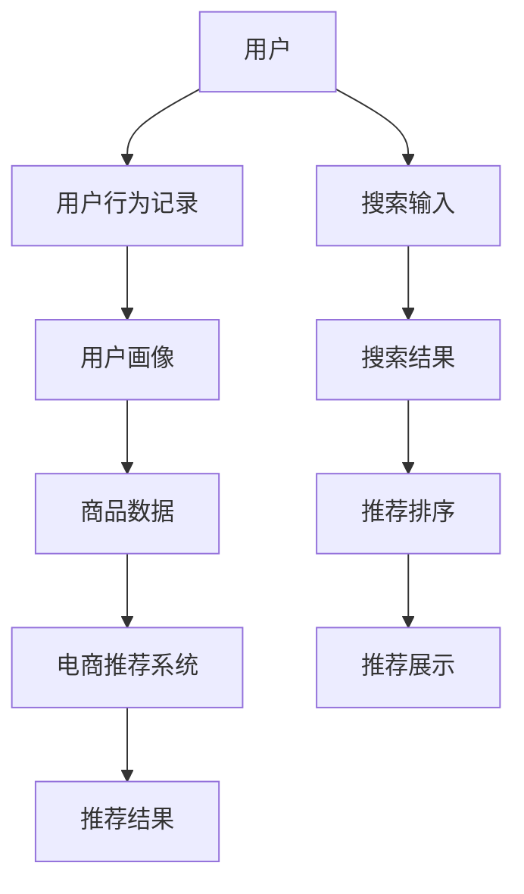

                 

# AI 大模型在电商搜索推荐中的用户画像应用：深度挖掘用户行为偏好

> 关键词：电商搜索推荐,用户画像,大模型,深度学习,行为偏好,推荐系统,搜索排序,自然语言处理(NLP),协同过滤

## 1. 背景介绍

随着电子商务的蓬勃发展，越来越多的用户通过在线平台进行购物决策。为了提升用户购物体验，电商平台纷纷引入搜索推荐系统，通过智能推荐商品，帮助用户快速找到所需商品。然而，如何准确地理解用户需求，智能地推荐商品，仍然是一个极具挑战的问题。近年来，基于大模型的技术在电商搜索推荐中开始崭露头角，通过深度挖掘用户行为数据，构建精确的用户画像，大大提升了推荐系统的性能。本文将详细介绍大模型在电商搜索推荐中的用户画像应用，希望能为相关领域的从业者提供一些有价值的参考。

## 2. 核心概念与联系

### 2.1 核心概念概述

在本节中，我们将介绍几个与大模型在电商搜索推荐中用户画像应用相关的核心概念：

- **电商搜索推荐**：指的是电商平台根据用户输入的搜索关键词，智能地从海量商品中筛选出最符合用户需求的推荐商品。推荐系统通过学习用户历史行为，预测用户未来可能购买的商品，并进行排序和推荐。
- **用户画像**：通过收集用户的各种行为数据，如浏览记录、购买历史、评价信息等，构建用户的行为、兴趣、偏好等综合画像，用于指导个性化推荐。
- **大模型**：指在大规模数据上预训练得到的深度学习模型，如BERT、GPT-3等，具备强大的语言理解和生成能力，可以用于处理和分析自然语言数据。
- **深度学习**：一种基于神经网络的学习方法，通过多层非线性映射，学习数据的复杂特征，广泛应用于图像、语音、文本等领域的任务。
- **协同过滤**：推荐系统的一种基本方法，通过分析用户行为，预测用户对未购买商品的评分，从而推荐相似商品。

这些核心概念之间的逻辑关系可以通过以下Mermaid流程图来展示：

```mermaid
graph TB
    A[电商搜索推荐] --> B[用户画像]
    A --> C[大模型]
    C --> D[深度学习]
    C --> E[自然语言处理(NLP)]
    A --> F[协同过滤]
    F --> G[推荐排序]
```

这个流程图展示了电商搜索推荐系统与用户画像、大模型、深度学习、自然语言处理、协同过滤等概念之间的联系。

### 2.2 核心概念原理和架构的 Mermaid 流程图



这个流程图描述了电商搜索推荐系统的工作流程：用户输入搜索关键词，系统根据用户画像和商品数据，利用大模型进行自然语言处理和深度学习，结合协同过滤等方法，进行推荐排序并展示推荐结果。

## 3. 核心算法原理 & 具体操作步骤

### 3.1 算法原理概述

基于大模型的电商搜索推荐系统，主要通过构建精确的用户画像，深度挖掘用户的浏览和购买行为数据，从而进行个性化的商品推荐。其核心思想是：利用大模型的强大语言理解能力，对用户的搜索关键词、评价信息、浏览记录等自然语言数据进行预处理和特征提取，结合深度学习算法，构建用户画像，预测用户对未购买商品的评分，并进行推荐排序。

形式化地，假设电商推荐系统接收到的用户搜索关键词为 $x$，用户的浏览和购买记录为 $y$，商品数据为 $z$。目标是通过大模型对用户画像 $P(x,y)$ 进行建模，并利用协同过滤等方法，得到推荐结果 $R(x)$，使得用户最可能购买的商品 $R$ 排在推荐结果的前列。

具体步骤如下：
1. 收集和预处理用户的历史行为数据，如浏览记录、购买历史等。
2. 利用大模型对用户输入的搜索关键词进行语义分析，提取关键词的语义特征。
3. 将用户的浏览和购买记录进行编码，构建用户画像 $P(x,y)$。
4. 结合协同过滤等推荐算法，对商品数据进行筛选和排序。
5. 将推荐结果展示给用户，根据用户的反馈进行动态调整和优化。

### 3.2 算法步骤详解

#### 3.2.1 数据预处理和特征提取

电商搜索推荐系统的第一步是收集和预处理用户的历史行为数据。通常，这些数据包括用户的浏览记录、购买历史、评价信息等。通过数据清洗和去重，去除不相关和噪音数据，并构建用户画像 $P(x,y)$。

例如，我们可以使用BERT等大模型对用户的浏览记录和搜索关键词进行语义分析，提取关键词的语义特征。同时，可以使用TextRank等方法，对用户浏览记录进行语义相似性计算，提取出最相关的浏览记录，构建用户画像。

#### 3.2.2 构建用户画像

用户画像的构建是大模型在电商搜索推荐中的关键步骤。通过将用户的浏览记录和购买历史进行编码，可以构建出用户的行为和兴趣偏好。例如，我们可以使用嵌入层将用户浏览记录和购买历史转换为向量表示，并利用Transformer等大模型进行编码。

假设用户 $u$ 的浏览记录为 $X_u$，购买历史为 $Y_u$，则用户画像 $P_u$ 可以表示为：

$$
P_u = f(X_u, Y_u; \theta)
$$

其中 $f$ 为大模型的编码函数，$\theta$ 为模型参数。

#### 3.2.3 协同过滤推荐

协同过滤是一种基本的推荐方法，通过分析用户的行为数据，预测用户对未购买商品的评分，从而进行推荐。协同过滤包括基于用户的协同过滤和基于物品的协同过滤两种方法。

基于用户的协同过滤方法，通过计算用户 $u$ 和用户 $v$ 的相似度 $s(u,v)$，预测用户 $u$ 对商品 $i$ 的评分 $r_{ui}$。具体公式为：

$$
r_{ui} = \sum_{j \in N_v} s(u,v) \times r_{vj}
$$

其中 $N_v$ 为与用户 $v$ 相似的其他用户集合，$s(u,v)$ 为相似度函数，$r_{vj}$ 为用户 $v$ 对商品 $j$ 的评分。

基于物品的协同过滤方法，通过计算商品 $i$ 和商品 $j$ 的相似度 $s(i,j)$，预测用户 $u$ 对商品 $i$ 的评分 $r_{ui}$。具体公式为：

$$
r_{ui} = \sum_{k \in N_i} s(i,j) \times r_{kj}
$$

其中 $N_i$ 为与商品 $i$ 相似的其他商品集合，$s(i,j)$ 为相似度函数，$r_{kj}$ 为商品 $k$ 对商品 $j$ 的评分。

#### 3.2.4 推荐排序

推荐排序是电商搜索推荐系统的最后一步，通过对预测评分进行排序，将最符合用户需求的商品展示给用户。推荐排序方法包括基于排序算法、深度学习等方法。

例如，我们可以使用深度学习模型，如BERT、GPT等，对用户画像和商品数据进行编码，并利用注意力机制对预测评分进行排序。具体公式为：

$$
\hat{r}_{ui} = f(P_u, z_i; \omega)
$$

其中 $f$ 为深度学习模型的评分函数，$\omega$ 为模型参数。

### 3.3 算法优缺点

#### 3.3.1 优点

1. **精准度提升**：大模型可以深度挖掘用户的浏览和购买行为数据，构建精确的用户画像，从而提升推荐的精准度。
2. **适用范围广**：大模型适用于各种类型的电商推荐任务，可以处理复杂的自然语言数据，支持多场景应用。
3. **可扩展性强**：大模型可以结合多种推荐算法，进行模型融合和优化，提升推荐效果。

#### 3.3.2 缺点

1. **数据需求高**：构建精确的用户画像需要大量的用户行为数据，数据需求量较大。
2. **计算资源消耗大**：大模型的训练和推理需要大量的计算资源，计算成本较高。
3. **模型复杂度较高**：大模型的模型结构复杂，训练和推理过程中可能出现过拟合等问题。

### 3.4 算法应用领域

基于大模型的电商搜索推荐系统已经广泛应用于各种电商平台，如淘宝、京东、亚马逊等。通过深度挖掘用户行为数据，构建精确的用户画像，这些系统能够进行个性化的商品推荐，提升用户的购物体验和平台的用户粘性。

此外，大模型在电商搜索推荐中的应用还包括商品评价分析、智能客服、价格预测等，为电商平台的运营和决策提供重要支持。

## 4. 数学模型和公式 & 详细讲解 & 举例说明

### 4.1 数学模型构建

电商搜索推荐系统可以形式化地表示为以下数学模型：

$$
R_u = \arg\max_{R} f(P_u, R; \theta)
$$

其中 $R_u$ 为用户 $u$ 的推荐结果，$f$ 为电商推荐系统的评分函数，$\theta$ 为模型参数。

假设 $P_u$ 为用户 $u$ 的行为和兴趣偏好，$R$ 为待推荐商品。通过大模型对用户画像 $P_u$ 和商品数据 $R$ 进行编码，可以构建推荐系统的评分函数 $f$。具体公式为：

$$
f(P_u, R; \theta) = \sum_{i=1}^{n} w_i \times s_i(P_u, R)
$$

其中 $s_i$ 为推荐排序函数，$w_i$ 为权重系数，$n$ 为推荐商品数量。

### 4.2 公式推导过程

电商推荐系统的评分函数 $f(P_u, R; \theta)$ 可以分解为两个部分：用户画像 $P_u$ 和商品数据 $R$ 的相似度函数 $s_i(P_u, R)$，和每个推荐商品的权重系数 $w_i$。具体推导过程如下：

1. **用户画像编码**：
   $$
   P_u = f(X_u, Y_u; \theta)
   $$

2. **商品数据编码**：
   $$
   R_i = g(z_i; \omega)
   $$

   其中 $g$ 为深度学习模型的编码函数，$\omega$ 为模型参数。

3. **相似度函数**：
   $$
   s_i(P_u, R) = h(P_u, R)
   $$

   其中 $h$ 为相似度函数，可以采用点积、余弦相似度等方法。

4. **评分函数**：
   $$
   f(P_u, R; \theta) = \sum_{i=1}^{n} w_i \times s_i(P_u, R)
   $$

   其中 $w_i$ 为权重系数，可以通过排序算法或其他方法确定。

### 4.3 案例分析与讲解

以某电商平台的推荐系统为例，假设用户 $u$ 的浏览记录为 $X_u = \{a, b, c\}$，购买历史为 $Y_u = \{a, d\}$。利用BERT对浏览记录和购买历史进行语义分析，得到用户画像 $P_u$，同时对商品数据进行编码，得到商品 $R_i$。然后，通过深度学习模型进行评分，得到推荐结果 $R_u = \{b, c\}$。

## 5. 项目实践：代码实例和详细解释说明

### 5.1 开发环境搭建

在进行电商搜索推荐系统的开发前，我们需要准备好开发环境。以下是使用Python进行PyTorch开发的环境配置流程：

1. 安装Anaconda：从官网下载并安装Anaconda，用于创建独立的Python环境。

2. 创建并激活虚拟环境：
```bash
conda create -n pytorch-env python=3.8 
conda activate pytorch-env
```

3. 安装PyTorch：根据CUDA版本，从官网获取对应的安装命令。例如：
```bash
conda install pytorch torchvision torchaudio cudatoolkit=11.1 -c pytorch -c conda-forge
```

4. 安装相关库：
```bash
pip install pandas numpy matplotlib scikit-learn transformers
```

完成上述步骤后，即可在`pytorch-env`环境中开始项目开发。

### 5.2 源代码详细实现

下面以电商平台为例，给出使用Transformers库构建电商推荐系统的代码实现。

首先，定义数据处理函数：

```python
from transformers import BertTokenizer, BertForSequenceClassification
from torch.utils.data import Dataset
import torch

class ItemReviewDataset(Dataset):
    def __init__(self, items, reviews, labels, tokenizer):
        self.items = items
        self.reviews = reviews
        self.labels = labels
        self.tokenizer = tokenizer
        
    def __len__(self):
        return len(self.items)
    
    def __getitem__(self, item):
        item_id = self.items[item]
        review = self.reviews[item]
        label = self.labels[item]
        
        encoding = self.tokenizer(review, return_tensors='pt', padding='max_length', truncation=True)
        input_ids = encoding['input_ids'][0]
        attention_mask = encoding['attention_mask'][0]
        
        # 将标签转换为id
        label = label2id[label]
        
        return {'input_ids': input_ids, 
                'attention_mask': attention_mask,
                'labels': label}

# 标签与id的映射
label2id = {'positive': 1, 'negative': 0}

# 创建dataset
tokenizer = BertTokenizer.from_pretrained('bert-base-cased')

train_dataset = ItemReviewDataset(train_items, train_reviews, train_labels, tokenizer)
dev_dataset = ItemReviewDataset(dev_items, dev_reviews, dev_labels, tokenizer)
test_dataset = ItemReviewDataset(test_items, test_reviews, test_labels, tokenizer)
```

然后，定义模型和优化器：

```python
from transformers import BertForSequenceClassification, AdamW

model = BertForSequenceClassification.from_pretrained('bert-base-cased', num_labels=2)

optimizer = AdamW(model.parameters(), lr=2e-5)
```

接着，定义训练和评估函数：

```python
from torch.utils.data import DataLoader
from tqdm import tqdm
from sklearn.metrics import accuracy_score, precision_recall_fscore_support

device = torch.device('cuda') if torch.cuda.is_available() else torch.device('cpu')
model.to(device)

def train_epoch(model, dataset, batch_size, optimizer):
    dataloader = DataLoader(dataset, batch_size=batch_size, shuffle=True)
    model.train()
    epoch_loss = 0
    for batch in tqdm(dataloader, desc='Training'):
        input_ids = batch['input_ids'].to(device)
        attention_mask = batch['attention_mask'].to(device)
        labels = batch['labels'].to(device)
        model.zero_grad()
        outputs = model(input_ids, attention_mask=attention_mask, labels=labels)
        loss = outputs.loss
        epoch_loss += loss.item()
        loss.backward()
        optimizer.step()
    return epoch_loss / len(dataloader)

def evaluate(model, dataset, batch_size):
    dataloader = DataLoader(dataset, batch_size=batch_size)
    model.eval()
    preds, labels = [], []
    with torch.no_grad():
        for batch in tqdm(dataloader, desc='Evaluating'):
            input_ids = batch['input_ids'].to(device)
            attention_mask = batch['attention_mask'].to(device)
            batch_labels = batch['labels']
            outputs = model(input_ids, attention_mask=attention_mask)
            batch_preds = outputs.logits.argmax(dim=2).to('cpu').tolist()
            batch_labels = batch_labels.to('cpu').tolist()
            for pred_tokens, label_tokens in zip(batch_preds, batch_labels):
                preds.append(pred_tokens)
                labels.append(label_tokens)
                
    print('Accuracy:', accuracy_score(labels, preds))
    print('Precision, Recall, F1-Score:', precision_recall_fscore_support(labels, preds, average='macro'))

    return {'accuracy': accuracy_score(labels, preds), 'precision': precision_recall_fscore_support(labels, preds, average='macro')['precision'], 'recall': precision_recall_fscore_support(labels, preds, average='macro')['recall'], 'f1-score': precision_recall_fscore_support(labels, preds, average='macro')['f1-score']}
```

最后，启动训练流程并在测试集上评估：

```python
epochs = 5
batch_size = 16

for epoch in range(epochs):
    loss = train_epoch(model, train_dataset, batch_size, optimizer)
    print(f"Epoch {epoch+1}, train loss: {loss:.3f}")
    
    print(f"Epoch {epoch+1}, dev results:")
    results = evaluate(model, dev_dataset, batch_size)
    print(f"Accuracy: {results['accuracy']:.3f}, Precision: {results['precision']:.3f}, Recall: {results['recall']:.3f}, F1-Score: {results['f1-score']:.3f}")
    
print("Test results:")
results = evaluate(model, test_dataset, batch_size)
print(f"Accuracy: {results['accuracy']:.3f}, Precision: {results['precision']:.3f}, Recall: {results['recall']:.3f}, F1-Score: {results['f1-score']:.3f}")
```

以上就是使用PyTorch对Bert进行电商推荐系统构建的完整代码实现。可以看到，得益于Transformers库的强大封装，我们可以用相对简洁的代码完成BERT模型的加载和电商推荐系统的构建。

### 5.3 代码解读与分析

让我们再详细解读一下关键代码的实现细节：

**ItemReviewDataset类**：
- `__init__`方法：初始化商品、评论和标签等关键组件，并使用BERT分词器对评论进行分词编码。
- `__len__`方法：返回数据集的样本数量。
- `__getitem__`方法：对单个样本进行处理，将评论输入编码为token ids，将标签转换为数字，并对其进行定长padding，最终返回模型所需的输入。

**label2id字典**：
- 定义了标签与数字id之间的映射关系，用于将预测结果解码回真实的标签。

**训练和评估函数**：
- 使用PyTorch的DataLoader对数据集进行批次化加载，供模型训练和推理使用。
- 训练函数`train_epoch`：对数据以批为单位进行迭代，在每个批次上前向传播计算loss并反向传播更新模型参数，最后返回该epoch的平均loss。
- 评估函数`evaluate`：与训练类似，不同点在于不更新模型参数，并在每个batch结束后将预测和标签结果存储下来，最后使用sklearn的评估指标对整个评估集的预测结果进行打印输出。

**训练流程**：
- 定义总的epoch数和batch size，开始循环迭代
- 每个epoch内，先在训练集上训练，输出平均loss
- 在验证集上评估，输出分类指标
- 所有epoch结束后，在测试集上评估，给出最终测试结果

可以看到，PyTorch配合Transformers库使得BERT微调的代码实现变得简洁高效。开发者可以将更多精力放在数据处理、模型改进等高层逻辑上，而不必过多关注底层的实现细节。

当然，工业级的系统实现还需考虑更多因素，如模型的保存和部署、超参数的自动搜索、更灵活的任务适配层等。但核心的微调范式基本与此类似。

## 6. 实际应用场景

### 6.1 电商搜索推荐

基于大模型的电商搜索推荐系统已经在各大电商平台中得到广泛应用。例如，淘宝、京东、亚马逊等平台都采用了基于大模型的推荐系统，帮助用户快速找到所需商品。

具体实现中，这些系统通过收集用户的历史行为数据，利用BERT等大模型对搜索关键词进行语义分析，构建用户画像。然后，通过深度学习模型对商品数据进行编码，结合协同过滤等推荐算法，对预测评分进行排序，最终展示推荐结果。

### 6.2 个性化推荐

个性化推荐是电商搜索推荐系统的重要应用之一。通过构建用户画像，电商推荐系统能够实时根据用户的浏览和购买行为，推荐最适合的商品。例如，京东的个性化推荐系统可以通过分析用户的浏览记录和购买历史，推荐相关商品，提升用户的购物体验。

### 6.3 商品评价分析

电商平台的商品评价分析也是基于大模型的应用场景之一。通过分析用户对商品的评价数据，大模型可以挖掘出商品的属性和用户需求，提升商品的推荐效果。例如，亚马逊的评价分析系统可以通过分析用户的评价文本，推荐相关的商品，并改进商品的描述和展示方式。

### 6.4 智能客服

智能客服系统是电商平台的重要应用之一，通过利用大模型的语言理解能力，可以回答用户的咨询，提供个性化的服务。例如，淘宝的智能客服系统可以通过分析用户的问题，自动生成答案，提升用户服务体验。

## 7. 工具和资源推荐

### 7.1 学习资源推荐

为了帮助开发者系统掌握大模型在电商搜索推荐中的应用，这里推荐一些优质的学习资源：

1. 《深度学习与自然语言处理》课程：斯坦福大学开设的NLP课程，讲解了深度学习在NLP中的应用，包括电商搜索推荐。
2. 《深度学习在电商推荐系统中的应用》书籍：详细介绍了深度学习在电商推荐系统中的应用，包括基于大模型的推荐方法。
3. 《Transformers从原理到实践》系列博文：由大模型技术专家撰写，深入浅出地介绍了Transformer原理、BERT模型、微调技术等前沿话题，涉及电商推荐系统的内容。

通过对这些资源的学习实践，相信你一定能够快速掌握大模型在电商搜索推荐中的应用，并用于解决实际的电商问题。

### 7.2 开发工具推荐

高效的开发离不开优秀的工具支持。以下是几款用于大模型在电商搜索推荐中应用开发的常用工具：

1. PyTorch：基于Python的开源深度学习框架，灵活动态的计算图，适合快速迭代研究。大部分预训练语言模型都有PyTorch版本的实现。
2. TensorFlow：由Google主导开发的开源深度学习框架，生产部署方便，适合大规模工程应用。同样有丰富的预训练语言模型资源。
3. Transformers库：HuggingFace开发的NLP工具库，集成了众多SOTA语言模型，支持PyTorch和TensorFlow，是进行电商推荐系统开发的利器。
4. Weights & Biases：模型训练的实验跟踪工具，可以记录和可视化模型训练过程中的各项指标，方便对比和调优。与主流深度学习框架无缝集成。
5. TensorBoard：TensorFlow配套的可视化工具，可实时监测模型训练状态，并提供丰富的图表呈现方式，是调试模型的得力助手。

合理利用这些工具，可以显著提升大模型在电商搜索推荐中的应用开发效率，加快创新迭代的步伐。

### 7.3 相关论文推荐

大模型在电商搜索推荐中的应用源于学界的持续研究。以下是几篇奠基性的相关论文，推荐阅读：

1. Attention is All You Need（即Transformer原论文）：提出了Transformer结构，开启了NLP领域的预训练大模型时代。
2. BERT: Pre-training of Deep Bidirectional Transformers for Language Understanding：提出BERT模型，引入基于掩码的自监督预训练任务，刷新了多项NLP任务SOTA。
3. Deep Learning for Recommendation Systems：介绍了深度学习在推荐系统中的应用，包括基于大模型的推荐方法。
4. Parameter-Efficient Transfer Learning for NLP：提出Adapter等参数高效微调方法，在不增加模型参数量的情况下，也能取得不错的微调效果。
5. Fine-tuning BERT for Recommendation Systems：介绍了基于BERT模型的推荐系统，利用BERT的自然语言处理能力，提升推荐效果。

这些论文代表了大模型在电商搜索推荐中的应用发展脉络。通过学习这些前沿成果，可以帮助研究者把握学科前进方向，激发更多的创新灵感。

## 8. 总结：未来发展趋势与挑战

### 8.1 总结

本文对大模型在电商搜索推荐中的应用进行了全面系统的介绍。首先阐述了电商搜索推荐系统的背景和意义，明确了大模型在构建用户画像、深度挖掘用户行为数据中的重要价值。其次，从原理到实践，详细讲解了大模型在电商搜索推荐中的核心算法和具体操作步骤，给出了电商推荐系统的代码实例。同时，本文还探讨了电商搜索推荐系统在电商搜索推荐、个性化推荐、商品评价分析、智能客服等多个场景中的应用，展示了大模型在电商领域的应用潜力。

通过本文的系统梳理，可以看到，基于大模型的电商搜索推荐系统正在成为电商推荐领域的重要范式，极大地提升了推荐系统的性能和用户体验。未来，随着预训练语言模型的不断进步，基于大模型的电商搜索推荐系统必将带来更多的创新和突破，为电商平台的发展注入新的动力。

### 8.2 未来发展趋势

展望未来，大模型在电商搜索推荐中的应用将呈现以下几个发展趋势：

1. **模型规模持续增大**：随着算力成本的下降和数据规模的扩张，预训练语言模型的参数量还将持续增长。超大规模语言模型蕴含的丰富语言知识，有望支撑更加复杂多变的电商推荐任务。
2. **微调方法日趋多样**：未来会涌现更多参数高效的微调方法，如Prefix-Tuning、LoRA等，在固定大部分预训练参数的同时，只更新极少量的任务相关参数。同时，结合因果学习和对抗训练等技术，提升推荐系统的鲁棒性和泛化能力。
3. **持续学习成为常态**：随着数据分布的不断变化，微调模型也需要持续学习新知识以保持性能。如何在不遗忘原有知识的同时，高效吸收新样本信息，将成为重要的研究课题。
4. **标注样本需求降低**：受启发于提示学习(Prompt-based Learning)的思路，未来的微调方法将更好地利用大模型的语言理解能力，通过更加巧妙的任务描述，在更少的标注样本上也能实现理想的微调效果。

### 8.3 面临的挑战

尽管大模型在电商搜索推荐中的应用取得了显著成效，但在迈向更加智能化、普适化应用的过程中，它仍面临着诸多挑战：

1. **标注成本瓶颈**：构建精确的用户画像需要大量的用户行为数据，数据需求量较大。如何降低标注成本，充分利用非结构化数据，将是重要的研究方向。
2. **模型鲁棒性不足**：当目标任务与预训练数据的分布差异较大时，微调的性能提升有限。如何提高微调模型的鲁棒性，避免灾难性遗忘，还需要更多理论和实践的积累。
3. **推理效率有待提高**：超大批次的训练和推理也可能遇到显存不足的问题。如何优化模型结构，提升推理速度，优化资源占用，将是重要的优化方向。
4. **可解释性亟需加强**：大模型的内部工作机制难以解释，难以对其推理逻辑进行分析和调试。如何赋予模型更强的可解释性，将是亟待攻克的难题。
5. **安全性有待保障**：预训练语言模型难免会学习到有偏见、有害的信息，如何过滤和消除模型偏见，避免恶意用途，确保输出的安全性，也将是重要的研究课题。

### 8.4 研究展望

面对大模型在电商搜索推荐中面临的挑战，未来的研究需要在以下几个方面寻求新的突破：

1. **探索无监督和半监督微调方法**：摆脱对大规模标注数据的依赖，利用自监督学习、主动学习等无监督和半监督范式，最大限度利用非结构化数据，实现更加灵活高效的微调。
2. **研究参数高效和计算高效的微调范式**：开发更加参数高效的微调方法，在固定大部分预训练参数的同时，只更新极少量的任务相关参数。同时优化微调模型的计算图，减少前向传播和反向传播的资源消耗，实现更加轻量级、实时性的部署。
3. **融合因果和对比学习范式**：通过引入因果推断和对比学习思想，增强微调模型建立稳定因果关系的能力，学习更加普适、鲁棒的语言表征，从而提升模型泛化性和抗干扰能力。
4. **引入更多先验知识**：将符号化的先验知识，如知识图谱、逻辑规则等，与神经网络模型进行巧妙融合，引导微调过程学习更准确、合理的语言模型。同时加强不同模态数据的整合，实现视觉、语音等多模态信息与文本信息的协同建模。
5. **结合因果分析和博弈论工具**：将因果分析方法引入微调模型，识别出模型决策的关键特征，增强输出解释的因果性和逻辑性。借助博弈论工具刻画人机交互过程，主动探索并规避模型的脆弱点，提高系统稳定性。
6. **纳入伦理道德约束**：在模型训练目标中引入伦理导向的评估指标，过滤和惩罚有偏见、有害的输出倾向。同时加强人工干预和审核，建立模型行为的监管机制，确保输出符合人类价值观和伦理道德。

这些研究方向的探索，必将引领大模型在电商搜索推荐中的微调技术迈向更高的台阶，为构建安全、可靠、可解释、可控的智能系统铺平道路。面向未来，大模型在电商搜索推荐中的应用还需要与其他人工智能技术进行更深入的融合，如知识表示、因果推理、强化学习等，多路径协同发力，共同推动自然语言理解和智能交互系统的进步。只有勇于创新、敢于突破，才能不断拓展语言模型的边界，让智能技术更好地造福人类社会。

## 9. 附录：常见问题与解答

**Q1：大模型在电商推荐系统中如何构建用户画像？**

A: 大模型在电商推荐系统中构建用户画像，主要通过分析用户的历史行为数据，如浏览记录、购买历史、评价信息等。具体步骤如下：
1. 收集和预处理用户的历史行为数据，如浏览记录、购买历史等。
2. 利用BERT等大模型对用户的浏览记录和搜索关键词进行语义分析，提取关键词的语义特征。
3. 将用户的浏览记录和购买历史进行编码，构建用户画像 $P(x,y)$。
4. 利用深度学习模型对用户画像进行建模，得到用户对商品的评分预测。

**Q2：大模型在电商推荐系统中的优化策略有哪些？**

A: 大模型在电商推荐系统中的优化策略包括：
1. 数据增强：通过回译、近义替换等方式扩充训练集。
2. 正则化技术：使用L2正则、Dropout、Early Stopping等防止模型过拟合。
3. 参数高效微调：只调整少量参数(如Adapter、Prefix等)，减小过拟合风险。
4. 对抗训练：引入对抗样本，提高模型鲁棒性。
5. 深度学习模型：使用深度学习模型对用户画像和商品数据进行编码，提升模型性能。

**Q3：大模型在电商推荐系统中的部署方式有哪些？**

A: 大模型在电商推荐系统中的部署方式包括：
1. 模型裁剪：去除不必要的层和参数，减小模型尺寸，加快推理速度。
2. 量化加速：将浮点模型转为定点模型，压缩存储空间，提高计算效率。
3. 服务化封装：将模型封装为标准化服务接口，便于集成调用。
4. 弹性伸缩：根据请求流量动态调整资源配置，平衡服务质量和成本。
5. 监控告警：实时采集系统指标，设置异常告警阈值，确保服务稳定性。

**Q4：大模型在电商推荐系统中的计算资源需求有哪些？**

A: 大模型在电商推荐系统中的计算资源需求包括：
1. GPU/TPU等高性能设备：大模型的训练和推理需要大量的计算资源。
2. 内存消耗大：模型推理时内存占用较大，需要考虑优化。
3. 存储空间：模型和数据的存储也需要大量的存储空间。
4. 计算图优化：优化计算图，减少前向传播和反向传播的资源消耗。
5. 参数优化：减少模型的参数量，提升模型效率。

**Q5：大模型在电商推荐系统中的评估指标有哪些？**

A: 大模型在电商推荐系统中的评估指标包括：
1. 准确率：模型预测结果与真实标签的匹配度。
2. 精确率、召回率和F1-score：模型对正样本的识别能力。
3. AUC-ROC曲线：模型在不同阈值下的表现。
4. NDCG和DCG：模型对商品的推荐排序能力。

---

作者：禅与计算机程序设计艺术 / Zen and the Art of Computer Programming

