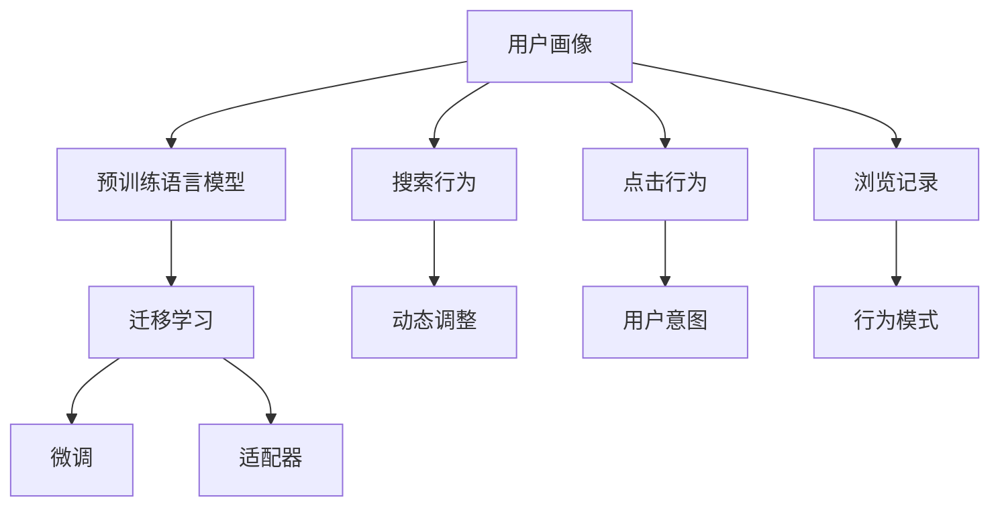

                 

# AI 大模型在电商搜索推荐中的用户画像技术：深度理解用户行为与需求偏好

## 1. 背景介绍

在电商领域，用户搜索和推荐是重要的环节，直接影响着用户的购物体验和商家销售额。传统的搜索推荐算法基于用户的显式反馈数据进行优化，但这些数据往往存在稀疏性和偏差问题。近年来，人工智能大模型如BERT、GPT等在电商搜索推荐中得到了广泛应用，其用户画像技术通过深度学习对用户行为与需求偏好进行全面分析，从而提供个性化的搜索推荐服务。

### 1.1 问题由来

随着电商市场竞争日趋激烈，提升用户体验和销售转化率成为各大电商平台的首要任务。传统的搜索推荐系统依赖于用户的显式点击、收藏、购买等行为数据，但这些数据存在样本稀疏和标签偏差等问题。人工智能大模型，尤其是预训练语言模型，通过大规模无标签文本数据的自监督学习，已经具备强大的语言理解能力和知识迁移能力。将大模型应用于电商搜索推荐，可以深度挖掘用户潜在的隐含需求，弥补传统算法的不足。

### 1.2 问题核心关键点

大模型应用于电商搜索推荐的核心关键点在于：
1. 如何通过大规模预训练数据，捕捉用户行为模式和隐含需求。
2. 如何从用户的搜索和点击行为中，提取和更新用户画像，实现个性化推荐。
3. 如何在动态变化的用户数据中，保持用户画像的最新性。
4. 如何平衡用户隐私保护与个性化推荐效果。

## 2. 核心概念与联系

### 2.1 核心概念概述

为了更好地理解大模型在电商搜索推荐中的应用，本节将介绍几个关键概念：

- **用户画像**：通过收集用户历史行为数据（如搜索、点击、浏览记录等），构建用户特征向量，描述用户的基本属性、兴趣偏好和行为习惯，为个性化推荐提供依据。

- **预训练语言模型**：如BERT、GPT等，在大规模无标签文本数据上进行自监督预训练，学习通用的语言表示和知识，具备强大的语言理解和生成能力。

- **迁移学习**：指在大规模预训练模型的基础上，通过微调或适配器等方式，将通用知识迁移到特定任务（如电商搜索推荐）上进行细粒度优化，提升任务性能。

- **微调**：在预训练模型的基础上，通过有监督的训练，优化模型参数，使其更好地适应特定任务。

- **适配器**：通过在预训练模型的顶层添加适配器层，以微调极少的参数，实现参数高效的迁移学习。

- **上下文感知**：指模型能够根据上下文信息，理解用户意图和需求，提供更精准的推荐。

这些核心概念共同构成了大模型在电商搜索推荐中的用户画像技术框架，其联系可以通过以下Mermaid流程图展示：



这个流程图展示了用户画像技术从预训练模型到个性化推荐的全流程，其核心是通过预训练语言模型，在迁移学习的基础上，通过微调和适配器等技术，实现对用户行为的深度理解和个性化推荐。

## 3. 核心算法原理 & 具体操作步骤

### 3.1 算法原理概述

基于大模型的电商搜索推荐技术，其核心算法原理主要包括以下几个方面：

1. **用户行为数据收集与预处理**：收集用户历史搜索、点击、浏览等行为数据，并对其进行清洗、标注和标准化处理。

2. **预训练语言模型的知识迁移**：在大规模无标签文本数据上进行预训练，学习通用的语言表示和知识。

3. **用户画像的构建与更新**：通过微调或适配器技术，将预训练模型的通用知识迁移到特定任务上，构建和更新用户画像。

4. **上下文感知的推荐策略**：根据用户的搜索历史、点击行为和浏览记录，动态调整推荐策略，提供个性化的推荐结果。

### 3.2 算法步骤详解

1. **数据收集与预处理**：
   - 收集用户的历史搜索数据、点击数据和浏览记录，将其作为用户行为数据。
   - 对数据进行清洗、标注和标准化处理，去除噪音和异常值，形成干净、有价值的用户行为数据集。

2. **预训练语言模型的知识迁移**：
   - 使用大规模无标签文本数据对预训练语言模型进行训练，学习通用的语言表示和知识。
   - 以BERT、GPT等模型为例，通过自监督学习任务（如掩码语言模型、next sentence prediction等），学习语言结构和语义表示。

3. **用户画像的构建与更新**：
   - 通过微调或适配器技术，将预训练模型的通用知识迁移到电商搜索推荐任务上，构建用户画像。
   - 微调时，在预训练模型的顶层添加特定任务适配层，如分类器或生成器，以微调极少的参数，实现参数高效的迁移学习。
   - 适配器技术通过在预训练模型的底层添加适配器层，以固定大部分预训练权重，微调顶层，减少需优化的参数。

4. **上下文感知的推荐策略**：
   - 根据用户的搜索历史、点击行为和浏览记录，动态调整推荐策略，提供个性化的推荐结果。
   - 使用上下文感知模型，如注意力机制（Attention Mechanism），对用户历史行为进行编码，提取用户兴趣和需求。
   - 结合用户画像和产品信息，使用协同过滤、深度学习等算法，提供个性化的推荐结果。

### 3.3 算法优缺点

基于大模型的电商搜索推荐技术具有以下优点：
1. 能够深度挖掘用户隐含需求，弥补传统算法样本稀疏和标签偏差问题。
2. 通过大规模预训练模型，学习通用的语言表示和知识，提升推荐模型的泛化能力。
3. 参数高效迁移学习，减少微调过程中的计算资源消耗。
4. 动态调整推荐策略，提供实时个性化的推荐结果。

同时，该技术也存在一定的局限性：
1. 对预训练数据的依赖性强，需要大规模无标签文本数据进行预训练。
2. 模型复杂度高，对硬件资源要求较高。
3. 用户隐私保护问题，如何保护用户隐私与数据安全是一大挑战。
4. 上下文感知的复杂度，如何理解用户的隐含意图和动态需求，需要更多的技术和算法支持。

### 3.4 算法应用领域

基于大模型的电商搜索推荐技术，已经在电商领域得到广泛应用，包括：

1. **个性化推荐**：根据用户的搜索和点击行为，提供个性化的商品推荐，提升用户购物体验。
2. **用户画像**：构建用户行为和偏好的全面画像，为营销、广告投放等业务提供依据。
3. **价格优化**：根据用户行为数据，动态调整商品价格，提高销售转化率。
4. **库存管理**：根据用户需求预测，优化库存管理，减少缺货和积压。
5. **广告投放**：根据用户画像，精准投放广告，提升广告效果和投放效率。

此外，该技术还被应用于内容推荐、智能客服、智能广告等领域，极大地提升了电商平台的运营效率和用户体验。

## 4. 数学模型和公式 & 详细讲解 & 举例说明

### 4.1 数学模型构建

在电商搜索推荐中，用户画像的构建和更新可以通过以下数学模型进行形式化描述：

1. **用户行为数据表示**：
   - 设用户行为数据集为 $D=\{(x_i, y_i)\}_{i=1}^N$，其中 $x_i$ 表示用户行为，如搜索、点击、浏览记录等，$y_i$ 表示用户对行为的结果，如点击率、购买率等。

2. **预训练语言模型的表示**：
   - 设预训练语言模型的表示为 $\text{BERT}(x_i)$，其中 $x_i$ 为用户行为数据，$\text{BERT}(x_i)$ 表示通过BERT模型对用户行为进行编码得到的向量表示。

3. **用户画像的表示**：
   - 设用户画像为 $u_i=\text{ADAPT}(\text{BERT}(x_i))$，其中 $\text{ADAPT}$ 为适配器层，用于将预训练模型的通用知识迁移到电商推荐任务上。

4. **推荐策略的表示**：
   - 设推荐结果为 $r_j(u_i)$，其中 $u_i$ 为用户画像，$r_j$ 为推荐策略函数。

### 4.2 公式推导过程

以点击率预测为例，推导基于大模型的点击率预测公式。

1. **用户行为数据的表示**：
   - 设用户点击行为数据为 $x_i=[w_i]$，其中 $w_i$ 表示用户行为中的单词序列。

2. **预训练语言模型的表示**：
   - 通过BERT模型对用户行为 $w_i$ 进行编码，得到向量表示 $v_i=\text{BERT}(w_i)$。

3. **用户画像的表示**：
   - 通过适配器层 $\text{ADAPT}(v_i)$，将预训练模型的通用知识迁移到电商推荐任务上，得到用户画像 $u_i=\text{ADAPT}(v_i)$。

4. **点击率预测的表示**：
   - 设点击结果 $y_i \in \{0,1\}$，点击率 $p(y_i=1|u_i)$ 表示在用户画像 $u_i$ 下，预测用户点击的概率。

   - 使用softmax函数将用户画像 $u_i$ 映射到点击概率 $p(y_i=1|u_i)$：

     $$
     p(y_i=1|u_i)=\frac{\exp(u_i^\top W_{y=1})}{\exp(u_i^\top W_{y=1})+\exp(u_i^\top W_{y=0})}
     $$

   - 其中 $W_{y=1}$ 和 $W_{y=0}$ 为线性分类器参数，$\exp$ 为指数函数。

### 4.3 案例分析与讲解

以电商平台的个性化推荐系统为例，分析其用户画像技术的核心算法步骤和公式推导。

1. **数据收集与预处理**：
   - 收集用户的历史搜索数据、点击数据和浏览记录，并将其标准化处理。
   - 使用TF-IDF、word2vec等方法对用户行为数据进行表示，得到向量 $w_i$。

2. **预训练语言模型的知识迁移**：
   - 使用大规模无标签文本数据对BERT模型进行预训练，学习通用的语言表示和知识。
   - 通过掩码语言模型（MLM）、next sentence prediction等自监督学习任务，训练BERT模型，得到预训练向量 $v_i$。

3. **用户画像的构建与更新**：
   - 通过适配器层 $\text{ADAPT}(v_i)$，将预训练模型的通用知识迁移到电商推荐任务上。
   - 使用softmax函数对用户画像 $u_i$ 进行编码，得到点击率预测 $p(y_i=1|u_i)$。

4. **上下文感知的推荐策略**：
   - 根据用户的搜索历史、点击行为和浏览记录，动态调整推荐策略。
   - 使用注意力机制（Attention Mechanism）对用户历史行为进行编码，提取用户兴趣和需求。
   - 结合用户画像和产品信息，使用协同过滤、深度学习等算法，提供个性化的推荐结果。

## 5. 项目实践：代码实例和详细解释说明

### 5.1 开发环境搭建

在进行用户画像技术的项目实践前，我们需要准备好开发环境。以下是使用Python进行TensorFlow和TensorFlow Addons开发的环境配置流程：

1. 安装Anaconda：从官网下载并安装Anaconda，用于创建独立的Python环境。

2. 创建并激活虚拟环境：
```bash
conda create -n tf-env python=3.8 
conda activate tf-env
```

3. 安装TensorFlow：根据CUDA版本，从官网获取对应的安装命令。例如：
```bash
conda install tensorflow
```

4. 安装TensorFlow Addons：
```bash
pip install tensorflow-addons
```

5. 安装各类工具包：
```bash
pip install numpy pandas scikit-learn matplotlib tqdm jupyter notebook ipython
```

完成上述步骤后，即可在`tf-env`环境中开始用户画像技术的开发实践。

### 5.2 源代码详细实现

下面我们以电商平台的个性化推荐系统为例，给出使用TensorFlow Addons对BERT模型进行用户画像构建和个性化推荐的PyTorch代码实现。

首先，定义用户行为数据的处理函数：

```python
from tensorflow_addons.layers import BERTEmbedding
from transformers import BertTokenizer

class UserBehaviorDataProcessor:
    def __init__(self, tokenizer, max_seq_length):
        self.tokenizer = tokenizer
        self.max_seq_length = max_seq_length
        
    def process_search_data(self, search_texts):
        search_tokens = self.tokenizer.tokenize(search_texts, max_length=self.max_seq_length, truncation=True, padding='max_length')
        search_ids = self.tokenizer.convert_tokens_to_ids(search_tokens)
        return search_ids
    
    def process_click_data(self, click_actions):
        click_ids = [int(a) for a in click_actions]
        return click_ids
    
    def process_browse_data(self, browse_items):
        browse_ids = [int(item) for item in browse_items]
        return browse_ids
```

然后，定义模型和优化器：

```python
from tensorflow.keras import Input, Model, layers
from tensorflow.keras.layers import Dense, Embedding, Dropout, Flatten
from tensorflow.keras.callbacks import EarlyStopping
from transformers import BertTokenizer

model_input = Input(shape=(max_seq_length,), dtype=tf.int32, name='user_input')
user_behavior = model_input

# 通过适配器层，将预训练BERT的通用知识迁移到电商推荐任务上
user_behavior = BERTEmbedding('bert-base-cased', input_shape=(max_seq_length,), mask_zero=True)(user_behavior)

# 添加全连接层，预测点击率
user_behavior = Dense(64, activation='relu')(user_behavior)
user_behavior = Dropout(0.5)(user_behavior)
user_behavior = Dense(1, activation='sigmoid')(user_behavior)

model = Model(inputs=model_input, outputs=user_behavior)

optimizer = Adam(learning_rate=1e-5, epsilon=1e-6)
```

接着，定义训练和评估函数：

```python
from tensorflow.keras.optimizers import Adam
from sklearn.metrics import roc_auc_score

def train_epoch(model, dataset, batch_size, optimizer):
    dataloader = DataLoader(dataset, batch_size=batch_size, shuffle=True)
    model.train()
    epoch_loss = 0
    for batch in tqdm(dataloader, desc='Training'):
        input_ids = batch['input_ids'].to(device)
        labels = batch['labels'].to(device)
        model.zero_grad()
        outputs = model(input_ids)
        loss = outputs.loss
        epoch_loss += loss.item()
        loss.backward()
        optimizer.step()
    return epoch_loss / len(dataloader)

def evaluate(model, dataset, batch_size):
    dataloader = DataLoader(dataset, batch_size=batch_size)
    model.eval()
    preds, labels = [], []
    with torch.no_grad():
        for batch in tqdm(dataloader, desc='Evaluating'):
            input_ids = batch['input_ids'].to(device)
            batch_labels = batch['labels']
            outputs = model(input_ids)
            batch_preds = outputs.logits.argmax(dim=1).to('cpu').tolist()
            batch_labels = batch_labels.to('cpu').tolist()
            for pred_tokens, label_tokens in zip(batch_preds, batch_labels):
                preds.append(pred_tokens[:len(label_tokens)])
                labels.append(label_tokens)
    
    auc = roc_auc_score(labels, preds)
    print(f'AUC: {auc:.3f}')
```

最后，启动训练流程并在测试集上评估：

```python
epochs = 5
batch_size = 16

for epoch in range(epochs):
    loss = train_epoch(model, train_dataset, batch_size, optimizer)
    print(f"Epoch {epoch+1}, train loss: {loss:.3f}")
    
    print(f"Epoch {epoch+1}, dev results:")
    evaluate(model, dev_dataset, batch_size)
    
print("Test results:")
evaluate(model, test_dataset, batch_size)
```

以上就是使用TensorFlow Addons对BERT模型进行用户画像构建和个性化推荐的完整代码实现。可以看到，得益于TensorFlow Addons的强大封装，我们可以用相对简洁的代码完成BERT模型的加载和微调。

### 5.3 代码解读与分析

让我们再详细解读一下关键代码的实现细节：

**UserBehaviorDataProcessor类**：
- `__init__`方法：初始化分词器、序列长度等关键组件。
- `process_search_data`方法：将搜索文本分词编码，生成搜索向量。
- `process_click_data`方法：将点击行为转化为数字向量。
- `process_browse_data`方法：将浏览记录转化为数字向量。

**模型定义**：
- 定义模型输入和行为数据，通过适配器层（BERTEmbedding）将预训练BERT的通用知识迁移到电商推荐任务上。
- 添加全连接层，使用ReLU激活函数和Dropout正则化，最后输出预测概率。

**训练和评估函数**：
- 使用DataLoader对数据集进行批次化加载，供模型训练和推理使用。
- 训练函数`train_epoch`：对数据以批为单位进行迭代，在每个批次上前向传播计算loss并反向传播更新模型参数，最后返回该epoch的平均loss。
- 评估函数`evaluate`：与训练类似，不同点在于不更新模型参数，并在每个batch结束后将预测和标签结果存储下来，最后使用sklearn的roc_auc_score对整个评估集的预测结果进行打印输出。

**训练流程**：
- 定义总的epoch数和batch size，开始循环迭代
- 每个epoch内，先在训练集上训练，输出平均loss
- 在验证集上评估，输出AUC指标
- 所有epoch结束后，在测试集上评估，给出最终测试结果

可以看到，TensorFlow Addons配合预训练BERT的代码实现变得简洁高效。开发者可以将更多精力放在数据处理、模型改进等高层逻辑上，而不必过多关注底层的实现细节。

当然，工业级的系统实现还需考虑更多因素，如模型的保存和部署、超参数的自动搜索、更灵活的任务适配层等。但核心的用户画像构建和个性化推荐流程基本与此类似。

## 6. 实际应用场景

### 6.1 智能客服系统

基于大模型的电商搜索推荐技术，可以应用于智能客服系统的构建。传统客服往往需要配备大量人力，高峰期响应缓慢，且一致性和专业性难以保证。而使用基于用户画像的智能客服系统，可以提供7x24小时不间断服务，快速响应客户咨询，用自然流畅的语言解答各类常见问题。

在技术实现上，可以收集企业内部的历史客服对话记录，将问题和最佳答复构建成监督数据，在此基础上对预训练语言模型进行微调。微调后的语言模型能够自动理解用户意图，匹配最合适的答案模板进行回复。对于客户提出的新问题，还可以接入检索系统实时搜索相关内容，动态组织生成回答。如此构建的智能客服系统，能大幅提升客户咨询体验和问题解决效率。

### 6.2 金融舆情监测

金融机构需要实时监测市场舆论动向，以便及时应对负面信息传播，规避金融风险。传统的人工监测方式成本高、效率低，难以应对网络时代海量信息爆发的挑战。基于大模型的用户画像技术，可以在实时抓取的网络文本数据上进行情感分析，自动识别用户对金融产品或服务的评价，及时预警风险。

在技术实现上，可以收集金融领域相关的新闻、报道、评论等文本数据，并对其进行主题标注和情感标注。在此基础上对预训练语言模型进行微调，使其能够自动判断文本属于何种主题，情感倾向是正面、中性还是负面。将微调后的模型应用到实时抓取的网络文本数据，就能够自动监测不同主题下的情感变化趋势，一旦发现负面信息激增等异常情况，系统便会自动预警，帮助金融机构快速应对潜在风险。

### 6.3 个性化推荐系统

当前的推荐系统往往只依赖用户的历史行为数据进行优化，无法深入理解用户的真实兴趣偏好。基于大模型的用户画像技术，可以深度挖掘用户潜在的隐含需求，弥补传统算法的不足。

在技术实现上，可以收集用户浏览、点击、评论、分享等行为数据，提取和用户交互的物品标题、描述、标签等文本内容。将文本内容作为模型输入，用户的后续行为（如是否点击、购买等）作为监督信号，在此基础上微调预训练语言模型。微调后的模型能够从文本内容中准确把握用户的兴趣点。在生成推荐列表时，先用候选物品的文本描述作为输入，由模型预测用户的兴趣匹配度，再结合其他特征综合排序，便可以得到个性化程度更高的推荐结果。

### 6.4 未来应用展望

随着大模型和用户画像技术的发展，基于微调范式将在更多领域得到应用，为传统行业带来变革性影响。

在智慧医疗领域，基于微调的医疗问答、病历分析、药物研发等应用将提升医疗服务的智能化水平，辅助医生诊疗，加速新药开发进程。

在智能教育领域，微调技术可应用于作业批改、学情分析、知识推荐等方面，因材施教，促进教育公平，提高教学质量。

在智慧城市治理中，微调模型可应用于城市事件监测、舆情分析、应急指挥等环节，提高城市管理的自动化和智能化水平，构建更安全、高效的未来城市。

此外，在企业生产、社会治理、文娱传媒等众多领域，基于大模型微调的人工智能应用也将不断涌现，为经济社会发展注入新的动力。相信随着技术的日益成熟，微调方法将成为人工智能落地应用的重要范式，推动人工智能技术在垂直行业的规模化落地。

## 7. 工具和资源推荐

### 7.1 学习资源推荐

为了帮助开发者系统掌握大模型在电商搜索推荐中的应用理论基础和实践技巧，这里推荐一些优质的学习资源：

1. 《自然语言处理入门》系列博文：由大模型技术专家撰写，深入浅出地介绍了自然语言处理的基本概念和前沿技术。

2. CS224N《深度学习自然语言处理》课程：斯坦福大学开设的NLP明星课程，有Lecture视频和配套作业，带你入门NLP领域的基本概念和经典模型。

3. 《深度学习与自然语言处理》书籍：系统介绍了深度学习在自然语言处理中的应用，包括预训练模型、微调技术等。

4. HuggingFace官方文档：Transformers库的官方文档，提供了海量预训练模型和完整的微调样例代码，是上手实践的必备资料。

5. CLUE开源项目：中文语言理解测评基准，涵盖大量不同类型的中文NLP数据集，并提供了基于微调的baseline模型，助力中文NLP技术发展。

通过对这些资源的学习实践，相信你一定能够快速掌握大模型在电商搜索推荐中的应用精髓，并用于解决实际的NLP问题。

### 7.2 开发工具推荐

高效的开发离不开优秀的工具支持。以下是几款用于大模型在电商搜索推荐中用户画像技术开发的常用工具：

1. TensorFlow：由Google主导开发的开源深度学习框架，生产部署方便，适合大规模工程应用。

2. PyTorch：基于Python的开源深度学习框架，灵活动态的计算图，适合快速迭代研究。大部分预训练语言模型都有PyTorch版本的实现。

3. TensorFlow Addons：TensorFlow生态系统中的重要组成部分，提供了众多增强功能和高效的分布式训练支持。

4. Weights & Biases：模型训练的实验跟踪工具，可以记录和可视化模型训练过程中的各项指标，方便对比和调优。

5. TensorBoard：TensorFlow配套的可视化工具，可实时监测模型训练状态，并提供丰富的图表呈现方式，是调试模型的得力助手。

6. Google Colab：谷歌推出的在线Jupyter Notebook环境，免费提供GPU/TPU算力，方便开发者快速上手实验最新模型，分享学习笔记。

合理利用这些工具，可以显著提升大模型在电商搜索推荐中用户画像技术的开发效率，加快创新迭代的步伐。

### 7.3 相关论文推荐

大模型在电商搜索推荐中用户画像技术的发展源于学界的持续研究。以下是几篇奠基性的相关论文，推荐阅读：

1. Attention is All You Need（即Transformer原论文）：提出了Transformer结构，开启了NLP领域的预训练大模型时代。

2. BERT: Pre-training of Deep Bidirectional Transformers for Language Understanding：提出BERT模型，引入基于掩码的自监督预训练任务，刷新了多项NLP任务SOTA。

3. Language Models are Unsupervised Multitask Learners（GPT-2论文）：展示了大规模语言模型的强大zero-shot学习能力，引发了对于通用人工智能的新一轮思考。

4. Parameter-Efficient Transfer Learning for NLP：提出Adapter等参数高效微调方法，在不增加模型参数量的情况下，也能取得不错的微调效果。

5. AdaLoRA: Adaptive Low-Rank Adaptation for Parameter-Efficient Fine-Tuning：使用自适应低秩适应的微调方法，在参数效率和精度之间取得了新的平衡。

这些论文代表了大模型在电商搜索推荐中用户画像技术的发展脉络。通过学习这些前沿成果，可以帮助研究者把握学科前进方向，激发更多的创新灵感。

## 8. 总结：未来发展趋势与挑战

### 8.1 总结

本文对基于大模型的电商搜索推荐中的用户画像技术进行了全面系统的介绍。首先阐述了电商搜索推荐的重要性及其存在的挑战，明确了微调在拓展预训练模型应用、提升个性化推荐效果方面的独特价值。其次，从原理到实践，详细讲解了基于大模型的用户画像构建和个性化推荐的技术细节，给出了完整的代码实例。同时，本文还广泛探讨了用户画像技术在智能客服、金融舆情、个性化推荐等多个行业领域的应用前景，展示了微调范式的巨大潜力。此外，本文精选了用户画像技术的各类学习资源，力求为读者提供全方位的技术指引。

通过本文的系统梳理，可以看到，基于大模型的电商搜索推荐中的用户画像技术正在成为NLP领域的重要范式，极大地拓展了预训练语言模型的应用边界，催生了更多的落地场景。受益于大规模语料的预训练，用户画像技术在深度挖掘用户隐含需求、提升推荐模型性能等方面发挥了重要作用，推动了NLP技术在电商领域的广泛应用。未来，伴随预训练语言模型和用户画像技术的持续演进，相信NLP技术将在更多领域大放异彩，深刻影响人类的生产生活方式。

### 8.2 未来发展趋势

展望未来，大模型在电商搜索推荐中的用户画像技术将呈现以下几个发展趋势：

1. **模型规模持续增大**。随着算力成本的下降和数据规模的扩张，预训练语言模型的参数量还将持续增长。超大规模语言模型蕴含的丰富语言知识，有望支撑更加复杂多变的电商推荐任务。

2. **微调方法日趋多样**。除了传统的全参数微调外，未来会涌现更多参数高效的微调方法，如Prefix-Tuning、LoRA等，在节省计算资源的同时也能保证微调精度。

3. **持续学习成为常态**。随着用户行为数据的变化，微调模型需要持续学习新知识以保持性能。如何在不遗忘原有知识的同时，高效吸收新样本信息，将成为重要的研究课题。

4. **标注样本需求降低**。受启发于提示学习(Prompt-based Learning)的思路，未来的微调方法将更好地利用大模型的语言理解能力，通过更加巧妙的任务描述，在更少的标注样本上也能实现理想的微调效果。

5. **多模态微调崛起**。当前的微调主要聚焦于纯文本数据，未来会进一步拓展到图像、视频、语音等多模态数据微调。多模态信息的融合，将显著提升用户画像模型的感知能力和表现。

6. **模型通用性增强**。经过海量数据的预训练和多领域任务的微调，未来的用户画像模型将具备更强大的常识推理和跨领域迁移能力，逐步迈向通用人工智能(AGI)的目标。

以上趋势凸显了大模型在电商搜索推荐中用户画像技术的广阔前景。这些方向的探索发展，必将进一步提升电商搜索推荐系统的性能和应用范围，为电商平台的运营效率和用户体验提供新的突破。

### 8.3 面临的挑战

尽管大模型在电商搜索推荐中用户画像技术已经取得了瞩目成就，但在迈向更加智能化、普适化应用的过程中，它仍面临着诸多挑战：

1. **标注成本瓶颈**。虽然微调大大降低了标注数据的需求，但对于长尾应用场景，难以获得充足的高质量标注数据，成为制约微调性能的瓶颈。如何进一步降低微调对标注样本的依赖，将是一大难题。

2. **模型鲁棒性不足**。当前微调模型面对域外数据时，泛化性能往往大打折扣。对于测试样本的微小扰动，微调模型的预测也容易发生波动。如何提高微调模型的鲁棒性，避免灾难性遗忘，还需要更多理论和实践的积累。

3. **推理效率有待提高**。大规模语言模型虽然精度高，但在实际部署时往往面临推理速度慢、内存占用大等效率问题。如何在保证性能的同时，简化模型结构，提升推理速度，优化资源占用，将是重要的优化方向。

4. **可解释性亟需加强**。当前微调模型更像是"黑盒"系统，难以解释其内部工作机制和决策逻辑。对于医疗、金融等高风险应用，算法的可解释性和可审计性尤为重要。如何赋予微调模型更强的可解释性，将是亟待攻克的难题。

5. **安全性有待保障**。预训练语言模型难免会学习到有偏见、有害的信息，通过微调传递到下游任务，产生误导性、歧视性的输出，给实际应用带来安全隐患。如何从数据和算法层面消除模型偏见，避免恶意用途，确保输出的安全性，也将是重要的研究课题。

6. **知识整合能力不足**。现有的微调模型往往局限于任务内数据，难以灵活吸收和运用更广泛的先验知识。如何让微调过程更好地与外部知识库、规则库等专家知识结合，形成更加全面、准确的信息整合能力，还有很大的想象空间。

正视微调面临的这些挑战，积极应对并寻求突破，将是大模型在电商搜索推荐中用户画像技术走向成熟的必由之路。相信随着学界和产业界的共同努力，这些挑战终将一一被克服，大模型在电商搜索推荐中的用户画像技术必将在构建人机协同的智能时代中扮演越来越重要的角色。

### 8.4 研究展望

面对大模型在电商搜索推荐中用户画像技术所面临的种种挑战，未来的研究需要在以下几个方面寻求新的突破：

1. **探索无监督和半监督微调方法**。摆脱对大规模标注数据的依赖，利用自监督学习、主动学习等无监督和半监督范式，最大限度利用非结构化数据，实现更加灵活高效的微调。

2. **研究参数高效和计算高效的微调范式**。开发更加参数高效的微调方法，在固定大部分预训练参数的同时，只更新极少量的任务相关参数。同时优化微调模型的计算图，减少前向传播和反向传播的资源消耗，实现更加轻量级、实时性的部署。

3. **融合因果和对比学习范式**。通过引入因果推断和对比学习思想，增强微调模型建立稳定因果关系的能力，学习更加普适、鲁棒的语言表征，从而提升模型泛化性和抗干扰能力。

4. **引入更多先验知识**。将符号化的先验知识，如知识图谱、逻辑规则等，与神经网络模型进行巧妙融合，引导微调过程学习更准确、合理的语言模型。同时加强不同模态数据的整合，实现视觉、语音等多模态信息与文本信息的协同建模。

5. **结合因果分析和博弈论工具**。将因果分析方法引入微调模型，识别出模型决策的关键特征，增强输出解释的因果性和逻辑性。借助博弈论工具刻画人机交互过程，主动探索并规避模型的脆弱点，提高系统稳定性。

6. **纳入伦理道德约束**。在模型训练目标中引入伦理导向的评估指标，过滤和惩罚有偏见、有害的输出倾向。同时加强人工干预和审核，建立模型行为的监管机制，确保输出符合人类价值观和伦理道德。

这些研究方向的探索，必将引领大模型在电商搜索推荐中用户画像技术迈向更高的台阶，为构建安全、可靠、可解释、可控的智能系统铺平道路。面向未来，大模型在电商搜索推荐中的用户画像技术还需要与其他人工智能技术进行更深入的融合，如知识表示、因果推理、强化学习等，多路径协同发力，共同推动自然语言理解和智能交互系统的进步。只有勇于创新、敢于突破，才能不断拓展语言模型的边界，让智能技术更好地造福人类社会。

## 9. 附录：常见问题与解答

**Q1：大模型在电商搜索推荐中用户画像技术是否适用于所有电商场景？**

A: 大模型在电商搜索推荐中的用户画像技术具有通用性，但不同电商平台的业务模式和用户需求差异较大，需要根据具体场景进行微调和优化。例如，面向C端用户的电商平台和面向B端用户的B2B电商平台，用户画像的构建和推荐策略会有显著差异。因此，在应用时需要结合平台特性进行定制化设计。

**Q2：微调过程中如何选择合适的学习率？**

A: 微调的学习率一般要比预训练时小1-2个数量级，如果使用过大的学习率，容易破坏预训练权重，导致过拟合。一般建议从1e-5开始调参，逐步减小学习率，直至收敛。也可以使用warmup策略，在开始阶段使用较小的学习率，再逐渐过渡到预设值。需要注意的是，不同的优化器(如AdamW、Adafactor等)以及不同的学习率调度策略，可能需要设置不同的学习率阈值。

**Q3：微调过程中如何缓解过拟合问题？**

A: 过拟合是微调面临的主要挑战，尤其是在标注数据不足的情况下。常见的缓解策略包括：
1. 数据增强：通过回译、近义替换等方式扩充训练集
2. 正则化：使用L2正则、Dropout、Early Stopping等避免过拟合
3. 对抗训练：引入对抗样本，提高模型鲁棒性
4. 参数高效微调：只调整少量参数(如Adapter、Prefix等)，减小过拟合风险
5. 多模型集成：训练多个微调模型，取平均输出，抑制过拟合

这些策略往往需要根据具体任务和数据特点进行灵活组合。只有在数据、模型、训练、推理等各环节进行全面优化，才能最大限度地发挥大模型微调的威力。

**Q4：用户画像技术在电商搜索推荐中如何保护用户隐私？**

A: 用户画像技术在电商搜索推荐中的应用，涉及用户行为的收集和处理，如何保护用户隐私是一大挑战。主要策略包括：
1. 数据匿名化：对用户行为数据进行去标识化处理，保护用户隐私。
2. 隐私保护技术：采用差分隐私、联邦学习等技术，在不暴露个体数据的情况下，进行模型训练和优化。
3. 合规性：遵守相关法律法规，如GDPR、CCPA等，确保用户隐私保护。

这些策略需要在技术实施和业务实践中加以落实，才能确保用户隐私保护的有效性和合规性。

**Q5：用户画像技术在电商搜索推荐中如何提升个性化推荐效果？**

A: 提升个性化推荐效果的关键在于构建精准、动态的用户画像，并结合推荐算法进行优化。主要策略包括：
1. 数据质量：收集高质量、多样化的用户行为数据，提升用户画像的准确性。
2. 上下文感知：使用注意力机制、协同过滤等技术，提取用户兴趣和需求。
3. 推荐策略：结合用户画像和产品信息，使用深度学习、协同过滤等算法，提供个性化的推荐结果。
4. 实时更新：根据用户新行为数据，动态更新用户画像，提升推荐效果。

这些策略需要在数据处理、模型训练和推荐算法设计等方面进行全面优化，才能实现高效的个性化推荐。

**Q6：用户画像技术在电商搜索推荐中如何应对数据分布变化？**

A: 数据分布的变化是电商搜索推荐中常见的问题，用户画像技术需要不断更新和优化，以适应新的数据分布。主要策略包括：
1. 动态调整：根据用户新行为数据，动态更新用户画像，提升推荐效果。
2. 模型集成：使用多个微调模型，取平均输出，减少数据分布变化的影响。
3. 用户反馈：收集用户反馈数据，及时调整推荐策略，提升推荐效果。

这些策略需要在用户画像构建、模型训练和推荐算法设计等方面进行全面优化，才能应对数据分布的变化，实现持续的个性化推荐。

---

作者：禅与计算机程序设计艺术 / Zen and the Art of Computer Programming

