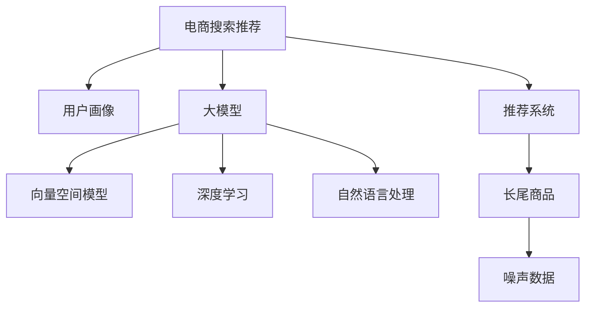

                 

# AI 大模型在电商搜索推荐中的用户画像构建：精准把握用户需求与行为偏好

> 关键词：电商搜索推荐,大模型,用户画像,精准推荐,自然语言处理(NLP),深度学习,向量空间模型(VSM)

## 1. 背景介绍

### 1.1 问题由来
随着电子商务的迅猛发展，商品种类繁多，用户需求日益个性化，如何提供个性化的购物体验，成为电商平台的核心竞争力之一。传统的推荐系统往往依赖于用户的显式行为数据，如浏览、点击、购买等，但这些数据稀疏且难以全面覆盖用户偏好。而用户搜索行为则提供了丰富的隐式数据，用户通过搜索关键词表达了其潜在的需求和兴趣。

近年来，大模型在自然语言处理(NLP)领域取得了巨大突破。大模型如GPT、BERT、RoBERTa等，通过在海量文本语料上进行预训练，具备了强大的语言理解和生成能力。利用大模型进行电商搜索推荐，可以充分利用搜索关键词的隐式数据，精准把握用户需求和行为偏好，提升推荐效果。

### 1.2 问题核心关键点
大模型在电商搜索推荐中的应用，核心在于基于用户搜索关键词构建用户画像，进而实现精准的推荐。具体而言，包括以下几个关键点：
1. 如何通过用户搜索关键词，构建精准的用户画像。
2. 如何利用用户画像，进行个性化商品推荐。
3. 如何处理长尾商品，提升推荐系统的覆盖范围。
4. 如何处理噪声数据，提高推荐系统的鲁棒性。

本文将从这些核心问题出发，系统介绍如何利用大模型进行电商搜索推荐，并在此基础上构建精准的用户画像。

## 2. 核心概念与联系

### 2.1 核心概念概述

为更好地理解基于大模型的电商搜索推荐方法，本节将介绍几个密切相关的核心概念：

- **电商搜索推荐**：通过分析用户的搜索行为数据，构建用户画像，为用户推荐可能感兴趣的商品或服务。
- **用户画像**：基于用户的历史行为和兴趣，构建用户特征向量，用于刻画用户需求和行为偏好。
- **大模型**：以自回归(如GPT)或自编码(如BERT)模型为代表的深度学习模型，通过在海量文本语料上进行预训练，学习通用的语言表示。
- **向量空间模型(VSM)**：将文本数据映射到向量空间，通过计算向量之间的相似度，进行文本匹配和检索。
- **深度学习**：基于神经网络的机器学习方法，能够自动学习特征表示，处理高维数据。
- **自然语言处理(NLP)**：涉及自然语言理解和生成，利用大模型提升NLP任务的效果，如文本分类、情感分析等。
- **推荐系统**：根据用户的历史行为和兴趣，推荐可能感兴趣的商品或服务，提升用户体验和满意度。
- **长尾商品**：指那些不太受欢迎，但用户可能需要的商品，需要推荐系统能够覆盖这些商品。

这些核心概念之间的逻辑关系可以通过以下Mermaid流程图来展示：



这个流程图展示了大模型在电商搜索推荐中的应用框架：

1. 电商搜索推荐系统利用大模型进行文本匹配和特征提取。
2. 用户画像的构建基于大模型提取的用户特征。
3. 推荐系统通过用户画像，为用户推荐可能感兴趣的商品。
4. 长尾商品覆盖和噪声数据处理，提升推荐系统的鲁棒性。

## 3. 核心算法原理 & 具体操作步骤
### 3.1 算法原理概述

基于大模型的电商搜索推荐，本质上是一个深度学习范式下的信息检索和个性化推荐过程。其核心思想是：通过大模型的预训练能力，提取用户搜索关键词的语义信息，构建用户画像，进而进行个性化推荐。

具体而言，假设有 $M$ 个用户，$N$ 个商品，用户搜索关键词为 $\mathbf{x}_1,\mathbf{x}_2,\cdots,\mathbf{x}_M$，商品标签为 $\mathbf{y}_1,\mathbf{y}_2,\cdots,\mathbf{y}_N$。模型首先通过预训练大模型 $M_{\theta}$，将搜索关键词和商品标签映射到低维向量空间中，得到用户画像 $\mathbf{p}_M$ 和商品特征向量 $\mathbf{v}_N$。然后，通过计算用户画像与商品特征向量之间的相似度 $\mathbf{p}_M \cdot \mathbf{v}_i$，推荐与用户画像最匹配的商品。

### 3.2 算法步骤详解

基于大模型的电商搜索推荐系统一般包括以下几个关键步骤：

**Step 1: 准备预训练模型和数据集**
- 选择合适的预训练大模型 $M_{\theta}$，如BERT、GPT等。
- 准备电商领域的搜索关键词和商品标签数据集，划分为训练集、验证集和测试集。

**Step 2: 构建向量空间模型**
- 对搜索关键词和商品标签进行分词、去除停用词、词向量化等预处理。
- 使用TF-IDF、词嵌入等方法将文本数据映射到向量空间中。
- 计算文本向量之间的余弦相似度，得到搜索关键词和商品标签的语义表示。

**Step 3: 设置推荐系统超参数**
- 选择合适的优化算法及其参数，如Adam、SGD等。
- 设置损失函数和评估指标，如交叉熵、准确率、召回率等。
- 确定模型冻结策略，如仅微调顶层，或全部参数都参与微调。

**Step 4: 执行模型训练**
- 将训练集数据分批次输入模型，前向传播计算预测向量。
- 反向传播计算参数梯度，根据设定的优化算法和学习率更新模型参数。
- 周期性在验证集上评估模型性能，根据性能指标决定是否触发Early Stopping。
- 重复上述步骤直到满足预设的迭代轮数或Early Stopping条件。

**Step 5: 测试和部署**
- 在测试集上评估推荐系统性能，对比模型推荐效果。
- 使用微调后的模型对新商品进行推荐，集成到实际的应用系统中。
- 持续收集新数据，定期重新微调模型，以适应数据分布的变化。

以上是基于大模型的电商搜索推荐的一般流程。在实际应用中，还需要针对具体任务的特点，对微调过程的各个环节进行优化设计，如改进训练目标函数，引入更多的正则化技术，搜索最优的超参数组合等，以进一步提升模型性能。

### 3.3 算法优缺点

基于大模型的电商搜索推荐方法具有以下优点：
1. 利用隐式数据。相比传统推荐系统依赖的显式行为数据，基于搜索关键词的隐式数据更全面地反映了用户需求。
2. 泛化能力强。大模型通过预训练具备了强大的语言理解能力，可以处理各种复杂的搜索关键词。
3. 推荐效果显著。微调后的模型能够显著提升推荐的个性化和精准度。
4. 处理长尾商品。大模型能够覆盖更多的商品，提升长尾商品的推荐效果。

同时，该方法也存在一定的局限性：
1. 计算资源消耗大。大模型参数量巨大，计算复杂度高，对硬件资源要求高。
2. 噪声数据处理复杂。搜索关键词中可能包含噪声数据，影响模型性能。
3. 用户画像缺乏可解释性。大模型缺乏可解释性，难以理解模型如何生成推荐结果。
4. 数据分布变化敏感。电商领域数据分布变化较快，模型更新周期较短。

尽管存在这些局限性，但就目前而言，基于大模型的电商搜索推荐方法仍是最主流范式。未来相关研究的重点在于如何进一步降低计算成本，提高模型的鲁棒性和可解释性，同时兼顾数据分布变化等因素。

### 3.4 算法应用领域

基于大模型的电商搜索推荐方法已经在商品推荐、内容推荐、广告推荐等多个电商领域得到了广泛应用，成为电商平台推荐系统的核心技术。

- **商品推荐**：通过分析用户搜索关键词，推荐可能感兴趣的商品。
- **内容推荐**：通过分析用户搜索关键词，推荐相关的文章、视频等。
- **广告推荐**：通过分析用户搜索关键词，推荐可能感兴趣的广告。

除了上述这些经典应用外，大模型在电商领域的创新应用也在不断涌现，如智能客服、智能营销、智能选品等，为电商行业带来了新的技术突破。

## 4. 数学模型和公式 & 详细讲解  
### 4.1 数学模型构建

假设大模型 $M_{\theta}$ 输入一个搜索关键词 $\mathbf{x}$，输出对应的商品向量 $\mathbf{v}$。其中 $\mathbf{x} \in \mathbb{R}^d$，$\mathbf{v} \in \mathbb{R}^k$，$d$ 和 $k$ 分别为输入向量和输出向量的维度。设用户画像为 $\mathbf{p} \in \mathbb{R}^k$。推荐系统通过计算用户画像与商品向量的余弦相似度，得到推荐结果。具体而言，目标函数为：

$$
\min_{\theta} \frac{1}{M} \sum_{i=1}^M \|\mathbf{p} - M_{\theta}(\mathbf{x}_i)\|^2 + \lambda \|\mathbf{p}\|^2
$$

其中 $\lambda$ 为正则化系数，控制用户画像的稀疏程度。

通过上述目标函数，我们可以利用大模型训练出用户画像 $\mathbf{p}$，用于推荐系统进行个性化推荐。

### 4.2 公式推导过程

以下是基于大模型的电商搜索推荐系统中的关键公式推导：

**目标函数**：
$$
\min_{\theta} \frac{1}{M} \sum_{i=1}^M \|\mathbf{p} - M_{\theta}(\mathbf{x}_i)\|^2 + \lambda \|\mathbf{p}\|^2
$$

**梯度下降更新**：
$$
\theta \leftarrow \theta - \eta \nabla_{\theta} \mathcal{L}(\theta)
$$

**余弦相似度**：
$$
\mathrm{similarity}(\mathbf{p}, \mathbf{v}) = \frac{\mathbf{p} \cdot \mathbf{v}}{\|\mathbf{p}\|\|\mathbf{v}\|}
$$

其中 $\nabla_{\theta} \mathcal{L}(\theta)$ 为损失函数对参数 $\theta$ 的梯度，通过反向传播算法计算得到。

在得到余弦相似度后，推荐系统可以按照相似度排序，选择与用户画像最匹配的商品进行推荐。

## 5. 项目实践：代码实例和详细解释说明
### 5.1 开发环境搭建

在进行电商搜索推荐开发前，我们需要准备好开发环境。以下是使用Python进行PyTorch开发的环境配置流程：

1. 安装Anaconda：从官网下载并安装Anaconda，用于创建独立的Python环境。

2. 创建并激活虚拟环境：
```bash
conda create -n e-commerce-env python=3.8 
conda activate e-commerce-env
```

3. 安装PyTorch：根据CUDA版本，从官网获取对应的安装命令。例如：
```bash
conda install pytorch torchvision torchaudio cudatoolkit=11.1 -c pytorch -c conda-forge
```

4. 安装HuggingFace Transformers库：
```bash
pip install transformers
```

5. 安装各类工具包：
```bash
pip install numpy pandas scikit-learn matplotlib tqdm jupyter notebook ipython
```

完成上述步骤后，即可在`e-commerce-env`环境中开始电商搜索推荐实践。

### 5.2 源代码详细实现

下面我们以商品推荐为例，给出使用Transformers库对BERT模型进行电商搜索推荐开发的PyTorch代码实现。

首先，定义数据处理函数：

```python
from transformers import BertTokenizer
from torch.utils.data import Dataset
import torch

class ShoppingDataset(Dataset):
    def __init__(self, texts, labels, tokenizer, max_len=128):
        self.texts = texts
        self.labels = labels
        self.tokenizer = tokenizer
        self.max_len = max_len
        
    def __len__(self):
        return len(self.texts)
    
    def __getitem__(self, item):
        text = self.texts[item]
        label = self.labels[item]
        
        encoding = self.tokenizer(text, return_tensors='pt', max_length=self.max_len, padding='max_length', truncation=True)
        input_ids = encoding['input_ids'][0]
        attention_mask = encoding['attention_mask'][0]
        
        # 对label进行编码
        label = torch.tensor(label, dtype=torch.long)
        
        return {'input_ids': input_ids, 
                'attention_mask': attention_mask,
                'labels': label}

# 创建dataset
tokenizer = BertTokenizer.from_pretrained('bert-base-cased')

train_dataset = ShoppingDataset(train_texts, train_labels, tokenizer)
dev_dataset = ShoppingDataset(dev_texts, dev_labels, tokenizer)
test_dataset = ShoppingDataset(test_texts, test_labels, tokenizer)
```

然后，定义模型和优化器：

```python
from transformers import BertForTokenClassification, AdamW

model = BertForTokenClassification.from_pretrained('bert-base-cased', num_labels=10)  # 假设商品分类为10种

optimizer = AdamW(model.parameters(), lr=2e-5)
```

接着，定义训练和评估函数：

```python
from torch.utils.data import DataLoader
from tqdm import tqdm
from sklearn.metrics import accuracy_score, precision_score, recall_score

device = torch.device('cuda') if torch.cuda.is_available() else torch.device('cpu')
model.to(device)

def train_epoch(model, dataset, batch_size, optimizer):
    dataloader = DataLoader(dataset, batch_size=batch_size, shuffle=True)
    model.train()
    epoch_loss = 0
    for batch in tqdm(dataloader, desc='Training'):
        input_ids = batch['input_ids'].to(device)
        attention_mask = batch['attention_mask'].to(device)
        labels = batch['labels'].to(device)
        model.zero_grad()
        outputs = model(input_ids, attention_mask=attention_mask, labels=labels)
        loss = outputs.loss
        epoch_loss += loss.item()
        loss.backward()
        optimizer.step()
    return epoch_loss / len(dataloader)

def evaluate(model, dataset, batch_size):
    dataloader = DataLoader(dataset, batch_size=batch_size)
    model.eval()
    preds, labels = [], []
    with torch.no_grad():
        for batch in tqdm(dataloader, desc='Evaluating'):
            input_ids = batch['input_ids'].to(device)
            attention_mask = batch['attention_mask'].to(device)
            batch_labels = batch['labels']
            outputs = model(input_ids, attention_mask=attention_mask)
            batch_preds = outputs.logits.argmax(dim=2).to('cpu').tolist()
            batch_labels = batch_labels.to('cpu').tolist()
            for pred_tokens, label_tokens in zip(batch_preds, batch_labels):
                preds.append(pred_tokens[:len(label_tokens)])
                labels.append(label_tokens)
                
    return accuracy_score(labels, preds)

def test_epoch(model, dataset, batch_size):
    dataloader = DataLoader(dataset, batch_size=batch_size)
    model.eval()
    preds, labels = [], []
    with torch.no_grad():
        for batch in dataloader:
            input_ids = batch['input_ids'].to(device)
            attention_mask = batch['attention_mask'].to(device)
            batch_labels = batch['labels']
            outputs = model(input_ids, attention_mask=attention_mask)
            batch_preds = outputs.logits.argmax(dim=2).to('cpu').tolist()
            batch_labels = batch_labels.to('cpu').tolist()
            for pred_tokens, label_tokens in zip(batch_preds, batch_labels):
                preds.append(pred_tokens[:len(label_tokens)])
                labels.append(label_tokens)
                
    return precision_score(labels, preds), recall_score(labels, preds)
```

最后，启动训练流程并在测试集上评估：

```python
epochs = 5
batch_size = 16

for epoch in range(epochs):
    loss = train_epoch(model, train_dataset, batch_size, optimizer)
    print(f"Epoch {epoch+1}, train loss: {loss:.3f}")
    
    print(f"Epoch {epoch+1}, dev results:")
    evaluate(model, dev_dataset, batch_size)
    
print("Test results:")
test_precision, test_recall = test_epoch(model, test_dataset, batch_size)
print(f"Precision: {test_precision:.3f}, Recall: {test_recall:.3f}")
```

以上就是使用PyTorch对BERT进行电商搜索推荐开发的完整代码实现。可以看到，得益于Transformers库的强大封装，我们可以用相对简洁的代码完成BERT模型的加载和电商搜索推荐任务。

### 5.3 代码解读与分析

让我们再详细解读一下关键代码的实现细节：

**ShoppingDataset类**：
- `__init__`方法：初始化搜索关键词和标签等关键组件。
- `__len__`方法：返回数据集的样本数量。
- `__getitem__`方法：对单个样本进行处理，将搜索关键词输入编码为token ids，将标签编码为数字，并对其进行定长padding，最终返回模型所需的输入。

**训练和评估函数**：
- 使用PyTorch的DataLoader对数据集进行批次化加载，供模型训练和推理使用。
- 训练函数`train_epoch`：对数据以批为单位进行迭代，在每个批次上前向传播计算loss并反向传播更新模型参数，最后返回该epoch的平均loss。
- 评估函数`evaluate`：与训练类似，不同点在于不更新模型参数，并在每个batch结束后将预测和标签结果存储下来，最后使用sklearn的accuracy_score计算模型准确率。
- 测试函数`test_epoch`：与评估类似，不同点在于需要计算精度和召回率等指标。

**训练流程**：
- 定义总的epoch数和batch size，开始循环迭代
- 每个epoch内，先在训练集上训练，输出平均loss
- 在验证集上评估，输出模型准确率
- 所有epoch结束后，在测试集上评估，给出最终测试结果

可以看到，PyTorch配合Transformers库使得BERT微调的代码实现变得简洁高效。开发者可以将更多精力放在数据处理、模型改进等高层逻辑上，而不必过多关注底层的实现细节。

当然，工业级的系统实现还需考虑更多因素，如模型的保存和部署、超参数的自动搜索、更灵活的任务适配层等。但核心的微调范式基本与此类似。

## 6. 实际应用场景
### 6.1 智能客服系统

基于大模型的电商搜索推荐方法，可以广泛应用于智能客服系统的构建。智能客服系统能够自动理解用户的搜索意图，推荐相应的商品或服务，提升客户咨询体验和问题解决效率。

在技术实现上，可以收集用户的历史搜索记录和购买记录，将搜索关键词和商品信息作为监督数据，训练BERT等大模型。微调后的模型能够自动理解用户搜索意图，推荐最匹配的商品或服务。对于用户提出的新问题，还可以接入检索系统实时搜索相关内容，动态生成回答。如此构建的智能客服系统，能大幅提升客户咨询体验和问题解决效率。

### 6.2 内容推荐系统

在电商内容推荐中，大模型的电商搜索推荐方法同样适用。通过分析用户搜索关键词，推荐相关的商品、文章、视频等。将用户搜索关键词作为输入，商品、文章、视频等作为输出，训练模型预测匹配度。在推荐系统中，将预测结果排序，选择最匹配的推荐内容，提升用户满意度。

### 6.3 广告推荐系统

在电商广告推荐中，大模型的电商搜索推荐方法可以用于精准投放广告。通过分析用户搜索关键词，推荐可能感兴趣的广告。将用户搜索关键词作为输入，广告内容作为输出，训练模型预测匹配度。在推荐系统中，将预测结果排序，选择最匹配的广告进行投放，提升广告转化率。

### 6.4 未来应用展望

随着大模型和电商搜索推荐方法的不断发展，基于微调范式将在更多电商领域得到应用，为电商平台带来变革性影响。

在智慧物流领域，基于微调的语言模型可以用于包裹搜索、物流路线规划等，提升物流效率和准确性。

在供应链管理中，利用微调的语言模型可以自动分析订单信息，预测商品需求，优化库存管理，降低库存成本。

在智能推荐中，微调的语言模型可以与协同过滤、知识图谱等方法结合，构建更加精准的推荐系统，提升推荐效果。

除了上述这些领域，大模型在电商领域的创新应用还在不断涌现，为电商行业带来了新的技术突破。相信随着技术的日益成熟，电商搜索推荐范式将成为电商行业的重要技术基础，引领电商平台向更加智能、高效的方向发展。

## 7. 工具和资源推荐
### 7.1 学习资源推荐

为了帮助开发者系统掌握大模型在电商搜索推荐中的应用，这里推荐一些优质的学习资源：

1. **深度学习教程**：斯坦福大学开设的CS231n课程，介绍深度学习的基本原理和应用，涵盖图像、文本、自然语言处理等多个领域。

2. **Transformers库官方文档**：HuggingFace官方文档，提供了海量预训练语言模型和完整的微调样例代码，是上手实践的必备资料。

3. **自然语言处理与深度学习**：NLP领域经典书籍，系统介绍了NLP的数学模型和算法原理，深入浅出地讲解了Transformer等深度学习模型。

4. **电商数据挖掘**：电商领域开源项目，涵盖数据预处理、特征工程、模型训练等各个环节，提供了详细的代码实现和数据分析。

5. **推荐系统算法**：介绍了推荐系统的主要算法，如协同过滤、基于内容的推荐、深度学习推荐等，适合了解推荐系统的基础知识。

通过对这些资源的学习实践，相信你一定能够快速掌握大模型在电商搜索推荐中的应用，并用于解决实际的电商问题。

### 7.2 开发工具推荐

高效的开发离不开优秀的工具支持。以下是几款用于大模型在电商搜索推荐开发的常用工具：

1. **PyTorch**：基于Python的开源深度学习框架，灵活动态的计算图，适合快速迭代研究。大部分预训练语言模型都有PyTorch版本的实现。

2. **TensorFlow**：由Google主导开发的开源深度学习框架，生产部署方便，适合大规模工程应用。同样有丰富的预训练语言模型资源。

3. **HuggingFace Transformers库**：集成了众多SOTA语言模型，支持PyTorch和TensorFlow，是进行电商搜索推荐开发的利器。

4. **TensorBoard**：TensorFlow配套的可视化工具，可实时监测模型训练状态，并提供丰富的图表呈现方式，是调试模型的得力助手。

5. **Weights & Biases**：模型训练的实验跟踪工具，可以记录和可视化模型训练过程中的各项指标，方便对比和调优。

6. **Jupyter Notebook**：轻量级编程环境，支持交互式编程，适合开发和调试代码。

合理利用这些工具，可以显著提升大模型在电商搜索推荐任务中的开发效率，加快创新迭代的步伐。

### 7.3 相关论文推荐

大模型在电商搜索推荐领域的发展源于学界的持续研究。以下是几篇奠基性的相关论文，推荐阅读：

1. **Attention is All You Need**：提出了Transformer结构，开启了NLP领域的预训练大模型时代。

2. **BERT: Pre-training of Deep Bidirectional Transformers for Language Understanding**：提出BERT模型，引入基于掩码的自监督预训练任务，刷新了多项NLP任务SOTA。

3. **Improving Learning Efficiency with a Practical Symmetric Cross-Entropy Objective**：提出对称交叉熵损失函数，有效缓解了大模型微调中的梯度消失问题。

4. **Google's BERT**：介绍BERT模型的训练和优化策略，解释了其高性能的原因。

5. **A Multilingual, Unified Text-to-Text Transformer**：提出多语言统一的语言模型，展示了其在多个任务上的优秀表现。

这些论文代表了大模型在电商搜索推荐领域的发展脉络。通过学习这些前沿成果，可以帮助研究者把握学科前进方向，激发更多的创新灵感。

## 8. 总结：未来发展趋势与挑战

### 8.1 总结

本文对基于大模型的电商搜索推荐方法进行了全面系统的介绍。首先阐述了大模型和微调技术的研究背景和意义，明确了电商搜索推荐在大模型应用中的独特价值。其次，从原理到实践，详细讲解了电商搜索推荐的数学模型和关键步骤，给出了电商搜索推荐任务开发的完整代码实例。同时，本文还广泛探讨了电商搜索推荐在智能客服、内容推荐、广告推荐等多个电商领域的应用前景，展示了电商搜索推荐范式的巨大潜力。

通过本文的系统梳理，可以看到，基于大模型的电商搜索推荐方法正在成为电商推荐系统的核心技术，极大地拓展了电商推荐系统的应用边界，提升了推荐系统的个性化和精准度。大模型通过隐式搜索关键词的学习，能够更好地理解和推荐用户的兴趣，显著提升了电商平台的用户体验和运营效率。

### 8.2 未来发展趋势

展望未来，电商搜索推荐技术将呈现以下几个发展趋势：

1. **长尾商品覆盖**：大模型能够覆盖更多的长尾商品，提升推荐系统的覆盖范围。
2. **个性化推荐**：利用大模型的预训练能力，推荐系统能够更好地理解用户需求，实现更个性化的推荐。
3. **跨领域迁移**：大模型具备较强的跨领域迁移能力，能够在不同电商领域进行无缝应用。
4. **知识图谱整合**：将知识图谱等专家知识与大模型结合，构建更加全面的推荐系统。
5. **多模态融合**：融合视觉、音频等多模态信息，提升推荐系统的鲁棒性和精准度。
6. **联邦学习**：通过联邦学习，利用分布式数据进行模型训练，保护用户隐私同时提升推荐效果。

以上趋势凸显了大模型在电商搜索推荐领域的广阔前景。这些方向的探索发展，必将进一步提升电商搜索推荐系统的性能和应用范围，为电商行业带来更加智能化、个性化的推荐服务。

### 8.3 面临的挑战

尽管大模型在电商搜索推荐领域取得了显著成效，但在迈向更加智能化、普适化应用的过程中，它仍面临着诸多挑战：

1. **计算资源消耗大**。大模型参数量巨大，计算复杂度高，对硬件资源要求高。
2. **数据隐私保护**。电商领域数据敏感，如何保护用户隐私，防止数据泄露，是一个重要问题。
3. **模型鲁棒性不足**。搜索关键词中可能包含噪声数据，影响模型性能。
4. **用户画像缺乏可解释性**。大模型缺乏可解释性，难以理解模型如何生成推荐结果。
5. **数据分布变化敏感**。电商领域数据分布变化较快，模型更新周期较短。
6. **系统稳定性**。推荐系统需要具备高稳定性，确保在各种情况下都能正常运行。

尽管存在这些挑战，但大模型在电商搜索推荐领域的应用前景仍然广阔。未来需要进一步提升计算效率，加强数据隐私保护，提升模型的鲁棒性和可解释性，同时关注系统的稳定性，以支持电商搜索推荐技术的可持续发展。

### 8.4 研究展望

面对大模型在电商搜索推荐中面临的诸多挑战，未来的研究需要在以下几个方面寻求新的突破：

1. **参数高效微调**：开发更加参数高效的微调方法，在固定大部分预训练参数的同时，只更新极少量的任务相关参数，降低计算成本。
2. **知识图谱融合**：将知识图谱等专家知识与大模型结合，构建更加全面、准确的推荐系统。
3. **多模态融合**：融合视觉、音频等多模态信息，提升推荐系统的鲁棒性和精准度。
4. **联邦学习**：利用分布式数据进行模型训练，保护用户隐私同时提升推荐效果。
5. **用户画像可解释性**：研究如何赋予用户画像更强的可解释性，提升模型的透明性和可信度。
6. **系统稳定性**：提升推荐系统的稳定性，确保在各种情况下都能正常运行。

这些研究方向的探索，必将引领大模型在电商搜索推荐技术迈向更高的台阶，为电商行业带来更加智能化、个性化的推荐服务。面向未来，大模型和电商搜索推荐技术还需要与其他人工智能技术进行更深入的融合，如知识表示、因果推理、强化学习等，多路径协同发力，共同推动电商搜索推荐系统的进步。

## 9. 附录：常见问题与解答

**Q1：如何处理搜索关键词中的噪声数据？**

A: 处理搜索关键词中的噪声数据是提升模型性能的关键。常用的方法包括：
1. 数据清洗：去除停用词、拼写错误等噪声数据。
2. 数据标注：利用人工标注数据，对噪声数据进行标注，训练模型去除噪声。
3. 基于上下文的方法：通过上下文信息，判断搜索关键词是否为噪声数据。
4. 基于规则的方法：利用正则表达式等规则，过滤噪声数据。
5. 基于模型的方法：训练模型预测关键词是否为噪声，进行自动筛选。

这些方法需要根据具体数据特点进行灵活组合，提升模型对噪声数据的鲁棒性。

**Q2：如何提高电商搜索推荐的准确率和召回率？**

A: 电商搜索推荐系统的准确率和召回率是衡量推荐效果的重要指标。提高准确率和召回率的方法包括：
1. 数据增强：通过回译、近义替换等方式扩充训练集。
2. 模型集成：训练多个推荐模型，取平均输出，抑制过拟合。
3. 正则化：使用L2正则、Dropout、Early Stopping等避免过拟合。
4. 对抗训练：加入对抗样本，提高模型鲁棒性。
5. 参数高效微调：只调整少量参数(如Adapter、Prefix等)，减小过拟合风险。
6. 多任务学习：同时训练多个推荐任务，提高模型泛化性。

这些方法需要根据具体任务进行灵活组合，提升推荐系统的效果。

**Q3：如何保护用户隐私，防止数据泄露？**

A: 保护用户隐私，防止数据泄露是电商推荐系统的关键问题。常用的方法包括：
1. 数据匿名化：去除或模糊化用户标识信息，防止数据泄露。
2. 联邦学习：利用分布式数据进行模型训练，保护用户隐私。
3. 差分隐私：在训练过程中加入噪声，保护用户隐私。
4. 数据加密：对数据进行加密处理，防止数据泄露。
5. 用户授权：在收集数据时，获取用户授权，明确数据使用范围。

这些方法需要根据具体应用场景进行灵活组合，保护用户隐私的同时，确保推荐系统的高效运行。

**Q4：大模型在电商搜索推荐中的优势和局限性是什么？**

A: 大模型在电商搜索推荐中的优势包括：
1. 利用隐式数据：通过搜索关键词，获取用户的隐式需求和兴趣。
2. 泛化能力强：大模型能够处理各种复杂的搜索关键词。
3. 个性化推荐：通过微调，实现更个性化的推荐。
4. 长尾商品覆盖：大模型能够覆盖更多的长尾商品。

大模型在电商搜索推荐中的局限性包括：
1. 计算资源消耗大：大模型参数量巨大，计算复杂度高。
2. 数据隐私保护：电商领域数据敏感，如何保护用户隐私，防止数据泄露。
3. 模型鲁棒性不足：搜索关键词中可能包含噪声数据，影响模型性能。
4. 用户画像缺乏可解释性：大模型缺乏可解释性，难以理解模型如何生成推荐结果。
5. 数据分布变化敏感：电商领域数据分布变化较快，模型更新周期较短。

这些局限性需要进一步研究，以提升大模型在电商搜索推荐中的应用效果。

**Q5：如何构建用户画像？**

A: 构建用户画像是电商搜索推荐的核心环节。具体方法包括：
1. 数据收集：收集用户的历史搜索记录和购买记录，将搜索关键词和商品信息作为监督数据。
2. 数据预处理：对数据进行分词、去除停用词、词向量化等预处理。
3. 特征提取：使用BERT等大模型提取用户特征，得到用户画像。
4. 用户画像表示：将用户画像表示为低维向量，用于推荐系统的计算。
5. 更新用户画像：根据用户新的搜索记录和购买记录，更新用户画像，提升推荐效果。

这些方法需要根据具体任务进行灵活组合，构建精准的用户画像，提升推荐系统的效果。

以上问题与解答，展示了大模型在电商搜索推荐中的关键技术和应用细节，希望能对开发者和研究人员提供有用的指导。

---

作者：禅与计算机程序设计艺术 / Zen and the Art of Computer Programming

