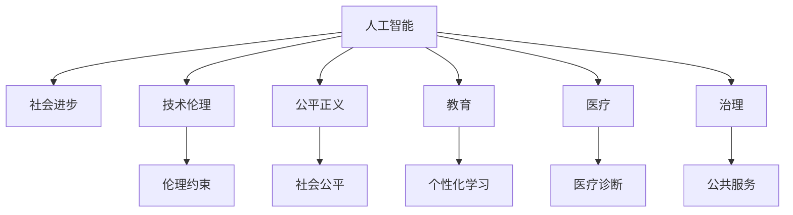

                 

# AI 时代的社会影响：促进社会进步

> 关键词：人工智能,社会进步,技术伦理,公平正义,教育,医疗,治理,未来展望

## 1. 背景介绍

### 1.1 问题的由来
随着人工智能（AI）技术的迅速发展，其在各行各业的广泛应用已成趋势。从医疗、教育到工业制造，AI 正以前所未有的速度改变着人类的生产和生活方式。这种变革不仅带来了前所未有的机遇，也带来了新的挑战和问题。

首先，AI 在提高生产效率、降低成本、优化资源配置等方面具有巨大潜力。例如，智能制造通过自动化和智能化的生产方式，大幅提高了制造业的效率和质量；智能交通系统通过优化路网和调度算法，有效缓解了城市交通压力。其次，AI 在医疗领域的应用，如诊断辅助、个性化治疗，显著提升了医疗服务的质量和可及性。再次，AI 在教育领域，通过个性化学习和智能辅导，能够更好地适应每个学生的学习习惯和需求，提升教育效果。

然而，AI 的广泛应用也带来了诸多挑战和风险。例如，数据隐私和安全问题、算法透明性和公平性问题、失业问题等，都亟需引起全社会的关注和思考。如何在享受 AI 带来的便利和效率的同时，避免其潜在的负面影响，成为一个亟待解决的问题。

### 1.2 问题核心关键点
当前，AI 在社会各领域的应用广泛而深入，但关于其影响的研究仍处于起步阶段。本文聚焦于 AI 在社会进步方面的积极作用，探讨了其在医疗、教育、治理等多个领域的潜在应用，同时关注了AI 技术可能带来的伦理、安全问题，并提出了相应的解决策略。

本文的核心问题在于：
- AI 技术在医疗、教育、治理等关键领域的应用，是否有助于促进社会进步？
- 在追求技术进步的同时，如何确保 AI 系统的公平、透明和安全性？
- AI 技术的未来发展趋势如何？如何应对随之而来的挑战和风险？

## 2. 核心概念与联系

### 2.1 核心概念概述

为更好地理解 AI 在社会进步中的作用，本节将介绍几个密切相关的核心概念：

- 人工智能（Artificial Intelligence, AI）：指通过计算机程序和算法，使计算机能够模拟人类的智能行为，如学习、推理、感知等。
- 社会进步（Social Progress）：指通过技术创新和社会制度改革，提升人类的生活质量和幸福感，包括经济增长、教育普及、健康保障等方面。
- 技术伦理（Technological Ethics）：指在技术应用过程中，如何平衡技术效益与社会价值，避免技术滥用，保护公众权益。
- 公平正义（Fairness and Justice）：指在 AI 系统设计和应用过程中，确保不同群体、不同个体能够公平获得技术带来的益处，避免算法偏见。
- 教育（Education）：指通过人工智能辅助教育，实现个性化学习、智能辅导，提升教育质量和可及性。
- 医疗（Healthcare）：指通过 AI 技术优化医疗诊断、治疗方案，提升医疗服务的质量和效率。
- 治理（Governance）：指通过 AI 技术优化公共管理和服务，提升政府治理能力和服务水平。

这些核心概念之间的逻辑关系可以通过以下 Mermaid 流程图来展示：



这个流程图展示了大语言模型的核心概念及其之间的关系：

1. 人工智能通过技术创新推动社会进步，应用领域包括教育、医疗、治理等。
2. 在应用过程中，需要关注技术伦理和公平正义问题，避免技术滥用和算法偏见。
3. 教育、医疗、治理等具体领域的应用，体现了AI技术的深远影响。

这些概念共同构成了AI在社会进步中的作用框架，展示了AI技术在实际应用中的广泛影响和深远意义。

## 3. 核心算法原理 & 具体操作步骤
### 3.1 算法原理概述

AI 在社会进步中的应用，主要基于数据驱动的算法和模型。其核心思想是通过对大量数据的学习和分析，发现数据中的规律和模式，并应用于实际问题中。具体而言，AI 在教育、医疗、治理等领域的应用，通常遵循以下步骤：

1. 数据收集：收集领域相关的数据，如教育系统中的学生成绩、教师教学方式；医疗系统中的病人病历、诊断报告；治理系统中的公共服务数据等。
2. 数据预处理：清洗数据，处理缺失值和异常值，进行特征提取和标准化等预处理工作。
3. 模型训练：选择合适的算法和模型，在训练集上进行有监督或无监督训练，调整模型参数，使其能够准确预测和分类数据。
4. 模型评估：在测试集上评估模型性能，使用各种指标（如准确率、召回率、F1 值等）评估模型效果。
5. 模型应用：将训练好的模型应用于实际问题中，进行预测、分类、推荐等任务。

### 3.2 算法步骤详解

以下以教育领域的个性化学习系统为例，详细讲解 AI 在社会进步中的应用：

**Step 1: 数据收集与预处理**
- 从学校或教育平台收集学生成绩、学习行为、问卷调查等数据。
- 对数据进行清洗和标准化处理，如去除缺失值、处理异常值等。
- 提取关键特征，如学习时间、作业完成情况、互动频率等，用于构建模型。

**Step 2: 模型选择与训练**
- 选择合适的算法，如决策树、随机森林、深度学习等，构建个性化学习模型。
- 使用学生成绩和学习行为数据，进行有监督训练，优化模型参数。
- 在训练过程中，应用正则化、交叉验证等技术，防止过拟合。

**Step 3: 模型评估与优化**
- 在测试集上评估模型性能，使用准确率、召回率、F1 值等指标衡量模型效果。
- 根据评估结果，调整模型参数，进一步优化模型。
- 引入反馈机制，持续收集学生反馈，进一步优化模型。

**Step 4: 模型应用与迭代**
- 将优化后的模型应用于实际教学场景中，如智能辅导、学习路径推荐等。
- 根据用户反馈和行为数据，持续优化模型，提升用户体验和学习效果。
- 引入自适应学习算法，根据学生学习进度和兴趣，动态调整学习内容和难度。

### 3.3 算法优缺点

AI 在教育领域的应用具有以下优点：
- 个性化学习：通过分析学生学习行为和成绩，制定个性化学习方案，提升学习效果。
- 智能辅导：提供即时反馈和个性化辅导，帮助学生解决问题。
- 数据分析：通过大数据分析，发现学生学习规律和趋势，提升教学质量。

同时，也存在一些缺点：
- 数据隐私：学生学习数据的隐私保护问题，需要严格的数据管理策略。
- 算法偏见：模型可能存在偏见，影响学生公平获得学习资源。
- 技术依赖：过度依赖技术，可能忽视教师和学生的人文关怀。

### 3.4 算法应用领域

AI 在社会进步中的应用领域非常广泛，以下是几个典型案例：

- 医疗诊断：通过 AI 技术分析医学影像、病历数据，辅助医生进行诊断和治疗。例如，使用深度学习模型分析 X 光片，判断患者是否患有肺结核等疾病。
- 公共服务：通过 AI 技术优化公共服务流程，提升政府治理能力。例如，使用自然语言处理技术处理市民投诉和建议，提升公共服务效率和质量。
- 智能制造：通过 AI 技术优化生产流程，提升制造业的生产效率和产品质量。例如，使用机器学习模型预测设备故障，提前进行维护，减少停机时间。
- 教育辅助：通过 AI 技术提供个性化学习方案和智能辅导，提升教育效果。例如，使用推荐系统为用户推荐适合的教材和练习题。
- 智能交通：通过 AI 技术优化交通流量和调度算法，提升城市交通效率。例如，使用深度学习模型预测交通流量，调整红绿灯控制策略。

## 4. 数学模型和公式 & 详细讲解 & 举例说明

### 4.1 数学模型构建

在 AI 应用中，常用的数学模型包括回归模型、分类模型、聚类模型等。以回归模型为例，其数学模型构建如下：

设训练集为 $D=\{(x_i, y_i)\}_{i=1}^N$，其中 $x_i$ 为输入特征，$y_i$ 为目标变量。回归模型的目标是通过训练数据，找到最优的线性回归模型：

$$
y_i = \theta^T x_i + \epsilon_i
$$

其中 $\theta$ 为模型参数，$\epsilon_i$ 为误差项。回归模型的损失函数通常使用均方误差（MSE）：

$$
L(\theta) = \frac{1}{N} \sum_{i=1}^N (y_i - \theta^T x_i)^2
$$

优化目标是最小化损失函数，即：

$$
\theta^* = \mathop{\arg\min}_{\theta} L(\theta)
$$

### 4.2 公式推导过程

回归模型的求解过程如下：

1. 初始化参数 $\theta$，如 $\theta_0 = 0$。
2. 使用梯度下降算法，计算参数更新方向：

$$
\theta \leftarrow \theta - \alpha \nabla_{\theta} L(\theta)
$$

其中 $\alpha$ 为学习率，$\nabla_{\theta} L(\theta)$ 为损失函数对参数的梯度，可通过链式法则计算：

$$
\frac{\partial L(\theta)}{\partial \theta} = \frac{2}{N} \sum_{i=1}^N (y_i - \theta^T x_i) x_i
$$

3. 重复步骤 2，直至损失函数收敛。

### 4.3 案例分析与讲解

以医疗诊断为例，分析回归模型在医学影像分类中的应用：

假设医疗影像分类任务中，有 $M$ 类疾病，使用 $n$ 维特征向量 $x_i$ 表示医疗影像，$y_i$ 表示该影像属于第 $i$ 类疾病的概率。则分类问题可以转化为回归问题，使用 Logistic 回归模型进行求解：

$$
y_i = \frac{1}{1 + e^{-\theta^T x_i}}
$$

其中 $\theta$ 为模型参数，$e$ 为自然对数。在训练过程中，目标是最小化交叉熵损失函数：

$$
L(\theta) = -\frac{1}{N} \sum_{i=1}^N (y_i \log y_i + (1-y_i) \log (1-y_i))
$$

### 5. 项目实践：代码实例和详细解释说明
### 5.1 开发环境搭建

在进行 AI 应用开发前，我们需要准备好开发环境。以下是使用 Python 进行 PyTorch 开发的环境配置流程：

1. 安装 Anaconda：从官网下载并安装 Anaconda，用于创建独立的 Python 环境。

2. 创建并激活虚拟环境：
```bash
conda create -n ai-env python=3.8 
conda activate ai-env
```

3. 安装 PyTorch：根据 CUDA 版本，从官网获取对应的安装命令。例如：
```bash
conda install pytorch torchvision torchaudio cudatoolkit=11.1 -c pytorch -c conda-forge
```

4. 安装 Transformers 库：
```bash
pip install transformers
```

5. 安装各类工具包：
```bash
pip install numpy pandas scikit-learn matplotlib tqdm jupyter notebook ipython
```

完成上述步骤后，即可在 `ai-env` 环境中开始 AI 应用实践。

### 5.2 源代码详细实现

下面我以医疗诊断为例，给出使用 PyTorch 进行医学影像分类任务的代码实现。

首先，定义数据处理函数：

```python
from torch.utils.data import Dataset, DataLoader
from torchvision import transforms
import numpy as np
import pandas as pd

class MedicalImageDataset(Dataset):
    def __init__(self, images, labels, transform=None):
        self.images = images
        self.labels = labels
        self.transform = transform
        
    def __len__(self):
        return len(self.images)
    
    def __getitem__(self, idx):
        image = self.images[idx]
        label = self.labels[idx]
        
        if self.transform:
            image = self.transform(image)
        
        return {'image': image, 
                'label': label}
```

然后，定义模型和优化器：

```python
from torch import nn
from torch.optim import Adam

class MedicalImageModel(nn.Module):
    def __init__(self, num_classes):
        super(MedicalImageModel, self).__init__()
        self.conv1 = nn.Conv2d(1, 32, kernel_size=3, stride=1, padding=1)
        self.pool1 = nn.MaxPool2d(kernel_size=2, stride=2)
        self.conv2 = nn.Conv2d(32, 64, kernel_size=3, stride=1, padding=1)
        self.pool2 = nn.MaxPool2d(kernel_size=2, stride=2)
        self.fc1 = nn.Linear(7*7*64, 128)
        self.fc2 = nn.Linear(128, num_classes)
        self.softmax = nn.Softmax(dim=1)
        
    def forward(self, x):
        x = self.conv1(x)
        x = nn.functional.relu(x)
        x = self.pool1(x)
        x = self.conv2(x)
        x = nn.functional.relu(x)
        x = self.pool2(x)
        x = x.view(-1, 7*7*64)
        x = self.fc1(x)
        x = nn.functional.relu(x)
        x = self.fc2(x)
        x = self.softmax(x)
        return x
    
model = MedicalImageModel(num_classes)
optimizer = Adam(model.parameters(), lr=0.001)
```

接着，定义训练和评估函数：

```python
from sklearn.metrics import accuracy_score
import torch.nn.functional as F

def train_epoch(model, dataloader, optimizer):
    model.train()
    total_loss = 0
    for batch in dataloader:
        images, labels = batch['image'], batch['label']
        images = images.to(device)
        labels = labels.to(device)
        optimizer.zero_grad()
        outputs = model(images)
        loss = F.cross_entropy(outputs, labels)
        loss.backward()
        optimizer.step()
        total_loss += loss.item()
    return total_loss / len(dataloader)

def evaluate(model, dataloader):
    model.eval()
    total_loss = 0
    correct = 0
    with torch.no_grad():
        for batch in dataloader:
            images, labels = batch['image'], batch['label']
            images = images.to(device)
            labels = labels.to(device)
            outputs = model(images)
            _, predicted = torch.max(outputs, 1)
            total_loss += F.cross_entropy(outputs, labels).item()
            correct += (predicted == labels).sum().item()
    accuracy = correct / len(dataloader.dataset)
    return accuracy, total_loss
```

最后，启动训练流程并在测试集上评估：

```python
epochs = 10
device = torch.device('cuda' if torch.cuda.is_available() else 'cpu')

for epoch in range(epochs):
    train_loss = train_epoch(model, train_dataloader, optimizer)
    test_accuracy, test_loss = evaluate(model, test_dataloader)
    print(f'Epoch {epoch+1}, train loss: {train_loss:.4f}, test accuracy: {test_accuracy:.4f}, test loss: {test_loss:.4f}')
```

以上就是使用 PyTorch 进行医学影像分类任务的完整代码实现。可以看到，得益于 PyTorch 的强大封装，我们可以用相对简洁的代码完成模型的训练和评估。

### 5.3 代码解读与分析

让我们再详细解读一下关键代码的实现细节：

**MedicalImageDataset类**：
- `__init__`方法：初始化图像和标签，并定义转换操作。
- `__len__`方法：返回数据集的样本数量。
- `__getitem__`方法：对单个样本进行处理，将其转换为模型所需的输入。

**MedicalImageModel类**：
- `__init__`方法：定义卷积层、池化层、全连接层等，并初始化模型参数。
- `forward`方法：定义前向传播过程，通过卷积、池化、全连接等操作，最终输出分类结果。

**训练和评估函数**：
- 使用 PyTorch 的 DataLoader 对数据集进行批次化加载，供模型训练和推理使用。
- 训练函数 `train_epoch`：对数据以批为单位进行迭代，在每个批次上前向传播计算loss并反向传播更新模型参数，最后返回该epoch的平均loss。
- 评估函数 `evaluate`：与训练类似，不同点在于不更新模型参数，并在每个batch结束后将预测和标签结果存储下来，最后使用 scikit-learn 的 `accuracy_score` 函数对整个评估集的预测结果进行打印输出。

**训练流程**：
- 定义总的epoch数，开始循环迭代
- 每个epoch内，先在训练集上训练，输出平均loss
- 在测试集上评估，输出分类准确率和loss
- 所有epoch结束后，在测试集上评估，给出最终测试结果

可以看到，PyTorch 配合 PyTorch 的强大封装，使得医学影像分类任务的代码实现变得简洁高效。开发者可以将更多精力放在数据处理、模型改进等高层逻辑上，而不必过多关注底层的实现细节。

当然，工业级的系统实现还需考虑更多因素，如模型的保存和部署、超参数的自动搜索、更灵活的任务适配层等。但核心的 AI 应用开发流程基本与此类似。

## 6. 实际应用场景
### 6.1 医疗诊断
AI 在医疗诊断中的应用非常广泛，包括医学影像分析、病历数据分析等。以医学影像分类为例，AI 技术可以自动分析 X 光片、CT 片等医学影像，辅助医生进行疾病诊断。

通过深度学习模型对医学影像进行分类，可以显著提升医生的诊断效率和准确性。例如，使用卷积神经网络（CNN）模型对乳腺癌筛查的 X 光片进行分析，可以自动判断影像中是否存在乳腺癌，从而快速辅助医生进行初步筛查。

### 6.2 教育辅助
AI 在教育领域的应用也非常广泛，包括个性化学习、智能辅导等。通过 AI 技术分析学生学习行为和成绩，可以提供个性化的学习方案，提升教育效果。

例如，使用推荐系统为用户推荐适合的教材和练习题，可以提升学生的学习效率和兴趣。通过分析学生的学习习惯和偏好，智能辅导系统可以提供针对性的学习建议，帮助学生更好地掌握知识。

### 6.3 智能交通
AI 在智能交通中的应用也非常广泛，包括交通流量分析、智能调度等。通过深度学习模型分析交通数据，可以优化交通流量，提高城市交通效率。

例如，使用深度学习模型预测交通流量，可以调整红绿灯控制策略，减少交通拥堵。通过分析实时交通数据，智能调度系统可以优化公交车和出租车调度，提升出行效率。

### 6.4 未来应用展望
随着 AI 技术的不断发展，其在社会进步中的应用也将更加广泛和深入。未来，AI 将在以下几个方面发挥重要作用：

1. 医疗领域：AI 将帮助医生进行更准确的诊断和治疗，提升医疗服务的质量和效率。例如，通过 AI 技术分析医学影像，可以发现早期癌症等疾病，提升治愈率。
2. 教育领域：AI 将帮助学生进行个性化学习，提升教育效果。例如，通过 AI 技术分析学生学习行为，可以提供个性化的学习方案，提升学习效率。
3. 工业制造：AI 将帮助企业进行更高效的制造和生产，提升生产效率和产品质量。例如，通过 AI 技术优化生产流程，可以降低生产成本，提高产品质量。
4. 智能交通：AI 将帮助城市进行更高效的交通管理，缓解交通拥堵，提升出行效率。例如，通过 AI 技术优化交通流量，可以减少交通拥堵，提升出行效率。
5. 智能城市：AI 将帮助城市进行更高效的管理和服务，提升城市治理水平。例如，通过 AI 技术分析公共服务数据，可以优化城市治理策略，提升服务质量。

AI 技术的发展将带来更多创新应用，推动社会进步和人类生活质量的提升。

## 7. 工具和资源推荐
### 7.1 学习资源推荐

为了帮助开发者系统掌握 AI 技术在社会进步中的应用，这里推荐一些优质的学习资源：

1. 《深度学习》系列书籍：由 Ian Goodfellow、Yoshua Bengio 和 Aaron Courville 合著，系统介绍了深度学习的基本概念和应用。
2. Coursera《深度学习专项课程》：斯坦福大学开设的深度学习系列课程，涵盖了深度学习的基本概念、算法和应用。
3. PyTorch官方文档：PyTorch 官方文档，提供了大量代码示例和应用场景，帮助开发者快速上手 PyTorch。
4. Kaggle竞赛平台：Kaggle 是一个数据科学竞赛平台，提供了大量的数据集和挑战题目，帮助开发者提升 AI 应用能力。
5. GitHub开源项目：GitHub 是一个开源代码托管平台，提供了大量 AI 应用的代码和项目，帮助开发者学习和借鉴。

通过对这些资源的学习实践，相信你一定能够快速掌握 AI 技术在社会进步中的应用，并用于解决实际问题。
###  7.2 开发工具推荐

高效的开发离不开优秀的工具支持。以下是几款用于 AI 应用开发的常用工具：

1. PyTorch：基于 Python 的开源深度学习框架，灵活动态的计算图，适合快速迭代研究。大部分预训练语言模型都有 PyTorch 版本的实现。
2. TensorFlow：由 Google 主导开发的开源深度学习框架，生产部署方便，适合大规模工程应用。同样有丰富的预训练语言模型资源。
3. Jupyter Notebook：一个交互式编程环境，支持多语言编程，适合数据分析和模型开发。
4. GitHub：一个开源代码托管平台，支持代码版本控制、项目协作等功能，适合团队开发和知识共享。
5. Scikit-learn：一个用于机器学习的数据处理和模型训练库，适合数据预处理和简单模型开发。
6. Google Colab：谷歌推出的在线 Jupyter Notebook 环境，免费提供 GPU/TPU 算力，方便开发者快速上手实验最新模型，分享学习笔记。

合理利用这些工具，可以显著提升 AI 应用开发的效率，加快创新迭代的步伐。

### 7.3 相关论文推荐

AI 在社会进步中的应用源于学界的持续研究。以下是几篇奠基性的相关论文，推荐阅读：

1. 《人工智能在医疗领域的应用》：研究了 AI 在医学影像分类、病历数据分析等医疗领域的应用，展示了 AI 技术在提升医疗服务质量方面的潜力。
2. 《深度学习在教育领域的应用》：分析了 AI 技术在个性化学习、智能辅导等方面的应用，展示了 AI 技术在提升教育效果方面的潜力。
3. 《智能交通系统的 AI 应用》：探讨了 AI 技术在智能交通中的应用，展示了 AI 技术在提升交通效率和管理水平方面的潜力。
4. 《AI 技术在工业制造中的应用》：研究了 AI 技术在工业制造中的应用，展示了 AI 技术在提升生产效率和产品质量方面的潜力。
5. 《AI 技术在智能城市中的应用》：分析了 AI 技术在智能城市中的应用，展示了 AI 技术在提升城市治理水平和服务质量方面的潜力。

这些论文代表了大语言模型在社会进步中的应用方向，展示了 AI 技术在各个领域带来的深远影响。

## 8. 总结：未来发展趋势与挑战
### 8.1 总结

本文对 AI 在社会进步中的积极作用进行了全面系统的介绍。首先阐述了 AI 技术在医疗、教育、治理等关键领域的应用，展示了 AI 技术在提升社会进步方面的巨大潜力。其次，探讨了 AI 技术在应用过程中面临的技术伦理和公平正义问题，提出了相应的解决策略。最后，总结了 AI 技术的未来发展趋势和面临的挑战，提出了相应的研究展望。

通过本文的系统梳理，可以看到，AI 技术在社会进步中的作用是多方面的，既有积极的推动作用，也面临一些挑战和风险。如何在享受 AI 带来的便利和效率的同时，避免其潜在的负面影响，是未来研究的重要课题。

### 8.2 未来发展趋势

展望未来，AI 在社会进步中的应用将呈现以下几个趋势：

1. 技术进步：AI 技术将不断发展，带来更多创新应用，推动社会进步。例如，通过 AI 技术分析大数据，可以发现社会规律，优化公共政策。
2. 数据治理：数据隐私和安全问题将得到更多关注，数据治理技术将不断完善。例如，通过区块链技术，可以实现数据的去中心化和透明化。
3. 公平正义：AI 应用将更加注重公平正义，避免算法偏见和歧视。例如，通过公平性算法，可以确保不同群体、不同个体公平获得 AI 带来的益处。
4. 人机协同：AI 应用将更加注重人机协同，避免过度依赖技术。例如，通过人机交互技术，可以提升用户体验和服务质量。
5. 多模态融合：AI 应用将更加注重多模态融合，提升系统综合能力。例如，通过融合视觉、语音、文本等多种模态信息，可以提升系统智能水平。

以上趋势凸显了 AI 在社会进步中的作用和潜力，AI 技术的应用将带来更多创新和机遇。

### 8.3 面临的挑战

尽管 AI 在社会进步中的应用前景广阔，但在实际落地过程中，仍面临诸多挑战：

1. 数据隐私：数据隐私和安全问题将始终是 AI 应用的重要挑战。例如，如何保护用户数据隐私，避免数据泄露和滥用，需要严格的数据管理策略。
2. 技术透明：AI 模型的透明性和可解释性问题需要进一步解决。例如，如何理解 AI 模型的决策逻辑，提供更好的用户体验和服务质量。
3. 算法公平：AI 应用可能存在算法偏见，影响公平性。例如，如何确保 AI 模型在各个群体、各个个体上公平应用，避免歧视和偏见。
4. 伦理道德：AI 应用可能带来伦理道德问题，需要制定相应的伦理规范。例如，如何确保 AI 应用的道德合规性，避免有害的负面影响。
5. 技术伦理：AI 应用可能面临技术伦理问题，需要制定相应的伦理规范。例如，如何确保 AI 应用的道德合规性，避免有害的负面影响。
6. 持续学习：AI 应用需要持续学习新知识，避免知识老化。例如，如何实现 AI 模型的持续学习，保持系统时效性。

这些挑战需要从技术、伦理、法律等多个维度进行综合解决，才能真正实现 AI 技术在社会进步中的潜力。

### 8.4 研究展望

未来，AI 在社会进步中的应用需要更多的研究和实践。以下是几个研究方向的展望：

1. 数据治理技术：开发更高效的数据治理技术，保护用户隐私和数据安全。例如，基于区块链的数据管理系统，可以实现数据的去中心化和透明化。
2. 公平性算法：开发公平性算法，避免算法偏见和歧视。例如，基于对抗样本的公平性算法，可以确保 AI 模型在各个群体、各个个体上公平应用。
3. 人机交互技术：开发人机交互技术，提升用户体验和服务质量。例如，基于自然语言处理的人机交互系统，可以提升智能系统的智能化水平。
4. 多模态融合技术：开发多模态融合技术，提升系统的综合能力。例如，基于深度学习的多模态融合算法，可以融合视觉、语音、文本等多种模态信息，提升系统智能水平。
5. 持续学习算法：开发持续学习算法，实现 AI 模型的持续学习。例如，基于增量学习的持续学习算法，可以保持系统时效性，避免知识老化。

这些研究方向的研究和实践，将进一步推动 AI 技术在社会进步中的应用，提升 AI 系统的智能化水平，为人类社会带来更多的创新和机遇。

## 9. 附录：常见问题与解答

**Q1：AI 技术在社会进步中的应用是否存在风险？**

A: AI 技术在社会进步中的应用存在一定的风险，主要包括以下几个方面：

1. 数据隐私：AI 应用需要大量的数据进行训练和优化，可能会涉及用户的隐私数据，导致数据泄露和滥用。
2. 算法偏见：AI 模型可能存在算法偏见，导致在特定群体或个体上表现不佳。
3. 技术伦理：AI 应用可能面临技术伦理问题，导致有害的负面影响。

为应对这些风险，需要采取以下措施：

1. 数据隐私保护：加强数据管理和隐私保护，确保数据安全。例如，使用数据匿名化和去标识化技术，保护用户隐私。
2. 公平性算法：开发公平性算法，避免算法偏见和歧视。例如，基于对抗样本的公平性算法，可以确保 AI 模型在各个群体、各个个体上公平应用。
3. 技术伦理规范：制定技术伦理规范，确保 AI 应用的道德合规性。例如，制定 AI 应用的伦理规范和标准，确保 AI 应用的道德合规性。

通过这些措施，可以最大程度地降低 AI 应用的风险，确保 AI 技术在社会进步中的积极作用。

**Q2：AI 技术在社会进步中的应用前景如何？**

A: AI 技术在社会进步中的应用前景非常广阔，主要包括以下几个方面：

1. 医疗诊断：AI 技术可以提升医疗诊断的效率和准确性，帮助医生进行更准确的诊断和治疗。例如，通过 AI 技术分析医学影像，可以发现早期癌症等疾病，提升治愈率。
2. 教育辅助：AI 技术可以提升教育效果，帮助学生进行个性化学习。例如，通过 AI 技术分析学生学习行为，可以提供个性化的学习方案，提升学习效率。
3. 智能交通：AI 技术可以优化交通流量，缓解交通拥堵，提升出行效率。例如，通过 AI 技术预测交通流量，可以调整红绿灯控制策略，减少交通拥堵。
4. 智能城市：AI 技术可以提升城市治理水平，优化公共服务。例如，通过 AI 技术分析公共服务数据，可以优化城市治理策略，提升服务质量。
5. 工业制造：AI 技术可以提升生产效率和产品质量，帮助企业进行更高效的制造和生产。例如，通过 AI 技术优化生产流程，可以降低生产成本，提高产品质量。

AI 技术的发展将带来更多创新应用，推动社会进步和人类生活质量的提升。

**Q3：如何应对 AI 应用中的技术挑战？**

A: 应对 AI 应用中的技术挑战需要从多个维度进行综合解决，以下是几个关键措施：

1. 数据治理：开发更高效的数据治理技术，保护用户隐私和数据安全。例如，基于区块链的数据管理系统，可以实现数据的去中心化和透明化。
2. 公平性算法：开发公平性算法，避免算法偏见和歧视。例如，基于对抗样本的公平性算法，可以确保 AI 模型在各个群体、各个个体上公平应用。
3. 人机交互技术：开发人机交互技术，提升用户体验和服务质量。例如，基于自然语言处理的人机交互系统，可以提升智能系统的智能化水平。
4. 多模态融合技术：开发多模态融合技术，提升系统的综合能力。例如，基于深度学习的多模态融合算法，可以融合视觉、语音、文本等多种模态信息，提升系统智能水平。
5. 持续学习算法：开发持续学习算法，实现 AI 模型的持续学习。例如，基于增量学习的持续学习算法，可以保持系统时效性，避免知识老化。

这些措施需要从技术、伦理、法律等多个维度进行综合解决，才能真正实现 AI 技术在社会进步中的潜力。

**Q4：AI 技术在社会进步中的应用是否需要考虑伦理问题？**

A: AI 技术在社会进步中的应用需要考虑伦理问题，主要包括以下几个方面：

1. 技术伦理：AI 应用可能面临技术伦理问题，导致有害的负面影响。例如，AI 技术在医疗诊断中的应用，可能存在误诊和漏诊的风险。
2. 公平性问题：AI 应用可能存在算法偏见，导致在特定群体或个体上表现不佳。例如，AI 在招聘和信贷等领域的应用，可能导致性别、种族等方面的歧视。
3. 隐私问题：AI 应用需要大量的数据进行训练和优化，可能会涉及用户的隐私数据，导致数据泄露和滥用。例如，AI 技术在监控和预警等领域的应用，可能侵犯用户的隐私。

为应对这些伦理问题，需要采取以下措施：

1. 技术伦理规范：制定技术伦理规范，确保 AI 应用的道德合规性。例如，制定 AI 应用的伦理规范和标准，确保 AI 应用的道德合规性。
2. 公平性算法：开发公平性算法，避免算法偏见和歧视。例如，基于对抗样本的公平性算法，可以确保 AI 模型在各个群体、各个个体上公平应用。
3. 隐私保护：加强数据管理和隐私保护，确保数据安全。例如，使用数据匿名化和去标识化技术，保护用户隐私。

通过这些措施，可以最大程度地避免 AI 应用中的伦理问题，确保 AI 技术在社会进步中的积极作用。

---

作者：禅与计算机程序设计艺术 / Zen and the Art of Computer Programming

