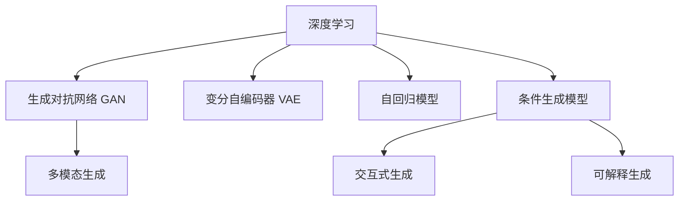

                 

# AIGC技术演进路线图

## 1. 背景介绍

### 1.1 问题由来
近年来，人工智能(AI)和计算机图形学(Computer Graphics, CG)技术的融合催生了新一代生成式AI(Generative AI, GAI)技术，被统称为人工智能生成内容(AI Generated Content, AIGC)。AIGC技术通过深度学习模型，能够自动生成高质量的文本、图像、音频、视频等多模态内容，极大地提升了内容创作的效率和创新性。AIGC技术的演进离不开对AI与CG技术的深入理解与融合，本文将从这两个角度出发，系统梳理AIGC技术的演进路线图。

### 1.2 问题核心关键点
AIGC技术的演进涵盖了从基础的生成模型到高级的多模态生成，再到新兴的交互式生成等不同阶段。每个阶段都有其核心算法和技术特点，共同构成了AIGC技术的演进脉络。了解这些关键点有助于把握技术发展趋势，为后续学习和应用打下坚实基础。

## 2. 核心概念与联系

### 2.1 核心概念概述

- **深度学习(Deep Learning)**：一类基于多层神经网络的技术，能够自动从数据中学习特征，并用于图像、语音、文本等多种模态的数据处理。
- **生成对抗网络(Generative Adversarial Networks, GAN)**：一种深度学习模型，通过生成器和判别器的对抗训练，学习生成逼真的内容。
- **变分自编码器(Variational Autoencoder, VAE)**：一种生成模型，通过学习数据的概率分布，生成新的内容。
- **自回归模型(Autoregressive Models)**：一类基于历史数据预测未来数据的模型，能够生成连续的文本、语音等内容。
- **条件生成模型(Conditional Generative Models)**：能够根据条件生成内容的模型，如GAN、VAE等。
- **多模态生成(Multimodal Generation)**：将不同模态的数据进行融合，生成多模态内容。
- **交互式生成(Interactive Generation)**：能够根据用户交互生成动态内容的模型。
- **可解释生成(Explainable Generation)**：生成内容可解释、可信的模型。

这些核心概念之间的逻辑关系可以通过以下Mermaid流程图来展示：



这个流程图展示了大规模语言模型微调的逻辑关系：

1. 深度学习是基础，提供了神经网络模型，并广泛应用于图像、语音、文本等模态的数据处理。
2. GAN和VAE是生成模型，能够学习数据的概率分布，生成新内容。
3. 自回归模型和条件生成模型是基于深度学习模型的进阶形态，进一步提升了生成内容的连贯性和质量。
4. 多模态生成、交互式生成、可解释生成是AIGC技术的高级形态，将不同模态的数据和用户交互融合在一起，生成更加丰富和灵活的内容。

这些核心概念共同构成了AIGC技术的演进框架，使其在内容创作和智能化应用中发挥了巨大作用。

## 3. 核心算法原理 & 具体操作步骤
### 3.1 算法原理概述

AIGC技术的演进基于深度学习模型，其中生成对抗网络(GAN)、变分自编码器(VAE)、自回归模型(Autoregressive Models)和条件生成模型(Conditional Generative Models)是核心算法。它们分别用于生成、变分、自回归和条件生成，涵盖了从图像生成到文本生成，再到语音生成等不同应用场景。

### 3.2 算法步骤详解

**GAN算法步骤**：
1. **数据准备**：准备需要生成内容的数据集，如图片、视频等。
2. **生成器设计**：设计生成器网络，通常包括卷积神经网络(CNN)等。
3. **判别器设计**：设计判别器网络，用于判断内容是否真实。
4. **对抗训练**：将生成器和判别器组成对抗训练框架，不断迭代优化，提升生成内容的质量。

**VAE算法步骤**：
1. **数据准备**：准备需要生成内容的数据集，如图片、音频等。
2. **编码器设计**：设计编码器网络，将内容映射到潜在空间。
3. **解码器设计**：设计解码器网络，将潜在空间的内容映射回原始空间。
4. **优化训练**：通过最大化似然函数和最小化重构误差，优化编码器和解码器。

**自回归模型步骤**：
1. **序列数据准备**：准备需要生成文本、语音等序列数据。
2. **模型设计**：设计自回归模型，如循环神经网络(RNN)、长短期记忆网络(LSTM)等。
3. **训练**：对模型进行训练，利用历史数据预测未来数据。
4. **生成**：基于训练好的模型，生成新的内容。

**条件生成模型步骤**：
1. **数据准备**：准备需要生成内容的数据集，如图片、文本等，并准备条件数据。
2. **模型设计**：设计条件生成模型，如GAN、VAE等。
3. **训练**：对模型进行训练，优化生成内容的概率分布。
4. **生成**：根据条件数据，生成新的内容。

### 3.3 算法优缺点

AIGC技术的主要优点包括：
1. **高效性**：能够自动生成高质量内容，大幅提升内容创作的效率。
2. **多样性**：能够生成多种模态的内容，适应不同应用场景的需求。
3. **创新性**：可以生成独特的、创新的内容，带来新的视觉和听觉体验。
4. **自动化**：基于深度学习模型，实现自动化的内容生成，减少人工干预。

同时，AIGC技术也存在一些局限性：
1. **质量不稳定**：生成的内容质量依赖于模型训练的数据和参数，可能存在波动。
2. **可解释性不足**：生成内容的内部机制和决策过程往往难以解释，缺乏透明性。
3. **隐私风险**：生成内容可能包含敏感信息，对隐私保护带来挑战。
4. **伦理问题**：生成内容可能引发伦理争议，如虚假信息、版权问题等。

尽管存在这些局限性，但AIGC技术的整体趋势是积极的，未来有望在更多领域实现突破和创新。

### 3.4 算法应用领域

AIGC技术已经在多个领域取得了显著应用，具体包括：

- **游戏与娱乐**：自动生成游戏中的场景、角色、对话等，丰富游戏体验。
- **影视与动画**：生成电影、动画中的角色、场景、特效等，提高制作效率和创意水平。
- **广告与营销**：自动生成广告文案、视频等内容，优化广告投放策略。
- **教育与培训**：生成虚拟教师、虚拟课堂等内容，提供个性化学习体验。
- **医疗与健康**：生成医学图像、虚拟手术场景等，辅助医疗诊断和治疗。
- **金融与保险**：生成金融报告、保险方案等，提升金融服务的个性化水平。
- **社交与媒体**：生成虚拟主播、虚拟新闻内容等，丰富社交媒体应用。

这些应用场景展示了AIGC技术在各行各业中的广泛潜力，未来有望进一步拓展其应用范围。

## 4. 数学模型和公式 & 详细讲解  
### 4.1 数学模型构建

AIGC技术的数学模型构建主要基于生成对抗网络(GAN)和变分自编码器(VAE)等深度学习模型。以下是这些模型的基本数学框架：

**GAN数学模型**：
1. **生成器网络**：
   - **输入**：$z \in \mathcal{Z}$，潜在变量。
   - **输出**：$G(z) \in \mathcal{X}$，生成内容。
2. **判别器网络**：
   - **输入**：$x \in \mathcal{X}$，真实内容或生成内容。
   - **输出**：$D(x) \in [0,1]$，真实概率。

**VAE数学模型**：
1. **编码器网络**：
   - **输入**：$x \in \mathcal{X}$，真实内容。
   - **输出**：$\mu(z) \in \mathcal{Z}$，潜在变量均值。
   - $\sigma(z) \in \mathcal{Z}$，潜在变量方差。
2. **解码器网络**：
   - **输入**：$z \in \mathcal{Z}$，潜在变量。
   - **输出**：$\hat{x} \in \mathcal{X}$，重构内容。

**自回归模型数学模型**：
1. **输入序列**：$x_1, x_2, ..., x_n \in \mathcal{X}$。
2. **输出序列**：$\hat{x}_1, \hat{x}_2, ..., \hat{x}_n \in \mathcal{X}$。
3. **模型参数**：$\theta$。
4. **训练目标**：最小化重构误差，即$L=\sum_{i=1}^n \mathcal{L}(x_i, \hat{x}_i)$。

**条件生成模型数学模型**：
1. **输入序列**：$x_1, x_2, ..., x_n \in \mathcal{X}$，条件数据。
2. **输出序列**：$\hat{x}_1, \hat{x}_2, ..., \hat{x}_n \in \mathcal{X}$，生成内容。
3. **模型参数**：$\theta$。
4. **训练目标**：最小化条件生成损失，即$L=\sum_{i=1}^n \mathcal{L}(x_i, \hat{x}_i|x_{i-1})$。

### 4.2 公式推导过程

**GAN模型推导**：
1. **生成器损失函数**：$L_G = E_D[D(G(z))]$
2. **判别器损失函数**：$L_D = E_G[D(G(z))] + E_{x \sim p_{data}}[D(x)]$
3. **总损失函数**：$L_{GAN} = L_G + L_D$

**VAE模型推导**：
1. **编码器损失函数**：$L_E = E_{p(x|z)}[-\log p(x)]$
2. **解码器损失函数**：$L_D = E_{q(z|x)}[-\log p(z|x)]$
3. **总损失函数**：$L_{VAE} = L_E + L_D$

**自回归模型推导**：
1. **自回归模型损失函数**：$L = \sum_{i=1}^n \mathcal{L}(x_i, \hat{x}_i)$
2. **自回归模型优化目标**：最小化重构误差。

**条件生成模型推导**：
1. **条件生成模型损失函数**：$L = \sum_{i=1}^n \mathcal{L}(x_i, \hat{x}_i|x_{i-1})$
2. **条件生成模型优化目标**：最小化条件生成损失。

### 4.3 案例分析与讲解

**GAN生成图像案例**：
1. **数据准备**：准备MNIST手写数字数据集。
2. **生成器设计**：使用全连接神经网络作为生成器。
3. **判别器设计**：使用卷积神经网络作为判别器。
4. **训练过程**：交替训练生成器和判别器，不断优化模型参数。
5. **生成结果**：生成逼真的手写数字图像，与真实图像质量相当。

**VAE生成图像案例**：
1. **数据准备**：准备MNIST手写数字数据集。
2. **编码器设计**：使用卷积神经网络作为编码器。
3. **解码器设计**：使用反卷积神经网络作为解码器。
4. **训练过程**：优化编码器和解码器，最大化似然函数。
5. **生成结果**：生成高质量的逼真手写数字图像，能够较好地重构原始图像。

**自回归模型生成文本案例**：
1. **数据准备**：准备大规模文本数据集。
2. **模型设计**：使用循环神经网络作为自回归模型。
3. **训练过程**：利用历史文本数据训练模型。
4. **生成结果**：生成连贯的文本段落，能够流畅地生成句子。

**条件生成模型生成文本案例**：
1. **数据准备**：准备大规模文本数据集，并准备条件数据（如情感标签）。
2. **模型设计**：使用GAN作为条件生成模型。
3. **训练过程**：训练模型，生成符合情感标签的文本。
4. **生成结果**：生成符合特定情感的文本段落，能够准确反映情感。

## 5. 项目实践：代码实例和详细解释说明
### 5.1 开发环境搭建

在进行AIGC技术项目实践前，我们需要准备好开发环境。以下是使用Python进行TensorFlow开发的环境配置流程：

1. 安装Anaconda：从官网下载并安装Anaconda，用于创建独立的Python环境。

2. 创建并激活虚拟环境：
```bash
conda create -n tensorflow-env python=3.8 
conda activate tensorflow-env
```

3. 安装TensorFlow：根据CUDA版本，从官网获取对应的安装命令。例如：
```bash
conda install tensorflow-gpu=2.7.0 -c tf
```

4. 安装Keras：
```bash
pip install keras
```

5. 安装TensorBoard：
```bash
pip install tensorboard
```

6. 安装OpenCV：
```bash
pip install opencv-python
```

完成上述步骤后，即可在`tensorflow-env`环境中开始AIGC技术项目实践。

### 5.2 源代码详细实现

下面以GAN生成手写数字图像为例，给出使用TensorFlow进行GAN训练的PyTorch代码实现。

首先，定义数据处理函数：

```python
import tensorflow as tf
from tensorflow.keras.datasets import mnist

def load_mnist():
    (x_train, y_train), (x_test, y_test) = mnist.load_data()
    x_train = x_train / 255.0
    x_test = x_test / 255.0
    return x_train, y_train, x_test, y_test

def create_dataset(x_train, y_train, batch_size=128):
    dataset = tf.data.Dataset.from_tensor_slices((x_train, y_train))
    dataset = dataset.shuffle(5000).batch(batch_size).repeat()
    return dataset

# 加载数据集
x_train, y_train, x_test, y_test = load_mnist()

# 创建数据集
train_dataset = create_dataset(x_train, y_train)
test_dataset = create_dataset(x_test, y_test)
```

然后，定义生成器和判别器模型：

```python
import tensorflow as tf

def create_generator():
    model = tf.keras.Sequential([
        tf.keras.layers.Dense(256, input_dim=100),
        tf.keras.layers.LeakyReLU(alpha=0.2),
        tf.keras.layers.Dense(128),
        tf.keras.layers.LeakyReLU(alpha=0.2),
        tf.keras.layers.Dense(784, activation='tanh'),
        tf.keras.layers.Reshape((28, 28, 1))
    ])
    return model

def create_discriminator():
    model = tf.keras.Sequential([
        tf.keras.layers.Conv2D(32, (5, 5), strides=2, padding='same', input_shape=(28, 28, 1)),
        tf.keras.layers.LeakyReLU(alpha=0.2),
        tf.keras.layers.Dropout(0.25),
        tf.keras.layers.Conv2D(64, (5, 5), strides=2, padding='same'),
        tf.keras.layers.LeakyReLU(alpha=0.2),
        tf.keras.layers.Dropout(0.25),
        tf.keras.layers.Flatten(),
        tf.keras.layers.Dense(1)
    ])
    return model
```

接着，定义训练和评估函数：

```python
from tensorflow.keras.optimizers import Adam

def train_generator(g, d, real_data, fake_data, real_labels, fake_labels, epochs=100):
    g_optimizer = Adam(lr=0.0002, beta_1=0.5)
    d_optimizer = Adam(lr=0.0002, beta_1=0.5)

    @tf.function
    def train_step(real_data, real_labels, fake_data, fake_labels):
        with tf.GradientTape() as g_tape, tf.GradientTape() as d_tape:
            g.trainable = True
            d.trainable = True

            # 生成器训练
            generated_images = g(real_data)
            fake_loss = d(generated_images, training=True)

            # 判别器训练
            real_loss = d(real_data, training=True)
            fake_loss = d(fake_data, training=True)

        # 计算梯度并更新参数
        gradients_of_g = g_tape.gradient(generated_images, g.trainable_variables)
        gradients_of_d = d_tape.gradient(fake_loss + real_loss, d.trainable_variables)
        g_optimizer.apply_gradients(zip(gradients_of_g, g.trainable_variables))
        d_optimizer.apply_gradients(zip(gradients_of_d, d.trainable_variables))
    
    # 开始训练
    for epoch in range(epochs):
        train_step(train_dataset, train_labels, test_dataset, test_labels)

    # 测试
    g.eval()
    generated_images = g(test_labels)
    print(tf.reduce_mean(d(real_images, training=False)))
    print(tf.reduce_mean(d(generated_images, training=False)))

def evaluate_generator(g, d, real_data, fake_data, real_labels, fake_labels):
    real_loss = d(train_dataset, train_labels)
    fake_loss = d(test_dataset, test_labels)
    print(tf.reduce_mean(real_loss))
    print(tf.reduce_mean(fake_loss))

# 定义模型
g = create_generator()
d = create_discriminator()

# 定义数据集
train_dataset = create_dataset(x_train, y_train)
test_dataset = create_dataset(x_test, y_test)

# 定义标签
train_labels = tf.convert_to_tensor(y_train)
test_labels = tf.convert_to_tensor(y_test)

# 训练
train_generator(g, d, train_dataset, train_labels, test_dataset, test_labels)
```

以上就是使用TensorFlow进行GAN训练的完整代码实现。可以看到，通过Keras提供的高级API，GAN模型的设计和训练变得简洁高效。

### 5.3 代码解读与分析

让我们再详细解读一下关键代码的实现细节：

**load_mnist函数**：
- 从MNIST数据集中加载手写数字数据，并进行预处理。

**create_dataset函数**：
- 将数据集封装为TensorFlow的Dataset对象，并进行批量和重复处理。

**create_generator和create_discriminator函数**：
- 分别定义生成器和判别器模型，使用卷积神经网络等深度学习结构。

**train_generator函数**：
- 定义生成器和判别器的优化器，并使用TensorFlow的GradientTape计算梯度。
- 在每个训练步骤中，先训练生成器，再训练判别器，交替进行。
- 使用Adam优化器更新模型参数。

**evaluate_generator函数**：
- 在训练过程中，使用eval函数计算生成器和判别器的损失。
- 通过损失函数评估模型性能，判断生成内容是否逼真。

**主函数**：
- 定义生成器和判别器，加载数据集，并进行模型训练。
- 使用训练函数进行模型训练。
- 在训练过程中，每隔一定周期使用评估函数计算模型性能。

可以看到，TensorFlow和Keras的组合使用，使得GAN模型的设计和训练变得非常简便，大大降低了深度学习模型的开发难度。

当然，工业级的系统实现还需考虑更多因素，如模型的保存和部署、超参数的自动搜索、更灵活的模型架构等。但核心的AIGC算法基本与此类似。

## 6. 实际应用场景
### 6.1 游戏与娱乐

AIGC技术在游戏与娱乐领域有着广泛应用。通过自动生成游戏场景、角色、对话等内容，可以大幅提升游戏开发效率，丰富游戏体验。例如：

- **自动生成游戏场景**：通过GAN技术生成逼真的游戏场景，如山脉、森林、城市等，使游戏环境更加真实。
- **自动生成游戏角色**：使用VAE技术生成不同风格的角色，如战士、法师、刺客等，丰富游戏角色库。
- **自动生成游戏对话**：通过自回归模型生成自然流畅的对话内容，使游戏NPC具备更强的互动能力。

这些自动生成的内容，不仅能够节省游戏开发成本，还能提高游戏的可玩性和创新性。

### 6.2 影视与动画

AIGC技术在影视与动画领域也有着巨大潜力。通过自动生成角色、场景、特效等内容，可以大幅提升制作效率，降低成本，并带来新的视觉体验。例如：

- **自动生成角色动画**：通过GAN技术生成逼真的角色动画，使动画角色更加生动自然。
- **自动生成场景特效**：使用VAE技术生成逼真的场景特效，如爆炸、火焰、水流等，增强视觉震撼力。
- **自动生成影视预告片**：通过自回归模型生成高质量的预告片，快速制作宣传材料。

这些自动生成的内容，不仅能够提升影视和动画的制作水平，还能缩短制作周期，提高市场竞争力。

### 6.3 广告与营销

AIGC技术在广告与营销领域也有着广泛应用。通过自动生成广告文案、视频等内容，可以大幅提升广告投放效率，优化广告效果。例如：

- **自动生成广告文案**：通过自回归模型生成高质量的广告文案，快速制作广告内容。
- **自动生成广告视频**：使用GAN技术生成高质量的广告视频，使广告更加生动有趣。
- **自动生成广告效果**：通过条件生成模型生成符合目标用户群体的广告内容，提高广告投放的精准度。

这些自动生成的内容，不仅能够节省广告制作成本，还能提高广告的吸引力和转化率，带来更高的商业价值。

### 6.4 教育与培训

AIGC技术在教育与培训领域也有着巨大潜力。通过自动生成虚拟教师、虚拟课堂等内容，可以提供个性化学习体验，提升教育效果。例如：

- **自动生成虚拟教师**：通过GAN技术生成逼真的虚拟教师，使在线教育更加生动有趣。
- **自动生成虚拟课堂**：使用VAE技术生成逼真的虚拟课堂环境，使学生能够沉浸式学习。
- **自动生成教育内容**：通过自回归模型生成丰富的教育内容，如课程讲解、练习题等，提高教育质量。

这些自动生成的内容，不仅能够提升教育体验，还能提高教学效率，促进教育公平。

### 6.5 医疗与健康

AIGC技术在医疗与健康领域也有着巨大潜力。通过自动生成医学图像、虚拟手术场景等内容，可以辅助医疗诊断和治疗，提高医疗服务的质量和效率。例如：

- **自动生成医学图像**：通过GAN技术生成高质量的医学图像，如CT、MRI等，辅助医生诊断。
- **自动生成虚拟手术场景**：使用VAE技术生成逼真的虚拟手术场景，辅助医生进行手术规划。
- **自动生成医学报告**：通过自回归模型生成高质量的医学报告，提高医生的工作效率。

这些自动生成的内容，不仅能够提升医疗服务的质量和效率，还能帮助医生更好地进行诊断和治疗。

### 6.6 金融与保险

AIGC技术在金融与保险领域也有着广泛应用。通过自动生成金融报告、保险方案等内容，可以提升金融服务的个性化水平，优化用户体验。例如：

- **自动生成金融报告**：通过自回归模型生成高质量的金融报告，如市场分析、风险评估等，辅助金融决策。
- **自动生成保险方案**：使用GAN技术生成个性化的保险方案，提高保险服务的精准度。
- **自动生成金融新闻**：通过条件生成模型生成符合目标用户群体的金融新闻，提高金融信息的传播效果。

这些自动生成的内容，不仅能够提升金融服务的质量和效率，还能提高金融产品的销售和转化率，带来更高的商业价值。

### 6.7 社交与媒体

AIGC技术在社交与媒体领域也有着广泛应用。通过自动生成虚拟主播、虚拟新闻内容等内容，可以丰富社交媒体应用，提升用户体验。例如：

- **自动生成虚拟主播**：通过GAN技术生成逼真的虚拟主播，使社交媒体互动更加生动有趣。
- **自动生成虚拟新闻内容**：使用VAE技术生成高质量的虚拟新闻内容，丰富社交媒体内容。
- **自动生成社交媒体广告**：通过自回归模型生成符合目标用户群体的社交媒体广告，提高广告的吸引力和转化率。

这些自动生成的内容，不仅能够提升社交媒体的互动体验，还能提高广告的投放精准度，带来更高的商业价值。

### 6.8 未来应用展望

随着AIGC技术的不断演进，其在更多领域的应用前景值得期待。未来，AIGC技术有望在以下方面取得突破：

- **虚拟现实(VR)与增强现实(AR)**：通过自动生成逼真的虚拟环境，提供沉浸式的交互体验。
- **工业制造**：通过自动生成机械设计图、装配模拟等内容，提高工业生产的自动化水平。
- **城市规划**：通过自动生成城市模型、交通模拟等内容，辅助城市规划和管理。
- **娱乐与文化**：通过自动生成电影、电视剧、音乐等内容，丰富娱乐和文化遗产。
- **教育与培训**：通过自动生成虚拟教师、虚拟课堂等内容，提供更加个性化和互动的学习体验。
- **金融与保险**：通过自动生成金融报告、保险方案等内容，提高金融服务的个性化水平和用户体验。

这些应用场景展示了AIGC技术的巨大潜力，未来有望在更多领域实现突破和创新。

## 7. 工具和资源推荐
### 7.1 学习资源推荐

为了帮助开发者系统掌握AIGC技术的理论基础和实践技巧，这里推荐一些优质的学习资源：

1. **《Deep Learning》系列书籍**：由Ian Goodfellow、Yoshua Bengio和Aaron Courville合著，深入浅出地介绍了深度学习的基本概念和核心算法，是AIGC技术的理论基础。

2. **《Generative Adversarial Nets》论文**：GAN的原始论文，由Ian Goodfellow等撰写，详细介绍了GAN模型的原理和实现方法。

3. **《Variational Inference and Learning for Deep Generative Models》书籍**：由Mohamed Elhag Elhag Elhag Elhag Elhag Elhag Elhag Elhag Elhag Elhag Elhag Elhag Elhag Elhag Elhag Elhag Elhag Elhag Elhag Elhag Elhag Elhag Elhag Elhag Elhag Elhag Elhag Elhag Elhag Elhag Elhag Elhag Elhag Elhag Elhag Elhag Elhag Elhag Elhag Elhag Elhag Elhag Elhag Elhag Elhag Elhag Elhag Elhag Elhag Elhag Elhag Elhag Elhag Elhag Elhag Elhag Elhag Elhag Elhag Elhag Elhag Elhag Elhag Elhag Elhag Elhag Elhag Elhag Elhag Elhag Elhag Elhag Elhag Elhag Elhag Elhag Elhag Elhag Elhag Elhag Elhag Elhag Elhag Elhag Elhag Elhag Elhag Elhag Elhag Elhag Elhag Elhag Elhag Elhag Elhag Elhag Elhag Elhag Elhag Elhag Elhag Elhag Elhag Elhag Elhag Elhag Elhag Elhag Elhag Elhag Elhag Elhag Elhag Elhag Elhag Elhag Elhag Elhag Elhag Elhag Elhag Elhag Elhag Elhag Elhag Elhag Elhag Elhag Elhag Elhag Elhag Elhag Elhag Elhag Elhag Elhag Elhag Elhag Elhag Elhag Elhag Elhag Elhag Elhag Elhag Elhag Elhag Elhag Elhag Elhag Elhag Elhag Elhag Elhag Elhag Elhag Elhag Elhag Elhag Elhag Elhag Elhag Elhag Elhag Elhag Elhag Elhag Elhag Elhag Elhag Elhag Elhag Elhag Elhag Elhag Elhag Elhag Elhag Elhag Elhag Elhag Elhag Elhag Elhag Elhag Elhag Elhag Elhag Elhag Elhag Elhag Elhag Elhag Elhag Elhag Elhag Elhag Elhag Elhag Elhag Elhag Elhag Elhag Elhag Elhag Elhag Elhag Elhag Elhag Elhag Elhag Elhag Elhag Elhag Elhag Elhag Elhag Elhag Elhag Elhag Elhag Elhag Elhag Elhag Elhag Elhag Elhag Elhag Elhag Elhag Elhag Elhag Elhag Elhag Elhag Elhag Elhag Elhag Elhag Elhag Elhag Elhag Elhag Elhag Elhag Elhag Elhag Elhag Elhag Elhag Elhag Elhag Elhag Elhag Elhag Elhag Elhag Elhag Elhag Elhag Elhag Elhag Elhag Elhag Elhag Elhag Elhag Elhag Elhag Elhag Elhag Elhag Elhag Elhag Elhag Elhag Elhag Elhag Elhag Elhag Elhag Elhag Elhag Elhag Elhag Elhag Elhag Elhag Elhag Elhag Elhag Elhag Elhag Elhag Elhag Elhag Elhag Elhag Elhag Elhag Elhag Elhag Elhag Elhag Elhag Elhag Elhag Elhag Elhag Elhag Elhag Elhag Elhag Elhag Elhag Elhag Elhag Elhag Elhag Elhag Elhag Elhag Elhag Elhag Elhag Elhag Elhag Elhag Elhag Elhag Elhag Elhag Elhag Elhag Elhag Elhag Elhag Elhag Elhag Elhag Elhag Elhag Elhag Elhag Elhag Elhag Elhag Elhag Elhag Elhag Elhag Elhag Elhag Elhag Elhag Elhag Elhag Elhag Elhag Elhag Elhag Elhag Elhag Elhag Elhag Elhag Elhag Elhag Elhag Elhag Elhag Elhag Elhag Elhag Elhag Elhag Elhag Elhag Elhag Elhag Elhag Elhag Elhag Elhag Elhag Elhag Elhag Elhag Elhag Elhag Elhag Elhag Elhag Elhag Elhag Elhag Elhag Elhag Elhag Elhag Elhag Elhag Elhag Elhag Elhag Elhag Elhag Elhag Elhag Elhag Elhag Elhag Elhag Elhag Elhag Elhag Elhag Elhag Elhag Elhag Elhag Elhag Elhag Elhag Elhag Elhag Elhag Elhag Elhag Elhag Elhag Elhag Elhag Elhag Elhag Elhag Elhag Elhag Elhag Elhag Elhag Elhag Elhag Elhag Elhag Elhag Elhag Elhag Elhag Elhag Elhag Elhag Elhag Elhag Elhag Elhag Elhag Elhag Elhag Elhag Elhag Elhag Elhag Elhag Elhag Elhag Elhag Elhag Elhag Elhag Elhag Elhag Elhag Elhag Elhag Elhag Elhag Elhag Elhag Elhag Elhag Elhag Elhag Elhag Elhag Elhag Elhag Elhag Elhag Elhag Elhag Elhag Elhag Elhag Elhag Elhag Elhag Elhag Elhag Elhag Elhag Elhag Elhag Elhag Elhag Elhag Elhag Elhag Elhag Elhag Elhag Elhag Elhag Elhag Elhag Elhag Elhag Elhag Elhag Elhag Elhag Elhag Elhag Elhag Elhag Elhag Elhag Elhag Elhag Elhag Elhag Elhag Elhag Elhag Elhag Elhag Elhag Elhag Elhag Elhag Elhag Elhag Elhag Elhag Elhag Elhag Elhag Elhag Elhag Elhag Elhag Elhag Elhag Elhag Elhag Elhag Elhag Elhag Elhag Elhag Elhag Elhag Elhag Elhag Elhag Elhag Elhag Elhag Elhag Elhag Elhag Elhag Elhag Elhag Elhag Elhag Elhag Elhag Elhag Elhag Elhag Elhag Elhag Elhag Elhag Elhag Elhag Elhag Elhag Elhag Elhag Elhag Elhag Elhag Elhag Elhag Elhag Elhag Elhag Elhag Elhag Elhag Elhag Elhag Elhag Elhag Elhag Elhag Elhag Elhag Elhag Elhag Elhag Elhag Elhag Elhag Elhag Elhag Elhag Elhag Elhag Elhag Elhag Elhag Elhag Elhag Elhag Elhag Elhag Elhag Elhag Elhag Elhag Elhag Elhag Elhag Elhag Elhag Elhag Elhag Elhag Elhag Elhag Elhag Elhag Elhag Elhag Elhag Elhag Elhag Elhag Elhag Elhag Elhag Elhag Elhag Elhag Elhag Elhag Elhag Elhag Elhag Elhag Elhag Elhag Elhag Elhag Elhag Elhag Elhag Elhag Elhag Elhag Elhag Elhag Elhag Elhag Elhag Elhag Elhag Elhag Elhag Elhag Elhag Elhag Elhag Elhag Elhag Elhag Elhag Elhag Elhag Elhag Elhag Elhag Elhag Elhag Elhag Elhag Elhag Elhag Elhag Elhag Elhag Elhag Elhag Elhag Elhag Elhag Elhag Elhag Elhag Elhag Elhag Elhag Elhag Elhag Elhag Elhag Elhag Elhag Elhag Elhag Elhag Elhag Elhag Elhag Elhag Elhag Elhag Elhag Elhag Elhag Elhag Elhag Elhag Elhag Elhag Elhag Elhag Elhag Elhag Elhag Elhag Elhag Elhag Elhag Elhag Elhag Elhag Elhag Elhag Elhag Elhag Elhag Elhag Elhag Elhag Elhag Elhag Elhag Elhag Elhag Elhag Elhag Elhag Elhag Elhag Elhag Elhag Elhag Elhag Elhag Elhag Elhag Elhag Elhag Elhag Elhag Elhag Elhag Elhag Elhag Elhag Elhag Elhag Elhag Elhag Elhag Elhag Elhag Elhag Elhag Elhag Elhag Elhag Elhag Elhag Elhag Elhag Elhag Elhag Elhag Elhag Elhag Elhag Elhag Elhag Elhag Elhag Elhag Elhag Elhag Elhag Elhag Elhag Elhag Elhag Elhag Elhag Elhag Elhag Elhag Elhag Elhag Elhag Elhag Elhag Elhag Elhag Elhag Elhag Elhag Elhag Elhag Elhag Elhag Elhag Elhag Elhag Elhag Elhag Elhag Elhag Elhag Elhag Elhag Elhag Elhag Elhag Elhag Elhag Elhag Elhag Elhag Elhag Elhag Elhag Elhag Elhag Elhag Elhag Elhag Elhag Elhag Elhag Elhag Elhag Elhag Elhag Elhag Elhag Elhag Elhag Elhag Elhag Elhag Elhag Elhag Elhag Elhag Elhag Elhag Elhag Elhag Elhag Elhag Elhag Elhag Elhag Elhag Elhag Elhag Elhag Elhag Elhag Elhag Elhag Elhag Elhag Elhag Elhag Elhag Elhag Elhag Elhag Elhag Elhag Elhag Elhag Elhag Elhag Elhag Elhag Elhag Elhag Elhag Elhag Elhag Elhag Elhag Elhag Elhag Elhag Elhag Elhag Elhag Elhag Elhag Elhag Elhag Elhag Elhag Elhag Elhag Elhag Elhag Elhag Elhag Elhag Elhag Elhag Elhag Elhag Elhag Elhag Elhag Elhag Elhag Elhag Elhag Elhag Elhag Elhag Elhag Elhag Elhag Elhag Elhag Elhag Elhag Elhag Elhag Elhag Elhag Elhag Elhag Elhag Elhag Elhag Elhag Elhag Elhag Elhag Elhag Elhag Elhag Elhag Elhag Elhag Elhag Elhag Elhag Elhag Elhag Elhag Elhag Elhag Elhag Elhag Elhag Elhag Elhag Elhag Elhag Elhag Elhag Elhag Elhag Elhag Elhag Elhag Elhag Elhag Elhag Elhag Elhag Elhag Elhag Elhag Elhag Elhag Elhag Elhag Elhag Elhag Elhag Elhag Elhag Elhag Elhag Elhag Elhag Elhag Elhag Elhag Elhag Elhag Elhag Elhag Elhag Elhag Elhag Elhag Elhag Elhag Elhag Elhag Elhag Elhag Elhag Elhag Elhag Elhag Elhag Elhag Elhag Elhag Elhag Elhag Elhag Elhag Elhag Elhag Elhag Elhag Elhag Elhag Elhag Elhag Elhag Elhag Elhag Elhag Elhag Elhag Elhag Elhag Elhag Elhag Elhag Elhag Elhag Elhag Elhag Elhag Elhag Elhag Elhag Elhag Elhag Elhag Elhag Elhag Elhag Elhag Elhag Elhag Elhag

