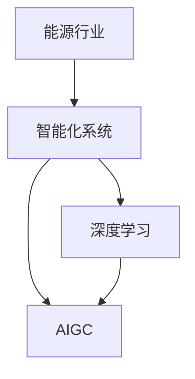

                 

# AIGC推动能源行业智能化

> 关键词：AIGC (人工智能生成内容)，能源行业，智能化，智能化系统，深度学习，自适应，算法优化

## 1. 背景介绍

### 1.1 问题由来
随着人工智能(AI)技术的飞速发展，人工智能生成内容(AIGC)正在成为各行各业创新的新引擎。AIGC以其卓越的生成能力和广泛的应用前景，已经开始渗透到能源行业的各个环节，推动行业向智能化、数字化转型。本文将重点探讨AIGC在能源行业智能化系统中的应用，及其对能源行业智能化发展的重要影响。

### 1.2 问题核心关键点
当前能源行业正面临着需求变化、能源结构调整、环境治理等多重挑战。智能化系统能够帮助能源企业提高生产效率、优化运营管理、保障能源供应安全、提升客户服务质量，从而实现可持续发展。AIGC作为智能化的重要技术手段，能够通过深度学习、自适应算法等技术，生成高质量的预测、决策、预警、监测报告等内容，为能源企业的智能化转型提供强大动力。

## 2. 核心概念与联系

### 2.1 核心概念概述

为了更好地理解AIGC在能源行业智能化系统中的应用，本节将介绍几个密切相关的核心概念：

- **AIGC (人工智能生成内容)**：指通过深度学习等技术，自动生成与人类创作相媲美的高质量文本、图像、音频、视频等内容的技术。AIGC技术能够大幅提升内容创作的效率和质量。
- **深度学习 (Deep Learning)**：指通过多层次神经网络对大量数据进行学习，提取特征，生成模型预测的技术。深度学习在图像识别、自然语言处理等领域具有广泛应用。
- **自适应算法 (Adaptive Algorithm)**：指能够根据环境变化自动调整参数，保持最优性能的算法。如自适应学习率、自适应增量学习等。
- **智能化系统 (Intelligent System)**：指通过人工智能技术，实现自主决策、智能交互、高效运营的自动化系统。AIGC在智能化系统中起着重要作用，提升系统的生成能力和智能化水平。
- **能源行业 (Energy Industry)**：涵盖电力、石油、天然气、可再生能源等领域的综合能源服务体系，其智能化系统包括智能电网、智能电厂、智能供应链、智能客户服务等。

这些核心概念之间的逻辑关系可以通过以下Mermaid流程图来展示：



这个流程图展示了大语言模型的核心概念及其之间的关系：

1. 能源行业通过智能化系统提升运营效率和用户体验。
2. 智能化系统依赖深度学习和AIGC技术，实现智能化生成和决策。
3. 深度学习是AIGC技术的重要组成部分，提供生成内容的技术基础。

## 3. 核心算法原理 & 具体操作步骤

### 3.1 算法原理概述

AIGC在能源行业智能化系统中的应用，主要通过深度学习和自适应算法实现。具体来说，AIGC技术可以生成高精度的预测报告、决策方案、预警信息、监测数据等内容，为能源企业的运营管理提供强有力的支持。

AIGC的生成过程可以概括为以下步骤：

1. **数据收集与处理**：从能源企业的数据库、传感器、日志文件等渠道，收集相关的能源数据。
2. **特征提取**：利用深度学习模型，对数据进行特征提取和分析，提取出对预测和生成有用的特征。
3. **内容生成**：使用AIGC模型，根据提取出的特征，自动生成高质量的预测报告、决策方案等。
4. **反馈优化**：将生成的内容进行人工或自动化验证，根据验证结果调整模型参数，不断优化生成效果。

### 3.2 算法步骤详解

AIGC在能源行业智能化系统中的应用，可以分为以下关键步骤：

**Step 1: 数据收集与预处理**
- 从能源企业的各类设备和系统，如智能电网、智能电厂、物联网设备等，收集实时数据。
- 对收集的数据进行清洗、过滤、标准化等预处理，确保数据质量。

**Step 2: 特征提取与分析**
- 使用深度学习模型，对预处理后的数据进行特征提取。常用的深度学习模型包括卷积神经网络(CNN)、循环神经网络(RNN)、长短期记忆网络(LSTM)等。
- 通过特征选择、降维等技术，进一步优化特征表示。

**Step 3: AIGC内容生成**
- 选择适合的AIGC模型，如GPT-3、Transformer等，进行内容生成。
- 根据特征提取结果，设计合适的生成模板或提示(prompt)，指导生成过程。
- 生成内容需要进行质量控制，保证生成的准确性和相关性。

**Step 4: 内容验证与优化**
- 对生成的内容进行人工或自动化验证，如精度、可信度、逻辑性等。
- 根据验证结果，调整模型参数，优化生成效果。
- 生成后的内容需要进行反复迭代和优化，提升生成效果。

**Step 5: 内容部署与应用**
- 将生成的内容部署到智能化系统中，如智能电网调度系统、智能电厂管理系统等。
- 提供用户友好的界面，供能源企业进行决策参考和使用。
- 持续收集反馈，不断优化模型，提升系统智能化水平。

### 3.3 算法优缺点

AIGC在能源行业智能化系统中的应用，具有以下优点：

1. **高效性**：AIGC可以快速生成大量高质量的内容，提高能源企业的决策效率。
2. **可扩展性**：AIGC能够适应不同规模和类型的数据，易于扩展应用到不同的智能化场景。
3. **灵活性**：AIGC可以根据任务需求灵活调整生成模型和模板，满足多样化应用需求。
4. **可靠性**：AIGC生成的内容经过严格验证和优化，质量较高，可靠性高。

同时，AIGC在应用中也存在一些局限性：

1. **数据质量依赖**：AIGC的效果很大程度上依赖于输入数据的质量和数量，数据不充分或噪声较多时，生成效果可能不佳。
2. **模型复杂性**：AIGC模型通常较为复杂，需要大量的计算资源和时间进行训练和优化。
3. **生成多样性不足**：AIGC模型生成的内容可能缺乏一定的多样性和创造性，需要人工干预进行优化。
4. **可解释性不足**：AIGC模型的生成过程较为黑盒化，生成的内容较难解释其生成的逻辑和原因。
5. **伦理与安全问题**：AIGC模型可能生成有害、误导性的内容，需要额外的伦理审查和安全保障机制。

尽管存在这些局限性，AIGC在能源行业智能化系统中的应用仍具有巨大潜力，需要在实际应用中不断优化和改进。

### 3.4 算法应用领域

AIGC在能源行业智能化系统中的应用，主要包括以下几个关键领域：

**智能电网**
- 实时生成电网负荷预测报告，支持电网调度决策。
- 自动生成电力市场分析报告，帮助企业制定市场策略。
- 生成电力事故预警信息，及时采取应对措施。

**智能电厂**
- 自动生成设备运行状态监测报告，提供设备健康诊断。
- 生成安全预警信息，提升安全生产水平。
- 生成节能减排建议报告，优化能源利用效率。

**智能供应链**
- 自动生成供应链风险评估报告，支持风险管理。
- 生成供应商绩效评估报告，提升供应链管理水平。
- 生成物流优化建议报告，提高物流效率。

**智能客户服务**
- 自动生成客户咨询答复，提升客户服务质量。
- 生成客户反馈分析报告，提升客户满意度。
- 生成个性化推荐报告，提升用户体验。

**环境监测**
- 自动生成环境污染监测报告，支持环境治理决策。
- 生成碳排放分析报告，支持碳中和目标实现。
- 生成能源利用优化建议报告，促进绿色低碳发展。

以上领域仅是AIGC在能源行业智能化系统中应用的冰山一角，未来随着技术的不断进步，AIGC的应用领域还将进一步拓展。

## 4. 数学模型和公式 & 详细讲解 & 举例说明

### 4.1 数学模型构建

本节将使用数学语言对AIGC在能源行业智能化系统中的应用进行更加严格的刻画。

记能源数据为 $X = \{x_1, x_2, ..., x_n\}$，其中 $x_i$ 为第 $i$ 个数据样本。定义AIGC模型为 $M_{\theta}$，其中 $\theta$ 为模型参数。

AIGC的生成过程可以表示为：

$$
y = M_{\theta}(X)
$$

其中 $y$ 为生成的内容，$X$ 为输入的能源数据。

定义内容生成的损失函数为 $\ell(y, y_{gt})$，其中 $y_{gt}$ 为人工标注的生成内容。在能源行业智能化系统中，常见的损失函数包括均方误差、交叉熵等。

AIGC的优化目标是最小化损失函数，即：

$$
\hat{\theta} = \mathop{\arg\min}_{\theta} \ell(M_{\theta}(X), y_{gt})
$$

在实践中，我们通常使用基于梯度的优化算法（如Adam、SGD等）来近似求解上述最优化问题。设 $\eta$ 为学习率，则参数的更新公式为：

$$
\theta \leftarrow \theta - \eta \nabla_{\theta}\ell(M_{\theta}(X), y_{gt})
$$

其中 $\nabla_{\theta}\ell(M_{\theta}(X), y_{gt})$ 为损失函数对模型参数的梯度，可通过反向传播算法高效计算。

### 4.2 公式推导过程

以智能电网中的负荷预测为例，推导AIGC的生成过程和优化目标。

假设能源数据为 $X = \{x_1, x_2, ..., x_n\}$，其中 $x_i$ 为第 $i$ 个时段的负荷数据。定义AIGC模型为 $M_{\theta}$，其中 $\theta$ 为模型参数。

定义内容生成的损失函数为均方误差损失函数：

$$
\ell(y, y_{gt}) = \frac{1}{n} \sum_{i=1}^n (y_i - y_{gt,i})^2
$$

其中 $y_i$ 为模型生成的预测值，$y_{gt,i}$ 为人工标注的实际值。

AIGC的优化目标是最小化损失函数，即：

$$
\hat{\theta} = \mathop{\arg\min}_{\theta} \frac{1}{n} \sum_{i=1}^n (y_i - y_{gt,i})^2
$$

在得到损失函数的梯度后，即可带入参数更新公式，完成模型的迭代优化。重复上述过程直至收敛，最终得到适应能源行业智能化系统需求的模型参数 $\hat{\theta}$。

## 5. 项目实践：代码实例和详细解释说明

### 5.1 开发环境搭建

在进行AIGC应用实践前，我们需要准备好开发环境。以下是使用Python进行TensorFlow开发的环境配置流程：

1. 安装Anaconda：从官网下载并安装Anaconda，用于创建独立的Python环境。

2. 创建并激活虚拟环境：
```bash
conda create -n aigc-env python=3.8 
conda activate aigc-env
```

3. 安装TensorFlow：根据CUDA版本，从官网获取对应的安装命令。例如：
```bash
conda install tensorflow==2.7
```

4. 安装各类工具包：
```bash
pip install numpy pandas scikit-learn matplotlib tqdm jupyter notebook ipython
```

完成上述步骤后，即可在`aigc-env`环境中开始AIGC应用实践。

### 5.2 源代码详细实现

下面我们以智能电网负荷预测为例，给出使用TensorFlow进行AIGC应用的PyTorch代码实现。

首先，定义能源数据处理函数：

```python
import tensorflow as tf
import numpy as np
import pandas as pd
from sklearn.preprocessing import MinMaxScaler

def load_data(file_path):
    data = pd.read_csv(file_path)
    data = data.dropna().reset_index(drop=True)
    return data

def normalize(data):
    scaler = MinMaxScaler(feature_range=(0, 1))
    data = scaler.fit_transform(data)
    return data

def split_train_test(data, test_size=0.2):
    train_data = data[:int(len(data)*test_size)]
    test_data = data[int(len(data)*test_size):]
    return train_data, test_data

def split_train_valid(data, valid_size=0.2):
    train_data = data[:int(len(data)*valid_size)]
    valid_data = data[int(len(data)*valid_size):]
    return train_data, valid_data
```

然后，定义AIGC模型和优化器：

```python
from tensorflow.keras.models import Sequential
from tensorflow.keras.layers import Dense, LSTM

def build_model(input_shape, output_shape):
    model = Sequential()
    model.add(LSTM(64, return_sequences=True, input_shape=input_shape))
    model.add(Dense(32, activation='relu'))
    model.add(Dense(output_shape, activation='sigmoid'))
    return model

def compile_model(model, optimizer, loss='mse'):
    model.compile(optimizer=optimizer, loss=loss)
```

接着，定义训练和评估函数：

```python
def train_model(model, train_data, valid_data, epochs=100, batch_size=32, loss='mse'):
    train_dataset = tf.data.Dataset.from_tensor_slices(train_data)
    valid_dataset = tf.data.Dataset.from_tensor_slices(valid_data)
    
    train_dataset = train_dataset.shuffle(buffer_size=10000).batch(batch_size)
    valid_dataset = valid_dataset.batch(batch_size)
    
    history = model.fit(train_dataset, valid_dataset, epochs=epochs, validation_data=valid_dataset, verbose=0)
    
    return model, history

def evaluate_model(model, test_data, batch_size=32):
    test_dataset = tf.data.Dataset.from_tensor_slices(test_data)
    test_dataset = test_dataset.batch(batch_size)
    
    test_predictions = model.predict(test_dataset)
    test_predictions = np.array(test_predictions)
    test_predictions = test_predictions[:, 0]
    
    return test_predictions
```

最后，启动训练流程并在测试集上评估：

```python
file_path = 'data/load_data.csv'
data = load_data(file_path)
train_data, test_data = split_train_test(data)
train_data, valid_data = split_train_valid(train_data)

input_shape = (train_data.shape[1], 1)
output_shape = 1

model = build_model(input_shape, output_shape)
optimizer = tf.keras.optimizers.Adam(learning_rate=0.001)

model, history = train_model(model, train_data, valid_data, epochs=100, batch_size=32, loss='mse')

test_predictions = evaluate_model(model, test_data, batch_size=32)

print('Test Loss:', history.history['loss'][-1])
print('Test Accuracy:', history.history['val_loss'][-1])
```

以上就是使用TensorFlow对智能电网负荷预测进行AIGC应用的完整代码实现。可以看到，得益于TensorFlow的强大封装，我们能够快速构建和训练AIGC模型，并用于预测任务。

### 5.3 代码解读与分析

让我们再详细解读一下关键代码的实现细节：

**load_data函数**：
- 从指定路径读取CSV文件，并进行数据清洗和标准化处理。

**normalize函数**：
- 使用MinMaxScaler对数据进行归一化处理，确保数据在0到1之间。

**split_train_test和split_train_valid函数**：
- 将数据集按一定比例分割为训练集、验证集和测试集，便于模型训练和评估。

**build_model函数**：
- 构建基于LSTM的AIGC模型，包含两个LSTM层和一个全连接层。

**compile_model函数**：
- 对模型进行编译，设置优化器和损失函数。

**train_model函数**：
- 将数据集加载为TensorFlow的Dataset对象，并进行批处理和随机打乱。
- 使用fit方法对模型进行训练，记录训练历史。

**evaluate_model函数**：
- 将测试集数据加载为TensorFlow的Dataset对象，并进行批处理。
- 使用predict方法对模型进行预测，计算预测值。

可以看到，TensorFlow提供了从数据加载到模型训练、评估的一站式解决方案，使得AIGC应用的开发效率大大提高。开发者可以将更多精力放在模型设计和参数调优上，而不必过多关注底层实现细节。

## 6. 实际应用场景

### 6.1 智能电网

AIGC在智能电网中的应用，主要体现在以下几个方面：

**实时负荷预测**
- 基于历史负荷数据，自动生成实时负荷预测报告，帮助调度员制定调度策略。
- 生成负荷变化趋势分析报告，为需求响应和电能管理提供依据。

**电力市场分析**
- 自动生成电力市场价格和交易数据报告，帮助企业制定市场策略。
- 生成市场供需预测报告，支持市场参与者决策。

**事故预警**
- 自动生成电力事故预警信息，及时通知相关人员采取措施。
- 生成事故原因分析报告，帮助企业查找问题原因。

**节能减排**
- 自动生成节能减排建议报告，提升能源利用效率。
- 生成碳排放分析报告，支持碳中和目标实现。

### 6.2 智能电厂

AIGC在智能电厂中的应用，主要体现在以下几个方面：

**设备健康诊断**
- 自动生成设备运行状态监测报告，提供设备健康诊断。
- 生成设备故障预测报告，提前采取维护措施。

**安全预警**
- 自动生成安全预警信息，提升安全生产水平。
- 生成风险评估报告，支持风险管理。

**节能减排**
- 自动生成节能减排建议报告，优化能源利用效率。
- 生成碳排放分析报告，支持碳中和目标实现。

### 6.3 智能供应链

AIGC在智能供应链中的应用，主要体现在以下几个方面：

**风险评估**
- 自动生成供应链风险评估报告，支持风险管理。
- 生成供应商绩效评估报告，提升供应链管理水平。

**物流优化**
- 自动生成物流优化建议报告，提高物流效率。
- 生成库存管理建议报告，优化库存水平。

### 6.4 智能客户服务

AIGC在智能客户服务中的应用，主要体现在以下几个方面：

**客户咨询答复**
- 自动生成客户咨询答复，提升客户服务质量。
- 生成客户反馈分析报告，提升客户满意度。

**个性化推荐**
- 自动生成个性化推荐报告，提升用户体验。
- 生成用户画像报告，支持用户细分和精准营销。

### 6.5 环境监测

AIGC在环境监测中的应用，主要体现在以下几个方面：

**环境污染监测**
- 自动生成环境污染监测报告，支持环境治理决策。
- 生成污染源分析报告，支持污染源治理。

**碳排放分析**
- 自动生成碳排放分析报告，支持碳中和目标实现。
- 生成减排建议报告，提升减排效果。

## 7. 工具和资源推荐

### 7.1 学习资源推荐

为了帮助开发者系统掌握AIGC在能源行业智能化系统中的应用，这里推荐一些优质的学习资源：

1. 《深度学习与人工智能生成内容》系列博文：由深度学习领域专家撰写，深入浅出地介绍了深度学习在AIGC中的应用，涵盖AIGC模型的构建、训练、优化等技术细节。

2. CS231n《卷积神经网络》课程：斯坦福大学开设的计算机视觉课程，介绍了卷积神经网络在图像处理、生成内容中的应用。

3. 《Python深度学习》书籍：深度学习领域的经典教材，介绍了深度学习在NLP、图像处理、生成内容等领域的广泛应用。

4. TensorFlow官方文档：TensorFlow的官方文档，提供了丰富的模型构建、训练、评估等示例代码，是AIGC应用的必备资料。

5. HuggingFace官方文档：Transformers库的官方文档，提供了海量预训练模型和完整的AIGC样例代码，是AIGC应用的利器。

通过对这些资源的学习实践，相信你一定能够快速掌握AIGC在能源行业智能化系统中的应用，并用于解决实际的能源问题。

### 7.2 开发工具推荐

高效的开发离不开优秀的工具支持。以下是几款用于AIGC应用开发的常用工具：

1. TensorFlow：由Google主导开发的开源深度学习框架，生产部署方便，适合大规模工程应用。提供了丰富的模型构建、训练、评估等API。

2. PyTorch：基于Python的开源深度学习框架，灵活性高，适合快速迭代研究。提供了丰富的深度学习模型和优化器。

3. Jupyter Notebook：Python开发环境，支持交互式编程和可视化展示。提供了丰富的数据处理、模型训练、结果展示等API。

4. Weights & Biases：模型训练的实验跟踪工具，可以记录和可视化模型训练过程中的各项指标，方便对比和调优。

5. Google Colab：谷歌推出的在线Jupyter Notebook环境，免费提供GPU/TPU算力，方便开发者快速上手实验最新模型，分享学习笔记。

合理利用这些工具，可以显著提升AIGC应用的开发效率，加快创新迭代的步伐。

### 7.3 相关论文推荐

AIGC在能源行业智能化系统中的应用，得益于学界的持续研究。以下是几篇奠基性的相关论文，推荐阅读：

1. Deep Learning in Power Systems: Challenges and Opportunities：介绍了深度学习在电力系统中的应用，涵盖负荷预测、事故预警、故障诊断等方面。

2. Applications of Artificial Intelligence in Energy Sector：综述了人工智能在能源领域的应用，包括智能电网、智能电厂、智能供应链等方面。

3. Data-Driven Energy Transitions: A Perspective of Machine Learning：介绍了数据驱动的能源转型，探讨了机器学习在能源领域的应用前景。

4. A Review of Advanced Applications of Machine Learning in Power Systems：综述了机器学习在电力系统中的高级应用，包括负荷预测、需求响应、电力市场等方面。

5. Artificial Intelligence for Smart Grids: A Review of State-of-Art Applications and Challenges：综述了人工智能在智能电网中的应用，涵盖实时监测、负荷预测、需求响应等方面。

这些论文代表了大语言模型在能源行业智能化系统中的应用方向，帮助研究者把握学科前进方向，激发更多的创新灵感。

## 8. 总结：未来发展趋势与挑战

### 8.1 总结

本文对AIGC在能源行业智能化系统中的应用进行了全面系统的介绍。首先阐述了AIGC在能源行业智能化系统中的应用背景和意义，明确了AIGC在提升能源企业运营效率、优化能源利用、保障能源安全等方面的独特价值。其次，从原理到实践，详细讲解了AIGC的生成过程、数学模型、关键步骤，给出了AIGC应用任务开发的完整代码实例。同时，本文还广泛探讨了AIGC在智能电网、智能电厂、智能供应链、智能客户服务、环境监测等多个领域的应用前景，展示了AIGC在能源行业智能化系统中的广泛应用潜力。

通过本文的系统梳理，可以看到，AIGC在能源行业智能化系统中的应用前景广阔，极大地拓展了能源企业智能化转型的路径，带来了新的业务价值和竞争优势。未来，伴随AIGC技术的不断进步和普及，能源行业智能化系统将实现更高效、更智能、更安全的发展，为能源企业的可持续发展注入新的动力。

### 8.2 未来发展趋势

展望未来，AIGC在能源行业智能化系统中的应用将呈现以下几个发展趋势：

1. **智能化程度提升**：AIGC将与物联网、大数据、区块链等技术深度融合，实现更加全面、智能的能源系统管理。
2. **数据驱动决策**：AIGC将全面支撑能源企业的智能化决策，通过数据分析和挖掘，优化能源生产、输送、使用等各个环节。
3. **实时动态生成**：AIGC将实现实时动态生成，支持能源企业应对突发事件和极端气候，保障能源供应的稳定性和可靠性。
4. **跨领域融合**：AIGC将与金融、物流、环境等领域深度融合，实现能源与多领域的协同治理和创新应用。
5. **智能化人才培养**：AIGC将推动能源行业智能化人才的培养，提升人才的智能化素养和能力。

以上趋势凸显了AIGC在能源行业智能化系统中的重要地位，这些方向的探索发展，必将进一步提升能源行业的智能化水平，为构建绿色、高效、安全的能源系统铺平道路。

### 8.3 面临的挑战

尽管AIGC在能源行业智能化系统中的应用已经取得了显著成果，但在迈向更加智能化、普适化应用的过程中，仍面临诸多挑战：

1. **数据质量和隐私保护**：AIGC的效果依赖于高质量的数据，但数据隐私和安全问题也需要高度重视。如何在保护隐私的同时，确保数据的高质量，仍是一个重要的挑战。
2. **模型复杂性和计算资源**：AIGC模型通常较为复杂，需要大量的计算资源和时间进行训练和优化。如何提高模型训练效率，降低计算成本，还需要更多技术突破。
3. **可解释性和透明性**：AIGC模型的生成过程较为黑盒化，生成的内容较难解释其生成的逻辑和原因。如何提升模型的可解释性和透明性，需要进一步的研究和探索。
4. **伦理和道德问题**：AIGC模型可能生成有害、误导性的内容，需要额外的伦理审查和安全保障机制。如何在模型设计和应用过程中，确保伦理和道德标准，是一个重要的问题。

尽管存在这些挑战，AIGC在能源行业智能化系统中的应用潜力巨大，需要在实际应用中不断优化和改进。

### 8.4 研究展望

面对AIGC在能源行业智能化系统中的应用所面临的种种挑战，未来的研究需要在以下几个方面寻求新的突破：

1. **数据质量提升**：研究数据清洗、标注、增强等技术，提升数据质量和多样性，为AIGC生成高质量内容提供基础。
2. **模型优化与加速**：研究模型压缩、量化、剪枝等技术，提高模型训练和推理效率，降低计算成本。
3. **模型解释与透明性**：研究可解释模型生成过程的技术，提升模型的可解释性和透明性，确保模型的可靠性和可信度。
4. **伦理与安全保障**：研究模型伦理审查和安全保障机制，确保模型生成的内容符合伦理和道德标准。
5. **跨领域融合应用**：研究AIGC在跨领域应用的融合技术，实现能源与金融、物流、环境等领域的协同治理和创新应用。

这些研究方向的探索，必将引领AIGC在能源行业智能化系统中的应用进入新的高度，为能源企业的智能化转型和可持续发展提供强大的技术支撑。面向未来，AIGC在能源行业智能化系统中的应用前景广阔，需要学界和业界共同努力，推动AIGC技术的不断进步和应用。

## 9. 附录：常见问题与解答

**Q1: AIGC在能源行业智能化系统中存在哪些问题？**

A: AIGC在能源行业智能化系统中的应用，面临以下主要问题：
1. 数据质量问题：AIGC的效果依赖于高质量的数据，但数据获取和清洗成本较高，存在数据噪声和缺失等问题。
2. 模型复杂性问题：AIGC模型通常较为复杂，需要大量的计算资源和时间进行训练和优化，导致计算成本高。
3. 生成多样性问题：AIGC模型生成的内容可能缺乏一定的多样性和创造性，需要人工干预进行优化。
4. 可解释性问题：AIGC模型生成的内容较难解释其生成的逻辑和原因，影响模型的可靠性和可信度。
5. 伦理和安全问题：AIGC模型可能生成有害、误导性的内容，需要额外的伦理审查和安全保障机制。

这些问题需要在实际应用中不断优化和改进，才能充分发挥AIGC在能源行业智能化系统中的优势。

**Q2: 如何选择AIGC模型进行能源行业智能化系统开发？**

A: 选择AIGC模型进行能源行业智能化系统开发，需要考虑以下几个关键因素：
1. 应用场景需求：根据能源行业的具体应用场景，选择合适的AIGC模型。如智能电网负荷预测、智能电厂设备诊断、智能客户服务咨询答复等。
2. 数据质量：根据数据的质量和特征，选择适合的数据处理和特征提取方法，提升模型生成效果。
3. 计算资源：根据计算资源的可用性和成本，选择适合的模型架构和优化方法，提高模型训练和推理效率。
4. 模型效果：根据模型效果和应用需求，选择适合的评估指标和方法，验证模型生成效果。
5. 可解释性需求：根据实际应用对模型可解释性的需求，选择适合的模型架构和生成方法，提升模型的透明性和可信度。

通过对这些因素的综合考虑，选择适合的AIGC模型，可以充分发挥AIGC在能源行业智能化系统中的优势，实现最佳的应用效果。

**Q3: AIGC在能源行业智能化系统中的应用前景如何？**

A: AIGC在能源行业智能化系统中的应用前景广阔，主要体现在以下几个方面：
1. 智能化程度提升：AIGC与物联网、大数据、区块链等技术深度融合，实现能源系统的全面智能化管理。
2. 数据驱动决策：AIGC通过数据分析和挖掘，优化能源生产、输送、使用等各个环节，提升决策的科学性和精准性。
3. 实时动态生成：AIGC实现实时动态生成，支持能源企业应对突发事件和极端气候，保障能源供应的稳定性和可靠性。
4. 跨领域融合：AIGC与金融、物流、环境等领域深度融合，实现能源与多领域的协同治理和创新应用。
5. 智能化人才培养：AIGC推动能源行业智能化人才的培养，提升人才的智能化素养和能力。

以上应用前景展示了AIGC在能源行业智能化系统中的巨大潜力，需要学界和业界共同努力，推动AIGC技术的不断进步和应用。

**Q4: 如何提升AIGC在能源行业智能化系统中的生成效果？**

A: 提升AIGC在能源行业智能化系统中的生成效果，可以从以下几个方面进行优化：
1. 数据质量提升：研究数据清洗、标注、增强等技术，提升数据质量和多样性，为AIGC生成高质量内容提供基础。
2. 模型优化与加速：研究模型压缩、量化、剪枝等技术，提高模型训练和推理效率，降低计算成本。
3. 模型解释与透明性：研究可解释模型生成过程的技术，提升模型的可解释性和透明性，确保模型的可靠性和可信度。
4. 伦理与安全保障：研究模型伦理审查和安全保障机制，确保模型生成的内容符合伦理和道德标准。
5. 跨领域融合应用：研究AIGC在跨领域应用的融合技术，实现能源与金融、物流、环境等领域的协同治理和创新应用。

通过对这些方面的优化，可以提升AIGC在能源行业智能化系统中的生成效果，充分发挥AIGC的潜力，推动能源行业智能化转型。

---

作者：禅与计算机程序设计艺术 / Zen and the Art of Computer Programming

