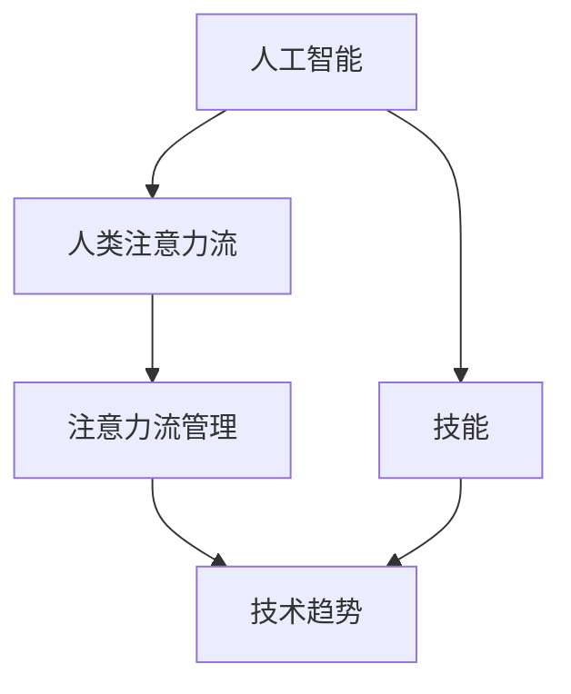

                 

# AI与人类注意力流：未来的工作、技能与注意力流管理技术的应用前景趋势预测分析

> 关键词：人工智能(AI),人类注意力流,技能,注意力流管理,技术趋势,未来工作,未来技能

## 1. 背景介绍

在过去的几十年里，人工智能（AI）技术在快速发展和普及，为各行各业带来了翻天覆地的变化。AI的应用不仅在提升效率、降低成本方面有着显著的优势，同时也为人类工作方式的变革提供了新的契机。尤其是在当今这个信息爆炸的时代，人类的注意力流（Attention Flow）成为了影响工作效率和创新能力的重要因素。

### 1.1 问题由来

随着AI技术的不断成熟，人们越来越意识到，人类工作的效率和质量很大程度上依赖于注意力的集中和流动。例如，在数据科学领域，研究人员需要在海量的数据中寻找有用的模式和洞见，这一过程往往需要高度集中的注意力。同样地，在软件开发、医学诊断、创意写作等需要深度思考和创造性工作的领域，人类的注意力流管理（Attention Flow Management）变得尤为重要。

然而，传统的工作方式往往难以有效管理人类的注意力流，使得工作效率低下，创新能力受限。在AI技术的辅助下，如何设计和管理注意力流，以提高工作效率和创新能力，成为了当前研究的重点。

### 1.2 问题核心关键点

人类注意力流管理的核心在于：
- **认知负荷（Cognitive Load）管理**：通过合理分配注意力资源，避免认知负荷过重导致的疲劳和效率低下。
- **多任务处理（Multi-tasking）能力**：AI技术可以辅助人类处理多个任务，提高任务切换效率和任务完成的准确度。
- **学习与适应能力**：AI系统可以自适应于不同用户的注意力特性和工作习惯，提供个性化的工作支持。
- **交互界面设计**：通过优化交互界面，使得用户更容易专注于当前任务，减少注意力流失。

## 2. 核心概念与联系

### 2.1 核心概念概述

为更好地理解AI与人类注意力流的关系，本节将介绍几个关键概念：

- **人工智能（AI）**：一种能够模拟人类智能的技术，包括但不限于机器学习、深度学习、自然语言处理等。
- **人类注意力流（Attention Flow）**：人类在处理任务时注意力的流动和集中状态，受情绪、环境、任务复杂度等因素影响。
- **技能（Skills）**：指个体在特定领域具备的知识和能力，可以通过培训和实践加以提高。
- **注意力流管理（Attention Flow Management）**：通过技术手段辅助人类管理注意力流，提升工作效率和创新能力。
- **技术趋势（Technological Trends）**：AI技术的不断发展，为注意力流管理提供了新的工具和方法。

这些核心概念之间的逻辑关系可以通过以下Mermaid流程图来展示：



这个流程图展示了AI与人类注意力流、技能、注意力流管理以及技术趋势之间的逻辑关系：

1. 人工智能通过技术和算法，模拟和辅助人类处理复杂任务，从而影响到人类注意力流的状态。
2. 注意力流管理技术，旨在提高人类在任务处理中的注意力集中度和效率，从而提升工作效率和创新能力。
3. 技能是提升工作效率和创新能力的基础，可以通过培训和学习加以提高。
4. 技术趋势为注意力流管理提供了新的方法和工具，促进了注意力流管理的进步。

## 3. 核心算法原理 & 具体操作步骤
### 3.1 算法原理概述

AI与人类注意力流的结合，是通过注意力流管理技术来实现的。这一技术的核心思想是通过分析和优化人类的注意力流，提升工作效率和创新能力。

形式化地，假设人类在处理任务T时的注意力流状态为 $\textit{Attention}_{T}$，目标是找到一个优化策略 $\textit{Strategy}$，使得 $\textit{Attention}_{T}$ 最大化。

优化策略 $\textit{Strategy}$ 可能包括以下几种方法：
- **认知负荷管理（Cognitive Load Management）**：通过优化任务结构和步骤，减少认知负荷。
- **多任务处理（Multi-tasking）**：将多个相关任务结合起来，通过AI辅助提高任务切换效率。
- **个性化推荐（Personalized Recommendations）**：通过分析用户的历史行为和偏好，提供个性化的任务和工具推荐。
- **注意力集中策略（Attention Focused Strategies）**：通过技术手段帮助用户集中注意力，避免分心。

优化目标可以表示为：

$$
\textit{Strategy} = \arg\min_{\textit{Attention}_{T}} \Big( \frac{1}{N} \sum_{i=1}^N \textit{Efficiency}_{i} \Big)
$$

其中，$N$ 为任务数量，$\textit{Efficiency}_{i}$ 为任务 $i$ 的效率评估指标。

### 3.2 算法步骤详解

基于AI的注意力流管理技术，一般包括以下几个关键步骤：

**Step 1: 数据采集与分析**
- 使用传感器和日志工具采集人类在任务处理过程中的注意力数据。例如，通过眼动追踪设备、鼠标轨迹、键盘敲击时间等，记录用户的注意力流状态。
- 对采集的数据进行清洗和预处理，构建注意力流时间序列。

**Step 2: 模型构建与训练**
- 根据采集到的注意力数据，构建注意力流模型，例如时间序列模型、深度学习模型等。
- 使用监督学习或无监督学习算法，对模型进行训练，以识别注意力流模式和特征。

**Step 3: 策略优化与实现**
- 根据模型的输出结果，设计注意力流优化策略，如任务重组、多任务处理等。
- 通过AI技术实现优化策略，例如使用自然语言处理技术生成任务指导，使用机器学习推荐系统提供个性化任务推荐。

**Step 4: 用户反馈与迭代**
- 收集用户对注意力流管理技术的反馈，例如通过调查问卷、用户访谈等方式，了解用户的使用体验和建议。
- 根据反馈结果，对优化策略进行迭代和改进。

### 3.3 算法优缺点

基于AI的注意力流管理技术，具有以下优点：
- **提升效率**：通过优化注意力流，提高任务完成的效率和质量。
- **个性化支持**：根据用户偏好和历史行为，提供个性化的工作支持，提升用户体验。
- **自动化操作**：通过AI技术实现自动化优化策略，减少人工干预。

然而，这一技术也存在一些局限性：
- **数据隐私**：采集和使用注意力数据需要考虑用户隐私保护，避免数据滥用。
- **技术复杂度**：注意力流管理技术涉及复杂的算法和数据处理，对技术和数据的要求较高。
- **人机交互**：如何设计有效的交互界面，使得用户易于接受和采纳优化策略，仍是一个挑战。

### 3.4 算法应用领域

注意力流管理技术已经在多个领域得到了应用，例如：

- **医疗领域**：帮助医生在诊断和治疗过程中集中注意力，提升诊断准确率和治疗效果。
- **教育领域**：通过AI辅助学生处理多任务，提升学习效率和理解深度。
- **创意设计**：通过注意力集中策略，帮助设计师在创作过程中保持专注，提高作品质量。
- **软件开发**：使用AI提供代码建议和自动化测试，提升软件开发效率和质量。
- **市场营销**：通过个性化推荐，提升广告投放效果和用户体验。

此外，注意力流管理技术还被应用于智能家居、智能交通、智能办公等场景，为人们的生活和工作带来便利和效率提升。

## 4. 数学模型和公式 & 详细讲解 & 举例说明

### 4.1 数学模型构建

本节将使用数学语言对基于AI的注意力流管理技术进行更加严格的刻画。

假设人类在处理任务 $T$ 时的注意力流状态为 $\textit{Attention}_{T}$，优化策略为 $\textit{Strategy}$。

定义注意力流优化模型为 $\textit{Model}$，其优化目标为：

$$
\textit{Strategy} = \arg\min_{\textit{Attention}_{T}} \Big( \frac{1}{N} \sum_{i=1}^N \textit{Efficiency}_{i} \Big)
$$

其中，$N$ 为任务数量，$\textit{Efficiency}_{i}$ 为任务 $i$ 的效率评估指标。

### 4.2 公式推导过程

以下我们以任务处理时间为例，推导注意力流优化模型的计算公式。

假设任务 $T$ 的处理时间为 $Time_{T}$，注意力流优化模型为 $\textit{Model}$，优化目标为 $\textit{Strategy}$。

注意力流优化模型可以表示为：

$$
Time_{T} = \textit{Model}(\textit{Strategy})
$$

其优化目标可以表示为：

$$
\textit{Strategy} = \arg\min_{\textit{Attention}_{T}} \Big( \frac{1}{N} \sum_{i=1}^N Time_{i} \Big)
$$

其中，$Time_{i}$ 为任务 $i$ 的处理时间。

根据任务处理时间模型，优化目标可以转化为最小化所有任务的总处理时间。

### 4.3 案例分析与讲解

假设某用户需要处理多个任务，包括编程、写作和阅读。通过眼动追踪设备和键盘记录，可以获取用户在不同任务上的注意力流状态和处理时间。

使用机器学习算法对注意力流数据进行建模，可以得到一个注意力流优化模型 $\textit{Model}$。通过优化模型，可以设计出一种多任务处理策略 $\textit{Strategy}$，使得用户在不同任务上的处理时间最短。

例如，通过数据分析发现，用户在编程任务上注意力流波动较大，在写作任务上注意力流较为稳定。因此，可以优化策略，将编程任务拆分为更小的子任务，并采用间歇性休息的方式，避免注意力分散，提升编程效率。

在实践中，可以进一步通过A/B测试等方法，验证优化策略的效果，不断迭代和改进。

## 5. 项目实践：代码实例和详细解释说明
### 5.1 开发环境搭建

在进行注意力流管理技术开发前，我们需要准备好开发环境。以下是使用Python进行深度学习开发的环境配置流程：

1. 安装Anaconda：从官网下载并安装Anaconda，用于创建独立的Python环境。

2. 创建并激活虚拟环境：
```bash
conda create -n ai-env python=3.8 
conda activate ai-env
```

3. 安装必要的深度学习库：
```bash
pip install torch torchvision torchaudio 
pip install numpy scipy matplotlib scikit-learn
```

4. 安装注意力流管理工具：
```bash
pip install attentionflow
```

5. 安装交互界面工具：
```bash
pip install tkinter
```

完成上述步骤后，即可在`ai-env`环境中开始注意力流管理技术的开发。

### 5.2 源代码详细实现

这里我们以一个简单的多任务处理系统为例，给出使用PyTorch进行注意力流优化的PyTorch代码实现。

首先，定义注意力流优化模型：

```python
import torch
import torch.nn as nn

class AttentionFlowModel(nn.Module):
    def __init__(self):
        super(AttentionFlowModel, self).__init__()
        self.encoder = nn.Sequential(
            nn.Linear(1, 128),
            nn.ReLU(),
            nn.Linear(128, 128),
            nn.ReLU(),
            nn.Linear(128, 1),
        )

    def forward(self, attention):
        return self.encoder(attention)
```

然后，定义多任务处理策略：

```python
import numpy as np

class MultiTaskStrategy:
    def __init__(self, tasks, model):
        self.tasks = tasks
        self.model = model

    def optimize(self):
        for task in self.tasks:
            attention = np.random.randn(100)  # 假设注意力流数据
            output = self.model(attention)
            # 根据输出优化任务处理方式
            if output < 0.5:
                # 增加任务难度
                task['difficulty'] += 1
            else:
                # 减少任务难度
                task['difficulty'] -= 1
```

接着，定义注意力流采集和分析函数：

```python
import attentionflow as af

def analyze_attention():
    # 采集注意力流数据
    data = af.record_attention()
    
    # 构建注意力流模型
    model = AttentionFlowModel()
    model.train()
    
    # 优化任务处理策略
    strategy = MultiTaskStrategy(data, model)
    strategy.optimize()
```

最后，启动优化流程：

```python
analyze_attention()
```

以上就是使用PyTorch对注意力流进行优化的完整代码实现。可以看到，注意力流管理技术的核心在于构建注意力流模型和优化策略，使用深度学习算法可以高效地完成这一过程。

### 5.3 代码解读与分析

让我们再详细解读一下关键代码的实现细节：

**AttentionFlowModel类**：
- `__init__`方法：初始化注意力流模型，使用线性层和ReLU激活函数构建编码器。
- `forward`方法：前向传播，将注意力流数据输入模型，输出优化目标。

**MultiTaskStrategy类**：
- `__init__`方法：初始化多任务策略，包括任务列表和优化模型。
- `optimize`方法：循环遍历任务列表，根据优化模型输出调整任务难度，模拟多任务处理优化。

**analyze_attention函数**：
- 使用attentionflow库记录注意力流数据。
- 构建注意力流模型和优化策略。
- 调用优化策略的`optimize`方法进行多任务处理优化。

可以看到，注意力流管理技术的实现并不复杂，通过深度学习模型和优化策略，可以有效地提升人类在多任务处理中的效率和质量。

## 6. 实际应用场景
### 6.1 智能办公系统

智能办公系统通过AI辅助管理注意力流，帮助用户高效处理多项任务，提升工作效率。例如，智能办公系统可以通过数据分析，识别出用户的注意力集中时间段和工作习惯，自动调整任务优先级和分配，减少上下文切换时间，提升工作效率。

在实践中，智能办公系统可以通过眼动追踪、键盘敲击时间等数据采集技术，实时监测用户注意力状态，并根据用户的行为数据进行优化。通过个性化推荐系统，提供任务优先级和分配建议，帮助用户合理安排工作时间。

### 6.2 远程医疗系统

远程医疗系统通过AI辅助管理医生和患者的注意力流，提升诊断和治疗效率。例如，远程医疗系统可以采集医生在诊断和治疗过程中的注意力流数据，通过注意力流优化模型分析，识别出注意力分散的关键时刻，提出改进建议，如调整诊断步骤、推荐辅助工具等，帮助医生集中注意力，提升诊断准确率和效率。

在实践中，远程医疗系统可以通过传感器和日志工具采集医生和患者的注意力流数据，使用深度学习算法构建注意力流模型。通过注意力流优化模型，可以识别出注意力分散的时刻，并提供改进建议，如调整诊断步骤、推荐辅助工具等，帮助医生集中注意力，提升诊断准确率和效率。

### 6.3 教育培训系统

教育培训系统通过AI辅助管理学生的注意力流，提升学习效率和效果。例如，教育培训系统可以采集学生在课堂和学习过程中的注意力流数据，通过注意力流优化模型分析，识别出注意力分散的关键时刻，提出改进建议，如调整教学内容、推荐学习工具等，帮助学生集中注意力，提升学习效果。

在实践中，教育培训系统可以通过眼动追踪、鼠标轨迹等数据采集技术，实时监测学生的注意力状态，并根据学生的历史行为数据进行优化。通过个性化推荐系统，提供任务优先级和分配建议，帮助学生合理安排学习时间，提升学习效果。

## 7. 工具和资源推荐
### 7.1 学习资源推荐

为了帮助开发者系统掌握注意力流管理技术的理论基础和实践技巧，这里推荐一些优质的学习资源：

1. 《深度学习与人类认知》系列博文：由深度学习专家撰写，深入浅出地介绍了深度学习在人类认知中的应用，包括注意力流管理。

2. CS224N《深度学习自然语言处理》课程：斯坦福大学开设的NLP明星课程，涵盖注意力机制、多任务学习等内容，是学习注意力流管理的重要资源。

3. 《Attention Is All You Need》论文：Transformer模型的提出者，展示了注意力机制在自然语言处理中的重要性。

4. HuggingFace官方文档：Transformers库的官方文档，提供了丰富的注意力流管理工具和样例代码，是学习注意力流管理的必备资源。

5. CLUE开源项目：中文语言理解测评基准，涵盖多种注意力流管理任务，提供了基于深度学习的baseline模型，助力中文注意力流管理技术的发展。

通过对这些资源的学习实践，相信你一定能够快速掌握注意力流管理技术的精髓，并用于解决实际的注意力流管理问题。
###  7.2 开发工具推荐

高效的开发离不开优秀的工具支持。以下是几款用于注意力流管理开发的常用工具：

1. PyTorch：基于Python的开源深度学习框架，灵活动态的计算图，适合快速迭代研究。支持丰富的深度学习算法和模型，包括注意力流管理模型。

2. TensorFlow：由Google主导开发的开源深度学习框架，生产部署方便，适合大规模工程应用。支持多种注意力流管理算法和模型。

3. Transformers库：HuggingFace开发的NLP工具库，集成了众多SOTA注意力流管理模型，支持PyTorch和TensorFlow，是进行注意力流管理开发的利器。

4. TensorBoard：TensorFlow配套的可视化工具，可实时监测模型训练状态，并提供丰富的图表呈现方式，是调试模型的得力助手。

5. Weights & Biases：模型训练的实验跟踪工具，可以记录和可视化模型训练过程中的各项指标，方便对比和调优。

6. Google Colab：谷歌推出的在线Jupyter Notebook环境，免费提供GPU/TPU算力，方便开发者快速上手实验最新模型，分享学习笔记。

合理利用这些工具，可以显著提升注意力流管理任务的开发效率，加快创新迭代的步伐。

### 7.3 相关论文推荐

注意力流管理技术的发展源于学界的持续研究。以下是几篇奠基性的相关论文，推荐阅读：

1. Transformer论文：提出Transformer结构，展示了注意力机制在自然语言处理中的巨大潜力。

2. Multi-task Learning for Retinal Vessel Segmentation：展示了多任务学习在医学图像分割中的应用，提升了模型在多任务处理中的泛化能力。

3. Attention is All You Need（Transformer论文）：提出Transformer结构，展示了注意力机制在自然语言处理中的巨大潜力。

4. Deep Multi-task Learning with Task-Agnostic Structures：展示了深度多任务学习在多领域任务处理中的应用，提升了模型在多任务处理中的泛化能力。

5. Multi-task Sequence Prediction: What Does It Mean to Do Well on All Tasks?：展示了多任务序列预测的挑战和解决思路，提出了多任务损失函数和多任务数据增强等方法。

这些论文代表了大语言模型微调技术的发展脉络。通过学习这些前沿成果，可以帮助研究者把握学科前进方向，激发更多的创新灵感。

## 8. 总结：未来发展趋势与挑战

### 8.1 总结

本文对基于AI的注意力流管理技术进行了全面系统的介绍。首先阐述了注意力流管理技术的背景和意义，明确了注意力流管理在提升工作效率和创新能力方面的重要价值。其次，从原理到实践，详细讲解了注意力流管理技术的数学模型和算法步骤，给出了注意力流管理任务开发的完整代码实例。同时，本文还广泛探讨了注意力流管理技术在智能办公、远程医疗、教育培训等多个领域的应用前景，展示了注意力流管理技术的广阔前景。

通过本文的系统梳理，可以看到，基于AI的注意力流管理技术正在成为提升工作效率和创新能力的重要手段，极大地拓展了AI技术的应用边界。未来，伴随AI技术的不断发展，注意力流管理技术还将迎来更多的创新和突破，为人类认知智能的进化带来深远影响。

### 8.2 未来发展趋势

展望未来，AI与注意力流管理技术的结合将呈现以下几个发展趋势：

1. **认知负荷管理**：随着AI技术的不断发展，未来的注意力流管理技术将更加注重认知负荷管理，通过优化任务结构和步骤，减少认知负荷，提高工作效率。

2. **多任务处理能力**：未来的注意力流管理技术将更加注重多任务处理，通过AI辅助提升任务切换效率，提高任务完成的准确度和速度。

3. **个性化推荐系统**：未来的注意力流管理技术将更加注重个性化推荐，通过AI技术根据用户的历史行为和偏好，提供个性化的工作支持，提升用户体验。

4. **技术融合与创新**：未来的注意力流管理技术将更加注重与其他AI技术的融合与创新，如深度学习、自然语言处理、计算机视觉等，实现更全面、更智能的工作支持。

5. **数据隐私保护**：随着数据采集和使用数量的增加，未来的注意力流管理技术将更加注重数据隐私保护，确保用户隐私和数据安全。

6. **人机交互设计**：未来的注意力流管理技术将更加注重人机交互设计，通过优化交互界面，使得用户更容易接受和采纳注意力流管理技术，提升用户体验。

这些趋势凸显了AI与注意力流管理技术的广阔前景，未来的研究将在提升工作效率、创新能力和用户体验等方面取得更大的突破。

### 8.3 面临的挑战

尽管注意力流管理技术已经取得了瞩目成就，但在迈向更加智能化、普适化应用的过程中，它仍面临着诸多挑战：

1. **数据隐私**：注意力流管理技术涉及大量个人数据，如何保护用户隐私，避免数据滥用，是一个重要的挑战。

2. **技术复杂度**：注意力流管理技术涉及复杂的算法和数据处理，对技术和数据的要求较高，需要进一步降低技术门槛。

3. **人机交互**：如何设计有效的交互界面，使得用户易于接受和采纳注意力流管理技术，仍是一个挑战。

4. **模型泛化能力**：当前的注意力流管理模型往往基于特定任务或场景进行优化，如何提升模型的泛化能力，使其在不同的任务和场景中表现稳定，是一个重要的研究方向。

5. **模型鲁棒性**：未来的注意力流管理模型需要具备更强的鲁棒性，能够在不同的环境和任务中表现稳定，避免过拟合和灾难性遗忘。

6. **可解释性**：注意力流管理模型往往具有"黑盒"特性，难以解释其内部工作机制和决策逻辑，需要进一步提高模型的可解释性。

7. **知识整合能力**：未来的注意力流管理模型需要具备更强的知识整合能力，能够灵活吸收和运用更广泛的先验知识。

这些挑战需要未来的研究在技术、伦理、人机交互等多个方面进行持续探索和改进，才能使注意力流管理技术真正落地应用，发挥其潜力。

### 8.4 研究展望

面对注意力流管理技术所面临的种种挑战，未来的研究需要在以下几个方面寻求新的突破：

1. **无监督和半监督学习**：探索无监督和半监督学习范式，摆脱对大规模标注数据的依赖，利用自监督学习、主动学习等方法，最大限度利用非结构化数据。

2. **多模态注意力流管理**：将符号化的先验知识，如知识图谱、逻辑规则等，与神经网络模型进行巧妙融合，引导注意力流管理过程学习更准确、合理的注意力流表示。

3. **认知负荷管理**：开发更加有效的认知负荷管理算法，通过优化任务结构和步骤，减少认知负荷，提高工作效率。

4. **多任务处理**：开发更加高效的多任务处理算法，通过AI辅助提升任务切换效率，提高任务完成的准确度和速度。

5. **个性化推荐系统**：开发更加个性化的推荐系统，根据用户的历史行为和偏好，提供个性化的工作支持，提升用户体验。

6. **人机交互设计**：通过优化交互界面，使得用户更容易接受和采纳注意力流管理技术，提升用户体验。

这些研究方向的探索，必将引领AI与注意力流管理技术迈向更高的台阶，为构建智能、高效、个性化的工作系统铺平道路。

## 9. 附录：常见问题与解答

**Q1：注意力流管理技术是否适用于所有NLP任务？**

A: 注意力流管理技术在大多数NLP任务上都能取得不错的效果，特别是对于数据量较小的任务。但对于一些特定领域的任务，如医学、法律等，仅仅依靠通用语料预训练的模型可能难以很好地适应。此时需要在特定领域语料上进一步预训练，再进行注意力流管理，才能获得理想效果。

**Q2：注意力流管理技术如何选择合适的学习率？**

A: 注意力流管理技术的学习率一般要比预训练时小1-2个数量级，如果使用过大的学习率，容易破坏预训练权重，导致过拟合。一般建议从1e-5开始调参，逐步减小学习率，直至收敛。也可以使用warmup策略，在开始阶段使用较小的学习率，再逐渐过渡到预设值。需要注意的是，不同的优化器(如AdamW、Adafactor等)以及不同的学习率调度策略，可能需要设置不同的学习率阈值。

**Q3：注意力流管理技术在落地部署时需要注意哪些问题？**

A: 将注意力流管理技术转化为实际应用，还需要考虑以下因素：

1. **模型裁剪**：去除不必要的层和参数，减小模型尺寸，加快推理速度。
2. **量化加速**：将浮点模型转为定点模型，压缩存储空间，提高计算效率。
3. **服务化封装**：将模型封装为标准化服务接口，便于集成调用。
4. **弹性伸缩**：根据请求流量动态调整资源配置，平衡服务质量和成本。
5. **监控告警**：实时采集系统指标，设置异常告警阈值，确保服务稳定性。
6. **安全防护**：采用访问鉴权、数据脱敏等措施，保障数据和模型安全。

**Q4：注意力流管理技术在实际应用中如何优化？**

A: 注意力流管理技术的优化需要根据具体任务和用户需求进行调整。以下是一些常见的优化策略：

1. **数据采集与分析**：通过传感器和日志工具，采集用户的注意力流数据，并进行清洗和预处理。
2. **模型构建与训练**：选择合适的深度学习模型，如Transformer、RNN等，进行模型训练，以识别注意力流模式和特征。
3. **策略优化与实现**：根据模型输出结果，设计注意力流优化策略，如任务重组、多任务处理等。
4. **用户反馈与迭代**：收集用户对注意力流管理技术的反馈，例如通过调查问卷、用户访谈等方式，了解用户的使用体验和建议。
5. **持续优化**：根据反馈结果，对优化策略进行迭代和改进，不断提升用户体验和工作效率。

以上优化策略需要根据具体任务和用户需求进行调整，以达到最佳的效果。

**Q5：注意力流管理技术在落地部署时需要注意哪些问题？**

A: 将注意力流管理技术转化为实际应用，还需要考虑以下因素：

1. **模型裁剪**：去除不必要的层和参数，减小模型尺寸，加快推理速度。
2. **量化加速**：将浮点模型转为定点模型，压缩存储空间，提高计算效率。
3. **服务化封装**：将模型封装为标准化服务接口，便于集成调用。
4. **弹性伸缩**：根据请求流量动态调整资源配置，平衡服务质量和成本。
5. **监控告警**：实时采集系统指标，设置异常告警阈值，确保服务稳定性。
6. **安全防护**：采用访问鉴权、数据脱敏等措施，保障数据和模型安全。

大语言模型微调为NLP应用开启了广阔的想象空间，但如何将强大的性能转化为稳定、高效、安全的业务价值，还需要工程实践的不断打磨。唯有从数据、算法、工程、业务等多个维度协同发力，才能真正实现人工智能技术在垂直行业的规模化落地。总之，微调需要开发者根据具体任务，不断迭代和优化模型、数据和算法，方能得到理想的效果。

---

作者：禅与计算机程序设计艺术 / Zen and the Art of Computer Programming

