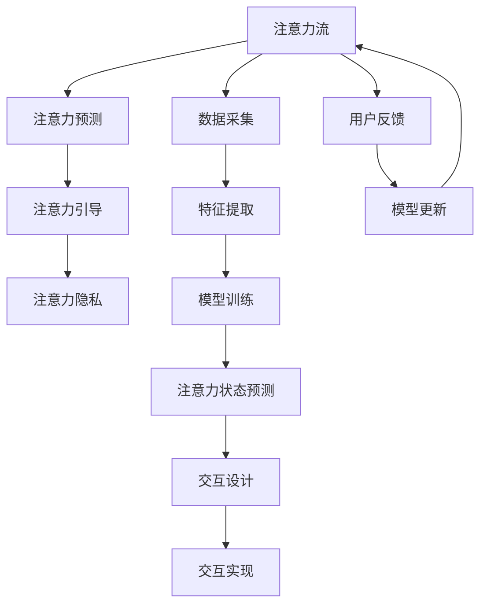

                 

# AI与人类注意力流：未来的工作、技能与注意力流管理技术的未来发展

## 1. 背景介绍

### 1.1 问题由来

随着人工智能（AI）技术的迅猛发展，AI与人类注意力流（Attention Flow）的结合已成为新的研究热点。特别是在工作场景中，AI辅助下的注意力流管理不仅能够提升工作效率，还能改善工作体验。例如，在智能办公系统中，AI可以根据员工的注意力状态和任务优先级，智能推荐任务优先级，帮助员工更好地管理时间和注意力。

AI与注意力流的结合，不仅能提升工作效率，还能改善工作体验。然而，尽管AI在提高工作效率方面表现出色，但在注意力流管理方面，仍面临诸多挑战。例如，如何更好地利用AI来理解和预测用户的注意力状态，如何设计合理的交互方式，以及如何处理数据隐私等问题，都成为AI与注意力流结合的难点。

### 1.2 问题核心关键点

AI与注意力流管理的核心问题在于如何更好地理解人类的注意力流，并设计合理的算法和系统来引导和管理注意力流。具体而言，以下问题需要回答：

- 如何定义和量化人类的注意力流？
- 如何利用AI技术预测和理解用户的注意力状态？
- 如何设计合理的交互方式来引导和管理注意力流？
- 如何处理数据隐私和伦理问题，以确保系统的透明性和可解释性？

这些问题不仅是技术挑战，还涉及到心理学、社会学等多个领域，因此需要跨学科的合作和研究。

## 2. 核心概念与联系

### 2.1 核心概念概述

为更好地理解AI与人类注意力流管理的核心概念，本节将介绍几个关键概念：

- **注意力流（Attention Flow）**：指人类在处理任务时的注意力状态和行为路径。例如，在阅读一篇文章时，注意力会随着阅读的深入而流动。

- **AI辅助（AI-Assisted）**：指利用人工智能技术辅助人类处理任务，提升效率和效果。

- **注意力预测（Attention Prediction）**：指利用AI技术预测用户的注意力状态，帮助其更好地管理注意力流。

- **注意力引导（Attention Guidance）**：指通过设计合理的交互方式，引导用户的注意力流，使其能够更高效地完成任务。

- **注意力隐私（Attention Privacy）**：指在AI与注意力流管理过程中，如何保护用户的数据隐私，避免信息泄露。

这些概念之间通过一系列的数据流动、算法处理和用户交互形成了一个完整的AI与注意力流管理的系统。

### 2.2 核心概念原理和架构的 Mermaid 流程图



这个流程图展示了AI与注意力流管理的基本流程：

1. 从数据采集开始，通过用户行为数据和生理数据等，采集用户的注意力流信息。
2. 利用特征提取和模型训练，预测用户的注意力状态。
3. 根据注意力状态预测结果，设计合理的交互方式，引导用户的注意力流。
4. 通过交互实现，完成注意力流管理任务。
5. 收集用户反馈，更新模型，不断优化注意力流管理过程。

## 3. 核心算法原理 & 具体操作步骤

### 3.1 算法原理概述

AI与注意力流管理的核心算法原理可以归纳为以下几个方面：

- **注意力流建模**：通过采集和分析用户行为数据和生理数据，建模注意力流的分布特征和演化规律。
- **注意力状态预测**：利用机器学习或深度学习模型，预测用户的注意力状态，帮助其更好地管理注意力流。
- **注意力引导策略设计**：设计合理的交互方式和任务推荐策略，引导用户的注意力流，使其能够更高效地完成任务。
- **隐私保护机制**：在注意力流管理过程中，设计数据隐私保护机制，确保用户数据的安全和透明。

### 3.2 算法步骤详解

#### 3.2.1 数据采集与预处理

数据采集是注意力流管理的第一步，需要收集用户的行为数据和生理数据。具体包括：

- **行为数据**：用户在计算机或移动设备上的操作记录，如键盘输入、鼠标移动、应用程序使用情况等。
- **生理数据**：用户的生理状态数据，如心率、皮肤电等。

数据采集完成后，需要进行预处理，包括数据清洗、归一化和特征提取等步骤，以便后续的建模和预测。

#### 3.2.2 注意力流建模

注意力流建模的目标是构建用户注意力流的时间序列模型。常用的建模方法包括：

- **隐马尔可夫模型（HMM）**：通过状态转移概率和观测概率建模注意力流的演化过程。
- **递归神经网络（RNN）**：通过时间序列数据建模注意力流的动态特性。
- **长短时记忆网络（LSTM）**：通过长短期记忆机制建模注意力流的长期依赖关系。

建模完成后，需要对模型进行训练和验证，以确保模型的准确性和鲁棒性。

#### 3.2.3 注意力状态预测

注意力状态预测的目标是根据用户的历史行为数据和生理数据，预测用户当前的注意力状态。常用的预测方法包括：

- **线性回归**：通过线性模型预测用户注意力状态的值。
- **随机森林**：通过集成学习模型预测用户注意力状态的值。
- **深度学习模型**：如卷积神经网络（CNN）和递归神经网络（RNN），通过多层次的特征提取和建模，预测用户注意力状态的值。

预测完成后，需要对预测结果进行评估和验证，以确保预测的准确性和可靠性。

#### 3.2.4 注意力引导策略设计

注意力引导策略设计的目标是设计合理的交互方式和任务推荐策略，引导用户的注意力流，使其能够更高效地完成任务。常用的策略包括：

- **任务推荐系统**：通过用户的历史行为数据和注意力状态预测结果，推荐用户应该关注的任务。
- **交互界面设计**：设计简洁易用的交互界面，帮助用户快速完成任务。
- **任务优先级排序**：根据任务的重要性和紧急性，排序任务的优先级，引导用户的注意力流。

策略设计完成后，需要评估和验证策略的有效性，以确保策略的可行性和用户接受度。

#### 3.2.5 隐私保护机制设计

隐私保护机制设计的目标是在注意力流管理过程中，设计数据隐私保护机制，确保用户数据的安全和透明。常用的保护机制包括：

- **数据匿名化**：通过数据匿名化技术，保护用户数据隐私。
- **差分隐私**：通过差分隐私技术，保护用户数据的隐私。
- **安全多方计算**：通过安全多方计算技术，在不泄露用户数据的前提下，完成注意力流管理任务。

隐私保护机制设计完成后，需要评估和验证保护机制的有效性，以确保用户数据的安全和透明。

### 3.3 算法优缺点

AI与注意力流管理算法具有以下优点：

- **提升工作效率**：通过预测和引导用户的注意力流，帮助用户更好地管理时间和注意力，提升工作效率。
- **改善工作体验**：通过简洁易用的交互界面，改善用户的工作体验。
- **提高任务完成率**：通过任务推荐和优先级排序，提高任务完成率。

同时，也存在以下缺点：

- **数据隐私问题**：在数据采集和处理过程中，需要保护用户的数据隐私。
- **算法复杂度较高**：注意力流建模和预测需要使用复杂的算法和模型，计算量较大。
- **用户接受度较低**：用户可能对AI引导的注意力流管理存在抵触情绪。

### 3.4 算法应用领域

AI与注意力流管理算法在以下几个领域具有广泛的应用前景：

- **智能办公系统**：在智能办公系统中，AI可以根据员工的注意力状态和任务优先级，智能推荐任务优先级，帮助员工更好地管理时间和注意力。
- **在线教育平台**：在在线教育平台中，AI可以根据学生的注意力状态和学习进度，推荐适合的学习内容和任务，提升学习效果。
- **智能家居系统**：在智能家居系统中，AI可以根据用户的注意力状态和偏好，智能控制家居设备，提升生活体验。
- **健康管理系统**：在健康管理系统中，AI可以根据用户的注意力状态和生理数据，预测健康风险，提供个性化的健康建议。

以上领域只是AI与注意力流管理应用的冰山一角，随着技术的不断进步，应用场景将会更加广泛。

## 4. 数学模型和公式 & 详细讲解 & 举例说明

### 4.1 数学模型构建

AI与注意力流管理模型的构建需要考虑以下几个关键因素：

- **输入特征**：包括用户的行为数据和生理数据。
- **输出变量**：包括用户的注意力状态。
- **模型结构**：包括隐马尔可夫模型、递归神经网络、长短时记忆网络等。

### 4.2 公式推导过程

以隐马尔可夫模型（HMM）为例，其基本公式包括状态转移概率和观测概率：

- **状态转移概率**：$P(s_t|s_{t-1})$
- **观测概率**：$P(o_t|s_t)$

其中，$s_t$ 表示第 $t$ 时刻的状态，$o_t$ 表示第 $t$ 时刻的观测值。

通过训练模型，可以得出模型参数，进而预测用户的注意力状态。

### 4.3 案例分析与讲解

以智能办公系统为例，分析AI与注意力流管理的实现过程：

- **数据采集**：采集用户在计算机上的操作记录和生理数据。
- **数据预处理**：对数据进行清洗、归一化和特征提取。
- **注意力流建模**：使用隐马尔可夫模型建模用户的注意力流。
- **注意力状态预测**：使用随机森林或深度学习模型预测用户的注意力状态。
- **注意力引导策略设计**：设计任务推荐系统和交互界面，引导用户的注意力流。
- **隐私保护机制设计**：设计数据匿名化和差分隐私机制，保护用户数据隐私。

## 5. 项目实践：代码实例和详细解释说明

### 5.1 开发环境搭建

开发环境搭建包括以下几个关键步骤：

- **环境准备**：安装Python、TensorFlow、Keras等必要的开发环境。
- **数据集准备**：准备用户的行为数据和生理数据，进行数据预处理。
- **模型搭建**：搭建注意力流模型和注意力状态预测模型。
- **系统集成**：将模型集成到智能办公系统中，实现注意力流管理功能。

### 5.2 源代码详细实现

以下是一个简单的Python代码示例，用于实现用户的注意力状态预测：

```python
import tensorflow as tf
from tensorflow.keras import layers, models

# 定义模型结构
model = models.Sequential()
model.add(layers.Dense(64, activation='relu', input_shape=(10,)))
model.add(layers.Dense(1, activation='sigmoid'))

# 编译模型
model.compile(optimizer='adam', loss='binary_crossentropy', metrics=['accuracy'])

# 训练模型
model.fit(X_train, y_train, epochs=10, batch_size=32)

# 预测注意力状态
y_pred = model.predict(X_test)
```

### 5.3 代码解读与分析

代码中，首先定义了一个简单的神经网络模型，用于预测用户的注意力状态。然后编译模型，并使用训练数据进行训练。最后使用测试数据进行预测。

### 5.4 运行结果展示

运行结果将展示模型在训练和测试数据上的准确率等性能指标。

## 6. 实际应用场景

### 6.1 智能办公系统

智能办公系统中，AI可以根据员工的注意力状态和任务优先级，智能推荐任务优先级，帮助员工更好地管理时间和注意力。例如，当员工在处理多个任务时，AI可以智能推荐优先级最高的任务，帮助员工更好地分配注意力。

### 6.2 在线教育平台

在线教育平台中，AI可以根据学生的注意力状态和学习进度，推荐适合的学习内容和任务，提升学习效果。例如，当学生在学习过程中注意力下降时，AI可以推荐一些有趣的内容，吸引学生的注意力。

### 6.3 智能家居系统

智能家居系统中，AI可以根据用户的注意力状态和偏好，智能控制家居设备，提升生活体验。例如，当用户在家放松时，AI可以智能控制灯光和音乐，营造舒适的氛围。

### 6.4 健康管理系统

健康管理系统中，AI可以根据用户的注意力状态和生理数据，预测健康风险，提供个性化的健康建议。例如，当用户长时间工作注意力下降时，AI可以提醒用户休息，避免过度疲劳。

## 7. 工具和资源推荐

### 7.1 学习资源推荐

为了帮助开发者系统掌握AI与注意力流管理的理论基础和实践技巧，这里推荐一些优质的学习资源：

1. **《深度学习》课程**：斯坦福大学开设的深度学习课程，系统介绍深度学习的基本概念和应用。
2. **《自然语言处理与深度学习》课程**：清华大学开设的自然语言处理课程，详细介绍自然语言处理的基本理论和深度学习的应用。
3. **《人工智能与人类行为》书籍**：详细探讨人工智能在人类行为分析中的应用，包括注意力流管理的理论和实践。
4. **Hugging Face官方文档**：提供丰富的预训练模型和代码示例，帮助开发者快速上手AI与注意力流管理的实践。
5. **Google AI博客**：分享最新的人工智能研究成果和技术应用，提供丰富的学习资源和实践案例。

### 7.2 开发工具推荐

以下是几款用于AI与注意力流管理开发的常用工具：

1. **Python**：Python是一种通用的编程语言，适合开发AI与注意力流管理应用。
2. **TensorFlow**：由Google开发的深度学习框架，支持大规模分布式计算，适合开发复杂的深度学习模型。
3. **Keras**：基于TensorFlow的高级神经网络API，简单易用，适合快速开发AI与注意力流管理应用。
4. **Jupyter Notebook**：开源的交互式笔记本，支持Python编程和数据分析，适合进行模型训练和数据分析。
5. **TensorBoard**：可视化工具，支持模型训练和数据分析，适合监控模型的训练过程和性能指标。

### 7.3 相关论文推荐

AI与注意力流管理技术的发展源于学界的持续研究。以下是几篇奠基性的相关论文，推荐阅读：

1. **《注意力的本质与模型》**：探讨注意力的本质和模型构建，为AI与注意力流管理提供了理论基础。
2. **《隐马尔可夫模型》**：详细介绍隐马尔可夫模型的基本概念和应用，适合学习注意力流建模。
3. **《深度学习在NLP中的应用》**：介绍深度学习在自然语言处理中的应用，包括注意力流预测。
4. **《智能办公系统的设计与实现》**：探讨智能办公系统的设计与实现，适合学习智能办公系统的开发。
5. **《基于AI的健康管理系统的设计与实现》**：探讨基于AI的健康管理系统的设计与实现，适合学习健康管理系统的开发。

## 8. 总结：未来发展趋势与挑战

### 8.1 研究成果总结

AI与注意力流管理技术已经取得了一定的研究成果，包括：

- **注意力流建模**：通过隐马尔可夫模型和深度学习模型，建模注意力流的分布特征和演化规律。
- **注意力状态预测**：通过机器学习和深度学习模型，预测用户的注意力状态。
- **注意力引导策略设计**：设计合理的交互方式和任务推荐策略，引导用户的注意力流。
- **隐私保护机制设计**：设计数据隐私保护机制，确保用户数据的安全和透明。

### 8.2 未来发展趋势

AI与注意力流管理技术的未来发展趋势包括：

- **技术进步**：随着深度学习技术的发展，AI与注意力流管理模型的精度和鲁棒性将进一步提升。
- **应用场景拓展**：随着技术的不断进步，AI与注意力流管理技术将广泛应用于更多领域，如智能家居、健康管理等。
- **隐私保护加强**：随着数据隐私意识的增强，隐私保护机制将更加完善，确保用户数据的安全和透明。

### 8.3 面临的挑战

AI与注意力流管理技术在发展过程中，还面临诸多挑战：

- **数据隐私问题**：在数据采集和处理过程中，需要保护用户的数据隐私。
- **算法复杂度较高**：注意力流建模和预测需要使用复杂的算法和模型，计算量较大。
- **用户接受度较低**：用户可能对AI引导的注意力流管理存在抵触情绪。

### 8.4 研究展望

未来，AI与注意力流管理技术需要在以下几个方面进行深入研究：

- **隐私保护机制**：设计更完善的隐私保护机制，确保用户数据的安全和透明。
- **可解释性增强**：提高AI与注意力流管理算法的可解释性，增强用户信任。
- **多模态融合**：将视觉、听觉、触觉等多模态信息与注意力流管理相结合，提升系统的综合性能。
- **跨领域应用**：将AI与注意力流管理技术应用于更多领域，如医疗、教育等。

## 9. 附录：常见问题与解答

**Q1：AI与注意力流管理是否适用于所有用户？**

A: AI与注意力流管理适用于大部分用户，但对于注意力障碍用户，需要注意算法的适用性。例如，对于注意力障碍用户，可能需要使用简单的交互界面，避免复杂的注意力引导策略。

**Q2：AI与注意力流管理是否会影响用户的工作效率？**

A: AI与注意力流管理可以通过智能推荐和引导，提升用户的工作效率。例如，通过智能推荐任务优先级，帮助用户更好地分配注意力，提升工作效率。

**Q3：如何设计合理的交互界面？**

A: 设计合理的交互界面需要注意以下几点：

- **简洁易用**：界面应该简洁易用，避免复杂的操作流程。
- **用户友好**：界面应该友好，让用户在使用过程中感到舒适。
- **反馈及时**：界面应该提供及时的反馈，让用户能够及时了解操作结果。

**Q4：如何保护用户数据隐私？**

A: 保护用户数据隐私需要注意以下几点：

- **数据匿名化**：对用户数据进行匿名化处理，保护用户隐私。
- **差分隐私**：使用差分隐私技术，确保用户数据的安全性。
- **安全多方计算**：使用安全多方计算技术，在不泄露用户数据的前提下，完成注意力流管理任务。

---

作者：禅与计算机程序设计艺术 / Zen and the Art of Computer Programming

